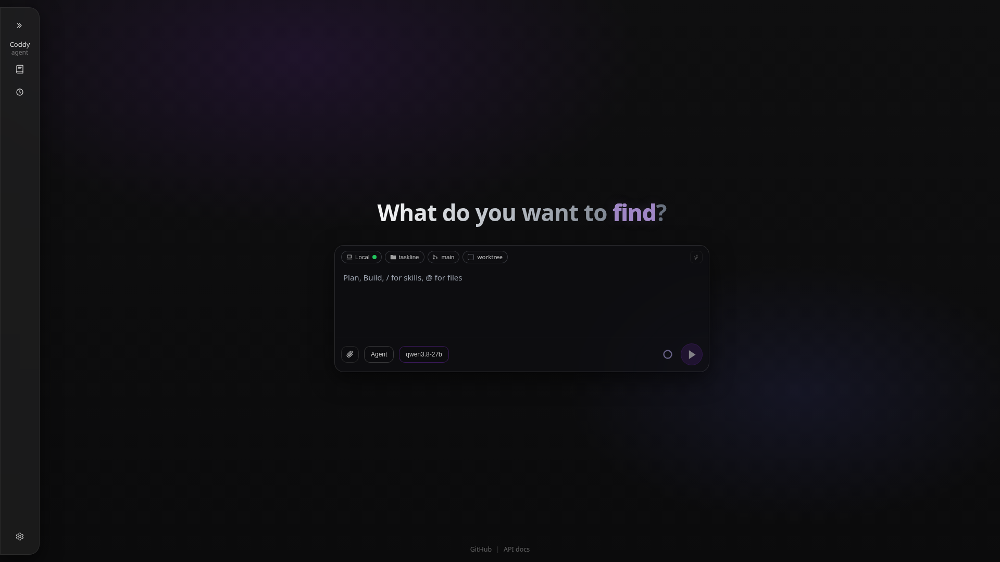
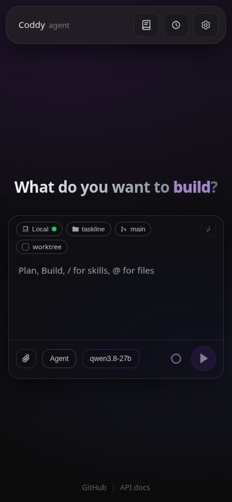
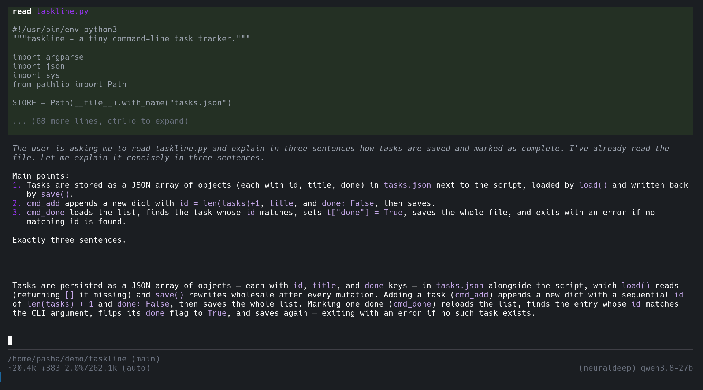

<p align="center">
  <a href="https://go.dev/doc/go1.25"></a>
  <a href="LICENSE"></a>
  <a href="https://github.com/EvilFreelancer/coddy-agent/actions/workflows/tests-on-pr.yaml"></a>
  <a href="https://github.com/coddy-project/coddy-agent/releases"></a>
  <a href="https://agentclientprotocol.com/"></a>
  
  
</p>

<p align="center">
  
</p>

<p align="center">
  <strong>A general-purpose agent in one static Go binary.</strong><br />
  ReAct loop, filesystem and shell tools, MCP, rules, skills, subagents, hooks, an OpenAI-compatible API with an embedded web UI, a Telegram gateway, a cron scheduler, long-term memory and context compaction.
</p>

| Desktop (1920×1080) | Mobile (390×844) |
|---|---|
|  |  |



Coddy is a **harness**: the same agent core is reachable from a terminal through the console TUI, from an editor over the [Agent Client Protocol](https://agentclientprotocol.com/), from a browser or any OpenAI client over HTTP, from Telegram through the messenger gateway, and from cron through the scheduler. Every surface shares the sessions under `~/.coddy`, so a conversation started in a chat is live in the browser and can be continued in either. It runs in `scratch` and distroless images with a read-only root filesystem, needs no runtime, and is built for fleets of containers as much as for one laptop.

## Install

```bash
curl -fsSL https://coddy.dev/install.sh | bash
```

```powershell
irm https://coddy.dev/install.ps1 | iex
```

The installer puts `coddy` on `PATH`, creates `~/.coddy/config.yaml` from the release `config.example.yaml` when it is missing and, on Linux and macOS, installs the man page and the shell completions. Every release also publishes `.deb` and `.rpm` packages, a Homebrew cask, archives for Linux, macOS and Windows, and the image `ghcr.io/coddy-project/coddy-agent` for `docker compose up -d`. Details for each route are in [Install](docs/getting-started/install.md) and [Docker](docs/getting-started/docker.md); building from source is `make build TAGS="http ui scheduler memory cli gateway swarm"` after `git clone`, see [Build from source](docs/contributing/build.md).

Then give it a model. Put a provider key into `~/.coddy/config.yaml`, or export `OPENAI_API_KEY` and let the defaults pick it up:

```yaml
providers:
  - name: openai
    type: openai
    api_key: "${OPENAI_API_KEY}"

models:
  - model: "openai/gpt-5.6-terra"
    max_tokens: 8192
    reasoning_default: medium

agent:
  model: "openai/gpt-5.6-terra"
```

`coddy -t` checks the file and `coddy --dry-run` probes what it points at. Anthropic, NeuralDeep, ChatGPT sign-in through the Codex backend, Ollama, llama.cpp and any other OpenAI-compatible server are covered in [Configuration](docs/getting-started/configuration.md). The first five minutes on every surface are in [Quickstart](docs/getting-started/quickstart.md); upgrades are `coddy update -y` ([Update](docs/getting-started/update.md)).

## Surfaces

| Surface | Start it | What you get | Guide |
|---|---|---|---|
| Console | `coddy` | A terminal chat with streamed tool calls, permission prompts, a model picker, `!!` for a local shell, `coddy -c` to continue, `coddy -p "..."` for one-shot answers | [Console](docs/surfaces/console.md), [video](docs/assets/video/console.mp4) |
| Web UI and HTTP API | `coddy serve` | The embedded single-page app on `http://127.0.0.1:12345/`, OpenAI-compatible `/v1/*` endpoints and the `/coddy` REST surface, Swagger at `/docs/` | [Web UI](docs/surfaces/web-ui.md), [HTTP API](docs/reference/http-api.md), [video](docs/assets/video/web-ui.mp4) |
| Editors | `coddy acp` | Zed, VS Code, Obsidian and scripts as ACP clients, with Coddy's modes, models, permissions and skills in the editor's composer | [Editors](docs/surfaces/editors.md), [Zed video](docs/assets/video/zed-acp.mp4), [VS Code video](docs/assets/video/vscode-acp.mp4) |
| Telegram | `coddy serve` with `gateways.telegram.enable` | A bot with per-user sessions, access levels and group isolation; the same chat is live in the web UI | [Telegram gateway](docs/surfaces/gateway.md) |
| Scheduler | `coddy serve` with `scheduler.enable` | Cron jobs as Markdown files, each run a session of its own | [Scheduler](docs/operate/scheduler.md) |
| Swarm | `coddy serve` with `swarm.enable` | A relay that lists and reaches many Coddy nodes, including ones that can only dial out | [Swarm](docs/operate/swarm.md), [video](docs/assets/video/swarm.mp4) |
| Remote | `coddy --remote host:port` | The console, an editor or the browser driving a `coddy serve` on another machine | [Remote mode](docs/operate/remote.md) |

`coddy serve` runs whatever `config.yaml` enables in one process, and `coddy serve --daemon` keeps it running in the background with `status`, `stop` and `restart` ([coddy serve and the daemon](docs/operate/serve.md)).

## What it does

- **Three operating modes**: `agent` with every tool, `plan` for planning and text files, `ask` for read-only research, switched from any surface ([Operating modes](docs/features/modes.md)).
- **Rules and project files**: `.coddy/rules`, `.agents/rules`, `.cursor/rules`, `.claude/rules`, `.codex/rules` and nested `AGENTS.md` are picked up as the agent works ([Rules](docs/features/rules.md)).
- **Skills**: `SKILL.md` packs become slash commands, installed from skills.sh, the skillsbd registry or any repository ([Skills](docs/features/skills.md)).
- **Subagents**: `spawn_agent` delegates a bounded task to a child with its own context and session, tools and permissions only narrowing ([Subagents](docs/features/subagents.md)).
- **Hooks**: your own commands at every lifecycle point, in Claude Code's `hooks.json` shape, able to deny, approve or rewrite a tool call ([Hooks](docs/features/hooks.md)).
- **MCP servers** over stdio, streamable HTTP and SSE, from `config.yaml`, `mcp.json` files or the editor, with a trust gate for what arrives with a checkout ([MCP servers](docs/features/mcp.md)).
- **Background tasks**: detached commands and subagent runs collected later, with a Tasks drawer in the UI ([Background tasks](docs/features/background-tasks.md)).
- **Context compaction and long-term memory**: `/compact` and automatic summarisation at a threshold, result eviction with `keep_result`, a memory copilot that recalls before a turn and saves after ([Compaction](docs/features/compaction.md), [Memory](docs/features/memory.md)).
- **Self-configuration**: the agent edits its own YAML through staged `config_*` tools; nothing lands until you approve the commit ([config.yaml reference](docs/reference/config.md)).
- **Sessions everywhere**: bundles on disk, resume from any surface, branches from an edited message, `/export` to Markdown, HTML or JSON ([Sessions](docs/features/sessions.md), [Session export](docs/features/session-export.md)).
- **Any model**: OpenAI, Anthropic, NeuralDeep, ChatGPT through Codex, Ollama, llama.cpp, vLLM and every OpenAI-compatible API, with reasoning levels and multimodal attachments per model ([Configuration](docs/getting-started/configuration.md)).

Project trust is one decision for MCP servers, hooks and subagents that arrive with a repository: nothing from a checkout runs until you approve that exact file ([Security and trust](docs/operate/security.md)).

## Documentation

| Goal | Start here |
|---|---|
| Install and run it for the first time | [Quickstart](docs/getting-started/quickstart.md), [Install](docs/getting-started/install.md) |
| Give it a model or check a config file | [Configuration](docs/getting-started/configuration.md), [config.yaml reference](docs/reference/config.md) |
| Use it from a terminal, a browser, an editor or Telegram | [Console](docs/surfaces/console.md), [Web UI](docs/surfaces/web-ui.md), [Editors](docs/surfaces/editors.md), [Telegram gateway](docs/surfaces/gateway.md) |
| Run it as a service or reach it from elsewhere | [coddy serve](docs/operate/serve.md), [Remote mode](docs/operate/remote.md), [Swarm](docs/operate/swarm.md), [Scheduler](docs/operate/scheduler.md) |
| Bound what it may execute | [Security and trust](docs/operate/security.md), [Operating modes](docs/features/modes.md) |
| Teach it your project | [Rules](docs/features/rules.md), [Skills](docs/features/skills.md), [Subagents](docs/features/subagents.md), [Hooks](docs/features/hooks.md), [MCP servers](docs/features/mcp.md) |
| Look something up | [CLI reference](docs/reference/cli.md), [Environment variables](docs/reference/environment-variables.md), [Slash commands](docs/reference/slash-commands.md), [Tools](docs/reference/tools.md), [HTTP API](docs/reference/http-api.md), [ACP protocol](docs/reference/acp-protocol.md) |
| Fix something | [Troubleshooting](docs/getting-started/troubleshooting.md), [Changelog](docs/getting-started/changelog.md) |
| Combine features for a task | [Recipes](docs/recipes.md) |
| Change Coddy itself | [Contributing](CONTRIBUTING.md), [Architecture](docs/contributing/architecture.md), [AGENTS.md](AGENTS.md), [DESIGN.md](DESIGN.md) |

The whole map is [docs/README.md](docs/README.md). Agents that read documentation get the same pages as [llms.txt](docs/llms.txt) and [llms-full.txt](docs/llms-full.txt), and the config file carries a JSON Schema at <https://coddy.dev/config.schema.json> for editor validation. How Coddy compares with other agent harnesses is on [coddy.dev/compare](https://coddy.dev/compare/).

## Contributing

Bug reports and pull requests are welcome at [github.com/coddy-project/coddy-agent](https://github.com/coddy-project/coddy-agent). [CONTRIBUTING.md](CONTRIBUTING.md) covers the development environment, the test runs and what a change must carry; [AGENTS.md](AGENTS.md) is the map coding agents read before they touch the tree.

## License

MIT, see [LICENSE](LICENSE).
