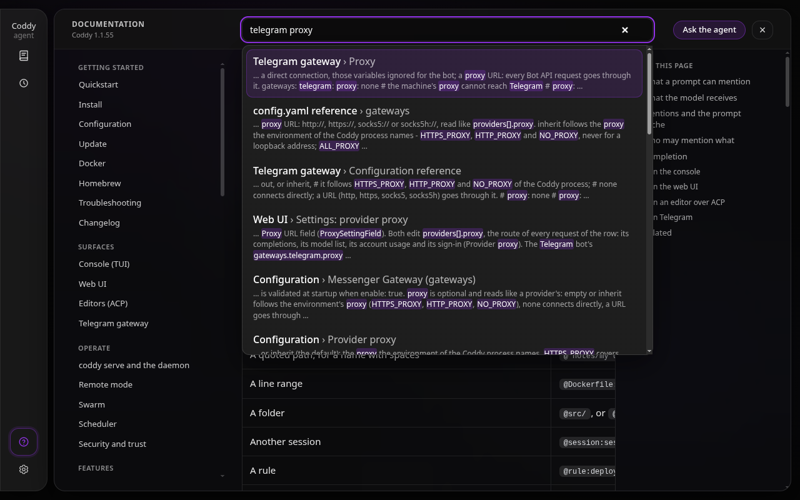
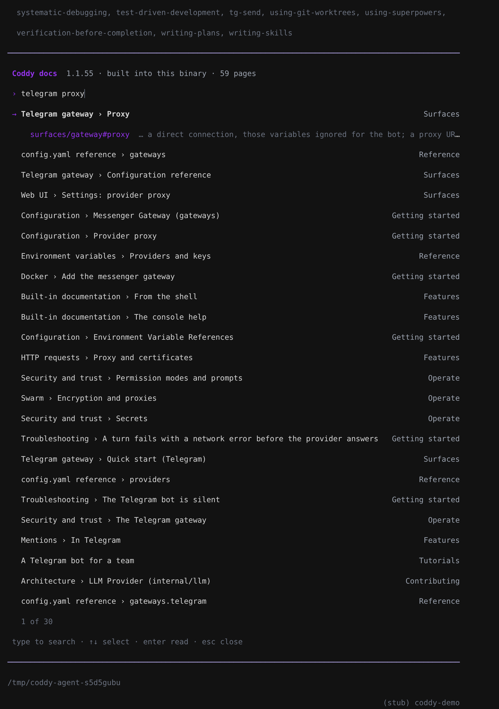
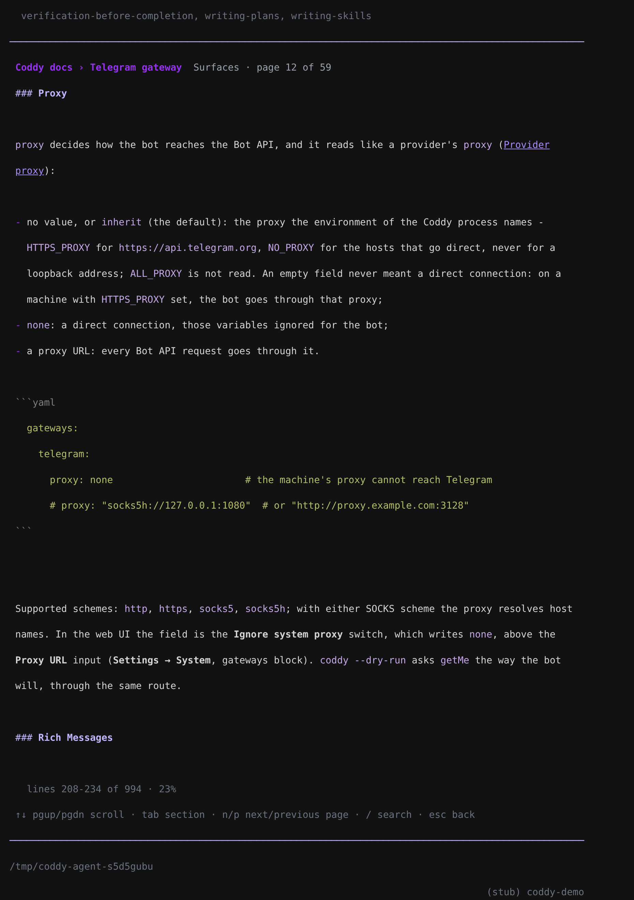

# Built-in documentation

Coddy carries its own documentation. Every page of this documentation is compiled into the binary when it is built, so the pages a person reads and the pages the agent looks up are the documentation of the very binary that runs: no request goes to a site, nothing drifts between the text and the program, and it works on a machine with no network.

The same pages are open from every surface:

| Where | How | What you get |
| --- | --- | --- |
| Web UI | **Docs** in the rail, **F1**, `/docs [words or page]` in the composer, or an address `#/docs/<page>#<section>` | A reader: contents, the page, the sections of the page, search, the page before and after, **Ask the agent** |
| Console | **F1**, or `/docs [words or page]` | A help screen over the editor: search, then the page opened at the section found |
| Shell | `coddy docs list`, `coddy docs search <words>`, `coddy docs show <page>[#section]` | The contents, the best sections, a page or a section as Markdown |
| The agent | the tools `coddy_docs_search` and `coddy_docs_read` | Search and read, in every mode |
| A prompt | `@coddy:<page>#<section>` | The page or the section attached to the message |

## Pages and sections

A page is known by its path under `docs/` without `.md`: `features/mentions`, `reference/config`. That name is its address everywhere - `@coddy:features/mentions`, `coddy docs show features/mentions`, the web reader's `#/docs/features/mentions`, and the public copy at `https://coddy.dev/docs/features/mentions`. A section adds the anchor GitHub gives its heading: `features/mentions#completion`.

Where a page or a section is asked for by name, Coddy also takes the other ways people write it: the file path with or without `docs/` and `.md`, a `coddy:` or `@coddy:` link, a `coddy.dev/docs` address, a page's file name when only one page has it (`mentions`), and a page's title (`Mentions`). A name that matches nothing is answered with the closest pages; a section the page does not have, with the sections it has.

Inside a page read out of the binary, a link to another page is written `coddy:<page>#<section>`. The web reader opens it in place and the agent passes it to `coddy_docs_read`. In the web UI a page named anywhere in a conversation opens the reader: an `@coddy:<page>#<section>` in a message you sent, and a `coddy:` link or an `@coddy:` reference in an answer, which is how the agent is told to point you at a page.

Images, videos and links to files of the repository point at GitHub at the release the binary was built from (`main` for a development build): the text is in the binary, the screenshots and recordings are not, so they show when the machine is online and fall back to their caption when it is not. A recording that GitHub embeds from an attachment plays in the reader from its copy in the repository.

## Search

The search ranks sections, not pages, so a hit lands on the paragraph that answers. It scores each section with BM25 over three fields - the page title, the section heading and the text - with the heading and the title counting more than the text, so a query that names a chapter finds the chapter. Words match regardless of case after a light English stemming (`sessions` finds `session`), an identifier is matched whole and by its parts (`max_turns` and `turns` both find `agent.max_turns`), and a word of three letters or more also finds the words it begins, so a query typed letter by letter finds pages before it is finished. At most three sections of one page are shown, so a long page does not push the others out. Each hit carries a snippet: the run of the section's text holding the most matched words, with those words marked.

The index is built the first time something searches, in about a tenth of a second, and kept for the life of the process.

## The web UI reader


*The reader at 1280 px: the contents with the page being read, the page, the sections of the page with the one being read marked.*

**Docs** in the rail opens the reader on the page it was last left on, **F1** opens and closes it from anywhere in the app, `/docs` in the composer does what it does in the console (`/docs telegram proxy` opens the reader on that search, `/docs features/mentions#completion` on that section, and nothing goes to the agent), and an address such as `#/docs/features/mentions#completion` opens that section directly, in a new tab or from a link someone sent. Every page, section and search result is a real link: the browser's Back and Forward move between the pages read, a middle click opens one in a new tab, and the `#` beside a section heading is that section's address. The header with the search stays put and the page scrolls under it; the column on the right follows the section being read.


*The search box in the header lists the sections found under itself as you type. Up and Down pick one, Enter opens it at its section, Escape clears the search.*

- **Reading like a book.** The foot of every page links the page before and the page after, in the order of the contents.
- **Ask the agent** opens a new chat with the page mentioned (`@coddy:<page>#<section>`, the section being read when there is one). With text selected on the page, the button asks about the selection: the chat opens with the selection quoted and the section it sits in mentioned, ready for the question.
- **Images** open over the page on a click, fitted to the window; `+`, `-` and the buttons zoom up to 300%, a click on the image switches between the fitted and the doubled size, and a zoomed image scrolls. Escape closes it.
- **coddy.dev** above the page opens the public copy of the same page, for sharing with someone who has no Coddy.
- `/` puts the cursor in the search box.

The reader follows the app's theme and language, and on a narrow screen the contents fold into a button above the page.

## The console help


*F1, then `telegram proxy`: the sections found, the selected one with its address and snippet.*

**F1** opens the help in the place of the editor on the contents; typing searches. **Enter** opens the selected entry, scrolled to its section. Some terminals keep F1 for themselves (GNOME Terminal opens its own help); `/docs` opens the same screen, `/docs telegram proxy` with that search, and `/docs features/mentions#completion` straight on that section.


*The page opened at the section: where the reader is on the page, and the keys.*

| Key | In the list | On a page |
| --- | --- | --- |
| letters, Backspace | edit the search | - |
| Up, Down | pick an entry | scroll a line |
| Enter | open it at its section | scroll a line |
| PgUp, PgDn, Space | - | scroll a screen |
| Home, End | - | the top, the bottom |
| Tab, Shift+Tab | - | the next section, the one before |
| `n`, `p` | - | the next page, the one before |
| `/` | - | back to the search |
| Escape | close the help | back to the list |
| F1, Ctrl+C | close the help | close the help |

Images show as their caption. The help reads the binary the console runs, so under `--remote` it shows the console's own documentation, not the server's.

## The agent's tools

The agent reaches for its documentation when a question is about Coddy itself - how to set up the Telegram bot, what a key of `config.yaml` does, which tools ask mode allows - rather than answering from what it remembers:

| Tool | Arguments | Returns |
| --- | --- | --- |
| `coddy_docs_search` | `query`, `limit` (8 by default, at most 20) | The best sections, each with the reference to read, the page and section titles and the snippet |
| `coddy_docs_read` | `page` (a reference, a `coddy:` link or a title; left out for the contents), `offset` | The page or the section, with its reference, its lines and its public address |

Both need no permission and are offered in agent, plan and ask mode, to subagents, and to the built-in `explore` subagent. In the chat a call reads as what it does, with the query or the page beside it: *searching the documentation* and *reading the documentation* in the web UI, *Searching the docs* and *Reading the docs* in the console. A page is read in parts of about 24 KB: a long one ends with the line to continue at and the list of its sections, so the model reads the section it needs rather than the whole page.

## Mentioning a page

`@coddy:` in a prompt attaches a page, or one section of it, to the message:

```text
set this up for me like @coddy:surfaces/gateway#proxy says, the machine needs socks5
```

The page, or the section with its subsections, rides in the message as a `<coddy_attachment kind="doc">` ([Mentions](mentions.md)), up to 64 KiB: a longer reference page arrives as its beginning, with the line to continue at and its sections, and the model reads the part it needs with `coddy_docs_read`. Completion works on every surface: `@coddy:` lists the pages, `@coddy:prox` finds pages by name and sections by their words, and `@coddy:features/mentions#` lists the sections of that page.

## From the shell

```bash
coddy docs                                   # the contents
coddy docs search telegram proxy --limit 3   # the best sections
coddy docs show features/mentions#completion # one section, as Markdown
```

`coddy docs` works in every build, the one without the console included, and needs no configuration. The shell completions offer the pages after `coddy docs show`.

## What the binary carries

The pages of the groups of `docs/nav.yaml` are embedded (`docs/embed.go`); the design records under `docs/plans/`, the images under `docs/assets/`, and the pages the map keeps at the root of the repository (the contributing guide, the web UI design contract, the agent notes) are not. About 1.3 MB of Markdown is added to the binary. A new group folder under `docs/` must be added to the embed pattern: the tests of `internal/docs` fail on a page of the map the binary does not carry.

Implementation: `internal/docs` (the library, sections, search, reading, link rewriting), `internal/tools/docs_search.go` and `docs_read.go`, `internal/session/mentions.go` (`resolveDoc`) and `mention_search.go` (`docCandidates`), `external/httpserver/docs_http.go` (`GET /coddy/docs`, `/coddy/docs/page`, `/coddy/docs/search`, [HTTP API](../reference/http-api.md)), `external/ui/src/ui/docs/`, `external/cli/docs_modal.go` and `cmd/coddy/docs.go`. Specification: `features/builtin_docs.feature`.

## Related

- [Mentions](mentions.md) - the other things a prompt can point at;
- [Tools](../reference/tools.md) - every tool the model can call;
- [Web UI](../surfaces/web-ui.md) and [Console](../surfaces/console.md) - the surfaces the reader and the help live in;
- [Writing documentation](../contributing/documentation.md) - how the pages are written and checked.
