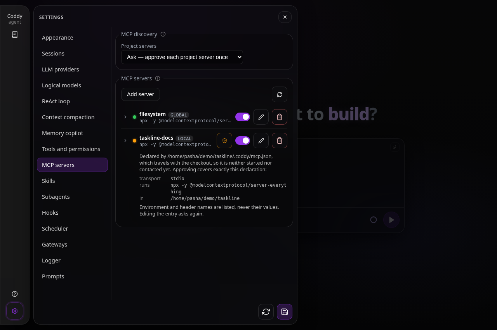

# MCP Server Integration

## Overview

The agent supports connecting to external MCP (Model Context Protocol) servers, which provide
additional tools and resources. MCP servers are declared in two files, and an ACP client can
add its own:

1. **Global** (scope `global`) - the user-global `~/.coddy/mcp.json` (the analogue of
   Cursor's `~/.cursor/mcp.json`; in the agent home, so elsewhere if `CODDY_HOME` or
   `--home` moved it), one running server shared by every session of the process
   ([Shared servers](#shared-servers))
2. **Local** (scope `local`) - `<workspace>/.coddy/mcp.json`, merged over the global list for
   sessions in that workspace, one running server per workspace; a local entry with the
   same name overrides the global definition
3. **Per-session** - provided by the ACP client in `session/new` parameters

`config.yaml` declares no MCP server. It keeps only the `mcp` settings that are not tied to
one server (`project_trust`, `idle_timeout_seconds`), and a config that still has the old
`mcp_servers` list hands it over on its next load ([Moving from
config.yaml](#moving-from-configyaml)).

Tools from all connected MCP servers are merged into the tool list passed to the LLM during
the ReAct loop (in **`agent`** and **`plan`** modes).

## mcp.json (global and local)

Both mcp.json files use the same shape as Cursor's: a single `mcpServers` object keyed by
server name. `env` and `headers` are JSON objects (not the YAML name/value list), and
per-tool switches use `disabledTools`:

```json
{
  "mcpServers": {
    "filesystem": {
      "command": "npx",
      "args": ["-y", "@modelcontextprotocol/server-filesystem", "${CWD}"],
      "env": { "SOME_TOKEN": "value" },
      "disabled": false,
      "disabledTools": ["write_file"]
    }
  }
}
```

A broken `mcp.json` is logged and skipped; the session still starts with the remaining levels.

### Values

A value - the command, an argument, an environment value, the URL, a header - resolves when
the server starts:

- `${CWD}` is the workspace of the session;
- `${NAME}` (or Cursor's `${env:NAME}`) is that variable of the Coddy process, empty when it
  is unset, and `${NAME:-default}` falls back to `default` when it is unset or empty, so a
  token stays out of the file;
- `$${` is a literal `${`, every other `$` is literal (a password with a dollar sign needs
  no escaping), and a leading `~` is the user's home.

The rules are the same in both files and for a server an ACP client sends. The file keeps the
reference, and the approval of a project declaration digests the reference rather than the
value. Since an env or header value is never displayed (the server list shows `<redacted>` in
its place, see [Management API and UI](#management-api-and-ui)), every approval surface names
the variables a declaration reads (`reads: ${AWS_SECRET_ACCESS_KEY}`), so a checkout whose
server would send one of them is seen doing so before it is approved. An
approval records those names too, and one given by an earlier release, when `${NAME}` in a
project file stayed literal, approved a declaration that read nothing: a project server whose
values name a variable is asked about once more, while an approval of one that reads nothing
stays good.

```json
{
  "mcpServers": {
    "github": {
      "command": "npx",
      "args": ["-y", "@modelcontextprotocol/server-github"],
      "env": { "GITHUB_PERSONAL_ACCESS_TOKEN": "${GITHUB_TOKEN}" }
    }
  }
}
```

### Edits made outside Coddy

`coddy serve`, the console and `coddy acp` watch `~/.coddy/mcp.json` and bring the live
sessions in line about two seconds after it changes, whoever changed it: an editor, the
agent with its file tools, another process. Only the servers whose declaration or switch
moved are reconciled, the way a switch in Settings is: a server added starts, one removed
closes, one redeclared starts again from the new declaration, and the others keep their
processes. A tool switch reconnects nothing. A session in the middle of a turn gets a new
server when its next turn starts. A file that does not read, caught mid-write or saved with a
typo, stops nothing: the running servers stay, the log says why, and the next save that reads
is compared with what was running. A change to a project's `.coddy/mcp.json` reaches a
session when it starts, when it switches to that workspace, and when the server is saved,
switched or approved through `/mcp` or Settings.

## Moving from config.yaml

Older releases also read servers from an `mcp_servers` list in `config.yaml`. The first
load of such a file moves the list into `~/.coddy/mcp.json` and takes the key out of
`config.yaml`:

- every server goes into the file under its name, with `env` and `headers` turned into
  objects; a name the file already declares is kept as the file has it;
- every value keeps meaning what it meant in `config.yaml`: an environment reference
  (`${GITHUB_TOKEN}`, or a bare `$GITHUB_TOKEN`) is written as `${GITHUB_TOKEN}`, which the
  file resolves when the server starts, so no secret is written; `${CODDY_HOME}` is
  written out as the home it named, `$$` as a single `$`, and `${CWD}` stays;
- the rest of `config.yaml` stays byte for byte, the comment lines right above the key go
  with it, the old file is kept beside it as `config.yaml.bak-<time>`, and the log names
  the servers that moved and the ones the file already had.

When `~/.coddy/mcp.json` cannot be read, nothing moves: the log says why, and the old list
stays in `config.yaml`, unused, until the file is repaired; a save from Settings keeps it there
as it is. The block ends where the parser puts the next key, so a comment at column 0 among
the items, a list written without indentation or a flow list closed at column 0 goes whole. A
key inside a flow mapping (`{mcp_servers: [...], ...}` on one line) is not a block of lines:
its servers move, the key stays, and the log asks to delete it by hand. A `config.yaml` read
from the workspace because the home has none is never rewritten and its servers never move:
that file may have come with a checkout, and its servers would become yours in every
workspace. `coddy -t` reports a leftover key as a warning saying where the servers go and
writes nothing. The **MCP servers** tab of the web
settings keeps its address, `#/settings/mcp_servers`.

## Workspace trust for project-local servers

Added in response to
[issue #80](https://github.com/coddy-project/coddy-agent/issues/80): before this gate existed,
creating or restoring a session for a checkout ran whatever `<workspace>/.coddy/mcp.json`
asked for, with no trust decision anywhere on the path to `cmd.Start()`.

The project file lives inside the repository, so whoever wrote the checkout picks the
`command`, `args`, and `env` of a process Coddy would start while bootstrapping a session -
before the model runs, before any tool permission prompt exists. Coddy therefore treats
`<workspace>/.coddy/mcp.json` entries as untrusted by default and starts them only after
the operator approves that exact declaration for that workspace.

- `~/.coddy/mcp.json` is operator-authored and is **not** gated;
- the policy is `mcp.project_trust` in `config.yaml`: `ask` (default), `allow` (start
  project servers automatically; only for workspaces you already trust), `deny` (never
  load them, no approval path). `coddy acp` and `coddy serve` also take
  `--mcp-project-trust ask|allow|deny`, which overrides the config for that process only -
  the flag is what a CI job or a container entrypoint uses instead of editing config.yaml.
  An unknown value fails the launch rather than falling back to a default. A changed
  policy reaches the live sessions too: moved to `deny`, it takes the project servers
  away from the sessions holding them, and those servers stop;
- approvals live in `~/.coddy/mcp-trust.json`, keyed by the canonical workspace path and by
  a SHA-256 digest of the command-bearing declaration (transport, command, args, env, url,
  headers). Each record is a receipt naming what was approved - env and header **names**
  and the variables its values read, never their values;
- rewriting an approved entry changes the digest and withdraws the approval, so the next
  session asks again. Enable/disable and `disabledTools` do not: they are operational
  switches, not a trust boundary;
- the gate is re-checked immediately before the process is spawned or the URL is contacted,
  on both the session path and the management probe, so listing servers never starts a
  command that has not been approved;
- every approval surface prints the **effective declaration first**: transport, the command
  with its arguments (or the URL), the **names** of the environment variables and headers it
  carries, the variables of the Coddy process its values read (`${NAME}`, [Values](#values)),
  the workspace the process would start in, and the file it was read from. Values of
  env vars and headers are never printed and never stored in the receipt - the decision is
  about which variables reach the child, not about what is in them. This is deliberately more
  than the name-only prompts of comparable agents: an approval you cannot read is not one.

An unapproved server is skipped with a warning naming the server, the workspace, the digest,
and the command to approve it; the session itself starts normally with the remaining servers.

Approve it on whichever surface you are using:

```bash
coddy mcp list
```

```bash
coddy mcp trust <name>
```

`coddy mcp list` prints each merged server with its scope, its trust state, and the command
it would run; `coddy mcp trust <name>` shows the same detail once more and then records the
approval. `coddy mcp untrust <name>` withdraws it. Both accept `--cwd DIR` to act on a
workspace other than the current directory. Over HTTP the same decisions are
**`POST /coddy/mcp/{name}/trust`** and **`POST /coddy/mcp/{name}/untrust`**, and the bundled
UI shows a shield button plus the declaration under **Settings -> MCP servers**. The policy
itself is edited in that same tab (**`POST /coddy/mcp/project-trust`**), next to the servers
it governs. A server added through the management API or the UI editor is approved by the act
of writing it - the operator typed the command themselves.

Under `allow` and `deny` there is nothing left to decide per server, so the per-server
approval control disappears from the UI entirely: `allow` starts every project server anyway
and `deny` starts none of them. The shield is offered only under `ask`.

Subagent definitions found inside the workspace (`.agents/agents`, `.coddy/agents`) follow the
same model with a **sibling store**: policy `subagents.project_trust` (`ask` / `allow` / `deny`),
receipts in `~/.coddy/subagents-trust.json` keyed by the same canonical workspace path plus the
definition name and a digest of the file, approved with `coddy agents trust <name>` or
`POST /coddy/subagents/{name}/trust`. The two files are deliberately separate so an MCP approval
never reads as an agent approval or the reverse. A child agent that may use MCP tools does not
borrow the parent's connections: configured servers are re-resolved for the child's cwd
**through this trust gate**, exactly as for a new session, and the parent's ACP client-supplied
servers are redialed ungated, as the original connect was. A child whose tool set cannot contain
MCP names (the built-in `explore`) never dials anything. See `docs/features/subagents.md`.

Hook definition files found inside the workspace (`.coddy/hooks.json`, the Claude Code
`.claude/settings.json` and `.claude/settings.local.json`) are the third kind of project-local
content that executes code, and they follow the same model with a third sibling store: policy
`hooks.project_trust` (`ask` / `allow` / `deny`), receipts in `~/.coddy/hooks-trust.json` keyed by
the canonical workspace path plus the workspace-relative file path and a digest of the file,
approved with `coddy hooks trust <file>` or `POST /coddy/hooks/trust`. Under `ask` a held file is
parsed and listed, but none of its hooks runs, and the session records a notice naming the
approval commands. See `docs/features/hooks.md`.

## Enable / disable switches

Both files support switching off a whole server or individual tools without removing their
definitions:

- `~/.coddy/mcp.json` and `./.coddy/mcp.json`: `"disabled": true` and
  `"disabledTools": ["tool_a"]` per entry when editing the declarations directly
- For project entries, switches made through `/mcp` or Settings are stored in
  `<home>/mcp-overrides.json`, keyed by workspace and server. The checkout's
  `.coddy/mcp.json` stays unchanged; these switches override its defaults. Deleting a
  project server through the API or the UI drops its switches once the declaration is gone,
  so a later server of the same name starts from its own declaration, and a delete that
  fails leaves the server switched as it was. While the file cannot be read, every project
  server stays off and the global servers keep their own switches; `/mcp` and Settings
  name the file and the parse error instead of listing the servers until it is repaired.
  This file and `mcp-trust.json` are written under a lock that every process of the home
  takes, so a console and `coddy serve` switching or approving at the same moment do not
  write over each other.

Disabled servers are not connected for new sessions. Disabled tools (and all tools of a
disabled server) are hidden from the LLM's tool list and rejected at dispatch. The switches
are re-read on every agent turn, so toggling them (by editing the files or through the
HTTP API / web UI below) also applies to **already running** sessions on their next turn.

A switch made through `/mcp`, Settings or the HTTP API also reaches live sessions at once,
one server at a time: switching a server on connects it in every live session the trust
gate admits it for, switching it off closes it there, and the other servers keep their
processes, so a browser-automation server keeps its pages open. A global server switched
off stops for the whole process, and switched back on it starts again before any session
asks for it. A tool switch reconnects
nothing. A session in the middle of a turn keeps its tools for that turn: a server switched
off or no longer trusted is closed when the turn ends, and one switched on starts when the
session's next turn starts. Saving or deleting a server through the API or Settings reaches
live sessions the same way, and a server whose declaration was edited is started again from
the new one. A server that does not answer its handshake within 30 seconds does not hold
anything up: it is left out and the session's next turn tries it again.

## Management API and UI

The HTTP gateway (build tag `http`) exposes the merged server list with probed tool
inventories and toggle endpoints under **`/coddy/mcp*`** (see `docs/reference/http-api.md`), and the
bundled web UI shows them under **Settings -> MCP servers**: status dot per server, a
`global` / `local` scope badge, expandable tool list with per-tool switches, and a
Cursor-style JSON editor for mcp.json entries with a scope picker (global writes
`~/.coddy/mcp.json`, local writes `./.coddy/mcp.json`). Global switches persist
into their defining file; project switches persist in the operator's home.

The list names the environment variables and headers of every declaration but never returns
their values: each one reads `<redacted>`, whichever file declared it, and `reads` names the
variables of the Coddy process the values take. The command, its arguments and the URL are
listed as written, since they are what an approval is about, so a secret belongs in `env` or
`headers`, or better in the environment as `${NAME}`. A probe error is cleaned the same way
before it is listed: the URL appears as written, `${NAME}` references included, and a value
the declaration resolves to (an env or header value, a variable it reads, eight characters or
longer) reads `<redacted>` even when the server echoed it back. The console's and Telegram's
`/mcp` show the same cleaned error.

The editor starts from the listed entry, placeholders included. A value left as `<redacted>`
keeps what the file stores, a new value replaces it, and a key removed from the JSON is
removed from the entry; a placeholder for a key the file stores no value for is refused, since
that value has to be typed. A save names the declaration the editor opened by its
`fingerprint` (`PUT /coddy/mcp/{name}?fingerprint=`): when the file holds another declaration
by then, the save is refused (`409`) and nothing is written or approved, so reopen the entry.
A project entry keeps a hidden value only with that fingerprint, which is how a value the
checkout put in the file after the listing is never written back and approved unseen.

If loading or refreshing the list fails, Settings shows the error and leaves any
previously loaded servers visible. Refresh remains available for another attempt.
A failed switch, trust decision, deletion or save reports the error and releases
its control so the operator can retry without reopening Settings. Overlapping
loads are applied in order: a slower in-flight request never overwrites or
reports over the rows a newer one already brought.


*A malformed list response now ends loading and shows the reason.*


*A rejected change leaves the server switch available for another attempt.*

Type `/mcp` in the web composer to open this Settings section; words after the
command are ignored, as in the console. In the console, `/mcp` opens a list of
global and project servers with connection status and tool counts, and `off`
beside a switched-off server whose status is a trust verdict. Enter opens a
server's controls: toggle the server, expand its tools and toggle one, or
grant or revoke trust for a project declaration. The trust control follows the
rule of the web shield and is offered only under `mcp.project_trust: ask`, since
under `allow` and `deny` there is no per-server decision to take. Before it
records trust the console prints the whole declaration above the choice: the
transport, the command line or the URL, the names of its variables and headers,
the workspace and the file. These controls also work in `--remote` mode through
the server's MCP management routes. Telegram `/mcp` lists servers and offers
enable/disable buttons only for already-trusted entries; in a group it needs
the bot's mention (`/mcp@botname`), and a failed tap is reported in the menu message.
Approve project declarations in the console, CLI or web UI; a chat cannot grant
workspace trust.

An approval from the console, the web shield or the remote console names the
declaration it was shown by the `fingerprint` the list reported. When the
checkout rewrote the entry between the listing and the approval, the approval is
refused (`409` over HTTP) and nothing is recorded: list the servers again and
review the new declaration.



*The web `/mcp` command opens the server controls, including project trust and per-server switches.*

## MCP calls in the transcript

The web UI names an MCP call as an action on its server (*calling get_issue on the MCP
server github*) and opens it as a card rather than as JSON: the bar names the server and the
tool, the arguments are fields, and the answer is read by its shape - a JSON object as the
same fields, other JSON indented, Markdown (a heading, a code fence, a list) as a document,
anything else as monospace text. Numbers and JSON are shown as the server wrote them, so
an id past 2^53 (a Discord or Twitter snowflake) is not rounded and a repeated key keeps
both values. A failed call keeps its error as raw text. Only the text
parts of an answer reach the transcript: Coddy passes the `text` content of a
`tools/call` result to the model and drops images and embedded resources. See
[Web UI](../surfaces/web-ui.md) for the card and a screenshot.

## Supported Transports

### stdio (supported)

The MCP server runs as a subprocess. Communication via stdin/stdout (newline-delimited
JSON-RPC 2.0). The subprocess gets a process group of its own, so stopping the server
stops what it started as well ([Shared servers](#shared-servers)).

Coddy runs `command` with `args` exactly as they are written: a program by its path or
by its name on `PATH`, a package runner such as `npx -y <package>` or `uvx <package>`,
a container started with `docker run -i`. What the command needs is the operator's to
provide - Node.js for `npx`, the network for a package that is not in its cache yet -
and Coddy neither rewrites the arguments nor installs anything. A program, an `npx`
package, a streamable HTTP server and an SSE server are each run through a real turn by
`features/mcp_tool_calls.feature` and, in the console, by
`examples/cli/cli_e2e_mcp_servers.py`.

Configuration in `session/new`:
```json
{
  "name": "my-server",
  "command": "/path/to/mcp-server",
  "args": ["--stdio"],
  "env": [
    { "name": "API_KEY", "value": "secret" }
  ]
}
```

In `~/.coddy/mcp.json`:
```json
{
  "mcpServers": {
    "filesystem": {
      "command": "npx",
      "args": ["-y", "@modelcontextprotocol/server-filesystem", "/home/user/projects"]
    }
  }
}
```

### Streamable HTTP (supported)

`type: http` connects to `url` over the
MCP streamable HTTP transport (2025-03-26 spec): JSON-RPC messages are POSTed to the
endpoint and answered as `application/json` bodies or `text/event-stream` chunks; the
`Mcp-Session-Id` issued on initialize is echoed on subsequent requests. `headers` are sent
with every request (e.g. `Authorization`). URL-only entries (no `command`, no `type`)
default to `http`. When the endpoint rejects the handshake (legacy servers answer POST
with 4xx), the client automatically falls back to the legacy SSE transport at the same
URL, mirroring Cursor and Claude Code behavior. The agent advertises
`mcpCapabilities.http: true` and `mcpCapabilities.sse: true`. The `type` value is `stdio`,
`http` or `sse`, and the `streamable-http` / `streamable_http` aliases for `http` are
accepted as well.

```json
{
  "mcpServers": {
    "remote-tools": {
      "type": "http",
      "url": "https://mcp.example.com/mcp",
      "headers": { "Authorization": "Bearer ${MCP_TOKEN}" }
    }
  }
}
```

### SSE (supported, legacy)

`type: sse` forces the 2024-11-05 HTTP+SSE transport: a GET stream at `url` announces the
POST endpoint in its first event and then carries every server-to-client message. Use it
for servers that only implement the older protocol; `type: http` reaches them too via the
automatic fallback.

In `.coddy/mcp.json` the same entries look like Cursor's:

```json
{
  "mcpServers": {
    "remote-tools": { "url": "https://mcp.example.com/mcp" },
    "legacy-tools": { "type": "sse", "url": "https://old.example.com/sse" }
  }
}
```

## Tool Namespacing

To avoid conflicts when multiple MCP servers provide tools with the same name,
tools are namespaced using the server name:

- MCP server `filesystem` providing tool `read_file` -> available as `filesystem__read_file`
- Built-in tool `read_file` -> available as `read_file`

Because `__` separates the server and tool parts, server names must not contain `__`
(the management API rejects such names).

## How tools reach the model

MCP tools are **not** injected into the system prompt text (unlike skills, which render
into a prompt section). They join the built-in tools in the native function-calling
`tools` array of every LLM request, one definition per enabled tool: name
`server__tool`, the server's own `inputSchema`, and the description prefixed with
`[server]` so the model can tell providers apart. When the model emits a tool call whose
name contains `__`, the agent routes it to the owning server over its transport and
returns the MCP result to the model as a regular tool observation - the same loop as
built-in tools, and the same approach Claude Code, Codex, and Cursor use. The end-to-end
happy path (two servers over stdio and streamable HTTP, the model picking one by its
namespaced tool, the result landing in the final answer) is specified in
`features/mcp_tool_calls.feature` for both the OpenAI-compatible HTTP surface and the
ACP session flow.

## Permission Model

Whether a server may **start** is decided by the workspace trust gate above. What a running
server may **do** is not prompted for: MCP tool calls are dispatched without the built-in
permission prompts that guard filesystem writes and shell commands, and the disable switches
are the mechanism for restricting them. Prefer running MCP servers with least-privilege
credentials and disabling tools you do not need.

## Popular MCP Servers

Each entry goes under `mcpServers` in `~/.coddy/mcp.json`, where `${NAME}` reads the
environment.

### Filesystem access
```json
"filesystem": {
  "command": "npx",
  "args": ["-y", "@modelcontextprotocol/server-filesystem", "${CWD}"]
}
```

`${CWD}` is the session workspace when the server starts.

### GitHub
```json
"github": {
  "command": "npx",
  "args": ["-y", "@modelcontextprotocol/server-github"],
  "env": { "GITHUB_PERSONAL_ACCESS_TOKEN": "${GITHUB_TOKEN}" }
}
```

### Postgres database
```json
"postgres": {
  "command": "npx",
  "args": ["-y", "@modelcontextprotocol/server-postgres", "${DATABASE_URL}"]
}
```

### Brave Search
```json
"brave-search": {
  "command": "npx",
  "args": ["-y", "@modelcontextprotocol/server-brave-search"],
  "env": { "BRAVE_API_KEY": "${BRAVE_API_KEY}" }
}
```

## Shared servers

A configured server runs once for the sessions that use it, not once per session. Each
session, and each subagent a session spawns, holds a lease on a connection the process
shares:

- A server of `~/.coddy/mcp.json` is one process for the whole Coddy process. `coddy
  serve`, the console and `coddy acp` start these servers as they start, before any
  session asks for them, and keep them up until they exit: a session that opens finds them
  connected, and one that closes does not stop them. The set follows the file: a server added
  or switched on starts at once, one removed or switched off stops as soon as no session
  holds it, and one that crashed is started again by the next session or turn that needs
  it. A one-shot `coddy -p` starts them for its session and stops them on exit.
- A server of a project's `.coddy/mcp.json` is one process per workspace. The first
  session of the workspace that needs it starts it once the trust gate admits it, and
  the other sessions of that workspace share it. When no session of the workspace holds
  it any more it runs on for `mcp.idle_timeout_seconds` (300, five minutes, by default;
  `0` stops it at once), so a session that opens in the project in the meantime (`/new`
  in the console, a new conversation in a chat, the next run of a scheduled job, the
  same project reopened in the browser) finds it running, and then it is stopped. Two
  workspaces that declare the same command get a process each.
- A global server whose `command`, `args`, `env`, `url` or `headers` contain `${CWD}`
  resolves differently in every workspace, so it runs once per workspace too, like a
  project server, and is not started ahead of the sessions.

The idle timeout is for a server the configuration still wants and no session happens to
hold. A server switched off, one whose approval was withdrawn, one removed from its file
and one declared differently now stop as soon as no session holds them, one already
waiting out the timeout included. The timeout is set in `config.yaml` (the web settings
have no field for it and keep it when they save):

```yaml
mcp:
  project_trust: ask
  # seconds an MCP server no session holds keeps running; 0 stops it at once
  idle_timeout_seconds: 300
```

Sessions share a connection when the declaration resolves to the same thing for them:
the name, the transport, the command line and the environment of a stdio server (or the
URL and the headers of a remote one) and, for a server tied to a workspace, the
workspace. A switched-off tool splits nothing, since every session filters its own tool
list. An edit of the file or a switch reconciles the live sessions as described below, and a
server whose declaration did not change keeps its process through it; a server whose
command line was edited is started once from the new declaration, and the old process
stops when the last session has let it go.

Stopping a stdio server means closing its stdin, the shutdown MCP asks a client for,
giving it two seconds to exit, and then terminating its process group: a package runner
(`npx -y <package>`, `uvx <package>`) starts the actual server as a child of its own,
and that child goes too. On Windows the server runs in a job object that ends every
process of the tree when it is closed, so a child whose parent has already exited goes
as well. A remote server is disconnected: its SSE stream is closed, and a streamable
HTTP session is ended with a `DELETE` that carries its `Mcp-Session-Id`. A call still
waiting for an answer fails at once when its server is stopped.

A shared server that exits on its own, a remote one that drops the connection and a
streamable HTTP server that answers `404` for its session (it restarted, or expired the
session) are started again when the next turn of a session that used them begins, once
for all of those sessions. Listing the servers (`/mcp`, Settings → MCP servers, the chat's `/mcp`)
reads the tools of a running server from its connection and starts no second copy.
The servers an ACP client sends with `session/new` are shared the same way: the
sessions that send the same declaration, a subagent that inherits its parent's servers
included, hold one process, which stops `mcp.idle_timeout_seconds` after the last of them
closes. No trust gate decides on them and nothing keeps them up ahead of a session.

`coddy serve` logs `MCP server started` and `MCP server stopped` with the reason for
every server process it starts and stops, so its log shows how many run and why each
one went away.

## MCP Server Lifecycle

### Selected web session

The MCP Settings tab resolves project-local declarations from the workspace of
the selected session, rather than from the directory that started `coddy
serve`. A request with a selected session uses that session's workspace; a
request with no session keeps the server-default workspace for a new chat.
Project-local switches, trust decisions, and edits refresh only sessions in
that workspace, while global declarations still refresh every affected
session.

Opening a chat in the bundled web UI explicitly starts its deferred configured
MCP servers in the background. This does not delay rendering the transcript,
and the next prompt waits for the bounded connection attempt before receiving
its tool list. Passive reads, including slash completion, MCP Settings lists,
and paged transcript reads, never start a deferred server.

1. On `session/new`, the session takes every enabled server from the merged
   `~/.coddy/mcp.json` + `./.coddy/mcp.json` list that the workspace
   trust gate admits, then connects any ACP client-supplied servers. A configured
   server another session runs already is shared, not started again
   ([Shared servers](#shared-servers)). The servers are
   dialed **concurrently**, each under its own 20-second bound - the servers
   an ACP client sends too, which get no second try since only that client
   can declare them again (a new session does): the call costs
   the slowest server rather than the sum of them, and a server that starts
   and never answers `initialize` - a stdio command as much as a remote URL
   that accepts the connection and stays silent - fails alone, with a
   warning, while the others connect beside it. A session restored from
   disk - reopened by an editor with `session/load`, or read by the web UI or
   a chat - connects its configured servers before its first turn instead,
   through the same gate: reading a stored conversation starts no process,
   where it used to start a set per session that stayed for the life of the
   server. Its ACP client-supplied servers still connect on load. The
   interactive console goes one step further and connects the servers of the
   session it opens, new or resumed, **after its first frame**
   ([Console](../surfaces/console.md)): `coddy` draws at once, the footer
   counts the servers while they come up, and a prompt sent before they have
   answered waits for its tool list on the status line (`Connecting MCP
   servers`)
2. The agent calls `tools/list` on each server and registers the tools
3. An edit of `~/.coddy/mcp.json` while sessions run - in an editor, in Settings, by the
   agent with its file tools - reaches them as [Edits made outside
   Coddy](#edits-made-outside-coddy) says: each server whose declaration or switch moved
   is reconciled on its own, an idle session at once, a session in the middle of a turn
   when its next turn starts. ACP client-supplied servers are not touched
4. A changed `mcp.project_trust` (a settings save, `config_commit`, the policy picker of
   the MCP tab) reconnects the configured
   servers for every active session; ACP client-supplied per-session servers
   stay connected. The reconnect is a **fresh trust evaluation**, not a replay of
   what the session started with: an unapproved project declaration stays cold,
   and one whose approval was withdrawn in the meantime does not come back. A
   session with a **turn in flight** is not swapped mid-turn - that turn already
   handed the model a tool list, so the reload is parked and applied the moment
   the turn releases its lock. All sessions share one deadline per save, and a
   dial it cuts short is discarded rather than installed: a server hanging in
   the session reconnected first must not strip the others of their tools. Those
   sessions keep the servers they have and retry on their next turn
5. Switching the session workspace (`POST /coddy/sessions/{id}/workspace` —
   folder pick, worktree jump, or an in-place branch checkout) re-dials the
   configured servers for the new cwd through the same pending + turn-lock path:
   the new workspace's `.coddy/mcp.json` is merged and freshly gated (a project
   declaration there stays cold under `mcp.project_trust: ask` until approved),
   the previous workspace's configured clients are closed, and ACP
   client-supplied servers stay connected. The endpoint answers `409` while the
   conversation has messages or a turn is in flight, and a failed dial warns and
   continues rather than failing the switch. A switch whose reconnect ran out of time
   is finished when the session's next turn starts, before that turn is handed its
   tools, so it never runs on the previous folder's project servers
6. During the ReAct loop, when LLM calls an MCP tool, the agent forwards the call
   (unless the tool or its server has been disabled since)
7. Results are returned to the LLM as tool observations
8. When a session closes it gives its servers back: a project server, and an ACP
   client-supplied one, stops `mcp.idle_timeout_seconds` after the last session that
   held it let it go, and a global server stays up with the process

The bundled `/configure-coddy` skill tells the agent how to install a server when a user
asks for one: verify the package and what it needs, explain what it would run, and only
after the user agreed add the entry to `~/.coddy/mcp.json` with its file tools, telling the
user the tools arrive with the next turn.

## Error Handling

- If an MCP server fails to start, the session still proceeds with a warning,
  and the server is not dialed again at every turn: an edit of its declaration,
  its switch (`/mcp`, Settings → MCP servers), a changed trust policy or a new
  session tries it again
- A server that starts and never answers `initialize` is given up after 20
  seconds, and the warning names the bound. It is tried once more when the
  session's next turn starts, because a first start can outlast the bound for
  a good reason: `npx -y <package>` installs the package before it runs it
  (16 s for `@modelcontextprotocol/server-everything` on a laptop with an
  empty npm cache), and the next try starts it from the cache. A server that
  does not answer the second time either stays down until one of the above.
  A dial cut short from outside - a save that reconnects many sessions under
  one deadline, a request that ended - is retried at the next turn as well
- What the server's own command does before it answers is up to the
  operator: a package runner such as `npx -y <package>` asks its registry for
  the latest release on every start and waits on the network, and a version
  in `args` (`<package>@<version>`) is what keeps it off the network
- Failed MCP tool calls return an error observation to the LLM
- The LLM can decide to retry, use alternative tools, or inform the user
