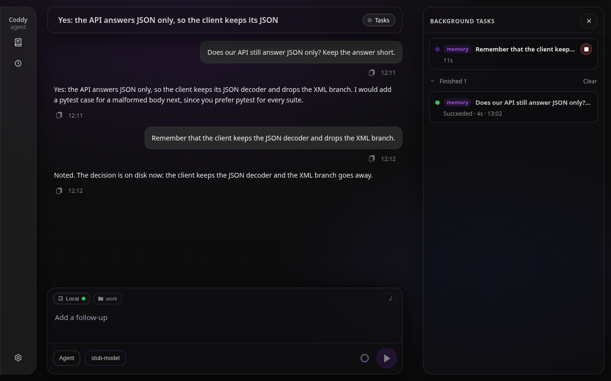
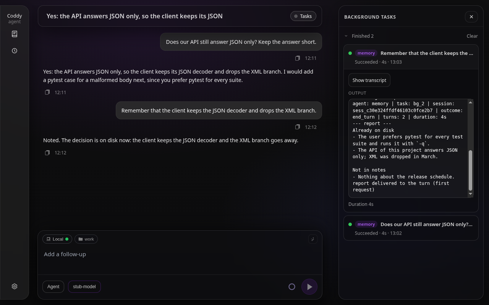
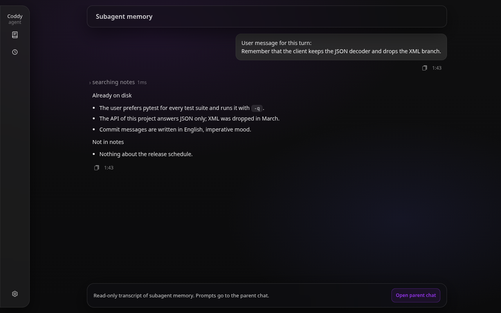
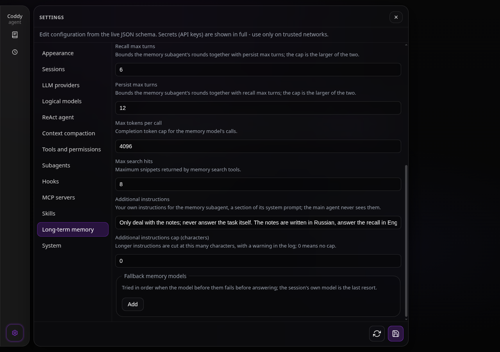

# Long-term memory

In the LLM sense, memory is whatever reaches the context: the chat history is the short-term part, and it ends with the session. Long-term memory in Coddy is a set of markdown and plain-text notes on disk that a dedicated child agent, the **memory subagent**, consults and updates. Every user turn starts one run of it in the background task pool, with its own session bundle, its own transcript and its own task log, the way a `spawn_agent` child runs ([Subagents](subagents.md), [Background tasks](background-tasks.md)). The main agent never sees the memory tools; it sees the child's report as a block in its system prompt, next to the session's own notes, and the notes outlive any session.

## What the memory subagent does

The child gets the user message as its task and a system prompt of its own (`external/memory/prompts/memory_agent.md`, embedded in the binary, so changing it means a rebuild). It chooses one of two modes, never both in the same run:

- **Recall** loads context for the main assistant: it searches the notes, lists folders and reads files, then reports plain facts under `Already on disk` and, optionally, `Not in notes` - no paths, no file names - or exactly `(no memory hits)` when nothing matched. Recall is the default whenever the child is unsure, and it retries with English keywords and a folder listing when a first search finds nothing;
- **Persist** updates the notes when you clearly ask to remember, save, forget or delete something, or when writing durable notes from what you said is the evident intent. It reads existing notes first to avoid duplicates, creates a folder before the first save into it, and reports what it verified, saved, skipped or deleted. Keys, tokens and passwords are never written.

The prompt tells the child that answering your request is the main assistant's job: its report carries only what the notes hold. If you tell it not to consult the notes for this message, it skips recall and answers with one short line. The task text is cut at 32 KiB, the bound a `spawn_agent` prompt has.

The child's last assistant message is the report. It is merged into the `{{.Memory}}` slot of the system prompt template (`agent.md`, `plan.md`, `ask.md`) together with the session notes ([Configuration](../getting-started/configuration.md)); it lives for that turn only and is not written to `session.json`. The main ReAct loop does not receive the `coddy_memory_*` tool definitions and cannot call memory as a normal tool.

## When it runs

Two switches: the binary must be built with the `memory` tag (the release binaries and the Docker image carry it; from source, `make build TAGS="... memory ..."`, see [Build from source](../contributing/build.md)) and `memory.enable` must be true in `config.yaml`. With both, every user turn of an ordinary session starts a run, after the `UserPromptSubmit` hooks accepted the message. A subagent child never gets a memory child of its own, the built-in commands (`/compact`, `/plugin`, `/export`) start none, and a surface that runs turns without a session manager skips memory with a warning in the agent log. Without the tag the memory keys are accepted and nothing runs.

In agent and plan mode the child has the full tool set. In **ask mode** the run is recall-only: the child gets the search, list and read tools, its prompt says that saving is unavailable, and a save it asks for anyway is refused before execution, so a read-only session cannot change what is stored.

The child runs on `memory.model` when that names a configured model, otherwise on the session's model, and always in agent mode with the six memory tools and nothing else: no shell, no filesystem tools, no MCP servers. Its completions are capped at `copilot_max_tokens` and its ReAct rounds at the larger of `recall_max_turns` and `persist_max_turns`. A model that is down or overloaded need not cost the run: `memory.fallback_models` is the chain tried after `memory.model`, and the session's own model is the last resort whether or not it is listed. The chain moves to the next model when a call failed before producing any output (the model is down, unauthorised, out of quota); a stream that broke after text was already delivered follows the ordinary retry policy instead, so no answer is streamed twice ([issue #247](https://github.com/coddy-project/coddy-agent/issues/247)).

The child's system prompt is the template `external/memory/prompts/memory_agent.md`, built into the binary. `memory.additional_prompt` adds a section of your own to it, **Operator instructions**, after the memory role and before the tool list: a place to pin behaviour in your words, such as "only deal with the notes; never answer the task itself", or to name the language the notes are written in. The main agent never sees that text, and ask mode renders it the same way. `memory.additional_prompt_max_chars` cuts a longer text at that many characters, with a warning in the agent log at every launch that reads the cut text and a finding in `coddy -t`; `0` keeps it whole ([issue #266](https://github.com/coddy-project/coddy-agent/issues/266)). The user message itself reaches the child cut at 32 KiB, the bound a `spawn_agent` prompt has.

## The wait and the report

The run is a background task, so the turn does not depend on it. What the turn does is wait, once, for the report:

1. Right after the launch, before its system prompt is rendered, the turn waits up to `memory.wait_seconds` (default 20, never longer than the run's own timeout) for the task to settle. A report that is in by then goes into the `{{.Memory}}` slot, frozen for the turn as every system prompt is. A Stop of the turn ends the wait; the run goes on.
2. A run still going when the wait is over does not hold the turn: the main model starts without memory context. The loop asks the run before every later step, and once the report is in it travels in the `<turn_context>` block appended after the history (see *The turn context block* in [The ReAct agent](../contributing/react-agent.md)), for the rest of the turn. A template under `prompts.dir` that prints the clock or the checklist itself is re-rendered every step and reads the same store through `{{.Memory}}`.
3. A report that lands after the turn ended is not carried into the next turn: a recall answers the message it was asked about, and the next message gets its own run. It stays readable in the Tasks drawer.

`wait_seconds: 0` never waits, so the report can only reach a turn through a later step. A run that failed, timed out, was stopped or produced no final message injects nothing; the agent log and the task record say why. The task log records where the report went: `report delivered to the turn (system prompt)`, `report delivered to the turn (turn context)` or `turn ended before the report`.

A memory model whose account is unauthorised, out of quota or rate-limited cannot hold the turn: a call that fails before any output moves the chain to the next model, and when every model failed the run ends `failed` inside the wait, with the provider's error on the task record. The `finished` update names it in `reason`, the console prints it (`memory: failed after 1.2s (task bg_3) - 402 Payment Required: subscription expired`), the drawer row shows it, and the main model starts without memory context. A rate limit is retried under `agent.llm_retry_max` like any call, and the child never waits for a quota reset: `agent.wait_for_limit_reset` applies to top-level turns only. A model that accepts the connection and then sends nothing is cut by `agent.llm_first_token_timeout_ms` and `agent.llm_stream_idle_timeout_ms`, and the run's own `timeout_seconds` is the last bound ([issue #221](https://github.com/coddy-project/coddy-agent/issues/221)).

## Watching a run

A memory run is an ordinary task of the session, flagged as a **system task**: the Tasks drawer of the web UI lists it with the label `memory: <first line of your message>` and a `memory` badge where a `spawn_agent` child shows `agent`, the detail pane shows its progress log (the tool calls, the child's text, the `=== subagent report ===` block, then the delivery line above) and **Open transcript** opens the child session read-only, with the composer replaced by a link back to the chat. Finished runs stay in the drawer's finished list; `memory.keep_runs` bounds how many a session keeps (default 20, `0` keeps every run): when a run finishes, the oldest beyond that number are removed, task record and child bundle alike. Deleting the session removes its memory children with it.

On the wire the run is one update, `memory_run` (ACP `sessionUpdate`, HTTP SSE event of the same name): `started` with the `taskId` and `childSessionId`, `finished` with the task's `taskStatus`, `durationMs` and `delivered` (whether a non-empty report reached the model in this turn), or `skipped` with a `reason`. `finished` is sent while the turn is running, at the delivery or at the turn's end when the run had already settled; a run that outlives the turn sends nothing more, because the turn's stream is gone. No text travels on it, it is not persisted and not replayed: a client that reconnects mid-run, or one that wants a run the turn did not wait out, reads `GET /coddy/sessions/{id}/background-tasks` ([ACP protocol](../reference/acp-protocol.md), [HTTP API](../reference/http-api.md)). The web UI shows `Working with memory` on its live status line between the two updates and adds nothing to the transcript. The console sets the same status while the turn waits and prints one dim line when the run settles (`memory: recalled in 3.2s (task bg_3)`, `memory: finished in 3.2s, nothing reached this turn (task bg_3)`, `memory: failed after 1.2s (task bg_3) - <error>`, `memory: skipped - <reason>`); the transcript is the child bundle under the session's `subagents/` folder.

The model-facing pool tools do not see the run: `background_list` omits system tasks, and `background_output`, `background_wait` and `background_stop` refuse their ids. A parent that waited on a memory run would stall its own turn on work that was never meant to wake it.



*The Tasks drawer with a memory run in flight: the `memory` badge and the elapsed time*



*The finished run: the child's log, the report block and the line saying the report reached the turn*



*The memory child's transcript opened read-only from the run: the task, the search and the report*

## Bounds

- **Time.** One run is capped by `memory.timeout_seconds` (default 300), which the pool caps by `tools.background.max_timeout_seconds` like every task. Hitting it stops the child and records the task as `timed_out`.
- **Runs in flight.** At most two memory runs per session and sixteen per process may overlap; a run past either bound is skipped with a reason, logged at warn level and sent as `memory_run` `skipped`. Turns of a session are serialised by the turn lock, so overlap only happens when turns end faster than memory runs do.
- **The pool.** A memory run is admitted past `tools.background.max_concurrent` and never counted against it: that cap bounds the tasks the model starts, and a run per turn holding a slot would refuse the model's own `run_command` after a few quick turns. `subagents.max_concurrent` does not count it either.
- **Capabilities.** The child has six tools its parent does not have, the one place a child's tool set does not narrow the parent's: the set is fixed in code, granted only to the system child the runtime creates, never through a definition file, and it touches the two note roots and nothing else. A definition file named `memory` stays legal; the drawer tells the two apart by the badge.
- **Hooks.** `SubagentStart` and `SubagentStop` do not fire for the memory child: they describe delegations the model chose. Inside the child every ordinary event fires for its own turn, and the `subagent` block of the payload carries `"kind": "memory"`, the key to match on ([Hooks](hooks.md)).
- **Exit.** A run stopped mid-persist loses its note. A one-shot `coddy -p` keeps the process alive until its memory run finished, for as long as the run's timeout allows, and says so on stderr after 15 seconds. The console on exit and `coddy serve` on shutdown or restart wait up to 15 seconds for running memory runs before the pool is stopped; a persist longer than that is lost there.

## The tools

| Tool | Arguments | Recall | Persist |
|---|---|---|---|
| `coddy_memory_search` | `query`, `scope` (`global`, `project`, `both`) | yes | yes |
| `coddy_memory_list` | `path` (`global:` or `project:notes`; one level) | yes | yes |
| `coddy_memory_read` | `path` | yes | yes |
| `coddy_memory_mkdir` | `path` | | yes |
| `coddy_memory_save` | `title`, `body`, `scope`, optional `relative_path` | | yes |
| `coddy_memory_delete` | `path` (a file, or a folder with everything under it; never a root) | | yes |

Paths are `scope:relative/path.md` - `global:preferences.md`, `project:architecture/api.md` - and links inside a note body should use the same form (or a Markdown link with such a target) so they stay unambiguous across the two roots. Search ranks every file under the chosen roots by word overlap between the query and the file's path plus body, returns at most `max_search_hits` snippets of up to 1,200 characters, and is meant as an entry point: the child opens the hits with `coddy_memory_read` and follows the links inside. A save without `relative_path` gets a flat file name derived from the title; with it the note lands in that folder.

## Storage layout

| Root | Where | Scope of the notes |
|---|---|---|
| global | `memory.dir`, or `$CODDY_HOME/memory` (`~/.coddy/memory`) when unset; `${CODDY_HOME}` and `~` expand | shared by every session |
| project | `<session cwd>/memory`, not configurable | the workspace the session runs in |

Only `.md` and `.txt` files count. Nested folders are encouraged for thematic grouping, and the child calls `coddy_memory_mkdir` before saving into a new branch of the tree. Both roots are plain directories: they can be edited with any editor, and the project root can be committed with the repository or ignored, as the notes deserve.

## Browsing the notes over HTTP

A binary built with both `http` and `memory` serves the two roots of a session as a tree under `/coddy/sessions/{id}/memory/*`; a plain `http` build answers `404` there.

| Method | Path | Notes |
|---|---|---|
| GET | `/coddy/sessions/{id}/memory/tree` | without `root`, the roots `global` and `workspace`; with `root` and optional `path`, the `.md` and `.txt` children one level down |
| GET | `/coddy/sessions/{id}/memory/file` | `root` and `path`; UTF-8 content |
| PUT | `/coddy/sessions/{id}/memory/file` | `{"root","path","content"}` |
| POST | `/coddy/sessions/{id}/memory/dir` | `{"root","path"}` creates a folder |
| DELETE | `/coddy/sessions/{id}/memory/file` | `root` and `path`; a file, or a folder recursively; `400` for the root itself |

`workspace` is the project root of that session's cwd. Traversal outside a root is rejected. The session's own notes (`agentMemory` in `session.json`) are not editable here. These routes are the contract written down under [Long term memory](../surfaces/web-ui.md#long-term-memory) in the web UI notes; the memory keys themselves are the **Long-term memory** section of the web UI's Settings.

## Configuration

```yaml
memory:
  enable: false
  model: ""                # models[].model for the memory subagent only; empty = the session's model
  fallback_models: []      # tried in order when the model above them fails before answering
  dir: ""                  # global root; empty = ${CODDY_HOME}/memory
  wait_seconds: 20         # how long a turn waits for the report before its first model call; 0 never waits
  timeout_seconds: 300     # hard limit of one run
  keep_runs: 20            # finished runs kept per session; 0 keeps all
  recall_max_turns: 6      # the child's round cap is the larger of the two
  persist_max_turns: 12
  copilot_max_tokens: 4096 # completion cap of the memory model's calls
  max_search_hits: 8
  additional_prompt: ""    # your own instructions for the memory subagent only; the main agent never sees them
  additional_prompt_max_chars: 0 # cut that text at so many characters (a warning is logged); 0 keeps it whole
```

| Key | Default | Meaning |
|---|---|---|
| `enable` | `false` | run the memory subagent at all (needs the `memory` build tag) |
| `model` | `""` | pin the child to one `models[].model`; the main agent is unaffected |
| `fallback_models` | `[]` | tried in order when the model above them fails before answering; the session's own model is the last resort whether or not it is listed |
| `dir` | `""` | the global root |
| `wait_seconds` | `20` | how long a turn waits for the report before its first model call; `0` never waits, and the wait is never longer than `timeout_seconds` |
| `timeout_seconds` | `300` | hard limit of one run, capped by `tools.background.max_timeout_seconds` |
| `keep_runs` | `20` | finished memory runs kept per session, task record and child bundle alike; `0` keeps every run |
| `recall_max_turns`, `persist_max_turns` | `6`, `12` | bound the child's ReAct rounds; the effective cap is the larger of the two |
| `copilot_max_tokens` | `4096` | completion cap for the memory model's calls |
| `max_search_hits` | `8` | snippets returned by `coddy_memory_search` |
| `additional_prompt` | `""` | your own instructions for the memory subagent, rendered as its **Operator instructions** section; the main agent never sees them |
| `additional_prompt_max_chars` | `0` | cut `additional_prompt` at that many characters, with a warning in the agent log and a `coddy -t` finding; `0` keeps it whole |

The field table is in the [config.yaml reference](../reference/config.md#memory); `config.example.yaml` carries the same block with comments. The web UI edits the same keys under **Settings → Long-term memory**.



*Settings → Long-term memory: the operator's additional instructions and their cap, next to the wait, the timeout and the runs kept*

## Cost and latency

Every user turn with memory on is a second model conversation: the child's own system prompt (the template, the environment block, six tool definitions) and its rounds, one model call at least, more when it uses tools. The turn is delayed by the wait at most, never by the run: a persist that takes longer finishes in the background. Pinning a small, fast model with `memory.model` keeps the cost of recall low and the report inside the wait, while the main agent stays on the model you chose for it.

## Testing

- `features/memory_subagent.feature` (harness `internal/agent/bdd_memory_test.go`, `-tags memory`): the run in the pool and the child bundle, the report in the first system prompt, a late report in the turn context, the recall-only child of ask mode, a persist, the isolation of the parent's stream, the fallback chain, a Stop during the wait, retention and the pool cap. `features/memory_http.feature` (`external/httpserver/bdd_memory_http_test.go`, `-tags http,memory`): the system task row and the read-only child transcript over REST.
- Unit tests: `external/memory/agent_test.go` (the template, the task bound, the tool sets), `external/memory/storage/storage_test.go` (search, nested writes, traversal, deletion, link targets), `external/memory/tools/register_test.go` (the tool definitions), `internal/agent/memory_run_test.go` (the in-flight bounds, the wait, the token clamp, the templated prompt, the turn context section), `external/httpserver/memory_http_test.go` (traversal over REST).
- `examples/acp/acp_e2e_memory.py`, `examples/httpserver/http_e2e_memory.py` and `examples/cli/cli_e2e_memory.py` drive a real model: a pre-seeded global note is recalled and shapes the reply, a `remember` turn persists a note, the ACP harness then asks for that fact in a fresh session so the answer can only come from disk, and the run's record is checked where the surface shows it (the `memory` task row over HTTP, the child bundle under `<session>/subagents/` for ACP and the console).
