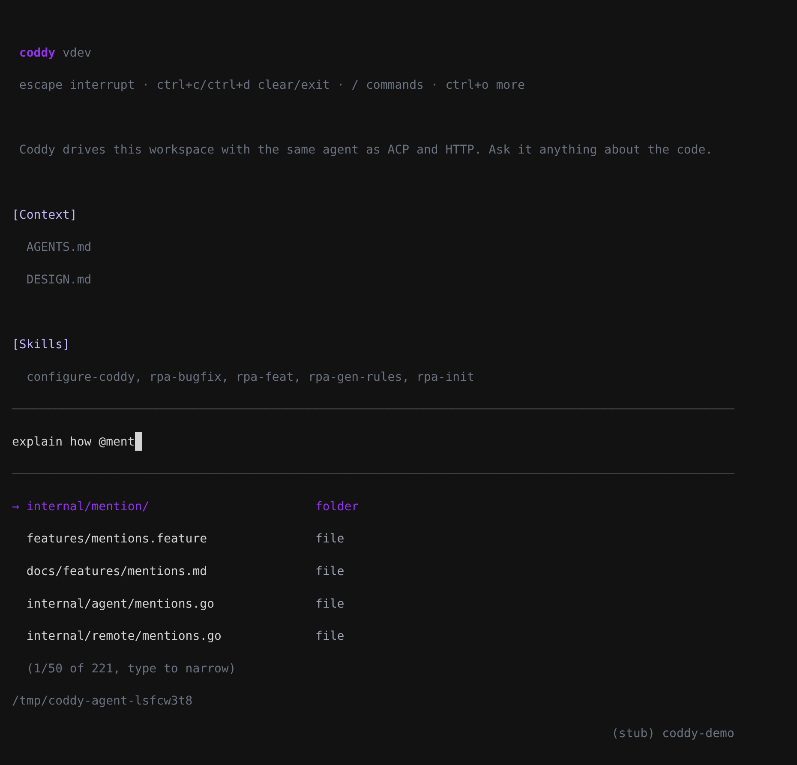
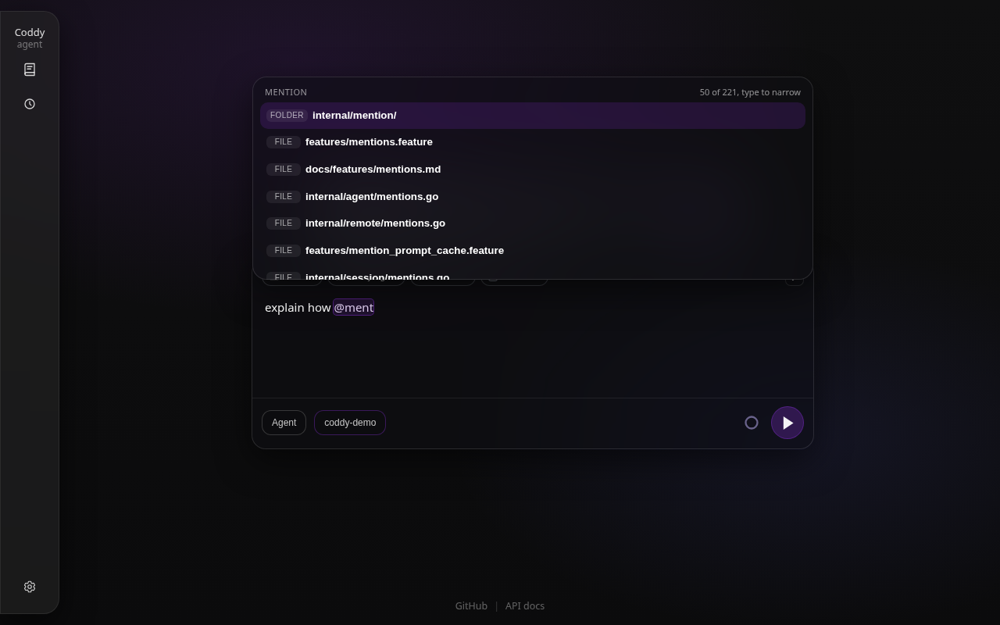
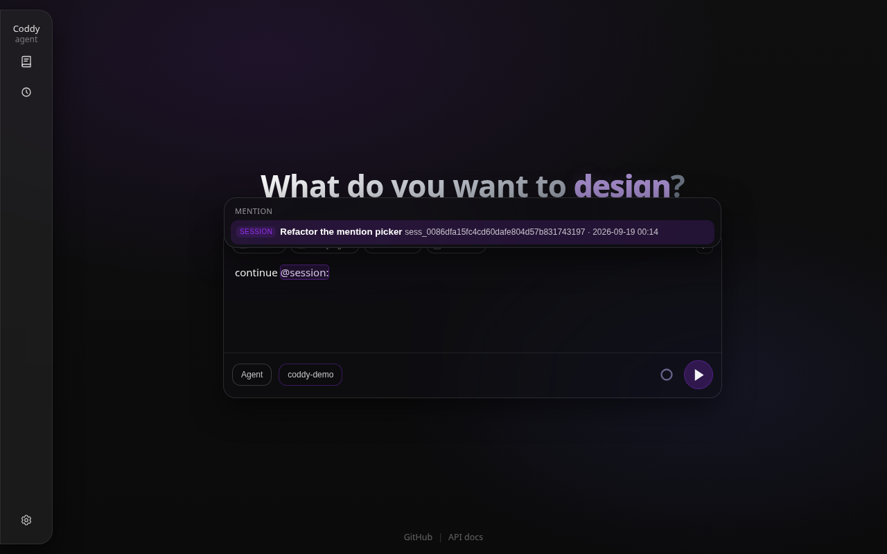

# Mentions

An `@` in a prompt points the agent at something: a file, a line range, a folder, another session, a rule, a subagent, a web page. Every surface reads the same grammar - the console, the web UI, an editor over ACP, the Telegram bot - and the server resolves each mention **once, when the message is sent**, into an attachment that rides in that same message. The model reads the attachment together with the text that named it, and later turns replay the message exactly as it was sent.

## What a prompt can mention

| Written as | Example | The model gets |
| --- | --- | --- |
| A path in the workspace | `@src/app.go` | the file's text |
| An absolute path, a path under home, a path above the workspace | `@/etc/hosts`, `@~/notes.md`, `@../api/schema.sql` | the file's text, named by its absolute path |
| A quoted path, for a name with spaces | `@"notes/my draft.md"` | the file's text |
| A line range | `@Dockerfile:21-31`, `@f.go#L21-31`, `@f.go#L21`, `@f.go#21-31` | only those lines, labelled `lines="21-31"` |
| A folder | `@src/`, or `@src` when it is a folder | the folder's listing |
| Another session | `@session:sess_3e23…` (an id or a unique prefix of one) | a digest of that session |
| A rule | `@rule:deploy`, or `@deploy` for a mention-only rule | the rule's body |
| A subagent | `@agent:explore` | an instruction to hand the work to that subagent with `spawn_agent` |
| A page of Coddy's documentation | `@coddy:features/mentions`, `@coddy:surfaces/gateway#proxy` | the page, or that section of it ([Built-in documentation](built-in-docs.md)) |
| A saved design plan | `@plans/auth-refactor.plan.md` | the plan document in ask mode; in agent mode the plan runs ([Modes](modes.md)) |
| A web page | `@https://go.dev/doc/effective_go` | the page as Markdown (JSON pretty-printed, plain text as it is) |

A mention starts at an `@` that opens a line or follows whitespace, an opening bracket or a quote, so `user@example.com` is not one. Inside a fenced code block, an inline code span (`` `@Override` ``) or a quoted line (`> ...`) an `@` is prose.

An `@` that names nothing on disk is not a mention either: `npm install @google/genai` names a package, and unless the workspace holds a `google/genai`, nothing is attached and the web composer does not highlight it.

Where a mention typed in prose ends is not always obvious: `@README.md.` may be a file named `README.md.` or `README.md` at the end of a sentence, and `@notes draft.md` a name with a space or a file followed by a word. The grammar lists every reading, longest first, and the one that exists on disk wins. A mention that names nothing - `@username` in a chat, a path that is not there - stays prose and attaches nothing.

Windows paths (`@C:\Users\me\x.txt`) and scoped package folders (`@node_modules/@types/node/index.d.ts`) read as paths. The grammar lives in `internal/mention/grammar.go`; the web composer highlights with a twin of it (`external/ui/src/ui/skills/draftAt.ts`), and both are held to the same cases (`internal/mention/testdata/grammar_cases.json`).

## What the model receives

Each resolved mention becomes a `<coddy_attachment>` element after the text of the message, with the body in CDATA:

```xml
look at @src/app.go:3-5 and @session:sess_3e23

<coddy_attachment path="src/app.go" name="app.go" lines="3-5">
<![CDATA[func main() {
    println("hi")
}]]>
</coddy_attachment>

<coddy_attachment path="session:sess_3e23" name="Refactor auth" kind="session">
<![CDATA[Session sess_3e23 - "Refactor auth"
Workspace: /home/me/project
...]]>
</coddy_attachment>
```

`kind` names what the attachment is when it is not a file (`directory`, `session`, `rule`, `agent`, `plan`, `skill`, `url`, `doc`). `mention` is the mention as it was typed when that differs from `path` - `~/notes.md` for `/home/me/notes.md` - and it is what a transcript collapses the attachment back to: the web UI, a console that reopens the session and an editor that loads it show `@~/notes.md` where the message was typed, never the file body.

What each kind carries:

- **A file** is inlined up to 512 KiB, decoded from its encoding (Windows-1251 and other legacy charsets become UTF-8). A larger file without a range is attached as a note that names its size and asks the model to read the part it needs with the `read` tool or to mention a range; a range reads up to 64 MiB of the file to find its lines, so `@big.log:1200-1300` works on a log far larger than the inline cap. A binary file, a range past the end of the file and a file that cannot be read are attached as a note saying so. None of these fail the turn.
- **A folder** is listed breadth first - the top levels whole, then deeper ones while the listing has room - up to 400 entries, with folders whose contents were cut marked. The folder is read when the message is sent, so one written a moment before is listed whole. Inside a git checkout the listing leaves out what `.gitignore` leaves out; a folder outside any checkout, or one git ignores as a whole, is walked four levels deep, skipping hidden folders, version-control folders and dependency caches (`node_modules`, `.venv`, `__pycache__`, ...).
- **A session** is a digest of at most 24 KiB: the title, the workspace, when it ran, its compaction summary when it has one, then its latest messages (the user's text and the assistant's answers; tool results are left out and a line names the tools each answer called), plus the path of its full transcript for anything the digest cut. It is context from another conversation, not instructions for this one.
- **A rule** carries its body and the path of its file.
- **A documentation page** is the page as the binary carries it, or with `#section` that section and its subsections, up to 64 KiB: every guide fits whole, and a long reference page (the HTTP API, the web UI specification) arrives as its beginning with the line to continue at and its sections, for the model to read the part it needs with `coddy_docs_read`. The page name takes the spellings [Built-in documentation](built-in-docs.md#pages-and-sections) lists (`@coddy:mentions` finds `features/mentions`); a trailing `.`, `/` or `#` ends the mention, and a page or a section that does not exist stays prose.
- **A subagent** is an instruction: delegate the part of the request meant for it with `spawn_agent`. In ask mode, or for a project definition that awaits approval, the attachment says why it cannot be spawned.
- **A web page** is fetched when the message is sent, through the webfetch tool's transport and address guard: public addresses only, every redirect vetted, 20 seconds, 64 KiB of text. A page that cannot be read is attached with the reason.

## Mentions and the prompt cache

A provider caches a request by its prefix, and the system message opens every request. A mention must never move what came before it, so:

- A mention is resolved once, when its message enters the conversation, and the message is persisted with its attachments. A later turn replays it byte for byte; a file edited afterwards does not rewrite an old message - mention it again to show the model the new version.
- A rule never enters the system prompt because of a mention. A rule the user names rides in the user's message, and so does a rule a mentioned path activates - a glob rule whose patterns match the file, the `AGENTS.md` and `DESIGN.md` of the folders down to it. While that message is in the model's view the system prompt leaves those rules out; a compaction that folds the message into its summary brings them back ([Rules](rules.md)).
- A skill invoked as `/name` writes its body into the message that invoked it, once, instead of being added to whichever message happens to be the last one.

`features/mention_prompt_cache.feature` holds the story: a turn that mentions a file, names a rule and invokes a skill, then a second turn - every request of both opens with the same system message, and the second turn replays the first turn's message unchanged.

## Who may mention what

| Mention | An operator's prompt | A queued follow-up | A subagent's task (written by the parent model) | A Telegram chat |
| --- | --- | --- | --- | --- |
| Files, folders, ranges, rules, documentation pages | yes | yes | yes | yes |
| Subagents, plans, web pages | yes | yes | no | yes |
| Other sessions | yes | yes | no | no |

A messenger chat does not reach into other sessions: the people in a chat are not the owner of every other session on the host. A turn a finished background task started (`notify_on_finish`) resolves nothing - its prompt is Coddy's own report, not text anybody typed.

A path outside the workspace is read with the same reach the `read` tool has: a mention is the operator pointing at a file, and it needs no permission the model's own read would not.

## Completion

The candidates come from one search every surface shares (`GET /coddy/mentions`, `session.Manager.SearchMentions`): the files and folders of the session's workspace ranked against what was typed - the file name first, then path segments, then letters in order, so `@targhand` finds `zz/deep/target_handler.go` - merged with the rules, subagents and plans whose names match. A query that starts with `/`, `~`, `./`, `../` or a drive letter browses that folder instead, filtered by the name typed after its last separator. `@session:`, `@rule:` and `@agent:` list that kind; `@coddy:` lists the pages of the documentation, finds pages by name and sections by their words (`@coddy:prox`), and after `@coddy:<page>#` the sections of that page. An empty `@` offers those four first, then the top of the workspace.

The workspace index comes from `git ls-files` inside a git checkout (so `.gitignore` decides and dotfiles such as `.github/workflows/ci.yml` stay reachable) and from a walk elsewhere that skips hidden folders and dependency caches, capped at 50,000 entries. It is rebuilt when a mention starts, so a file written a moment ago - by you or by the agent - is offered, and a deleted one is gone.

### In the console

Typing `@` opens the list under the editor. It narrows as you type, **tab** or **enter** takes the highlighted row, **escape** closes it. A folder or a scheme row keeps the list open on what it holds; a file ends the mention with a space. A path with a space is inserted quoted; for a folder the closing quote goes in ahead of the cursor, so the text names the folder even if no file follows. When the search matched more than the list holds, the scroll line says so: `(3/50 of 1204, type to narrow)`. **tab** on a word without `@` completes it as a path.



*`@ment` in this repository: the folder whose name matches first, then the files, each row naming its kind; the scroll line says the list holds 50 of 221 matches*

In remote mode (`coddy --remote`) the list comes from the server, where the session runs and where its mentions will be read, not from the folder the console was started in.

### In the web UI

The composer's picker shows each candidate with its kind - file, folder, session, rule, subagent, plan; an empty `@` shows the session's recent picks first. The arrow keys move the highlight, **enter** or **tab** takes it, and it works while a turn runs, so a follow-up can mention a file too. A cut list says how many matched, on the title row. Typing `:` after a file opens the [line-range picker](../surfaces/web-ui.md#line-ranges-pathn-m).



*`@ment`: the workspace ranked against the fragment, the kind on every row, the cut on the title row*



*`@session:` lists the other sessions, this workspace's first, with a title, an id and when they last ran; picking one attaches a digest of its latest messages*

The composer sends its text as typed: the server resolves the mentions, so a draft means the same thing in the browser as in the console. It highlights a mention only once the server has said sending would attach it (`POST /coddy/mentions/check`, the same resolver run without reading anything), over exactly the part that resolves: `@google/genai` in `npm install @google/genai` stays plain text, and in `compare @src/a.go b.go` only `@src/a.go` is marked.

### In an editor over ACP

An editor such as Zed has a mention menu of its own and sends what was picked as ACP content blocks. A `resource` with text is attached as sent (Zed includes unsaved edits); a `file://` resource named with a line fragment - `#L10-20`, `#L10:20`, `#L10` - carries those lines, and a query such as `?symbol=` is dropped. A `resource_link` to a local file or folder is read like a mention of it; a link Coddy cannot open (an editor-internal URI) reaches the model as a line naming it. Mentions typed as text resolve like everywhere else. See [ACP protocol](../reference/acp-protocol.md).

### In Telegram

Type the mention; the bot's own `@name` is removed before the prompt is read.

## Related

- [Rules and instructions](rules.md) - mention-only rules and the rules a mentioned path activates.
- [Message queue](message-queue.md) - a follow-up's mentions resolve when the agent reads it.
- [Web UI](../surfaces/web-ui.md), [Console](../surfaces/console.md), [HTTP API](../reference/http-api.md) - the surfaces and `GET /coddy/mentions`.
