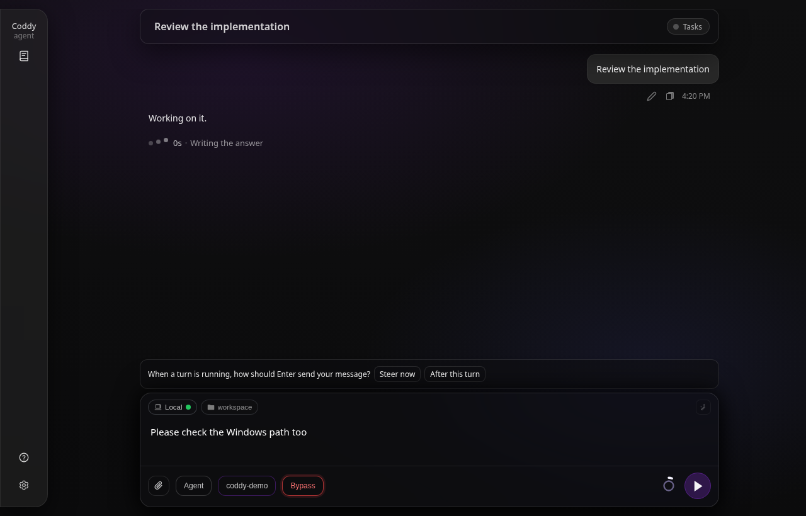
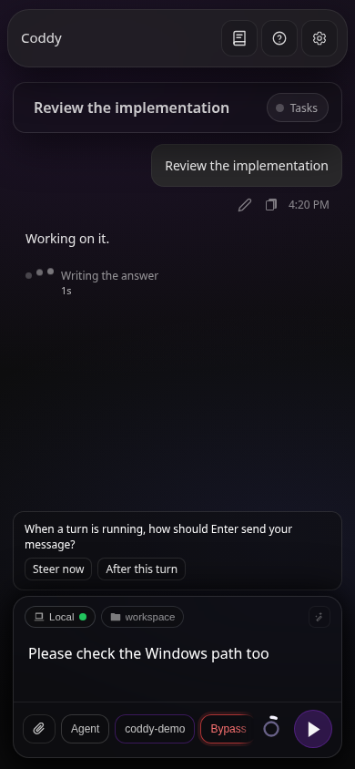
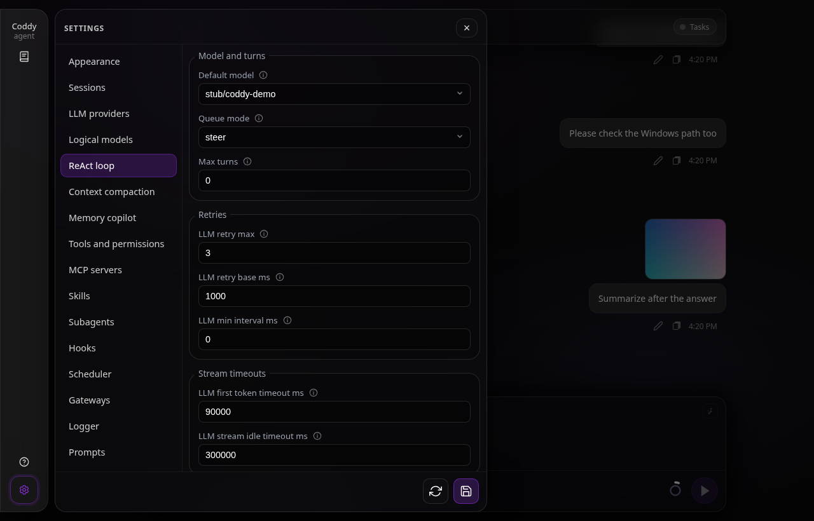
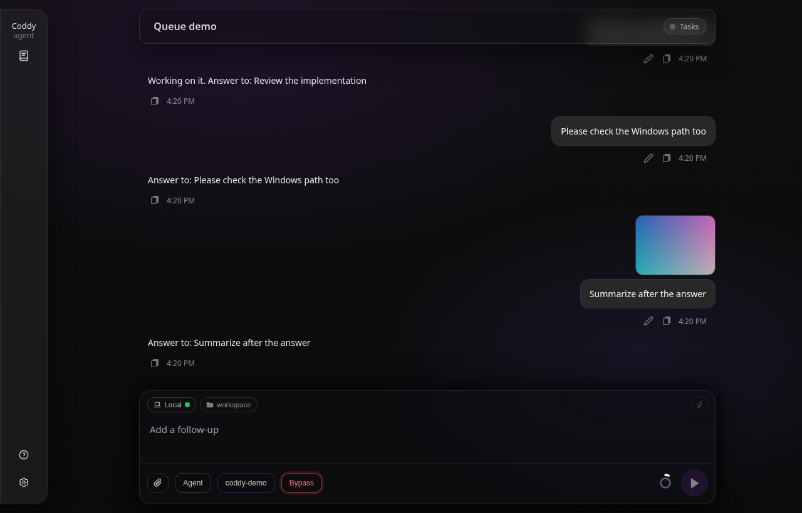
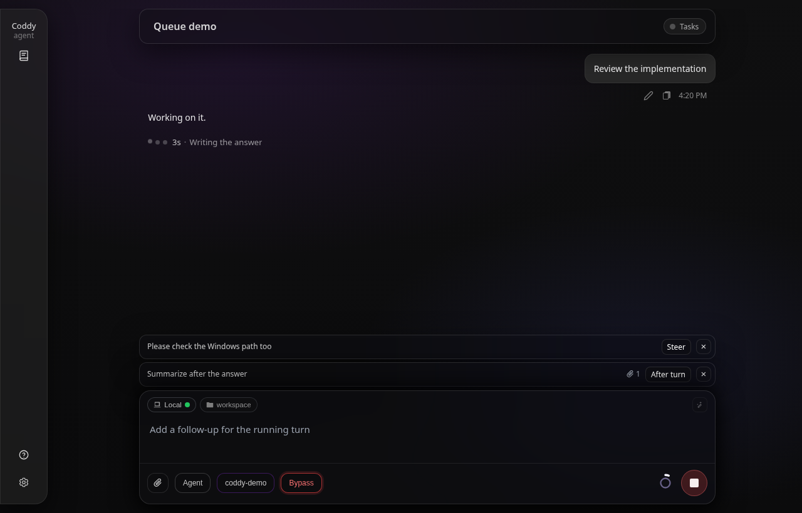
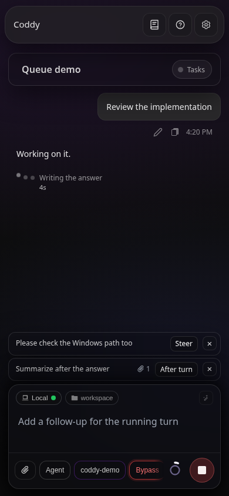
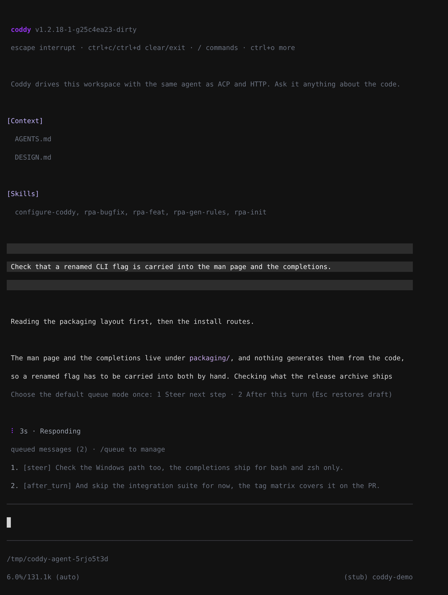
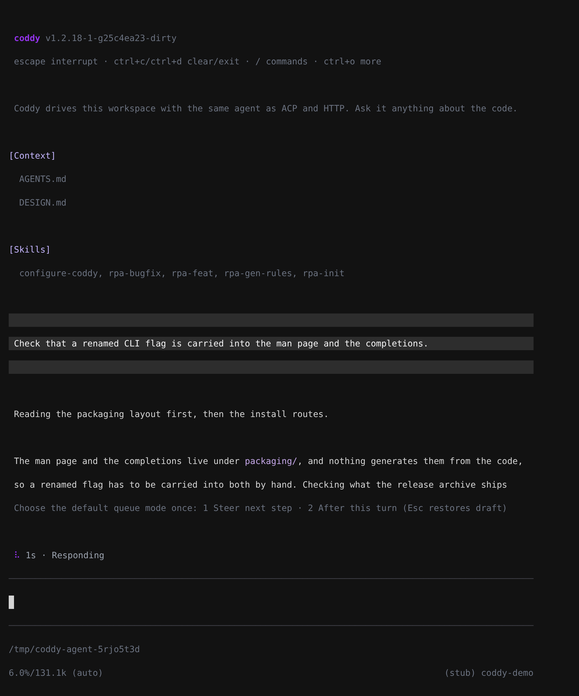

# Message queue

The moment an operator knows most about what the agent should do next is while it is working: the tool call that read the wrong file, the platform nobody mentioned, the constraint that only becomes obvious once the plan is on screen. So a message written **during** a turn is not refused. It waits on the session in one of two modes:

- **Steer** enters the running turn at its next ReAct step, between the tool calls the model just made and the request that follows them. The correction lands while the work is still happening.
- **After turn** waits for the answer and then starts a prompt of its own. Several deferred messages run one at a time, in the order they were queued.

The first time you send during a turn, the browser or the console asks which mode **Enter** should use, and saves the answer as `agent.queue_mode` in `config.yaml`; you can change it later in **Settings → Agent**. While a turn runs, **Enter** uses that mode and **Tab** the other one; the browser's send button uses the Enter mode. Until the agent reads a message it is still yours: its mode can be switched, and taking it back returns the text and its images to the draft.



*The first message written during a turn asks which mode Enter should use.*



*The choice wraps within a narrow composer.*



*The answer is saved as `agent.queue_mode` and can be changed on the Agent tab of Settings.*

## What the agent sees

A **steer** message becomes an ordinary user message in the conversation, at the point where it was read. Nothing marks it as special in the transcript, and nothing tells the model it was queued: it is a person talking in the middle of the work, which is what it is. Several steer messages written during the same step are read together, in the order they were written. Their `@` mentions and `/skill` invocations are resolved as they are read, exactly as a prompt's are, and ride in the message ([Mentions](mentions.md)).

The read happens at two places in the turn, and both are the earliest moment the model can act on it:

- **Between steps.** The ReAct loop drains the steer messages at the top of every iteration, before it builds the request that answers the tool results it just collected.
- **At the end.** A steer message written while the answer was already being composed is read by the same turn, which keeps going, so it is answered by the turn it was written into. This read happens **after** the `Stop` hooks have had their say, so a hook still fires on every answer that ends a turn.

An **after-turn** message is the prompt of a run of its own, started once the answer is given: a fresh agent run with its own `agent.max_turns` budget, which sees everything the previous answer left in the conversation. The clients watching the session are told about it the way they are told about a steer read, as the operator's message where it enters the conversation, so a live transcript shows it above the answer to it.



*The steer message was read before the turn ended; the after-turn one, with its image, started a prompt of its own after that answer.*

## Turn boundaries and Stop

When a turn answers, the manager looks at what is waiting in one atomic step: every steer message first, as one batch for one more run of the same turn; otherwise the oldest after-turn message, alone; otherwise it closes the queue. Deciding under one lock means a message is never accepted by a turn that is already over, and a message switched from one mode to the other a moment earlier is taken as what it is now.

Only a turn that ended with an **answer** continues this way. A turn that stopped for any other reason - its turn cap, a refusal, a hook, an error - has already said why, and running it again would bury that. The continuations are capped at **20** runs per admitted turn, the size of a full queue; past the cap the steer messages are dropped with a warning and the after-turn ones stay queued.

**Stop** drops the steer messages the turn never read: cancelling a turn cancels what was waiting for it. It **keeps the after-turn messages** without starting them; you can switch or remove them, and they run after the next ordinary answer on that session. A deferred message whose run is stopped before it entered the conversation goes back to the head of the queue as well, since nothing read it. A failed turn treats the queue the same way.

The continuation belongs to the ordinary prompt path. A turn that is not one - a permission resume, a saved plan being run - still reads steer messages between its own steps, but at its end the unread steer messages are dropped with a warning and the after-turn ones stay queued.

## Images

A composer attachment follows its text into the queue, and a message of images alone is valid. An image reaches the model only when the session's model reads images (`multimodal: true`), the rule an ordinary prompt follows: for a text-only model the server drops the images of a queued message and keeps its text. Only an image carried in the request itself is taken, a base64 `data:image/...` URI; anything else is refused. Coddy saves the image with the session's assets when the agent reads the message, sends it to the model, and shows it on the user message in the transcript.

While it waits, an image stays on the server. The list every client is sent names each image (its name, type and size) and never carries its bytes: every change of the queue goes to every client of the session, and a few screenshots would otherwise travel with each one. The bytes come back only to the client that takes the message back, which puts them into its draft.

Settings commands at the start of a queued text (`/model x`, `/permissions bypass`) apply at once and only the rest waits; when the text was only commands, its images are still queued ([Session settings](session-settings.md#what-happens-when-you-send-one)).

## The lifetime of the queue

The queue lives in the memory of the `coddy serve` process:

- it accepts messages while a turn runs, and refuses them on a session that is not working: the surface sends that text as an ordinary prompt instead;
- after-turn messages that a Stop kept stay on the session while it is idle, visible to every client, until they run or are removed;
- nothing survives a restart of the process;
- at most **20** messages wait at once. The queue is a composer affordance, not a batch runner.

A **child (subagent) session** takes nothing. Its only turn is the task its parent wrote, and it is read-only everywhere else for the same reason.

## In the browser



*Each waiting message shows its mode and a paperclip with the number of images it carries.*



*Modes and image counts remain visible at 390 px.*

The composer stays live while the agent works. With a draft in the field, the round control at its right queues it in the Enter mode instead of stopping the turn; with the field empty it is still **Stop**, which is how a turn is cancelled. Queued messages stack above the composer in the order the agent will read them. A click on a message's mode switches it; the cross in its corner takes it back and puts its text and images into the draft, ahead of anything typed since, so taking a message back is how it gets edited. A message the agent read before the cross was pressed is already in the conversation, and nothing returns.

The browser checks the selected session's activity and queue when opening it and reconnecting, but skips both reads while its own prompt request awaits admission. Stop and queueing remain available for a running turn even when that tab has lost its stream reader or the session is outside the current History page. Stop sends the cancellation request and closes the tab's own reader right away, so the request never waits for the connection that reader holds when other tabs have taken the rest a browser allows to one host; a failed request shows an error, the tab rejoins the running turn, and the controls stay available for another attempt. The server may still need time to release the turn after acknowledging Stop; an old turn-end event overlapping the next pending or admitted prompt requires a fresh activity read before the browser declares idle.

## A shared session has a shared queue

A session is not owned by the tab that opened it. Two browsers, a third window on a phone and a console attached over `--remote` can all be looking at the same session, and the queue belongs to the session rather than to any one of them: what anyone queues appears for everyone, and a message one person takes back or switches changes for everyone.

That works whether or not a client is reading the stream of the turn that is running. Every change travels down two paths:

- the **turn's own stream**, so the client driving the turn and anyone teed onto it (`GET /coddy/sessions/{id}/composer-stream`) has it immediately;
- **`GET /coddy/events`**, the server-wide stream every browser holds open (one connection shared by its tabs) and the console subscribes to under `--remote`, which carries `event: message_queue` with the session id, the whole queue and its version.

The answer to whichever request made the change carries the same list and version, so it is a third delivery of the same fact rather than a separate truth.

Those are separate connections, so deliveries can arrive in either order. Each carries a **version** that counts the changes of that session's queue; ordinary deliveries keep the highest version seen and drop anything older. The server reads the list and version under one lock for both events and HTTP responses. The counter is process-wide rather than per session, so rebuilding live state does not reuse an earlier version within that process. For browser recovery after a server restart, a fresh queue GET may establish a lower version, including `0`, only if no queue delivery crosses the read. That recovery advances a local epoch, so the browser ignores mutation responses and own/relay stream queue frames captured in earlier epochs. A replayed turn-start event does not by itself clear the client's version or waiting messages.

## In the console



*The console numbers waiting messages and shows each mode above the editor.*



*The first message written during a turn asks on the status line: 1 steer, 2 after the turn, Esc puts the draft back.*

Submitting while a turn runs queues the prompt in the Enter mode, and **Tab** queues it in the other one. The first time, the console asks for the Enter mode on its status line (**1** steer, **2** after the turn, **Esc** puts the draft back), saves the answer to `agent.queue_mode` and queues the message; a message sent with Tab still goes the other way. What is waiting shows directly above the input, numbered in reading order:

```
queued messages (2) · /queue to manage
1. [steer] check the Windows path too
2. [after_turn] and then update the changelog
```

`/queue` lists them, `/queue mode <n> steer|after_turn` switches one, `/queue drop <n>` takes one back and puts its text into the input, `/queue clear` empties the queue. Pressing **escape** cancels the turn: its unread steer messages go with it, and the after-turn ones stay queued. The same works against a remote server (`--remote`): the console talks to the queue routes below, and subscribes to the server's event stream, so a follow-up someone queued in a browser shows up above the console's input too.

In a remote console, a turn started by another client also accepts queued input and Escape cancellation. The console tracks that server activity separately from its own prompt request. After a server restart, the latest fresh queue snapshot can recover a lower version (including zero) only if no queue update crosses the read; delayed pre-recovery replies and notifications cannot restore old rows. Recovery does not require an idle turn. A failed read or crossed snapshot is re-read (up to three attempts, with a short delay); a newer refresh or client shutdown stops the old recovery. Queue reads have a separate timeout budget from activity reads. This control support does not attach the console to the other client's live transcript or share its permission and question dialogs.

## Over HTTP

| Route | What it does |
|---|---|
| `GET /coddy/sessions/{id}/queue` | What is waiting: `id`, `text`, `mode`, `imageParts` (each image's `name`, `mimeType` and `sizeBytes`, never its bytes) and `createdAt` per row, and the queue `version`. |
| `POST /coddy/sessions/{id}/queue` | Queue `{"text": "...", "mode": "steer\|after_turn", "inline_files": [{"name": "shot.png", "data_url": "data:image/png;base64,..."}]}`. `mode` defaults to `steer`; `text` may be empty when an image comes with it. **201** with the stored message and the whole queue. |
| `PATCH /coddy/sessions/{id}/queue/{message_id}` | Switch a waiting message with `{"mode": "steer"}` or `{"mode": "after_turn"}`; answers with the whole queue. |
| `DELETE /coddy/sessions/{id}/queue/{message_id}` | Take one back. The answer carries the rest of the queue and, as `message`, the message taken back with its images in full under `inline_files`, in the shape POST takes. |
| `DELETE /coddy/sessions/{id}/queue` | Drop everything waiting. |

A session with no turn running refuses a POST with **409** and code `no_active_turn`; a full queue answers **409** with `queue_full`; a child session answers **409** with `subagent_read_only`. An `inline_files` entry that is not a base64 `data:image/...` URI answers **400** with `invalid_request`, and a model that reads no images leaves them out of the stored message. A PATCH or DELETE of a message the agent read first answers **404** with `not_found`: losing that race is ordinary, and the message is already in the conversation. A `--once` or `--count=N` command followed by text answers **409** with `turn_scoped_follow_up`: a queued message can still change mode or be taken back, so the command has no turn of its own to wait for ([Session settings](session-settings.md#what-happens-when-you-send-one)). If a turn ends between the keystroke and queue admission, the browser and the remote console restore the submitted text as a draft rather than automatically starting another prompt.

Every change is published as `event: message_queue` with the full list and its version, on the turn's stream and on `GET /coddy/events` alike. A steer message the agent reads, and an after-turn message as its run starts, arrive on the turn's stream as `event: user_message`, at the point they entered the conversation. Full shapes: [HTTP API](../reference/http-api.md).

## What it is not

- **Not a scheduler.** Nothing survives a restart, and the only messages held for an idle session are the after-turn ones a Stop kept, which wait for the next answer on that session.
- **Not a second admission.** An after-turn message runs inside the turn that was running when it was queued: one turn lock, one Stop for the whole chain, and a fresh `agent.max_turns` budget for each prompt.
- **Not inter-process queue storage.** Shared controls require clients of the same `coddy serve` process. Independent local console or ACP processes sharing a sessions directory do not share their in-memory queues. Cross-process cancellation still uses the bundle's cancel marker.
- **Not shared questions or permissions.** Gate ownership is unchanged: a permission or question prompt stays with the surface that started the turn.
