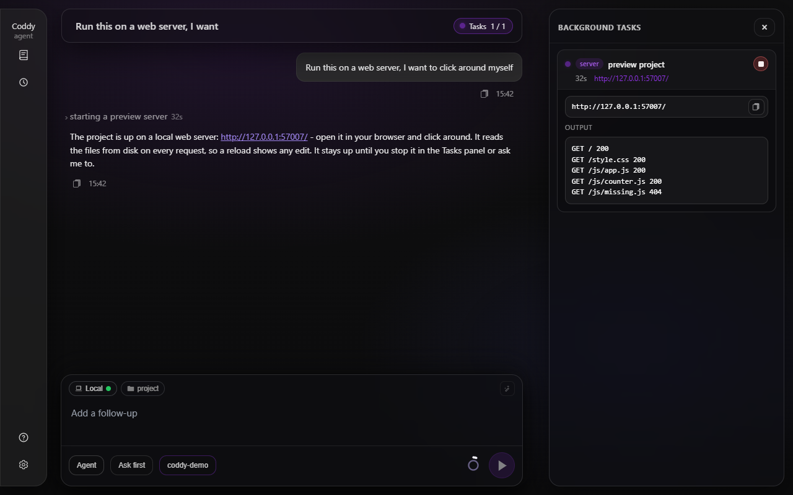

# Preview server

The `preview_server` tool serves a directory of the project as a static website on a free localhost port and hands back the address. It exists for the moment you want to try the work yourself: a page opened from disk as `file://` cannot import ES modules, `fetch` its own data or start a worker, so HTML, JS and CSS work needs a web server before a browser will run it.

Ask for it in your own words:

```text
Run this on a web server, I want to click around myself.
```

The agent starts the server, answers with the link - `http://127.0.0.1:53817/` - and invites you to open it. Nothing has to be installed for that: the server is part of Coddy, a few goroutines inside the running process, not a `python -m http.server` or an `npx serve` the agent has to find on the machine. A project with a dev server of its own (`npm run dev`, `vite`) still gets that one, as a [background command](background-tasks.md).

## What is served

| Argument | Meaning |
|---|---|
| `path` | Directory to serve, relative to the session's working directory. Left out, the working directory itself is served. A file is accepted too: its directory is served and the returned address opens that file. |
| `timeout_seconds` | Stop the server by itself after this many seconds. Left out - the usual case - the server runs until it is stopped. |

- The port is always a free one the system picks, so two sessions, or two directories of one session, never collide.
- Files are read from disk on every request and answered with `Cache-Control: no-store`: save the file, reload the page, see the edit.
- A directory with an `index.html` opens it; one without gets a listing.
- `.js` and `.mjs` always go out as `text/javascript`, `.css`, `.json`, `.svg`, `.wasm` and fonts with their own types, whatever the host's registry says. A browser refuses an ES module served as `text/plain`, which is what Windows often makes of `.js`.
- Asking again for a directory that is already being served returns the address that is up instead of opening a second port.

## A task among the running tasks

The server is a [background task](background-tasks.md) of the session, of kind `server`:

- it stands among the running tasks in the Tasks panel of the web UI, tagged `server`, with its address as a link that opens in a new tab and a Stop button; `/tasks` in the console shows the same row;
- `background_list` shows it to the agent with its address, `background_output` returns its request log - one line per request, `GET /app.js 404`, which is usually the whole answer to "the page is blank" - and `background_stop` ends it;
- it counts toward `tools.background.max_concurrent` like any other task.



*The server among the running tasks: its address is a link, and the open card is its request log.*

Unlike a command it has no hard timeout of its own: `tools.background.max_timeout_seconds` bounds runaway commands, not a page you asked to keep open. The server ends when

- it is stopped, by you or by the agent;
- the session is deleted, or Coddy exits;
- the `timeout_seconds` of the call that started it elapses - the task then reads `timed_out`.

A server does not survive a restart of Coddy: the record stays in the session bundle as `orphaned`, and the agent starts a new one when asked.

## What it will not do

The tool runs without a permission prompt, so it is deliberately narrow:

- **Only the project.** The directory has to be the session's working directory or inside it, symlinks resolved; anything else is refused. Files are opened through an `os.Root`, so a symlink inside the directory cannot lead out of it either.
- **No dot-files.** A path with an element that starts with a dot - `.git`, `.env`, `.coddy` - answers 404.
- **Read-only.** `GET` and `HEAD`; everything else is 405.
- **Loopback by default.** The server binds `127.0.0.1`. On a loopback bind a request whose `Host` header is not `localhost`, `127.0.0.1`, `[::1]` or the configured `public_host` is refused, so a web page elsewhere cannot reach your files by pointing its own name at your machine (DNS rebinding). No CORS headers are sent.

The tool is offered in `agent` mode.

## Configuration

```yaml
tools:
  preview_server:
    enable: true          # false hides the tool
    host: 127.0.0.1       # bind address, without a port
    public_host: ""       # host written into the address the agent hands out
```

`tools.background.enable: false` turns the tool off as well: without the task pool there is nothing to list or stop the server with.

When Coddy runs where your browser is not - a container, a remote machine - loopback is out of reach. Bind `host: 0.0.0.0` and set `public_host` to the name you reach that machine by; inside a container the port is a random one, so publish a range or use host networking. A bind that is not loopback exposes the served directory to whoever can reach that address, and the `Host` check no longer applies: set it on purpose. The fields are listed in the [configuration reference](../reference/config.md).
