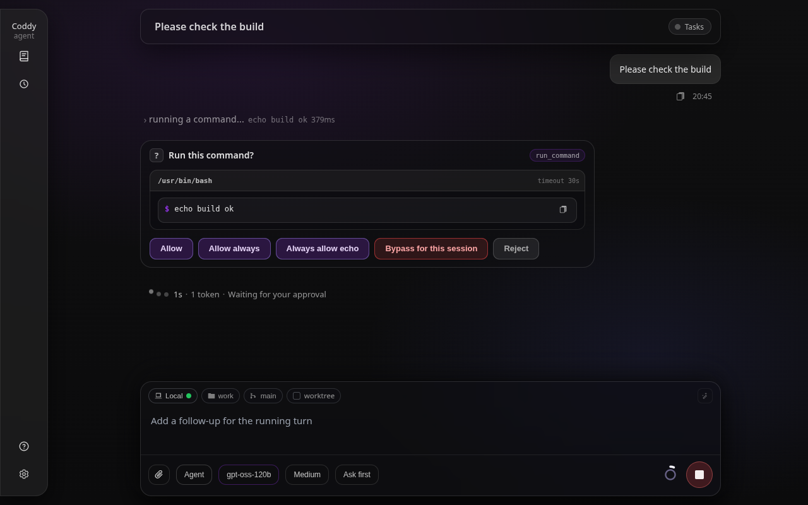
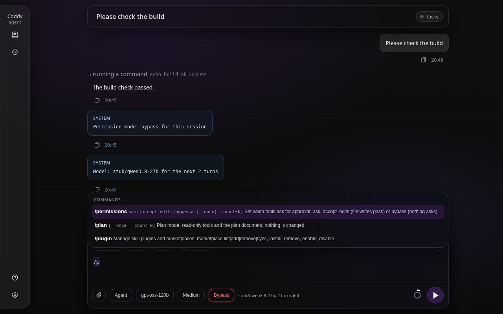
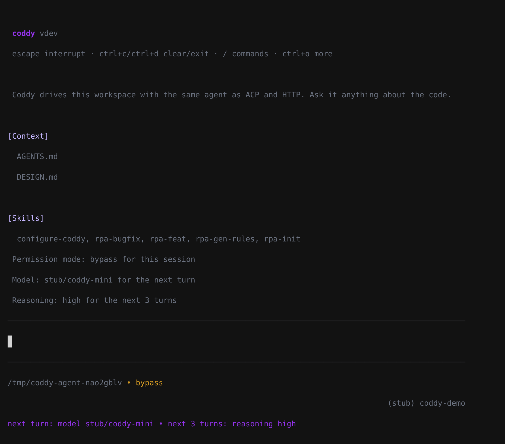

# Session settings

A session runs on four settings: the model, its reasoning level, the [operating mode](modes.md) and the permission mode. Each of them can be changed from the conversation itself, with a slash command typed in any surface, for the rest of the session or only for the next few turns. The permission dialog can switch the session out of `ask`, and the model can move itself to a stronger or a cheaper model when a step calls for it. Every change goes through one setter in the session manager (`Manager.ApplySessionSettings`, `internal/session/settings.go`), and every surface watching the session - the browser tab, a console, an editor - shows the new values.

## The commands

| Command | Changes | Argument |
|---|---|---|
| `/model <id>` | the model | a configured model id |
| `/reasoning <level\|off\|default>` (alias `/effort`) | the reasoning level | a level the model offers; `off` turns thinking off, `default` goes back to the model's own level |
| `/think [level]` | turns thinking on | optional; without one, the model's default level, else `medium` |
| `/nothink` (alias `/no_think`) | turns thinking off | none |
| `/agent`, `/plan`, `/ask` | the operating mode | none |
| `/permissions <ask\|accept_edits\|bypass>` | the permission mode: when tools ask for approval | the mode; the console opens a picker without one |

`/mode` no longer exists, on any surface: next to `/model` in a menu it was one keystroke from the wrong command, and each mode now has a command of its own.

Every command takes `--once` or `--count=N` among its own words, which changes the setting for the next turn or the next N turns (at most 50) instead of for the session:

```text
/model rpa/qwen3.8-27b --count=3
/nothink --once
/plan --once how would you split this package?
```

Commands are read only at the start of what you type, and several may follow one another, on one line or on consecutive ones. The first word that belongs to no command starts the prompt, and that prompt may itself be `/compact`, `/export` or a skill. A command in the middle of a sentence is prose, and so is anything a mention or a skill body brings in. A settings command wins over a skill of the same name. The registry is `internal/session/commands.go`.

## Session or the next turns

A change without a flag is the session's and lasts until the next change. A change with `--once` or `--count=N` is counted in turns you start: each prompt you send takes one turn from every override, and that turn keeps the values for its whole length, including the steps after a queued follow-up and after a permission prompt. A background wake and a subagent's turn take nothing. A change for the session clears that setting's turn override, the running turn's included, so the last command you typed is the one that holds.

Turn overrides live in the process's memory: a restart of the console or of `coddy serve` forgets them. The model, the reasoning level and the mode of a session are kept in its `session.json`. The permission mode is not: after a restart every session asks again as `tools.permission_mode` says, so a bypass switched on for one task does not outlive the process.

## What happens when you send one

A message that is nothing but commands runs no turn. The settings are applied, the model sees nothing, and the surface shows a short notice of each change, such as `Model: rpa/qwen3.8-27b for the next 3 turns`.

A message with text after the commands applies the session-wide changes and runs the text as a turn with the turn-scoped ones. The override travels with that prompt and is installed only once the turn is admitted, so a second tab or a background wake cannot take it first.

While a turn is running, a session-wide command applies at once and any text after it goes to the [message queue](message-queue.md) as an ordinary follow-up. A turn-scoped command with text is refused there (`409 turn_scoped_follow_up` over HTTP), since a queued message has no turn of its own to scope it to. A new model or reasoning level is used from the next model request of the running turn, never in the middle of a stream; the permission mode is read on every tool call; a new operating mode starts with the next turn. A subagent already running keeps what it was spawned with.

## Thinking off

`/nothink` and `/reasoning off` are offered only where the provider has a real switch:

- Qwen3 models on an OpenAI-compatible server, where it becomes `chat_template_kwargs.enable_thinking: false`;
- Anthropic models, which then get no thinking block;
- the Codex backend, where it becomes `none`;
- any model whose configured `reasoning_levels` include `none`.

A gpt-5 model has no off (`minimal` still thinks), and the o-series and gpt-oss have no switch at all; there the command is refused with the levels the model does offer. When you switch to a model that does not offer the stored level, the session runs at that model's default, and the selectors and the snapshot show the level actually used.

## Switching from the permission dialog

While the session asks (`ask`), a permission prompt that belongs to the session itself carries one more choice: **Bypass for this session** (`allow_session_bypass`), and for a file write also **Allow edits for this session** (`allow_session_accept_edits`). The choice approves the call and switches the session, so the rest of the same turn runs without prompts. A prompt relayed from a subagent, a prompt a hook forced, and a `config_commit` or `config_rollback` do not offer them; those two keep asking even under a bypass switched on in the session, because a commit can rewrite the permission policy itself.



*The permission prompt of a session in `ask`: the session switch sits in red before Reject.*

## The model switches itself

The model can change its own settings in three ways:

- the `switch_model` tool sets the model, the reasoning level or both, from its next request, until the turn ends or, with `scope: session`, for the session. Its description lists the configured models with their levels, so the choice is made among what exists. It is offered in every mode when there is something to switch (more than one model, or one with reasoning levels), and never to a subagent;
- a skill's frontmatter `model` and `reasoning` (alias `effort`) apply for the rest of the turn, whether you typed `/skill` or the model called `load_skill`, unless the turn already runs on a value set for it by a command or by `switch_model` ([Skills](skills.md#yaml-frontmatter));
- `spawn_agent` takes `model` and `reasoning` for the child, and a subagent definition takes `reasoning` next to `model`; the child's model is the argument, then the definition's, then the parent's ([Subagents](subagents.md#the-spawn_agent-tool)).

A model id or a level the configuration does not offer is an error in a `switch_model` or a `spawn_agent` call, for the model to correct. In a skill or a definition file it is a warning in the agent log, and the session's own value stays.

## On each surface

### Web UI

The composer's **Mode**, **Permissions** and **Model** selectors show the session's settings as the server has them. The permission chip reads **Ask first**, **Accept edits** or **Bypass**, the last in red; a line next to the selectors lists what is changed for the next turns. A change made anywhere else - a command, the dialog, the model's own `switch_model`, a console on the same session - reaches the tab as `event: session_settings` and moves the selectors. A browser that has not seen the latest change yet does not undo it when it sends: the request carries `metadata.settingsVersion`, and an older version leaves the session's settings alone.


*The composer after the session was switched to bypass and the model changed for two turns; each change left a SYSTEM line in the transcript.*

Typing `/` lists the commands with their arguments. Picking `/model`, `/reasoning` or `/permissions` opens that selector, and picking `/agent`, `/plan` or `/ask` switches the mode; typed out with a value and sent, the command goes to the server like any other prompt.



*The slash menu names each command's argument and its `--once|--count=N` flags.*

### Console

The console runs the same commands through the same parser. A bare `/model`, `/reasoning` or `/permissions` opens its picker. The footer shows the permission mode next to the folder, in the warning colour for `bypass`, and a line of the turn overrides under the model.



*The console footer: the permission mode, and what is changed for the next turn and the next three.*

`--model`, `--mode` and `--permission-mode` at launch set the same settings for the session the console opens. Under `--remote` every command changes the server's session, the permission mode included ([Console](../surfaces/console.md#remote-mode---remote)).

### ACP editors

An editor sends the commands as prompt text, and `available_commands_update` lists them with their argument hint (`input.hint`). The reasoning option is advertised in the ACP `thought_level` category, which a client may render as its thinking control, and the permission mode in `_permission_mode`, a category of Coddy's own that a client shows as a plain selector ([Editors](../surfaces/editors.md)).

### Telegram

The bot passes `/model <id>`, `/reasoning`, `/think`, `/nothink`, `/agent`, `/plan` and `/ask` to the session; a command alone is answered with its notice, and a bare `/model` still opens its keyboard. `/permissions` is not a bot command: the bot approves its chat agent's tools itself ([Telegram gateway](../surfaces/gateway.md#commands)).

### HTTP

`PATCH /coddy/sessions/{id}` takes `selectedModelId`, `selectedReasoning`, `mode` and `permissionMode`, with `turns` for a change of that many turns, and answers with the session's `settings` snapshot. `GET /coddy/sessions/{id}/messages` returns the same snapshot, `GET /coddy/commands` lists the commands with their kind, argument hint and the values each one takes for the session, and a prompt of commands only is answered with `coddy_meta.settings_only` on `POST /v1/responses` ([HTTP API](../reference/http-api.md)).

The snapshot:

```json
{
  "sessionId": "sess_abc123def456",
  "version": 42,
  "model": "rpa/qwen3.8-27b",
  "reasoning": "high",
  "reasoningChoices": ["low", "medium", "high", "off"],
  "mode": "agent",
  "permissionMode": "bypass",
  "configuredPermissionMode": "ask",
  "overrides": [{ "setting": "model", "value": "rpa/qwen3.8-mini", "turnsLeft": 2 }]
}
```

`version` orders the snapshots of the sessions of one process; a client keeps the highest it has seen. `configuredPermissionMode` is what the session goes back to after a restart. An override with `active: true` is held by the running turn.

## Related

[Operating modes](modes.md), [Security and trust](../operate/security.md#permission-modes-and-prompts), [Slash commands](../reference/slash-commands.md), [Tools](../reference/tools.md), [Message queue](message-queue.md).
