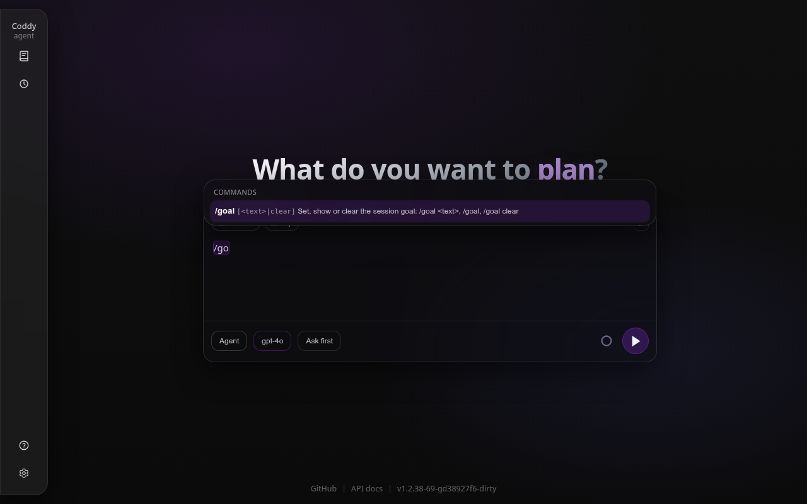
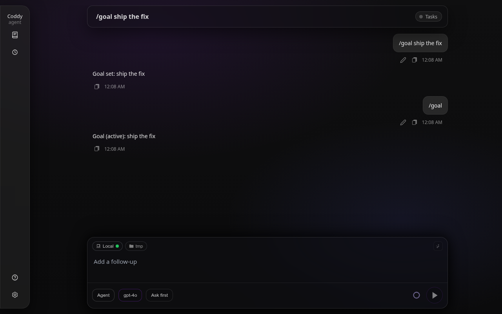
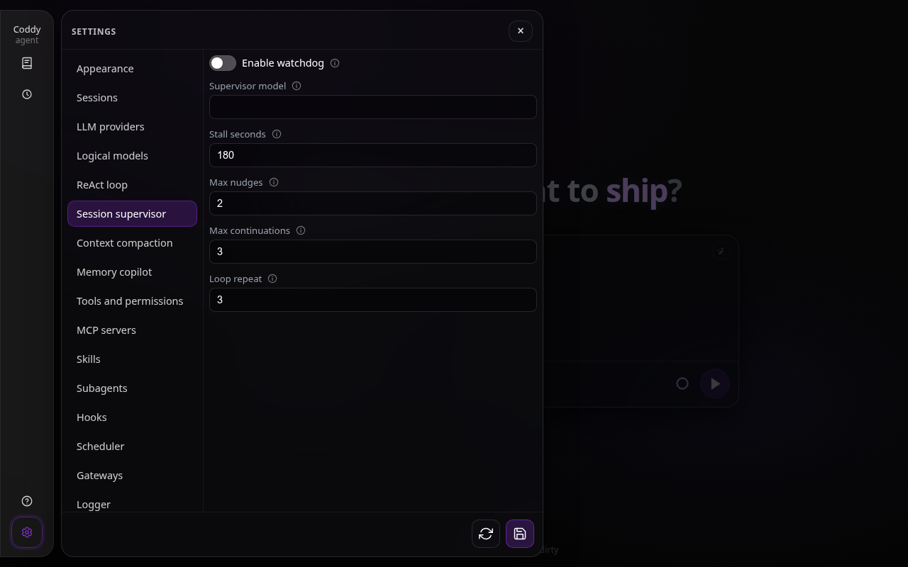

# Session supervisor and `/goal`

The session supervisor checks whether a turn actually finished its task. Set a persistent objective with `/goal <text>` in the web composer, console, ACP editor or Telegram chat. `/goal` shows the objective, status and remaining work; `/goal clear` removes it. The goal lives in the session bundle and survives a restart. These commands do not call the task model.



*The web composer offers `/goal` in its built-in command menu.*



*The command and its current status remain visible in the session transcript.*

After a turn ends, a separate short model call checks the result against the goal. If it is incomplete, Coddy starts another turn with a visible `[Supervisor continuation]` message naming the remaining work. A running background command or subagent defers that check until a later turn; an always-on preview server does not. When no goal is set, `supervisor.enable: true` makes the same check against the latest user request. A goal activates supervision even when that switch is off. The supervisor works in agent mode; ask and plan sessions and subagent tasks do not start automatic continuation turns.

```yaml
supervisor:
  enable: false
  model: "openai/gpt-5.6-terra"
  stall_seconds: 180
  max_nudges: 2
  max_continuations: 3
  loop_repeat: 3
```



*Settings exposes the same bounds under Session supervisor.*

Set `model` to a configured, inexpensive `models[].model` when one is available. The example uses the model in `config.example.yaml`; if omitted, the supervisor uses the session model. It asks for a short JSON verdict, without tools, and uses a bounded recent transcript. A failed verdict stops supervision with a notice; it does not assume the task is complete.

`stall_seconds` counts silence without assistant text or tool updates. The timer pauses while a permission or question prompt awaits a person or a background command or subagent is running. When the timer expires, Coddy cancels the stalled step and gives the agent a short recovery prompt. Repeated tool operations with the same name and arguments, without assistant text progress, trigger a similar nudge after `loop_repeat` calls. Revisions of the same file with different content do not count as identical operations. `max_nudges` limits these interventions, and `max_continuations` limits all automatic follow-up turns for the goal. Zero stall seconds disables the timer, zero loop repeat disables loop detection, and zero continuation or nudge allowance stops instead of retrying.

Every automatic continuation appears as its own row in the transcript and counts toward the saved goal's continuation count. If the limit is exhausted, Coddy stops the turn and reports what remains. `/goal <text>` starts a fresh objective and count; `/goal clear` ends supervision for that goal. The existing per-request retry limits, ReAct loop guard and user Stop control still apply.
