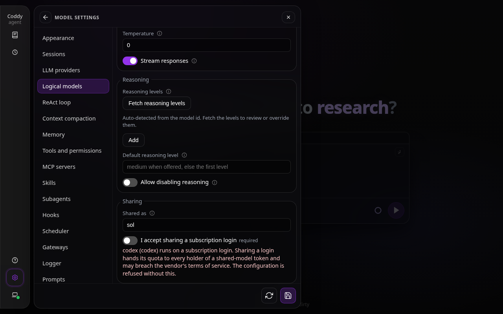
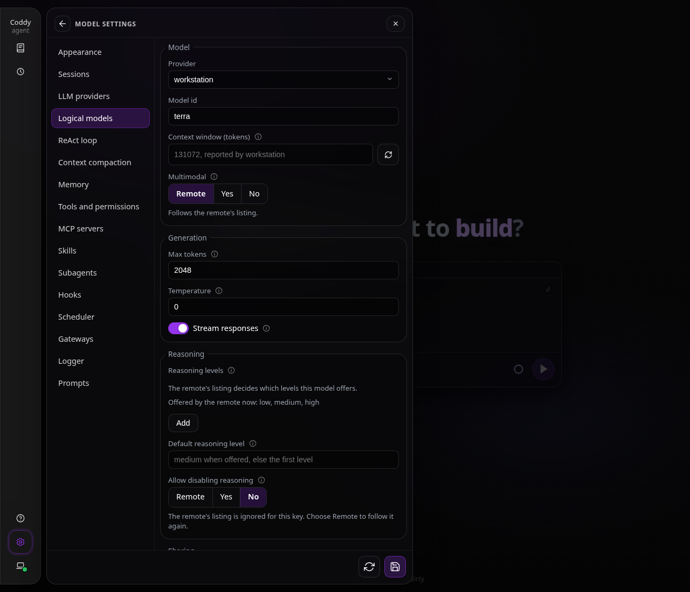
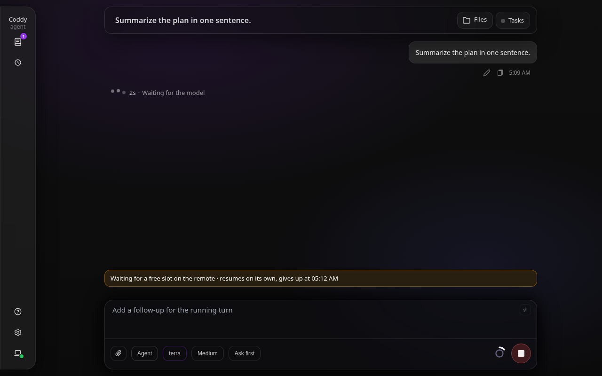
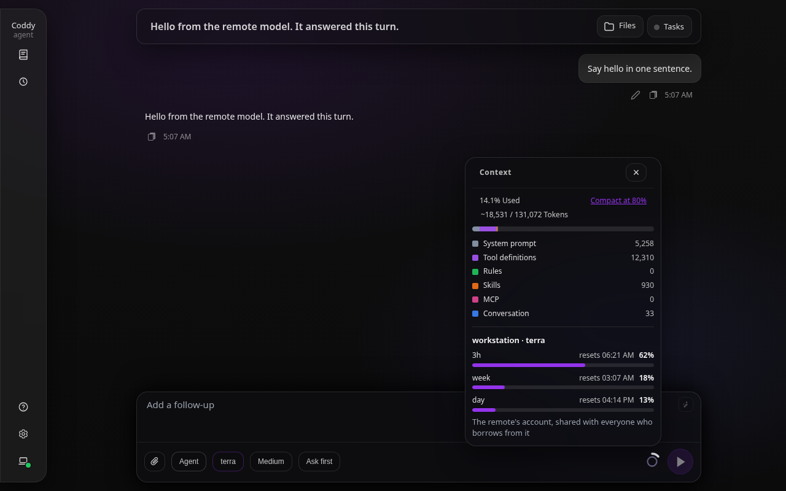

# Shared models

A Coddy can lend its models to other Coddys. The remote Coddy marks `models[]` rows as shared, and a local Coddy lists them as a provider of type `coddy` and uses them like any other model: the whole harness stays local - system prompt, rules, tool definitions, message history and the tool-call loop - and only the model call crosses the wire. This page is for the operator of the remote (what to switch on and how to keep the rest of the API closed) and for whoever borrows (how to point a provider at it), and it says what the hop does not cover. The design record, with the decisions and the model-checked reasoning behind them, is [Models shared by a remote Coddy](../plans/remote-model-provider.md).

## What it is

It is a remote **model**, not a remote **agent**. Nothing on the remote runs a ReAct loop, resolves a session, runs a hook or a rule, takes a turn lock or writes to disk: each model turn of the local Coddy is one stateless streamed HTTP call, and the remote answers it with the provider the shared row is configured with, using its own credential, proxy and retry settings. A reasoning signature, a tool call id, a tool schema and the cached-token count survive the hop, so a remote model behaves like a local one.

```
local coddy                                   remote coddy serve
  agent loop, rules, tools, history             POST /coddy/llm/completions
  provider "workstation" (type: coddy)  ----->  models[] row with shared_as: terra
      one call per model turn  <-- SSE frames   its own provider: openai, anthropic, codex, ...
```

It differs from the neighbouring ways of using another machine:

| Way | Where the loop runs | What the token opens |
|---|---|---|
| `coddy --remote`, `POST /v1/responses` with the `agent` profile, ACP over HTTP | on the remote: its tools, its shell, its files | the whole API |
| a local `type: openai` provider whose `api_base` is the remote's `/v1` | local, the remote only answers completions | the whole API, because the main token is the only one that opens `/v1/*`; reasoning signatures are dropped on the way, errors lose their structure, and every call resolves a session on the remote |
| shared models | local, the remote only answers completions | a shared-model token opens three routes and nothing else |

The remote can be reached directly (`https://host:12345`) or through a [swarm relay](../operate/swarm.md#sharing-models-through-a-relay) mount (`https://relay/swarm/nodes/<node>`), whether the node is dialled by the relay or dials out through the reverse tunnel.

## Quick start

On the remote, share a model and give borrowers a token of their own. The token goes into the environment, not the file:

```yaml
httpserver:
  host: 0.0.0.0
  shared_models:
    tokens:
      - "${CODDY_SHARED_MODELS_TOKEN}"

providers:
  - name: openai
    type: openai
    api_key: "${OPENAI_API_KEY}"

models:
  - model: openai/gpt-5.6-terra
    shared_as: terra
```

Bind the remote to an address the borrowers can reach, put TLS in front of the port (a reverse proxy; `coddy serve` speaks plain HTTP), start `coddy serve`, and check what it offers:

```bash
curl -s -H "Authorization: Bearer $CODDY_SHARED_MODELS_TOKEN" https://workstation.example:12345/coddy/llm/models
```

```json
{"protocol":1,"data":[{"id":"terra","revision":"k3...","max_context_tokens":128000,"multimodal":false,"allow_reasoning_off":false}]}
```

On the local Coddy, add a provider of type `coddy` and a model named `<provider>/<alias>`:

```yaml
providers:
  - name: workstation
    type: coddy
    api_base: "https://workstation.example:12345"
    api_key: "${WORKSTATION_SHARED_TOKEN}"

models:
  - model: workstation/terra
    max_tokens: 8192
```

`coddy --dry-run` should now report `providers[workstation]` as a coddy remote that shares the model and `models[workstation/terra]` as shared by that provider. Pick the model with `/model workstation/terra` (or `agent.model`) and use Coddy as usual. The models of a `coddy` provider can also be picked from the remote's listing in Settings.

## Sharing a model (the remote)

Sharing is switched on per row with `models[].shared_as`, and by nothing else: the key is both the switch and the name. An empty or absent key keeps the row private, and only shared rows are listed and served by the three routes.

```yaml
models:
  - model: openai/gpt-5.6-terra
    shared_as: terra
  - model: codex/gpt-5.6-sol
    shared_as: sol
    shared_subscription_ack: true
```

The alias is the only name that leaves the host: the listing `id`, the `model` of a request and every error carry the alias, never the `provider/model` selector, the provider name or the upstream model id. An alias is 1 to 64 letters, digits, dots, underscores or hyphens, starts with a letter or a digit, has no slash (so a local `workstation/terra` splits cleanly) and is unique across `models[]`. A clash is refused at load and `coddy -t` names both rows with `file:line:col`. A model served by a provider of type `coddy` cannot be shared again: two Coddys must not lend each other's lent models.

The alias is a name, not an access boundary. The remote's main token (`httpserver.auth_token`) opens the whole API, so with it a client can call `POST /v1/chat/completions` with the selector of any `models[]` row, shared or not, and run the agent and its tools on the remote's machine. Sharing a model with that token is sharing the host: hand borrowers a [shared-model token](#shared-model-tokens) instead.

### Subscription logins need an acknowledgement

A row whose credential is a subscription login needs `shared_subscription_ack: true` next to `shared_as`, and the configuration is refused at load without it. That covers provider types `codex` and `devin` always, and `neuraldeep` when the provider row names no key of its own - no `api_key`, no `api_key_command` and no `NEURALDEEP_API_KEY` in the environment - so that the stored hub login fills in. The reason is the credential: sharing it hands the quota of a personal login to every holder of a shared-model token, and the vendor's terms of service may not allow it. The acknowledgement puts that decision in writing in the file; it does not make it for you, and this page says nothing about what any vendor's terms permit - read them before you share. The key has no effect without `shared_as`, and `coddy -t` reports the refusal at the row with a fix line.

In Settings the two keys are the **Sharing** block of a model row: the alias field, checked against the alias pattern, and, once an alias is set on a subscription-backed row, the required acknowledgement switch with a warning that sharing a login hands its quota to every holder of a shared-model token.



*The Sharing block of a model row backed by a `codex` login: the alias `sol` typed, and the required acknowledgement, still switched off, with its warning*

### Shared-model tokens

`httpserver.shared_models.tokens` is a list of LLM-only credentials (`${ENV}` references work, as for `auth_token`). A token listed there opens exactly three routes - `GET /coddy/llm/models`, `GET /coddy/llm/models/{alias}/usage` (the account usage behind an alias, see [The account usage of a shared model](#the-account-usage-of-a-shared-model)) and `POST /coddy/llm/completions` - and is refused on every other route with the `401` an unknown token gets, `/v1/chat/completions` and `/v1/responses` included. The main token and a signed-in browser still open every route. The list lives in the file only: the Settings form does not show the `httpserver` block, and `GET /coddy/config` never echoes a token, it reports `tokens_configured`, a count.

What follows from a second class of credential:

- **Any shared-model token closes the gate.** A node with only shared-model tokens (no `auth_token`, no `--auth-token`, no web sign-in) refuses every protected route except the three to every caller, anonymous callers included. The static shell, the sign-in routes and, under `public_docs`, `/docs` and `/openapi.*` stay public as on any node. The web UI cannot sign in to such a node, and `coddy -t` says so; add a main token or a sign-in account to administer the node over its API as well.
- **No token is of two classes.** A shared-model token equal to a main token (in the file, or given by `--auth-token` / `CODDY_HTTP_TOKEN`) or to a swarm token (`swarm.auth_token`, `swarm.pairing_tokens`, a join entry's `pairing_token`, `--swarm-auth-token`, `--swarm-pairing-token`, `CODDY_SWARM_TOKEN`, `CODDY_SWARM_PAIRING_TOKEN`) is refused when `coddy serve` starts, when a configuration is installed (a reload from disk, `PUT /coddy/config`, which answers `400` naming both keys and never a value) and by `coddy -t`, which also sees the environment. A refused candidate leaves the running configuration and the file as they were. A duplicate that still reaches the gate is read as a shared token, the lesser privilege, so a missed one cannot hand out the whole API.
- **The routes need a credential, whatever the listen address.** While any row has `shared_as` and no credential of any class exists, the three routes answer `403` with `kind: auth`, on a loopback listener too: a loopback listener behind a TLS proxy, or a node that joined a relay by tunnel, is as exposed as any other. `coddy serve` refuses to start in that state and `coddy -t` reports it as an error. The one exception is `httpserver.allow_insecure: true`, the statement of an operator who publishes the whole API open on purpose. As soon as a credential exists, an anonymous caller gets the gate's `401`. The policy is read once per request, so a reload applies from the next request on and one request is never judged by two policies.

The whole contract of the routes, the frames and the error object is in [HTTP API](../reference/http-api.md#shared-models-a-remote-coddy-as-a-model-provider).

### Limits of the remote

| Key | Default | Meaning |
|---|---|---|
| `httpserver.shared_models.max_streams` | 5 | How many calls one credential may have running at once, all aliases together. `0` or absent is 5, a negative value is refused. |
| `httpserver.shared_models.max_call_ms` | 1800000 (30 minutes) | The longest one call of a row with `stream: false` may run, from the start of the provider call to its result. At most 28800000 (8 hours): a larger value is refused at load, and an explicit `0` means that ceiling, never "no bound". |

The count is per credential: the key is a digest of the bearer the request presented, but only a bearer the node itself accepts (any token class) or a live signed-in browser session counts; on a node that is open on purpose every caller shares one key, so a changing `Authorization` header never earns a fresh limit. The slot is taken right after authentication and before the body is read, so a busy remote answers without reading up to 32 MiB; a further call is refused at once with `429`, `kind: busy` and `Retry-After: 1`, and the calling Coddy waits for a slot ([Waiting for a free slot](#waiting-for-a-free-slot)). The slot is released exactly once, on completion, on a provider error, on a client disconnect (which cancels the upstream call), when the body deadline expires and when a write fails or times out. The server never queues.

`max_call_ms` exists because a row with `stream: false` is not stall-guarded - its answer arrives in one piece - and `providers[].timeout_ms` is 0 by default, so a hung blocking row would otherwise hold its slot until the client left, and a client that receives only heartbeats never leaves. On expiry the call ends as `upstream` with cause `timeout` and frees its slot. A streamed row is not cut by it: it is bounded by the stall guard per gap instead. `coddy -t` warns about an effective `max_call_ms` above 30 minutes together with a shared `stream: false` row whose provider has no `timeout_ms`.

## Borrowing a model (the local Coddy)

A `coddy` provider needs two keys: `api_base`, the origin of the remote `coddy serve` or a relay mount (an `http` or `https` URL; the type appends `/coddy/llm/...`, with or without a trailing slash and with a path), and `api_key`, the token the remote accepts - a shared-model token is enough, or the relay's client token through a mount. The key can stay empty only for a remote that publishes its whole API open with `httpserver.allow_insecure`, since the shared routes otherwise need a credential. `providers[].proxy` applies as for every provider, to completions and to the listing alike. A model is written `<provider>/<alias>`.

Every surface takes the model the way it takes any other: the console, the web UI, ACP, `coddy -p`, subagents, compaction and the prompt enhancer. `Complete` is the same call as `Stream` with the chunks dropped, and a local `models[].stream: false` changes nothing on the wire, which is always a stream.

Leave `providers[].timeout_ms` at 0 for a `coddy` provider unless you want to bound the whole exchange: it covers the streamed body as well, and a long answer would be cut by it.

### What the local Coddy learns from the remote

The local Coddy does not guess a shared model's size or abilities from its alias, which says nothing about the model. The listing gives it three things:

- **The context window.** A local `max_context_tokens` wins; otherwise the window the remote lists, and 128000 when the listing never answered. The listing is read when a turn starts, when the model list is served and when a session switches to the model (a turn waits at most three seconds for a listing that has never answered), is trusted for an hour and retried after five minutes when a read fails; see [Context compaction](compaction.md#the-context-window). A model added from the Settings picker, or with the Add button of Logical models and then given a `coddy` provider, is written without `max_context_tokens`, `multimodal` and `allow_reasoning_off`, so it follows the remote's listing; the refresh icon beside the field writes the window the remote reports on request, which pins it: delete the key to follow the listing again.
- **The revision.** Every row carries an opaque `revision` that changes whenever anything a client can observe about the row changes - its window, levels, defaults - or the model the alias points at. It is a keyed hash, so the upstream model id cannot be recovered from it, and it is the same after a restart of the remote while nothing changed. The local Coddy sends the revision it last read as `expected_revision`. When the remote's row changed since, the remote answers `400`, `kind: invalid`, `code: stale_revision` before it builds a provider, so no upstream request is made. The local Coddy then reads the listing again (waiting at most three seconds), rebuilds what it owns - a reasoning level the row no longer lists falls back the way it would for a local model, to the row's default or none, and image parts are dropped when the row is no longer multimodal - and sends the request once more. A second `stale_revision` ends the call. The history is not re-projected, so a window that shrank applies from the next turn.
- **What the model can do.** The reasoning levels, the default level, whether `off` is allowed and whether the model reads images; see [Capabilities from the listing](#capabilities-from-the-listing).

Reasoning signatures leave the remote inside an envelope tagged with the model the alias points at, are stored by the local Coddy as opaque text and sent back unchanged. If the operator repoints an alias to another model, the remote drops the signatures of the earlier model from the history before it calls the provider and the conversation goes on: it is never an error. The envelope key is a per-install secret in `<home>/shared-models.key` (mode `0600`, created on first use); deleting the file makes the older revisions and envelopes invalid, which a client survives by refreshing once.

### Capabilities from the listing

The listing says what a shared model can do: whether it reads images (`multimodal`), the reasoning levels it offers, its default level and whether `off` is allowed (`allow_reasoning_off`). The local Coddy reads them from the listing the way it reads the window, so a `coddy` row needs none of the four keys, and a key written on the local row still wins over the listing, key by key:

| What | Key written on the local row | Key absent, the listing knows the model | Key absent, no listing |
|---|---|---|---|
| Reasoning levels: the selector, `GET /v1/models`, `/reasoning`, `switch_model` | `reasoning_levels` as written; an explicit `[]` hides the selector | the levels the listing offers, as they are | none |
| Default level of a new chat | `reasoning_default` | the listing's default | none |
| `off` (`/nothink`, `/reasoning off`, the selector's last entry) | `allow_reasoning_off`, `true` or `false` | the listing's `allow_reasoning_off` | not offered |
| Images: the attach button, `inline_files`, the `read` tool | `multimodal`, `true` or `false` | the listing's `multimodal` | no images |

Four rules sit behind the table:

- **A written key wins, a false included.** `multimodal: false` on a `coddy` row means "never send images to this remote", whatever it lists, and `allow_reasoning_off: false` means "never offer `off`". The two keys have three states (absent, `true`, `false`) on a `coddy` row and two on every other provider type, where absent is `false` as before; `delete models[model=workstation/terra].multimodal` goes back to following the remote.
- **A default must be one of the levels.** `reasoning_default` is used only when it is one of the levels the row resolves to; a written default the levels do not offer resolves to no default, and the listing's default does not step in. A model with no levels has nothing to switch, so `off` is not offered for it either.
- **Levels are never guessed from the alias.** A local model reads its levels from its id (`gpt-5*` has four); an alias says nothing about the model behind it, so with no listing a `coddy` row has no levels and the selector stays hidden until the listing answers.
- **A refresh writes no key.** The listing is read, never copied into `config.yaml`. A remote that adds a level shows it at the next read of the listing; a remote that narrows its list takes the level away, and a request that still names the old revision is answered `stale_revision`, which the local Coddy refreshes and re-sends once (above), the level falling back to the row's default when it was inherited. A row that writes `reasoning_levels` or `allow_reasoning_off` keeps the level it wrote and the remote answers `invalid_option` for it until the key is removed.

The listing is read when a turn starts, when the model list is served and when a session switches to the model, so a remote that was down at start gives a `coddy` row no levels and no images until the first answer. The web UI fetches `GET /v1/models` when the page loads and when the configuration is swapped, and a listing that lands later shows at the next of those: there is no push event, so a tab left open keeps the old levels until it reloads. The console, the HTTP intake and the agent read the listing at the moment they ask.

In Settings a `coddy` row draws `multimodal` and `allow_reasoning_off` as a three-state control, **Remote / Yes / No**: **Remote** removes the key and the row follows the remote, **Yes** and **No** write a value that wins. A written value shows its position with the hint "The remote's listing is ignored for this key. Choose Remote to follow it again." The reasoning levels field has no **Fetch** button for such a row (the id is an alias, so there is nothing to detect), says "The remote's listing decides which levels this model offers." while the key is absent, shows the levels the remote offers right now, and offers **Follow the remote** to remove a written list. The model picker marks the models the remote lists as reading images and shows their levels.



*The model row of a `coddy` provider in Settings: `Multimodal` follows the remote, `Allow disabling reasoning` is pinned to `No`, and the reasoning levels are the ones the remote lists*

**A saved `false` stays a `No`.** Every `config.yaml` that Settings saved before this change carries `multimodal: false` and `allow_reasoning_off: false` on every model row, because the two keys were written whether or not anyone set them. For every provider type but `coddy` that reads as it always did. On a `coddy` row it is a written `No`: the row stays pinned, the control shows `No`, and `coddy --dry-run` warns when the remote lists the model as multimodal. Nothing migrates it, because a saved `false` cannot be told from one somebody wrote on purpose, and an explicit `false` is the only way to say "never send images to this remote". To follow the remote again pick **Remote** in Settings, delete the key from the file, or stage `delete models[model=workstation/terra].multimodal` (and the same for `allow_reasoning_off`).

`coddy --dry-run` compares every key a `coddy` row writes with the remote's listing and warns about each one that differs (see [Checking the setup](#checking-the-setup)).

Two options deserve care. The local row's `max_tokens` and `temperature` travel with every call when set, and the remote applies its provider's rules to them: a row backed by `codex` refuses both (the answer is `invalid_option`; its text names only the alias and never the provider behind it), and the remote caps `max_tokens` at the `max_tokens` of its own row. For a borrowed `codex` model leave both keys out of the local row.

### Waiting for a free slot

A remote runs at most `max_streams` calls per credential, so a busy answer is ordinary: several subagents, or several people sharing one token, meet the limit. The local Coddy waits it out inside the provider, so every caller waits, not only the agent loop. The call sends the request and, on `busy`, sleeps and sends it again under one deadline that covers the requests, the sleeps and the jitter: each sleep is the larger of the remote's `Retry-After` (at least a second) and a backoff that doubles from one second to five, with up to 20% jitter added, never subtracted, and the last sleep is cut to what is left. A `Retry-After` the remote names is honoured up to an hour, whatever it claims. Once the remote answers `200` the deadline no longer applies, and the time that stream ran before it was cut is not charged to the wait of the attempt that follows it.

| Key | Default | Meaning |
|---|---|---|
| `providers[].busy_wait_ms` | 0 | The total time a call to this provider waits for a free slot. Above zero it wins. |
| `agent.shared_busy_wait_ms` | 30000 | The global default for providers with no value of their own. Absent means 30000; an explicit `0` means no waiting. |

The effective budget is the provider's `busy_wait_ms` when it is above zero, otherwise the global key. So a provider above zero waits even when the global key is `0`, and "no waiting for one provider only" is written as a global `0` plus a positive value on the others. A budget of zero fails at the first `busy`, after one request. The wait costs nothing against `agent.llm_retry_max`, is the same wait however many attempts the wrapper makes, and is cut by Stop at once. While it lasts the agent reports a countdown the way it reports a limit wait: the console shows it in its status row and the web UI in the notice above the composer and in the context popover, all as `Waiting for a free slot on the remote · resumes on its own, gives up at 14:05` (no time when the update carries none), because the blocker `remote_busy` of the update tells the surfaces it is not a usage limit. The countdown is a state of its own beside the account usage of the row ([below](#the-account-usage-of-a-shared-model)), so it never replaces or wipes the usage numbers: the update that ends the wait takes it down again as soon as the remote takes the call (not when the answer ends), the end of the turn takes it down if that update never arrived, and as a last net a surface drops it on its own clock once the wait budget and two seconds more have passed. The agent's first-token timer is not armed for a `coddy` row, so `agent.llm_first_token_timeout_ms` never cuts the wait; model progress belongs to the remote (below).



*A call waiting for a free slot of the remote: the notice above the composer, with the deadline of the wait*

A spent wait fails the call with an error saying the remote has no free stream slot and how long and in how many requests it waited (or that waiting is turned off). That error is terminal: neither the retry wrapper nor the agent's recovery repeats it, since a restart would multiply the wait. Where a hop strips `Expect: 100-continue`, which the client sends so that a refused call does not upload the history, a refused call costs a re-upload.

### Errors

Every failure the remote reports has a `kind`, and the local Coddy treats it as final unless it is plainly a transport failure, because the remote already retried its own upstream. A deterministic upstream failure costs the remote its retries plus one request, never the product of both sides' retries.

| Kind | What it means | What the local Coddy does |
|---|---|---|
| `busy` | the credential has no free slot | waits within the budget above, then fails with the busy error |
| `rate` | the remote's provider is rate limiting (a plain `429`) | no retry; the error carries `retry_after_s` when known |
| `quota` | a usage limit of the remote's provider | becomes the usage-limit error with its reset time, so `agent.wait_for_limit_reset` works through the hop: the turn waits for the reset and re-issues the call. A reset time that is already past (the clocks differ) gives way to the pause the remote sends with it, and a limit that names no moment ahead stays a plain error; no pause is taken above a day |
| `upstream` | the remote's provider failed; cause `status`, `stall`, `truncated` or `timeout` | no retry; after output the partial answer is kept and the agent's recovery may continue the step, as for a local model, unless the failure is a status a local provider would not repeat either (`401`, `402`, `403`, `409`, `451` and the like) |
| `invalid` | the request was refused (`400`, `404`, `408`, `413`) or the provider rejected it | the remote's message, no retry |
| `auth` | the credential was refused | "the remote refused the credential" |
| transport | a refused or cut connection, a `408`, `502`, `503` or `504` from a relay or gateway, a stream that ends without a final or error frame | retried by `agent.llm_retry_max` only while no chunk has been shown |

An error frame that names a kind outside the six above is reported as an answer no rule classifies, and every text of a remote is bounded and stripped of control characters before it is shown. The message of an error is built by the remote from its kind and status, never from the provider's text, which carries the provider's name and address and can quote the request. A context limit or any other number a client needs travels as a field. Through a relay the local Coddy cannot tell the node's token from the relay's: a refused credential names neither.

## The account usage of a shared model

A shared model spends the quota of the remote's account, and the local Coddy shows how much is left the way it shows the usage of a local provider: the usage section of the context popover and the banner in the web UI, the third footer line and `/usage` in the console, `GET /coddy/providers/{name}/usage?model=<alias>` over HTTP and the `provider_usage` update over ACP, which carries the alias as `model`. Nothing needs configuring on the borrowing side (`providers[].usage_limits_panel` is on by default, and `false` on the `coddy` row switches the reads off for that row). On the remote, the model's provider needs a usage source (`neuraldeep`, `codex` or `devin`), because the remote shows what it reads for itself; a row backed by `openai` or `anthropic` answers that it has no usage.



*The usage section of the context popover for `workstation/terra`: the remote account's windows under the title `workstation · terra`, and the line that says whose account it is*

### What leaves the remote

The remote answers `GET /coddy/llm/models/{alias}/usage` with a projection it builds field by field, never a copy of its own usage document:

| Field | Meaning |
|---|---|
| `supported` | `false` alone when the model's provider has no usage source or the operator switched the panel off; nothing else is sent then |
| `account_wide` | `true`: the meters are those of the whole account or key, not of the one model |
| `stale` | the numbers are older than the latest read, which failed, or nothing could be read at all (then `windows` is empty); the reason is never given |
| `windows[]` | `id` (`session`, `week`, `day`, `acu` or `window-N`), `label` (a duration such as `5h`, `week`, `day` or `ACU`; any other label is replaced by the id), `used_percent` (0 to 100), `reset_in_s` and `exhausted` |
| `blocked`, `blockers[]`, `retry_in_s` | a call to the model would be refused now, why (an id from a fixed set; one the remote does not know is `other`) and the wait for a timed block |

`reset_in_s` is the number of seconds until the window resets, counted from the moment the remote answers, so it survives the difference between the two hosts' clocks. It is absent for a window with no reset clock and `0` once a clock has run out. A model on the provider's unlimited option, or an unlimited account, has no windows. A block that concerns a model is reported only under the alias of that model, as the blocker `model_blocked`, and only for the model the alias points at.

It never contains the provider's name or type, the plan, the key's name, the wallet, the requests-per-minute figures, the counters (`used`, `limit` and `remaining` would reveal the size of the plan), any absolute time, any upstream model id or list of them, the windows of a metered feature or of another model (Codex's `Fast model · week`), the blocks of other models, or anything that tells two aliases of one account apart from two accounts. A test scans the whole body for each of those values.

**This is an exposure.** The values are the account's own, so every holder of a shared-model token learns how much of the lender's quota is left. The only switch is `providers[].usage_limits_panel: false` on the lender's provider row, which answers `{"supported": false}` to everybody and hides the lender's own panel too; there is no per-token switch. The route takes no stream slot, and `max_streams` does not count it.

The answer comes from the remote's own reading of the account, the one its web UI and console show: it is served from a cache of 20 seconds and never forced by this route. Any number of borrowers, aliases and requests together cost the upstream at most one read per 15 seconds, and a borrower's read costs one only when the cache has gone stale. An alias that finds no shared row, a private model and a `provider/model` selector all answer `404` `unknown_model` and name nothing.

### What the borrowing Coddy does

The usage is read per alias, not per provider row. One remote can lend a Codex-backed alias and an OpenAI-backed one through one `coddy` row, so the cache, the schedule and every surface key an entry by the row and the alias. Two aliases of one account answer with equal numbers and nothing relates them: each alias in use costs at most one request per 15 seconds, and an alias nobody looks at costs nothing. The title of the block names both, `workstation · terra`, and a line under the meters says "The remote's account, shared with everyone who borrows from it".

- **When it reads.** At session start and on a switch to the model (the cache's answer when it is warm), after every turn that ran, when a window's reset has passed and when a deferred refresh is due. The remote answers from its own cache, so a read made at the end of a turn can be older than the turn; the first read after a turn end therefore arms one more read a cache lifetime later, and the spend of the turn shows within about 35 seconds. Nothing polls otherwise.
- **A remote with no usage.** An answer of `{"supported": false}` - or the JSON `not_found` of a remote that predates the route - is remembered per alias for 60 seconds: automatic reads inside it are answered without a request, a manual refresh (`/usage`, `?refresh=1`) ignores it, and nothing is published for it. A lender that turns its usage on is noticed within the minute. A `404` that is not that JSON (a page, a relay's "no such node") is an ordinary failure with the ordinary backoff, never a "no usage".
- **A failed read.** The numbers stay on screen, marked as older (`The latest read failed; these numbers are older`), and the read is retried with backoff; a `Retry-After` is honoured up to five minutes. A refused token carries no numbers and says so: the web UI reads `The remote refused the token of workstation: check the API key of that provider in Settings`.
- **A withdrawn alias.** `unknown_model` drops the numbers of that alias at once. It is not sticky: the next read after the cache's lifetime asks again, so an alias the lender shares again reappears.
- **A name that is no configured model.** For a `coddy` row the HTTP route needs `?model=<alias>` (`400` without it), and the alias has to be one of the row's configured models (`404` `unknown_model` otherwise, before anything is read), so a client cannot make the local Coddy ask the remote about arbitrary names.
- **A repointed alias.** An alias the lender moves to a model on another account shows the old account's numbers for at most one cache lifetime, 20 seconds.

#### The waiting countdown beside the snapshot

While a call waits for a free slot of the remote ([above](#waiting-for-a-free-slot)), the countdown and the usage snapshot are two separate things on every surface. For the alias that waits, the countdown takes over the note of the popover and the banner (`Waiting for a free slot on the remote · resumes on its own, gives up at 14:05`) and the status row of the console, and the meters under it stay as they are; when the wait ends the snapshot's own note is back. No usage answer, an "unsupported" one included, ends a countdown, and no countdown wipes a snapshot.

## Timers

Three jobs - model progress, the liveness of the remote and of the path, and the bounds of one request - each have a timer of their own, and the heartbeat keeps them apart. A fourth timer bounds a peer that vanished without a trace ([A peer that vanishes](#a-peer-that-vanishes)).

| Timer | Whose | Value | Job |
|---|---|---|---|
| Body deadline P | the remote | 30 s, counted from the start of the request | The whole request body must arrive within it, or the call ends `408`, `code: body_timeout`. |
| Write deadline W | the remote | about 60 s, refreshed before every write | A peer that stops reading cuts the call, cancels the upstream call and frees the slot. |
| Heartbeat H | the remote | the comment `: hb` every 15 s of silence, the first right after the body is read and checked and before the provider is called | No two bytes of a response are more than 15 s apart, also while a blocking row computes or the provider backs off. |
| Stall guard S | the remote | the remote's `agent.llm_stream_idle_timeout_ms` (default 300000), from the start of the provider call, re-armed by every chunk; streamed rows only | An upstream that accepts the request and never answers ends as `upstream`, cause `stall`. A blocking row is bounded by `max_call_ms` instead. |
| Liveness guard I | the local Coddy | the local `agent.llm_stream_idle_timeout_ms` (default 300000), armed by the first body byte and counting every byte, heartbeats included | A remote or a path that went dead is cut after I of silence. |
| Request bound R | the local Coddy | P + 15 s = 45 s, from the start of the upload to the remote's headers | An upload that stalls, or a remote that never produces its headers, is cut. |
| Answer bound | the local Coddy | 30 s, from the remote's headers to the end of an answer that is not the stream (a refusal, a gateway's page, a success that is no event stream) | A hop that sends part of such a body and stalls is cut with the same error as R. |
| Peer bound B | the remote, and a relay for its own client | 45 s from the peer's disappearance: the heartbeat gap H plus a user timeout of 30 s on the call's connection | A client that vanished without a FIN or a RST is cut and its slot freed. |

What to keep consistent:

- `I` must be at least twice the heartbeat, so a late beat never cuts a live remote. `coddy -t` warns when `agent.llm_stream_idle_timeout_ms` is `0` (which switches the liveness guard off, so a dead remote is not noticed) or below 30000 while any provider is of type `coddy`.
- Every hop between the two Coddys needs an idle limit above 60 s (nginx's default `proxy_read_timeout` is exactly 60 s, so raise it for this route). The heartbeat leaves room for two late beats under 60 s, and the body deadline must also stay below the limit. The response carries `Cache-Control: no-cache` and `X-Accel-Buffering: no` and is flushed after every frame.
- The body must arrive within 30 s in total, not per read. A long history over a slow uplink can miss that and is refused with `body_timeout`; compact the session ([Context compaction](compaction.md)) or use a faster path. The request body is limited to 32 MiB and to about half a million JSON objects and arrays (`413`, `code: request_too_large`, answered before any byte is read where the `Content-Length` is known; the element count is checked before the body is parsed, so a body of empty objects cannot inflate the remote's memory; the local Coddy refuses to send an oversized one) and one event of the stream to 16 MiB on the client.

## A peer that vanishes

A client that disappears without a trace - a laptop that lost power, a cable pulled, a NAT that dropped the connection - sends neither a FIN nor a RST. The remote keeps writing the heartbeat, every write is accepted into the send buffer, neither deadline fires, and TCP keepalive does not run on a connection with unacknowledged data in flight. Left alone, the call's slot is held until the call ends on its own or the kernel gives up on the connection, which takes minutes.

**The promise.** On the leg the remote sees, the slot of a peer that vanished is freed at most **B = 45 seconds** after it vanished, the upstream call is cancelled and the log line of the call says `client_gone`. B is the heartbeat gap (H, 15 s: the first heartbeat written after the peer is gone is the first byte nobody acknowledges) plus a user timeout (U, 30 s: the kernel aborts the connection that long after it). It holds on Linux, Android included, with a kernel that clamps the retransmission timer to the user timeout (measured on Linux 7.0); [what it does not cover](#not-covered) is listed below.

| Leg | Mechanism | Bound |
|---|---|---|
| A direct listener (`https://host:12345`, or a node the relay dials) | `TCP_USER_TIMEOUT` of 30 s on the connection of the call, set after the request body is read and put back on every exit of the call: final frame, error frame, cancel, failed write | 15 s + 30 s |
| A node's reverse tunnel | the node pings the relay when no frame has arrived for 15 s and closes the connection when the ping is not answered within 30 s; the calls on it end with it | 15 s + 30 s, whatever the heartbeat is |
| A client behind a relay | the relay sets the same option on its own client connection, for the completions route of a mount only | 15 s + 30 s, for a client that speaks HTTP/1.1 to the relay |

Only the shared completions call carries the option. A browser's event stream on the same listener (`/v1/responses`, the events route) keeps the operating system's behaviour and survives a short outage, and the option is back at the system default as soon as the call ends, so a kept-alive connection starts its next request unprobed. A client that vanishes while it uploads is bounded by the body deadline (30 s), and one that vanishes after the `final` frame costs nothing. The relay's own pings of a tunnel node (30 s idle, 15 s to answer) and the node's activity watchdog stay as they were; the node's ping closes the other direction, where a relay that vanished while a call streamed heartbeats used to look alive until the kernel gave up on the socket ([Swarm](../operate/swarm.md#liveness-of-a-tunnel-and-of-a-shared-call)).

**The local Coddy offers only HTTP/1.1 to a `coddy` remote.** An HTTP/2 connection carries many requests, so a per-call socket option cannot be set on it, and a relay's listener negotiates HTTP/2 with any client that asks. The HTTP client of a `coddy` row - completions, the listing and the usage read alike - therefore speaks HTTP/1.1 only, still through `providers[].proxy`, and every shared call the product makes is covered. The cost is the HTTP/2 liveness pings the other providers get on their connections; for a `coddy` row the heartbeat and the stall guard (`agent.llm_stream_idle_timeout_ms`) are what notice a dead remote.

**What a live peer survives.** The kernel counts the user timeout from the first unacknowledged byte and retransmits at backed-off instants, aborting at the first timer after the timeout. A live peer therefore survives an outage only if a retransmission lands after the link is back and before the timeout: a silent link of more than about 15 to 25 seconds cuts a live call, not 30. The figure was measured at a retransmission timeout of about 0.2 s (25 s survived, 27 s cut); on a slower path it falls to about 15 s. The client sees a cut stream, retried only while nothing was shown, and the tunnel behaves the same way with its 30-second ping timeout.

### Not covered

- **Other operating systems on the direct leg.** macOS, Windows and the BSDs have no `TCP_USER_TIMEOUT`, so the direct listener keeps the operating system's retransmission timeout, which is minutes. The tunnel's ping works on every platform.
- **A kernel that does not clamp the retransmission timer.** It aborts at the first retransmission instant at or after the timeout, so the bound is the heartbeat gap plus that instant, up to about 75 seconds. Which kernels do that was not established.
- **A peer behind an intermediary that acknowledges for it.** A TLS terminator such as nginx or Cloudflare, or an HTTP proxy in front of a direct listener, acknowledges every byte the remote writes, so the remote cannot tell that the real client is gone and only the intermediary's own limits apply.
- **A client that is not the local Coddy and speaks HTTP/2 to a TLS relay.** The relay cannot scope the option to one call on a connection shared with other streams, so it serves the call unprobed and logs once per connection, at info level, `shared call over HTTP/2: a vanished client is not detected before the call ends`. The slot is then held until the call's own end (a final or error frame; the remote's stall guard after the last chunk for a streamed row; `max_call_ms` for a blocking one) or until the relay's kernel gives up on the client's socket, about 15 minutes at the default `tcp_retries2` of 15 (the figure is the kernel documentation's and was not measured here). The credential's other slots are not affected. A relay-wide HTTP/2 health check would cut quiet browser streams through the relay, and an HTTP/1.x-only relay listener would take multiplexing from every browser stream, so the relay does neither.

## Reaching the remote

Directly, `api_base` is the remote's origin and the token is the remote's. Through a relay it is the node's mount and the token is the relay's client token. The section [Sharing models through a relay](../operate/swarm.md#sharing-models-through-a-relay) covers the rest: a node that joins with a shared-model token so the relay can reach only the three routes, why share-only nodes belong on a relay of their own, the sessions warning a share-only node of an older version causes (a current node labels itself and raises none), and how to cut off a node whose token went stale.

Two facts shape every relay setup. The relay replaces the caller's credential with the one the node joined with, so the node sees one caller and the limit (five by default) covers every client of that relay together: it protects the node and its provider, not clients from each other. And the relay client token a borrower puts into `api_key` opens the mounts of every node of that relay, each with the token that node joined with, so a shared-model token protects only the nodes that joined with one.

### A private authority and a client certificate

A `coddy` provider can trust a private certificate authority and present a client certificate to whatever terminates TLS in front of the remote (a reverse proxy that requires mutual TLS, for one):

```yaml
providers:
  - name: workstation
    type: coddy
    api_base: https://remote.example:12345
    api_key: ${WORKSTATION_TOKEN}
    ca_file: /etc/coddy/private-ca.pem
    client_cert_file: /etc/coddy/client.crt
    client_key_file: /etc/coddy/client.key
```

- The three keys are paths, never the key itself, and belong to a provider of type `coddy` only: another type that writes one is a load error naming the key, so nobody believes a certificate is presented where it is not. `client_cert_file` and `client_key_file` are set together.
- They apply to every request of the row: the completion, the listing and the usage read. The row keeps its HTTP/1.1 transport and its `proxy`: behind a proxy the `CONNECT` is made first and the certificate is presented to the remote at the end of the tunnel (an `https://` proxy is offered the same identity for its own hop, if it asks for one).
- The pair is read at each handshake and cached by size and modification time, so a certificate rotated on disk is used by the next connection without a restart; a file that cannot be read fails that one handshake and the next one recovers when the file is back.
- `coddy -t` reads the files: an unreadable or mismatched pair and an unreadable `ca_file` are errors, a `ca_file` that holds no certificate is a warning. `coddy --dry-run` loads the pair, reports an expiry within 14 days as a warning and a past `NotAfter` as an error, both at the key's line, and runs its listing probe with the identity.

A relay that is rebuilt on a configuration change cuts the streams in flight; to the local Coddy that is a transport failure, retried while nothing was shown. A client that vanishes behind a relay is invisible to the node, which sees only the relay, so the relay bounds its own client for the completions route ([A peer that vanishes](#a-peer-that-vanishes)).

## Checking the setup

`coddy -t` (and `coddy serve -t`, which also sees the flags `--auth-token`, `--swarm-auth-token` and `--swarm-pairing-token`, and the environment) reports, with `file:line:col` and a fix line:

| Severity | Finding |
|---|---|
| error | a `shared_as` that is not a valid alias, or is already used; a shared row on a `coddy` provider; a login-backed row without `shared_subscription_ack`; a negative `max_streams`, `busy_wait_ms` or `shared_busy_wait_ms`; a `max_call_ms` outside 0 to 28800000; a `coddy` provider without an `api_base` that is an `http` or `https` URL |
| error | a shared-model token that is also `auth_token`, a `--auth-token` / `CODDY_HTTP_TOKEN` token or a swarm token (the message names both keys, never a value) |
| error | `shared_as` with no credential of any class and no `allow_insecure` |
| warning | `api_base` of a `coddy` provider that is plain `http://` to a host that is not loopback: the token and the whole conversation travel in clear text |
| warning | `agent.llm_stream_idle_timeout_ms` of `0`, or below 30000, with a `coddy` provider |
| warning | a shared `stream: false` row with no `timeout_ms` on its provider while the effective `max_call_ms` is above 30 minutes |
| warning | an entry of `shared_models.tokens` that is empty, usually an `${ENV}` reference to an unset variable: it is ignored |
| warning | shared-model tokens as the only credential: the rest of the API is closed to every caller and the web UI cannot sign in |
| warning | `busy_wait_ms` on a provider that is not of type `coddy`: it has no effect |
| error | `ca_file`, `client_cert_file` or `client_key_file` on a provider that is not of type `coddy`, a certificate without its key or the reverse, a pair that cannot be read or whose key is not the certificate's, an unreadable `ca_file` |
| warning | a `ca_file` that holds no PEM certificate |
| warning (`--dry-run`) | a client certificate that expires within 14 days (an error once it has) |
| warning (`--dry-run`) | a key a `coddy` row writes that differs from what the remote lists for its alias: `max_context_tokens`, `multimodal`, `allow_reasoning_off`, `reasoning_default`, `reasoning_levels` |

`coddy --dry-run` also asks every `coddy` provider for its listing, which exercises the address, the proxy and the token in one request. It reports a remote that is unreachable, a credential it refused, a protocol the two Coddys do not share (`update the older of the two`), an address that does not offer shared models, a remote that shares nothing (a warning), and, for every local `models[]` row of the provider, an alias the remote does not list as an error, since the remote answers a request for it with `404`. For an alias it does list it also compares, key by key, what the row writes with the remote's record and gives one **warning** per key that differs: a `max_context_tokens` that is not the remote's window, a `multimodal` or `allow_reasoning_off` that disagrees, a `reasoning_default` that is not the remote's default, and a `reasoning_levels` list that differs (a level the remote does not offer is named as refused with `invalid_option`, a level it offers that the row omits as unused). A key left out inherits the listing and an equal one agrees with it, so neither is reported. Each warning names the key with both values and what follows from it, is located at the key's line in the file, and ends in the same fix, `remove <key> from this model to inherit the remote's listing`:

```
warning  models[workstation/terra].allow_reasoning_off: allow_reasoning_off is false here and the remote lists true: the local key wins, so "off" is never offered although the remote allows it
         at ~/.coddy/config.yaml:11:26
         fix: remove allow_reasoning_off from this model to inherit the remote's listing
```

The warning is how a `false` that Settings saved earlier is found ([above](#capabilities-from-the-listing)). `coddy -t` cannot see it, since it is offline and has nothing to compare with. See [Dry run](../getting-started/configuration.md#dry-run-probing-what-the-file-points-at).

## Privacy and terms

The whole harness passes through the remote host: the system prompt, the rules, the file contents the agent read, tool output, images. Anyone who runs that host can read all of it, whatever the route does. The route itself stores nothing and its log line records the alias, the kind of the outcome, the status, the duration and a request id (also returned as `X-Coddy-Request-ID`), never content; a provider's raw error text is logged at debug level only, and it can quote the request. Retention and zero-data-retention are those of the remote's provider account, and so is the quota: every holder of a token spends it. Share with people you would give that account to.

Sharing a subscription login is the borrowers' convenience and the vendor's concern: see [the acknowledgement](#subscription-logins-need-an-acknowledgement). The remote's operator is the one who answers for it.

## Troubleshooting

| What you see | Cause and fix |
|---|---|
| `the remote does not offer shared models` | `api_base` answers its web page or a `404`: the address is not a `coddy serve` with shared models (an older build, a build without the `http` tag, a relay root instead of `https://relay/swarm/nodes/<node>`). |
| `the remote refused the credential` | The token is wrong or of the wrong class for that address, or the node behind a mount did not join with a token. `coddy --dry-run` names the provider; the plain `401` comes from the gate. A `403` that says shared models need authentication means the remote has no credential configured at all. |
| `no shared model is offered under that name` (`unknown_model`) | The alias is not shared, is misspelled, or the model is written with the remote's `provider/model` selector, which never works. List the aliases with `GET /coddy/llm/models`. |
| `waited ... for one, in N requests` | The remote's slots for this credential stayed full for the whole budget. Raise `busy_wait_ms` or `agent.shared_busy_wait_ms`, or raise `httpserver.shared_models.max_streams` on the remote, or give each borrower a token of their own. |
| `a limit of calls per minute ... is spent: waited ... for a free window` | The remote (or a relay, for a client of its own) refuses calls past its window, and it stayed spent for the whole budget. Raise `busy_wait_ms` or `agent.shared_busy_wait_ms`, or ask the operator for a larger `rate_per_minute`. A window refusal is a `busy` answer like a full slot, so it is waited out the same way. |
| `invalid_option` saying the model cannot take an option of this request | The local row sets `max_tokens`, `temperature` or a reasoning level that the remote's provider refuses (a row backed by `codex` takes none of the first two). Remove them from the local row; the remote does not say which provider refused. |
| `invalid_option` naming a reasoning level | The local row writes a level the remote row does not offer (a `reasoning_levels` or `reasoning_default` written on the row wins over the listing). Remove the key to follow the remote, or make it match; `coddy --dry-run` names the key and the levels. |
| A `coddy` model has no reasoning selector, no `off` or no attach button | The listing has not answered yet (the remote was down at start; the web UI shows the listing after its next page load), the remote lists no levels or no images for that alias, or the row pins the key: `reasoning_levels: []`, `allow_reasoning_off: false`, `multimodal: false`. In Settings the three-state control shows `No` for a pinned key; choose `Remote`. |
| `stale_revision` that survives the retry | The remote's row changes between your requests, or the listing could not be read again. Check the remote's configuration and `coddy --dry-run`. |
| `protocol_mismatch` | The two Coddys speak different versions of the shared-model protocol; update the older one. |
| `body_timeout` | The request body took longer than 30 s to arrive. Compact the session or use a faster link. |
| `request_too_large` | The history is above 32 MiB. Compact it. |
| `upstream` with `stall` or `timeout` | The remote's provider went silent for `agent.llm_stream_idle_timeout_ms` on the remote, or a blocking row ran past `max_call_ms`. Look at the remote's log. |
| `quota` | The remote's provider account hit a usage limit; the error carries the reset time and `agent.wait_for_limit_reset` can wait for it. |
| `did not answer the request within 45s (request bound)` | The upload stalled or the remote never produced its headers: look at the path, the remote's load and the hop timeouts. |
| the stream is cut every minute or so | A hop idles out below 60 s or buffers the response; see [Timers](#timers). |
| the context popover has no usage block for a `coddy` model | The remote's provider has no usage source (only `neuraldeep`, `codex` and `devin` have one) or its operator switched `usage_limits_panel` off, so the remote answers `{"supported": false}`; the local Coddy asks again after a minute, or at once on `/usage`. The same happens for a remote that predates the route, and with `usage_limits_panel: false` on the local row. |
| the usage block says the remote refused the token | The `api_key` of the `coddy` row is wrong or of the wrong class for that address; the numbers are dropped until a read succeeds. Check it in Settings. (The console says `key rejected, run coddy providers login <row>` for the same state: a `coddy` row has no login, the key is the fix.) |
| the usage block says the latest read failed | The remote, or the relay in front of it, did not answer the usage read; the numbers shown are older and the read is retried with backoff. A relay that does not know the node answers `404`, which keeps them as they are. |
| a call keeps its slot after its client went away | See [A peer that vanishes](#a-peer-that-vanishes): the bound is 45 s on Linux for a client the remote or the relay sees directly, and longer on the platforms and paths listed under [Not covered](#not-covered). |
| `coddy serve` refuses to start | The message names the key: a shared row without a credential, a token of two classes, a missing acknowledgement, an invalid alias. `coddy serve -t` shows the same with the line. |

## Limitations

Two of the four steps of [the plan](../plans/remote-model-provider.md#5-phases) are done: the wire, the client and the access rules, then the capabilities from the listing, the usage through the hop and the liveness of a vanished peer ([Not covered](#not-covered) lists what the last does not reach). What is not there yet:

- **Per-client scopes behind a relay.** A node behind a mount cannot tell the relay's clients apart, the relay cannot restrict a client to the shared routes, and a stale node token survives while the node keeps its lease, until the node is evicted or the relay restarts. Per-client scopes, mutual TLS on the relay, rate limits and audit counters are later hardening; a relay that erases a token a node stopped sending (the next registration) and a node label that silences the relay's sessions warning are done.
- **Discovery and failover.** One provider row per remote or relay mount; the models are picked from its listing. A relay does not enumerate the shared models of its nodes and does not fail over between nodes that share one. A later step.
- **A usage view the lender can scope.** The lender's `usage_limits_panel: false` hides the usage from every borrower and from its own panel; there is no per-token switch, and no batch route for the usage of all aliases (each alias is read on its own).
- **No push for a changed listing.** A listing that changes reaches the web UI at its next page load or configuration swap, as [above](#capabilities-from-the-listing).
- **No blocking mode** on the wire: it is always a stream with a heartbeat.
- **Loops are caught in one direction only.** A provider of type `coddy` cannot be shared, but a `type: openai` provider that points at another Coddy's `/v1` is not caught.
- **Prompt-cache affinity of `codex` and `devin` through a stateless hop** has not been measured: the remote builds those providers per call, where a local run keeps one session id for the whole run. What is held by tests is the request body: for `openai`, `anthropic`, `neuraldeep` and `codex` the bytes the remote's provider sends upstream equal what a local provider of the same type sends.
- **Little of the sharing is on a screen.** Settings has a Sharing block on each logical model (the alias, checked against the alias pattern, and the acknowledgement that a subscription login asks for), offers the `coddy` provider type with its `api_base`, its key and, among the advanced settings, `busy_wait_ms`, draws `multimodal` and `allow_reasoning_off` of a `coddy` row as the three-state control, and carries `agent.shared_busy_wait_ms` on the ReAct loop tab, and shows `ca_file`, `client_cert_file` and `client_key_file` of a `coddy` row among the advanced settings. The shared-model tokens are `config.yaml` keys only: Settings does not show the `httpserver` block. The console has no screen for sharing, only the status row and the usage line.

## Tests

The specification is `features/remote_model_provider.feature` (direct) and `features/remote_model_provider_relay.feature` (through a relay, tags `http,swarm`): the happy paths, the capabilities from the listing and the usage through the hop included. The unit tests sit next to the code: `internal/config/{capabilities,listing}*_test.go` (the three-state keys, the resolver, the lineage of a listing source, the guard that keeps every surface on the one reader), `internal/config/shared_models*_test.go` (aliases, acknowledgements, token classes, the credential rule, the check findings), `external/httpserver/shared_*_test.go` (the routes, the gate, the limiter, the timers, the usage projection and its key set, the liveness of a vanished peer, the error object, the OpenAPI document), `internal/llm/coddy*_test.go` (the client, the usage client, the HTTP/1.1-only transport, the busy wait, the error classification, the envelope, the listing), `internal/session/{capability_listing,provider_usage_coddy}_test.go` (the listing as a source of capabilities, the usage per alias), `internal/agent/coddy_provider_test.go`, `internal/dryrun/coddy_provider_test.go`, `internal/platform/usertimeout*_test.go`, `internal/httpx/*_test.go`, `internal/swarm/tunnel_liveness_test.go`, `external/swarm/{mount_liveness,liveness_stand}_test.go` and `cmd/coddy/serve_shared_models_test.go`.

Two kernel tests prove the 45-second promise against a real socket. They need Linux with `unshare`, `ip` and `iptables` in a user namespace, so they are opt-in and stay out of `make test`:

```bash
CODDY_TEST_NETNS=1 go test -tags=http ./external/httpserver -run VanishedPeer -v
CODDY_TEST_NETNS=1 go test -tags=http,swarm ./external/swarm -run KernelVanishedClient -v
```
