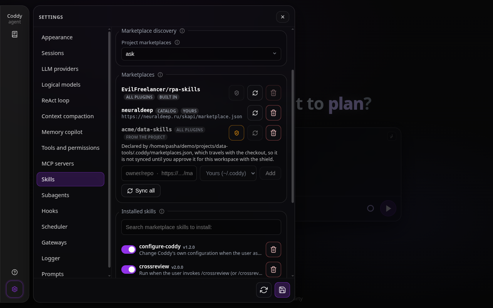
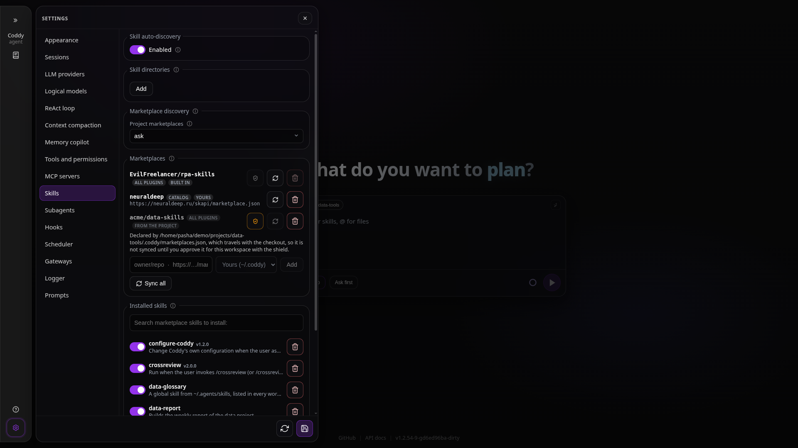

# Skills

Skills are reusable instruction packs that extend the agent with slash commands, domain knowledge, and specialized workflows. They power the **`{{.Skills}}`** block in the system prompt and the slash-command catalog surfaced to ACP clients and the HTTP UI.

> **Project rules** (`.coddy/rules`, `.cursor/rules`, etc.) are a separate mechanism injected as **`{{.Rules}}`**. Do not place rules in `skills.dirs`. See [rules.md](rules.md).

---

## The standard delivery

Coddy carries a set of skills inside the binary and writes them into **`${CODDY_HOME}/skills`** the
first time it sees they are not there. Nothing is downloaded for this: a fresh install has them on
the first run, offline, and a skill that reads files beside its `SKILL.md` finds them on disk rather
than pointing at a directory that does not exist.

| Skill | What it does |
|-------|--------------|
| **`/configure-coddy`** | Changes Coddy's own configuration when you ask: settings, providers, models, logging, permissions, MCP servers and skills. Verifies the upstream source, stages uci-style edits with the typed `config_get` / `config_set` tools, and commits only after you confirm, so `config_commit` applies and hot-reloads them in one step; `config_rollback` returns to the pre-commit snapshot. Never echoes secrets. |
| **`/crossreview`** | Sends one review brief to a quorum of reviewers that stay blind to each other - external console code agents (Claude Code, Codex, Coddy, Cursor Agent, Devin, OpenCode, Gemini CLI, Qwen Code, Kimi, Koda) and internal `explore` children - through the bundled `crossreview` coordinator, which collects every answer, verifies each finding against the code and decides alone what to fix. The first run (and `/crossreview:setup` later) detects the installed CLIs, asks which agents and which of their models to use, and keeps the roster either for the project in `.coddy/crossreview.json` or for all projects in `${CODDY_HOME}/crossreview.json`, where earlier versions kept it too. The same skill installs in other agents from [EvilFreelancer/crossreview](https://github.com/EvilFreelancer/crossreview). |
| **`/rpa-init`** | Warms up context on a repository: reads the code, the documentation and the test code, sets up the dev environment the project documents, runs the tests, and writes a short report. Needs no brief. |
| **`/rpa-feat`** | Adds a feature strictly by BDD: plan, failing tests, implementation, green tests, the full suite, documentation and examples, the linter at the end. Needs a description of what to build. |
| **`/rpa-bugfix`** | Fixes a bug reproduction-test first, then the fix, then the full suite, then a short report. Needs the bug: expected against actual, and how to reproduce it. |
| **`/rpa-gen-rules`** | Writes or refreshes the project's agent rules for Cursor, Claude Code and Codex from what the repository actually contains. See [rules.md](rules.md#generating-rules). |

Once written they are ordinary skills in your home: edit them, `coddy skills disable <name>` them,
delete them, or update them from the marketplace. What the delivery will and will not do is
recorded in **`${CODDY_HOME}/skills/.bundled.json`** beside the skills it wrote:

- a skill it has never handed over is written;
- a skill you deleted stays deleted - it is not written again by the next start;
- a copy older than the one in the release is **replaced**, so `coddy update` brings the newer skill
  with it. A copy that declares no version at all counts as older - it predates these skills
  carrying one - and is replaced too;
- a copy that is newer is left exactly as it is. That is also how you keep an edit: raise the
  `metadata.version` of the copy in your home above the one the release carries, otherwise the next release
  that raises its own overwrites it;
- a copy Coddy cannot read - a `SKILL.md` behind permissions it does not have - is left whole. It is
  neither absent nor unversioned, and the delivery does not judge what it cannot open.

If `.bundled.json` is there but unreadable, the delivery stops for that run and says so rather than
guessing: read as an empty record it would claim nothing had ever been handed over, and write back
every skill you had deleted. Replacing a skill renames the old copy aside and the new one into
place; a process killed between the two leaves a backup and no skill, and the next run puts it back.

A home Coddy cannot write to - a read-only image, a locked-down account - is not an error: the
copies inside the binary answer instead, read-only, and only a skill that needs the files beside
its `SKILL.md` (`references/`, or the `scripts/` of `crossreview`) notices the difference. A delivered skill you deleted is not among them: the receipt says it was
handed over, so the binary does not offer it again as one you cannot delete.

`crossreview` and the `rpa-*` skills live in their own repositories, so the same skill works in
Claude Code, Codex or Cursor, and are vendored into `internal/skills/bundled/` (their `SKILL.md`,
`references/` and `scripts/`) by **`make skills-vendor`**; `scripts/bundled-skills.json` says where
each one comes from.

### The marketplace that comes with it

**`EvilFreelancer/rpa-skills`** - the catalogue the delivered `rpa-*` skills are published from - is a
**system source**: it is in effect the way the delivered skills are, without being declared in any
`marketplaces.json` and without any file being written for it, and it is trusted in every workspace.
So the rest of that collection is one command away on a machine nobody has configured:

```bash
coddy skills sync                 # install everything the catalogue publishes
coddy plugin marketplace list     # every source in effect, and whether it resolves
```

It is an address and nothing more - Coddy contacts it only when you ask it to. Because no file
declares it there is nothing to take out of one: `coddy plugin marketplace remove` refuses it
(unless one of your `marketplaces.json` files happens to name it as well, in which case it takes
that redundant entry out of the file and tells you the marketplace itself stays),
`DELETE /coddy/skills/sources` answers 400, and **Settings → Skills → Marketplaces** shows its row
with a shield that cannot be clicked and a disabled delete button. To be rid of a skill it
publishes, disable or delete that skill (`coddy skills disable <name>`) rather than the catalogue.

`GET /coddy/skills/sources` lists it first, with `origin: "system"`, and names it under `system`,
which is how a client knows which rows carry no remove control.



*Settings → Skills → Marketplaces: the built-in `EvilFreelancer/rpa-skills` with its always-trusted
shield, a catalogue from your own file, and a source the project declares, held until the shield
approves it for this workspace.*

## Where to get skills

### skills.sh — community registry

The open agent skills ecosystem lives at **[https://skills.sh](https://skills.sh)**. Skills are plain GitHub repos with a `SKILL.md` file, compatible across agents that support the format (Cursor, Codex, Claude Code, Coddy, etc.).

Install via **`npx skills`** (Node.js required):

```bash
# Search the registry
npx skills find [query]

# Install a skill globally into ~/.agents/skills/
npx skills add <owner/repo@skill>

# Update all installed skills
npx skills update

# Check for updates
npx skills check
```

Global skills land in **`~/.agents/skills/`** — shared with any agent that reads that directory.

### skillsbd — Coddy-curated registry

**[https://neuraldeep.ru/skills](https://neuraldeep.ru/skills)** is the **skillsbd** registry, curated for Coddy specifically. Install its CLI:

```bash
npm install -g skillsbd
```

Key commands:

```bash
# Search the registry
npx skillsbd search [query]

# Install a skill
npx skillsbd install <name>

# List installed skills
npx skillsbd list
```

Skills from skillsbd are also installed into **`~/.agents/skills/`** by default, so Coddy picks them up automatically via the default `skills.dirs`.

You can also browse and install through the Coddy web UI: **Settings → Skills → Registry**.

---

## Marketplaces and sources

Coddy can fetch skills itself, without any external CLI, from a **GitHub repo**, a **git URL**, or
an **http(s) URL** to an [agents-standard](https://agents.md) `marketplace.json`. What it may fetch
is declared in two files of one shape, never in `config.yaml`:

| File | Written by | Takes effect |
|------|------------|--------------|
| `${CODDY_HOME}/marketplaces.json` (`~/.coddy/marketplaces.json`) | you: `coddy skills add`, `coddy plugin marketplace add`, Settings → Skills | at once, in every workspace |
| `.coddy/marketplaces.json` of the project | the project, which commits it; `coddy skills add --project`, **This project** in Settings | as `skills.project_trust` allows ([below](#project-marketplaces-and-trust)) |

```json
{
  "sources": [
    "artwist-polyakov/polyakov-claude-skills",
    "owner/repo@v1.2",
    "https://github.com/owner/single-skill.git"
  ],
  "marketplaces": [
    { "name": "neuraldeep", "source": "https://neuraldeep.ru/skapi/marketplace.json" }
  ]
}
```

- A **source** is installed whole: a sync installs every plugin it publishes (every skill of a
  repository without a `marketplace.json`) and keeps them up to date. A source is a GitHub
  `owner/repo` (with `@ref` to pin a branch or a tag), a git URL or a `marketplace.json` URL.
- A **marketplace** is a catalogue, remembered under the `name` its `marketplace.json` gives:
  `plugin marketplace add` reads its list, its plugins are installed one by one with
  `plugin install <plugin>@<name>`, and an update touches only those.

Declaring either downloads nothing: `coddy skills sync`, **Sync** in Settings or
`POST /coddy/skills/sync` fetches, and nothing is fetched automatically. Whatever an entry installs
goes into `${CODDY_HOME}/skills`, whichever file declared it, so a project's marketplace brings its
skills into your Coddy home, not into the checkout. The built-in
[`EvilFreelancer/rpa-skills`](#the-marketplace-that-comes-with-it) sits beside both files. An entry
both files declare counts once, as yours, and a marketplace name keeps the source your file gives it.

`coddy skills add <src>` declares a source in your file, `--project` in the project's;
`coddy plugin marketplace add <src>` adds a marketplace to your file. **Settings → Skills →
Marketplaces** lists every entry of the session's workspace with what it is (**all plugins** or
**catalog**) and where it is declared (**built in**, **yours**, **from the project**); its add field
declares a source in your file or, with **This project** (once the chat has a session), in the
project's, and every row syncs and removes on its own. Removing a row edits the file of that row
only; `coddy plugin marketplace remove` takes the entry out of both files.

### Project marketplaces and trust

The project's file arrives with a `git clone`, the way a project's `.coddy/mcp.json` and its subagent
definitions do, and an entry in it decides what code lands in your Coddy home. So it takes effect
only as **`skills.project_trust`** allows:

- **`ask`** (the default): the entry is listed, marked as awaiting approval, and neither synced nor
  offered for installation until you approve it for this workspace - with
  `coddy plugin marketplace trust <name | source>` in a terminal in the workspace, or with the shield
  of its row in Settings → Skills. `coddy plugin marketplace list` and every sync name the entries
  they held back and the command that approves them. The approval is bound to the workspace and to
  the entry (its kind, name and source) and kept in `${CODDY_HOME}/skills-trust.json`; an entry the
  checkout rewrites asks again, and `coddy plugin marketplace untrust <key>` or the shield withdraws
  it. Skills it already installed stay until you remove them.
- **`allow`**: project entries take effect at once.
- **`deny`**: project entries never take effect; they are listed as switched off by the policy.

An entry you write into the project yourself (`coddy skills add <src> --project`, **This project** in
Settings) is approved for that workspace as you write it. The chat's `/plugin` cannot approve one: a
model can type into a chat, so the command names the terminal and the shield instead.

### Moving from config.yaml

Earlier versions kept sources in `config.yaml` under `skills.sources` and the added marketplaces in
`${CODDY_HOME}/skills/.marketplaces.json`. Both move into `${CODDY_HOME}/marketplaces.json` by
themselves:

- the first time this version loads `config.yaml`, the sources of `skills.sources` are appended to
  the file in their order (one it lists already, in any spelling, and the built-in source are not
  repeated), and `config.yaml` is rewritten without the key, the old file kept beside it as
  `config.yaml.bak-<timestamp>` and the move logged with what it carried;
- the first time it reads the marketplaces, the ones `.marketplaces.json` remembers are added to the
  file unless it declares that name or source already. `.marketplaces.json` stays, holding only the
  plugin lists Coddy read from each marketplace.

The move follows the rules of the `mcp_servers` one ([MCP](mcp.md#moving-from-configyaml)): a
file it moves into that does not read moves nothing and a save keeps the key, a key inside a
flow mapping (`skills: {sources: [...], ...}`) has its sources moved and stays for you to delete,
and a `config.yaml` read from the workspace because the home has none is neither rewritten nor
moved from, since its sources would become yours. `coddy -t` reports a `skills.sources` key still
standing in a file as moved, with a pointer here.

### The `plugin` command (CLI and `/plugin` in chat)

Plugin and marketplace management uses one command surface, available identically as the
`coddy plugin ...` CLI and the built-in `/plugin` chat command (a deterministic slash command that
runs without an LLM turn, like `/compact`). It takes the words Claude Code takes:

```bash
coddy plugin marketplace add <owner/repo | url>          # add a marketplace: read its plugin list, install nothing
coddy plugin install <plugin>@<marketplace>              # install one plugin of an added marketplace
coddy plugin marketplace update [<marketplace>]          # refresh the list and the plugins installed from it (alias: sync)
coddy plugin marketplace list [<marketplace>]            # marketplaces and sources, or the plugins of one marketplace
coddy plugin marketplace remove <marketplace | source>   # remove a marketplace or a source; installed skills stay
coddy plugin marketplace trust <marketplace | source>    # approve a project entry for this workspace (terminal only)
coddy plugin marketplace untrust <marketplace | source>  # withdraw that approval
coddy plugin install <owner/repo | url>                  # install every skill a source publishes, kept in sync
coddy plugin remove <name>                               # delete an installed skill (bundled = read-only)
coddy plugin enable <name>   |   plugin disable <name>   # toggle a skill
coddy plugin list                                        # installed skills with versions
```

In chat the same words follow `/plugin`. Installing one skill from the
[neuraldeep.ru](https://neuraldeep.ru) catalogue, for example:

```text
/plugin marketplace add https://neuraldeep.ru/skapi/marketplace.json
/plugin install yandex-wordstat@neuraldeep
```

and in a terminal:

```bash
coddy plugin marketplace add https://neuraldeep.ru/skapi/marketplace.json
coddy plugin install yandex-wordstat@neuraldeep
```

- **`marketplace add`** reads the marketplace's `marketplace.json` and remembers it under the `name` it
  gives (`neuraldeep` above), with the list of plugins it publishes; it installs none of them. Adding
  it again refreshes that list and answers that the marketplace is added already. A source with no
  `marketplace.json`, or whose `marketplace.json` gives no name, cannot be added; install it whole
  with `plugin install <source>` instead. The marketplace is declared in your
  `${CODDY_HOME}/marketplaces.json`; the plugin list it read is kept in
  `${CODDY_HOME}/skills/.marketplaces.json`.
- **`install <plugin>@<marketplace>`** installs one plugin of a marketplace in effect, found by that
  name: one of yours, or one the project declares and you approved. It reads the marketplace again
  first, so a plugin the marketplace published after it was added installs without an update. A
  marketplace that is not added, one still awaiting approval, or a plugin it does not list, is an
  error that says what to run.
- **`marketplace update <marketplace>`** reads the marketplace again and reinstalls the plugins
  installed from it; the ones never installed stay so. It works per plugin: a skill removed with
  `plugin remove` comes back while another skill of the same plugin is still installed. Without a name it does that for every
  marketplace in effect and syncs every source, which is also what `coddy skills sync` does.
- **`install <owner/repo | url>`** (no `@`) installs every skill the source publishes: it declares the
  source in your `marketplaces.json`, and every sync installs and updates all of its plugins. Every
  source of either file keeps that contract, the built-in `EvilFreelancer/rpa-skills` included.
- **`marketplace list`** probes each marketplace and each source in effect and reports whether it is
  a **valid marketplace** (agents standard, with its name, version, and plugin count), a repo with
  **no marketplace.json** (skills discovered directly), or **unreachable**, with where it is declared;
  a project entry awaiting approval is listed with the command that approves it, not probed. With a
  name it lists the plugins of that marketplace and marks the installed ones.
- **`marketplace trust <key>`** approves a project entry for the workspace the terminal is in and
  prints what it approved: the file that declares it, the address it reads and the digest the
  approval binds to. `untrust` withdraws it. In chat both answer with the command to run instead.

`marketplace remove <marketplace>` takes the marketplace out of the file that declares it - yours or
the project's - and a source of the same address with it, together with the project approval it
had; the skills installed from it stay until `plugin remove <name>`. `install` and `marketplace add`
touch only what they name: another source that is unreachable does not fail them.

`plugin marketplace add` only adds the marketplace; install its plugins one by one with
`plugin install <plugin>@<marketplace>`, or have every plugin installed and kept in sync with
`plugin install <owner/repo | url>`.

The lower-level `coddy skills` commands remain for skill files themselves:

```bash
coddy skills list                                      # all skills (with a VERSION column)
coddy skills enable <name>  |  disable <name>
coddy skills add <src> [--project]  |  sync  |  remove <name>   # declare a source, fetch, delete
```

Three surfaces stay in parity — pick whichever fits:

- **CLI** — `coddy plugin ...` (and `coddy skills ...`).
- **Chat** — the `/plugin ...` command.
- **Web UI** — **Settings → Skills → Marketplaces** (add a source to your file or the project's,
  approve a project entry with its shield, **Sync**, remove), **Refresh** to check versions, and a
  per-skill **Update** button when a newer version exists. The install search there also offers the
  plugins of the marketplaces in effect.

### Versions and updates

A marketplace `marketplace.json` may declare a `version` per plugin (semantic version), and a skill's
`SKILL.md` frontmatter may carry its own under the Agent Skills `metadata` map:

```yaml
---
name: rpa-feat
metadata:
  version: 1.0.1
description: ...
---
```

A top-level `version:` key, the form older skills used, is still read; `metadata.version` wins when a
file has both. Coddy records the installed version in the
`${CODDY_HOME}/skills/.remote.json` lockfile and shows it in `coddy skills list`, `coddy plugin list`,
the HTTP skill rows, and the Settings UI. `coddy plugin marketplace sync` (or the UI **Refresh**
button, backed by `GET /coddy/skills/updates`) re-reads each source's manifest and reports which skills
have a newer version upstream; the per-skill **Update** button (or `POST /coddy/skills/{name}/update`)
re-syncs just that skill's source to install it. Version-less plugins are shown without a version and
are never flagged for updates (no false positives).

A plugin published as a [zip archive](#plugins-published-as-zip-archives) whose entry declares no
`version` is recorded at a version made from the archive itself: `sha256:` and the first 12 hex digits
of its SHA-256, so the lockfile changes whenever the archive does. When the marketplace entry declares
the archive's `sha256`, the update check compares the two, and any change counts as an update (a digest
has no order). An entry without either is not flagged; `plugin marketplace sync` still downloads it
again and records the new version.

### How a source is resolved

1. `owner/repo` shorthands and git URLs are cloned (`git clone --depth 1`, refreshed with `git pull --ff-only`); an API URL is downloaded as JSON.
2. If the repo (or API response) is an agents-standard **marketplace** (`.agents/plugins/marketplace.json` or `.claude-plugin/marketplace.json`), each listed plugin is resolved:
   - an **external** source (`{"source":"github","repo":"owner/repo"}` / `{"source":"url","url":"…","ref":"…"}`) is cloned;
   - an **archive** source (`{"source":"archive","url":"https://…/plugin.zip","sha256":"…"}`) is downloaded and unpacked, without git (see [below](#plugins-published-as-zip-archives));
   - a **relative** source (`"./plugins/foo"`) is read from inside the marketplace repo.
3. If there is **no manifest**, the repo is scanned directly for `SKILL.md`.
4. Every discovered skill directory (root `SKILL.md`, `skills/<name>/`, `.claude/skills/<name>/`, or `plugins/<p>/skills/<s>/`) is copied — with its sibling `scripts/`, `references/`, `examples/` — into `${CODDY_HOME}/skills/<name>/`, where the normal loader picks it up.

Provenance is tracked in `${CODDY_HOME}/skills/.remote.json`. Because synced skills live in a normal skills directory, `enable`/`disable` work on them like any other skill; `remove` deletes the copy (re-running `sync` re-installs it unless you also remove the source from its `marketplaces.json`).

Private repositories rely on your ambient `git` credentials; API URLs and plugin archives are checked against the same SSRF guard used by the `webfetch` tool.

### Plugins published as zip archives

A marketplace can publish a plugin as a zip archive instead of a git repository, in the entry shape
Claude Code reads:

```json
{
  "name": "demo",
  "description": "A skill packed by its marketplace",
  "source": {
    "source": "archive",
    "url": "https://example.com/plugins/demo.zip",
    "sha256": "<64 hex digits, optional>"
  }
}
```

Only `"source": "archive"` selects this path: a `url` source whose address ends in `.zip` is still
cloned with git. Installing such a plugin (`coddy plugin install https://example.com/marketplace/demo.json`,
the same words after `/plugin` in chat, or the Settings install search) never starts git:

- **https only.** The archive address and every redirect on the way must be `https`, and each one
  passes the SSRF guard first, so loopback, private, shared (`100.64.0.0/10`) and link-local addresses
  and the cloud metadata endpoints are refused before any connection is made.
- **sha256.** When the entry declares one, it must be 64 hex digits and match the downloaded bytes on
  every download; otherwise the install is cancelled and nothing is written. A marketplace whose
  declared sha256 does not match the archive it serves fails every install of that plugin until the
  marketplace fixes the entry.
- **Limits.** At most 50 MiB downloaded, 200 MiB unpacked and 10,000 entries per archive.
- **Entries.** An entry with a `..` element, an absolute path or a drive letter, an entry that is a
  symbolic link, a device, a pipe or a socket, and a file that appears twice refuse the whole archive;
  every entry is checked before the first is written, and nothing is written outside a temporary
  folder. The `__MACOSX` folder the macOS archiver adds is checked the same way and then skipped.
- **Plugin root and its skills.** The plugin root is the top of the archive, or the single folder that
  wraps everything (the way GitHub packs a repository). When it carries a plugin manifest,
  `.claude-plugin/plugin.json` (or `.codex-plugin/plugin.json`), only the skills the manifest names are
  installed: the folders its `skills` field lists (a path or a list of paths relative to the root, each
  a skill folder or a folder of skill folders; a path that leaves the root is ignored), or the folders
  under `skills/` when it lists none, or, when `skills/` holds no skill folder either, the plugin root
  itself if it has a `SKILL.md`: a plugin that is one skill, named by the `name` of that `SKILL.md`,
  else by the plugin's. A `SKILL.md` elsewhere in the plugin, in its test data or examples, is not
  taken for a skill, and a skill must be a folder: a flat `skills/<name>.md` is not one. An archive
  without a manifest is searched for every `SKILL.md`, as a clone is; a git plugin is searched that
  way too, so its root `SKILL.md` is found as well.
- **Executable scripts.** A file the archive marks executable is written `0755`, any other `0644`.

The lockfile records the archive address next to the marketplace, and the version as described in
[Versions and updates](#versions-and-updates).

---

## Directory layout



*Settings, Skills tab: auto-discovery, the extra directories of skills.dirs and the policy for project marketplaces, the marketplaces with the built-in one, and the installed skills, the bundled ones among them*

Every workspace reads four skill folders, whatever `config.yaml` says, and then the extra directories of `skills.dirs`. They are read in this order, and **the lower a folder is in the list, the stronger it is**: a skill whose name is found in several folders is taken from the last of them.

| Order | Folder | What it holds |
|-------|--------|---------------|
| 1 (weakest) | `${HOME}/.agents/skills/` | Your skills shared with every agent; `npx skills` and `npx skillsbd` install here |
| 2 | `.agents/skills/` of the project | The project's skills shared with every agent that works on it |
| 3 | `${CODDY_HOME}/skills/` (`~/.coddy/skills/` by default) | Coddy's own skills: the standard delivery, marketplace and plugin installs, skills installed from Settings |
| 4 | `.coddy/skills/` of the project | The project's skills for Coddy |
| 5 (strongest) | each entry of `skills.dirs`, in its order | Directories you add yourself, for example a team folder |

So a project's `.agents/skills` overrides your `~/.agents/skills`, Coddy's folders override both agents folders, the project's `.coddy/skills` overrides Coddy's own, and a directory of `skills.dirs` overrides all four. The four defaults cannot be configured away: `skills.dirs` only adds to them, and a config without the key reads just the four.

```yaml
skills:
  dirs:
    - "~/my-team-skills"        # read after the four defaults, wins a name over them
    - "${CWD}/tools/skills"     # a folder of the workspace, like a relative "tools/skills"
```

- `${HOME}` and `~` expand to your home folder, `${CODDY_HOME}` when the config file is loaded. `${CWD}`, and an entry written as a relative path (`.agents/skills`, `tools/skills`), name a folder of the **workspace of the session**, not of the directory the server was started from.
- A folder named twice - a default folder spelled out again in `skills.dirs`, as configs written before this layout did, or the project open in your home folder so that `${HOME}/.agents/skills` and the project's `.agents/skills` are the same - is read once, **at its last place**. Naming a default folder in `skills.dirs` therefore moves it below the directories listed before it. A link to a folder that is already in the list counts as that folder.
- A folder that does not exist is skipped quietly, so the defaults cost nothing in a project that has neither `.agents/skills` nor `.coddy/skills`.
- `coddy skills list` prints the folders it read, in this order, under **Search roots:**; Settings → Skills shows each skill with the file it came from.

A skill may be a symbolic link that leads anywhere on the disk, outside the project included: a skill folder linked into `.coddy/skills` or `.agents/skills` (`ln -s ~/shared-skills/review .coddy/skills/review`), a single `.md` skill file linked the same way, a `SKILL.md` that is itself a link, or a whole skills folder (`.agents/skills`, `.coddy/skills`, `~/.agents/skills`) as a link to a folder of skills. Every form is listed, invoked with `/name` and offered to `load_skill`; the model is told the skill's folder by its path through the link (`Skill directory: <project>/.coddy/skills/review`), so the files the skill names (`scripts/`, `references/`) are read and run from there. A link that leads nowhere is skipped. Deleting such a skill from Settings → Skills removes the link and leaves what it points at; when the whole skills directory is a link, the skill folder inside it is what gets deleted, as in any folder.

`${CWD}` is resolved by the session, not by the process. A `coddy serve` server started from any directory (a user service started from `$HOME`, say) serves project-local skills to every session whose workspace is that project: pick the folder when the session is created (the composer's workspace picker, `POST /coddy/sessions/{id}/workspace`, or ACP `session/new` with `cwd`). The workspace is fixed once the conversation has messages, so a running chat keeps the skills of the folder it started in. `GET /coddy/slash-commands` and `GET /coddy/skills` take the session through **`X-Coddy-Session-ID`**; without it they describe the folder in the **`cwd`** query, and without both the server default workspace, which is also what `coddy skills list` prints for the directory it runs in.

A new chat in the web UI has no session until its first message, so the folder picked on the start screen travels as the **`cwd`** query of those requests instead. Picking `data` and typing `/` lists the project skills of `data/.agents/skills` and `data/.coddy/skills` at once, next to the global ones; pick a folder without them and they leave the menu, and a `/name` of another workspace is no longer marked as a skill in the composer or in the messages of the transcript. Settings → Skills lists the project skills of the same folder, and once the first message is sent the session is created in it, so the turn loads the same skills.

---

## Supported file formats

### `subdir/SKILL.md` (recommended)

One skill per directory. Compatible with the standard agent skills layout and `npx skills`:

```
~/.agents/skills/
  code-review/
    SKILL.md
  docker-helper/
    SKILL.md
```

### Root `.md` / `.mdc` in a skill directory

Flat files at the root of a `skills.dirs` entry also register as skills (stem becomes the slash name).

### YAML frontmatter

Each skill file must have a frontmatter block with exactly two fields — both required and non-empty:

```markdown
---
name: code-review
description: One-line summary shown in the slash-command catalog and UI.
---

# Code Review

Full skill body here...
```

`name` sets the canonical slash-command identifier (e.g. `/code-review`). It overrides the filesystem-derived name when set. `description` is shown in the catalog and the Settings → Skills panel.

Two optional fields pick what the skill runs on. `model` names a configured model id and `reasoning` (alias `effort`) a level that model offers, `off` or `default`; when the skill is invoked, by `/code-review` in a prompt or by the model's `load_skill`, they apply for the rest of that turn and the session's own settings return with the next one ([Session settings](session-settings.md#changing-the-model-on-request)):

```markdown
---
name: code-review
description: Review the pending change for correctness.
model: rpa/qwen3.8-27b
reasoning: high
---
```

---

## Enable / disable without uninstalling

```bash
coddy skills list              # show all skills with enabled/disabled status
coddy skills disable <name>    # skip a skill without removing it
coddy skills enable <name>     # re-enable
```

Disabled state is stored in `~/.coddy/skills/.disabled` (plain text, one name per line).

---

## Writing your own skill

Create a directory anywhere and add `SKILL.md`:

```markdown
---
name: my-skill
description: Short description shown in the catalog.
---

# My skill

Instructions the agent will follow when this skill is active.
```

Then drop the directory into one of the default folders (`~/.agents/skills/`, the project's `.agents/skills/`, `~/.coddy/skills/`, the project's `.coddy/skills/`), or add its parent directory to `skills.dirs` in `config.yaml`.

In a running agent session, committing a change to `skills.dirs` or `skills.auto_discovery` through the staged config tools (`config_set` + `config_commit`) immediately rebuilds the skill catalog. An external installer such as `coddy plugin install` or `npx skills add` changes files on disk, so follow it with an idempotent commit of `set skills.dirs=[...]` to refresh the running loader. Declaring a source in a `marketplaces.json` alone does not fetch or install anything.

To share it with others, publish to GitHub and list it on [skills.sh](https://skills.sh) or submit to [neuraldeep.ru/skills](https://neuraldeep.ru/skills).

---

## When skills are read

A session reads its skills from disk when it starts (the console's first
session, `session/new` or `session/load` over ACP, a new chat in the web UI),
when its workspace changes and when the configuration is reloaded; nothing
is read over the network for that.

- **Read at the start, bodies included**: every `SKILL.md` (and root `.md` /
  `.mdc` skill file) of the folders the workspace reads
  ([Directory layout](#directory-layout)), about 0.1 ms per skill, so a
  thousand installed skills add some 100 ms to the console's first frame;
  the skills built into the binary are held in memory.
- **Never read at the start**: the sources and marketplaces of the
  `marketplaces.json` files. A source's manifest or
  repository is fetched only when someone asks for it - `coddy skills sync`,
  `coddy plugin marketplace sync` and `/plugin`, Settings → Skills
  (**Refresh**, **Update**), `GET /coddy/skills/updates` - so a large
  marketplace, or a source that does not answer, never delays a session.

What can hold a start up are the configured MCP servers; the console
connects them after its first frame ([MCP servers](mcp.md#mcp-server-lifecycle)).

## How skills are applied

On each `session/prompt` the agent:

1. Uses the skills the session read from the folders of its workspace ([When skills are read](#when-skills-are-read)).
2. All loaded (and enabled) skills are always active — their bodies are available as slash commands and injected on demand.
3. Builds the **`{{.Skills}}`** system-prompt block: the slash-command catalog listing all skills, plus the full body of any always-active or glob-matched skill whose name is **not** already in the catalog.
4. Looks for `/name` invocations in the text the user typed and **appends each matched skill's body to the user message**, as a `<coddy_attachment path="skill:name" kind="skill">` element after the typed text. The message goes into **session history with the body in it**, so later turns replay the same bytes: the provider's cached prefix holds, and the model keeps the instructions it was given until a compaction folds the message into its summary ([Mentions and the prompt cache](mentions.md#mentions-and-the-prompt-cache)). The transcript shows the message as typed, because the web UI drops `kind="skill"` elements, and so does the history replay a reopened console or an ACP editor receives. A follow-up queued during a turn gets its skill bodies the same way.

A body the model loads itself with the `load_skill` tool (offered while `skills.auto_discovery` is on) comes back as the result of that call and stays in session history like any other tool result.

Either way, a skill that is a folder on disk arrives headed by one line, `Skill directory: <path>`, the folder its `SKILL.md` was read from. A skill names its own files - `scripts/`, `references/` - by relative path, and without the line a model has to search the disk for them. A skill of the standard delivery that is read out of the binary (a home Coddy cannot write to) is pointed at the copy the delivery wrote into `${CODDY_HOME}/skills` when there is one; with no such copy on disk there is no line.

ACP clients receive `available_commands_update` after `session/new` and `session/load`. The HTTP UI queries `GET /coddy/slash-commands` for autocomplete.

---

## References

- Implementation: `internal/skills/`, wiring in `internal/session/`, `internal/agent/system_prompt.go`, `internal/agent/react.go`
- Config reference: [config.md](../getting-started/configuration.md) → `skills`
- Rules (separate mechanism): [rules.md](rules.md)
- Registry UI: Settings → Skills (requires `coddy serve`)
