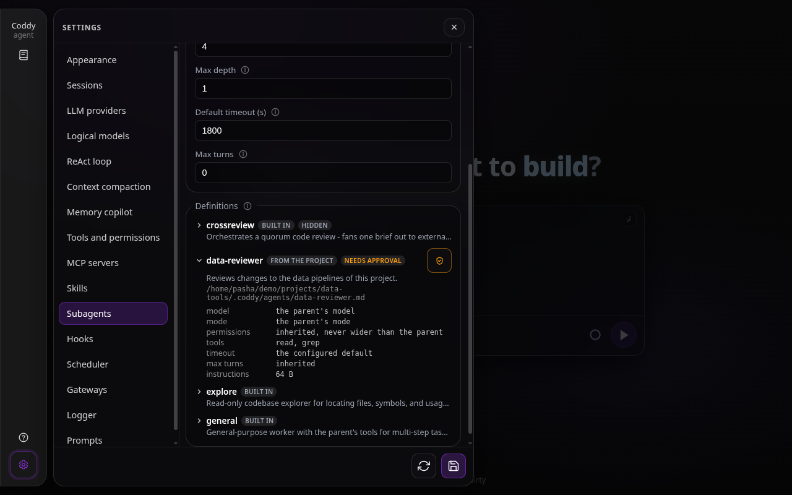
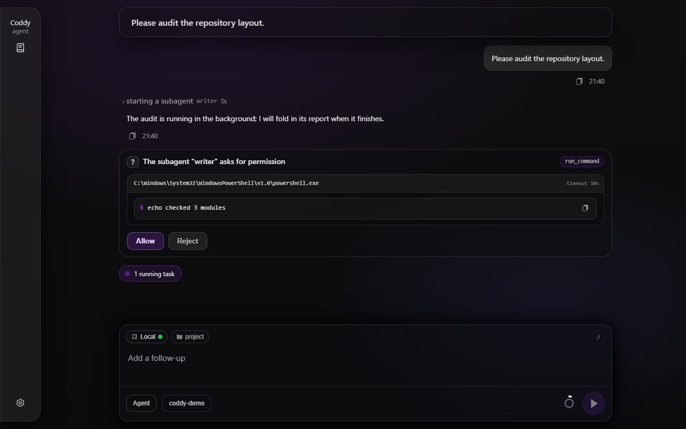
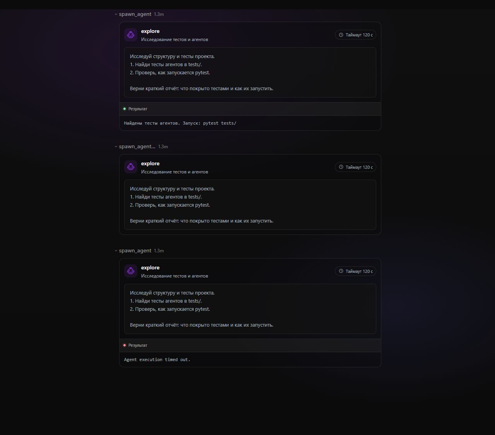
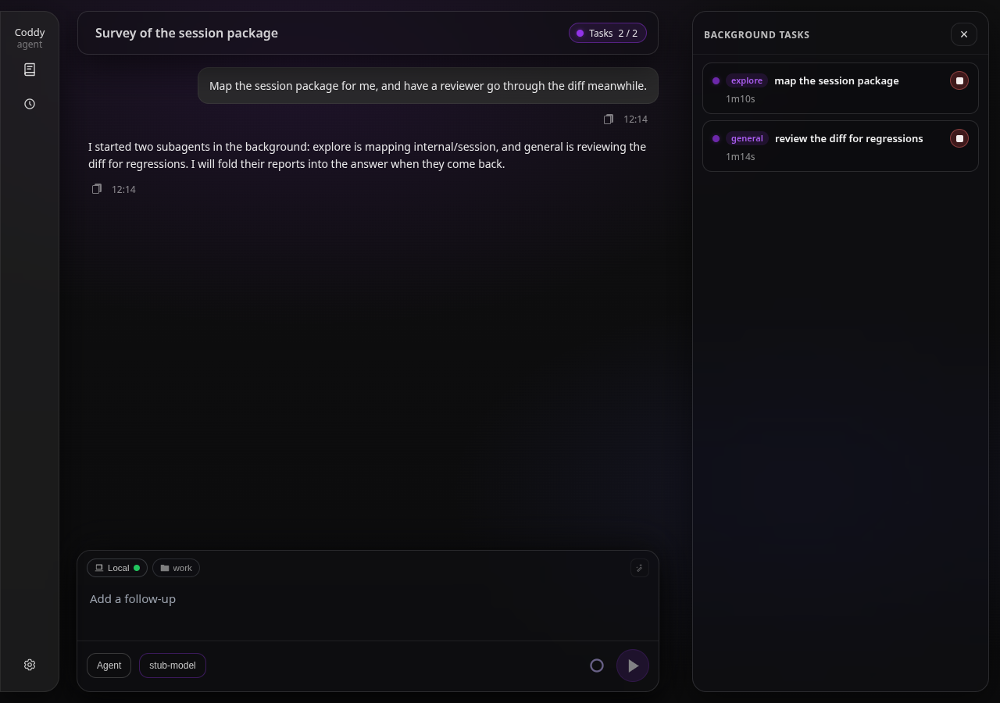
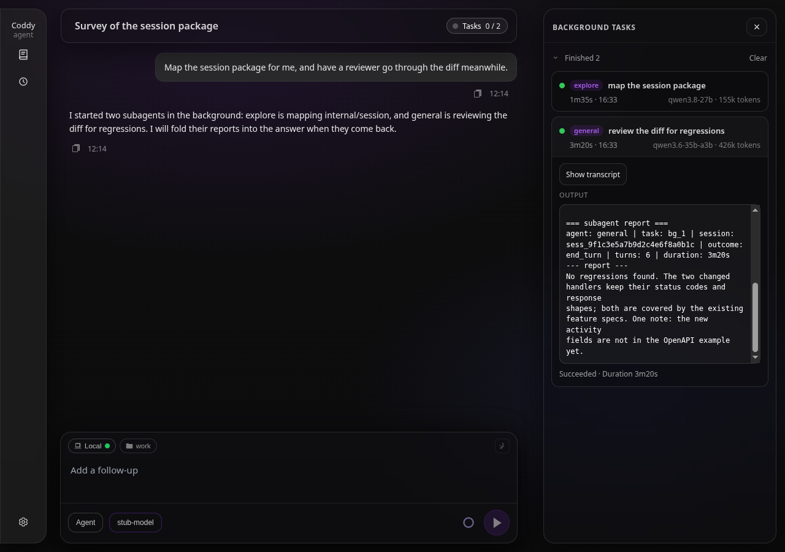
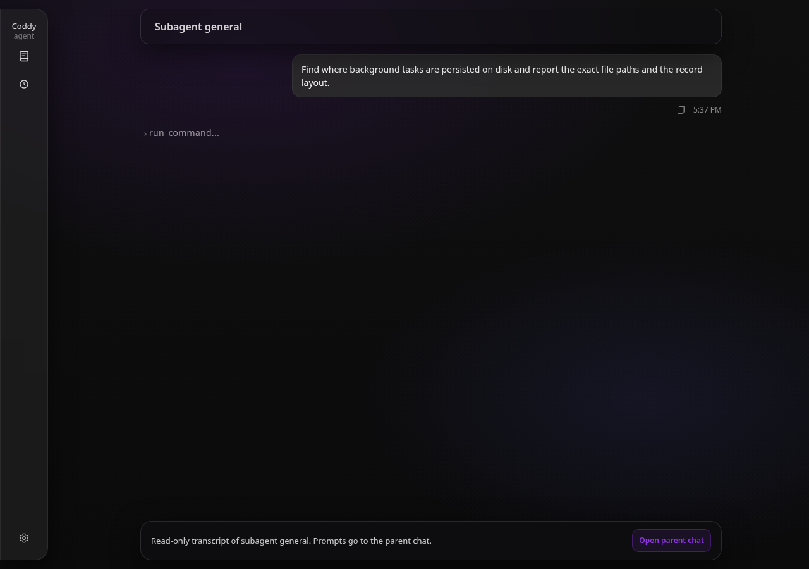

# Subagents

A long investigation or a parallel fan-out (review three modules, run the test matrix per package, research four libraries) fills the one conversation the operator is watching. A **subagent** is a child agent run with its own context window, its own session bundle, and a role prompt the operator wrote in a markdown file. The parent hands it a self-contained task, keeps working, and gets back only the child's final report.

A subagent run is a **task in the background task pool** (`docs/features/background-tasks.md`). Nothing about scheduling, timeouts, the Tasks panel, the REST surface, drain on shutdown, or persistence under `<session>/background/<task_id>/` is specific to subagents; what is new is a second kind of task (`kind: agent`), a child session behind it, and a tool that starts one.

## When the model delegates

A session that may spawn gets a `## Subagents` section in its system prompt: what `spawn_agent` does, when delegation pays off (work that would flood the context, or independent pieces that can run in parallel with `background: true`), how to collect detached runs, and a catalog of the definitions it may use. The guidance is explicit that a one-step task is done directly, and that a new child starts with an **empty context** - the prompt must carry everything, because the child sees none of the parent's conversation. A resumed child is the exception: it keeps its own transcript, so its prompt says only what to do next ([Resuming a run](#resuming-a-run)). Only the child's final message comes back, and the user never sees it, so the parent is told to restate what matters in its own reply.

The section is rendered in `agent` and `plan` mode (a planner fans out investigation the way Claude Code's Explore does; the child of a plan-mode parent is forced into plan mode) and never in `ask` mode, which is read-only and delegates nothing. It is omitted, and the tool hidden, for a session that cannot spawn: the feature is disabled, the surface has no session manager, the turn runs in `ask` mode, or the session already sits at `subagents.max_depth` - unless its own definition declared a `spawns` allowlist, which keeps the tool and narrows the catalog to the listed names ([Depth](#how-capabilities-narrow)).

## Hooks around a child

Operator hooks (`docs/features/hooks.md`) follow the agent into its children. `SubagentStart` fires in the parent before a child starts (it can refuse the spawn, or hand the child context that is prepended to its task) and `SubagentStop` fires in the parent when the child's turn ended, with its outcome and report. Inside the child every ordinary event fires for the child's own turn, and the payload carries a `subagent` block naming the child, its parent session and its depth, so a hook can treat delegated work differently.

## Definition files

### Directories and precedence

Definitions are searched in four default directories, always read, lowest priority first, and then in the extra directories of `subagents.dirs`; a later directory replaces an earlier one **by name**:

1. `${HOME}/.agents/agents` - user scope, the folder other agents share in the user's home;
2. `${CWD}/.agents/agents` - project scope, the shared folder of the workspace;
3. `${CODDY_HOME}/agents` - user scope, the operator's own Coddy files;
4. `${CWD}/.coddy/agents` - project scope, the workspace's Coddy files;
5. every entry of `subagents.dirs`, in order, after the defaults and winning a name over them (empty by default).

The chain is the same as the skills' ([Skills](skills.md#directory-layout)): Claude Code's `.claude/agents` is not read unless `subagents.dirs` names it (`"${CWD}/.claude/agents"`; its frontmatter loads unchanged). A directory named twice is read once, at its last place. `${HOME}`, `${CODDY_HOME}`, `${CWD}` and a leading `~` expand; a relative entry is resolved against the session cwd. Three built-ins sit below every directory, so a user file with the same name replaces a built-in.

Scope is decided on **canonical paths**: the expanded directory and the session cwd both go through the same normalisation the MCP trust store uses (absolute, symlinks resolved, cleaned). A directory at or under the canonical cwd is **project scope** and follows `subagents.project_trust` (below); everything else is **user scope**. A workspace reached through a symlink therefore still owns its `.coddy/agents`.

Inside one directory every `*.md` file is one definition, recursively; dot-prefixed files and directories are skipped. `<dir>/<name>/AGENT.md` is also accepted and takes its default name from the **directory**, not from the `AGENT` stem. Files are visited in lexical order and the first file claiming a name wins; a duplicate is skipped with a logged warning, as is a file without frontmatter, without a `description`, with an invalid name, mode or permission mode, or over the size bound.

### Frontmatter

Only `description` is required. `name` defaults to the file stem (or the directory for `AGENT.md`), lowercased. Unknown keys are ignored so files written for other agents load.

| Field | Aliases | Meaning |
|---|---|---|
| `name` | | Identifier matching `[a-z0-9][a-z0-9_-]*`; what the model passes to `spawn_agent`. |
| `description` | | One line shown to the parent model so it can pick the agent; cut to 200 characters in the catalog. |
| `model` | | A `models[].model` id for the child. An unknown id falls back to the parent's model with a warning in the agent log and a note in the task's output log. |
| `reasoning` | `effort` | A reasoning level the child's model offers, `off` or `default`. A level the model does not offer falls back to its default with a warning in the agent log. |
| `mode` | | `agent` or `plan`. Empty inherits the parent's mode; a read-only parent (`plan`, and `ask` should a spawn ever originate there) always forces its own mode. The parent's mode is the one its turn started in, not the live session mode, so a mode switch landing mid-turn cannot widen a child. |
| `tools` | | Allowlist: a YAML list or a comma-separated string (`tools: read, grep`). Entries are exact tool names, a bare `*`, or a `prefix*` pattern, so `context7__*` admits every tool of one MCP server. Empty means everything the parent has. |
| `disallowed_tools` | `disallowedTools` | Denylist with the same syntax; wins over `tools`. |
| `permission_mode` | `permissionMode` | `ask`, `accept_edits` or `bypass`. Claude Code spellings are accepted (`default` and `prompt` for `ask`, `acceptEdits` / `accept-edits`, `bypassPermissions` / `bypass-permissions` / `dontask`). It can only **narrow** the parent's effective mode. |
| `max_turns` | `maxTurns` | Cap on the child's ReAct rounds. `0` uses `subagents.max_turns`, then `agent.max_turns`. |
| `timeout_seconds` | | The definition's own hard limit for one run (see timeout precedence below). |
| `background` | | `true` forces a detached run even when the model asked for a foreground one. |
| `hidden` | | Keeps the definition out of the model-facing catalog and out of "unknown agent" lists. It is still spawnable by name, and the CLI listing and the HTTP catalog show it with a `hidden` flag. |
| `spawns` | | Spawn allowlist: a YAML list or comma-separated string of subagent names in the `tools` pattern syntax (`explore`, `peer-*`, `*`). Non-empty does two things: the child may delegate only to matching names, and it may do so one level past `subagents.max_depth`, so an orchestrator at the cap can still spawn its reviewers. Honored only for `builtin` and `user` scope - a project file's `spawns` is parsed and shown in the catalog but the runtime ignores it, so a checked-in definition cannot widen the depth guard. |

### The body is the role

Everything after the frontmatter is the child's role block. The child's system prompt starts with a fixed preamble (`## Your role as a subagent`: you are the subagent *name*, spawned by a parent to complete one self-contained task, you see nothing of the parent's conversation, you cannot ask the user questions, only your final message reaches the parent, so finish with a concise report) followed by the body verbatim. The rest of the prompt is the ordinary agent or plan template, so skills, rules and the environment block are present as in any session.

A minimal definition:

```markdown
---
name: reviewer
description: Reviews a diff or a module for defects and reports findings with file paths and lines.
tools: read, glob, grep, print_tree, run_command
permission_mode: ask
max_turns: 20
---
You review code. Read before you judge, cite `path:line` for every finding,
separate defects from style remarks, and end with a short verdict.
```

### Bounds

The loader and the tool keep a definition tree from flooding the prompt: at most **200** definitions per directory (the rest are skipped with a warning), a file over **256 KiB** is skipped, a role body over **64 KiB** is truncated with a marker, `description` is cut to **200** characters, and a `spawn_agent` `prompt` over **32 KiB** is refused. The task label is `agent <name>: <description>` where `description` is the call's own argument, falling back to the first line of the prompt; the whole label is capped at **60** characters, the pool's rule for command labels.

Every loaded definition is an **immutable value** carrying its scope, its path and a SHA-256 **digest** of the file bytes. The file is read once; trust, the tool set and the role are all decided on that same value, never on a re-read.

## Built-ins

Three definitions ship embedded so delegation works before the operator writes a file. All are listed with scope `builtin` and path `(embedded)`.

- **`general`** - a general-purpose worker with the **parent's tool set** (no `tools` restriction of its own), for multi-step tasks, research, or independent units of work that can run in parallel. Its role tells it to read before changing anything, keep edits minimal, verify when the task calls for it, never retry a permission the operator did not grant, and report what it did and what the parent must still decide.
- **`explore`** - a read-only explorer for locating files, symbols and usages and gathering evidence before changes are proposed. Its tool list is exactly `read`, `keep_result`, `glob`, `grep`, `print_tree`, `websearch`, `webfetch`, `load_skill`, `coddy_docs_search`, `coddy_docs_read`, `background_list`, `background_output`, `background_wait`: no `run_command`, no writes, no MCP tools. Plan mode alone would not be read-only (it still offers the shell), which is why the list is spelled out. Because nothing in that set is an MCP tool, an `explore` child never dials an MCP server.
- **`crossreview`** - a `hidden` orchestrator that sends one review brief to external code-agent CLIs (`run_command` background tasks) and internal `explore` children, keeps them blind to each other, waits for every answer, verifies each finding against the code and decides alone what to fix, what is not worth fixing and what to reject; its report is the final word the parent relays. It is the reason `spawns` exists: its definition declares `spawns: [explore]`, so it keeps `spawn_agent` at the depth cap and delegates to exactly that one reviewer kind. A session reaches it through the bundled `/crossreview` skill, which handles detection, the agent and model questions, the reviewer roster and the brief.

## Scopes and project trust

A definition that arrived with the checkout directs a child's tools, and the permission gate does not cover everything a child can do: `websearch` and `webfetch` ask nobody, MCP calls bypass the prompt, and the model may delegate on its own because the `description` invites it. So a **project-scope** definition is trusted the way a project-local MCP declaration is: by an out-of-band receipt bound to the workspace and to the file content, not by an in-chat prompt (every sender in the tree auto-allows prompts under `permission_mode: bypass`, so a prompt could be granted by nobody).

`subagents.project_trust` takes the same vocabulary as `mcp.project_trust`:

- **`deny`** - project-scope directories are not read at all. Agent discovery, `coddy agents list` and the HTTP catalog omit them; the test proves the files stay unread.
- **`ask`** (default) - project-scope definitions load and are listed as `needs_approval` until a receipt exists for `(canonical workspace, name, digest)`. Spawning one without a receipt is **refused** in the runtime, on the resolved definition: the tool result says the definition comes from a project file that is not approved for this workspace and names the ways to approve it, so the model can tell the operator and retry afterwards. The catalog block in the prompt lists such an entry by **name only**, with a fixed notice that it is awaiting approval and how to approve it; the file's description is withheld until the receipt exists, so an untrusted checkout cannot put a single line of its own into the parent's system prompt. Descriptions of approved and user-scope definitions are flattened to one line before they are rendered.
- **`allow`** - project-scope definitions behave like user-scope ones.

Built-ins and user-scope files are always `trusted`. Whatever the scope, `permission_mode`, `tools` and `disallowed_tools` only ever narrow the parent's capabilities, `spawns` is ignored for project scope, and a definition carries no hooks, commands or MCP declarations of its own, so nothing in it starts a process at load time.

Receipts live in **`~/.coddy/subagents-trust.json`** (`<home>/subagents-trust.json`), a sibling of `mcp-trust.json` rather than the same file, so an MCP approval can never read as an agent approval or the reverse:

```json
{
  "version": 1,
  "workspaces": {
    "/home/me/project": [
      { "name": "reviewer", "digest": "3f2a…", "path": "/home/me/project/.coddy/agents/reviewer.md", "approved_at": "2026-09-03T10:15:00Z" }
    ]
  }
}
```

Rewriting an approved file changes its digest and the receipt stops matching, so the next spawn is refused again until it is re-approved. Approving a name replaces any earlier receipt for that name in that workspace. The store re-reads the file on every decision, so an approval granted from a terminal reaches a running agent on its next spawn without a restart.

Approval surfaces:

- **CLI**: `coddy agents list [--cwd DIR]` prints the workspace, the effective policy and the catalog with scope, trust state and flags, followed by a hint when project definitions await approval; `coddy agents trust <name> [--cwd DIR]` prints the effective declaration first (file, model, mode, permission mode, tool lists, digest, receipt path) and then records a receipt for the file as it is on disk right now; `coddy agents untrust <name> [--cwd DIR]` withdraws it. A built-in or user-scope name needs no approval and the command says so. `--cwd` defaults to the process working directory, resolved like `coddy mcp`.
- **HTTP** (`coddy serve`): `GET /coddy/subagents?cwd=<dir>` returns the catalog; `POST /coddy/subagents/{name}/trust` and `POST /coddy/subagents/{name}/untrust` with body `{"cwd": "<dir>"}` write and remove receipts. `cwd` must be absolute and defaults to the server's own working directory; a trust body may add the `digest` the catalog showed, and a file rewritten since is refused with 409 rather than approved unseen. Catalog rows carry `scope`, `trust` (`trusted` / `needs_approval`), the booleans `trusted` and `needs_approval`, `digest`, `path`, `builtin`, `hidden`, and the bounds the definition declares (`tools`, `disallowed_tools`, `permission_mode`, `timeout_seconds`, `max_turns`, `background`, `spawns`, and `role_bytes`, the size of its role body) so a client can show what a definition declares. A bound the file does not declare is absent, which means it inherits; the role body itself is never served. Errors are `{"error":{"message"}}` JSON. Details in `docs/reference/http-api.md`.
- **Settings → Subagents** in the web UI lists definitions and approves them. The tab opens with the `subagents.enable` switch, then **Definition directories** and the rest of the `subagents` config form in its own **Subagent settings** block, and below them the catalog of the workspace of the session on screen (`spawn_agent` resolves definitions against the session's own cwd, so that is the workspace listed). Each definition shows its name, a scope badge, its description as plain text and its file; the chevron in front of the name folds open what the definition declares: the model, mode, permission mode, tool lists, timeout, turn cap, whether it always runs detached and the size of its instructions (a bound the file leaves out reads as inherited). Under `ask` a project definition carries the shield of the MCP tab: clicking it records the receipt for the file the row showed (its digest goes with the request, so a file rewritten in between is refused), and clicking it again withdraws the receipt. One still awaiting a receipt also carries an amber **needs approval** badge whose tooltip names the shield and `coddy agents trust <name>`.
- **Policy**: a checkout you already trust can run its definitions without receipts by setting `subagents.project_trust: allow`, in `config.yaml`, under **Settings → Subagents** in the web UI (the `subagents` config section: policy and pool bounds), or through the bundled `configure-coddy` skill, which documents the key so the agent can stage `set subagents.project_trust=allow` and commit it through the ordinary permission-gated config commit. The policy applies when the form is saved.



*Settings, Subagents tab: the definitions of the session workspace, one awaiting approval, with the shield that approves it*

## The `spawn_agent` tool

| Argument | Meaning |
|---|---|
| `agent` | Definition name (required). |
| `prompt` | The task, self-contained: goal, relevant paths, constraints, and what the report must contain (required, at most 32 KiB). |
| `description` | Three to five words naming the task; becomes the task label and the child session title. |
| `background` | Return the task id at once instead of waiting for the report. Default `false`. A definition with `background: true` forces it on. |
| `expected_seconds` | The model's own estimate; drives the status ticker and, when no timeout is given, the hard timeout - the same advisory semantics as a backgrounded `run_command`. |
| `timeout_seconds` | Hard limit for the run. |
| `model` | A configured model id for the child, over the definition's `model` and the parent's. An id the configuration does not know is refused with the list of configured ones. |
| `reasoning` | The child's reasoning level: a level its model offers, `off` or `default`; over the definition's `reasoning`. A level the model does not offer is refused. |
| `notify_on_finish` | For a background run: wake the parent with the outcome when the child finishes, by default where a waker is available; set `false` explicitly to disable it ([Background tasks](background-tasks.md)). Forced **off** for a foreground spawn, whose report already comes back in the tool result, and for any spawn made by a child. |
| `resume` | Continue a finished run of this session instead of starting a new child: its task id (`bg_…`) or its child session id (`sess_…`) from an earlier result. The child keeps its transcript and takes `prompt` as its next message; `agent` must name the same subagent ([Resuming a run](#resuming-a-run)). |

The tool is registered when `subagents.enable` is on and offered in `agent` and `plan` mode, never in `ask` mode. It needs **no permission prompt of its own**: launching a child changes nothing by itself, every tool call the child makes is gated on its own, and project trust is decided inside the runtime hook before anything starts.

A **foreground** spawn (the default) blocks the tool call until the child's turn ends and returns the report in an envelope:

```
<subagent task="bg_3" session="sess_9f1c…" agent="explore" status="succeeded" turns="4">
<![CDATA[
…the child's last assistant message…
]]>
</subagent>
The user did not see this report: restate what matters in your own reply. The full transcript is session sess_9f1c… (Tasks panel → Show transcript).
```

`status` is the pool's verdict for the task (`succeeded`, `failed`, `timed_out`, `stopped`); when it is anything but `succeeded` a line says so and tells the model to treat the report accordingly, and a run that ended with an error names it. A child that reaches `max_turns` or produces no final message is `failed` with that reason, even if its turn returned without an error; text it wrote on the way to `max_turns` comes back as the report, and the reason says it is not a conclusion. `turns` is the number of assistant rounds this run wrote into the child's transcript (a resumed run counts only its own). The report is wrapped in CDATA so nothing the child wrote can break the envelope.

A **background** spawn returns at once:

```
Started subagent explore as background task bg_3 (child session sess_9f1c…).
Hard timeout 30m.
You will be woken with the outcome when it finishes, so you can end your turn now.
```

That last line is the default where something can wake the parent. `coddy -p` runs no waker and a child's transcript closes with its turn, so there the line says that nothing will wake the model, and the task records no wake ([Background tasks](background-tasks.md#which-process-wakes-the-agent)). An explicit `notify_on_finish: false` also keeps the task quiet. From here the run is an ordinary task: `background_list` shows it, `background_output` streams the child's progress log, `background_wait` blocks for it and returns the log ending in the report block, and `background_stop` cancels the child. Collecting a finished report or stopping the task prevents a redundant wake.

Refusals are returned as tool errors that name the knob that applies: an unknown name (with the list of visible definitions), a name outside the spawning definition's `spawns` allowlist (which names the list), a project file without a receipt (with the approval commands), `subagents.max_depth` reached, a prompt over 32 KiB, `subagents.max_concurrent` runs already in flight, the pool's own per-session limit (`tools.background.max_concurrent`), and the pool draining for shutdown. With `subagents.enable: false` the tool is not registered at all. A surface without a session manager is never advertised the tool, and a call anyway answers that subagents are not available in this session.

## How capabilities narrow

Everything a child may do is derived from the parent at spawn time and can only shrink.

- **Mode.** A read-only parent (`plan`, `ask`) always produces a child in its own mode. Otherwise the definition's `mode` applies, or the parent's mode when it is empty. The parent mode is the mode the spawning turn was admitted in: a `session/set_mode` that lands while the turn runs changes neither the child's mode nor the parent tool set the child is intersected with.
- **Permission mode never widens.** The child runs with the stricter of the parent's effective mode and the definition's request, on the scale `ask` < `accept_edits` < `bypass`. A definition asking for `bypass` under an `ask` parent gets `ask`; an empty request inherits.
- **Tool set intersection.** The child's effective set is computed once at spawn: the parent's own callable set (its mode set, and its own effective set when the parent is itself a child), intersected with the child mode's set, intersected with the definition's allowlist, minus the definition's denylist, minus the mandatory exclusions. MCP tool names are part of the set and matched by exact name or `prefix*`, so a child sees an MCP server only when the parent had it and the definition admits it.
- **Mandatory exclusions.** `question` (a child cannot ask the user; `RequestQuestion` always refuses), `config_set`, `config_changes`, `config_commit`, `config_revert`, `config_rollback` (a child cannot rewrite the agent's own configuration), `plan_exit` (a child cannot leave plan mode on the operator's behalf), and `spawn_agent` for a child at the depth limit.
- **Enforced twice.** The definitions advertised to the child's model are filtered to the set, and every call is checked again before the permission gate runs, MCP calls included: a hallucinated or replayed `run_command` is answered with `tool run_command is not available to this subagent` and never executed.
- **Depth.** `subagents.max_depth` bounds nesting. The default `1` lets a session spawn children that cannot spawn further; the tool is withheld from a child at the limit and a spawn past it is refused. An explicit `0` forbids spawning everywhere. One bound exception exists: a definition that declares `spawns` keeps `spawn_agent` at the cap and may delegate exactly one level past it, to exactly the names on the list - a `spawns` allowlist restricts the names at every depth, and a child deeper than the cap never gets the tool, so the exception buys exactly one extra generation (the bundled `crossreview` orchestrator is why this exists).
- **Model.** The child inherits the model the parent session is running with unless the definition's `model` names a configured `models[].model` id; an unknown id keeps the parent's model, and the fallback is noted both in the agent log and in the task's output log.
- **Turns.** The definition's `max_turns`, else `subagents.max_turns`, else `agent.max_turns`.
- **MCP.** Servers are dialed for the child only when its effective set can contain MCP names. Configured servers are re-resolved for the child's cwd through the workspace trust gate exactly as for a new session, and the parent's ACP client-supplied servers are redialed from the declarations the parent retained. The child owns and closes its own clients; nothing is borrowed from the parent, so a parent reload or forget cannot cut a child mid-run.

## Permission prompts of children

A child in `ask` or `accept_edits` mode still hits the permission gate, and the child has no client of its own. Each spawn therefore creates a **relay** that owns the parent's sender and the parent turn that made the spawn (the tool call context), plus the child's own cancel:

- while the spawning turn is alive, a request is forwarded to the parent's client with the **parent's session id** and the title `[subagent <name>] Run: <tool>`, so the ACP editor, the console modal, the web UI or the Telegram chat shows it in the parent conversation. The wait also watches the child, so a stopped child unblocks with a denial; a parent turn that ends while the prompt is still on its screen withdraws that copy and hands the prompt to the broker below, so it is answered once, where the conversation is still read;
- once the spawning turn has returned - a **detached** run's normal state - a request never touches the finished turn's transport: it goes to the surface's **detached-permission broker** (below), and where no broker exists it is refused at once with a reason the child reports instead of claiming the user said no (`permission not granted: this subagent is running detached ...`);
- at most **one prompt is in flight per parent session**: an arbiter serialises the requests of every child of that parent, which is also what the HTTP pending-permission record (one per session) can represent. Two children asking at once are prompted one after the other;
- a child spawned by a later turn carries that turn's context, so an earlier detached child's finished turn does not deny it.

How the operator's own settings combine with this. A global `tools.permission_mode: bypass`, or a parent session switched to bypass, silences the parent and every child that **inherits** that mode. A definition that narrows to `ask` or `accept_edits` is a different case: the relay stamps the child's own effective mode on every forwarded request, and every sender that can auto-allow (the ACP server under a global bypass, the HTTP bridge, the console, print mode, the Telegram gateway) decides from that stamp rather than from the parent's session or the global setting. Such a child is prompted where a human can answer (the SPA, the console, a `--remote` console or ACP client, a local ACP editor, the Telegram chat, which asks with buttons) and denied where nobody can (print mode, a non-streaming HTTP turn). The stamp only ever gets stricter on its way up: a grandchild's prompt crosses two relays, and the intermediate child cannot re-widen it. A forwarded prompt offers **allow** and **reject** only; the "always" answers are withheld because a run of a child is one turn and a standing grant could not outlive it. Forwarded prompts are answered live or not at all: the HTTP bridge does not write them into the parent's pending permission record, so a page reload or a reconnect cannot resume one (the child's own timeout or the parent turn's end withdraws it), and the parent's own gate keeps that record for itself.

### Detached runs: the prompt outlives the turn

`background: true` is a request for a run that outlives the turn that started it, so the gate has to outlive it too. When the spawning turn is gone the relay hands the prompt to a **broker** (`agent.DetachedPermissionBroker`, the same seam shape as `SubagentRuntime`) and blocks on it. As with a background subagent in Claude Code, the prompt appears in the conversation the person is reading and names the subagent that asks; **Reject** refuses that one call and the subagent carries on:

| Surface | Where a detached child's prompt appears |
|---|---|
| Web UI (`coddy serve` with the HTTP surface) | at the end of the parent session's chat, in the same card as an inline prompt, with the subagent named in its head |
| Console | the permission modal, titled `[subagent <name>] ...`, between turns too; a prompt that arrives while another modal is open waits for it |
| Console with `--remote` | the same modal, for the sessions this console opened, announced by the server's events stream |
| Telegram (`coddy serve` with the gateway) | a message with **Allow** and **Reject** buttons in the chat that owns the parent session |
| `coddy acp`, print mode, a scheduled run | nowhere: the child is refused at once with the reason above and reports it |

- **`coddy serve` offers the prompt to every surface at once.** The runner of the shared session manager hands every turn the runtime as its broker, and each surface offers itself as it comes up (`serve.Runtime.AddDetachedPermissionApprover`): the HTTP server, and a Telegram bot for the sessions that are its chats. The first answer settles the prompt and every other copy is withdrawn: the web card leaves the chat, a remote console's modal closes, the Telegram message reads *No longer waiting*. A surface that cannot show a prompt stays out of it; when none can, the child is refused with its reason.
- **A prompt still on the parent's screen when the turn ends moves the same way.** A background child usually starts asking while the parent is still writing its reply, and the answer may not come before that reply ends; the stream that carried the prompt is gone with the turn, so the relay withdraws the copy the parent's client showed - the console takes its modal down, the HTTP bridge stops waiting, the Telegram message reads *No longer waiting* - and raises the prompt through the broker, where it is answered once, as a detached prompt. Only where no broker exists is the child refused, with the reason above. In the web UI the inline card of the finished turn is retired with its stream, and the card at the end of the chat is the one that answers.
- **The web UI** reads the prompt from the background task row of the run that is blocked (`pending_permission` on `GET /coddy/sessions/{id}/background-tasks`) and re-reads the rows on `event: subagent_permission` of `GET /coddy/events` (phases `asked` and `settled`), the task poll being the fallback. The answer goes to `POST /coddy/sessions/{child}/permission`. No route is new: the permission hub is keyed by `(session id, tool call id)` rather than by a live turn, and the handler consults it before the guard that keeps a child transcript read-only. A console attached over `--remote` reads the same events (the connect-time snapshot repeats the prompts still waiting) and posts to the same route.
- **Telegram** allows what a chat's own agent asks without a question, but asks about a subagent's request - during the turn and after it - with inline buttons. Only the person whose session asked may answer: in a group with individual sessions another member's tap is ignored.
- The prompt does **not** take the parent's arbiter slot. That slot exists because the parent holds a single pending record, while a detached prompt is keyed by its own child session and can wait for minutes; a sibling's live prompt must not queue behind it. The "always" answers are withheld here too.
- Nothing is persisted. The waiter is a goroutine, so a prompt cannot outlive the process that raised it; after a restart the run is gone and the drawer shows its task as orphaned.
- The wait ends with the run's own context, which the pool's timeout, an explicit stop and shutdown all cancel. A waiting run still counts against `subagents.max_concurrent` and against the parent's `tools.background.max_concurrent`, which is the truth about what it is doing, and a prompt nobody answers holds the run until its hard timeout.



*A background subagent asking for permission at the end of its parent chat*

## Concurrency and timeouts

Two caps apply to a spawn, and each refusal names its own key:

- **`subagents.max_concurrent`** (default 4) is **process-wide**: the number of child LLM loops that may run at once, whatever session started them. It is a resizable semaphore that refuses rather than queues, matching the pool's "refused, not queued" contract; the message tells the model to wait with `background_wait` or `background_list` and try again. Lowering the cap under load never stops a running child; new spawns are refused until the count drops under the new limit. The value is re-read on every spawn, so a config commit applies without a restart.
- **`tools.background.max_concurrent`** is the pool's **per-session** task limit, and a child's task is registered under the **parent's** session, so subagent runs count against the parent's tasks like its background commands do. A spawn refused because this limit is full names `tools.background.max_concurrent`, so the model can tell the two caps apart.

The hard limit for one run is resolved in this order: the call's `timeout_seconds`, then the definition's `timeout_seconds`, then `expected_seconds × 3` floored at 60 s, then `subagents.default_timeout_seconds` (1800). The result is capped by `tools.background.max_timeout_seconds`, exactly like a background command. Hitting it cancels the child and records the task as `timed_out`, which is a failure, not a success.

## When the provider connection drops

A subagent works unattended: nobody reads its transcript while it runs, and nobody can type "continue" into it. A failure of its model provider's lane (a connection the remote host closed, a reset, a proxy's 5xx, a stream gone silent) is a failure of the lane, not of the task, so the child rides it out the way an interactive turn does ([A provider fails in the middle of a turn](../getting-started/troubleshooting.md#a-provider-fails-in-the-middle-of-a-turn)), only for longer. The text it had written stays in its transcript, and after a pause the step runs again with the model asked to go on from where it stopped. An interactive turn rides out two failed calls in a row and ends with the third, because the person reading it decides what happens next. A subagent and a scheduled run ride out five in a row and end with the sixth, pausing 5 s, 20 s, 80 s, 2 min and 2 min at the default `agent.llm_retry_base_ms`: about six minutes when the run has room for them. Each recovery takes one of the run's turns (`max_turns`), and the run's hard timeout cuts a pause short and ends the run as `timed_out`, so a run with a short timeout or a low turn limit gives up sooner. A call that succeeds starts the count again. The memory subagent keeps the interactive budget, since its report only matters to the turn waiting for it, and `agent.llm_retry_max: 0` turns the recovery off everywhere.

Windows reports a dead connection with Winsock's own codes, `WSAECONNRESET` (`wsarecv: An existing connection was forcibly closed by the remote host.`) and `WSAECONNABORTED` (`An established connection was aborted by the software in your host machine.`). Both count as a connection that died, like `connection reset by peer` on Linux ([issue #389](https://github.com/coddy-project/coddy-agent/issues/389)).

Every reconnect is a line of the task's progress log, after the text the child had written, so a run waiting out an outage does not read as a hung one:

```
subagent general (task bg_5, session sess_e20a…) starting
[assistant] Reading the files
↻ provider failed (provider "cockpit" (http://localhost:62557/v1): openai stream: read tcp 127.0.0.1:53107->127.0.0.1:62557: wsarecv: An existing connection was forcibly closed by the remote host.); reconnecting in 5s (attempt 1 of 5)
[assistant] …the rest of the answer…
```

### Resuming a run

A provider that stays down longer than that, the run's timeout or its turn limit end the run without its report, and its transcript keeps everything it did. The parent does not start a second subagent on the same task from an empty context: `spawn_agent` with `resume` set to the run's task id (or its child session id) continues that same child. The child session is reopened from its bundle, `prompt` becomes its next message after the earlier transcript, and the run is a new task of the parent (a new `bg_…` id) on the same child session:

```json
{"agent": "general", "resume": "bg_5", "prompt": "The provider is back. Go on from where you stopped."}
```

- The run is decided like a new spawn, against the definition as it is now: its trust receipt, the mode, the permission mode, the tool set, the reasoning level and the timeout. `agent` must name the subagent the run belonged to. The child keeps its title, and the model its earlier run worked on unless the call names another one; a model removed from the configuration since is replaced like an unknown one, and the task log names both. Nothing an earlier run was allowed carries over: the grants its answers recorded stay behind, and the resumed run asks again.
- The transcript is continued as it was left, with one repair: a call it holds no result for (the run was stopped or timed out in the middle of a batch of calls, or the process died during one) is answered as having no recorded result, which may or may not have run, so the model checks the current state before it makes the call again. A provider refuses a request that carries a call without its result, so without the answer the resumed run would fail on its first step.
- A run whose transcript is not on disk is refused before anything starts: its child session was never created (the run failed on the way), or the child was deleted since.
- The child is continued only in the workspace it worked in. After the session moved to another folder, the resume is refused, because the transcript's paths and results belong to the old one; start a new subagent for the task there.
- Only a finished run of this session is resumed. A run still in flight is refused (wait for it with `background_wait` or stop it with `background_stop` first), and so are the memory subagent and anything that is not a child of this session. A scheduled run is a child of its job session, never of a chat.
- The report, the turn count and the envelope belong to the resumed run: an answer the earlier run gave is not passed off as the report of a run that wrote nothing. The task log opens with `subagent <name> (task bg_…, session sess_…) resuming`, and a background resume answers `Resumed subagent <name> as background task bg_…`.
- A run that did not succeed says how to go on where the parent reads it. The foreground envelope and the report block of the task log carry `call spawn_agent with resume="bg_5" and agent "general" …`, after `The run was cut by a failure of the model provider, not by its task.` when that is what happened, and the turn a failed background run wakes names the same call. The catalog in the parent's system prompt says it too.

A surface still cannot message a child: the transcript stays read-only for everyone but the parent that spawned it ([Child sessions](#child-sessions)).

## Child sessions

A spawn creates a child session with an ordinary session id, generated before the pool is involved so the very first task snapshot already carries it; a resumed run reopens the child session of the run it continues ([Resuming a run](#resuming-a-run)). Nothing about the id says the session was delegated - it is the same **`sess_<24 hex>`** a chat gets - and what marks it is where the bundle sits and what its metadata says. The child is a real session bundle **inside the parent's**, at **`<sessions root>/<parent>/subagents/<child>/`**, built the same way `session/new` builds one (skills, rules catalog, persistence), with its title pinned to the task label and its `session.json` carrying `subagentRun: true`, `parentSessionId`, `subagentName`, `subagentTaskId` and `subagentDepth`. A child that spawns a child of its own nests one level deeper. While the child runs it is registered as a live session, so a transcript read is served from the one live state; after it finishes the bundle serves the transcript like any closed session.

- **Hidden from History.** Child sessions stay out of every default listing: the web UI History, `GET /coddy/sessions`, `coddy sessions list`, `coddy -c`, and ACP `session/list`. `GET /coddy/sessions?include_subagents=true` includes them.
- **Read-only transcripts.** A surface cannot message a child; only the parent that spawned it continues it, with `spawn_agent` `resume` ([Resuming a run](#resuming-a-run)). Any prompt against a child session that is not the child's own task turn (a composer `POST /v1/responses`, an ACP `session/prompt`, a console prompt, a run-plan request, the background waker) is refused with `subagent sessions are read-only transcripts: <child> belongs to <parent>`; over HTTP that is a **409** naming the parent. The SPA renders the child's transcript with the composer replaced by a notice linking back to the parent chat.
- **From the Tasks panel.** The card of an agent task carries the agent's name as its tag and the description of the run as its title, and its meta line names the model the child runs on and the tokens its calls have spent so far - input and output together, the call in flight estimated until the provider reports it - so a run that burns through a large context shows it while it runs. The row of `GET /coddy/sessions/{id}/background-tasks` carries the same figures as `agent.model`, `agent.input_tokens` and `agent.output_tokens`, and the task's record keeps the final ones. Opened, it shows **Show transcript**, which routes to `#/s/<child id>`, where a shell task shows its command. The live progress log in the card's output box is the report while it runs; the transcript shows the child's tool calls and its final answer.
- **Deletion cascades.** `DELETE /coddy/sessions/{id}` removes the whole tree through one path: the requested session plus every descendant, found by walking the `subagents/` folders of its bundle, root to leaf. Every node's representing task is stopped and awaited first (a child's task lives under its parent, so this reaches a running child and a running descendant alike), then any remaining tasks of every node, and only then are the bundles removed deepest first, the requested session last. Before any of that, an active turn of any node is cancelled and awaited and a turn arriving during the deletion is refused; a turn that ignores its cancellation past the settle timeout (15 s) aborts the deletion with nothing removed (HTTP `409`). The tree is rescanned after it is marked until no new descendant appears, so a child created while the deletion starts is removed with it rather than orphaned. Nothing writes into a removed bundle afterwards.

## Scheduled runs

A run the scheduler starts ([Scheduler](../operate/scheduler.md)) is a child of this same kind: a task of kind `agent` under the job's session, a child session with its transcript, the same progress log, the same retirement and the same read-only rule. What differs is the parent - a job session that never runs a turn, not a chat - and what the child is told: its role block says it is a scheduled job started unattended, its `session.json` carries `schedulerJobId` and `schedulerTrigger`, and the transcript's notice links back to the job's runs instead of a parent chat. A job may name a definition (`agent:` in its frontmatter) to run under its role, tools, model, reasoning level and permission narrowing, with the same trust rule as a spawn and the same rule for the level (applied when the run's model offers it); without one the run has the full tool set of its mode. It sits at depth 0, so within `subagents.max_depth` it may spawn children of its own, which count against `subagents.max_concurrent` like any spawn.

## Lifecycle rules

- **One turn per run.** A run is exactly one prompt turn of the child through the session manager's normal path, so it takes the turn lock, reports activity edges, honours cross-process cancel and persists like any session. A resumed run is one more turn of the same child session, reopened from its bundle and retired again when it ends ([Resuming a run](#resuming-a-run)).
- **Retirement settles the child's own work first.** A `general` child inherits backgrounded `run_command` and, below the depth limit, `spawn_agent`, so it can leave a command or a detached grandchild running when its turn returns. A retired child is a read-only transcript with no turn left to collect them, so before the live entry is dropped every task the child owns is stopped and awaited (a grandchild's handle cancels that grandchild, whose own retirement recurses the same way). Finished task records stay in the child's bundle. The time this settlement takes, bounded by the pool's 3 s stop grace per task, counts toward the child's own hard timeout. Then the child's MCP clients are closed and its live entry dropped; the bundle stays on disk.
- **Nobody is woken on a child's behalf.** A spawn made by a child never carries `notify_on_finish`, and a woken turn aimed at a child session is refused by the read-only guard, so a task finishing around retirement starts no turn.
- **Parent turn cancelled (Stop).** A foreground child runs on a context derived from the parent's tool call, so it is cancelled with the parent and the tool result reports the final status. A detached child runs on a context detached from the tool call, because that context ends the moment the tool returns; it keeps running by design and is stopped from the Tasks panel or with `background_stop`.
- **Shutdown and drain.** Server drain stops agent tasks like commands: each handle cancels its child, the child is retired and its limiter slot released. Nothing new starts once the pool is draining.
- **Every exit path releases.** Pool refusal, a failure to create the child session (recorded as a `failed` task), timeout, stop, parent cancellation, a panic in the run (recovered and reported as `failed` with the panic text) and normal completion all go through one idempotent finish, so a slot is never leaked and never freed twice.
- **Parent forgotten or reloaded.** The child has its own state and its own MCP clients, so nothing it depends on is closed underneath it.

## Task rows and the output log

An agent task row (`background_list`, `GET .../background-tasks`, the persisted `meta.json`) carries `kind: "agent"`, the label `agent <name>: <description>`, the parent's `session_id`, the spawning `tool_call_id` (so the transcript row keeps its live chip), and `agent: {"name": "<name>", "session_id": "sess_…"}`. It reports no pid: the handle behind it is not an OS process, so the survivor probe never mistakes it for one.

The child never writes to the parent's stream. Its progress goes to the task's output sink as compact log lines, which is what `background_output` and the panel show while it runs:

```
subagent explore (task bg_3, session sess_9f1c…) starting
→ grep
✓ grep
[assistant] The runtime is wired in four places…
=== subagent report ===
agent: explore | task: bg_3 | session: sess_9f1c… | outcome: end_turn | turns: 4 | duration: 41s
--- report ---
…the child's last assistant message…
```

`✗ <tool> (failed)` marks a tool call that failed or was refused, including one outside the child's tool set, and `↻` a reconnect after a provider failure ([When the provider connection drops](#when-the-provider-connection-drops)). `outcome` is the child's stop reason (`end_turn`, `cancelled`, `failed`, or another ACP stop reason), `turns` is the number of assistant rounds this run wrote (the same count the foreground envelope carries), and an `error:` line precedes the report when the run ended with one.

## System children: the memory subagent

The runtime starts one child of its own: with `memory.enable` on, every user turn launches the **memory subagent**, which recalls and persists the long-term notes ([Long-term memory](memory.md)). It is built on the same machinery as a `spawn_agent` child - a task of kind `agent` in the pool, a child session inside the parent's bundle, the same transcript and log - through a launcher of its own, so not every spawn rule holds for it:

- its task row carries `agent.system: true` and the name `memory`; the Tasks panel tags its card `memory` where a delegation carries its agent's name, and the model-facing pool tools omit it and refuse its id;
- it is admitted past `tools.background.max_concurrent` and never counted against it, and `subagents.max_concurrent` does not count it either; its own bounds are two runs per session and sixteen per process;
- it has six tools its parent does not have, the one exception to the rule that a child's set only narrows: the set is fixed in code, granted only to this child, never through a definition file, and it reaches nothing but the two note roots. Its mode is always `agent`; an ask-mode turn narrows it to the three recall tools;
- `SubagentStart` and `SubagentStop` do not fire for it (they describe delegations the model chose); inside the child the ordinary events fire with `"kind": "memory"` in the `subagent` block of the payload;
- it takes no permission relay (nothing in its set is gated) and no definition, so a definition file named `memory` stays legal and is a different child, told apart in the drawer by the tag.

## Remote mode

Subagents live where the session manager lives. With the console or `coddy acp` in `--remote` mode (`docs/surfaces/console.md`, Remote mode) the manager, the child sessions, the pool tasks and the trust receipts are all on the `coddy serve` host:

- definitions are read from the **server's** folders (the server user's `~/.agents/agents`, `${CODDY_HOME}/agents` of the server home, the `.agents/agents` and `.coddy/agents` of the session's cwd on the server, then its `subagents.dirs`);
- a project definition is approved **on the server**: `coddy agents trust <name> --cwd <workspace>` on that host, or `POST /coddy/subagents/{name}/trust` with the bearer token. The local `coddy agents` subcommands read and write the local home only and know nothing about `--remote`;
- a child's permission prompts travel the same way as the parent's: the relay forwards them under the parent session, the HTTP bridge emits the `permission` SSE event (even when the server itself runs with `tools.permission_mode: bypass`, because the child's own mode is what decides), the remote console or ACP client shows the prompt with the `[subagent <name>]` prefix and answers it over `POST /coddy/sessions/{parent}/permission`;
- a **detached** child that asks after its spawning turn ended reaches the remote console too: the server announces the prompt on `GET /coddy/events`, and the console opens the modal for the sessions it opened and answers with `POST /coddy/sessions/{child}/permission`. The same prompt waits in the parent chat of the SPA served by that host, and in the Telegram chat when the session is one; the first answer wins. The remote ACP client does not show it, and until somebody answers the run waits up to its hard timeout;
- the `spawn_agent` call and its report stream back like any tool call, so the console status line reads `Running a subagent` in remote mode too (the tool box above it names which one); the child's transcript stays on the server and is read from the SPA served by the same host (Tasks panel, Open transcript) or from `GET /coddy/sessions/{child id}/messages`;
- `subagents.*` settings are the server's: edit them in the SPA Settings of that host or with the `configure-coddy` skill from the remote session (config tools run on the server); `max_concurrent` applies to the next spawn on every session, whichever turn saved it;
- the receipt is keyed by the **server-side** session workspace, which for a session created by a remote console or ACP client is the server's default cwd (the `cwd` field of the `GET /coddy/sessions` rows, or `GET /coddy/workspace/context` with the session header); the remote console footer shows the local folder, not that path. A copy-pasteable approval:

  ```bash
  curl -sS -X POST "$CODDY_URL/coddy/subagents/marker-reporter/trust" \
    -H "Authorization: Bearer $CODDY_REMOTE_TOKEN" -H 'Content-Type: application/json' \
    -d '{"cwd": "/srv/checkouts/project"}'
  ```

- a connection drop leaves the server turn, its foreground child and any open prompt running server-side (turns are detached from the request); the remote console reports the stream error, `/resume` shows the outcome once the turn ends, and a prompt answered after the server withdrew it is ignored rather than failing the turn;
- a woken turn (`notify_on_finish` on a detached spawn or a background command) runs on the server: in the Telegram chat bound to the session, or on the session's composer relay, where the web UI and a console following the turn over `--remote` can answer its permission prompts; with neither up, a gated tool call inside it is denied unless the server's own permission mode is bypass ([Background tasks](background-tasks.md#under-coddy-serve)).

The executable checks are the scenario "A subagent's permission prompt reaches the remote client even when the server bypasses its own" in `features/remote_client.feature`, the live `examples/acp/acp_e2e_remote_subagents.py` and the subagent step of `examples/cli/cli_e2e_remote.py`.

## Configuration

All knobs are ordinary `config.yaml` keys under `subagents:`; the field table is in `docs/reference/config.md` (section `subagents`), the web UI edits them under **Settings → Subagents**, and the bundled `configure-coddy` skill can change them through the staged config tools.

```yaml
subagents:
  enable: true
  dirs: []                    # extra folders after the four defaults, e.g. "${CWD}/.claude/agents"
  project_trust: ask          # ask | allow | deny
  max_concurrent: 4           # child runs in flight across the whole process
  max_depth: 1                # 1: children cannot spawn; 0: nobody spawns
  default_timeout_seconds: 1800
  max_turns: 0                # 0 follows agent.max_turns
```

`tools.background` still bounds the pool a run lives in: its per-session `max_concurrent`, the `max_timeout_seconds` cap, and `output_buffer_bytes` for the progress log.

## Tests

- Happy paths are Gherkin specs run by godog: `features/subagents.feature` (definitions offered to the model, foreground and background spawns, isolation of the parent's stream, depth, permission narrowing, project trust refusal and receipts, `deny`, a client-supplied MCP server inherited by a child, the permission relay and arbiter, a detached child's prompt reaching the broker or refused with a reason where there is none, read-only child sessions, settlement of a child's own tasks, the concurrency cap; harness `internal/agent/bdd_subagents_test.go`, scripted providers over a real `session.Manager`), `features/subagents_reconnect.feature` (a child whose connection the remote host forcibly closed reconnects and finishes, a child waits out more failed calls than an interactive turn, a parent resumes a child that failed on a provider outage instead of spawning a second one; the same harness, with child providers that drop their connection), `features/subagents_detached_prompts.feature` (a detached prompt offered to every surface of `coddy serve`, the first answer withdrawing it elsewhere; `internal/serve/bdd_detached_prompts_test.go`), `features/subagents_http.feature` (the agent task row, hidden and included child sessions, live and finished child transcripts, the catalog with the bounds a definition declares and the trust routes, a detached prompt announced on the events stream and answered through the child session, tree deletion; `external/httpserver/bdd_subagents_test.go`, `-tags http`), `features/subagents_web_ui.feature` (the read-only Subagents tab, a background subagent's prompt answered in its parent chat; `external/ui/bdd_subagents_ui_test.go` runs the Vitest scenarios, `-tags http,ui`), `features/subagents_catalog.feature` (the CLI listing across scopes and trust states; `internal/subagents/bdd_catalog_test.go`), `features/gateway_telegram_subagent_permission.feature` (a subagent asking in the Telegram chat during and after the turn; `external/gateway/telegram/bdd_subagent_permission_test.go`, `-tags gateway`), and in `features/cli_tui.feature` the `Running a subagent` status line, a background subagent asking through the modal after the turn and a prompt waiting behind another (`external/cli/bdd_cli_tui_test.go`, `-tags cli`), with `features/cli_remote.feature` for the attached console (`external/cli/bdd_cli_remote_test.go`), and `features/subagents_crossreview.feature` (a coordinator definition delegating one level past the depth cap through its `spawns` allowlist, and the allowlist refusing a name outside it; the same `internal/agent` harness).
- Edge cases are ordinary unit tests next to the code: frontmatter aliases and comma-separated tools, `AGENT.md` naming, duplicates, oversized and invalid files, precedence and canonical scope, digests and the receipt store, the bounds in the catalog, permission narrowing, tool set intersection and MCP patterns, the limiter (`internal/subagents`); `Launch` ordering and `Snapshot.Agent` persistence (`internal/bgtask`); child session meta, the read-only guard, list filtering, tree deletion and the reopening of a resumed child with its refusals (`internal/session`); the spawn hook's exit paths, timeouts, the sink, the CDATA envelope, the relay's detached path and refusal reasons, the reconnect budget and its log line, the resume refusals and a resumed run's own report, the `spawns` allowlist at the depth boundary, below it, and under project scope (`internal/agent`); Winsock's connection errors in the transient classification (`internal/llm`); the runtime's offers, their withdrawal and the fan-out (`internal/serve`); the published prompt, its events, replay and cancellation, and the JSON errors of the catalog routes (`external/httpserver`); the modal queue (`external/cli/gates_test.go`); the announced prompts of the attached console (`internal/remote/detached_prompts_test.go`); taps from the wrong person, withdrawn requests and the chat of a session (`external/gateway/telegram`, `external/gateway/sessionstore`); config defaults and validation (`internal/config`). In the SPA: `settings/subagentCatalog.test.ts`, `settings/subagentsApi.test.ts`, `settings/SubagentsSection.test.tsx`, `chat/SubagentPermissionCard.test.tsx`, `chat/ChatScreen.test.tsx`, `chat/serverEvents.test.ts` and `tasks/taskStatus.test.ts`.
- End-to-end against a real model: `examples/acp/acp_e2e_subagents.py`, `examples/httpserver/http_e2e_subagents.py` and `examples/cli/cli_e2e_subagents.py`, wired into the three runners. Each copies the fixture `examples/agents_fixture/.coddy/agents/marker-reporter.md` into the workspace, approves it up front (`coddy agents trust` for the CLI and ACP runs, `POST /coddy/subagents/{name}/trust` for HTTP) so the run stays unattended, writes a marker file, and asks the model to delegate reading it. They assert the `agent` task under the parent's bundle, the child bundle inside the parent's with its parent link, the marker in the child's transcript, in the report block and in the parent's final answer; the HTTP script also drives the task row, the read-only child transcript, the sessions list with and without `include_subagents`, and the catalog with the bounds each definition declares, and then runs the second fixture `echo-runner` (`permission_mode: ask`, `background: true`): the parent's stream is read to its end without answering, the child's prompt is found as `pending_permission` on the task row and replayed by `GET /coddy/events`, answered with `POST /coddy/sessions/{child}/permission`, announced settled, and the run ends with the command's output.

## Out of scope

Follow-ups, deliberately not part of this change: messaging a running child, worktree isolation for a child, definition-level hooks and MCP servers, `SubagentStart` / `SubagentStop` hooks, approving or editing definitions from the web UI (a receipt is `coddy agents trust` or the HTTP route; a definition is still a file you author), queueing instead of refusing when the pool is full, and a live SSE relay for a child (the transcript is read from the live state or the bundle instead). The design record with the alternatives considered is `docs/plans/subagents.md`.

## Screenshots

The Subagents tab is shown under [Scopes and project trust](#scopes-and-project-trust), and a background subagent's prompt in its parent chat under [Detached runs](#detached-runs-the-prompt-outlives-the-turn).



*The spawn_agent tool card in the transcript*



*The Tasks panel with a subagent run in progress*



*The card of a finished run opened in place: Show transcript, the progress log and the report*



*The child session opened read-only from the task row*
