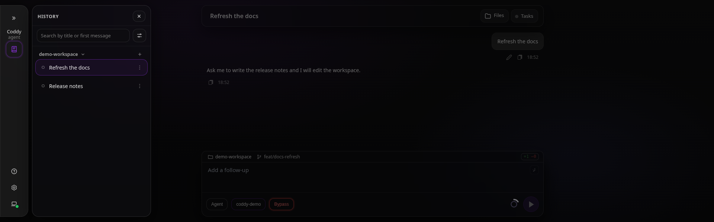

# Git worktrees

Coddy can give a session its own feature branch and working copy. The session's
working directory moves into the worktree, so its next `run_command`, file tool,
rule lookup and project-scoped MCP connection use that directory without a
manual `cd`.

In an agent conversation, ask Coddy to work on a feature branch. The
`worktree_create` tool takes `{"branch":"feature/login"}`. It fetches `origin`,
reads the default branch from `origin/HEAD`, and creates a new branch from the
fresh `origin/<base>` commit. A branch that exists only on `origin` is checked
out from `origin/<branch>` with tracking; a branch that already exists locally
is reused at its own tip, and a branch already checked out in a worktree reuses
that worktree. The tool refuses the default branch itself and a local branch
that tracks `origin/<base>`.

Creation requires an `origin` remote and an approval under the current tool
permission mode; reusing a worktree that already exists needs neither the
network nor `origin`. A refusal or a failed fetch leaves the session in its
original directory. Other errors the tool reports: an invalid branch name,
`origin/HEAD` that resolves to nothing, the branch being checked out in the
main checkout, and a worktree path that already exists on disk. Sessions whose
cwd sits inside a git submodule resolve `repo_root` to nothing and group under
their own folder in History.

The main checkout is advanced to the fetched default commit only by a safe
fast-forward: it must already be an ancestor, and a checked-out default branch
must have a clean worktree. A dirty or diverged main checkout is left alone;
the new feature branch still starts at the fetched remote commit. The agent's
turn context names the main checkout path and the default branch. Use
`run_command` with `cwd` when a command must run in the main checkout for one
call; omitting `cwd` uses the session's worktree.

Coddy keeps the worktrees under `<main checkout>/.coddy/worktrees/`; for
example, `feature/login` becomes `feature-login`. A `.gitignore` in that parent
folder hides the worktrees from the main checkout's status. Project rules,
skills, hooks and configured MCP servers are reloaded for the new cwd, with
project MCP declarations checked through the workspace trust gate. The session
records its new cwd for later turns.

In the web UI, select a feature branch with the **Worktree** checkbox on the
plate over the composer before the first message. The same fetch, branch checks
and worktree placement apply. Once the chat runs, the plate shows the main
project's name and the feature branch, the branch's tooltip naming the worktree;
History groups the main checkout and its worktrees under that project. The
session still runs inside the worktree. The web workspace picks give way to that
plate once the conversation starts; the agent tool can move its own session
during a turn.

*The feature session runs in its worktree while the plate and History name the main project.*

`GET /coddy/workspace/context` reports `repo_root` (the main checkout) and
`base_branch` (from `origin/HEAD`) alongside the current `path` and `branch`.
Session list rows carry `repoRoot` for grouping. See the
[Web UI](../surfaces/web-ui.md#per-session-workspace-folder--branch--worktree)
and [HTTP API](../reference/http-api.md) for those surfaces.

If a managed worktree is later removed with `git worktree remove`, a saved
session that pointed inside `<main>/.coddy/worktrees/` opens against the main
checkout instead. History groups it there immediately; the original recorded
worktree path is retained until you explicitly choose another workspace.
