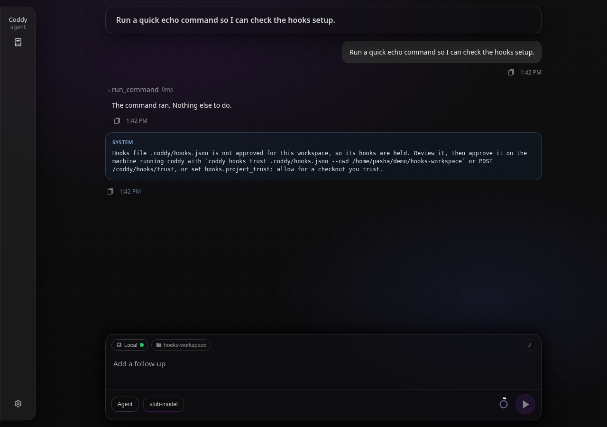
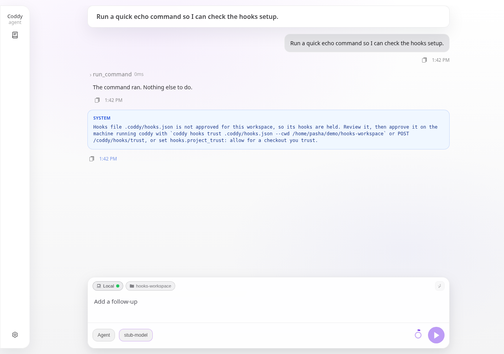

# Hooks

A hook is a command of your own that Coddy runs at a lifecycle point of a session: before a tool call, after it, and (see the event table) at the other points of a turn. The command reads one JSON document on stdin, does whatever it wants, and answers with an exit code and optional JSON on stdout. With that it can block a call, approve it past the permission prompt, rewrite its arguments, hand the model extra context, or just log what happened.

Hooks run with your permissions, before any permission prompt, on every matching call. That is the point of the feature and the reason files that arrive with a checkout are held until you approve them (see [Project files and trust](#project-files-and-trust)). Review every hook you enable.

Definitions use the file shape of Claude Code, and the event names, payload fields and answer fields follow it too, so a hook written for Claude Code (or Codex, which uses the same shape) works in Coddy unchanged for the covered events. The design record with the comparison of six agents is `docs/plans/hooks.md`.

## Definition files

Coddy reads the files listed in `hooks.files`, lowest priority first. The default list:

| File | Scope | Notes |
|---|---|---|
| `~/.coddy/hooks.json` | user | your own file (`${CODDY_HOME}/hooks.json`) |
| `<workspace>/.claude/settings.json` | project | Claude Code compatibility: only its `hooks` key is read |
| `<workspace>/.claude/settings.local.json` | project | same |
| `<workspace>/.coddy/hooks.json` | project | the workspace's own file |

`${CODDY_HOME}`, `${CWD}` and a leading `~` expand; a relative entry resolves against the session cwd. A file that does not exist is skipped. Every matching hook from every file runs; priority only orders the catalog and the run order (user file first, then the project files in list order, then definition order inside a file).

Scope is decided on canonical paths (absolute, symlinks resolved): a file at or under the session cwd is **project scope** and follows `hooks.project_trust`; everything else is **user scope** and always runs.

### File shape

```json
{
  "hooks": {
    "PreToolUse": [
      {
        "matcher": "run_command",
        "hooks": [
          { "type": "command", "command": ".coddy/hooks/guard.sh", "timeout": 30 }
        ]
      }
    ],
    "PostToolUse": [
      {
        "matcher": "edit|write|apply_patch",
        "hooks": [
          { "type": "command", "command": "gofmt -l ." }
        ]
      }
    ]
  }
}
```

Three levels: the **event** (`PreToolUse`), a **matcher group** (which tools it applies to) and the **handlers** that run. A group without `matcher`, or with `"*"`, applies to every occurrence of the event.

Handler fields:

| Field | Meaning |
|---|---|
| `type` | `command` is the only type that runs. Claude Code's `http`, `prompt`, `agent` and Codex's `mcp_tool` parse but are skipped with a warning and shown as unsupported in the catalog. |
| `command` | The command line. Without `args` it runs through the host shell (bash or sh; pwsh, PowerShell or cmd on Windows, the same detection `run_command` uses). |
| `args` | Optional. When the key is present the command is spawned directly with these arguments and no shell (Claude Code's exec form). |
| `commandWindows` | Optional replacement for `command` when Coddy runs on Windows (Codex's key; `command_windows` is accepted too). |
| `timeout` | Seconds. Default `hooks.default_timeout_seconds` (60). A hook that overruns is terminated with its whole process group. |
| `async` | `true` runs the hook detached: its output is ignored and it can never block or decide. |
| `failClosed` | `true` turns a crash, a timeout, or invalid output into a block instead of a non-blocking error (`fail_closed` is accepted too). Use it for policy hooks. |

`statusMessage`, `shell`, `once` and `additionalContextLimit` are accepted and ignored. Claude Code's `if` filter is ignored with a logged warning: the hook runs for every matching call, so a policy that relied on `if` must check the arguments itself.

### Matchers

Claude Code's rules apply:

- empty or `*` matches everything;
- a value made only of letters, digits, `_`, `-`, spaces, `,` and `|` is an exact name or a list of exact names: `run_command`, `edit|write`, `Edit, Write`;
- anything else is an unanchored regular expression (Go syntax): `^run_.*`, `mcp__filesystem__.*`. An invalid expression never matches.

Tool events compare the matcher with the tool name. Coddy's own names are the ones the model sees (`run_command`, `read`, `write`, `edit`, `apply_patch`, `glob`, `grep`, `webfetch`, `websearch`, `spawn_agent`, `question`, ...). MCP tools are `server__tool` and also match the `mcp__server__tool` spelling. The names Claude Code and Codex use are accepted as aliases, so `Bash` matches `run_command`, `Edit` and `Write` match `edit`, `write` and `apply_patch`, `Read` matches `read`, `Task` and `Agent` match `spawn_agent`, `WebFetch` and `WebSearch` match `webfetch` and `websearch`. Argument names are not translated: `tool_input` carries Coddy's fields (`command` for `run_command`; `path` and `content` for `write`; `path`, `pattern` and friends for the filesystem tools), so a script ported from Claude Code that reads `tool_input.file_path` must read `tool_input.path`.

## Events

| Event | Fires | Matcher subject | Can block |
|---|---|---|---|
| `PreToolUse` | before a tool call runs, after the mode and subagent checks and before the permission prompt, whatever the permission mode | tool name | yes: deny, or force or skip the prompt |
| `PostToolUse` | after a tool returned without error | tool name | no; feedback and context only |
| `PostToolUseFailure` | after a tool returned an error (not after a permission denial or a hook denial) | tool name | no; context only |

The remaining events of the design (`UserPromptSubmit`, `Stop`, `SessionStart`, `PreCompact`, `PostCompact`, `SubagentStart`, `SubagentStop`, `Notification`) are delivered in the follow-up sub-features of `docs/plans/hooks.md` and are listed here as they land.

## What a hook receives

One JSON object on stdin. The session fields come first, the event fields after them:

```json
{
  "session_id": "20260906-131500-a1b2c3",
  "hook_event_name": "PreToolUse",
  "cwd": "/home/op/project",
  "transcript_path": "/home/op/.coddy/sessions/20260906-131500-a1b2c3/messages.json",
  "permission_mode": "ask",
  "mode": "agent",
  "model": "openai/gpt-5",
  "turn": 3,
  "tool_name": "run_command",
  "tool_input": { "command": "rm -rf build" },
  "tool_use_id": "call_01"
}
```

| Field | Meaning |
|---|---|
| `session_id` | the session the call belongs to |
| `hook_event_name` | the event |
| `cwd` | the session working directory (also the hook's working directory) |
| `transcript_path` | the session's `messages.json`; empty when persistence is off |
| `permission_mode` | `ask`, `accept_edits` or `bypass` |
| `mode` | `agent`, `plan` or `ask` |
| `model` | the effective model id |
| `turn` | the user turn index |
| `subagent` | present inside a child session: `{"name", "parent_session_id", "depth"}` |
| `tool_name`, `tool_input`, `tool_use_id` | tool events: the tool, its arguments as an object, the call id |
| `tool_response` | `PostToolUse`: the text the model receives |
| `error` | `PostToolUseFailure`: the error text |
| `duration_ms` | `PostToolUse` and `PostToolUseFailure`: how long the tool took |

The process also gets `CODDY_PROJECT_DIR` and `CLAUDE_PROJECT_DIR` (the session cwd), `CODDY_SESSION_ID`, `CODDY_HOOK_EVENT` and `CODDY_HOME` in its environment, on top of Coddy's own environment.

## What a hook answers

| Exit code | Effect |
|---|---|
| `0`, empty stdout | no decision: the ordinary flow applies. Silence never approves a call that would otherwise ask. |
| `0`, stdout is a JSON object | the fields below are applied |
| `0`, other stdout | plain text; ignored on tool events (it becomes context on the prompt and session events) |
| `2` | block: the call is denied with the JSON `reason` when there is one, else stderr, else a generic reason |
| anything else, a crash, a timeout, invalid JSON | a non-blocking error: logged, the event proceeds as if the hook were absent, unless the handler has `failClosed: true`, which turns it into a block with the error as the reason |

JSON fields:

```json
{
  "continue": true,
  "stopReason": "shown to the user when continue is false",
  "systemMessage": "shown to the user, never to the model",
  "decision": "block",
  "reason": "why",
  "hookSpecificOutput": {
    "hookEventName": "PreToolUse",
    "permissionDecision": "deny",
    "permissionDecisionReason": "why",
    "updatedInput": { "command": "echo replaced" },
    "additionalContext": "a note the model reads next to the result"
  }
}
```

- `continue: false` ends the turn after the current tool batch; `stopReason` is shown to the user. On `PreToolUse` the call is denied as well.
- `PreToolUse`: `permissionDecision` is `deny` (the call is not executed; the reason goes to the model as the tool result `blocked by hook: <reason>`), `allow` (the permission prompt is skipped) or `ask` (the prompt is forced, even in a mode that would auto-approve). `updatedInput` replaces the whole argument object before the call runs; the tool call card shows the rewritten arguments. A top-level `decision: "block"` (or `"deny"`) with `reason` is the legacy spelling of deny.
- `PostToolUse`: `decision: "block"` with `reason` appends `Hook feedback: <reason>` to the tool result; the tool already ran, nothing is undone.
- `additionalContext` is appended to the tool result as `Hook context: ...` on all three events.

Several matching hooks run one after another, in catalog order; each sees the input as rewritten by the previous one, and all of them run even after a deny, so an audit hook sees every call. Decisions merge with the most restrictive winning (`deny` > `ask` > `allow`); every `additionalContext` is kept in order. Texts a hook hands over are capped at `hooks.max_output_chars` (10,000) and truncated with a marker past it.

## Configuration

```yaml
hooks:
  enabled: true
  files:
    - "${CODDY_HOME}/hooks.json"
    - "${CWD}/.claude/settings.json"
    - "${CWD}/.claude/settings.local.json"
    - "${CWD}/.coddy/hooks.json"
  project_trust: ask          # ask | allow | deny
  default_timeout_seconds: 60
  stop_loop_limit: 5
  max_output_chars: 10000
```

| Key | Default | Meaning |
|---|---|---|
| `enabled` | `true` | load and run hooks at all |
| `files` | the four above | definition files, lowest priority first |
| `project_trust` | `ask` | what a project-scope file may do: `ask` (listed, held until approved), `allow` (runs like your own file), `deny` (never read) |
| `default_timeout_seconds` | `60` | per handler when the definition gives no `timeout` |
| `stop_loop_limit` | `5` | how many times per turn a `Stop` hook may send the agent back to work |
| `max_output_chars` | `10000` | cap on every text a hook hands to the model or the user |

The keys are ordinary `config.yaml` keys, so the Settings page and the bundled `configure-coddy` skill can change them. Definitions are re-read at the start of every turn: editing a file takes effect on the next turn without a restart.

## Project files and trust

A hooks file inside the workspace arrived with the checkout. Under the default policy `ask` it is parsed and listed, but none of its hooks runs until you approve that exact file for that workspace on the machine running Coddy. The receipt is bound to a digest of the file, so editing an approved file withdraws the approval and asks again. Your own file (user scope) never needs approval.

The first turn that finds a held file records a notice in the session (the SPA shows it as a system row after the turn, once per session and file, without a retry control; the agent log carries the same line), so you learn that hooks exist and are held:

| Dark | Light |
|---|---|
|  |  |

Approval surfaces:

```
coddy hooks list [--cwd DIR]
coddy hooks trust <file> [--cwd DIR]
coddy hooks untrust <file> [--cwd DIR]
```

`list` prints the workspace, the effective `hooks.project_trust` and a table with one row per file: `FILE` (the name receipts use: the workspace-relative path for a project file, the absolute path for your own), `SCOPE`, `TRUST` (`trusted` or `needs_approval`) and a summary of its hooks (`PreToolUse(run_command); PostToolUse(*)`, or `invalid: <error>` for a file that does not parse), then a hint when project files await approval. `trust` prints the hooks it is about to approve and records the receipt in `~/.coddy/hooks-trust.json`, keyed by the canonical workspace path, the file and its digest; a user-scope file needs no approval and the command says so, an invalid file cannot be approved. `untrust` withdraws a receipt. `--cwd` defaults to the process working directory.

Over HTTP, `GET /coddy/hooks?cwd=<absolute path>` returns the same catalog with every handler as a row, and `POST /coddy/hooks/trust` / `POST /coddy/hooks/untrust` with the body `{"cwd": ..., "file": ".coddy/hooks.json"}` record or withdraw a receipt; `cwd` must be the session's server-side workspace, so this route is the approval path for a remote console or an ACP client, whose local `coddy hooks trust` would write a receipt on the wrong machine. The catalog's policy and the config keys can be changed in Settings > Hooks or with the bundled `configure-coddy` skill (`set hooks.project_trust=allow` for a checkout you trust; under `allow` project files need no receipt, under `deny` they are never read).

The receipt file is a sibling of `mcp-trust.json` and `subagents-trust.json`, never shared with them: one kind of approval must never read as another.

## Examples

Block destructive shell commands, whatever the permission mode (`~/.coddy/hooks.json`):

```json
{
  "hooks": {
    "PreToolUse": [
      { "matcher": "run_command", "hooks": [{ "type": "command", "command": "~/.coddy/hooks/no-rm-rf.sh", "failClosed": true }] }
    ]
  }
}
```

```bash
#!/bin/sh
# ~/.coddy/hooks/no-rm-rf.sh
command=$(jq -r '.tool_input.command // ""')
case "$command" in
  *"rm -rf"*)
    printf '{"hookSpecificOutput":{"hookEventName":"PreToolUse","permissionDecision":"deny","permissionDecisionReason":"rm -rf is not allowed here"}}'
    ;;
esac
exit 0
```

Run the formatter after every edit and tell the model what it changed:

```json
{
  "hooks": {
    "PostToolUse": [
      { "matcher": "edit|write|apply_patch", "hooks": [{ "type": "command", "command": "~/.coddy/hooks/gofmt.sh" }] }
    ]
  }
}
```

```bash
#!/bin/sh
path=$(jq -r '.tool_input.path // ""')
case "$path" in
  *.go)
    if out=$(gofmt -l "$path" 2>&1) && [ -n "$out" ]; then
      gofmt -w "$path"
      printf '{"hookSpecificOutput":{"hookEventName":"PostToolUse","additionalContext":"gofmt reformatted %s"}}' "$path"
    fi
    ;;
esac
exit 0
```

Log every tool call to a file without touching the flow (an `async` hook cannot slow the turn down):

```json
{
  "hooks": {
    "PreToolUse": [
      { "hooks": [{ "type": "command", "command": "cat >> ~/.coddy/hook-audit.jsonl", "async": true }] }
    ]
  }
}
```

## Windows

Shell-form commands go through the shell `run_command` detected (pwsh, PowerShell or cmd), so write them in that shell's syntax or give `commandWindows`. Exec-form handlers (`args` present) need a real executable, not a `.cmd` shim. Timeouts terminate the hook's whole process tree.

## Differences from Claude Code

- Only `command` handlers run; `http`, `prompt`, `agent` and `mcp_tool` are skipped.
- `tool_input` carries Coddy's argument names.
- The `if` filter is ignored.
- Matching hooks run sequentially rather than in parallel, so `updatedInput` chains deterministically.
- A `PreToolUse` `allow` skips Coddy's permission prompt; there are no deny rules it could be subordinate to.
- Project files are approved out of band by a digest-bound receipt, never by an in-chat prompt.
