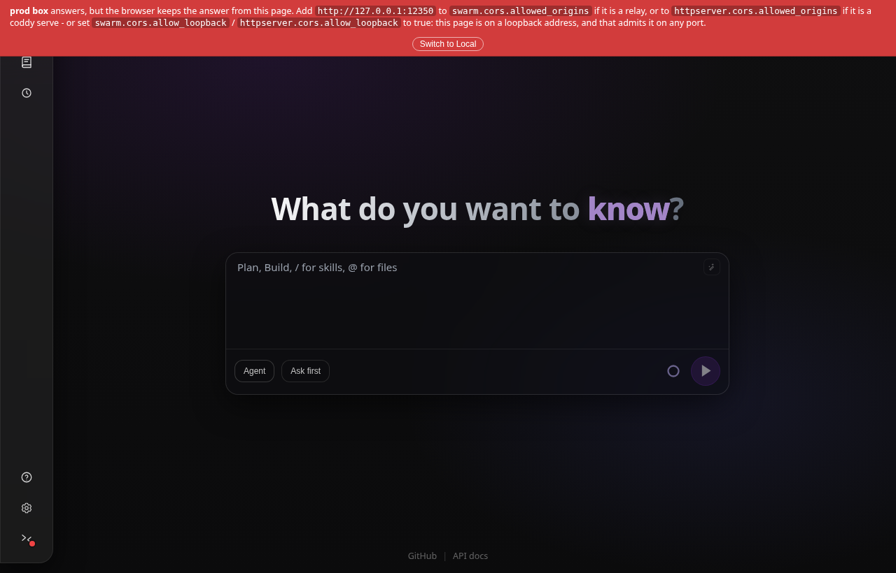
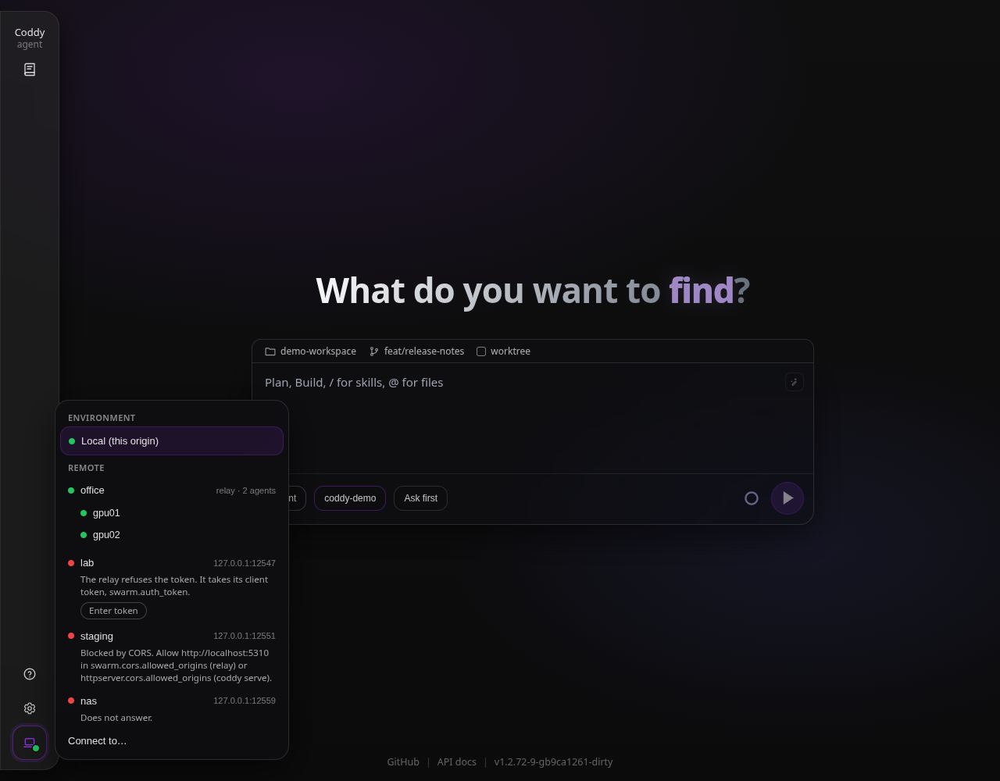

# Remote mode

A `coddy serve` on one machine can be driven from another. The console and `coddy acp` take `--remote`, the web UI has an environment menu at the foot of its rail, and all three talk to the server's HTTP API: the agent, its tools, its sessions and its permission policy live on the server, while the client renders the transcript and answers the prompts. This page is the user guide; the design record with the reasoning and the parts that were deferred is [Remote control design](../plans/remote-control.md).

## What remote mode is

| Client | How it connects | What it needs from the server |
|---|---|---|
| console (`coddy`, `coddy cli`, `coddy -p "..."`) | `--remote <target>` | the HTTP API (`http` build tag, `httpserver.enable`, on by default) |
| editor over ACP (`coddy acp`) | `--remote <target>` | the same |
| web UI | the environment menu at the foot of the rail | the same, plus CORS on the server |

With `--remote` the local process keeps no session store, runs no scheduler and no agent loop; every session call is proxied to the server over `/v1/*` and `/coddy/*`, the streamed answer comes back over SSE and is translated into the updates the console and the ACP client already understand. Specs: `features/remote_client.feature` and `features/cli_remote.feature`; the live checks are `examples/cli/cli_e2e_remote.py`, `examples/acp/acp_remote.py` and `examples/httpserver/http_e2e_remote.py`.

## Naming a remote

`--remote` accepts three spellings:

- a **configured name** from `httpserver.remotes` in the client's own `config.yaml` (matched case-insensitively);
- a bare **`host:port`**, which gets `http://` in front;
- a full **`http://` or `https://` URL**, optionally with a path prefix.

The address must be a bare origin: a query string, a fragment or user credentials in the URL are refused. A named remote holds a name, a URL and, when you choose to keep it there, the token to present:

```yaml
httpserver:
  remotes:
    - name: nas02
      url: "https://nas02.example:12345"
    - name: office-relay
      url: "http://relay.lan:12346"
      token: "${CODDY_RELAY_TOKEN}"   # optional, see The token below
```

```bash
coddy --remote nas02                 # by name
coddy --remote 192.168.1.20:12345    # bare host:port, plain http
coddy acp --remote https://nas02.example:12345
```

The same `remotes` list is what a server offers in its web UI's environment menu, so the entry does double duty: put it in the config of the machine you type on. A swarm relay is listed the same way; the menu recognises it and lists the agents behind it ([The environment menu](#the-environment-menu)).

## The token

On the server, authentication is off until a token is set. `httpserver.auth_token` in `config.yaml` (with `${ENV}` expansion), `--auth-token` on `coddy serve`, or the `CODDY_HTTP_TOKEN` variable turn it on; then every `/v1/*` and `/coddy/*` route requires `Authorization: Bearer <token>` and answers `401` otherwise. The SPA shell and its static assets stay public so a browser can load the page and ask for the token; `/docs` and `/openapi.*` are protected unless `httpserver.public_docs: true`. `GET /coddy/config` never returns the token (it reports `auth_configured` only), and a token given by flag or environment survives a `PUT /coddy/config` hot reload without being written to the file. A server bound off loopback without a token logs a warning at startup unless `httpserver.allow_insecure: true`.

A token is what an API client presents. A browser has no field to type one into, which is why a token alone leaves the web UI showing `Unauthorized (401)`; the sign-in form below is the browser's half of the same gate.

On the client, the token is the first of:

- `--remote-token`;
- the `token` of the `httpserver.remotes` entry the target belongs to: the entry named, the entry whose address it is, or a relay entry the target is a node mount of (`<relay>/swarm/nodes/<name>`, which takes the relay's client token);
- `CODDY_REMOTE_TOKEN`.

The entry's token wins over the variable because it is bound to one destination and the variable to none. It is optional, and keeping it in the file is a choice with a cost: every browser that reads this server's configuration (`GET /coddy/config`) receives it, as it receives a provider's `api_key`, and so does anyone who can read the file. Write it as a `${ENV}` reference so the secret itself lives in `.env`. Without it, the web UI takes the token in its **Connect to…** form and keeps it in the browser only (`localStorage`, per remote), and the console reads the flag or the variable.

`coddy serve` has no TLS of its own, so a token sent to a non-loopback `http://` address travels in clear; the console and `coddy acp` print a warning when that is about to happen. Put a TLS-terminating reverse proxy in front of the server, or reach it through an SSH tunnel, which keeps the address on loopback:

```bash
ssh -N -L 12345:127.0.0.1:12345 nas02   # in one terminal
coddy --remote 127.0.0.1:12345          # in another
```

## The sign-in form

A `coddy serve` on a network is readable by everyone who finds the port: transcripts, tool output, the workspace browser, the configuration editor. `httpserver.login` closes it with one operator account, and the form is what a browser signs in at. It is off by default; a configuration that does not mention it behaves exactly as before.

```bash
coddy serve set-password --user pasha
```

The command asks for the password twice, writes an argon2id hash into `config.yaml` in place (comments and key order survive) and switches the form on. From then on an anonymous browser gets a sign-in screen instead of the app, and nothing under `/v1/*` or `/coddy/*` is readable until it passes. The page itself and its static assets stay public, so the screen can load; `/docs` follows `public_docs` as before.

For a container or a systemd unit, the account can live in the environment instead, as `CODDY_HTTP_USER` and `CODDY_HTTP_PASSWORD` (typically in `$CODDY_HOME/.env`). They enable the form on their own, they win over an account in the file, and they are never written into it. An explicit `login.enable: false` switches the form off with the variables still set.

```yaml
httpserver:
  host: 0.0.0.0
  auth_token: "${CODDY_HTTP_TOKEN}"   # for coddy --remote, coddy acp --remote, a relay, scripts
  login:
    enable: true
    user: "pasha"
    password_hash: "$$argon2id$$v=19$$..."
    session_ttl_hours: 720            # 0 = until the browser closes
```

**The two credentials are not interchangeable.** The form is for browsers; everything that is not a browser - `coddy --remote`, `coddy acp --remote`, a swarm relay mounting this node, the Python harnesses, Swagger's **Authorize** - still presents a bearer token. Closing a server with a password alone and no `auth_token` is what breaks those, and `coddy serve` says so in its log at startup. Set both when anything but a browser talks to the server.

Signing in sets an `HttpOnly`, `SameSite=Strict` cookie that opens the same routes a token opens, streams included. Signing out (the entry at the bottom of the nav rail) drops the session on the server, so a copy of the cookie taken elsewhere stops working too. Sessions live in memory: saving settings from the page keeps them, restarting the process ends them, and rotating the password ends every session it opened. Full behaviour, including the CSRF rule for cookie-authenticated writes and the throttle on wrong passwords, is in [HTTP API](../reference/http-api.md#web-ui-sign-in-optional).

`coddy serve` still has no TLS of its own, so a password typed into a non-loopback `http://` page travels in clear exactly as a token does. Put a TLS-terminating reverse proxy in front of it, or reach it through the SSH tunnel above.

## CORS for the web UI

A browser that loaded the UI from one origin and calls the API of another needs the remote server to opt into CORS:

```yaml
httpserver:
  auth_token: "${CODDY_HTTP_TOKEN}"
  cors:
    enable: true
    allow_loopback: true          # the laptop's own coddy serve, on any loopback address and port
    allowed_origins: ["https://my-ui.example"]   # exact origins elsewhere; or ["*"]
  remotes:                       # optional: offered in this server's own UI
    - name: "prod box"
      url: "https://box.example:12345"
```

With `cors.enable` on, a preflight from an allowed origin gets `204` with `Access-Control-Allow-Origin` (the origin echoed, or `*` when configured) and `Access-Control-Allow-Headers: Authorization, Content-Type, X-Coddy-Session-ID`; an origin that is not listed gets no CORS headers, which the browser reports as a blocked request. Three settings say which origins are allowed. `allowed_origins` names them exactly, and `http://localhost:12345`, `http://127.0.0.1:12345` and `http://localhost:5173` are three different origins. `allow_loopback` admits every page served from the browser's own machine - an `http` or `https` origin whose host is `localhost`, a `*.localhost` name, `127.0.0.0/8` or `[::1]`, on any port - which is the laptop case: the web UI comes from the laptop's own `coddy serve`, and its port moves between installations; the origin is echoed, never widened to `*`. `"*"` admits any page anywhere, and since the list is read first, a `"*"` in it answers loopback origins with `*` too, whether or not `allow_loopback` is on. The bearer token still applies to the real request whichever of the three admits the page: CORS decides whether the browser shows a page the answer, not whether the server gives one, so `allow_loopback` and `"*"` are only as safe as the token or the sign-in form behind the API - `coddy serve` warns at start, and `--dry-run` reports it, when either is on and the server asks for no credential ([Security and trust](security.md#the-http-surface)). A swarm relay has CORS of its own, `swarm.cors`, with the same three keys: a page served elsewhere that talks to a relay needs its origin there, and a node behind the relay is answered by the relay's CORS, never by the node's.



*A page served by the laptop's own coddy serve: the alert names the exact-origin list and the `allow_loopback` toggle that admits the page on any port*

Because `EventSource` cannot send a header, the two SSE subscription routes, `GET /coddy/sessions/{id}/composer-stream` and `GET /coddy/events`, also accept `?access_token=`; the bundled UI fetches those streams instead, so its header applies and no token lands in a URL. Reference: [HTTP API](../reference/http-api.md#authentication-optional).

## The environment menu

The environment is the item at the foot of the web UI's rail, below Settings and above Sign out: a laptop while the page drives its own server, two chevrons pointing at each other while it drives a remote, with a dot for whether that host answers, and a tooltip naming **Local** or the active remote. On a tablet or a phone it is one of the top bar's icons and never folds behind **More**. Its menu opens beside the rail (a sheet from the bottom on a narrow screen) and has an **Environment** section with Local and a **Remote** section with the server's configured `remotes` plus **Connect to…** (name, URL, token). The list is read from the page's own server when the menu opens and again whenever that server's configuration is replaced, so a remote added by a settings save or the agent's `config_commit` shows up without reloading the page. An entry without a `name` is shown by the name the remote reports - a relay's name, which is its host name unless `swarm.name` sets one, or an agent's host name - with its address beside it, and by its address alone when it reports nothing. Choosing an entry connects at once and starts the app over on it, so the session list, the models and the defaults are re-read from the chosen backend: between two remotes in place, without reloading the page, and to or from Local with a reload. Choosing the entry the page is already on reads everything again, which is the way back after that remote was down; the SPA shell always comes from the local origin, so **Local** stays reachable from the menu even when the remote is down.



*A relay with its agents listed under it, a relay that wants its token, one that CORS keeps from the page, and one that does not answer*

Each remote is asked on menu open whether it can be used, and a dot says the answer: green when it answers and accepts the token, red when it does not, amber while it is being asked. A red one says why on a line under it:

- **does not answer**: nothing is listening at that address, or the address is wrong;
- **refuses the token**: an agent wants its `httpserver.auth_token`, a relay its client token (`swarm.auth_token`); for a remote without a token in the configuration, **Enter token** opens the connect form filled in for it;
- **blocked by CORS**: something answers, but the browser keeps the answer from this page, which is what CORS off (or this origin missing from it) looks like from a browser. The line names this page's origin and the key to add it to: `swarm.cors.allowed_origins` on a relay, `httpserver.cors.allowed_origins` on a coddy serve - and, when this page is itself on a loopback address (the laptop's own `coddy serve`), the `allow_loopback` toggle that admits it on any port.

A relay is recognised by its public `GET /swarm/info`: it serves no `/v1` of its own, so its model catalog is not what is asked. Its token is checked on `GET /swarm/nodes`, and once it is accepted the menu lists the agents behind it, every hop deep, so a node is one click away rather than behind the relay's map ([Swarm, The UI](swarm.md#the-ui)).

The active environment is asked the same way on load, every 30 seconds and on window focus; when it cannot be used, a banner says which of the three it is, names the setting that fixes it, and offers **Switch to Local** rather than leaving an empty screen. The choice and the per-remote tokens typed into the form live in the browser (`coddy_env`, `coddy_env_tokens`); a token that comes from the configuration is not copied there. Folder recents are kept per environment, and so is the screen each environment was left on: switching back to Local returns to the conversation you left it in, and a remote opens where you left it or at its home.

## What runs where

| On the server | On the client |
|---|---|
| the ReAct loop and the model calls, with the server's providers and keys | rendering the transcript, thinking, tool boxes, plan updates, token and context stats |
| file and shell tools, in the server's workspace | the model selector, filled from the server's `GET /v1/models` |
| MCP servers, hooks, subagents and their trust receipts | permission and question prompts, answered through `POST /coddy/sessions/{id}/permission` and `.../question` |
| the session bundles, the config file and the agent's self-configuration commits | cancel (`POST /coddy/sessions/{id}/cancel`), `ctrl+o` fetching full tool output |

A session a remote console or ACP client creates lives in the server's default working directory (`coddy serve --cwd`, `CODDY_CWD`, else where the server was started); the remote console footer still shows the local folder. The web UI can move a session to another server-side folder from its folder chip. `/export` writes into the server's workspace. `/resume`, `-c` and `--session-id` operate on the server's session list, and the local folder filter does not apply. The settings commands (`/model`, `/reasoning`, `/agent`, `/plan`, `/ask`, `/permissions`, with `--once` or `--count=N`) change the server's session through the same `PATCH /coddy/sessions/{id}` the web UI uses, the permission mode included, and every client of that session sees the change ([Session settings](../features/session-settings.md)). The console's `/reasoning [level]` and `shift+tab` persist the selected reasoning level on the server session. The startup banner shows `remote: <url>`, and the exit hint prints a reconnect command with `--remote` in it.

Trust decisions are the server's too. A project MCP server, hooks file or subagent definition is approved on that host, either with the CLI there (`coddy mcp trust`, `coddy hooks trust`, `coddy agents trust`) or over the API with the bearer token (`POST /coddy/mcp/{name}/trust`, `POST /coddy/hooks/trust`, `POST /coddy/subagents/{name}/trust`, each with the server-side workspace as `cwd`); the local subcommands do not take `--remote`. A subagent's permission prompt reaches the remote client under the parent session, prefixed `[subagent <name>]`, even when the parent session runs in `bypass`. See [Subagents](../features/subagents.md#remote-mode).

## Limitations

- One bearer token per server, no users or roles: whoever holds it has the whole API, including the config editor and the workspace files.
- No TLS inside `coddy serve`; encryption comes from a proxy or a tunnel.
- A permission mode a remote client switches (`/permissions`, `--permission-mode`, the dialog's session switch) applies to the server's session for every client of it, and is kept with that session on the server, across a restart of `coddy serve` too. It also becomes the mode new sessions on that server start in.
- A dropped connection leaves the server turn, its children and any open prompt running; `/resume` shows the outcome once the turn ends, and an answer to a prompt the server has already withdrawn is ignored. Quitting the console mid-turn waits briefly for the cancel to reach the server.
- A session is one turn at a time: a second client prompting the same session gets `409` while the first turn holds the lock.
- The web UI reaches a remote only when that server admits the UI's origin through its `cors` (`swarm.cors` on a relay): the exact origin in `allowed_origins`, or `allow_loopback` for a page served from the laptop's own `coddy serve`; the menu says so on the remote's line when that is what stands in the way.

## Checking a remote from the command line

```bash
coddy --dry-run --remote nas02
curl -sS -H "Authorization: Bearer $CODDY_REMOTE_TOKEN" https://nas02.example:12345/v1/models
```

`--dry-run` (on the console and on `coddy acp`) runs the config check and then probes what the file points at, the `--remote` target included, and exits with status 1 when a probe fails. Each configured remote is probed with the token of its entry; a relay is recognised as one, and a `--remote` that points at a relay's root is refused with the mounts of its agents to use instead (`<relay>/swarm/nodes/<name>`), since a relay drives nothing itself. The `curl` line is the first request the UI's status dot makes of an agent. Server-side, `coddy serve --dry-run` reports the listen address it would bind and whether a port is already taken. See [coddy serve and the daemon](serve.md).

## History

The design record, [Remote control design](../plans/remote-control.md), documents the direction that shipped - the authenticated API, CORS, the environment selector and the Go client behind `--remote` - and the parts that did not: TLS inside the server, and a reverse tunnel with an agent registry, which the [swarm relay](swarm.md) later covered with its reverse HTTP/2 tunnel.
