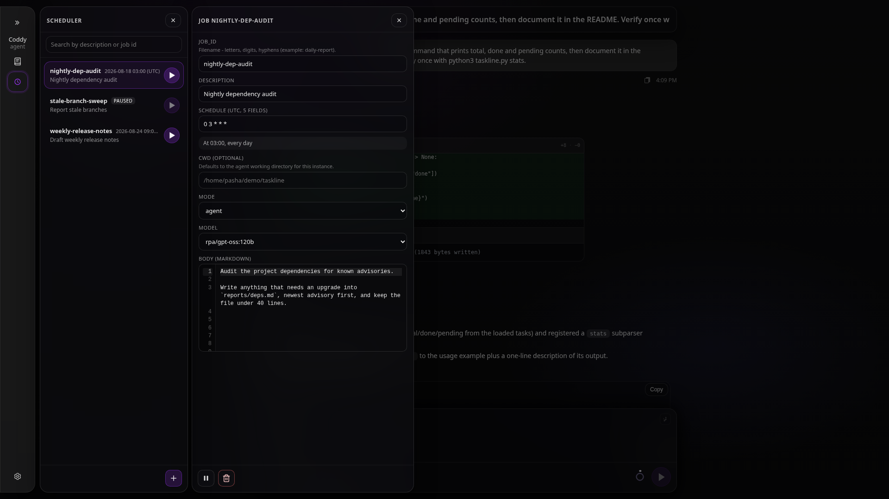
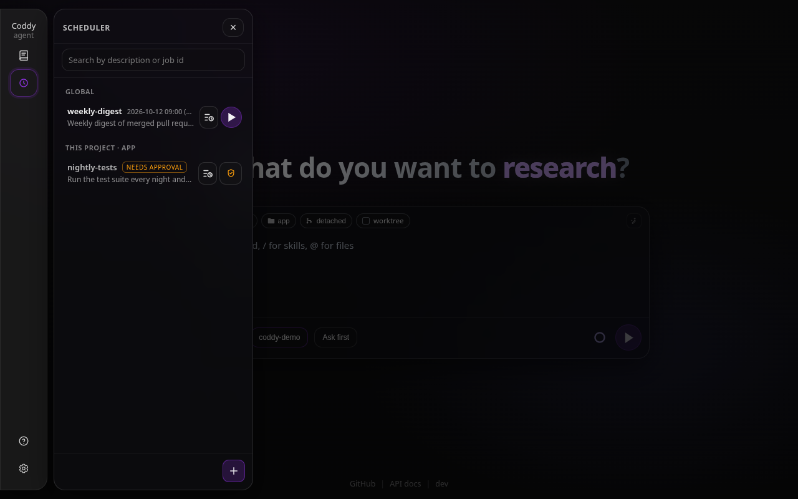
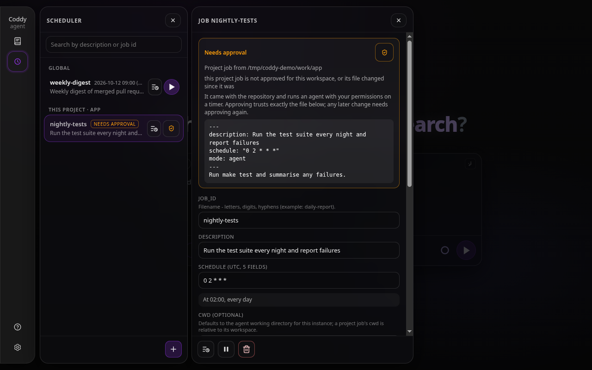
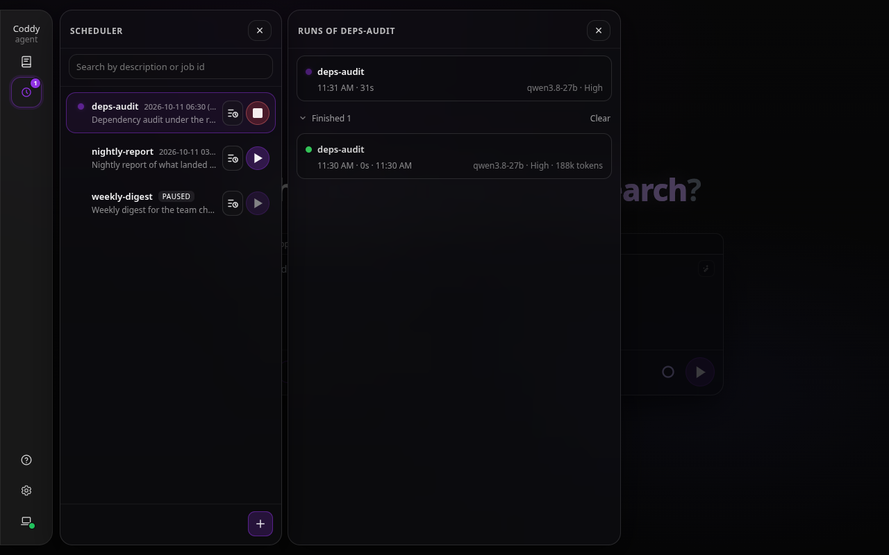
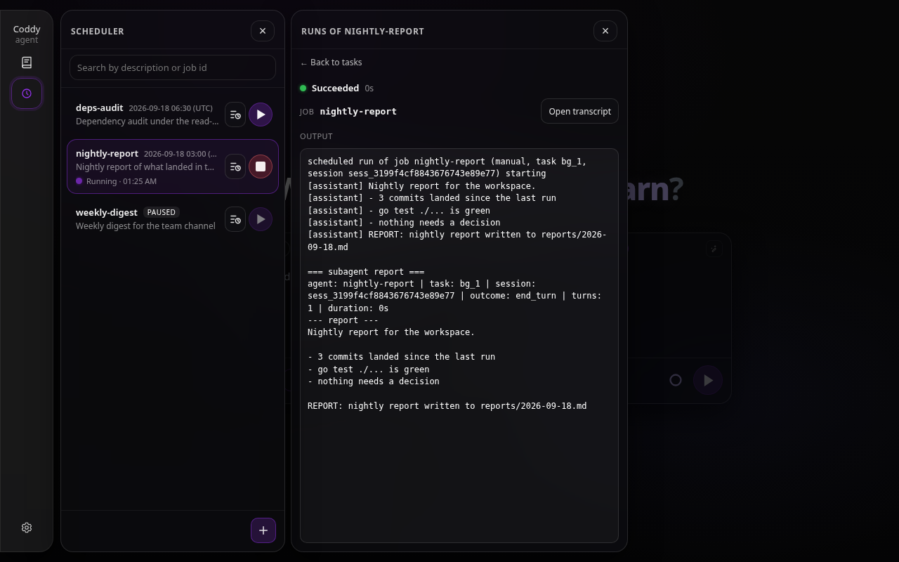
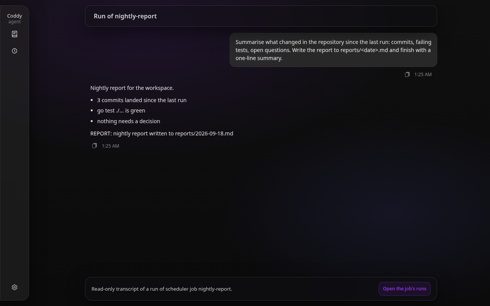

# Scheduler

## Overview

The scheduler is an optional cron-like runner. It reads flat `*.md` job files (YAML frontmatter plus markdown body) from two fixed places - your own jobs in **`${CODDY_HOME}/scheduler`** and the project jobs a repository carries in **`<workspace>/.coddy/scheduler`** - and starts each trusted job when due. A run is a **background agent task**: the same thing a `spawn_agent` call starts ([Subagents](../features/subagents.md)), a task of kind `agent` in the background task pool ([Background tasks](../features/background-tasks.md)) backed by a child session, both hanging under one session per job. That job session is the job's run history, and the runs panel of the web UI shows it the way the chat's Tasks panel shows a chat's tasks. The scheduler is compiled in only with the **`scheduler`** build tag.

Pieces:

- **`external/scheduler`** - the **`Serve`** entry **`coddy serve`** runs under **`scheduler.enable`**; the console and **`coddy acp`** start the same daemon with **`--scheduler`**.
- **`external/scheduler/daemon`** - the UTC minute tick and the **runtime**: what starts a run, stops it, knows whether a job is running, applies retention and keeps the job session.
- **`external/scheduler/storage`** - flat job discovery in both roots, the containment rules of project jobs, YAML frontmatter, UTC cron, the **`.state`** sidecar, the approvals of project jobs (**`scheduler-trust.json`**) and the workspaces the daemon scans (**`scheduler-workspaces.json`**).
- **`external/scheduler/service`** (**`schedservice`**) - shared CRUD, the run rows, HTTP and tool payloads (no cycles with **`internal/tools`**).
- **`external/scheduler/tools`** - **`schedtools`** registers **`coddy_scheduler_*`** tools (one `*.go` file per tool under **`tools/`**) when **`scheduler.enable`** is true.
- **`internal/agent/scheduled_run.go`** - **`RunScheduledJob`**, the run itself, on the child-run executor **`spawn_agent`** uses.

The cron parser uses **five fields** (**minute hour day month weekday**) in **UTC**. Fires are evaluated on **UTC minute boundaries** (second **0**, nanoseconds **0**), like **crond**: the daemon wakes once per UTC minute, reads the job files, and starts a job only when that minute matches the expression and the **`.state`** checkpoint is strictly before that minute. **`* * * * *`** therefore runs **at most once per UTC minute**. Step fields such as **`*/2 * * * *`** use the same minute grid as vixie cron (minutes **0,2,4,…** UTC); **`*/3 * * * *`** uses **0,3,6,…** UTC.

Changes to the **`schedule`** field in a job file are read on the next scan (no restart).

## Build

- Scheduler only - `go build -tags=scheduler ./cmd/coddy`
- HTTP and scheduler - `go build -tags=http,scheduler ./cmd/coddy` (add `,ui` with `http` for the embedded SPA)

## Enabling

The scheduler daemon and tools are active when **`scheduler.enable: true`** in config, or when you pass **`coddy serve --scheduler`**, **`coddy acp --scheduler`** or **`coddy --scheduler`** (the console). The daemon needs the session manager the runs are made of, so it starts once that manager exists; a bare swarm relay never runs it.

REST routes under **`/coddy/scheduler`** require **`-tags=http,scheduler`**; see **`docs/reference/http-api.md`**.

## Where jobs live


*The scheduler drawer: three jobs with their next run, one paused, one with the outcome of its last run, and Runs and Run now on every row*



*The job editor: the cron hint, the mode, the model, the subagent and the permission mode of a run, the markdown body, and Runs, Pause and Delete at the foot*

Jobs are **`*.md`** files **directly** in one of two folders; nested subdirectories are not used for discovery. Neither folder is configurable.

- **User jobs** live in **`${CODDY_HOME}/scheduler`**. They are yours and always trusted.
- **Project jobs** live in **`<workspace>/.coddy/scheduler`** and travel with the repository, so a team can keep its scheduled work next to the code. They run only once trusted (next section).

The old **`scheduler.dir`** key is no longer read. `coddy -t` reports it as a key that moved, and the next start copies the jobs of that folder (with their **`.state`** sidecars) into **`${CODDY_HOME}/scheduler`** and removes the key from `config.yaml`, keeping the old file as `config.yaml.bak-<time>`. A job the home folder already has with the same bytes is skipped (its checkpoint is carried when the home has none); one it has with other bytes is copied as **`<id>-migrated.md`** (or **`<id>-migrated-2.md`** and on when that name is taken), so no job silently stops. The old folder is left as it was.

A job id is unique across both scopes: a project job may not take the id of a user job, and a user job may not take the id of a project job of a workspace the scheduler knows (both answer **409**, on create and on rename). A project file that arrives with a clashing id anyway is listed as **conflict** and does not run until it is renamed.

One sidecar belongs to every job: **`basename.state`** next to **`basename.md`** for a user job, and **`${CODDY_HOME}/scheduler/.projects/<key>/<job_id>.state`** for a project job (the key is derived from the workspace), so nothing the scheduler writes ever lands in a checkout. It is a small JSON record with the cron checkpoint (**`last_scheduled_utc`**) and, once the job ran, the id of its **job session** (**`session_id`**). Both fields are kept by both writers: a checkpoint write does not lose the session pointer, and the first run does not lose the checkpoint. Renaming a job through the API or the editor moves the sidecar with the file, so the run history follows the rename. A sidecar with no pointer (deleted by hand, or written by an older Coddy) does not orphan a history: the daemon finds the job session in the sessions root by the job id it names, and records the pointer again.

The daemon writes the checkpoint **before the run starts**, using the **UTC minute start** that fired, so the next UTC minute tick does not re-trigger the same minute while the run is still going. Checkpoints are written **atomically** (temp file plus rename in the same directory). With no checkpoint yet (or a stale pre-1980 timestamp left by older builds), the first run follows **vixie-style** timing from wall clock and the five-field expression, not a backlog from the Unix epoch. Only **one** long-running process should enable the scheduler for a given Coddy home: two daemons reading the same jobs can double-fire.

Optional YAML frontmatter **`paused: true`** skips both cron ticks and **`POST …/run`** until resumed.

## Project jobs and trust

A project job is repository content that runs an agent with your permissions on a timer, so it gets the trust gate project MCP servers, subagent definitions and hooks have. **`scheduler.project_trust`** sets the policy:

- **`ask`** (default) - a project job is listed but runs (on cron or by hand) only once you approved it for that workspace. The approval is a receipt in **`${CODDY_HOME}/scheduler-trust.json`** bound to the workspace, the job id and the sha256 of the file, so a job that changes afterwards (a `git pull`, a hand edit) waits for approval again;
- **`allow`** - project jobs run like your own;
- **`deny`** - project jobs are listed and never run.

A project job **you create through Coddy** (the web UI, the REST API from a session, or `coddy_scheduler_job_create` with `scope: "project"`) is approved at once for the bytes written: you made it. The same file reaching another person through git is not approved for them. An edit through Coddy keeps a job trusted only when it was trusted before the edit; pausing or editing a job that came with the checkout does not approve it. No tool approves a project job: approval is a human decision, made in the web UI or over REST.



*The scheduler drawer: a global job, and a project job that came with the repository waiting for approval*



*The approval block of a project job: where it comes from, why it does not run, and the exact file the shield approves*

The drawer lists the user jobs under **Global**, then the project jobs of the chat's workspace under **This project**, then those of every other workspace the scheduler runs. A row that does not run says why (**needs approval**, **denied**, **id conflict**, **invalid**); a job waiting for approval has a shield in place of Run, which opens the job with its raw file. The shield there approves exactly the bytes shown (the server refuses a digest that no longer matches the file) and, on an approved job, withdraws the approval. A new job is **Global** unless you pick **This project**, which needs a chat in that project.

Every trusted job, user or project, runs in the one daemon of the process and its one task pool, under the one **`scheduler.max_queue`** and **`scheduler.timeout`**. The daemon scans:

1. the user jobs;
2. the project jobs of its own working directory;
3. the project jobs of every workspace with an approval;
4. the project jobs of every workspace a session asked the scheduler about (listed in **`${CODDY_HOME}/scheduler-workspaces.json`**), which is how a job runs under **`allow`**, where nothing is ever approved.

Trust is decided on one read of the file, before the cron checkpoint is written, and the run is made of that same read, so a file swapped in between never runs under an approval it did not get. The daemon logs once per content that it skipped a job and why.

Containment rules for project jobs: **`.coddy`**, **`.coddy/scheduler`** and the job files must be real folders and files, not links (a link is listed as **invalid** and never written through); a workspace whose project folder would be inside **`${CODDY_HOME}`** (Coddy started in `$HOME` with the default home) has no project jobs; and a project job's **`cwd`** must be empty (its workspace), a relative path that stays inside the workspace, or an absolute path that names the workspace or a folder inside it once links are resolved (a job written before project jobs existed often carries one).

## Job file format

Frontmatter fields:

- **`description`** (string) - short human summary
- **`schedule`** (string) - five-field crontab, UTC
- **`cwd`** (string, optional) - for a user job, empty means the Coddy process cwd and relative paths resolve against it at run time; for a project job, empty means its workspace and only a path inside the workspace is accepted, relative or absolute
- **`model`** (string, optional) - session model override for the run
- **`mode`** (string, optional) - **`agent`**, **`plan`**, or **`ask`** (default **`agent`**)
- **`agent`** (string, optional) - a subagent definition name (**`subagents.dirs`**, see [Subagents](../features/subagents.md)): the run is made under its role, tool allowlist, model, reasoning level and permission narrowing. The definition's `reasoning` applies when the run's model (the job's `model`, else the definition's, else the configured one) offers that level, as for a spawn; a level it does not offer is dropped with a warning in the agent log, and `reasoning: default` keeps the model's own level. A project-scope definition needs its trust receipt like any spawn; a job naming one that is not approved does not start, and a manual run says so. Empty runs a general agent with the full tool set of the mode.
- **`permission_mode`** (string, optional) - **`ask`**, **`accept_edits`** or **`bypass`**: what the run may do without asking. Empty is **`bypass`**, the unattended default and what the scheduler always did; a definition named in **`agent`** can only narrow it. Nobody answers a prompt in a scheduled run, so under **`ask`** or **`accept_edits`** a gated call is **denied**, never waited on; the refusal tells the run that nobody could be asked, so it reports what it could not do instead of claiming the operator refused ([Subagents](../features/subagents.md), Detached runs).
- **`paused`** (bool, optional) - when true, the job does not execute

Body - markdown used as the one-shot user instruction for that scheduler run.

The run's system prompt says it is a scheduled job started unattended (with the job id and the cron slot or "by hand"), that nobody answers questions, and that its final message is kept as the run's record; the definition's role follows when the job names one. Skills, rules and the environment block are present as in any session, and configured MCP servers are dialed for the job's cwd through the workspace trust gate, unless the job's definition admits no tool of any of them.

## Runs

Every job owns one ordinary session, the **job session**, minted on the first run and recorded in the sidecar. It never runs a turn of its own: a prompt against it is refused (**409** over HTTP, naming the job), it stays out of History and every default listing (**`GET /coddy/sessions?include_scheduler=true`** lists it), and it exists so the job's runs have a parent. A run is a child of that session, stored where a `spawn_agent` child is stored:

```
<sessions root>/<job session>/
  session.json                 schedulerRun: true, schedulerJobId: <job_id>
  background/<task_id>/        the run's task record and progress log
  subagents/<run session>/     the run's transcript (subagentRun, schedulerJobId, schedulerTrigger)
```

A run's task row carries **`kind: "agent"`**, the label **`<job_id> · cron 2026-09-18 10:00 UTC`** (or **`· manual …`**), and **`agent: {"name": <job_id or its definition>, "session_id": <run session>}`**. Its progress log is what the Tasks panel shows for any subagent run (`→ tool`, `✓ tool`, `[assistant]` lines, the closing `=== subagent report ===` block); its transcript is the run session, read-only, with a notice that names the job and links back to the job's runs. Statuses are the pool's: **`running`**, **`succeeded`**, **`failed`** (the turn ended with an error), **`timed_out`** (**`scheduler.timeout`** hit), **`stopped`** (cancelled), **`orphaned`** (the process died with the run in flight).

- **One run at a time per job.** The daemon reserves the job before anything starts, so a cron tick and a manual run cannot both start it; a due slot that lands while a run is in flight is skipped and logged.
- **`scheduler.max_queue`** caps how many runs are in flight across all jobs. A tick past the cap skips the job for that slot with a warning; a manual run past it answers **409**.
- **`scheduler.timeout`** is the run's hard limit; the pool caps it at **`tools.background.max_timeout_seconds`** like any task, and the daemon warns at start when the scheduler limit is above the cap.
- **A dropped provider connection does not end the run.** Nobody watches a scheduled run, so like a subagent it rides out up to five failed calls of its provider in a row, where a chat turn gives up after two: about six minutes at the default **`agent.llm_retry_base_ms`** when **`scheduler.timeout`** leaves room. It writes each reconnect into its progress log (**`↻ provider failed (...); reconnecting in 20s (attempt 2 of 5)`**, [Subagents](../features/subagents.md#when-the-provider-connection-drops)).
- **Cancel** stops the run's task; the run is recorded as **`stopped`**.
- **Retention.** **`scheduler.retain_sessions`** (default **5**) keeps that many **finished** runs per job, newest by start time; when a run finishes, older ones lose their task record and their transcript. **Clear** in the runs panel (**`DELETE /coddy/scheduler/jobs/{job_id}/runs`**) drops every finished run. Deleting a job deletes its job session with every run under it.
- **Nothing stays in memory between runs.** A finished run's session is retired and its pool entries released; the records come back from the bundles when the panel asks for them. Work a run leaves behind (a backgrounded `run_command`, a subagent it spawned) is stopped when the run's turn returns, as for any child.
- **Restart.** A run the process died with shows as **`orphaned`**; the checkpoint keeps its slot from firing again.

A scheduled run sits at spawn depth **0**: within **`subagents.max_depth`** it may spawn subagents of its own, which count against **`subagents.max_concurrent`** like any spawn. It is never woken by a finished task (`notify_on_finish` is off for everything it starts).

Runs of the scheduler shipped before this design (top-level **`sched_`** bundles) stay hidden from History and are not listed as runs; delete them by hand when they are not wanted.

Daemon process logging stays short (**`slog`**: **`scheduler_run_spawn`** and **`scheduler_run_finish`** with the job, the run session, the task and the status); full traces live in the run session.

## Runs in the web UI

Jobs are grouped by scope (see Project jobs and trust). Every job row shows its last run (the status dot and clock of the Tasks panel) and a **Runs** control that opens the job's runs: the background tasks panel of the job session, docked where the job editor docks (the editor's footer has the same control). Route: **`#/scheduler/jobs/<job_id>/runs`**; a link that names one run (**`.../runs/<task_id>`**) opens the panel with that run's card open and then drops the id. Every run is a card: a running one carries a Stop control, finished ones stand under the **Finished** counter; a click opens a card in place with the run's progress log, how long it ran, and **Show transcript**, which opens the run session. Several cards can be open at once. The panel polls **`GET /coddy/sessions/{job session}/background-tasks`** every 2.5 s while a run is in flight and every 15 s otherwise, exactly as the chat's panel does.



*The runs panel of a job: one run in flight, one finished*



*A finished run opened: its progress log and the report*



*The run's transcript, read-only, with the link back to the job's runs*

## HTTP API

With **`-tags=http,scheduler`**, **`GET /coddy/scheduler/jobs`** (rows carry **`scope`**, **`workspace`**, **`trust`**, **`running`**, **`session_id`** and **`last_run`**; without a session header or **`cwd`** it lists the user jobs only), job CRUD (**`scope=project`** addresses a project job, created in the workspace of the session in **`X-Coddy-Session-ID`**), **`trust`** / **`untrust`** for project jobs, **`pause`** / **`resume`**, **`run`** (**202** with **`task_id`**, **`session_id`** and **`run_session_id`**), **`cancel`**, **`GET …/runs`** and **`DELETE …/runs`** mirror the **`schedservice`** layer; the runs panel itself polls the session's background-tasks routes. **`503`** if **`scheduler.enable`** is false. OpenAPI merges these paths only when **scheduler** is linked (see **`external/httpserver/scheduler_http.go`** vs **`scheduler_http_stub.go`**).

## Tools (when scheduler is enabled)

- every per-job tool takes **`scope`**: **`user`** (default) or **`project`**, the project job of the session's workspace
- **`coddy_scheduler_jobs_list`** - list jobs (**`include_body`** optional): the user jobs and the project jobs of the session's workspace and of the workspaces the scheduler runs, each with its **`trust`**
- **`coddy_scheduler_job_get`** - one job JSON including **`body`**
- **`coddy_scheduler_job_create`** / **`coddy_scheduler_job_replace`** / **`coddy_scheduler_job_patch`** (optional **`new_job_id`** renames the job file; **`agent`** and **`permission_mode`** are fields like the others)
- **`coddy_scheduler_job_delete`**
- **`coddy_scheduler_job_pause`** / **`coddy_scheduler_job_resume`**
- **`coddy_scheduler_job_run`** - manual run (does not advance cron **`.state`**); answers with the task and the run session
- **`coddy_scheduler_job_cancel`**
- **`coddy_scheduler_job_runs`** - the run rows of a job

Legacy names **`coddy_scheduler_list`**, **`read`**, **`write`**, **`delete`**, **`validate`** are removed.

## Example job (minute tick)

```md
---
description: "Minute tick"
schedule: "* * * * *"
cwd: ""
mode: agent
---

In the session working directory run

bash -lc 'date -u +%FT%TZ > tick.txt'
```

A job under a read-only definition, with a narrowed permission mode:

```md
---
description: "Nightly audit"
schedule: "0 3 * * *"
mode: agent
agent: reviewer
permission_mode: accept_edits
---

Review yesterday's commits and write the findings to docs/audit/<date>.md.
```

See also **`docs/reference/http-api.md`** (scheduler table), **`docs/getting-started/configuration.md`** (**`scheduler`** key), **`docs/plans/scheduler-runs.md`** (the design record) and **`examples/README.md`** (Python harnesses **`http_e2e_scheduler_api`**, **`http_e2e_scheduler_agent`**, **`acp_e2e_scheduler_agent`**).
