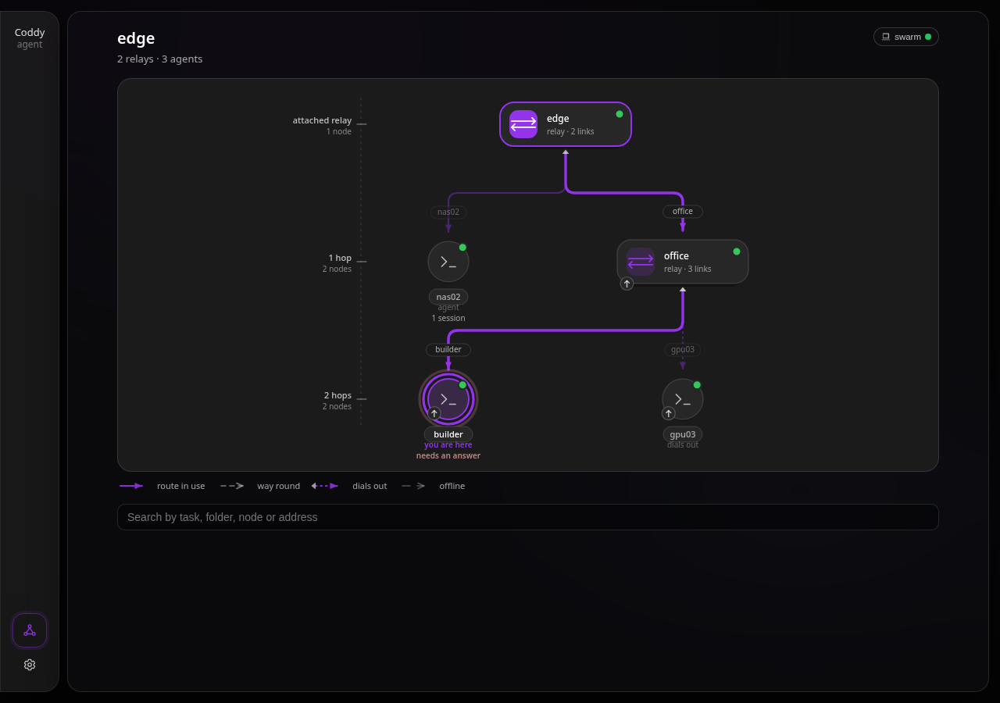
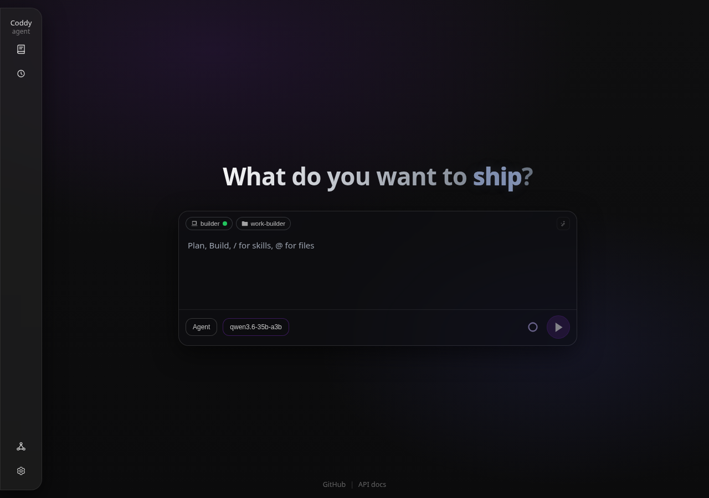
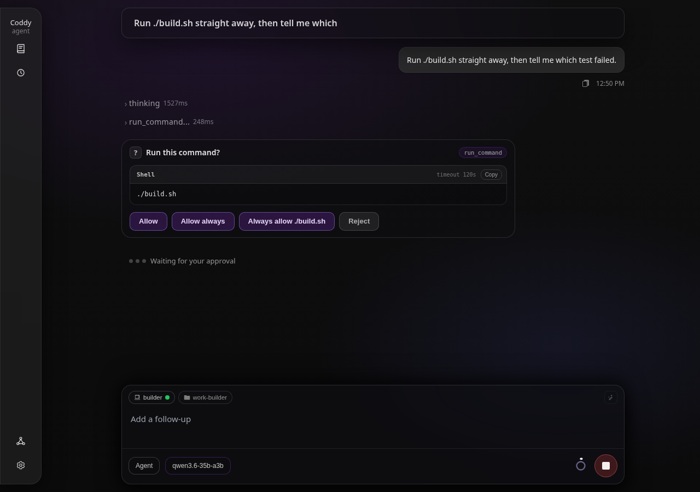
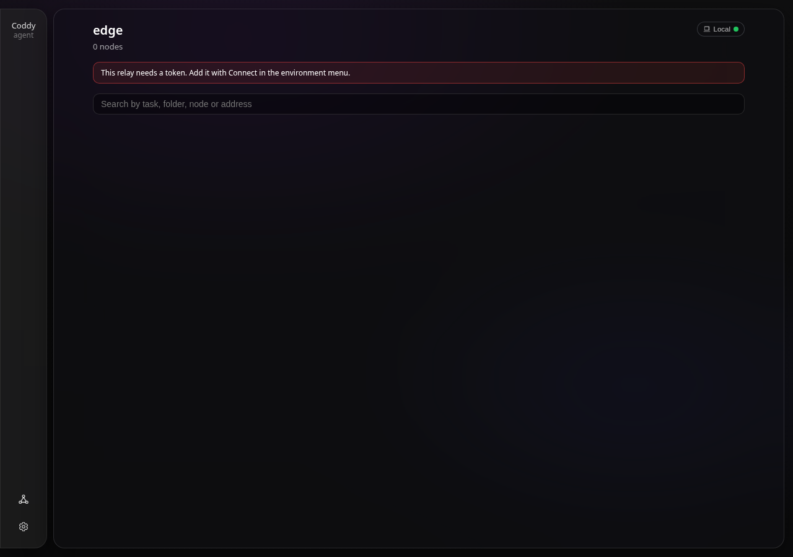

# Swarm: relays, nodes, and one list of everything

https://github.com/user-attachments/assets/fd4837ae-23d0-400e-8e60-52706755bb4b

*A four-minute recording of a relay, two nodes and the aggregated session list, in the console and in the browser. The file is in the repository as [swarm.mp4](../assets/video/swarm.mp4).*

A **swarm** is a set of coddy nodes reached through one or more **relays**. A relay is a
stateless meeting point: nodes register into it, it carries requests to them, and it merges
their session lists into one. It stores nothing of its own, so what it reports is only ever a
live view of what the nodes told it.

Built with `-tags swarm`, which is part of the shipped set (`FULL_TAGS` in the **Makefile**), so
the release binaries, the Docker image, the Linux packages and the Homebrew formula all carry the
relay. Build it yourself with `make build TAGS="http ui scheduler memory cli gateway swarm"`.

The relay is not a command of its own: `coddy serve` runs it when `swarm.enable` is true, next to
whatever else the configuration enables. A binary built without the tag refuses `swarm.enable` at
startup and names the tag; the agent-side join hook is a stub that starts no goroutine and opens no
connection, and the binary otherwise behaves exactly as it did before the feature existed.

## Why

Running `coddy serve` on several machines already works, and `--remote` already drives one of
them. What it does not give you is one place to see everything, or a way in when the machine
you want is somewhere you cannot dial.

A relay answers both. It knows every node that joined it, so a client attached to it sees all
their sessions at once, labelled by owner. And it can be joined by a node that has no inbound
route at all, because that node opens the connection itself.

## The shape of it

```
    client ──▶ relay "outer" ──┬──▶ relay "middle" ──▶ agent8
                               │                   └──▶ relay3 ──▶ agent7
                               └──▶ relay3 (shortcut) ──────────┘
```

Three things are worth noticing in that picture.

A relay is a node from its parent's point of view. `middle` joined `outer` exactly the way
`agent8` joined `middle`, which is all that chaining requires - no second mechanism, and no
hop that knows how deep the chain goes.

`relay3` is reachable two ways. That is a ring, and it is allowed: the swarm dedupes it by
identity and picks the shorter route.

`agent7` never opened a port. It dialled `relay3` and is driven back down that same
connection.

## Running one

```yaml
# a relay
swarm:
  enable: true
```

```bash
coddy serve --swarm-auth-token "$CLIENT_TOKEN" --swarm-pairing-token "$PAIRING_TOKEN"
```

A relay that should do nothing else adds `--http=false`. One that is also an ordinary agent leaves
the API on, and then serves both: its own sessions on `httpserver.port`, the fleet on `swarm.port`.

A node joins by listing the relay in its own configuration:

```yaml
swarm:
  join:
    - url: "https://relay.example"
      name: "nas02"                        # becomes a URL path segment
      pairing_token: "${CODDY_SWARM_PAIRING_TOKEN}"
      advertise_url: "https://nas02:12345" # omit this to dial out instead
      token: "${NODE_OWN_TOKEN}"           # what the relay presents when it proxies
```

`swarm.join` is honoured by every `coddy serve` process, whether or not it runs a relay of its
own. That symmetry is how relays chain.

Set `swarm.join[].token` explicitly when possible; a credential dedicated to the parent relay is
recommended, and an explicit value always wins. When a relay omits that token, it falls back to its
configured `swarm.auth_token` so the parent can enter the child relay through its mount. Agents do
not receive this fallback: an agent with no join token registers with no node credential.

Names are optional. A join entry without `name` claims the host name of the machine it runs on
(dots become dashes, since the name is a path segment), and a relay without `swarm.name` goes by
its host name as well, in `/swarm/info`, on the map and in the routes of its sessions. Set a name
when two machines share a host name, or when the host name says nothing useful.

## Two transports

**Direct** — the relay dials the node's `advertise_url`. Use it when the relay can reach the
node.

**Tunnel** — leave `advertise_url` out. The node dials the relay, the relay takes over that
connection, and from then on the relay sends requests down it while the node answers them.
This is the only way in when a network accepts no inbound connections, a phone on a mobile
network among them ([Android phones as swarm nodes](../tutorials/swarm-android-nodes.md)).

The tunnel is prior-knowledge HTTP/2 over a connection that started as an ordinary HTTP
request, so there is no bespoke frame protocol and no new dependency. Everything above the
transport composes plain HTTP and never learns which one is in play.

It does need an **end-to-end raw connection**. An intermediary that re-frames requests - a
layer-7 proxy, or an HTTP/2-only terminator in front of the relay - leaves nothing to take
over, and the handshake fails with an error saying exactly that. The direct transport is
unaffected.

## Reaching a node

Every node is mounted under the relay:

```
GET https://relay.example/swarm/nodes/nas02/coddy/sessions
```

Because that is a plain base URL with a path, **today's client works unchanged**:

```bash
coddy --remote https://relay.example/swarm/nodes/nas02 --remote-token "$CLIENT_TOKEN"
coddy acp --remote https://relay.example/swarm/nodes/nas02 --remote-token "$CLIENT_TOKEN"
```

Chains compose by writing the path out:

```
/swarm/nodes/middle/swarm/nodes/relay3/swarm/nodes/agent7/v1/models
```

Each hop strips its own prefix and forwards the rest.

### What a mount will and will not carry

It carries `/v1/*`, `/coddy/*`, the read-only swarm routes, and further `/swarm/nodes/*` hops.
That is a **prefix** allowlist, not a route list, so a node's new routes work the day they
ship.

It refuses `POST /swarm/register`, `POST /swarm/tunnel`, and `DELETE /swarm/nodes/{node}` -
that last one by method, since reading a child relay's node list is ordinary and evicting
from it is not. The proxy authenticates to the node on the caller's behalf, so anything
reachable through a mount is something the relay authorises for them; membership decisions
are not that.

A browser that works through the relay hears the relay's CORS answer (`swarm.cors`) and
nothing else: the `Access-Control-*` headers of a node's own answer stay behind the mount. A
node that browsers also reach directly has `httpserver.cors` on, and passed through, its
headers would sit next to the relay's - a browser refuses a response that names the allowed
origin twice. The same rule keeps a node's policy from opening a relay whose own CORS is off.
Since the relay's answer is the only one, it carries what the web UI's Files window needs from
another origin: `HEAD` among the methods, `Range` and `If-None-Match` among the request headers,
and `ETag`, `Content-Range`, `Accept-Ranges` and `Content-Disposition` exposed to the page.

A hand-written path is capped at the same hop budget the fan-out uses, so a client cannot
walk a ring indefinitely by writing hops out one after another.

## The aggregated list

```
GET /swarm/sessions?q=&node=&limit=&include_activity=
```

Every node is asked, in parallel and under a deadline, and the answers are merged newest
first. A child relay is asked for its own aggregate rather than its node list, so the merge
recurses through a chain while each relay still talks only to its direct children.

Each row carries **both** an identity and a route:

- `agent_uuid` + `id` - the agent that owns the session and the id that agent knows it by.
  This pair survives a rename, a failover, or a relay restart.
- `node_path` - how this relay could reach it just now. In a ring there may be several, and
  the shortest is the one reported. Of two equally short ones, the route whose first differing
  hop sorts first by name wins, compared hop by hop rather than as one joined path. That is how
  the topology picks a node's route too, so a row does not change routes from one request to
  the next.

Session ids are chosen per node and **do** collide, so nothing keyed on a bare id is safe.

A node that is slow or gone becomes an entry in `warnings` beside the results rather than an
error instead of them: one unreachable machine should not blank a fleet-wide list.

**Search** covers the work and the machine. A term matching a node's name or address returns
everything that node holds; otherwise the term is pushed down to each node, which matches it
against the session title, the first user message, and the working directory.

## Rings and routes

`GET /swarm/topology` returns the nodes, the edges between them, and a route per node.

Routes come from a breadth-first walk, which visits by increasing hop count - so the first
route found is a shortest one, and a node already seen is never expanded again, which is also
why a ring terminates instead of spinning. Ties break lexicographically, so two clients asking
the same relay are told the same route. A route never repeats a hop, so it cannot lap a cycle
on the way.

`alternates` are the other edges the walk saw arriving **at that node**, of any length - that
is where a client fails over when the short hop dies. They are not routes inherited from
another way into some ancestor: past a merge point only the shortest way through it is carried
forward, so a node behind a diamond has one route rather than two. Enumerating every k-shortest
path would fill the list with speculation; a failover list is more useful correct and short.

Per **request**, a relay appends its own id to an internal header and refuses a request that
already carries it, so a walk cannot go round forever. Depth is capped the same way for a
hand-written mount path.

A branch that closes back on the walk answers `looped: true` and contributes nothing, rather
than raising a warning. A chain that is merely **too long** is a different answer: something
is out there and cannot be reached, so that one does warn. In a ring that is the ordinary end of a branch, and a warning on
every request in a healthy swarm is how an operator learns to ignore warnings. What does
warrant one is a node the relay still knows but cannot reach - including a lease that went
stale, which would otherwise vanish silently and make "this machine is down" look exactly
like "this machine has no work".

## The UI



*The topology graph with a live relay*



*A mounted node and its sessions*



*A permission prompt relayed through two relays*



*A relay that needs a token before it lists anything*

Connecting is the ordinary environment flow: the chip in the composer, **Connect to…**, the
relay's address and its client token - or an entry of `httpserver.remotes` that names the relay,
with its `token` when you keep it there ([Remote mode](remote.md#the-token)). A page served from
another machine, a laptop's `coddy serve` for one, also needs the relay's `swarm.cors` to admit its
origin: exactly, in `allowed_origins`, or - for a page on a loopback address, whatever port the
laptop's `coddy serve` took - through `allow_loopback: true`; the environment menu says so on the
relay's line when that is what stands in the way, and lists the relay's agents once it accepts the
token, so a node is one click
away from the menu too. Because the environment answers as a relay, a **Swarm** entry appears in
the rail - on a plain agent it is not there at all.

The Swarm screen shows the topology and a search box that goes to the relay. It opens in a dock as
wide as the documentation reader's, and the map fills it.

**Choose a layout, then explore the canvas.** The map starts in **Tree layout**, the rooted view
that shows hop tiers. The **Graph layout** is a deterministic rooted graph for inspecting rings and
cross-links: the relay is its root, or the local computer is the root when the map shows the machine
that started the connection. It trends down by shortest-route depth without putting every hop on a
rigid horizontal row, and its links are smooth curves. The choice belongs only to this browser,
under localStorage key `coddy_swarm_layout`; it does not change the relay configuration or another
browser. A saved legacy `star` value migrates to Graph; if the key is absent, unavailable or invalid,
Tree remains the default.

The map has Tree and Graph selectors plus **Zoom out**, **Fit graph**, and **Zoom in** controls.
Wheel zoom centres on the pointer; drag pans in both axes even when the graph is fitted; two fingers
pinch to zoom; and a drag or pinch does not activate a node. With the canvas focused, **`+`** or
**`=`** zooms in, **`-`** zooms out, and **`0`** fits the entire graph. Canvas controls are 40px
touch targets on the stacked shell. Fit resets the camera, as does changing the relay or layout;
ordinary five-second topology polling does not discard a manual pan or zoom, though it keeps the
camera inside changed graph bounds.


*The Graph layout: soft top-down placement, smooth links, and camera controls over the canvas.*

The route in use is an accent path. Every relay it crosses is outlined, with the relay the app is
currently driving outlined more strongly; alternate routes remain visibly secondary. This makes a
transit relay readable as part of the connection without implying that it is the selected target.

**A relay's home screen is the swarm.** Of an agent's API a relay serves only its own settings
(`/coddy/config*`) - no sessions, no workspace, no model, no documentation - so there is nothing
for a composer to send to and nothing for a history drawer to list. Pointed at a relay the app therefore drops the chat screen, hides History and
Scheduler in the rail, and shows the map instead. The environment menu stays where it always is,
at the foot of the rail, so even while the map reports an error, including a relay that needs a
token, the operator can switch environments or supply the needed credentials. Enter a node and all of it
comes back, because the node does have those things.

**Working on a node.** Click a node on the map and the app points at that node's mount, with the
map left open over it until you choose what to do there. From there every screen that already
existed drives it - the history drawer lists that node's
sessions, the composer shows its working directory and its model catalog, Settings edits that
node's configuration - with a relay in the middle and nothing aware of it. A long conversation on
the node is read page by page there too: each read names its page in the query string, which the
mount carries to the node unchanged, over a tunnel as well
([Long sessions](../surfaces/web-ui.md#long-sessions)). The documentation reader is the one
screen that stays with the page's own server: the pages are the ones the local binary carries.


*The map opened over a node: the machine the page runs on at the top, the route to the node the app is on drawn as one path*

**Watching from the map.** Each node says what it is doing, from the same aggregated session
list the search uses: how many sessions it holds, how many turns are in flight, and whether
something there is waiting on a permission prompt. Start work on several machines, come back to
the map, and it says which of them finished and which is asking you a question. Click the one
that is asking and the app switches to it with the map still open; its History shows the session
that waits for you.

**Going back and switching.** The Swarm entry stays in the rail while you are inside a node,
because the relay you came through is remembered. It opens the relay's map over the node without
leaving it: the map is read from the relay directly, with the same client token, and the node's
History, Scheduler and chat stay where they are, so nothing reloads. On that map the node you are
on carries a ring, as the relay's card does when you are on the relay, with the route to it drawn
as one connected path; another node is one
click away, and a click on the node you are on does nothing. A switch between nodes, or between a
node and its relay, does not reload the page. Above the relay the map draws the
machine the page runs on, named by its host name, as where the connection starts: a click on it
goes back to Local. A click on the relay connects to the relay itself, and a relay chained under it
opens on its own map, reached through this one. On the relay itself the relay is not a button:
there is nothing to connect to.

**Where the SPA comes from.** Built with `-tags "swarm ui"` the relay serves the console at its
own address, so a relay is something you open in a browser. It is the same bundle a node
serves, and it treats a relay as one more environment: opened same-origin on a relay that
requires a token, it will say so and ask for one rather than reporting an empty swarm. Built
without the `ui` tag the relay's root explains how to rebuild, and the console can still be
opened from any node and pointed at the relay.

## Where the settings live

| What | Where |
|---|---|
| Whether this process relays at all | `swarm.enable` in `config.yaml`, or `--swarm` / `--swarm=false` |
| Relay's own deployment: bind address, client and pairing tokens, TLS, static upstreams | `swarm:` in `config.yaml`, or the `--swarm-*` flags |
| Which relays this process joins | `swarm.join` in `config.yaml` - honoured whether or not this process relays |
| Relays offered in the UI environment menu | `httpserver.remotes` of the page's server: name, URL and, optionally, the client token (`token`, best as a `${ENV}` reference) |
| Pages served elsewhere that may call the relay | `swarm.cors` (`enable`, `allow_loopback` for a laptop's web UI on any loopback port, `allowed_origins`) |
| Credentials out of the file | `CODDY_SWARM_TOKEN`, `CODDY_SWARM_PAIRING_TOKEN`, `--swarm-auth-token`, `--swarm-pairing-token` |

**The relay's own Settings.** Opened on the relay (its map is the page's home), the Settings
drawer edits the relay's deployment and its log: the **Swarm relay** tab (name, listen address,
client and pairing tokens, CORS, TLS, lease and fan-out timeouts, upstreams, joins) and **Logger**.
There is no Sessions tab, because a relay holds no sessions. The routes are the agent's own -
`GET /coddy/config/schema`, `GET /coddy/config`, `POST /coddy/config/validate`, `PUT
/coddy/config` - served by the relay behind its client token, and they carry only those two
sections: the rest of the host's configuration - a model provider's key, the HTTP server - is
neither shown nor written through the relay, and a save naming another section is refused.


*The relay's settings: its deployment, with the credentials write-only*

Every credential is write-only there, as a config read serves it: a token field shows whether one
is set, an empty field keeps it, a value replaces it. Pairing tokens are a list replaced whole.
The form saves itself a moment after the last edit, as an agent's does
([Settings: opening and saving](../surfaces/web-ui.md#settings-opening-and-saving)), except for
the changes that would cut the page or a node off: the listen host and port, the client and
pairing tokens, TLS, and the upstreams and joins wait for **Save**, which stands out until it is
pressed.
A save is written over the relay's `config.yaml` with its comments and spellings kept, and the
relay is rebuilt on it: nodes register and open their tunnels again within seconds, and a stream
in flight through the relay is cut and resumed by the client. A new listen address takes a
restart, which a relay under the dispatcher or systemd gets by itself. So does turning on the
HTTP server, the gateway or the scheduler in the file of a process started as a relay alone: it
opened no session store, and those surfaces run agent turns. A new client token signs
out every client, the page you are saving from included: enter the new one in the environment menu.
The **Logger** tab is saved like the rest, and the relay reads it when it starts next, as an agent
does with its own logger settings.
An edit of the file is picked up the same way, without a restart.

Changing a relay's settings through another relay is refused: a relay chained under this one is
reached through a mount like any node, but its tokens and its registration rules decide who joins
it, and a client of the parent is not its operator. Reading them through the mount works.

## Security

Three credentials, three jobs:

| Credential | Who holds it | What it authorises |
|---|---|---|
| `swarm.auth_token` | clients | using this relay |
| `swarm.pairing_tokens` | nodes | joining this relay |
| per-node `token` | the relay | acting as that node |

**A relay is a fleet-wide door.** It holds every node's credential, so whoever holds its
client token controls every node it reaches, transitively through every hop - its sessions, its
tools and its settings, the secrets a node's `GET /coddy/config` hands back (provider keys,
remote tokens) included. This is stated
rather than mitigated: there are no per-node client ACLs in this version. Give each node a
credential minted for its relay rather than your own, put TLS in front, and keep the pairing
token secret.

Binding off loopback without a client token **refuses to start** (`swarm.allow_insecure`
overrides). On loopback one is generated for the run rather than left absent, because an open
relay lends its authority to every local process.

A node's name is proven by a **per-lease secret** the relay mints, not by the shared pairing
token: a fleet credential must not let one node claim another's name, redirect its traffic, or
read the prompts meant for it. The secret is stored under the coddy home so a restart reclaims
the same name at once. `DELETE /swarm/nodes/{node}` is the administrative takeover path.

An advertised URL is an **SSRF boundary**. Only `http(s)`, with no credentials, query or
fragment; the host is then resolved and every address checked. Link-local, multicast,
unspecified and cloud metadata addresses are refused outright. Loopback is allowed only when
the relay itself is bound to loopback (the development case), and private ranges only when
`swarm.allow_private_upstreams` names hosts - which also allow-lists those names. The
addresses that passed are **pinned**, and the relay dials exactly them, because re-resolving
at dial time would reopen the window the check closed.

The proxy **replaces** the caller's `Authorization` rather than forwarding it, strips cookies,
hop-by-hop and forwarding headers, removes an SSE query token before the hop, and never
follows a redirect. Path segments are judged **after decoding**: `%2e%2e` passes any check of
the escaped form and becomes `..` the moment something decodes it, which is how a request
aimed at a node's API would climb back out into the relay's own routes.

One request is carried without the client token: a `GET` or `HEAD` of a node's
`/coddy/sessions/{id}/workspace/raw` with an `access_token` and no `Authorization` header. That is
how the web UI's Files window plays a video or an audio file and downloads a file: a media element
cannot send a header, so the node signs a capability for one file of one session, valid for an hour,
and the browser puts it in the address. The relay cannot check that signature and does not vouch for
it either: the request reaches the node with the capability in its query and without the relay's own
credential, and the node accepts or refuses it. A request with two `access_token` values is not
that exception, and a relay's client token is never carried that way, on any route. Without a client
token such a request gets nothing from the relay itself but the gate's plain `401` for whatever the
relay would refuse (an unknown or unreachable node, a path it does not carry); only the node answers it
otherwise. A relay that asks no client token hands such a request on the same way, without its own
credential, so a relay with a gate above it in a chain cannot be walked around through it.

Credentials are preserved across a config save by **destination**, not by label: renaming an
entry keeps its token, pointing it at a new address does not.

The relay's own Settings (above) edit it with the client token, which already controls every node
it reaches; they add no power the token did not have, and they cannot be reached through a parent
relay's mount.

## Encryption and proxies

Relays usually sit in different networks.

```yaml
swarm:
  tls:
    cert_file: "/etc/coddy/relay.crt"
    key_file: "/etc/coddy/relay.key"
  join:
    - url: "https://parent.example"
      dial:
        proxy: "socks5://127.0.0.1:1080"   # http, https, socks5, socks5h
        ca_file: "/etc/coddy/internal-ca.pem"
```

Both files or neither; minimum TLS 1.2; certificates are startup state, so rotating them needs
a restart. `insecure_skip_verify` exists for a lab and is logged every time it is used.

Opening a tunnel through a proxy to a TLS relay composes: dial the proxy, `CONNECT` to the
relay, wrap in TLS, upgrade, invert roles. The HTTP/2 layer above is unaware of any of it.

## What is deliberately absent

- **No persistence.** The registry is memory; nodes make it true again by checking in. After a
  restart `/swarm/info` reports `registry_warming` so a client can tell "just started" from
  "nothing here".
- **No cross-node pagination.** Each node returns a first page and the merge truncates; deep
  history for one node uses that node's own pagination through its mount.
- **One tunnel is one connection.** A reconnect ends the streams that were running on the
  old one, and a bulk response shares flow control with a live turn. Both are inherent to a
  single HTTP/2 connection per node and are not worked around.
- **One relay process per endpoint.** Two replicas behind a load balancer would split the
  registry and the tunnels.
- **No per-node client authorisation.** See the blast radius above.

## Reference

- `coddy serve --help` - flags.
- `docs/reference/config.md` - the `swarm:` block.
- `features/swarm_*.feature` - the executable specifications.
- `examples/swarm/` - a live stand: relays, agents, a ring, and a node that only dials out.
- the tutorials: [a relay and its nodes in Docker](../tutorials/swarm-relay-and-nodes.md), [a chain of relays](../tutorials/swarm-multi-hop.md), [working with remote nodes](../tutorials/swarm-remote-nodes.md).
