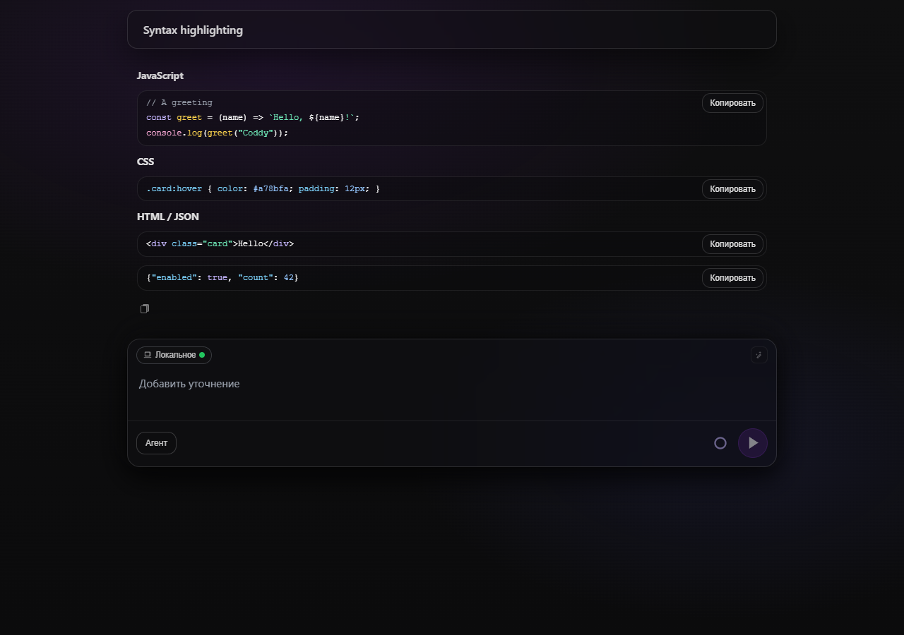
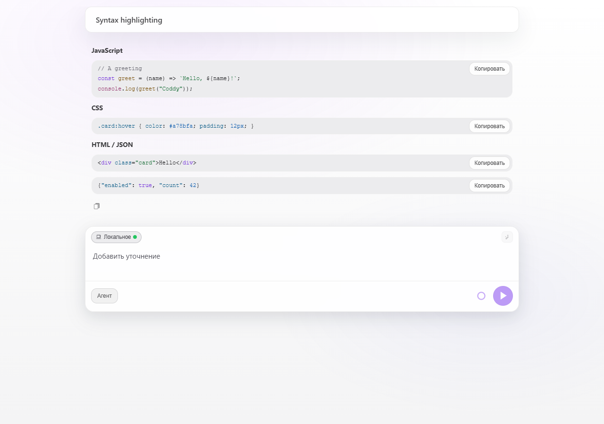
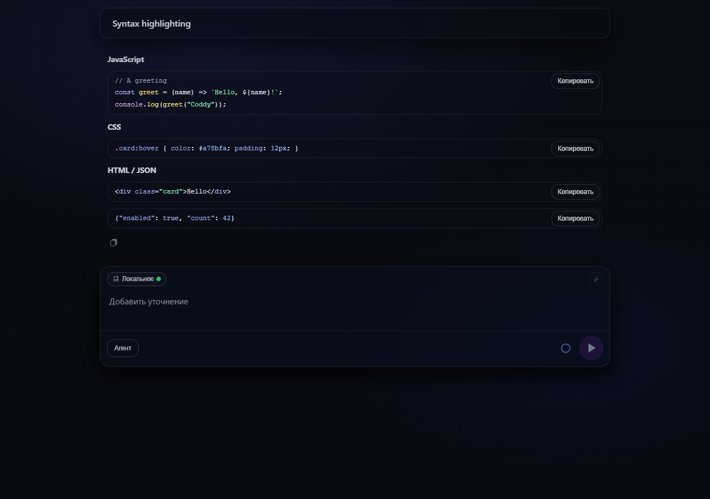
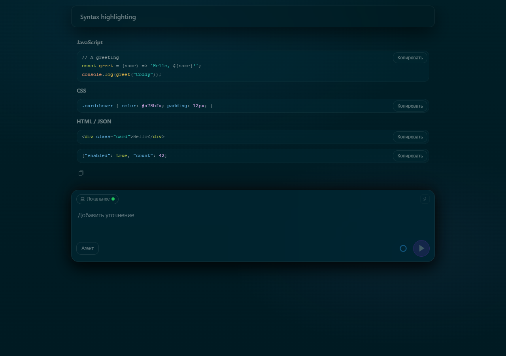
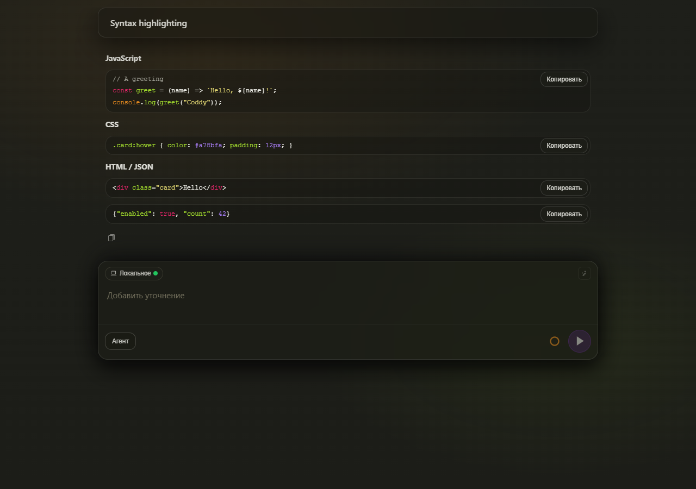
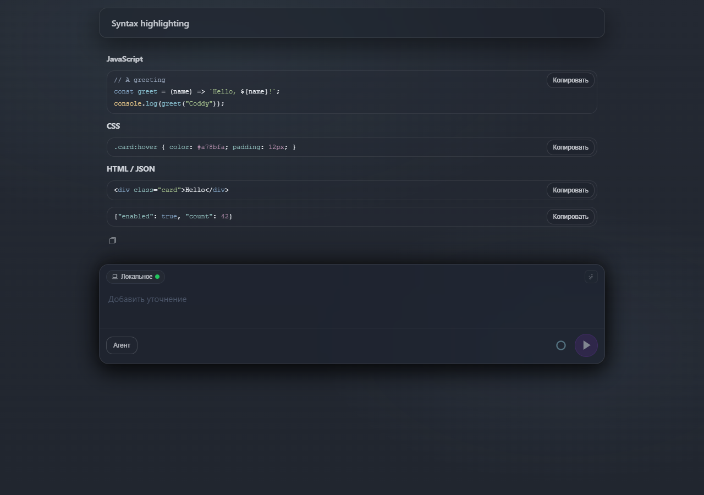
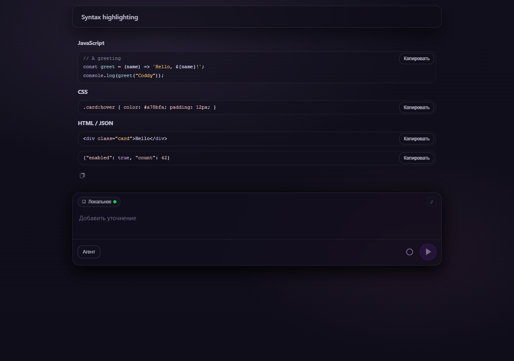

# Аудит подсветки синтаксиса на NeuralDeep

## Методика

Аудит проведён 2026-09-10 на NeuralDeep (`qwen3.8-27b-noreason`). Для каждого из 63 названий языков запрашивался один короткий пример в блоке кода. Метку языка не навязывали, ниже приведены метки, которые вернула модель. Запросы, получившие поначалу HTTP 429, повторялись последовательно с паузами, и в итоге пришли все 63 исходных примера. Ещё один уточняющий запрос про URQ вернул `UNKNOWN`.

В офлайн-тестах ответы прогоняются через настоящий рендерер React Markdown. Тесты проверяют, что исходный текст сохранился, что для поддерживаемых меток есть подсвеченные токены и что неподдерживаемые метки дают безопасный обычный текст. Сгенерированные программы не запускались и не компилировались, поэтому это аудит отрисовки и меток языков, а не подтверждение смысловой правильности. Ни в фикстурах, ни в этом отчёте нет учётных данных.

## Результаты

- до этого расширения (пул-реквест уже включал Vue и PostCSS) подсвеченные токены были в 30 из 63 блоков ответа;
- после расширения они есть в 60 из 63, а остальные три остаются читаемым обычным текстом;
- отдельные дополнительные грамматики - GDScript, HLSL, WGSL, COBOL, T-SQL, VBA и ещё 20 грамматик, включённых в сборку;
- PL/SQL, OpenCL и CUDA используют базовые грамматики SQL, C и C++, поэтому конструкции, характерные для диалекта, могут остаться без цвета;
- NeuralDeep пометил пример Transact-SQL как `sql`, и этот ответ правильно использует общий SQL. Явные метки `tsql`, `transactsql`, `transact-sql` и `t-sql` выбирают отдельную грамматику;
- ответ на Prolog содержит только атомы без кавычек и комментарии. Грамматика Prolog из сборки раскрашивает комментарии, а атомы оставляет без цвета. Переменные, строки и числа отдельно проверяются детерминированным тестом;
- для UnrealScript и TADS грамматика не настроена. URQ модель спутала с запросом GraphQL, а после уточнения Universal RipSoft Quest / UrqW вернула `UNKNOWN`. Ошибочный первый ответ про URQ сохранён как регрессионная фикстура с обычным текстом и не говорит о поддержке языка URQ. [Проект UrqW и документация](https://urqw.github.io/UrqW/).

## Наблюдения по языкам

| Запрошенный язык | Метка блока в ответе | Подсвеченных токенов до | Подсвеченных токенов после | Примечания |
| --- | --- | ---: | ---: | --- |
| React (JSX) | `jsx` | 9 | 9 | Грамматика включена |
| Java | `java` | 16 | 16 | Грамматика включена |
| TypeScript | `typescript` | 20 | 20 | Грамматика включена |
| PHP | `php` | 14 | 14 | Грамматика включена |
| Python | `python` | 9 | 9 | Грамматика включена |
| C++ | `cpp` | 15 | 15 | Грамматика включена |
| Ассемблер x86 (синтаксис Intel) | `asm` | 0 | 35 | Грамматика включена |
| C# | `csharp` | 7 | 7 | Грамматика включена |
| Go | `go` | 9 | 9 | Грамматика включена |
| Rust | `rust` | 11 | 11 | Грамматика включена |
| C | `c` | 15 | 15 | Грамматика включена |
| XHTML | `xhtml` | 23 | 23 | Грамматика включена |
| XML | `xml` | 22 | 22 | Грамматика включена |
| XSLT | `xslt` | 0 | 29 | Грамматика включена |
| XSL | `xml` | 19 | 19 | Грамматика включена |
| Pascal | `pascal` | 0 | 14 | Грамматика включена |
| Object Pascal | `pascal` | 0 | 15 | Грамматика включена |
| GameMaker Language (GML) | `gml` | 0 | 9 | Грамматика включена |
| Common Lisp | `lisp` | 0 | 9 | Грамматика включена |
| Prolog | `prolog` | 0 | 2 | В этом примере только комментарии, атомы остаются без цвета |
| Delphi | `delphi` | 0 | 12 | Грамматика включена |
| Swift | `swift` | 15 | 15 | Грамматика включена |
| Dart | `dart` | 0 | 12 | Грамматика включена |
| Ruby | `ruby` | 6 | 6 | Грамматика включена |
| Kotlin | `kotlin` | 11 | 11 | Грамматика включена |
| Ada | `ada` | 0 | 13 | Грамматика включена |
| Objective-C | `objectivec` | 7 | 7 | Грамматика включена |
| VBA | `vba` | 0 | 13 | Грамматика включена |
| MATLAB | `matlab` | 0 | 8 | Грамматика включена |
| Elixir | `elixir` | 0 | 13 | Грамматика включена |
| Scala | `scala` | 0 | 12 | Грамматика включена |
| SQL | `sql` | 13 | 13 | Грамматика включена |
| Perl | `perl` | 12 | 12 | Грамматика включена |
| Fortran | `fortran` | 0 | 16 | Грамматика включена |
| COBOL | `cobol` | 0 | 16 | Грамматика включена |
| Scheme | `scheme` | 0 | 10 | Грамматика включена |
| Tcl | `tcl` | 0 | 11 | Грамматика включена |
| F# | `fsharp` | 0 | 9 | Грамматика включена |
| OCaml | `ocaml` | 0 | 13 | Грамматика включена |
| Visual Basic .NET | `vbnet` | 13 | 13 | Грамматика включена |
| Haskell | `haskell` | 0 | 10 | Грамматика включена |
| SVG | `svg` | 21 | 21 | Грамматика включена |
| GDScript (Godot) | `gdscript` | 0 | 10 | Грамматика включена |
| Lua | `lua` | 12 | 12 | Грамматика включена |
| Bash | `bash` | 11 | 11 | Грамматика включена |
| POSIX sh | `sh` | 9 | 9 | Грамматика включена |
| Zsh | `zsh` | 9 | 9 | Грамматика включена |
| PowerShell | `powershell` | 0 | 17 | Грамматика включена |
| R | `r` | 15 | 15 | Грамматика включена |
| Haxe | `haxe` | 0 | 14 | Грамматика включена |
| Oracle PL/SQL | `plsql` | 0 | 8 | Только подсветка базового языка |
| Transact-SQL | `sql` | 15 | 15 | Модель вернула sql, явная метка tsql тоже поддерживается |
| UnrealScript | `unrealscript` | 0 | 0 | Обычный текст, грамматики нет |
| GLSL | `glsl` | 0 | 12 | Грамматика включена |
| HLSL | `hlsl` | 0 | 9 | Грамматика включена |
| OpenCL C | `opencl` | 0 | 13 | Только подсветка базового языка |
| CUDA C++ | `cuda` | 0 | 12 | Только подсветка базового языка |
| TADS 3 | `tads` | 0 | 0 | Обычный текст, грамматики нет |
| URQ | `urql` | 0 | 0 | Модель вернула другой язык (GraphQL), уточнение дало UNKNOWN |
| WGSL | `wgsl` | 0 | 18 | Грамматика включена |
| Однофайловый компонент Vue | `vue` | 20 | 20 | HTML/XML и обычные встроенные JS/CSS |
| PostCSS | `postcss` | 6 | 6 | Грамматика включена |
| React TypeScript (TSX) | `tsx` | 10 | 10 | Грамматика включена |

## Регрессионные фикстуры и сопровождение

- `external/ui/src/ui/markdown/neuraldeepLanguageFixtures.json` - 63 исходных ответа вместе с метками языков и ожидаемым поведением при откате на обычный текст;
- `external/ui/src/ui/markdown/syntaxLanguages.test.tsx` - офлайн-прогон и проверки распространённых альтернативных меток. Учётная запись и сеть не нужны;
- `external/ui/src/ui/markdown/syntaxLanguages.ts` - единый явный реестр грамматик и таблица псевдонимов, общие для блоков кода в чате, окна "Файлы" и окна правок. Автоматическое определение языка по-прежнему отключено;
- `external/ui/src/ui/markdown/grammars/README.md` - ревизии из исходных репозиториев и лицензии шести грамматик, скопированных в репозиторий.

С таким широким набором грамматик продакшен-бандл JS вырос примерно с 308,64 КБ до 419,16 КБ в gzip (+110,52 КБ, включая распространяемые уведомления о лицензиях). Грамматики собраны локально, и при отрисовке код грамматик не загружается с CDN. Пользователь попросил обойтись без скриншотов для каждого языка, поэтому аудит записан в виде тестов и этой таблицы.

## Проверка

- набор тестов UI - прошли 1169 тестов в 158 файлах;
- отрисовка в настоящем браузере - все 63 ответа сохраняют исходный текст, в 60 есть раскрашенные токены, а три остаются обычным текстом. Ни в одном из четырнадцати сочетаний темы и размера окна (семь тем, две ширины) страница не переполняется по горизонтали;
- продакшен-сборка Vite и синхронизация встроенных ресурсов проходят, все шесть уведомлений о сторонних лицензиях сохраняются в итоговом JavaScript;
- проверка TypeScript по всему репозиторию сообщает о существующих посторонних ошибках, в том числе в неизменённых типах колбэков и компонентов Markdown. Новый реестр, фикстуры и объявления грамматик ошибок типов не дают.

- целевые тесты встраивания HTTP/UI и BDD-тесты проходят, а Go-бинарник с `http,ui` собирается;
- `make test` запускался повторно и останавливается на прежних ошибках под Windows в путях журнала конфигурации, путях экспорта транскрипта, правах на файлы роя и в подготовке и откате конфигурации. До следующих сочетаний тегов дело не доходит.

## Скриншоты

Скриншоты сняты после изменения с работающей сборки Vite с настоящими компонентами ChatScreen и Markdown и детерминированным транскриптом с JavaScript, CSS, HTML и JSON, в размере 1280 x 900. Живой провайдер и диалоги пользователей не использовались. Все семь тем проверены также при 390 x 900. При обеих ширинах края заголовка, колонки транскрипта и поля ввода совпадают, и страница не переполняется по горизонтали.

| Тема | После |
| --- | --- |
| dark |  |
| light |  |
| midnight |  |
| solarized-dark |  |
| monokai |  |
| nord |  |
| rose-pine |  |

<!-- docsgen:source sha256=ffa779f457214883 -->
