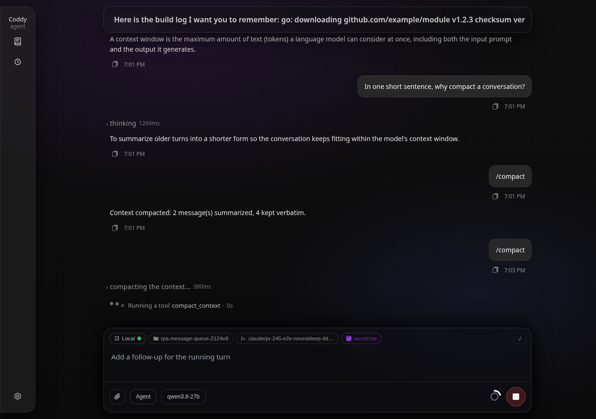
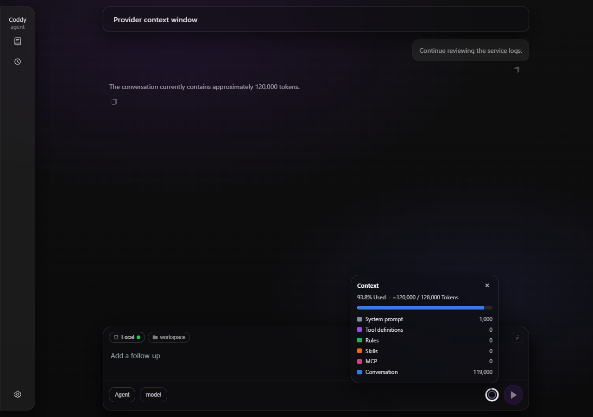
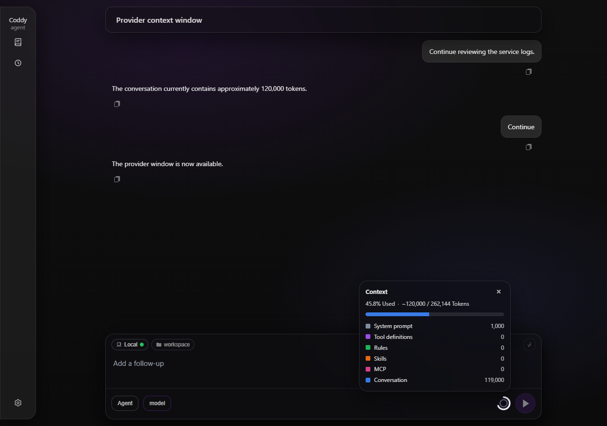

# Сжатие контекста

Модель читает окно контекста ограниченного размера, а рабочая сессия из него вырастает, потому что каждый обмен репликами, каждый результат инструмента и каждая прочитанная страница файла остаются в транскрипте. Сжатие контекста удерживает длинную сессию в пределах окна и ничего не теряет из её записи. Старая история сворачивается в сгенерированную сводку, которую модель читает вместо исходных строк, последние ходы остаются дословно, а второй, более дешёвый механизм схлопывает страницы файлов и результаты поиска, которые модель уже прошла. Оба механизма строят проекцию в момент отправки запроса модели, а транскрипт на диске хранит каждое исходное сообщение и каждый полный результат.

## Команда /compact

```text
/compact [-m|--model <id>] [-r|--reasoning <level>] [instructions]
```

Встроенная команда `/compact` работает во всех интерфейсах, которые принимают промпт, - в консоли, в редакторах по ACP, в поле ввода веб-интерфейса и в `POST /v1/responses` - так же, как `/export` и `/plugin`. Coddy распознаёт её до того, как текст станет сообщением, и основная модель для этого ход не делает. В каталоге команд (`GET /coddy/commands`, `available_commands_update` в ACP) она есть, только пока `compaction.enable` равен true. Всё, что идёт после команды, передаётся суммаризатору как дополнительные инструкции, поэтому `/compact focus on the file paths and the failing test` определяет, что сохранит сводка. Режим "Чат" её не ограничивает, потому что команду отдаёт оператор, и ограничение "только чтение" на неё не распространяется.

`--model <id>` (или `--model=<id>`) задаёт суммаризатор для одного этого сжатия независимо от `compaction.model`, например `/compact --model hub/qwen3-coder keep the file paths`. Идентификатором служит `models[].model` в любом регистре, имя модели без провайдера (`qwen3-coder` для `hub/qwen3-coder`, даже если рядом есть более длинный `hub/qwen3-coder-next`) или часть идентификатора, которая совпадает ровно с одной настроенной моделью, так что `--model qwen` хватит, пока `qwen` есть в идентификаторе только одной модели. Названная модель встаёт в начало цепочки суммаризаторов, а настроенная цепочка остаётся за ней, поэтому при недоступном провайдере сжатие всё равно переходит к запасным моделям, как описано в разделе [История больше одного запроса на суммаризацию](#история-больше-одного-запроса-на-суммаризацию). Если имя не совпадает ни с одной моделью или совпадает с несколькими, сжатие не выполняется, а в ответе перечислены настроенные идентификаторы. `--reasoning <level>` (или `--reasoning=<level>`) задаёт уровень рассуждения, с которым пишется сводка. Подходит уровень, который предлагает модель суммаризатора (модель из `--model`, иначе `compaction.model`, иначе модель сессии), или `default`, чтобы модель работала на своём уровне по умолчанию. Запасные модели цепочки, у которых такого уровня нет, работают на своём. Короткие формы - `-m` и `-r`, например `/compact -m qwen -r high keep the file paths`. Опции идут первыми. Первое слово, которое не относится к опциям, начинает инструкции, и дальше в них можно свободно упоминать `--model`. Опциями считаются только слова с `--`, `-m` и `-r`, поэтому инструкции, записанные списком (`- keep the paths`), остаются инструкциями. В веб-интерфейсе поле ввода дополняет опции и их значения (модели и уровни модели, названной в `--model`), подробнее на [странице веб-интерфейса](../surfaces/web-ui.md#опции-команд-в-поле-ввода).

Ручное сжатие выполняется принудительно и сворачивает всё, что есть. Если при настроенном числе сохраняемых ходов суммаризировать нечего, оно повторяет попытку с меньшим числом ходов, вплоть до нуля, так что сжимается даже короткий диалог. Текст команды сохраняется как строка пользователя, чтобы транскрипт её показывал, а ответ занимает одну строку.

```text
Context compacted: 14 message(s) summarized, 6 kept verbatim. Summarizer: hub/qwen3-coder.
Nothing was compacted: unknown model "qwn" (configured: openai/gpt-4o, hub/qwen3-coder). Usage: /compact [-m|--model <id>] [-r|--reasoning <level>] [instructions]. ...
Nothing to compact: there is no earlier conversation to summarize yet.
Compaction is disabled in the configuration (compaction.enable: false).
```

По HTTP то же действие выполняет `POST /coddy/sessions/{id}/compact` с необязательным телом `{"instructions": "...", "model": "...", "reasoning": "..."}` (`model` соответствует `--model` команды, `reasoning` - её `--reasoning`). В ответе приходят сводка, число сообщений и `model`, которая сводку написала. Ответ `400` приходит, если сжатие выключено, `model` не указывает ровно на одну настроенную модель или `reasoning` задаёт уровень, которого у суммаризатора нет, а `409` - пока сессию занимает ход, пока она удаляется и для дочерней сессии, доступной только для чтения ([HTTP API](../reference/http-api.md)). Сжатие выполняется как ход сессии, поэтому `GET /coddy/events` сообщает о его начале и конце, а вкладка браузера, в которой открыта сессия, перезагружает изменившееся.

## Автоматическое сжатие

Агент сравнивает заполненность контекста с окном модели сессии. Когда вызов модели вернул `input_tokens`, следующая проверка берёт это число и прибавляет к нему оценку содержимого, добавленного после вызова. Если провайдер число не сообщает, в оценку входят системный промпт, определения и схемы инструментов, правила, скилы, MCP, текст сообщений, аргументы инструментов, рассуждения и изображения. Для кода и текста за пределами ASCII оценка закладывает больше места, чем прежнее правило runes/4. Когда заполненность доходит до `compaction.threshold_percent` (по умолчанию 80), старая история сжимается перед следующим вызовом модели, будь то первый вызов хода, вызов после ответа на запрос разрешения, вызов между раундами, когда результаты инструментов наращивают контекст, или первый вызов только что выбранной модели, окно которой может быть меньше ([Настройки сессии](session-settings.md#что-происходит-при-отправке)). Чтобы отключить этот триггер и оставить ручное сжатие, задайте `compaction.auto_enable: false`. Любой сбой (ошибка суммаризатора, запрет от хука) записывается в лог, и ход продолжается без сжатия.

### Окно контекста

Размер окна везде определяется одинаково - для триггера, для `usage_update`, по которому консоль показывает процент контекста, и для `max_context_tokens` в `GET /v1/models`, относительно которого веб-интерфейс рисует кольцо контекста, - поэтому кольцо показывает то же, что измеряет триггер:

1. `max_context_tokens` из записи модели;
2. окно, которое сообщает для модели список моделей провайдера, а именно `limit.context` (хаб NeuralDeep), `context_length` (OpenRouter), `max_model_len` (vLLM), `max_context_length` (LM Studio) или `context_window` (каталог Codex, где это окно, с которым работает сам Codex, сейчас 272000 для каждой его модели; соседнее, большее значение `max_context_window` лишь задаёт потолок, до которого Codex разрешает поднять окно своей настройкой `model_context_window`, и Coddy его не читает). Список читается для провайдеров `neuraldeep`, `devin` и `codex`, а также для провайдеров `openai` с явным `api_base` и никогда для api.openai.com и Anthropic, в чьих списках окна нет. Его читают в начале хода, при отдаче списка моделей и при переключении сессии на эту модель. Ход ждёт список, который ещё ни разу не ответил, не больше трёх секунд (так же ждёт и шаг после переключения посреди хода, прежде чем измерять), а полученному списку доверяет час. Неудачное чтение повторяется через пять минут или при следующем чтении, если для строки провайдера выполнили вход или выход в настройках;
3. 128000.

Задайте `max_context_tokens`, если провайдер не сообщает окно или сообщает большее, чем на самом деле обслуживает развёртывание (локальный сервер, запущенный с меньшим контекстом).

### Несколько длинных ходов

Автоматическое сжатие оставляет дословно `keep_recent_turns` пользовательских ходов, когда в окне их больше. Если меньше (сессия из нескольких длинных агентных ходов, где контекст перерастает окно без большого числа промптов), оно оставляет меньше ходов, вплоть до промпта, на который сейчас идёт ответ, и этот промпт не сворачивает никогда.

Когда в окне остался только этот промпт, более ранних ходов для сворачивания нет, а ход из одного промпта и десятков шагов с инструментами (многие из них - параллельные вызовы `glob`, `grep` или `read` с результатами по несколько килобайт) может перерасти небольшое окно сам по себе. Тогда на пороге триггер сворачивает **более ранние шаги этого хода**. Шаг - это одно сообщение ассистента с результатами инструментов, которые идут за ним, поэтому десять параллельных вызовов образуют один шаг, а пачка вызовов никогда не разрезается между вызовом и его результатами. Шаги до границы уходят тому же суммаризатору, что и при любом другом сжатии: та же цепочка моделей, те же проходы для истории больше одного запроса, те же хуки `PreCompact` и `PostCompact`, которые видят триггер `auto`. Последние шаги остаются дословно.

Промпт, на который идёт ответ, в сводку попасть не может: модель, которой не сказали, о чём её спросили, ничего не ответит. Поэтому строка сводки, заменяющая шаги, начинается с этого промпта слово в слово, затем строка, которая объясняет, что за текст над ней, затем сама сводка.

```text
<the prompt, verbatim>

The text above is the user's request, verbatim. Coddy compacted the conversation before this point, including the earlier steps of the work on this request. Summary of the compacted part:

<the summary>
```

Строка - первое сообщение окна модели, поэтому каждый следующий запрос начинается с промпта. Промпт, в который вставлен целый лог, обрезается посередине до десятой части окна (не меньше 300 токенов), и маркер говорит, сколько символов убрано. Транскрипт хранит текст целиком, а картинки, приложенные к промпту, остаются на исходном сообщении и на строку не копируются. Когда ход сворачивается повторно, новая строка заменяет прежнюю, и та становится частью суммаризируемого, поэтому в окне остаётся одна копия промпта.

Сколько шагов останется, решает бюджет, а не только `compaction.in_turn.keep_recent_steps` (по умолчанию 4, не меньше 1), который служит лишь верхней границей. Сворачивание целится в половину доли окна, при которой срабатывает сжатие (40% окна при `threshold_percent: 80`), за вычетом того, что несёт каждый запрос помимо диалога (системный промпт, определения инструментов, правила), и за вычетом промпта в начале строки. Остаются последние шаги, которые помещаются, не больше верхней границы, и последний шаг остаётся всегда. Без такой цели сворачивание, оставившее четыре больших шага, оставило бы запрос выше порога и сворачивало бы снова уже на следующем шаге. Сама сводка в бюджет не входит: её оплачивает вторая половина, которую цель оставляет свободной. У хода с одним шагом нет более раннего, что можно свернуть, и ход один раз пишет об этом в лог и продолжается. `compaction.in_turn.enable: false` отключает сворачивание.

#### Когда провайдер отклоняет запрос

Порог измеряется относительно окна, которое известно Coddy. Сервер может обслуживать меньшее окно (локальный сервер, запущенный с меньшим контекстом), считать плотнее, чем оценка Coddy, или получить один шаг, который не помещается в оставшееся место. Когда провайдер отклоняет запрос, потому что он не помещается в окно модели, ход на этом не заканчивается: Coddy сжимает ход и один раз повторяет тот же шаг.

- Отказ Coddy узнаёт по коду `context_length_exceeded` и по формулировкам OpenAI-совместимых серверов, Anthropic, llama.cpp, vLLM и Gemini, но только в ответах 400, 404, 413 и 422 или в ошибке, у которой нет статуса вовсе (кадр внутри потока, событие сбоя Codex). Лимит запросов (429) и сбой (5xx), в сообщении о которых упомянуты токены, таким отказом не считаются, а фраза "too many tokens" учитывается только там, где статус говорит об отклонённом запросе. Тело, которое клиент OpenAI не кладёт в свою ошибку (плоское `{"object":"error",...}` у vLLM, обычный текст, `{"detail": ...}` у Codex), Coddy читает из самого ответа.
- Запрос, после которого клиенту уже что-то отправили потоком, повторно не отправляется, по какой бы причине его ни отклонили.
- Сворачивание целится ниже предела, который раскрыл отказ, в собственных единицах Coddy: окно, сниженное до предела, названного провайдером, и пересчитанное по тому, насколько больше токенов насчитал провайдер, чем оценил Coddy, но не выше оценки отклонённого запроса. Цель та же - половина доли порога от этого предела. Нижняя граница здесь - ни одного шага, а не один: запрос уже выше предела, поэтому уходит даже последний шаг, если больше ничего не помещается.
- Когда в окне есть более ранние ходы, а ход в работе, начиная с его промпта, помещается в остаток, Coddy сворачивает более ранние ходы как обычное сжатие, и промпт остаётся самостоятельным сообщением. Иначе он сворачивает внутри хода, как описано выше.
- [Вытеснение результатов](#вытеснение-результатов) включается сразу и до конца этого хода, что бы ни говорил `start_percent`: этот порог защищает кеш промптов провайдера, а провайдеру, отказавшемуся принять запрос, кеш того, что он не станет читать, не нужен. Следующий ход начинается с прежним порогом.
- Повтор разрешён один раз на шаг. Успешный вызов возвращает его, поэтому два разных шага можно восстановить каждый, а повторный отказ на том же шаге завершает ход. В журнал сессии попадает уведомление о том, что запрос был отклонён и отправлен заново, а в журнале агента записаны размеры (`estimatedTokens`, `providerTokens`, `providerLimit`, `limitTokens`). Остановка пользователем во время сжатия завершает ход как остановку, а завершение работы или истёкший срок завершают его объяснением отказа и пометкой `(the compaction after the refusal was interrupted: ...)`.

Когда сворачивать нечего, хук запретил сжатие, суммаризатор не справился, меньший запрос тоже отклонён или `compaction.in_turn.enable` либо `compaction.auto_enable` равны false, ход заканчивается ошибкой, которая говорит об этом, вместо голого ответа провайдера:

```text
context window exceeded: the provider refused the request because it does not fit the model's context window (Coddy estimated about 38000 tokens; the window is 49152 tokens; the provider counted 51402 tokens against a limit of 49152); run /compact, start a new session or split the task into smaller steps: provider "local" (http://127.0.0.1:8080/v1): openai stream: ...
```

Сообщение называет собственную оценку запроса у Coddy и окно, относительно которого она измеряется, добавляет размеры, которые назвал провайдер, если они есть в его ответе, и заканчивается ответом провайдера без изменений. После сжатия, которое не помогло, оно добавляет `Coddy compacted this turn and asked again, but the provider refused the smaller request too`. Если предел провайдера ниже окна, с которым работает Coddy, или окно не задавалось и принято равным 128000, сообщение советует задать `models[].max_context_tokens` равным окну, которое сервер обслуживает на самом деле, чтобы следующее сжатие началось раньше. Статус провайдера остаётся в ошибке, поэтому HTTP API отвечает клиенту тем же 400 или 404, что и раньше. `/compact` сворачивает историю вместе с промптом, на который шёл ответ. [Вытеснение результатов](#вытеснение-результатов) убирает из запроса самые старые просмотры папок и результаты из сети, как только контекст достигает `start_percent`, и длинная серия вызовов `glob` и `print_tree` дольше помещается в небольшое окно (issue #490).

## Модель может попросить сжатие сама

Порог - это догадка, сделанная до вызова, а что именно только что прочитано, знает модель. Вставленный лог сборки, файл, который больше не нужен, поиск, вернувший гораздо больше ожидаемого, - модель видит, как заполняется контекст, и может сама свернуть историю инструментом `compact_context`, не дожидаясь триггера или пока оператор наберёт `/compact`.

```json
{"instructions": "keep the file paths and the failing test", "model": "hub/qwen3-coder"}
```

`instructions` необязателен и влияет на сводку так же, как текст после `/compact`. `model` тоже необязателен и соответствует `--model` команды. В описании инструмента перечислены настроенные модели, поэтому просьба "сожми контекст через qwen" в промпте превращается в вызов с этой моделью, а имя, которое ни с чем не совпало, возвращается ошибкой инструмента со списком настроенных идентификаторов, чтобы модель его исправила. Само сообщение ассистента с этим вызовом никогда не сворачивается, поэтому его результат всегда отвечает на вызов, который видит провайдер, даже если модель сжимает контекст в первом ходе сессии. Вызов ведёт себя как ручное сжатие и сворачивает всё, что есть, а инструмент отвечает той же строкой, что и команда. Модель читает, что сделала, и продолжает работу на укороченной истории, потому что перед следующим вызовом цикл заново собирает запрос из свёрнутого транскрипта. Инструмент доступен в режимах "Агент" и "План" и полностью скрыт, когда `compaction.enable` равен false. В режиме "Чат" его нет, потому что все инструменты там только читают; `/compact` от оператора и автоматический триггер в этом режиме работают.

## История больше одного запроса на суммаризацию

Прежде всего из начала истории убираются повторы. Строка, которая уже дословно встречалась в диалоге, выбрасывается, первая копия остаётся на своём месте, а каждая запись сообщает, сколько повторов из неё убрано. Сессия заполняет окно повторами (один и тот же лог сборки после каждой попытки, один и тот же файл, прочитанный десяток раз), а суммаризатор ничего не узнаёт из второй копии, но платит за неё полностью (issue #273). Короткие строки не трогаются, потому что закрывающая скобка или одинокое число задают структуру, и без них код, по которому пишется сводка, исказится.

Раньше свёртка занимала один вызов, и всё начало диалога уходило суммаризатору одним запросом. Это работает, пока сессия близка к окну, относительно которого её измеряют, и перестаёт работать как раз тогда, когда сжатие нужнее всего. Сессия, которая далеко вышла за своё окно (модель продолжала читать большие файлы, автоматический триггер не сработал, потому что окно было неизвестно), приходит к `/compact` с историей в несколько раз больше окна самого суммаризатора, и провайдер отклоняет запрос.

```text
compaction LLM call: 400 Bad Request: this model's maximum context length is exceeded
```

Сессия застревала, потому что была слишком большой для отправки, а уменьшить её мог только тот самый вызов, который не уходил.

Отказ суммаризатора тоже больше не тупик. `compaction.fallback_models` перечисляет модели, которые пробуются по порядку, когда предыдущая не справилась, а последним вариантом служит модель самой сессии, есть она в списке или нет. Поэтому `compaction.model`, указывающая на развёртывание, которое упало, перегружено или исчезло, больше не оставляет заполненную сессию без выхода (issue #247).

Теперь такая история сворачивается в несколько проходов. Каждый проход несёт сводку всего, что уже свёрнуто, и следующий отрезок транскрипта, оба по размеру окна контекста самого суммаризатора (окна `compaction.model`, если там указана другая модель), и возвращает одну сводку, которая охватывает и то, и другое. В транскрипт попадает ответ последнего прохода, поэтому после сжатия в семь вызовов сессия выглядит точно так же, как после сжатия в один. Проход, который провайдер отклоняет как слишком большой, повторяется с меньшим объёмом, не больше трёх раз на суммаризатор: с половиной транскрипта или, когда отказ сообщает размер запроса и допустимый предел (так отвечают OpenAI, vLLM, Anthropic, llama.cpp и некоторые локальные серверы), с таким объёмом, чтобы уложиться в этот предел. Отдельная запись, слишком большая даже сама по себе, отправляется без середины, с сохранёнными началом и концом. Так свёртка продвигается и не останавливается на том единственном сообщении, ради которого она и нужна. Отказ 400 или 413, который не узнаёт ни одна фраза, режется один раз, прежде чем проход перейдёт дальше: сервер с непривычной формулировкой не должен оставлять заполненную сессию без выхода. Любой другой отказ (отклонённый ключ, сбой сервера, лимит) не связан с размером и при половинном объёме завершится так же, поэтому проход сразу переходит к следующему суммаризатору цепочки. Проходы считаются той же оценкой, что использует автоматический триггер (три ASCII-символа на токен, один токен на любой другой символ), а каждый повтор пишется в лог уровня warn как `compaction pass refused as too large` (`compaction pass refused with a status that can mean too large` для единственной попытки после неузнанного отказа) с токенами, которые оценила свёртка, и токенами, которые назвал провайдер. По этой паре видно, завышено ли окно или оценка оказалась заниженной. `POST /coddy/sessions/{id}/compact` сообщает о проходах в поле `steps`.

## Что показывает сессия во время сжатия

Любое сжатие, как бы оно ни началось, рисует такую же строку, как вызов инструмента. В начале она объявляется как `compact_context`, во время свёртки в несколько проходов показывает текущий проход (`compacting context: pass 3 of 7`), а в конце закрывается итогом свёртки. Раньше сессия просто замолкала на всё время работы суммаризатора, и при свёртке большой истории в несколько вызовов такое ожидание было трудно вытерпеть.


*Команда `/compact` отправлена из поля ввода. Пока суммаризатор пишет сводку, строка под ходами, которые он сейчас свернёт, сообщает, что контекст сжимается. Снято в работающем интерфейсе.*

Строка, которую сжатие рисует для себя, живая. Её видит каждый, кто следит за сессией (поле ввода, отправившее `/compact`, вторая вкладка браузера, консоль с `--remote`), а в транскрипте после этого остаётся строка со сводкой сжатия. Со сжатием, которое запросила модель, всё иначе, потому что строка там уже есть. Вызов `compact_context` использует её же, поэтому проходы показываются под вызовом, который их заказал, и строка остаётся в транскрипте, как любой другой вызов инструмента.

## Что сохраняется и что суммаризируется

Граница проходит по `keep_recent_turns`-му с конца сообщению пользователя (по умолчанию 2). Всё начиная с этого сообщения (ходы пользователя, ответы и работа инструментов после каждого из них) остаётся дословно. Всё, что раньше, отправляется суммаризатору как плоский транскрипт, где вызовы инструментов записаны строками с метками, и в том, что видит модель, заменяется одной строкой сводки, вставленной на границе. Предыдущая сводка входит в старую историю, поэтому второе сжатие сворачивает её в новую, и модель всегда видит ровно одну сводку. `keep_recent_turns: 0` суммаризирует всё окно. Когда в окне только ход, на который идёт ответ, граница проходит по шагу этого хода, как описано в разделе [Несколько длинных ходов](#несколько-длинных-ходов).

Сводку запрашивают у `compaction.model`, если она задана, иначе у модели сессии, с фиксированным системным промптом. Он просит по порядку цели и ограничения пользователя, принятые решения и отвергнутые подходы, состояние работы, точные пути, имена, команды и значения, которые важны, а также открытые вопросы и следующие шаги. Сначала к истории применяется проекция вытеснения результатов, описанная ниже, поэтому страница, поиск или просмотр, которые модель уже прошла, не суммаризируются целиком.

Правила проекта, которые пришли с результатом инструмента или с сообщением, не суммаризируются. Правило, которое ушло в сводку, вернётся со следующим вызовом инструмента или упоминанием, затрагивающим подходящий путь, а правило, которое ещё есть в сохранённом хвосте, придёт снова, только если его файл изменился. Кроме того, при сжатии заново читаются постоянные правила (пары `AGENTS.md` и `DESIGN.md`, правила, которые действуют всегда, и файлы из `instructions.files`), так что правка, сделанная в них во время сессии, попадает в следующий системный промпт ([Правила и кэш промпта](rules.md#правила-и-кэш-промпта)).

## Строка сводки и оценка контекста

Строка сводки - сообщение с ролью user и флагом `compaction_summary`, которое начинается с `The earlier conversation was compacted. Summary of the compacted part:`. Окно модели начинается с последней такой строки, а строки до неё остаются в `messages.json` только для транскрипта. Сворачивание внутри хода пишет вместо этого строку, которая начинается с промпта, а за ним идёт `The text above is the user's request, verbatim. Coddy compacted the conversation before this point, including the earlier steps of the work on this request. Summary of the compacted part:`. Помечена она так же. Когда за такой строкой стоит сообщение ассистента, она заменяет ход, чей промпт несёт, поэтому следующий промпт сворачивает эту строку вместе с шагами после неё. Хуки `PreCompact` запускаются перед любым из двух триггеров и могут его запретить, хуки `PostCompact` получают сводку ([Хуки](hooks.md#события)). Они запускаются только для сжатия, в котором есть что сворачивать: шаг выше порога, где сворачивать нечего, их больше не будит.

После сжатия оценка контекста пересчитывается и публикуется как `usage_update` с `used` и `size`, и именно это показывают кольцо контекста в поле ввода и процент контекста в нижней строке консоли. `GET /coddy/sessions/{id}/stats` возвращает ту же разбивку по категориям. Меньшее число видит каждый клиент общей сессии. Вкладка, отправившая ход, получает его из своего потока, другая вкладка, следящая за ходом, - из `GET /coddy/sessions/{id}/composer-stream` (те же кадры), а вкладка, которая только просматривает сессию, - из статистики, которую перезагружает при получении `turn_ended`. Сжатие сворачивает ходы до сохраняемого хвоста, поэтому числа падают, когда основная часть контекста лежит в старых ходах. Большое последнее сообщение остаётся дословно, пока новые ходы не вытолкнут его за пределы `keep_recent_turns`.

Во всплывающем окне "Контекст" рядом с заголовком есть действие ручного сжатия. Если автоматика включена, на нём виден настроенный порог, например **Сжимать при 95%**, а при `auto_enable: false` - надпись **Сжать сейчас**. Нажатие запускает то же действие `POST /coddy/sessions/{id}/compact`, что и `/compact`, показывает прогресс и по окончании обновляет транскрипт и индикатор контекста.


*Всплывающее окно "Контекст" в работающем веб-интерфейсе при ширине 1280 px.*

Кроме того, веб-интерфейс обновляет окно контекста сессии по `usage_update.size` из любого из двух потоков. Если список провайдера приходит после того, как `/v1/models` вернул запасное значение 128000, кольцо переходит на сообщённое окно без перезагрузки. Обновления статистики это живое окно сохраняют, а после выбора другой модели или сохранения конфигурации используется список моделей, пока не придёт свежее обновление заполненности. Окно, полученное для одной сессии, никогда не меняет кольцо другой.


*До ответа провайдера те же 120000 токенов занимают 93,8% запасного окна. Снято в работающем интерфейсе с подставным провайдером.*


*После того как поток сообщил окно в 262144 токена, без перезагрузки показано 45,8%. Узкая раскладка - [до](../../assets/compaction/context-window-before-dark-390.png) и [после](../../assets/compaction/context-window-after-dark-390.png).*

## Что показывает транскрипт

В веб-интерфейсе сводка показывается раскрывающейся строкой **контекст сжат**, оформленной как блок размышления; в её теле отображается сводка, то есть то, что теперь находится в контексте модели, а строка, написанная внутри хода, сначала показывает промпт. Строка стоит на границе, над ходами, сохранёнными дословно, а не в конце чата; после принудительного сжатия короткой сессии она оказывается последней. Команда `/compact` и её однострочный ответ - обычные строки пользователя и ассистента. `GET /coddy/sessions/{id}/messages` возвращает все исходные строки, и у сводки стоит `compaction_summary: true`, а экспорт записывает её как запись `compaction_summary` ([Экспорт сессии](session-export.md)). Клиент ACP, а с ним и консоль, при воспроизведении видит эту строку как сообщение пользователя, которое начинается с приведённой выше преамбулы.

## Вытеснение результатов

Иначе постраничное чтение большого файла, широкий поиск или просмотр десятка папок закрепили бы каждый результат в контексте до конца сессии. При сборке запроса вытеснение результатов заменяет пройденные моделью результаты короткими плейсхолдерами, так что для провайдера вызов инструмента и его результат остаются парой, а основной объём уходит. Через вытеснение проходят две группы инструментов, у каждой своё окно: `read` и `grep`, а также инструменты просмотра `glob`, `print_tree`, `websearch` и `webfetch`.

```text
[evicted: internal/agent/react.go lines 1-200, not marked as useful; re-read if this range is needed again]
[evicted: grep "maybeAutoCompact" in internal/agent, not marked as useful; re-run the search if needed]
[evicted: internal/agent/react.go was modified after this read; re-read for current contents]
[evicted: glob "**/*.go" in internal/agent (312 lines); re-run if needed]
[evicted: print_tree of internal/session (87 lines); re-run if needed]
[evicted: websearch "godog parallel scenarios" (24 lines); re-run if needed]
[evicted: webfetch https://example.com/docs (140 lines); re-fetch if needed]
[evicted: glob "**/*.go" in internal/agent is stale after internal/agent/new.go was modified; re-run if needed]
```

Результат `read` или `grep` сохраняется, если он попадает в рабочее окно (`keep_recent` самых свежих кандидатов, по умолчанию 2, чтобы можно было сравнить чтение и поиск) или если модель пометила его полезным, указав `keep: true` в самом вызове `read` или `grep` либо назвав страницу (`path`, при необходимости `offset` и `limit`) или поиск (`pattern`, при необходимости `path`) в более позднем вызове `keep_result`. `keep_result` ничего не читает, закреплением служит сам вызов, записанный в историю. Успешная запись в файл (`write`, `edit`, `apply_patch`, `mv`, `rm`, `touch`, `mkdir`, `rmdir`; отклонённый или неудачный вызов не в счёт) делает устаревшими все предыдущие чтения этого файла и все поиски grep, чей корень поиска или совпадения его затронули, закреплены они или нет. Они сворачиваются в плейсхолдер "was modified", и модель перечитывает актуальное содержимое. Результаты размером не больше `min_result_bytes` (2000) кандидатами не становятся никогда. Описания `read`, `grep` и `keep_result` сообщают модели, что неотмеченный результат сворачивается в плейсхолдер и устаревает после записи, и как его закрепить; промпт каждого режима говорит то же и добавляет, что свёрнутый результат возвращается повторным вызовом. `keep_result` доступен во всех режимах, включая "Чат". Описания инструментов просмотра о вытеснении молчат: модель встречает плейсхолдер просмотра только как плейсхолдер, и он называет вызов, который нужно повторить.

Результат просмотра дёшево запросить снова, поэтому закрепить его нельзя, а окно для него считается в шагах. Шаг - это одно сообщение ассистента вместе с результатами всех его вызовов: десять параллельных вызовов `glob` и `print_tree` образуют один шаг. Результаты `keep_recent_steps` самых свежих шагов, в которых есть результат просмотра (по умолчанию 3), остаются целыми, а результаты более старых шагов сворачиваются в плейсхолдер, который повторяет шаблон, запрос или URL и сообщает, сколько строк было в результате. Наименьшее значение - 1, а `0` проверка конфигурации отклоняет: последний шаг, в котором есть результат просмотра, всегда сохраняет свои результаты, поэтому просмотр, который модель только что запросила, до неё доходит, а не сворачивается в следующем запросе и не требует нового вызова. Окна независимы: результат просмотра не занимает место в окне `keep_recent` для чтений и поисков grep, а чтение не вытесняет результат просмотра из окна шагов. Результаты `glob` и `print_tree` к тому же устаревают и тогда сворачиваются в плейсхолдер "stale after" даже внутри окна, потому что список может больше не совпадать с диском. Результат `glob` отсортирован по времени изменения, поэтому его делает устаревшим любая успешная запись внутри перечисленной папки, в саму папку или в папку вокруг неё (файл внутри записан, изменён, создан или удалён, папка перемещена или удалена). Результат `print_tree` показывает только имена, поэтому его делает устаревшим только запись, которая может создать, удалить или переместить файл или папку: `write`, `mkdir`, `rmdir`, `touch`, `rm`, `mv` или `apply_patch`, который добавляет, удаляет или перемещает файл. `edit` и `apply_patch`, который лишь обновляет уже существующий файл, оставляют дерево прежним; `apply_patch`, чей ввод не удаётся прочитать, считается изменяющим файлы и папки. Поиск или страница описывают сеть, а не рабочую папку, и никакая запись не делает их устаревшими. Результаты размером не больше `min_result_bytes` и здесь кандидатами не становятся. Устаревание сравнивает пути с учётом регистра, кроме Windows, поэтому на macOS с томом без учёта регистра запись, в которой путь написан другим регистром, не делает устаревшими прежнее чтение, поиск grep или просмотр.

Результаты `run_command` и MCP не вытесняются никогда: команда или удалённый сервер могут ответить иначе во второй раз или изменить что-то самим запуском, поэтому плейсхолдер мог бы скрыть то, чего повторный вызов не вернёт. `result_eviction.tools` принимает только четыре названных имени, любое другое имя и повтор имени проверка конфигурации отклоняет. Значение `[]` оставляет вытеснение только для `read` и `grep`.

Вытеснение - вторая проекция той же истории. Сохранённый транскрипт хранит каждый результат полностью, и `GET /coddy/sessions/{id}/tool-calls/{toolCallId}` его отдаёт. Вытеснение дополняет `tools.output_limits`, ограничения числа строк для каждого инструмента, которые обрезают результат в момент его создания ([справочник config.yaml](../reference/config.md#toolsoutput_limits)).

## Конфигурация

```yaml
compaction:
  enable: true             # master switch: the command and the automatic trigger
  auto_enable: true        # false keeps manual compaction and disables the threshold trigger
  threshold_percent: 80    # auto-compact at this percent of the model's context window (1..100)
  keep_recent_turns: 2     # user turns kept verbatim; 0 summarises everything
  model: ""                # models[].model for the summariser; empty = the session's model
  in_turn:
    enable: true           # fold the turn's earlier steps at the threshold; compact and ask again once when the provider refuses a request
    keep_recent_steps: 4   # at most this many latest steps of the turn stay verbatim (>= 1)
  result_eviction:
    enable: true
    keep_recent: 2         # most recent read/grep results kept intact
    tools: [glob, print_tree, websearch, webfetch] # listing tools evicted by whole steps; [] = read/grep only
    keep_recent_steps: 3   # latest steps whose listing results are kept intact
    min_result_bytes: 2000 # results at or below this size are never evicted
    start_percent: 50      # evict only once the context reaches this percent of the window
```

| Ключ | По умолчанию | Значение |
|---|---|---|
| `enable` | `true` | сжатие в целом (команда, REST-маршрут и автоматический триггер) |
| `auto_enable` | `true` | автоматический триггер по порогу; при false ручные действия остаются доступны |
| `threshold_percent` | `80` | порог автоматического триггера в процентах от [окна контекста](#окно-контекста) модели |
| `keep_recent_turns` | `2` | ходы пользователя (вместе с работой после каждого), которые остаются дословно |
| `model` | `""` | `models[].model` для суммаризатора, если модель сессии не должна суммаризировать собственную историю |
| `in_turn.enable` | `true` | сворачивать на пороге более ранние шаги хода, на который идёт ответ, и один раз сжимать ход и повторять запрос, когда провайдер отклоняет его как слишком большой; `false` возвращает прежнее поведение |
| `in_turn.keep_recent_steps` | `4` | наибольшее число последних шагов хода, которые сворачивание оставляет дословно, не меньше `1`; сворачивание оставляет меньше, если шаги не поместятся под его цель |
| `result_eviction.enable` | `true` | сворачивать устаревшие результаты `read`, `grep` и просмотров |
| `result_eviction.keep_recent` | `2` | сколько самых свежих результатов `read` и `grep` остаётся рабочим окном |
| `result_eviction.tools` | `[glob, print_tree, websearch, webfetch]` | инструменты просмотра, результаты которых вытесняются шагами; другие имена не принимаются, а `[]` оставляет вытеснение только для `read` и `grep` |
| `result_eviction.keep_recent_steps` | `3` | сколько последних шагов оставляют результаты просмотра целыми; не меньше `1` |
| `result_eviction.min_result_bytes` | `2000` | результаты такого размера и меньше не трогаются |
| `result_eviction.start_percent` | `50` | насколько должен заполниться контекст, прежде чем начнётся вытеснение; `0` вытесняет с первого результата |

`start_percent` нужен потому, что вытеснение и кэш промпта у провайдера тянут в
разные стороны. Плейсхолдер записывается **в середину воспроизводимой истории**,
а провайдер кэширует запрос по префиксу, поэтому один свёрнутый результат
выбрасывает закэшированную копию всех сообщений после него. При скользящем
рабочем окне это происходит почти на каждом шаге, и длинный диалог заново
обрабатывается по полной цене ради нескольких тысяч токенов, которых окну пока
хватало. Поэтому ниже отметки история уходит ровно в том виде, в каком она уже
есть у провайдера, а выше место важнее кэша. Запись модели без
`max_context_tokens` измерить нельзя, и вытеснение для неё начинается с первого
результата, как и раньше. Вторую половину той же истории, то есть что Coddy по
той же причине перестал класть в системный промпт, описывает раздел *Блок
контекста хода* в [react-agent.md](../contributing/react-agent.md).

Таблица полей с типами и проверками есть в [справочнике config.yaml](../reference/config.md#compaction). Ключи - обычные настройки, их можно менять в настройках веб-интерфейса на вкладке **Сжатие контекста**, которая идёт после **Цикл ReAct**, потому что тот же цикл решает, что отправить модели (`#/settings/compaction`). Окно, от которого считается процент порога, принадлежит записи модели. Это её `max_context_tokens`, иначе то, что сообщает её провайдер, иначе 128000 ([Окно контекста](#окно-контекста)).

## Тестирование

- исполняемые спецификации в `features/` - `context_compaction.feature` (сохраняемые ходы, сводка в следующем запросе, уменьшенный контекст по ACP, история, свёрнутая в несколько проходов, со строкой, за которой следит клиент, запрос на суммаризацию, отклонённый как слишком большой и отправленный снова с меньшим объёмом, ход, который заканчивается объяснением, когда провайдер продолжает отклонять запрос как не помещающийся в окно после того, как Coddy сжал ход и повторил запрос, и модель, сворачивающая собственную историю через `compact_context`; харнес `internal/agent/bdd_compaction_test.go`), `context_in_turn_compaction.feature` (один длинный ход из параллельных чтений, который остаётся в небольшом окне через несколько сворачиваний, при этом каждый запрос несёт промпт, и запрос, отклонённый провайдером как слишком большой, сжимается и отправляется снова; харнес `internal/agent/bdd_in_turn_compaction_test.go`), `context_compaction_command.feature` (`/compact` через интерфейс промпта и REST-эндпоинт; `external/httpserver/bdd_compaction_http_test.go`), `context_compaction_auto.feature` (промпт сверх порога сжимает контекст до ответа, а модель без `max_context_tokens` сжимается по окну, которое сообщает её провайдер и которое показывает `GET /v1/models`; `external/httpserver/bdd_compaction_auto_test.go`), `context_result_eviction.feature` (помеченные страницы и поиски сохраняются, непомеченные сворачиваются, старые просмотры папок сворачиваются, а последние шаги сохраняются, ограничение вывода; `internal/agent/bdd_result_eviction_test.go`);
- модульные тесты - `internal/session/compaction_test.go` (индекс разбиения и видимое окно), `internal/session/compaction_turn_test.go` (граница шага в ходе: пачка параллельных вызовов не разрезается, шаги более ранних ходов не считаются, якорь на строке сводки, когда сворачивание скрыло промпт; промпт хода; вид строки сводки внутри хода; строка сводки перед сообщением ассистента считается ходом, поэтому остаток свёрнутого хода сворачивается как ход), `internal/agent/compact_in_turn_test.go` (выбор границы под бюджетом, нижние границы автоматического триггера и восстановления, обычное разбиение, которому восстановление отдаёт предпочтение, ограничение промпта и его маркер, одна копия промпта при цепочке сворачиваний, хуки `PreCompact` не запускаются, когда сворачивать нечего), `internal/agent/compact_in_turn_auto_test.go` (переход автоматического триггера к сворачиванию внутри хода и `in_turn.enable: false`, возвращающий пропуск), `internal/agent/compact_overflow_test.go` (предел, который раскрывает отказ: окно, сниженное до предела провайдера, пересчитанное в единицы Coddy и не выше собственной оценки отклонённого запроса), `internal/agent/context_overflow_recovery_test.go` (повтор один раз на шаг и его сброс, отсутствие повтора после потокового вывода, отмена во время восстановления, принудительное вытеснение и его область, переключатели, отключающие восстановление), `internal/agent/prompt_cache_in_turn_test.go` (один длинный ход, свёрнутый несколько раз: системное сообщение не меняется, между сворачиваниями каждый запрос повторяет предыдущий и дополняет его, сворачивание - единственная перезапись и оставляет последние шаги как были; входит в `make test-cache`), `internal/session/context_window_test.go` (порядок определения окна, у каких провайдеров его спрашивают, кэш списка и ограниченное ожидание), `internal/llm/model_list_test.go` (поля окна в списке моделей), `internal/agent/react_test.go` (порог, меньшее число сохраняемых ходов, возобновлённый ход), `internal/llm/context_overflow_test.go` (отказы клиентов OpenAI и Anthropic в том виде, в каком они приходят, кадры ошибок внутри потока и ошибки, у которых есть только текст, то, что переполнением не считается, размеры, прочитанные из отказа, и отсутствие повторной отправки), `internal/agent/context_overflow_test.go` (сообщение и ход, который им заканчивается), `internal/agent/compact_fold_test.go` (бюджет прохода и его нижняя граница, место, где режется проход, запись, у которой вырезана середина, потому что целиком она не помещается, повтор прохода, отклонённого как слишком большой, переход к следующей модели при любом другом отказе и то, что промпт, на который идёт ответ, переживает `keep_recent_turns: 0`), `internal/agent/result_eviction_test.go` (закрепления, устаревание, плейсхолдеры), `internal/agent/result_eviction_listing_test.go` (окно шагов и веер вызовов как один шаг, устаревание от записи в перечисленную папку и то, какие записи оставляют дерево целым, тексты плейсхолдеров, парность вызовов инструментов на сгенерированных историях), `internal/agent/prompt_cache_eviction_test.go` (один длинный ход на окне, размер которого открывает порог посередине: ниже порога история только растёт, выше него меняются только результаты просмотра, ставшие плейсхолдерами; входит в `make test-cache`), `internal/config/compaction_test.go` (значения по умолчанию, проверка, список, отличный от отсутствующего ключа, в YAML и при сохранении настроек), `internal/config/compaction_in_turn_test.go` (значения по умолчанию и границы `in_turn`, отсутствующий ключ и явное значение);
- живые проверки с настоящим провайдером:
  - `examples/httpserver/http_e2e_compact_auto.py` запускает собственный `coddy serve` с моделью без `max_context_tokens` и проверяет, что окно в веб-интерфейсе, `usage_update` из потока и триггер совпадают, а сессия сжимается без `/compact`;
  - `examples/httpserver/http_e2e_compact_clients.py` изображает трёх клиентов одной сессии (отправителя, вторую вкладку на потоке поля ввода и пассивного зрителя на статистике) и проверяет, что все они видят, как заполненность контекста падает после `/compact`, после `POST .../compact` (о котором сообщает `GET /coddy/events`) и после автоматического сжатия;
  - `examples/cli/cli_e2e_compact.py` управляет консолью через pty и проверяет, что процент контекста в нижней строке падает после `/compact` и остаётся низким на следующем ходе.

<!-- docsgen:source sha256=413b19f8cac755f5 -->
