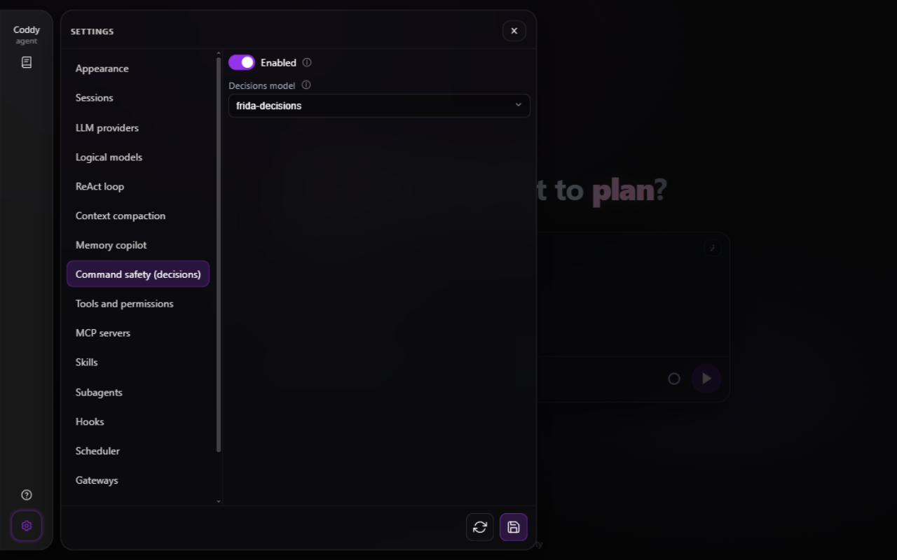

# Безопасность команд (decisions)

Режим bypass, список разрешённых команд, грант "всегда разрешать" сессии и `allow`-хук - все они позволяют shell-команде выполниться без чьего-либо взгляда. Проверка decisions ставит второе мнение ровно перед такими вызовами: прежде чем команда выполнится, Coddy спрашивает decisions-эндпоинт NeuralDeep - тот же ключ `sk-`, что у остального хаба, отдельная квота `POST /v1/decisions` - безопасно ли запускать команду без человека, и команда, чья вероятность небезопасности достигает настроенного порога, не выполняется. Отказ возвращается как результат `run_command` - `command rejected as unsafe: the decisions model frida-decisions put the unsafe option at 0.99, at or above the threshold 0.50; ask the operator or use a safer alternative` - поэтому транскрипт сессии его фиксирует, карточка вызова в веб-интерфейсе показывает её отменённой, а модель читает отказ и может выбрать другой путь.

Проверка по умолчанию выключена. Включите её в Settings → **Command safety (decisions)** или в `config.yaml`:

```yaml
decisions:
  enable: true
  model: frida-decisions   # или clef-flash
  threshold: 0.5           # отклонять, когда p(unsafe) достигает этого значения
```

## Когда выполняется проверка

Ровно те вызовы, которые никто из людей не собирается подтверждать:

- `run_command` в режиме разрешений **bypass**;
- команду, которую `tools.command_allowlist` или грант сессии одобряет автоматически в режимах `ask` / `accept_edits`;
- вызов, который хук `PreToolUse` пропустил мимо запроса разрешения.

Команда, которую оператор одобрил в запросе разрешения, **повторно не проверяется** - человек в контуре сильнее любого вердикта, и в свежем вызове, и при возобновлении уже отвеченного запроса. Команды переднего плана и фоновые (`background: true`) проверяются до старта процесса, а дочерние субагенты работают под тем же гейтом с унаследованной конфигурацией.

## Вопрос и вердикт

Состояние, уходящее на эндпоинт, - текст команды плюс каталог, в котором она выполнилась бы; вопрос - один `choice` с двумя описанными опциями: `safe` (обычная команда разработки: читает, собирает, тестирует, ставит зависимости, меняет только пересоздаваемые файлы проекта) и `unsafe` (широкое или принудительное удаление, стирание дисков, сброс баз, force-push, скачивание сразу в оболочку, - всё необратимое за пределами проекта). Эндпоинт отвечает выбранной опцией и вероятностями каждой; Coddy отклоняет команду, когда вероятность `unsafe` достигает `decisions.threshold` (по умолчанию `0.5` - точка, где опции меняются местами), и выполняет её ниже порога - порог это регулятор оператора, а не выбор эндпоинта, поэтому ответ, выбравший unsafe при `0.7`, всё же выполнится с порогом `0.9`, а пограничные `0.6` будут отклонены при значении по умолчанию. Голый ответ без вероятностей считается уверенным. `rm -rf /` набирает около p(unsafe)=0.99 на обеих моделях; простой `echo` или `go test ./...` классифицируются как безопасные.

## Модель

`decisions.model` выбирает между двумя моделями, которые обслуживает эндпоинт:

| Модель | Бюджет состояния | Типичная задержка | Единиц квоты за запрос |
|---|---|---|---|
| `frida-decisions` (по умолчанию) | 512 токенов текста команды | ~20 мс | 1 |
| `clef-flash` | 8192 токенов | ~150 мс | 4 |

`frida-decisions` - проход энкодера без генерации, поэтому он и по умолчанию, и самый дешёвый; `clef-flash` - большая генеративная модель для команд с длинным контекстом. Проверка расходует корзину квоты decisions, отдельную от класса чата, - баланс выдаёт `GET /v1/decisions/quota` хаба.

## Учётные данные

Проверка разрешает учётные данные точно так же, как chat-запросы через провайдера neuraldeep: явный `providers[].api_key` (или `api_key_command`) в первой строке `neuraldeep`, затем переменная окружения `NEURALDEEP_API_KEY`, затем сохранённый вход в хаб (`coddy providers login neuraldeep`); `api_base` выбирает развёртывание (`.ru` или `.tech`), а `providers[].proxy` применяется. Машина без строки провайдера тоже работает: достаточно переменной окружения или сохранённого входа под именем по умолчанию.

## Когда эндпоинт не может ответить

Включённая страховка не должна отказывать молча:

- **нет учётных данных, отвергнутый ключ (401/403), неразборчивый ответ** - команда не выполняется, с причиной и решением в результате: добавить учётные данные или выключить `decisions.enable`;
- **лимит частоты (429) и временные сбои (сеть, тайм-аут, 5xx)** - вызов повторяется в двухминутном окне с учётом `Retry-After` эндпоинта; исчерпанное окно тоже останавливает команду, с последней ошибкой в результате.

Ход, отменённый во время ожидания, завершает и ожидание, и команду.

## Тестирование

Офлайн-сьюты подменяют эндпоинт: `internal/llm/decisions_test.go` закрепляет форму запроса, формы ответов и виды ошибок на `httptest`-сервере, а `internal/agent/decisions_test.go` и `features/decisions_check.feature` проверяют сам гейт - отказ, пути отказа-по-недоступности, окно повторов и пути, которые проверка трогать не должна. Две живые пробы ходят на реальный эндпоинт, обе пропускаются без `NEURALDEEP_API_KEY`: транспортная `internal/llm/decisions_live_test.go` (`rm -rf /` небезопасен, `echo` безопасен, обе модели) и сквозная `internal/agent/decisions_live_e2e_test.go` - полный ход в режиме bypass, скриптованная модель запрашивает `rm -rf /` и `echo`: деструктивный вызов возвращается в транскрипт отклонённым, echo выполняется:

```
NEURALDEEP_API_KEY=... go test ./internal/agent -run TestLiveDecisionsE2E -count=1 -v
```



*Settings → Command safety (decisions): переключатель включения и выбор модели*

<!-- docsgen:source sha256=810fa1fce8ede358 -->
