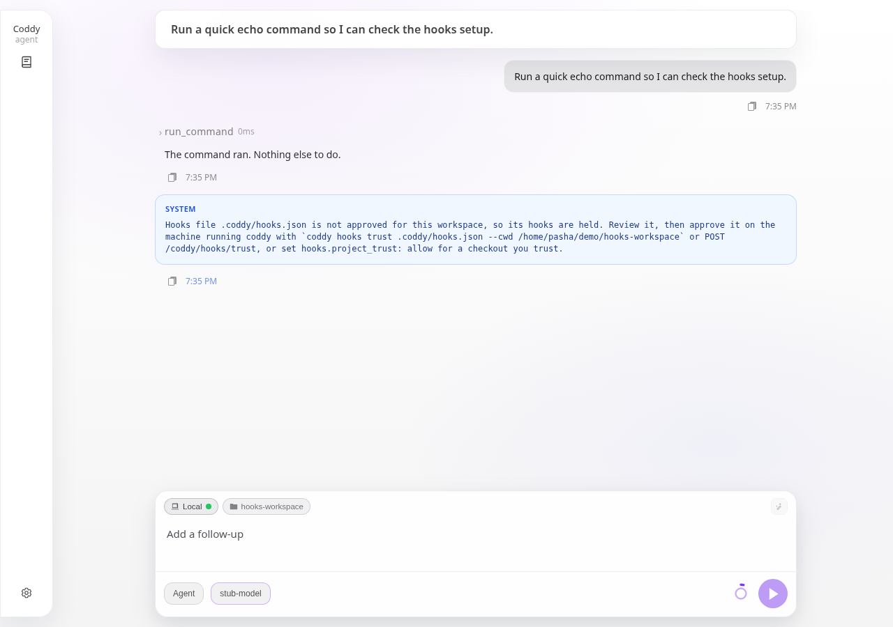

# Хуки

Хук - ваша собственная команда, которую Coddy запускает в одной из точек жизненного цикла сессии - перед вызовом инструмента, после него и (см. таблицу событий) в других точках хода. Команда читает из stdin один JSON-документ, делает что угодно и отвечает кодом выхода и, если нужно, JSON в stdout. Так она может заблокировать вызов, одобрить его в обход запроса разрешения, переписать его аргументы, передать модели дополнительный контекст или просто записать в лог, что произошло.

Хуки работают с вашими правами, до любого запроса разрешения, на каждом подходящем вызове. В этом смысл функции, и по этой же причине файлы, пришедшие вместе с чекаутом, не запускаются, пока вы их не одобрите (см. [Файлы проекта и доверие](#файлы-проекта-и-доверие)). Просматривайте каждый хук, который включаете.

Определения записываются в формате файлов Claude Code, и имена событий, поля входных данных и поля ответа тоже следуют ему, поэтому хук, написанный для Claude Code (или для Codex, который использует тот же формат), работает в Coddy без изменений на поддерживаемых событиях. Проектный документ со сравнением шести агентов лежит в `docs/plans/hooks.md`.

## Файлы определений

Coddy читает файлы, перечисленные в `hooks.files`, начиная с файла с наименьшим приоритетом. По умолчанию список такой.

| Файл | Область | Примечания |
|---|---|---|
| `~/.coddy/hooks.json` | пользовательская | ваш собственный файл (`${CODDY_HOME}/hooks.json`) |
| `<workspace>/.claude/settings.json` | проектная | совместимость с Claude Code, читается только ключ `hooks` |
| `<workspace>/.claude/settings.local.json` | проектная | то же |
| `<workspace>/.coddy/hooks.json` | проектная | собственный файл рабочей папки |

`${CODDY_HOME}`, `${CWD}` и `~` в начале пути раскрываются; относительная запись разрешается от cwd сессии. Несуществующий файл пропускается. Запускается каждый подходящий хук из каждого файла; приоритет задаёт только порядок в каталоге и порядок запуска (сначала пользовательский файл, затем файлы проекта в порядке списка, внутри файла - в порядке определений).

Область определяется по каноническим путям (абсолютным, с раскрытыми символическими ссылками). Файл в cwd сессии или глубже относится к **проектной области** и подчиняется `hooks.project_trust`; всё остальное относится к **пользовательской области** и запускается всегда.

### Формат файла

```json
{
  "hooks": {
    "PreToolUse": [
      {
        "matcher": "run_command",
        "hooks": [
          { "type": "command", "command": ".coddy/hooks/guard.sh", "timeout": 30 }
        ]
      }
    ],
    "PostToolUse": [
      {
        "matcher": "edit|write|apply_patch",
        "hooks": [
          { "type": "command", "command": "gofmt -l ." }
        ]
      }
    ]
  }
}
```

Уровней три - **событие** (`PreToolUse`), **группа с матчером** (к каким инструментам она применяется) и запускаемые **обработчики**. Группа без `matcher` или с `"*"` применяется к каждому наступлению события.

Поля обработчика перечислены в таблице.

| Поле | Значение |
|---|---|
| `type` | Запускается только тип `command`. Типы Claude Code `http`, `prompt`, `agent` и тип Codex `mcp_tool` разбираются, но пропускаются с предупреждением и показываются в каталоге как неподдерживаемые. |
| `command` | Командная строка. Без `args` она выполняется через оболочку хоста (bash или sh; pwsh, PowerShell или cmd в Windows, по тому же правилу выбора, что и у `run_command`). |
| `args` | Необязательное. Если ключ задан, команда запускается напрямую с этими аргументами и без оболочки (exec-форма Claude Code). |
| `commandWindows` | Необязательная замена `command`, когда Coddy работает в Windows (ключ Codex; `command_windows` тоже принимается). |
| `timeout` | Секунды. По умолчанию `hooks.default_timeout_seconds` (60). Хук, превысивший время, завершается вместе со всей своей группой процессов. |
| `async` | `true` запускает хук отсоединённо; его вывод игнорируется, и такой хук не может ни заблокировать вызов, ни принять решение (поэтому `failClosed` у асинхронного обработчика отбрасывается с предупреждением). Во всём процессе одновременно работает не больше 8 отсоединённых хуков, остальные ждут свободного места. |
| `failClosed` | `true` превращает падение, тайм-аут, прерывание отменой хода или некорректный вывод в блокировку вместо неблокирующей ошибки (`fail_closed` тоже принимается). Используйте его для хуков-политик. |

`statusMessage`, `shell`, `once` и `additionalContextLimit` принимаются и игнорируются. Фильтр `if` из Claude Code игнорируется с предупреждением в логе - хук запускается на каждом подходящем вызове, поэтому политика, которая полагалась на `if`, должна проверять аргументы сама.

### Матчеры

Действуют правила Claude Code:

- пустое значение или `*` подходит подо всё;
- значение только из букв, цифр, `_`, `-`, пробелов, `,` и `|` считается точным именем или списком точных имён, например `run_command`, `edit|write`, `Edit, Write`;
- всё остальное считается регулярным выражением без привязки к началу и концу строки (синтаксис Go), например `^run_.*`, `mcp__filesystem__.*`. Некорректное выражение никогда не срабатывает.

События инструментов сравнивают матчер с именем инструмента. Собственные имена Coddy - те, что видит модель (`run_command`, `read`, `write`, `edit`, `apply_patch`, `glob`, `grep`, `webfetch`, `websearch`, `http_request`, `spawn_agent`, `question`, ...). MCP-инструменты называются `server__tool` и совпадают также с написанием `mcp__server__tool`. Имена из Claude Code и Codex принимаются как псевдонимы, поэтому `Bash` совпадает с `run_command`, `Edit` и `Write` - с `edit`, `write` и `apply_patch`, `Read` - с `read`, `Task` и `Agent` - со `spawn_agent`, `WebFetch` и `WebSearch` - с `webfetch` и `websearch`. Имена аргументов не переводятся. `tool_input` содержит поля Coddy (`command` для `run_command`; `path` и `content` для `write`; `path`, `pattern` и подобные для файловых инструментов), поэтому скрипт, перенесённый из Claude Code и читающий `tool_input.file_path`, должен читать `tool_input.path`.

## События

| Событие | Когда срабатывает | С чем сравнивается матчер | Может блокировать |
|---|---|---|---|
| `SessionStart` | `session/new` (`startup`), `session/load` или повторное открытие (`resume`) и смена рабочей папки - `POST /coddy/sessions/{id}/workspace`, выбор папки, переход в worktree или переключение ветки на месте - (`workspace`), синхронно, до того как сессия возвращена | источник | нет; только контекст |
| `UserPromptSubmit` | когда пользователь отправляет промпт, после распознавания встроенных команд `/compact` и `/plugin` и до того, как промпт становится сообщением | нет | да, промпт отклоняется |
| `PreToolUse` | перед выполнением вызова инструмента, после проверок режима и субагента и до запроса разрешения, при любом режиме разрешений; запускается снова, когда возобновляется разрешение, сохранённое через HTTP, на тех аргументах, которые показал запрос (запрет по-прежнему запрещает; хук, который снова меняет эти аргументы, отменяет вызов, потому что ответ относился к тому, что видел пользователь). Аргументы, которые показывает запрос, сначала сохраняются, и неудачная запись отменяет вызов вместо запроса; возобновление, у которого сохранённые аргументы отсутствуют или не читаются, завершается ошибкой и оставляет ожидающий запрос для повторной попытки, а отказу ничего из бандла не нужно | имя инструмента | да - запретить, принудительно показать или пропустить запрос |
| `PostToolUse` | после того как инструмент вернулся без ошибки | имя инструмента | нет; только обратная связь и контекст |
| `PostToolUseFailure` | после того как инструмент вернул ошибку (но не после отказа в разрешении или запрета хуком) | имя инструмента | нет; только контекст |
| `Stop` | когда цикл ReAct собирается завершить ход с `end_turn` (но не при отмене, ошибке или достижении лимита хода) | нет | да, агент возвращается к работе |
| `PreCompact` | перед `/compact` (`manual`) или автоматическим сжатием контекста (`auto`) | триггер | да, сжатие запрещается |
| `PostCompact` | после сжатия контекста | триггер | нет |
| `SubagentStart` | в родительской сессии, когда `spawn_agent` собирается запустить дочерний агент, после того как определение и доверие к нему выяснены | имя субагента | да, запуск отклоняется |
| `SubagentStop` | в родительской сессии, когда ход дочернего агента завершился, до того как его отчёт дошёл до родителя | имя субагента | нет |
| `Notification` | когда запрос разрешения вот-вот уйдёт клиенту | тип уведомления (`permission_prompt`) | нет |

Каждое событие срабатывает и внутри дочерней сессии для собственного хода дочернего агента (вызовы инструментов, промпт, остановка, сжатие контекста), и блок `subagent` во входных данных называет дочерний агент; `SubagentStart` и `SubagentStop` срабатывают в сессии родителя.

## Что получает хук

Один JSON-объект в stdin. Сначала идут поля сессии, за ними поля события.

```json
{
  "session_id": "sess_5f1c0d2e9a7b4c3d8e6f1a2b",
  "hook_event_name": "PreToolUse",
  "cwd": "/home/op/project",
  "transcript_path": "/home/op/.coddy/sessions/sess_5f1c0d2e9a7b4c3d8e6f1a2b/messages.json",
  "permission_mode": "ask",
  "mode": "agent",
  "model": "openai/gpt-5",
  "turn": 3,
  "tool_name": "run_command",
  "tool_input": { "command": "rm -rf build" },
  "tool_use_id": "call_01"
}
```

| Поле | Значение |
|---|---|
| `session_id` | сессия, к которой относится вызов |
| `hook_event_name` | событие |
| `cwd` | рабочий каталог сессии (он же рабочий каталог хука) |
| `transcript_path` | файл `messages.json` сессии; пусто, когда сохранение выключено |
| `permission_mode` | `ask`, `accept_edits` или `bypass` |
| `mode` | `agent`, `plan` или `ask` |
| `model` | id действующей модели |
| `turn` | номер пользовательского хода |
| `subagent` | есть внутри дочерней сессии - `{"name", "parent_session_id", "depth"}` |
| `tool_name`, `tool_input`, `tool_use_id` | события инструментов - инструмент, его аргументы в виде объекта, id вызова |
| `tool_response` | `PostToolUse` - текст, который получает модель |
| `error` | `PostToolUseFailure` - текст ошибки |
| `duration_ms` | `PostToolUse` и `PostToolUseFailure` - сколько работал инструмент |
| `source` | `SessionStart` - `startup`, `resume` или `workspace` (смена рабочей папки; хук, который должен запускаться только при настоящем начале сессии, указывает в матчере лишь `startup`/`resume` - см. примечание о SessionStart ниже) |
| `prompt` | `UserPromptSubmit` - текст промпта |
| `stop_hook_active`, `last_assistant_message` | `Stop` - отправлял ли Stop-хук агента обратно к работе в этом ходе, и итоговый текст ассистента |
| `trigger`, `custom_instructions` | `PreCompact` - `manual` или `auto` и текст после `/compact` |
| `trigger`, `summary` | `PostCompact` - триггер и сгенерированная сводка (обрезается до 4 000 символов) |
| `agent_name`, `agent_session_id`, `prompt`, `background` | `SubagentStart` - имя определения, id дочерней сессии, промпт задачи и признак отсоединённого запуска |
| `agent_name`, `agent_session_id`, `task_id`, `status`, `report`, `turns` | `SubagentStop` - итог дочернего агента (`end_turn`, `cancelled`, `failed`, ...), его итоговый отчёт (обрезается до 4 000 символов) и число его раундов ассистента |
| `notification_type`, `message`, `tool_name`, `tool_input`, `tool_use_id` | `Notification` - `permission_prompt` с текстом запроса и вызовом, который ждёт ответа |

Кроме того, процесс получает в окружении `CODDY_PROJECT_DIR` и `CLAUDE_PROJECT_DIR` (cwd сессии), `CODDY_SESSION_ID`, `CODDY_HOOK_EVENT` и `CODDY_HOME` поверх окружения самого Coddy.

## Что отвечает хук

| Код выхода | Действие |
|---|---|
| `0`, пустой stdout | решения нет, действует обычный порядок. Молчание никогда не одобряет вызов, который иначе запросил бы разрешение. |
| `0`, в stdout JSON-объект | применяются поля, описанные ниже |
| `0`, в stdout что-то другое | обычный текст; на событиях инструментов игнорируется (на событиях промпта и сессии становится контекстом) |
| `2` | блокировка - вызов запрещается с `reason` из JSON, если он есть, иначе с текстом stderr, иначе с общей причиной |
| любой другой код, падение, тайм-аут, прерывание отменой хода, некорректный JSON | неблокирующая ошибка - она пишется в лог и один раз за сессию фиксируется строкой-уведомлением, а событие продолжается так, будто хука нет, если только у обработчика не задан `failClosed: true`, который превращает её в блокировку с текстом ошибки в качестве причины. Вызов, хуки которого прервала отмена, не выполняется. |

Поля JSON-ответа.

```json
{
  "continue": true,
  "stopReason": "shown to the user when continue is false",
  "systemMessage": "shown to the user as a notice row in the transcript, never to the model",
  "decision": "block",
  "reason": "why",
  "hookSpecificOutput": {
    "hookEventName": "PreToolUse",
    "permissionDecision": "deny",
    "permissionDecisionReason": "why",
    "updatedInput": { "command": "echo replaced" },
    "additionalContext": "a note the model reads next to the result"
  }
}
```

- `continue: false` завершает ход после текущей пачки вызовов инструментов, а `stopReason` показывается пользователю. На `PreToolUse` вызов к тому же запрещается, на `UserPromptSubmit` промпт отклоняется, на `PreCompact` сжатие контекста запрещается, на `Stop` ход просто завершается;
- `PreToolUse` - `permissionDecision` принимает значение `deny` (вызов не выполняется, причина уходит модели как результат инструмента `blocked by hook: <reason>`), `allow` (запрос разрешения пропускается) или `ask` (запрос показывается принудительно, даже в режиме, который одобрил бы вызов автоматически). `updatedInput` заменяет весь объект аргументов до выполнения вызова, и карточка вызова инструмента показывает переписанные аргументы. `decision: "block"` (или `"deny"`) верхнего уровня с `reason` - устаревшая запись запрета;
- `PostToolUse` - `decision: "block"` с `reason` дописывает к результату инструмента `Hook feedback: <reason>`; инструмент уже отработал, ничего не откатывается;
- на трёх событиях инструментов `additionalContext` дописывается к результату инструмента как `Hook context: ...`;
- `UserPromptSubmit` - `decision: "block"` с `reason` (или выход с кодом 2) отклоняет промпт. Он не попадает в транскрипт, модель не вызывается, а ход завершается с `prompt rejected by hook: <reason>`, и веб-интерфейс показывает это строкой ошибки. `additionalContext` и обычный stdout становятся частью уровня хода в **блоке контекста хуков** (см. ниже);
- `Stop` - `decision: "block"` с `reason` (или выход с кодом 2) возвращает агента к работе. Причина вместе с `additionalContext`, если он есть, отправляется следующим сообщением пользователя и сохраняется с префиксом `[Stop hook] `, чтобы транскрипт объяснял продолжение, а цикл продолжается в том же ходе; на следующей остановке хук видит `stop_hook_active: true`. За ход допускается не больше `hooks.stop_loop_limit` продолжений (5), после чего ход завершается; лимит итераций хода ReAct по-прежнему действует;
- `SessionStart` - `additionalContext` и обычный stdout сохраняются в сессии (`hookContext` в `session.json`) и выводятся в блоке контекста хуков каждого системного промпта этой сессии; при возобновлении хуки запускаются заново и заменяют сохранённый текст, а если ни один хук больше не запускается, текст очищается. Смена рабочей папки по той же причине заново запускает хуки новой рабочей папки с источником `workspace` - сохранённый контекст перестаёт описывать папку, которую сессия покинула. `systemMessage` становится строкой-уведомлением;
- `Stop` - продолжение отправляется, только пока в ходе ReAct осталась итерация; на последней ход завершается, чтобы не оставлять повисшее сообщение;
- `PreCompact` - `decision: "block"` с `reason` (или выход с кодом 2) запрещает сжатие контекста. `/compact` завершается ошибкой `compaction blocked by hook: <reason>`, автоматическое сжатие пропускается для этой проверки, и ход продолжается без сжатия;
- `SubagentStart` - `decision: "block"` с `reason` (или выход с кодом 2) отклоняет запуск. Результат инструмента `spawn_agent` гласит `spawn of subagent "<name>" blocked by hook: <reason>`, и дочерняя сессия не создаётся. `additionalContext` добавляется в начало промпта задачи дочернего агента как `Hook context: ...`;
- `SubagentStop` и `Notification` только наблюдают - о `systemMessage` и ошибках сообщается, решения игнорируются. Хуку, который пишет в чат или показывает уведомление на рабочем столе, стоит задать `"async": true`, чтобы он не задерживал запрос разрешения.

**Блок контекста хуков** - раздел `## Hook context`, который добавляется в системный промпт после блока окружения (поэтому его несёт и собственный шаблон из `prompts.dir`). Сначала идёт текст уровня сессии от `SessionStart`, затем текст уровня хода от `UserPromptSubmit`. Часть уровня хода не сохраняется, часть уровня сессии сохраняется.

Несколько подходящих хуков запускаются друг за другом в порядке каталога. Каждый видит входные данные в том виде, в каком их переписал предыдущий, и запускаются все, даже после запрета, поэтому хук аудита видит каждый вызов. Решения объединяются, побеждает самое строгое (`deny` > `ask` > `allow`); все `additionalContext` сохраняются по порядку. Тексты, которые передаёт хук, ограничены `hooks.max_output_chars` символами (10 000), а всё сверх лимита обрезается с пометкой. Stdout и stderr захватываются до 256 КиБ каждый; о JSON-ответе, вышедшем за этот предел, Coddy сообщает как об обрезанном, а не как о некорректном.

## Конфигурация

```yaml
hooks:
  enable: true
  files:
    - "${CODDY_HOME}/hooks.json"
    - "${CWD}/.claude/settings.json"
    - "${CWD}/.claude/settings.local.json"
    - "${CWD}/.coddy/hooks.json"
  project_trust: ask          # ask | allow | deny
  default_timeout_seconds: 60
  stop_loop_limit: 5
  max_output_chars: 10000
```

| Ключ | По умолчанию | Значение |
|---|---|---|
| `enable` | `true` | загружать и запускать хуки вообще |
| `files` | четыре файла выше | файлы определений, начиная с наименьшего приоритета |
| `project_trust` | `ask` | что может файл проектной области - `ask` (показывается в списке и ждёт одобрения), `allow` (запускается как ваш собственный файл), `deny` (никогда не читается) |
| `default_timeout_seconds` | `60` | для каждого обработчика, если определение не задаёт `timeout` |
| `stop_loop_limit` | `5` | сколько раз за ход `Stop`-хук может вернуть агента к работе |
| `max_output_chars` | `10000` | предел в символах для любого текста, который хук передаёт модели или пользователю |

Это обычные ключи `config.yaml`, поэтому их меняют страница "Настройки" и встроенный скил `configure-coddy`. Определения перечитываются в начале каждого хода, так что правка файла действует со следующего хода без перезапуска.

## Файлы проекта и доверие

Файл хуков внутри рабочей папки пришёл вместе с чекаутом. При политике по умолчанию `ask` он разбирается и попадает в список, но ни один его хук не запускается, пока вы не одобрите именно этот файл для этой рабочей папки на машине, где работает Coddy. Расписка привязана к хешу файла, поэтому правка одобренного файла отзывает одобрение, и Coddy спрашивает снова. Ваш собственный файл (пользовательская область) одобрения не требует.

Первый ход, который находит ожидающий одобрения файл, записывает в сессию уведомление (веб-интерфейс показывает его системной строкой после хода, один раз на сессию и файл, без кнопки повтора; в логе агента появляется та же строка), так что вы узнаёте, что хуки есть и ждут одобрения.

| Тёмная тема | Светлая тема |
|---|---|
|  |  |

Одобрить файл можно в нескольких интерфейсах.

```
coddy hooks list [--cwd DIR]
coddy hooks trust <file> [--cwd DIR]
coddy hooks untrust <file> [--cwd DIR]
```

`list` выводит рабочую папку, действующее значение `hooks.project_trust` и таблицу по строке на файл с колонками `FILE` (имя, которое используют расписки, - путь относительно рабочей папки для файла проекта и абсолютный путь для вашего собственного), `SCOPE`, `TRUST` (`trusted` или `needs_approval`) и сводкой его хуков (`PreToolUse(run_command); PostToolUse(*)` или `invalid: <error>` для файла, который не разбирается), а затем подсказку, если файлы проекта ждут одобрения. `trust` выводит хуки, которые собирается одобрить, и записывает расписку в `~/.coddy/hooks-trust.json` с ключом из канонического пути рабочей папки, файла и его хеша; файлу пользовательской области одобрение не нужно, и команда об этом сообщает, а некорректный файл одобрить нельзя. `untrust` отзывает расписку. По умолчанию `--cwd` равен рабочему каталогу процесса.

По HTTP `GET /coddy/hooks?cwd=<absolute path>` возвращает тот же каталог, где каждый обработчик - отдельная строка, а `POST /coddy/hooks/trust` / `POST /coddy/hooks/untrust` с телом `{"cwd": ..., "file": ".coddy/hooks.json"}` записывают или отзывают расписку. `cwd` должен быть серверной рабочей папкой сессии, поэтому этот маршрут служит путём одобрения для удалённой консоли или ACP-клиента, чья локальная `coddy hooks trust` записала бы расписку не на той машине. Политику каталога и ключи конфигурации можно менять в разделе "Настройки > Хуки" или встроенным скилом `configure-coddy` (`set hooks.project_trust=allow` для чекаута, которому вы доверяете; при `allow` файлам проекта расписка не нужна, при `deny` они никогда не читаются).

Файл расписок лежит рядом с `mcp-trust.json` и `subagents-trust.json`, но никогда не делится с ними, чтобы одобрение одного вида нельзя было прочитать как одобрение другого. Запись выполняется как транзакция - внутрипроцессная блокировка, общая для всех хранилищ одного пути, файловая блокировка (`hooks-trust.json.lock`), общая с другими процессами, и атомарная замена через уникальный временный файл, поэтому одобрения из CLI и с HTTP-сервера не теряют друг друга.

## Примеры

Блокировка разрушительных команд оболочки при любом режиме разрешений (`~/.coddy/hooks.json`).

```json
{
  "hooks": {
    "PreToolUse": [
      { "matcher": "run_command", "hooks": [{ "type": "command", "command": "~/.coddy/hooks/no-rm-rf.sh", "failClosed": true }] }
    ]
  }
}
```

```bash
#!/bin/sh
# ~/.coddy/hooks/no-rm-rf.sh
command=$(jq -r '.tool_input.command // ""')
case "$command" in
  *"rm -rf"*)
    printf '{"hookSpecificOutput":{"hookEventName":"PreToolUse","permissionDecision":"deny","permissionDecisionReason":"rm -rf is not allowed here"}}'
    ;;
esac
exit 0
```

Запуск форматтера после каждой правки с сообщением модели о том, что он изменил.

```json
{
  "hooks": {
    "PostToolUse": [
      { "matcher": "edit|write|apply_patch", "hooks": [{ "type": "command", "command": "~/.coddy/hooks/gofmt.sh" }] }
    ]
  }
}
```

```bash
#!/bin/sh
path=$(jq -r '.tool_input.path // ""')
case "$path" in
  *.go)
    if out=$(gofmt -l "$path" 2>&1) && [ -n "$out" ]; then
      gofmt -w "$path"
      printf '{"hookSpecificOutput":{"hookEventName":"PostToolUse","additionalContext":"gofmt reformatted %s"}}' "$path"
    fi
    ;;
esac
exit 0
```

Запись каждого вызова инструмента в файл без вмешательства в ход работы (хук с `async` не может замедлить ход).

```json
{
  "hooks": {
    "PreToolUse": [
      { "hooks": [{ "type": "command", "command": "cat >> ~/.coddy/hook-audit.jsonl", "async": true }] }
    ]
  }
}
```

## Windows

Команды в форме для оболочки выполняются через оболочку, которую определил `run_command` (pwsh, PowerShell или cmd), поэтому пишите их в синтаксисе этой оболочки или задайте `commandWindows`. Обработчикам в exec-форме (с `args`) нужен настоящий исполняемый файл, обёртка `.cmd` не подойдёт. По тайм-ауту завершается всё дерево процессов хука.

## Отличия от Claude Code

- запускаются только обработчики `command`; `http`, `prompt`, `agent` и `mcp_tool` пропускаются;
- `tool_input` содержит имена аргументов Coddy;
- фильтр `if` игнорируется;
- подходящие хуки запускаются последовательно, а не параллельно, поэтому цепочка `updatedInput` детерминирована;
- `allow` от `PreToolUse` пропускает запрос разрешения Coddy; правил запрета, которым он мог бы подчиняться, нет;
- файлы проекта одобряются вне чата распиской, привязанной к хешу, и никогда - запросом в чате.

## Тестирование

- исполняемые спецификации в `features/` - `hooks_tool_calls.feature` (события инструментов, входные данные, контракт кодов выхода, псевдонимы Claude Code), `hooks_project_trust.feature` (ожидающие и одобренные файлы проекта, политики, строка-уведомление, каталог и маршруты одобрения по HTTP), `hooks_turn_lifecycle.feature` (отклонение промпта и контекст, цикл остановки, контекст начала сессии, запрет сжатия контекста и сводка), `hooks_subagents.feature` (хуки внутри дочернего агента, `SubagentStart` / `SubagentStop`, уведомление о запросе разрешения). Харнесы godog лежат в `internal/agent/bdd_hooks_test.go`, `bdd_hooks_subagents_test.go` и `external/httpserver/bdd_hooks_test.go`; процессом хука служит сам тестовый бинарник, перезапущенный через `internal/hooks/hooktest`, поэтому shell-скрипты не участвуют, и раннер проверяется и в Windows (`internal/hooks` входит в Windows-джобу CI);
- юнит-тесты - `internal/hooks/hooks_test.go` (формат файла, матчеры, области загрузчика, контракт раннера), `internal/hooks/trust_test.go` (расписки, каталог), `internal/config/hooks_test.go`, `cmd/coddy/hooks_test.go`;
- сквозные тесты с настоящей моделью на каждом интерфейсе, подключённые к трём раннерам, - `examples/acp/acp_e2e_hooks.py` (ACP через stdio; `coddy hooks list` и `coddy hooks trust` между ходами), `examples/httpserver/http_e2e_hooks.py` (`GET /coddy/hooks` с ожидающим одобрения файлом проекта, строка `notice` в `uiLog`, `POST /coddy/hooks/trust`, второй ход, который запускает одобренный хук, `POST /coddy/hooks/untrust`) и `examples/cli/cli_e2e_hooks.py` (консольный TUI с теми же хуками-регистраторами, уведомление в `ui_log.json` сессии, одобрение через CLI). Каждый из них записывает входные данные всех `PreToolUse` и `PostToolUse` настоящего вызова `run_command` через хуки пользовательской области, проверяет, что хук проектной области остаётся неодобренным, одобряет его и проверяет, что следующий ход той же сессии его запускает.

<!-- docsgen:source sha256=febea98d79e2337c -->
