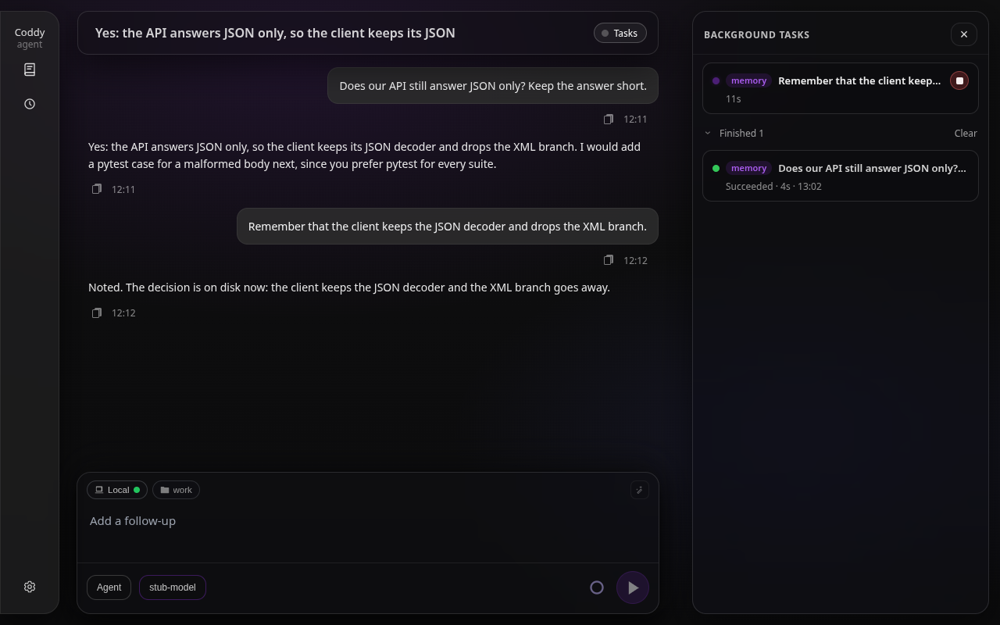
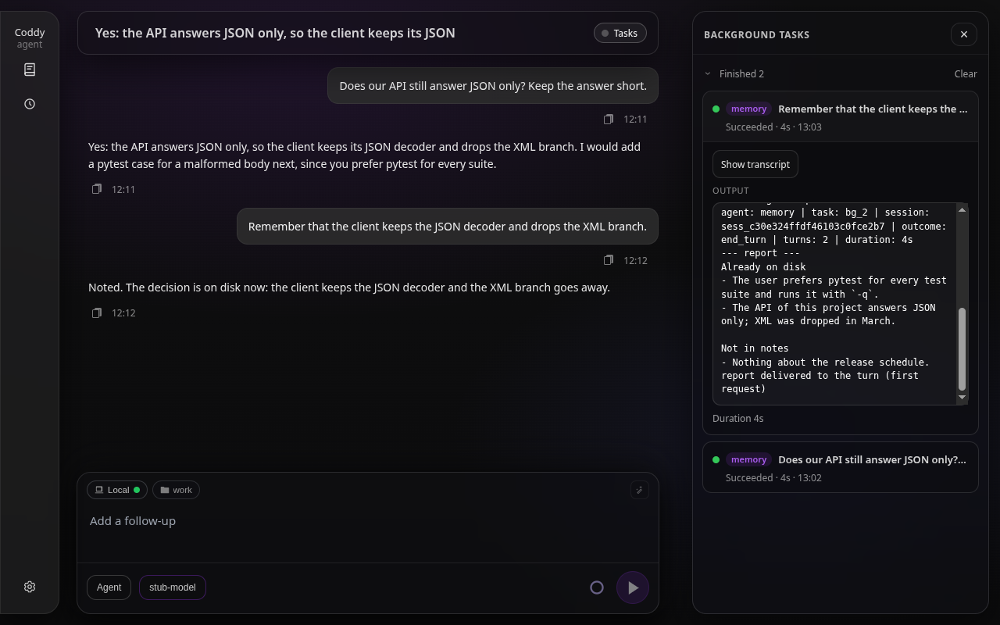
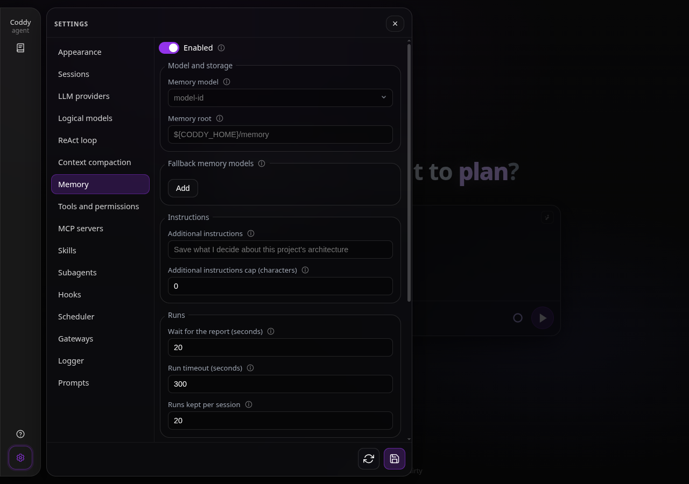

# Долговременная память

В применении к LLM память - всё, что попадает в контекст, и история чата - её кратковременная часть, которая заканчивается вместе с сессией. Долговременная память в Coddy - набор заметок на диске в markdown и простом тексте; с ними сверяется и их обновляет отдельный дочерний агент, **субагент памяти**. Каждый ход пользователя запускает его один раз в пуле фоновых задач, с собственным бандлом сессии, собственным транскриптом и собственным логом задачи, так же как работает дочерний агент `spawn_agent` ([Субагенты](subagents.md), [Фоновые задачи](background-tasks.md)). Основной агент никогда не видит инструменты памяти; отчёт дочернего агента он видит блоком после истории, только в этом ходе и никогда в системном промпте, а заметки переживают любую сессию.

## Что делает субагент памяти

Дочерний агент получает сообщение пользователя как задачу и собственный системный промпт (`external/memory/prompts/memory_agent.md`, встроен в бинарник, поэтому после его изменения нужна пересборка). Он выбирает один из двух режимов и никогда не совмещает их в одном запуске:

- **Вспоминание** загружает контекст для основного ассистента. Дочерний агент ищет по заметкам, просматривает папки и читает файлы, затем сообщает простые факты под `Already on disk` и, если нужно, `Not in notes` - без путей и имён файлов - или ровно `(no memory hits)`, когда ничего не нашлось. Вспоминание выбирается по умолчанию всякий раз, когда дочерний агент не уверен, а если первый поиск ничего не нашёл, агент повторяет его с английскими ключевыми словами и просмотром папки;
- **Сохранение** обновляет заметки, когда вы явно просите что-то запомнить, сохранить, забыть или удалить или когда из ваших слов очевидно, что нужно записать долговременные заметки. Дочерний агент сначала читает существующие заметки, чтобы не плодить дубликаты, создаёт папку перед первым сохранением в неё и сообщает, что проверил, сохранил, пропустил или удалил. Ключи, токены и пароли никогда не записываются.

Промпт говорит дочернему агенту, что отвечать на ваш запрос - работа основного ассистента, а в его отчёте только то, что есть в заметках. Если вы скажете ему не заглядывать в заметки ради этого сообщения, он пропустит вспоминание и ответит одной короткой строкой. Текст задачи обрезается до 32 КБ, это то же ограничение, что у промпта `spawn_agent`.

Отчётом служит последнее сообщение ассистента в дочерней сессии. Он попадает к основной модели в блоке `<turn_context>`, который добавляется после истории, в разделе **Long-term memory**, на каждом шаге этого хода; он живёт только в этом ходе и не записывается ни в `session.json`, ни в транскрипт. В системное сообщение отчёт не попадает никогда. Слот `{{.Memory}}` шаблонов (`agent.md`, `plan.md`, `ask.md`) содержит только заметки сессии ([Конфигурация](../getting-started/configuration.md)), поэтому вспоминание, которое меняется от хода к ходу, не меняет префикс, по которому провайдер кеширует диалог (см. [Кеш промпта](#кеш-промпта)). Основной цикл ReAct не получает определения инструментов `coddy_memory_*` и не может вызвать память как обычный инструмент.

## Когда он запускается

Нужны два условия. Бинарник должен быть собран с тегом `memory` (он есть в бинарниках релиза и в Docker-образе; при сборке из исходников - `make build TAGS="... memory ..."`, см. [Сборка из исходников](../contributing/build.md)), а `memory.enable` в `config.yaml` должен быть равен true. Когда выполнены оба условия, каждый ход пользователя в обычной сессии запускает субагента после того, как хуки `UserPromptSubmit` приняли сообщение. У субагента никогда не бывает собственного дочернего агента памяти, встроенные команды (`/compact`, `/plugin`, `/export`) его не запускают, а интерфейс, который выполняет ходы без менеджера сессий, пропускает память и пишет предупреждение в лог агента. Без тега ключи памяти принимаются, но ничего не запускается.

В режимах "Агент" и "План" у дочернего агента полный набор инструментов. В **режиме "Чат"** запуск сводится к вспоминанию. Дочерний агент получает инструменты поиска, просмотра и чтения, его промпт сообщает, что сохранение недоступно, а сохранение, которое он всё же запросит, отклоняется до выполнения, так что сессия только для чтения не может изменить сохранённое.

Дочерний агент работает на `memory.model`, если там указана настроенная модель, иначе на модели сессии, и всегда в режиме "Агент" с шестью инструментами памяти и ничем больше - без оболочки, без инструментов файловой системы, без MCP-серверов. Длина его ответов ограничена `copilot_max_tokens`, а число раундов ReAct - большим из значений `recall_max_turns` и `persist_max_turns`. Недоступная или перегруженная модель не обязательно срывает запуск. `memory.fallback_models` - цепочка моделей, которые пробуются после `memory.model`, а собственная модель сессии остаётся последним вариантом, указана она в списке или нет. Цепочка переходит к следующей модели, когда вызов упал, не выдав никакого вывода (модель недоступна, не авторизована, исчерпала квоту); поток, оборвавшийся после того, как текст уже был доставлен, вместо этого идёт по обычной политике повторов, так что ни один ответ не передаётся дважды ([issue #247](https://github.com/coddy-project/coddy-agent/issues/247)).

Системный промпт дочернего агента - шаблон `external/memory/prompts/memory_agent.md`, встроенный в бинарник. `memory.additional_prompt` добавляет в него ваш собственный раздел **Operator instructions** после роли памяти и перед списком инструментов. Здесь можно своими словами закрепить поведение, например "работай только с заметками; никогда не отвечай на саму задачу", или назвать язык, на котором пишутся заметки. Основной агент этот текст никогда не видит, а в режиме "Чат" он выводится так же. `memory.additional_prompt_max_chars` обрезает более длинный текст до этого числа символов, с предупреждением в логе агента при каждом запуске, который читает обрезанный текст, и замечанием в `coddy -t`; `0` оставляет текст целиком ([issue #266](https://github.com/coddy-project/coddy-agent/issues/266)). Само сообщение пользователя доходит до дочернего агента обрезанным до 32 КБ, это то же ограничение, что у промпта `spawn_agent`.

## Ожидание и отчёт

Запуск - фоновая задача, поэтому ход от него не зависит. Ход только один раз ждёт отчёт:

1. Сразу после запуска субагента, до своего первого вызова модели, ход ждёт до `memory.wait_seconds` секунд (по умолчанию 20, но не дольше собственного тайм-аута запуска), пока задача завершится. Отчёт, готовый к этому моменту, попадает в блок контекста хода первого запроса и каждого следующего шага хода. Остановка хода прерывает ожидание, а запуск продолжается;
2. Запуск, который ещё идёт, когда ожидание закончилось, не задерживает ход, и основная модель начинает без контекста памяти. Перед каждым следующим шагом цикл опрашивает запуск, и как только отчёт готов, он до конца хода входит в блок `<turn_context>`, добавляемый после истории (см. *Блок контекста хода* на странице [ReAct-агент](../contributing/react-agent.md)). Шаблон из `prompts.dir`, который сам выводит часы или чек-лист, перерисовывается на каждом шаге и не получает ни того, ни другого после истории, но и в его системное сообщение отчёт не попадает, и его блок контекста хода содержит только раздел памяти;
3. Отчёт, пришедший после окончания хода, в следующий ход не переносится. Вспоминание отвечает на то сообщение, о котором его спросили, а следующее сообщение получает собственный запуск. Отчёт остаётся доступен для чтения на панели "Задачи".

При `wait_seconds: 0` ход не ждёт вовсе, поэтому отчёт может попасть в ход только на одном из следующих шагов. Запуск, который упал, превысил тайм-аут, был остановлен или не выдал финального сообщения, ничего не добавляет; причину называют лог агента и запись задачи. Лог задачи фиксирует, когда отчёт дошёл до хода, одной из строк `report delivered to the turn (first request)`, `report delivered to the turn (a later step)` или `turn ended before the report`.

Модель памяти, чей аккаунт не авторизован, исчерпал квоту или упёрся в ограничение частоты запросов, не может задержать ход. Вызов, упавший до какого-либо вывода, переводит цепочку на следующую модель, а если упали все модели, запуск завершается со статусом `failed` ещё во время ожидания, и ошибка провайдера остаётся в записи задачи. Обновление `finished` называет её в `reason`, консоль её печатает (`memory: failed after 1.2s (task bg_3) - 402 Payment Required: subscription expired`), строка на панели её показывает, а основная модель начинает без контекста памяти. Запрос, упёршийся в ограничение частоты, повторяется в пределах `agent.llm_retry_max`, как любой вызов, а сброса квоты дочерний агент никогда не ждёт, потому что `agent.wait_for_limit_reset` действует только для ходов верхнего уровня. Модель, которая принимает соединение и затем ничего не присылает, обрывают `agent.llm_first_token_timeout_ms` и `agent.llm_stream_idle_timeout_ms`, а последней границей служит собственный `timeout_seconds` запуска ([issue #221](https://github.com/coddy-project/coddy-agent/issues/221)).

## Кеш промпта

Провайдер кеширует запрос по префиксу - сначала определения инструментов, затем сообщения с начала, - и первый байт, отличный от предыдущего запроса, лишает кеша всё, что за ним следует ([ReAct-агент](../contributing/react-agent.md#системный-промпт-заморожен-на-весь-ход)). Вспоминание отличается почти для каждого сообщения, поэтому отчёт, выведенный в системное сообщение, делал бы `messages[0]` новым на каждом ходе, и весь диалог за ним каждый раз читался бы по полной цене. Поэтому отчёт идёт после истории. С включённой памятью новый ход по-прежнему повторяет предыдущий запрос байт в байт до своего сообщения, и вне кеша остаётся только хвост - новое сообщение и блок контекста хода с отчётом. Цена небольшая и ограниченная, ведь несколько сотен токенов отчёта перечитываются на каждом шаге хода, а не один раз.

Сам субагент памяти - отдельный диалог с собственным коротким промптом; общего префикса с родителем у него нет, и из кеша родителя он ничего не берёт.

## Наблюдение за запуском

Запуск памяти - обычная задача сессии с пометкой **системная задача**. Панель "Задачи" веб-интерфейса показывает его карточкой с тегом `memory` там, где у дочернего агента `spawn_agent` стоит имя его агента, а заголовком служит первая строка вашего сообщения. Открытая карточка показывает лог выполнения (вызовы инструментов, текст дочернего агента, блок `=== subagent report ===`, затем строку о доставке, описанную выше), а **Показать транскрипт** открывает дочернюю сессию только для чтения, где вместо поля ввода стоит ссылка обратно в чат. Завершённые запуски остаются в списке завершённых на панели; `memory.keep_runs` ограничивает, сколько их хранит сессия (по умолчанию 20, `0` хранит все). Когда запуск завершается, самые старые сверх этого числа удаляются вместе с записью задачи и дочерним бандлом. Удаление сессии удаляет и её дочерние сессии памяти.

В протоколе запуск - одно обновление, `memory_run` (ACP `sessionUpdate`, одноимённое событие HTTP SSE). Оно бывает трёх видов - `started` с `taskId` и `childSessionId`, `finished` с `taskStatus` задачи, `durationMs` и `delivered` (дошёл ли непустой отчёт до модели в этом ходе) или `skipped` с `reason`. `finished` отправляется, пока ход идёт, в момент доставки или в конце хода, если запуск к тому времени уже завершился; запуск, переживший ход, больше ничего не отправляет, потому что потока хода уже нет. Текст по этому обновлению не передаётся, оно не сохраняется и не воспроизводится повторно. Клиент, который переподключился посреди запуска, или клиент, которому нужен запуск, которого ход не дождался, читает `GET /coddy/sessions/{id}/background-tasks` ([Протокол ACP](../reference/acp-protocol.md), [HTTP API](../reference/http-api.md)). Веб-интерфейс показывает `Working with memory` в живой строке состояния между двумя обновлениями и ничего не добавляет в транскрипт. Консоль выставляет тот же статус, пока ход ждёт, и печатает одну тусклую строку, когда запуск завершается (`memory: recalled in 3.2s (task bg_3)`, `memory: finished in 3.2s, nothing reached this turn (task bg_3)`, `memory: failed after 1.2s (task bg_3) - <error>`, `memory: skipped - <reason>`); транскрипт - дочерний бандл в папке `subagents/` сессии.

Инструменты пула, доступные модели, запуск не видят. `background_list` пропускает системные задачи, а `background_output`, `background_wait` и `background_stop` отклоняют их идентификаторы. Родитель, который ждал бы запуск памяти, остановил бы собственный ход на работе, которая вообще не должна его будить.



*Панель "Задачи" с идущим запуском памяти - тег `memory` и прошедшее время*



*Завершённый запуск - лог дочернего агента, блок отчёта и строка о том, что отчёт дошёл до хода*


*Транскрипт дочернего агента памяти, открытый из запуска только для чтения - задача, поиск и отчёт*

## Ограничения

- **Время.** Один запуск ограничен `memory.timeout_seconds` (по умолчанию 300), а пул, как и для любой задачи, ограничивает это значение `tools.background.max_timeout_seconds`. По достижении предела дочерний агент останавливается, а задача записывается как `timed_out`;
- **Одновременные запуски.** Одновременно могут идти не больше двух запусков памяти на сессию и шестнадцати на процесс; запуск сверх любого из пределов пропускается с указанием причины, пишется в лог на уровне warn и отправляется как `memory_run` `skipped`. Ходы одной сессии выстраиваются в очередь блокировкой хода, поэтому запуски накладываются, только когда ходы заканчиваются быстрее запусков памяти;
- **Пул.** Запуск памяти допускается сверх `tools.background.max_concurrent` и в этот предел не засчитывается. Предел ограничивает задачи, которые запускает модель, и если бы запуск на каждом ходе занимал слот, после нескольких быстрых ходов модели отказали бы в её собственном `run_command`. `subagents.max_concurrent` его тоже не учитывает;
- **Возможности.** У дочернего агента есть шесть инструментов, которых нет у родителя, и это единственное место, где набор инструментов дочернего агента не сужает родительский. Набор зафиксирован в коде, выдаётся только системному дочернему агенту, которого создаёт среда выполнения, и никогда через файл определения, а работает он только с двумя корнями заметок и ни с чем больше. Файл определения с именем `memory` по-прежнему допустим; панель различает их по значку;
- **Хуки.** `SubagentStart` и `SubagentStop` для дочернего агента памяти не срабатывают, потому что описывают делегирование, которое выбрала модель. Внутри дочернего агента каждое обычное событие срабатывает для его собственного хода, а блок `subagent` полезной нагрузки содержит `"kind": "memory"` - это ключ, по которому стоит сопоставлять ([Хуки](hooks.md));
- **Выход.** Запуск, остановленный посреди сохранения, теряет свою заметку. Разовый `coddy -p` держит процесс живым, пока его запуск памяти не завершится, столько, сколько позволяет тайм-аут запуска, и через 15 секунд сообщает об этом в stderr. Консоль при выходе и `coddy serve` при остановке или перезапуске ждут работающие запуски памяти до 15 секунд, прежде чем остановить пул; сохранение, которое длится дольше, при этом теряется.

## Инструменты

| Инструмент | Аргументы | Вспоминание | Сохранение |
|---|---|---|---|
| `coddy_memory_search` | `query`, `scope` (`global`, `project`, `both`) | да | да |
| `coddy_memory_list` | `path` (`global:` или `project:notes`; один уровень) | да | да |
| `coddy_memory_read` | `path` | да | да |
| `coddy_memory_mkdir` | `path` | | да |
| `coddy_memory_save` | `title`, `body`, `scope`, необязательный `relative_path` | | да |
| `coddy_memory_delete` | `path` (файл или папка со всем содержимым; никогда не корень) | | да |

Пути имеют вид `scope:relative/path.md` - `global:preferences.md`, `project:architecture/api.md`, - и ссылки внутри текста заметки должны использовать ту же форму (или Markdown-ссылку с такой целью), чтобы оставаться однозначными для обоих корней. Поиск ранжирует каждый файл в выбранных корнях по совпадению слов запроса со словами пути и текста файла, возвращает не больше `max_search_hits` фрагментов длиной до 1200 символов и задуман как точка входа. Дочерний агент открывает найденное через `coddy_memory_read` и переходит по ссылкам внутри. Сохранение без `relative_path` получает плоское имя файла, построенное из заголовка, с сохранением букв любой письменности; если же он указан, заметка попадает в эту папку.

Текст заметки содержит не больше `memory.max_note_chars` символов (по умолчанию 900; считаются символы, а не байты, поэтому заметке на кириллице или другой нелатинской письменности достаётся столько же места, сколько заметке на английском). Определение инструмента называет этот предел, поэтому дочерний агент знает его до вызова, а промпт велит ему делить длинную тему на несколько заметок. Текст сверх предела обрезается по границе символа и заканчивается строкой `...`, а сохранение отвечает `saved as <path> (warning: body truncated to 900 characters)` вместо простого `saved as <path>`, так что обрезка никогда не проходит молча ([issue #429](https://github.com/coddy-project/coddy-agent/issues/429)). `0` снимает ограничение.

## Структура хранилища

| Корень | Где | Область заметок |
|---|---|---|
| global | `memory.dir` или `$CODDY_HOME/memory` (`~/.coddy/memory`), если ключ не задан; `${CODDY_HOME}` и `~` раскрываются | общие для всех сессий |
| project | `<session cwd>/memory`, не настраивается | рабочая папка, в которой работает сессия |

Учитываются только файлы `.md` и `.txt`. Вложенные папки для тематической группировки приветствуются, и дочерний агент вызывает `coddy_memory_mkdir` перед сохранением в новую ветку дерева. Оба корня - обычные папки. Их можно править любым редактором, а проектный корень можно закоммитить вместе с репозиторием или игнорировать, смотря чего заслуживают заметки.

## Просмотр заметок по HTTP

Бинарник, собранный и с `http`, и с `memory`, отдаёт оба корня сессии деревом по маршрутам `/coddy/sessions/{id}/memory/*`; сборка только с `http` отвечает там `404`.

| Метод | Путь | Примечания |
|---|---|---|
| GET | `/coddy/sessions/{id}/memory/tree` | без `root` - корни `global` и `workspace`; с `root` и необязательным `path` - дочерние `.md` и `.txt` на один уровень ниже |
| GET | `/coddy/sessions/{id}/memory/file` | `root` и `path`; содержимое в UTF-8 |
| PUT | `/coddy/sessions/{id}/memory/file` | `{"root","path","content"}` |
| POST | `/coddy/sessions/{id}/memory/dir` | `{"root","path"}` создаёт папку |
| DELETE | `/coddy/sessions/{id}/memory/file` | `root` и `path`; файл или папка рекурсивно; `400` для самого корня |

`workspace` - проектный корень в cwd этой сессии. Выход за пределы корня отклоняется. Собственные заметки сессии (`agentMemory` в `session.json`) здесь не редактируются. Эти маршруты - контракт, описанный в разделе [Долговременная память](../surfaces/web-ui.md#долговременная-память) заметок о веб-интерфейсе; сами ключи памяти находятся на вкладке **Память** в настройках веб-интерфейса.

## Конфигурация

```yaml
memory:
  enable: false
  model: ""                # models[].model for the memory subagent only; empty = the session's model
  fallback_models: []      # tried in order when the model above them fails before answering
  dir: ""                  # global root; empty = ${CODDY_HOME}/memory
  wait_seconds: 20         # how long a turn waits for the report before its first model call; 0 never waits
  timeout_seconds: 300     # hard limit of one run
  keep_runs: 20            # finished runs kept per session; 0 keeps all
  recall_max_turns: 6      # the child's round cap is the larger of the two
  persist_max_turns: 12
  copilot_max_tokens: 4096 # completion cap of the memory model's calls
  max_search_hits: 8
  max_note_chars: 900      # longest body one saved note may have, in characters; 0 = no cap
  additional_prompt: ""    # your own instructions for the memory subagent only; the main agent never sees them
  additional_prompt_max_chars: 0 # cut that text at so many characters (a warning is logged); 0 keeps it whole
```

| Ключ | По умолчанию | Значение |
|---|---|---|
| `enable` | `false` | запускать ли субагента памяти вообще (нужен тег сборки `memory`) |
| `model` | `""` | закрепляет дочернего агента за одной `models[].model`; основной агент не затрагивается |
| `fallback_models` | `[]` | пробуются по порядку, когда модель выше них падает, не ответив; собственная модель сессии - последний вариант, указана она в списке или нет |
| `dir` | `""` | глобальный корень |
| `wait_seconds` | `20` | сколько ход ждёт отчёт перед первым вызовом модели; `0` не ждёт вовсе, и ожидание никогда не дольше `timeout_seconds` |
| `timeout_seconds` | `300` | жёсткий предел одного запуска, ограниченный `tools.background.max_timeout_seconds` |
| `keep_runs` | `20` | сколько завершённых запусков памяти хранит сессия, вместе с записью задачи и дочерним бандлом; `0` хранит все |
| `recall_max_turns`, `persist_max_turns` | `6`, `12` | ограничивают раунды ReAct дочернего агента; действует большее из двух значений |
| `copilot_max_tokens` | `4096` | предел длины ответа для вызовов модели памяти |
| `max_search_hits` | `8` | сколько фрагментов возвращает `coddy_memory_search` |
| `max_note_chars` | `900` | наибольшая длина текста одной заметки, сохранённой через `coddy_memory_save`, в символах; более длинный текст обрезается с предупреждением в ответе инструмента; `0` снимает ограничение |
| `additional_prompt` | `""` | ваши собственные инструкции для субагента памяти, выводятся в его разделе **Operator instructions**; основной агент их никогда не видит |
| `additional_prompt_max_chars` | `0` | обрезает `additional_prompt` до этого числа символов, с предупреждением в логе агента и замечанием в `coddy -t`; `0` оставляет текст целиком |

Таблица полей есть в [справочнике по config.yaml](../reference/config.md#memory); в `config.example.yaml` тот же блок с комментариями. Веб-интерфейс правит те же ключи в разделе **Настройки → Память**, сгруппированные в **Модель и хранилище**, список **Резервные модели памяти** под ним, **Инструкции**, **Запуски** и **Ограничения**.



*Настройки → Память - модель и резервные модели, дополнительные инструкции оператора с их пределом, ожидание, тайм-аут и число хранимых запусков, ограничения ходов и токенов и предел размера заметки*

## Стоимость и задержка

Каждый ход пользователя с включённой памятью означает второй диалог с моделью - собственный системный промпт дочернего агента (шаблон, блок окружения, шесть определений инструментов) и его раунды, минимум один вызов модели, а если он пользуется инструментами, то больше. Ход задерживается самое большее на время ожидания, но никогда не на время запуска, и сохранение, которое длится дольше, завершается в фоне. Если закрепить через `memory.model` небольшую быструю модель, вспоминание останется дешёвым, а отчёт будет укладываться в ожидание, при этом основной агент работает на модели, которую вы для него выбрали.

## Тестирование

- `features/memory_subagent.feature` (харнес `internal/agent/bdd_memory_test.go`, `-tags memory`) - запуск в пуле и дочерний бандл, отчёт в первом системном промпте, поздний отчёт в контексте хода, дочерний агент режима "Чат", который только вспоминает, сохранение, заметка на кириллице, целиком уместившаяся в предел символов, изоляция потока родителя, цепочка резервных моделей, остановка во время ожидания, хранение запусков и предел пула. `features/memory_http.feature` (`external/httpserver/bdd_memory_http_test.go`, `-tags http,memory`) - строка системной задачи и транскрипт дочернего агента только для чтения через REST;
- Модульные тесты - `external/memory/agent_test.go` (шаблон, предел задачи, наборы инструментов), `external/memory/storage/storage_test.go` (поиск, фрагменты, обрезанные по символам, вложенная запись, имена файлов из нелатинских заголовков, выход за пределы корня, удаление, цели ссылок), `external/memory/tools/register_test.go` (определения инструментов), `external/memory/tools/mem_save_test.go` (предел заметки в символах, предупреждение об обрезке, `max_note_chars`), `internal/agent/memory_run_test.go` (пределы одновременных запусков, ожидание, ограничение токенов, промпт из шаблона, раздел контекста хода), `external/httpserver/memory_http_test.go` (выход за пределы корня через REST);
- `examples/acp/acp_e2e_memory.py`, `examples/httpserver/http_e2e_memory.py` и `examples/cli/cli_e2e_memory.py` работают с настоящей моделью. Заранее подготовленная глобальная заметка вспоминается и влияет на ответ, ход с `remember` сохраняет заметку, затем харнес ACP спрашивает этот факт в новой сессии, так что ответ может прийти только с диска, а запись о запуске проверяется там, где её показывает интерфейс (строка задачи `memory` по HTTP, дочерний бандл в `<session>/subagents/` для ACP и консоли).

<!-- docsgen:source sha256=fec16920279d9d90 -->
