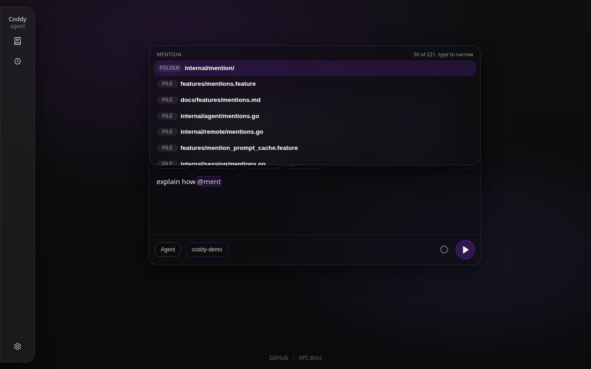

# Упоминания

Знак `@` в промпте указывает агенту на что-то конкретное - файл, диапазон строк, папку, другую сессию, правило, субагента, веб-страницу. Все интерфейсы понимают одну и ту же грамматику (консоль, веб-интерфейс, редактор через ACP, Telegram-бот), а сервер разрешает каждое упоминание **один раз, при отправке сообщения**, во вложение, которое идёт в том же сообщении. Модель читает вложение вместе с текстом, который на него сослался, а последующие ходы воспроизводят сообщение ровно таким, каким оно было отправлено.

## Что можно упомянуть в промпте

| Как записано | Пример | Что получает модель |
| --- | --- | --- |
| Путь в рабочей папке | `@src/app.go` | текст файла |
| Абсолютный путь, путь в домашнем каталоге, путь выше рабочей папки | `@/etc/hosts`, `@~/notes.md`, `@../api/schema.sql` | текст файла под его абсолютным путём |
| Путь в кавычках, для имени с пробелами | `@"notes/my draft.md"` | текст файла |
| Диапазон строк | `@Dockerfile:21-31`, `@f.go#L21-31`, `@f.go#L21`, `@f.go#21-31` | только эти строки с пометкой `lines="21-31"` |
| Папка | `@src/` или `@src`, если это папка | список содержимого папки |
| Другая сессия | `@session:sess_3e23…` (id или его уникальный префикс) | выжимка этой сессии |
| Правило | `@rule:deploy` или `@deploy` для правила только по упоминанию | текст правила |
| Субагент | `@agent:explore` | указание передать работу этому субагенту через `spawn_agent` |
| Страница документации Coddy | `@coddy:features/mentions`, `@coddy:surfaces/gateway#proxy` | страница или указанный её раздел ([Встроенная документация](built-in-docs.md)) |
| Сохранённый план проектирования | `@plans/auth-refactor.plan.md` | документ плана в режиме "Чат"; в режиме "Агент" план выполняется ([Режимы](modes.md)) |
| Веб-страница | `@https://go.dev/doc/effective_go` | страница в Markdown (JSON с форматированием, обычный текст как есть) |

Упоминание начинается с `@`, который открывает строку или стоит после пробельного символа, открывающей скобки или кавычки, поэтому `user@example.com` упоминанием не считается. Внутри огороженного блока кода, встроенного кода (`` `@Override` ``) или строки цитаты (`> ...`) знак `@` остаётся обычным текстом.

`@`, который не называет ничего на диске, тоже не упоминание. `npm install @google/genai` называет пакет, и если в рабочей папке нет `google/genai`, ничего не прикладывается, а поле ввода веб-интерфейса его не подсвечивает.

Где кончается упоминание, набранное в тексте, не всегда очевидно. `@README.md.` может оказаться файлом с именем `README.md.` или файлом `README.md` в конце предложения, а `@notes draft.md` - именем с пробелом или файлом, за которым идёт слово. Грамматика перечисляет все прочтения, начиная с самого длинного, и побеждает то, что существует на диске. Упоминание, которое ничего не называет (`@username` в чате, несуществующий путь), остаётся текстом и ничего не прикладывает.

Пути Windows (`@C:\Users\me\x.txt`) и папки пакетов со scope (`@node_modules/@types/node/index.d.ts`) читаются как пути. Грамматика описана в `internal/mention/grammar.go`; поле ввода веб-интерфейса подсвечивает упоминания её двойником (`external/ui/src/ui/skills/draftAt.ts`), и обе реализации проверяются на одних и тех же примерах (`internal/mention/testdata/grammar_cases.json`).

## Что получает модель

Каждое разрешённое упоминание превращается в элемент `<coddy_attachment>` после текста сообщения, с содержимым в CDATA.

```xml
look at @src/app.go:3-5 and @session:sess_3e23

<coddy_attachment path="src/app.go" name="app.go" lines="3-5">
<![CDATA[func main() {
    println("hi")
}]]>
</coddy_attachment>

<coddy_attachment path="session:sess_3e23" name="Refactor auth" kind="session">
<![CDATA[Session sess_3e23 - "Refactor auth"
Workspace: /home/me/project
...]]>
</coddy_attachment>
```

`kind` называет вид вложения, если это не файл (`directory`, `session`, `rule`, `agent`, `plan`, `skill`, `url`, `doc`, а также `stdin` для данных, переданных через канал в разовый запуск под набранным промптом; такому вложению не соответствует никакое упоминание, транскрипт показывает на его месте `[stdin]`, и ничто внутри него не разрешается как упоминание, см. [Консоль](../surfaces/console.md#данные-переданные-через-конвейер-вместе-с-промптом)). `mention` хранит упоминание в том виде, в каком его набрали, если оно отличается от `path` (`~/notes.md` для `/home/me/notes.md`), и именно до него транскрипт сворачивает вложение обратно. Веб-интерфейс, консоль, заново открывшая сессию, и редактор, который её загрузил, показывают `@~/notes.md` там, где было набрано сообщение, и никогда не показывают содержимое файла.

Что несёт каждый вид:

- **файл** вставляется целиком, если он не больше 512 КиБ, и декодируется из своей кодировки (Windows-1251 и другие устаревшие кодировки превращаются в UTF-8). Файл большего размера без диапазона прикладывается как заметка, которая называет его размер и просит модель прочитать нужную часть инструментом `read` или упомянуть диапазон. Ради диапазона читается до 64 МиБ файла, чтобы найти его строки, поэтому `@big.log:1200-1300` работает и на логе, который намного больше предела для вставки. Двоичный файл, диапазон за концом файла и файл, который не удаётся прочитать, прикладываются как заметка об этом. Ни один из этих случаев не прерывает ход;
- **папка** перечисляется в ширину - верхние уровни целиком, затем более глубокие, пока в списке есть место, - до 400 записей, а папки, содержимое которых обрезано, помечаются. Папка читается при отправке сообщения, поэтому папка, записанная мгновением раньше, попадает в список целиком. Внутри git-чекаута список пропускает то, что пропускает `.gitignore`; папка вне любого чекаута или папка, которую git игнорирует целиком, обходится на четыре уровня в глубину без скрытых папок, папок систем контроля версий и кэшей зависимостей (`node_modules`, `.venv`, `__pycache__`, ...);
- **сессия** приходит выжимкой не больше 24 КиБ - название, рабочая папка, когда сессия шла, её сводка сжатия контекста, если она есть, затем последние сообщения (текст пользователя и ответы ассистента; результаты инструментов опускаются, а отдельная строка называет инструменты, которые вызывал каждый ответ) и путь к полному транскрипту для всего, что выжимка обрезала. Это контекст из другого диалога, и указаний для текущего он не несёт;
- **правило** несёт свой текст и путь к своему файлу;
- **страница документации** приходит в том виде, в каком её хранит бинарник, а с `#section` приходит только этот раздел с подразделами, не больше 64 КиБ. Любое руководство помещается целиком, а длинная справочная страница (HTTP API, спецификация веб-интерфейса) приходит своим началом, строкой, с которой продолжить, и списком разделов, чтобы модель прочитала нужную часть через `coddy_docs_read`. Имя страницы принимает написания, которые перечислены в разделе [Встроенная документация](built-in-docs.md#страницы-и-разделы) (`@coddy:mentions` находит `features/mentions`); завершающие `.`, `/` или `#` заканчивают упоминание, а несуществующая страница или раздел остаются текстом. В веб-интерфейсе отправленное упоминание `@coddy:` становится ссылкой, которая открывает страницу в окне документации, как и такое же упоминание в ответе агента;
- **субагент** приходит указанием передать предназначенную ему часть запроса через `spawn_agent`. В режиме "Чат" или для проектного определения, которое ждёт одобрения, вложение объясняет, почему субагента нельзя запустить;
- **веб-страница** скачивается при отправке сообщения через транспорт инструмента webfetch и с его защитой адресов - только публичные адреса, проверка каждого перенаправления, 20 секунд, 64 КиБ текста. Страница, которую не удалось прочитать, прикладывается с указанием причины.

## Упоминания и кэш промпта

Провайдер кэширует запрос по префиксу, а системное сообщение открывает каждый запрос. Упоминание никогда не должно сдвигать то, что было до него, поэтому:

- упоминание разрешается один раз, когда его сообщение входит в диалог, и сообщение сохраняется вместе с вложениями. Следующий ход воспроизводит его байт в байт; файл, изменённый позже, не переписывает старое сообщение - упомяните его снова, чтобы показать модели новую версию;
- из-за упоминания правило никогда не попадает в системный промпт. Правило, которое назвал пользователь, идёт в его сообщении, как и правило, которое активирует упомянутый путь, - glob-правило, шаблоны которого совпадают с файлом, а также `AGENTS.md` и `DESIGN.md` папок на пути к нему. Пока это сообщение видно модели, ни один следующий вызов инструмента или упоминание не прикладывает эти правила снова; после сжатия контекста, которое сворачивает сообщение в сводку, следующее совпадение приносит их заново ([Правила и кэш промпта](rules.md#правила-и-кэш-промпта));
- скил, вызванный как `/name`, записывает свой текст в вызвавшее его сообщение один раз и не добавляется к тому сообщению, которое окажется последним.

Этот сценарий описан в `features/prompt_cache_mentions.feature`. Один ход упоминает файл, называет правило и вызывает скил, затем идёт второй ход; каждый запрос обоих ходов открывается одним и тем же системным сообщением, а второй ход воспроизводит сообщение первого без изменений.

## Кто что может упоминать

| Упоминание | Промпт оператора | Уточнение в очереди | Задача субагента (её пишет родительская модель) | Чат Telegram |
| --- | --- | --- | --- | --- |
| Файлы, папки, диапазоны, правила, страницы документации | да | да | да | да |
| Субагенты, планы, веб-страницы | да | да | нет | да |
| Другие сессии | да | да | нет | нет |

Чат мессенджера не дотягивается до других сессий, потому что люди в чате не владеют всеми остальными сессиями на хосте. Ход, который запустила завершившаяся фоновая задача (`notify_on_finish`), ничего не разрешает - его промпт составляет сам Coddy как отчёт, и никто его не набирал.

Путь вне рабочей папки читается с тем же охватом, что и у инструмента `read`. Упоминанием оператор сам указывает на файл, и ему не нужно разрешение, которое не понадобилось бы модели для собственного чтения.

## Автодополнение

Варианты даёт один поиск, общий для всех интерфейсов (`GET /coddy/mentions`, `session.Manager.SearchMentions`). Он ранжирует файлы и папки рабочей папки сессии по набранному тексту (сначала имя файла, затем сегменты пути, затем буквы по порядку, поэтому `@targhand` находит `zz/deep/target_handler.go`) и добавляет к ним правила, субагентов и планы с подходящими именами. Запрос, который начинается с `/`, `~`, `./`, `../` или буквы диска, вместо этого просматривает указанную папку и фильтрует её по имени, набранному после последнего разделителя. `@session:`, `@rule:` и `@agent:` перечисляют соответствующий вид; `@coddy:` перечисляет страницы документации, находит страницы по имени и разделы по их словам (`@coddy:prox`), а после `@coddy:<page>#` показывает разделы этой страницы. Пустой `@` сначала предлагает эти четыре схемы, затем верхний уровень рабочей папки, а начало имени схемы ставит эту схему первой (`@ag` предлагает `@agent:`), поэтому, набирая `@agent:` по буквам, вы доберётесь до субагентов даже в папке, где ничто не совпадает с `ag`. В новом чате веб-интерфейса до первого сообщения рабочей папкой служит папка, выбранная на стартовом экране. `@agent:` предлагает субагентов, которых эта папка определяет в `.agents/agents` или `.coddy/agents` (проектное определение по-прежнему ждёт одобрения по `subagents.project_trust`), и файлы, папки и правила тоже берутся из неё.

Индекс рабочей папки строится через `git ls-files` внутри git-чекаута (поэтому решает `.gitignore`, а dot-файлы вроде `.github/workflows/ci.yml` остаются доступными), а в остальных случаях обходом, который пропускает скрытые папки и кэши зависимостей, с ограничением в 50 000 записей. Индекс перестраивается, когда начинается упоминание, поэтому только что записанный файл (вами или агентом) уже предлагается, а удалённый исчезает.

### В консоли

Ввод `@` открывает список под редактором. Список сужается по мере ввода, **tab** или **enter** выбирает подсвеченную строку, **escape** закрывает список. Строка папки или схемы оставляет список открытым и показывает её содержимое; файл завершает упоминание пробелом. Путь с пробелом вставляется в кавычках; для папки закрывающая кавычка вставляется справа от курсора, чтобы текст называл папку, даже если файл за ней так и не появится. Если поиск нашёл больше, чем помещается в список, об этом говорит строка прокрутки вида `(3/50 of 1204, type to narrow)`. **tab** на слове без `@` дополняет его как путь.


*`@ment` в этом репозитории - сначала папка с подходящим именем, затем файлы, в каждой строке указан вид; строка прокрутки сообщает, что в списке 50 из 221 совпадения*

В удалённом режиме (`coddy --remote`) список приходит с сервера, где идёт сессия и где будут читаться её упоминания, и не зависит от папки, в которой запущена консоль.

### В веб-интерфейсе

Пикер поля ввода показывает каждый вариант с его видом (файл, папка, сессия, правило, субагент, план); пустой `@` сначала показывает недавние выборы в этой сессии. Стрелки двигают подсветку, **enter** или **tab** выбирает строку, и всё это работает во время хода, поэтому и уточнение может упомянуть файл. Если список обрезан, в строке заголовка написано, сколько всего совпадений. Ввод `:` после файла открывает [выбор диапазона строк](../surfaces/web-ui.md#диапазоны-строк-pathn-m).



*`@ment` - рабочая папка, ранжированная по фрагменту, вид в каждой строке, число совпадений обрезанного списка в строке заголовка*


*`@session:` перечисляет другие сессии, сначала из этой рабочей папки, с названием, id и временем последнего запуска; выбор сессии прикладывает выжимку её последних сообщений*

Поле ввода отправляет текст в набранном виде, а упоминания разрешает сервер, поэтому черновик означает в браузере то же, что и в консоли. Упоминание подсвечивается только после того, как сервер ответил, что отправка его приложит (`POST /coddy/mentions/check` - тот же механизм разрешения, запущенный без чтения файлов), и ровно на той части, которая разрешается. `@google/genai` в `npm install @google/genai` остаётся обычным текстом, а в `compare @src/a.go b.go` помечается только `@src/a.go`.

### В редакторе через ACP

У редактора вроде Zed своё меню упоминаний, и выбранное он отправляет блоками содержимого ACP. `resource` с текстом прикладывается в том виде, в каком пришёл (Zed включает несохранённые правки); ресурс `file://` с фрагментом строк (`#L10-20`, `#L10:20`, `#L10`) несёт эти строки, а запрос вроде `?symbol=` отбрасывается. `resource_link` на локальный файл или папку читается так же, как их упоминание; ссылка, которую Coddy не может открыть (внутренний URI редактора), доходит до модели строкой с её названием. Упоминания, набранные текстом, разрешаются так же, как везде. См. [Протокол ACP](../reference/acp-protocol.md).

### В Telegram

Наберите упоминание; собственное `@name` бота удаляется до того, как промпт будет прочитан.

## Связанные страницы

- [Правила и инструкции](rules.md) - правила только по упоминанию и правила, которые активирует упомянутый путь;
- [Очередь сообщений](message-queue.md) - упоминания уточнения разрешаются, когда агент его читает;
- [Веб-интерфейс](../surfaces/web-ui.md), [Консоль](../surfaces/console.md), [HTTP API](../reference/http-api.md) - интерфейсы и `GET /coddy/mentions`.

<!-- docsgen:source sha256=e778f52296358a19 -->
