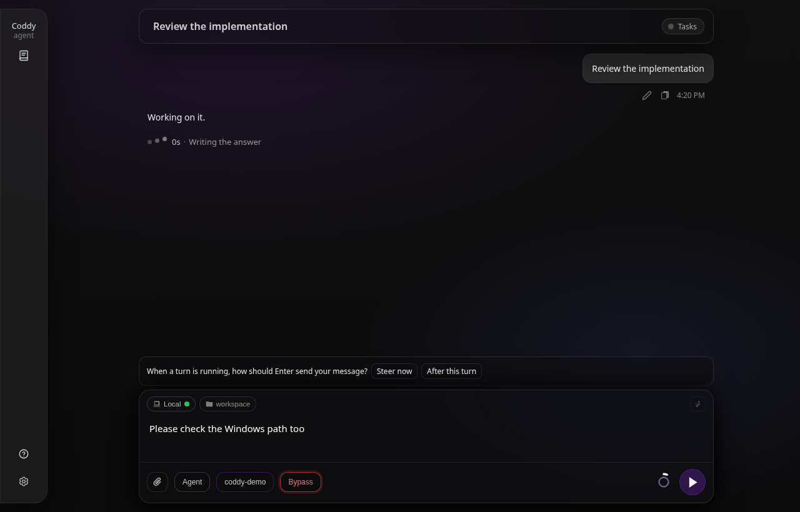
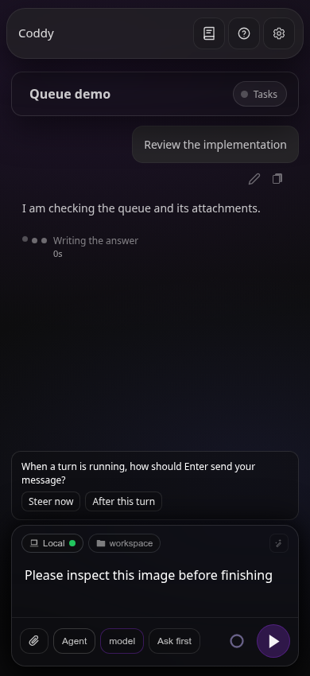
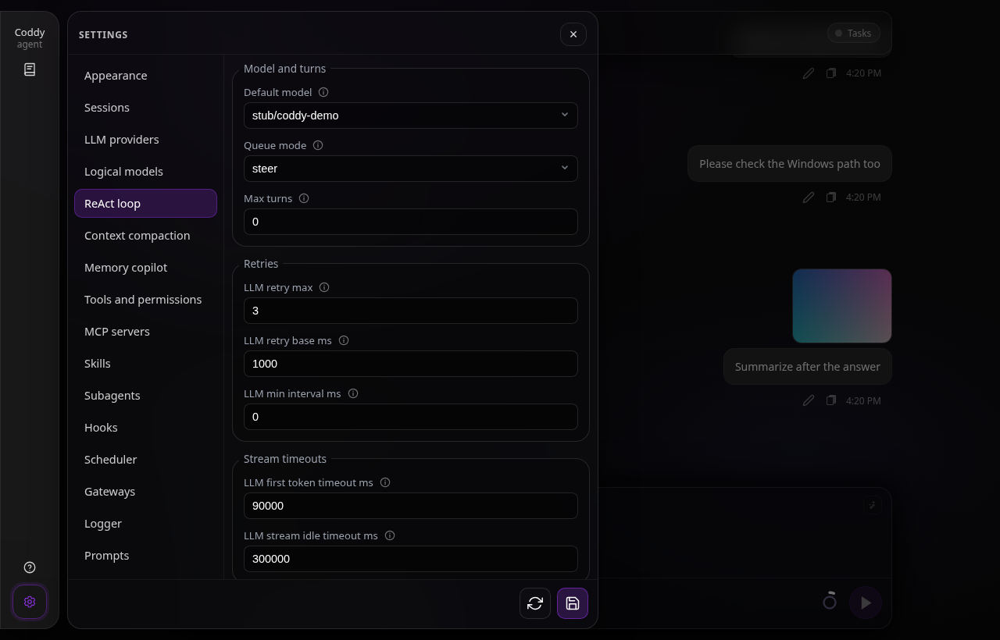
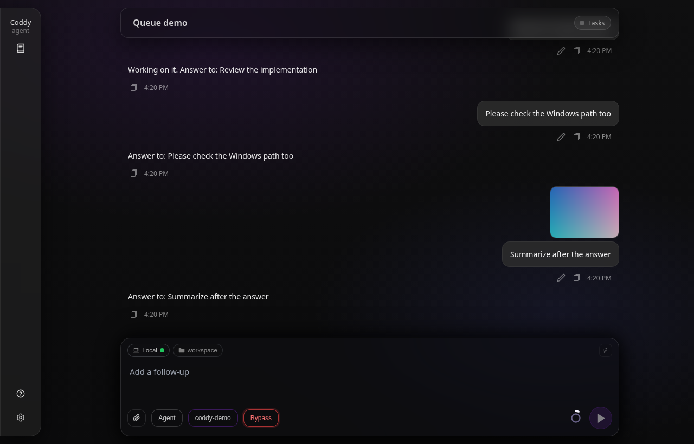
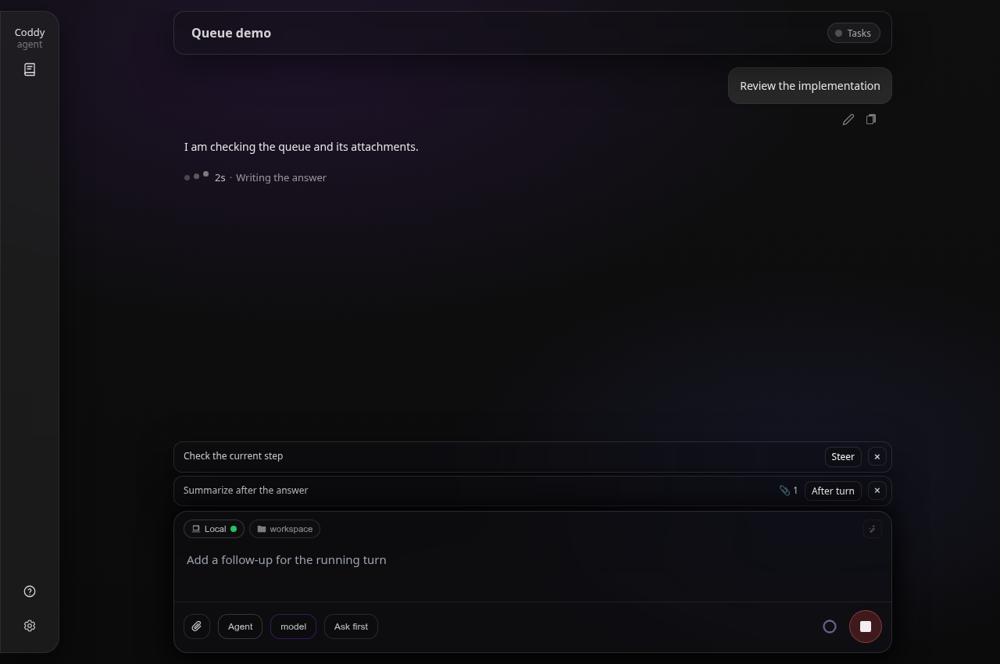
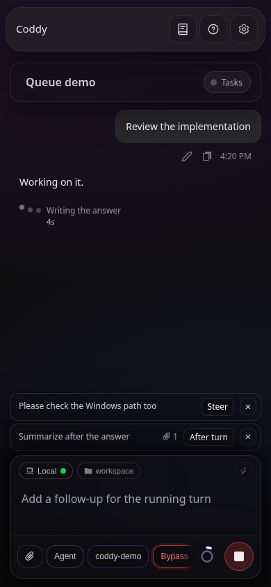
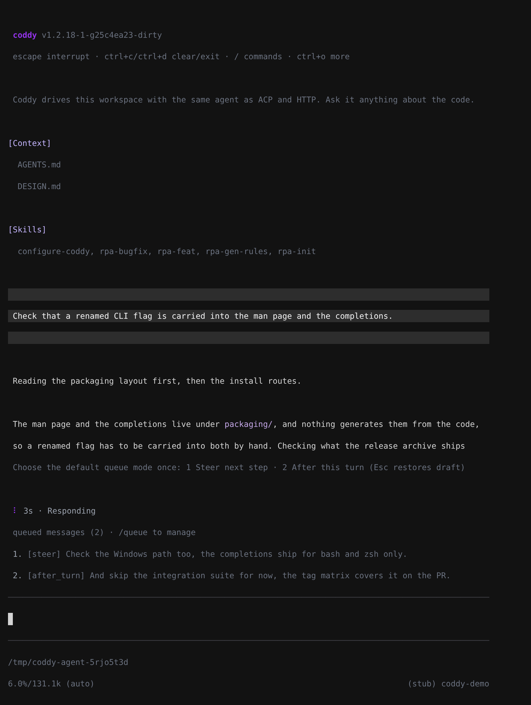
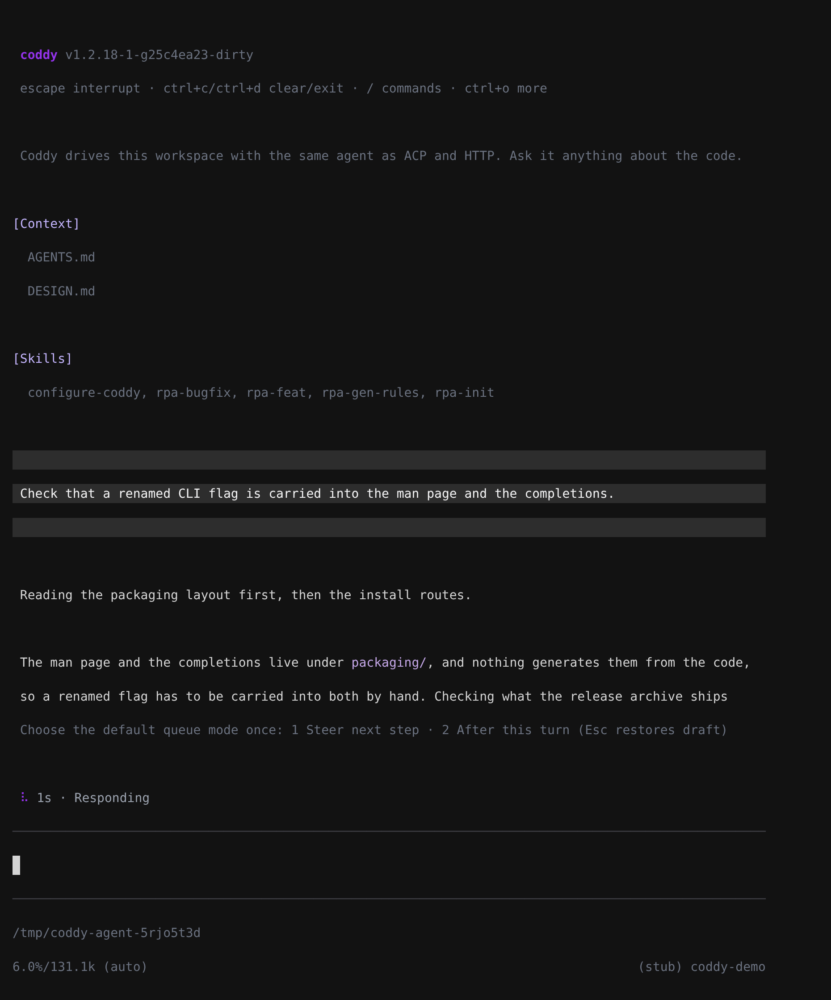

# Очередь сообщений

Лучше всего оператор понимает, что агенту делать дальше, пока тот работает, - вызов инструмента прочитал не тот файл, о платформе никто не упомянул, ограничение стало очевидным, только когда план появился на экране. Поэтому сообщение, написанное **во время** хода, не отклоняется. Оно ждёт в сессии в одном из двух режимов:

- **В текущий ход** - сообщение входит в идущий ход на его следующем шаге ReAct, между вызовами инструментов, которые модель только что сделала, и запросом, который за ними следует. Поправка попадает в работу, пока работа ещё идёт;
- **После хода** - сообщение ждёт ответа и затем запускает собственный промпт. Несколько отложенных сообщений выполняются по одному, в том порядке, в каком их поставили в очередь.

Когда вы впервые отправляете сообщение во время хода, браузер или консоль спрашивают, какой режим использовать для **Enter**, и сохраняют ответ как `agent.queue_mode` в `config.yaml`; позже его можно изменить в разделе **Настройки → Цикл ReAct**. Пока идёт ход, **Enter** использует этот режим, а **Tab** - другой; кнопка отправки в браузере использует режим Enter. Пока агент не прочитал сообщение, оно остаётся вашим. Его режим можно переключить, а если забрать сообщение обратно, текст и изображения вернутся в черновик.



*Первое сообщение, написанное во время хода, спрашивает, какой режим использовать для Enter.*



*В узком поле ввода варианты выбора переносятся на новую строку.*



*Ответ сохраняется как `agent.queue_mode`, и его можно изменить в настройках на вкладке "Цикл ReAct".*

## Что видит агент

Сообщение **в текущий ход** становится обычным сообщением пользователя в диалоге, в той точке, где его прочитали. В транскрипте его ничем не выделяют, и модели ничто не говорит, что оно стояло в очереди, - это человек, который заговорил посреди работы, и так оно и есть. Несколько таких сообщений, написанных во время одного шага, читаются вместе, в порядке написания. Их упоминания `@` и вызовы `/skill` разрешаются при чтении точно так же, как у промпта, и едут в самом сообщении ([Упоминания](mentions.md)).

Чтение происходит в двух местах хода, и оба - самый ранний момент, когда модель может на сообщение отреагировать:

- **Между шагами.** Цикл ReAct забирает сообщения в текущий ход в начале каждой итерации, до того как построит запрос, который отвечает на только что собранные результаты инструментов;
- **В конце.** Сообщение в текущий ход, написанное, когда ответ уже составлялся, читает тот же ход, и он продолжается, поэтому на сообщение отвечает ход, в который его написали. Это чтение происходит **после** того, как отработали хуки `Stop`, поэтому хук по-прежнему срабатывает на каждом ответе, которым заканчивается ход.

Сообщение **после хода** - промпт отдельного запуска, который начинается, когда ответ дан. Это свежий запуск агента с собственным бюджетом `agent.max_turns`, и он видит всё, что предыдущий ответ оставил в диалоге. Клиентам, которые следят за сессией, о нём сообщают так же, как о прочитанном сообщении в текущий ход, - как о сообщении оператора в точке, где оно входит в диалог, поэтому живой транскрипт показывает его над ответом на него.



*Сообщение в текущий ход прочитано до конца хода; сообщение после хода с изображением запустило собственный промпт после этого ответа.*

## Границы хода и остановка

Когда ход отвечает, менеджер одним атомарным шагом смотрит, что ждёт в очереди. Сначала все сообщения в текущий ход, одним пакетом для ещё одного запуска того же хода; если их нет, самое старое сообщение после хода, одно; если нет и его, менеджер закрывает очередь. Решение под одной блокировкой означает, что сообщение никогда не примет уже закончившийся ход, а сообщение, которое мгновением раньше переключили из одного режима в другой, берётся в его нынешнем режиме.

Так продолжается только ход, который закончился **ответом**. Ход, остановленный по любой другой причине - предел ходов, отказ, хук, ошибка, - уже сообщил почему, и новый запуск похоронил бы это сообщение. Продолжений не больше **20** запусков на один принятый ход, то есть размер полной очереди; сверх предела сообщения в текущий ход отбрасываются с предупреждением, а сообщения после хода остаются в очереди.

**Стоп** отбрасывает сообщения в текущий ход, которые ход так и не прочитал, - отмена хода отменяет и то, что его ждало. Сообщения после хода он **сохраняет**, не запуская их; их можно переключить или удалить, и они выполнятся после следующего обычного ответа в этой сессии. Отложенное сообщение, чей запуск остановили до того, как оно вошло в диалог, тоже возвращается в начало очереди, потому что его никто не прочитал. Ход, завершившийся ошибкой, обходится с очередью так же.

Продолжение относится к обычному пути промпта. Ход другого рода - возобновление после разрешения, выполнение сохранённого плана - тоже читает сообщения в текущий ход между своими шагами, но в его конце непрочитанные сообщения в текущий ход отбрасываются с предупреждением, а сообщения после хода остаются в очереди.

## Изображения

Вложение поля ввода идёт в очередь вслед за своим текстом, и сообщение из одних изображений допустимо. Изображение доходит до модели, только если модель сессии читает изображения (`multimodal: true`), - то же правило действует для обычного промпта. Для модели, которая понимает только текст, сервер отбрасывает изображения сообщения из очереди и оставляет его текст. Принимается только изображение, переданное в самом запросе как base64 URI `data:image/...`; всё остальное отклоняется. Когда агент читает сообщение, Coddy сохраняет изображение вместе с ассетами сессии, отправляет его модели и показывает на сообщении пользователя в транскрипте.

Пока изображение ждёт, оно остаётся на сервере. Список, который получает каждый клиент, называет каждое изображение (имя, тип и размер) и никогда не несёт его байты. Каждое изменение очереди уходит каждому клиенту сессии, и иначе несколько скриншотов путешествовали бы с каждым из них. Байты возвращаются только клиенту, который забирает сообщение обратно, и он кладёт их в свой черновик.

Команды настроек в начале текста из очереди (`/model x`, `/permissions bypass`) применяются сразу, а ждёт только остальное; если текст состоял из одних команд, его изображения всё равно ставятся в очередь ([Настройки сессии](session-settings.md#что-происходит-при-отправке)).

## Время жизни очереди

Очередь живёт в памяти процесса `coddy serve`:

- она принимает сообщения, пока идёт ход, и отклоняет их в сессии, которая не работает, - тогда интерфейс отправляет этот текст как обычный промпт;
- сообщения после хода, которые сохранил Стоп, остаются в простаивающей сессии и видны каждому клиенту, пока не выполнятся или не будут удалены;
- перезапуск процесса не переживает ничего;
- одновременно ждут не больше **20** сообщений. Очередь задумана как удобство поля ввода, пакетные задания она не выполняет.

**Дочерняя сессия (субагента)** ничего не принимает. Её единственный ход - задача, которую написал родитель, и по той же причине во всём остальном она доступна только для чтения.

## В браузере



*У каждого ждущего сообщения виден его режим и скрепка с числом изображений в нём.*



*Режимы и число изображений видны и при ширине 390 px.*

Пока агент работает, поле ввода остаётся активным. Если в поле есть черновик, круглая кнопка справа ставит его в очередь в режиме Enter, а не останавливает ход; при пустом поле это по-прежнему **Стоп**, которым ход и отменяют. Сообщения в очереди складываются над полем ввода в том порядке, в каком их прочитает агент. Щелчок по режиму сообщения переключает его; крестик в углу забирает сообщение обратно и кладёт его текст и изображения в черновик перед всем, что набрано после, поэтому сообщение редактируют, забирая его обратно. Если агент прочитал сообщение раньше, чем нажали крестик, оно уже в диалоге, и ничего не возвращается.

Браузер проверяет активность и очередь выбранной сессии при её открытии и при переподключении, но пропускает оба чтения, пока его собственный запрос промпта ждёт приёма. Стоп и постановка в очередь остаются доступны для идущего хода, даже если вкладка потеряла читателя потока или сессия не попала на текущую страницу Истории. Стоп отправляет запрос отмены и сразу закрывает собственного читателя вкладки, поэтому запрос никогда не ждёт соединения, которое держит этот читатель, когда остальные соединения, разрешённые браузером для одного хоста, заняли другие вкладки; неудачный запрос показывает ошибку, вкладка снова присоединяется к идущему ходу, а кнопки остаются доступными для новой попытки. После подтверждения Стопа серверу может понадобиться время, чтобы отпустить ход; если старое событие конца хода накладывается на следующий ожидающий или принятый промпт, браузер должен заново прочитать активность, прежде чем объявить, что сессия простаивает.

## У общей сессии общая очередь

Сессия не принадлежит вкладке, которая её открыла. На одну и ту же сессию могут смотреть два браузера, третье окно на телефоне и консоль, подключённая через `--remote`, и очередь принадлежит сессии, а не кому-то из них. То, что ставит в очередь кто угодно, появляется у всех, а сообщение, которое кто-то забрал или переключил, меняется для всех.

Это работает независимо от того, читает ли клиент поток идущего хода. Каждое изменение идёт двумя путями:

- через **собственный поток хода**, поэтому клиент, который ведёт ход, и все, кто к нему подключился (`GET /coddy/sessions/{id}/composer-stream`), получают его сразу;
- через **`GET /coddy/events`**, общий поток сервера, который держит открытым каждый браузер (одно соединение на все его вкладки) и на который подписывается консоль с `--remote`; он передаёт `event: message_queue` с идентификатором сессии, всей очередью и её версией.

Ответ на запрос, который внёс изменение, несёт тот же список и ту же версию, поэтому он только в третий раз доставляет тот же факт и отдельной правды не создаёт.

Это отдельные соединения, поэтому доставки могут приходить в любом порядке. Каждая несёт **версию**, которая считает изменения очереди этой сессии; при обычных доставках клиент хранит наибольшую увиденную версию и отбрасывает всё более старое. И для событий, и для HTTP-ответов сервер читает список и версию под одной блокировкой. Счётчик общий для процесса, а не отдельный для каждой сессии, поэтому при перестройке живого состояния прежняя версия внутри этого процесса повторно не используется. Чтобы браузер восстановился после перезапуска сервера, свежий GET очереди может установить более низкую версию, включая `0`, только если ни одна доставка очереди не пересеклась с чтением. Такое восстановление продвигает локальную эпоху, поэтому браузер игнорирует ответы на изменения и кадры очереди из собственного потока и потока релея, полученные в более ранних эпохах. Повторно воспроизведённое событие начала хода само по себе не сбрасывает версию клиента и ждущие сообщения.

## В консоли



*Консоль нумерует ждущие сообщения и показывает режим каждого над редактором.*



*Первое сообщение, написанное во время хода, задаёт вопрос в строке состояния - 1 steer, 2 после хода, Esc возвращает черновик.*

Отправка во время хода ставит промпт в очередь в режиме Enter, а **Tab** - в другом режиме. В первый раз консоль спрашивает режим для Enter в строке состояния (**1** steer, **2** после хода, **Esc** возвращает черновик), сохраняет ответ в `agent.queue_mode` и ставит сообщение в очередь; сообщение, отправленное через Tab, всё равно идёт другим путём. То, что ждёт, видно прямо над полем ввода, с номерами в порядке чтения.

```
queued messages (2) · /queue to manage
1. [steer] check the Windows path too
2. [after_turn] and then update the changelog
```

`/queue` перечисляет их, `/queue mode <n> steer|after_turn` переключает одно из них, `/queue drop <n>` забирает одно обратно и кладёт его текст в поле ввода, `/queue clear` очищает очередь. Нажатие **escape** отменяет ход, и вместе с ним уходят его непрочитанные сообщения в текущий ход, а сообщения после хода остаются в очереди. То же работает с удалённым сервером (`--remote`). Консоль обращается к маршрутам очереди, описанным ниже, и подписывается на поток событий сервера, поэтому дополнительное сообщение, которое кто-то поставил в очередь в браузере, тоже появляется над полем ввода консоли.

В удалённой консоли ход, начатый другим клиентом, тоже принимает сообщения в очередь и отмену по Escape. Консоль отслеживает эту активность сервера отдельно от собственного запроса промпта. После перезапуска сервера последний свежий снимок очереди может восстановить более низкую версию (включая ноль), только если ни одно обновление очереди не пересеклось с чтением; запоздавшие ответы и уведомления, отправленные до восстановления, старые строки не возвращают. Для восстановления не нужно, чтобы ход простаивал. Неудачное чтение или снимок, с которым пересеклось обновление, читаются заново (до трёх попыток с короткой задержкой); более новое обновление или завершение клиента останавливает старое восстановление. У чтений очереди свой бюджет тайм-аута, отдельный от чтений активности. Эта поддержка управления не подключает консоль к живому транскрипту другого клиента и не делит с ним окна разрешений и вопросов.

## По HTTP

| Маршрут | Что делает |
|---|---|
| `GET /coddy/sessions/{id}/queue` | Что ждёт - `id`, `text`, `mode`, `imageParts` (у каждого изображения `name`, `mimeType` и `sizeBytes`, но никогда не его байты) и `createdAt` в каждой строке, а также `version` очереди. |
| `POST /coddy/sessions/{id}/queue` | Ставит в очередь `{"text": "...", "mode": "steer\|after_turn", "inline_files": [{"name": "shot.png", "data_url": "data:image/png;base64,..."}]}`. По умолчанию `mode` равен `steer`; `text` может быть пустым, если к нему приложено изображение. **201** с сохранённым сообщением и всей очередью. |
| `PATCH /coddy/sessions/{id}/queue/{message_id}` | Переключает ждущее сообщение через `{"mode": "steer"}` или `{"mode": "after_turn"}`; отвечает всей очередью. |
| `DELETE /coddy/sessions/{id}/queue/{message_id}` | Забирает одно сообщение обратно. Ответ несёт остаток очереди и, в поле `message`, забранное сообщение с изображениями целиком в `inline_files`, в той форме, которую принимает POST. |
| `DELETE /coddy/sessions/{id}/queue` | Удаляет всё, что ждёт. |

Сессия без идущего хода отклоняет POST с **409** и кодом `no_active_turn`; полная очередь отвечает **409** с `queue_full`; дочерняя сессия отвечает **409** с `subagent_read_only`. На элемент `inline_files`, который не задан как base64 URI `data:image/...`, ответ - **400** с `invalid_request`, а для модели, которая не читает изображения, они не попадают в сохранённое сообщение. PATCH или DELETE сообщения, которое агент прочитал первым, получает **404** с `not_found`. Проиграть эту гонку - обычное дело, и сообщение уже в диалоге. Команда `--once` или `--count=N`, за которой следует текст, получает **409** с `turn_scoped_follow_up`. Сообщение в очереди ещё может сменить режим или быть забрано обратно, поэтому у команды нет собственного хода, которого можно ждать ([Настройки сессии](session-settings.md#что-происходит-при-отправке)). Если ход заканчивается между нажатием клавиши и приёмом в очередь, браузер и удалённая консоль возвращают отправленный текст в черновик, а не запускают автоматически ещё один промпт.

Каждое изменение публикуется как `event: message_queue` с полным списком и его версией - и в потоке хода, и в `GET /coddy/events`. Сообщение в текущий ход, которое прочитал агент, и сообщение после хода в момент начала его запуска приходят в потоке хода как `event: user_message`, в той точке, где они вошли в диалог. Полные формы описаны в [HTTP API](../reference/http-api.md).

## Чего очередь не делает

- **Это не планировщик.** Перезапуск не переживает ничего, и единственные сообщения, которые хранятся для простаивающей сессии, - сообщения после хода, сохранённые Стопом, и они ждут следующего ответа в этой сессии;
- **Это не второй приём.** Сообщение после хода выполняется внутри хода, который шёл, когда сообщение поставили в очередь, - одна блокировка хода, один Стоп на всю цепочку и свежий бюджет `agent.max_turns` на каждый промпт;
- **Это не межпроцессное хранилище очереди.** Общее управление требует клиентов одного и того же процесса `coddy serve`. Независимые локальные процессы консоли или ACP с общим каталогом сессий не делят свои очереди в памяти. Межпроцессная отмена по-прежнему использует маркер отмены в бандле сессии;
- **Это не общие вопросы или разрешения.** Принадлежность запросов не меняется - запрос разрешения или вопрос остаётся у интерфейса, который начал ход.

<!-- docsgen:source sha256=efaa33c1d327aa4c -->
