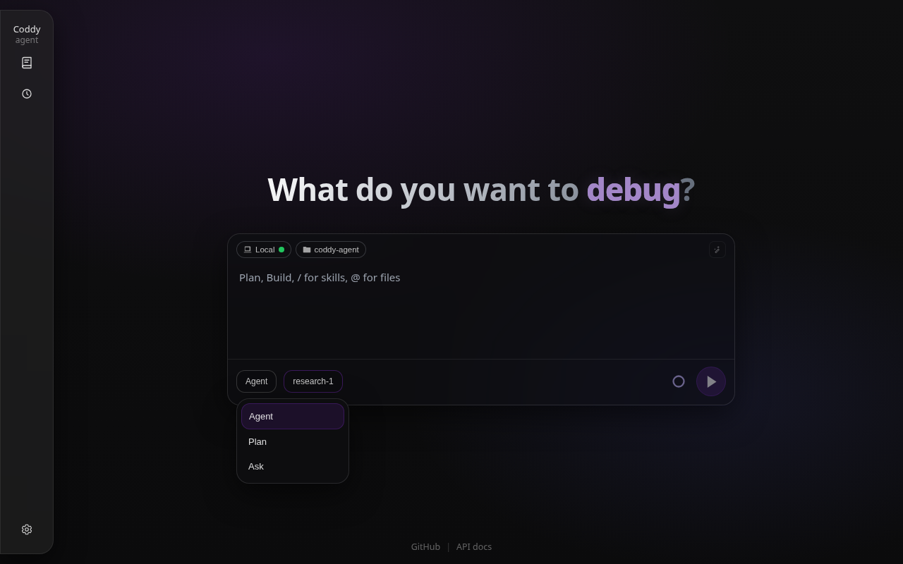
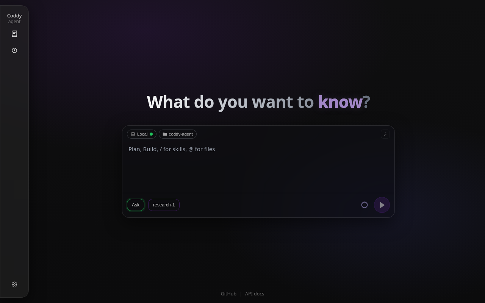

# Режимы работы

Сессия работает в одном из трёх режимов - `agent`, `plan` или `ask`. Режим определяет, какие инструменты модель получает на ходе, а для `ask` ещё и то, какие вызовы вообще могут выполняться. На этой странице описано, что разрешает каждый режим, как режим "План" передаёт свой документ на реализацию, как режим "Чат" соблюдается при выполнении вызова и как переключать режим в каждом интерфейсе. Режим работы не зависит от режима разрешений (`ask`, `accept_edits`, `bypass`), который определяет, когда агент спрашивает вас перед командой или записью файла. Оба режима действуют одновременно.

## Три режима

### `agent`

Режим по умолчанию, для реализации, рефакторинга, отладки и запуска. Модель получает все встроенные инструменты из реестра - инструменты чтения двух других режимов, а также запись и правку файлов, оболочку с её фоновыми задачами, чек-лист задач, инструменты конфигурации с подготовкой и применением изменений, инструменты плана и `spawn_agent` - и инструменты всех подключённых MCP-серверов. Какие из этих вызовов сначала спросят вашего разрешения, решает режим разрешений, а не режим работы.

### `plan`

Для проектных документов, спецификаций и исследования, которое предшествует изменению. Модель получает фиксированный список инструментов:

- `read`, `keep_result`, `glob`, `grep` и `print_tree` для репозитория;
- `websearch` и `webfetch` для веба;
- `run_command` вместе с `background_list`, `background_output`, `background_wait` и `background_stop`, чтобы не ждать медленную команду, которая только читает;
- `question`, а также `config_get` и `config_changes`, которые только читают (подготовка и применение изменения конфигурации остаются в режиме "Агент");
- `plan_write`, `plan_list` и `plan_read` для документа плана;
- `load_skill` и `spawn_agent`, дочерний агент которого остаётся в режиме "План";
- `coddy_docs_search` и `coddy_docs_read` для собственной документации Coddy ([Встроенная документация](built-in-docs.md));
- инструменты подключённых MCP-серверов.

Встроенной записи файлов и инструментов чек-листа задач здесь нет. Когда план готов, реализация идёт в режиме "Агент".

### `ask`

Для вопросов о кодовой базе, ревью, диагностики и поиска в вебе. Модель получает `read`, `keep_result`, `glob`, `grep`, `print_tree`, `websearch`, `webfetch`, `question`, `load_skill`, `coddy_docs_search` и `coddy_docs_read` и больше ничего. Нет ни оболочки, ни инструментов плана, чек-листа задач и конфигурации, ни `spawn_agent`, ни инструментов MCP. Тот же список проверяется ещё раз, когда вызов выполняется, и этим режим "Чат" отличается от режима "План" (см. [Режим "Чат" при выполнении](#режим-чат-при-выполнении)).

### Что у них общего

Списки инструментов зафиксированы в `internal/agent.ToolSetForMode`, режим "Агент" ничем не ограничен. `load_skill` существует, только пока включён `skills.auto_discovery`, а `spawn_agent` - только пока включён `subagents.enable`. Собственный `mode` из определения субагента действует, только если родитель работает в режиме "Агент". Каждый режим строит свой системный промпт из встроенного `agent.md`, `plan.md` или `ask.md`, и их можно заменить через `prompts.dir` вместе с `prompts.agent_prompt`, `plan_prompt` и `ask_prompt` ([справочник по конфигурации](../reference/config.md#prompts)). Выбранный режим хранится вместе с сессией в `session.json`.

*Меню "Режим" в поле ввода веб-интерфейса предлагает "Агент", "План" и "Чат", за ним в той же строке идут модель, уровень рассуждения и режим разрешений.*

## Режим "План" и документ плана

В режиме "План" модель записывает свой замысел через `plan_write`, который создаёт в бандле сессии файл `plans/<slug>.plan.md` с YAML frontmatter (`name`, `overview`, `todos`) и телом в markdown. `plan_list` и `plan_read` находят и перечитывают эти файлы. После каждого `plan_write` Coddy публикует обновление сессии `plan`, пункты которого берутся из frontmatter (поэтому любой ACP-клиент показывает предварительный просмотр), и сохраняет строку `plan_document` в `messages.json` для веб-интерфейса.

Веб-интерфейс показывает эту строку в колонке чата как карточку документа плана:

- **В свёрнутом виде** - заголовок (`name`, а без него slug, путь к файлу во всплывающей подсказке), однострочное описание и кнопки **Отменить** и **Запустить план** внизу;
- **В развёрнутом виде** - по умолчанию отрисованный markdown. Переключатель с глазом открывает построчный редактор markdown с телом без frontmatter, и редактор сам сохраняет его через `PUT /coddy/sessions/{id}/plans/{slug}` примерно через 600 мс после последнего нажатия клавиши. Панель растёт вместе с документом, а не прокручивается внутри себя;
- **Отменить** (`DELETE` на тот же маршрут) помечает план отменённым. Карточка остаётся в транскрипте приглушённой, с отключёнными кнопками, а план пропадает из системного промпта режима "План";
- **Запустить план** отправляет следующий промпт с `metadata.runPlanSlug` (`_meta` `coddy.dev/runPlanSlug` через ACP). Coddy переключает сессию в режим "Агент", вставляет тело плана в системный промпт и запускает ход. Чек-лист задач сессии из плана не заполняется. Тело плана остаётся при этом ходе, пока ход ещё можно продолжить. Ход, остановленный на запросе разрешения, заново строит свой системный промпт, когда приходит ответ, поэтому текст хранится в бандле (`pending_plan_context.json`) и освобождается, когда ход заканчивается;
- в транскрипте дочернего субагента, открытом только для чтения, у карточки нет нижней панели, а её редактор доступен только для чтения.

Переносимый способ для клиента без такого механизма - переключиться в режим "Агент" и упомянуть `@plans/<slug>.plan.md` в промпте. Подробности на страницах [Веб-интерфейс](../surfaces/web-ui.md#карточка-документа-плана-транскрипт-режима-план) и [Протокол ACP](../reference/acp-protocol.md#планы-проектирования-режим-план).

*Карточка, которую `plan_write` оставляет в чате в режиме "План". В ней название и краткое описание плана и кнопки "Отменить" и "Запустить план", а ответ модели ниже повторяет план.*

## Режим "Чат" при выполнении

Режим "План" ограничивает то, что получает модель, а режим "Чат" ограничивает ещё и то, что может выполняться. Каждый вызов инструмента снова сверяется со списком режима "Чат" непосредственно перед выполнением, потому что модель может повторить вызов из более ранней истории, записанной в другом режиме, или назвать инструмент, который ей никогда не показывали. Вызов вне этого списка не выполняется:

- результат инструмента - `error: tool "write" is not available in Ask mode because it is not read-only`, и модель продолжает ход, получив этот отказ;
- по HTTP поток передаёт вызов как отменённый с тем же текстом;
- инструменты MCP отклоняются так же, потому что их в списке никогда нет;
- одобрение такого ожидающего вызова через *Всегда разрешать* не записывает разрешения.

Остальные границы режима следуют из этого. На `metadata.runPlanSlug` в `POST /v1/responses` с `model` `ask` сервер ещё до начала хода отвечает `409`, тот же механизм через ACP отклоняется с ошибкой, а упоминание `@plans/<slug>.plan.md` вставляется как материал для чтения и не запускается. Субагент памяти вспоминает, но никогда не сохраняет. `spawn_agent` не предлагается, поэтому ход в режиме "Чат" не может поручить работу другому агенту. Детерминированные команды оператора, набранные вместо промпта (`/compact`, `/plugin`), под это ограничение не попадают. Основные сценарии описаны в `features/ask_mode.feature` и `features/ask_mode_http.feature`.

*Поле ввода в режиме "Чат". Кнопка режима получает зелёную обводку этого режима, в режиме "План" обводка оранжевая.*

## Переключение в каждом интерфейсе

| Интерфейс | Как |
|---|---|
| Веб-интерфейс | кнопка **Режим** в поле ввода рядом с **Модель** или `/agent`, `/plan`, `/ask`, набранные вручную или выбранные в меню `/`. Выбор кнопки передаётся как `model` верхнего уровня в `POST /v1/responses` |
| Консоль | `/agent`, `/plan` или `/ask` в чате или `--mode agent\|plan\|ask` при запуске, который сочетается также с `-c`, `--resume` и `-p`. В режиме `--remote` команда переключает сессию на сервере |
| ACP | `session/set_config_option` с `configId` `mode` и `value` `agent`, `plan` или `ask` (предпочтительный способ) или устаревший `session/set_mode` с `modeId`. Агент отвечает `current_mode_update` и `config_option_update`, а `session/new` объявляет все три режима в `configOptions` и `modes` |
| HTTP API | `model`, равный `agent`, `plan` или `ask`, в `POST /v1/responses` или `POST /v1/chat/completions`. `GET /v1/models` перечисляет все три с `owned_by` `coddy`, а `metadata.model` выбирает бэкенд |
| Telegram | `/agent`, `/plan` или `/ask` |
| Планировщик | `mode:` во frontmatter файла задания, по умолчанию `agent` |

Каждая команда принимает также `--once` или `--count=N`, которые переключают режим на следующий ход или на N следующих ходов, а затем возвращают собственный режим сессии. Например, `/plan --once how would you split this package?` планирует один ответ и оставляет сессию в режиме "Агент". Через ACP и HTTP команды работают так же, если отправить их в начале текста промпта ([Настройки сессии](session-settings.md)).

Разовый запуск выбирает режим так же. `coddy --mode ask -p "..."` отвечает, не трогая рабочую папку. Руководства по интерфейсам - [Консоль (TUI)](../surfaces/console.md), [Веб-интерфейс](../surfaces/web-ui.md), [Протокол ACP](../reference/acp-protocol.md), [HTTP API](../reference/http-api.md), [Telegram-шлюз](../surfaces/gateway.md), [Планировщик](../operate/scheduler.md).

<!-- docsgen:source sha256=274a2625121e2f21 -->
