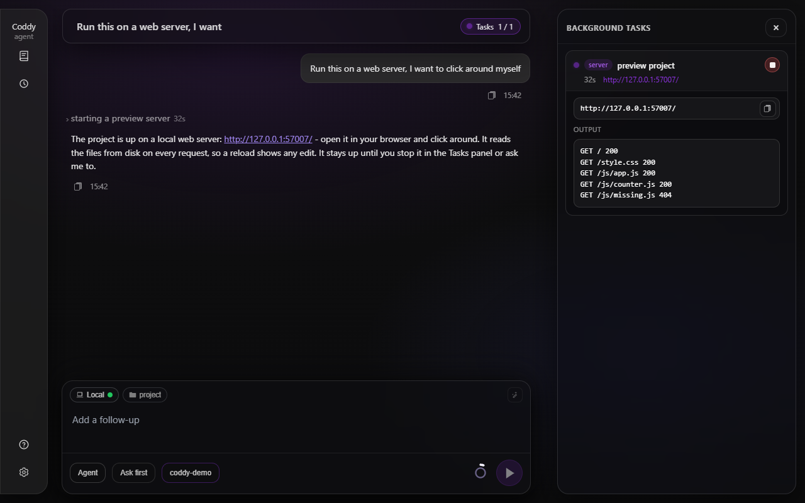

# Сервер предпросмотра

Инструмент `preview_server` отдаёт каталог проекта как статический сайт на свободном порту localhost и возвращает адрес. Он нужен, когда вы хотите попробовать результат сами. Страница, открытая с диска как `file://`, не может импортировать ES-модули, получить свои данные через `fetch` или запустить воркер, поэтому для работы с HTML, JS и CSS нужен веб-сервер, иначе браузер её не запустит.

Попросите своими словами.

```text
Run this on a web server, I want to click around myself.
```

Агент запускает сервер, отвечает ссылкой (`http://127.0.0.1:53817/`) и предлагает её открыть. Ничего устанавливать для этого не нужно - сервер входит в Coddy и работает несколькими горутинами внутри запущенного процесса, это не `python -m http.server` и не `npx serve`, которые агенту пришлось бы искать на машине. Проект со своим dev-сервером (`npm run dev`, `vite`) по-прежнему получает именно его, в виде [фоновой команды](background-tasks.md).

## Что отдаётся

| Аргумент | Значение |
|---|---|
| `path` | Каталог, который нужно отдавать, относительно рабочего каталога сессии. Если аргумент не указан, отдаётся сам рабочий каталог. Принимается и файл - тогда отдаётся его каталог, а возвращённый адрес открывает этот файл. |
| `timeout_seconds` | Через столько секунд сервер остановится сам. Если аргумент не указан (обычный случай), сервер работает, пока его не остановят. |

- порт всегда свободный, его выбирает система, поэтому две сессии или два каталога одной сессии никогда не конфликтуют;
- файлы читаются с диска при каждом запросе и отдаются с `Cache-Control: no-store` - сохраните файл, перезагрузите страницу и увидите правку;
- каталог с `index.html` открывает этот файл, а каталог без него показывает список файлов;
- `.js` и `.mjs` всегда уходят как `text/javascript`, а `.css`, `.json`, `.svg`, `.wasm` и шрифты - со своими типами, что бы ни говорил реестр хоста. Браузер отказывается загружать ES-модуль, отданный как `text/plain`, а именно так Windows часто определяет `.js`;
- повторный запрос каталога, который уже отдаётся, возвращает работающий адрес и не открывает второй порт.

## Задача среди работающих задач

Сервер - [фоновая задача](background-tasks.md) сессии вида `server`:

- он стоит среди работающих задач в панели "Задачи" веб-интерфейса с меткой `server`, со своим адресом прямо на карточке (это ссылка, которая открывается в новой вкладке, и карточку не нужно раскрывать) и с кнопкой остановки; `/tasks` в консоли показывает ту же строку;
- `background_list` показывает его агенту вместе с адресом, `background_output` возвращает его журнал запросов (по строке на запрос, например `GET /app.js 404`, и обычно в нём и есть весь ответ на вопрос "почему страница пустая"), а `background_stop` его завершает;
- он учитывается в `tools.background.max_concurrent`, как и любая другая задача.



*Сервер среди работающих задач - его адрес служит ссылкой, а открытая карточка показывает журнал запросов.*

В отличие от команды, у сервера нет собственного жёсткого тайм-аута - `tools.background.max_timeout_seconds` ограничивает вышедшие из-под контроля команды, а не страницу, которую вы попросили держать открытой. Сервер завершается, когда:

- его останавливаете вы или агент;
- сессию удаляют или Coddy завершает работу;
- истекает `timeout_seconds` вызова, который его запустил, - тогда задача получает статус `timed_out`.

Сервер не переживает перезапуск Coddy. Запись остаётся в бандле сессии со статусом `orphaned`, агент запускает новый сервер, когда его попросят, а устаревшая строка убирается из панели "Задачи", потому что остановке уже нечего завершать.

## Чего он делать не будет

Инструмент работает без запроса разрешения, поэтому его возможности намеренно сужены:

- **Только проект.** Каталог должен быть рабочим каталогом сессии или лежать внутри него, с учётом разрешённых симлинков; всё остальное отклоняется. Файлы открываются через `os.Root`, поэтому и симлинк внутри каталога не выведет за его пределы;
- **Никаких dot-файлов.** На путь с элементом, который начинается с точки (`.git`, `.env`, `.coddy`), приходит ответ 404. Список файлов каталога их тоже не показывает, симлинк внутри каталога не может на них указывать, а путь с именем на точку нельзя выбрать каталогом для отдачи;
- **Только чтение.** `GET` и `HEAD`, на всё остальное ответ 405;
- **По умолчанию loopback.** Сервер привязывается к `127.0.0.1`. При привязке к loopback запрос, у которого заголовок `Host` не равен `localhost`, `127.0.0.1`, `[::1]` или настроенному `public_host`, отклоняется, поэтому веб-страница где-то ещё не доберётся до ваших файлов, направив своё имя на вашу машину (DNS rebinding). Заголовки CORS не отправляются;
- **Без пароля.** Пока сервер работает, отдаваемые файлы может прочитать всё, что достучится до адреса, - проверка `Host` не пускает другие веб-страницы, но аутентификацией не служит. На общей машине это любой локальный процесс, а при привязке не к loopback - любой, кто может достучаться до адреса.

Инструмент доступен в режиме `agent`.

## Конфигурация

```yaml
tools:
  preview_server:
    enable: true          # false hides the tool
    host: 127.0.0.1       # bind address, without a port
    public_host: ""       # host written into the address the agent hands out
```

`tools.background.enable: false` тоже выключает инструмент - без пула задач серверы нечем показать в списке и нечем остановить.

Когда Coddy работает не там, где ваш браузер (в контейнере, на удалённой машине), loopback недоступен. Задайте `host: 0.0.0.0` и укажите в `public_host` имя, по которому вы обращаетесь к этой машине; внутри контейнера порт случайный, поэтому опубликуйте диапазон портов или используйте сеть хоста. Привязка не к loopback открывает отдаваемый каталог каждому, кто может достучаться до этого адреса, и проверка `Host` больше не применяется, так что делайте это осознанно. Поля перечислены в [справочнике по конфигурации](../reference/config.md).

<!-- docsgen:source sha256=4f1170f950f5fb1c -->
