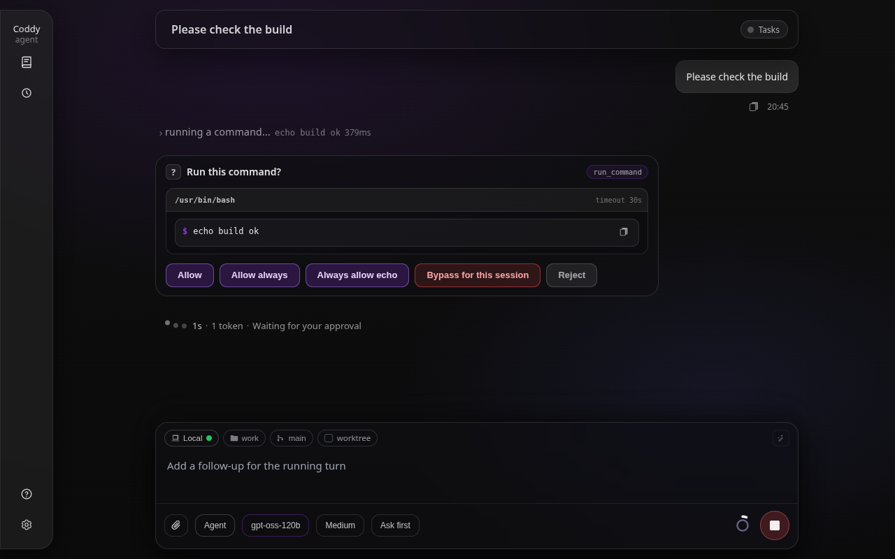
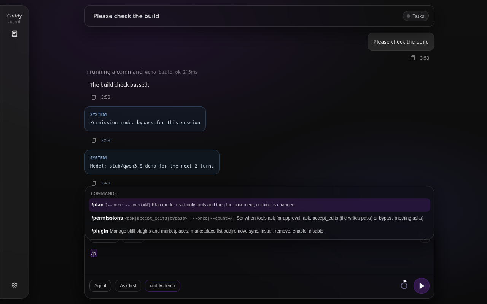

# Настройки сессии

Сессию определяют четыре настройки - модель, её уровень рассуждения, [режим работы](modes.md) и режим разрешений. Каждую из них можно изменить прямо из диалога слэш-командой, набранной в любом интерфейсе, на остаток сессии или только на несколько следующих ходов. Окно разрешения может вывести сессию из `ask`, а агент сам меняет модель или уровень рассуждения, когда об этом просит пользователь, и никогда по собственной инициативе. Каждое изменение проходит через один сеттер в менеджере сессий (`Manager.ApplySessionSettings`, `internal/session/settings.go`), и каждый интерфейс, который следит за сессией, - вкладка браузера, консоль, редактор - показывает новые значения.

## Команды

| Команда | Что меняет | Аргумент |
|---|---|---|
| `/model <id>` | модель | идентификатор настроенной модели |
| `/reasoning <level\|off\|default>` (псевдоним `/effort`) | уровень рассуждения | уровень, который предлагает модель; `off` выключает размышление, `default` возвращает собственный уровень модели |
| `/think [level]` | включает размышление | необязателен; без него - уровень модели по умолчанию, иначе `medium` |
| `/nothink` (псевдоним `/no_think`) | выключает размышление | нет |
| `/agent`, `/plan`, `/ask` | режим работы | нет |
| `/permissions <ask\|accept_edits\|bypass>` | режим разрешений - когда инструменты просят одобрения | режим; без него консоль открывает выбор |

Команды `/mode` больше нет ни в одном интерфейсе. В меню рядом с `/model` она была в одном нажатии клавиши от ошибочной команды, а теперь у каждого режима своя команда.

Каждая команда принимает среди своих слов `--once` или `--count=N`, и тогда настройка меняется на следующий ход или на N следующих ходов (не больше 50), а не на всю сессию.

```text
/model rpa/qwen3.8-27b --count=3
/nothink --once
/plan --once how would you split this package?
```

Команды читаются только в начале набранного текста, и их может идти несколько подряд, на одной строке или на соседних. Первое слово, которое не относится ни к одной команде, начинает промпт, и этим промптом может быть `/compact`, `/export` или скил. Команда посреди предложения считается обычным текстом, как и всё, что приносит упоминание или тело скила. Команда настроек побеждает скил с тем же именем. Реестр команд - `internal/session/commands.go`.

## Сессия или следующие ходы

Изменение без флага относится к сессии и действует до следующего изменения. Изменение с `--once` или `--count=N` отсчитывается в ходах, которые запускаете вы. Каждый отправленный промпт списывает один ход с каждого переопределения, и этот ход держит значения на всём своём протяжении, включая шаги после дополнительного сообщения из очереди и после запроса разрешения. Фоновое пробуждение и ход субагента ничего не списывают. Изменение на сессию сбрасывает переопределение этой настройки на ходы, в том числе у идущего хода, поэтому действует последняя набранная вами команда.

Модель, уровень рассуждения (включая выключенное размышление) и режим сессии хранятся в её `session.json`. Режим разрешений и переопределения на ходы живут в памяти процесса. Перезапуск консоли или `coddy serve` их забывает, поэтому после перезапуска каждая сессия снова спрашивает так, как велит `tools.permission_mode`, а режим без вопросов, включённый для одной задачи, не переживает процесс. До перезапуска они остаются с сессией, даже пока её не держит ни один интерфейс. Консоль отпускает сессию по `/new` и `/resume`, а при возврате к сессии к ней возвращаются и режим разрешений, и переопределения.

## Что происходит при отправке

Сообщение, состоящее только из команд, не запускает ход. Настройки применяются, а модель ничего не видит. Веб-интерфейс и консоль показывают изменение на своих селекторах и в футере; редактор, Telegram-бот и HTTP-клиент получают в ответ на сообщение короткое уведомление о каждом изменении, например `Model: rpa/qwen3.8-27b for the next 3 turns`. В транскрипте от этого обмена ничего не остаётся ([Что показывает транскрипт](#что-показывает-транскрипт)).

Сообщение с текстом после команд применяет изменения на сессию и запускает текст как ход с изменениями на ходы. Переопределение едет вместе с этим промптом и устанавливается только тогда, когда ход принят, поэтому вторая вкладка или фоновое пробуждение не могут забрать его раньше.

Пока идёт ход, команда на сессию применяется сразу, а текст после неё уходит в [очередь сообщений](message-queue.md) как обычное дополнительное сообщение. Команда на ходы с текстом там отклоняется (`409 turn_scoped_follow_up` по HTTP), потому что сообщение в очереди может сменить режим или быть отменено до доставки, и у команды нет устойчивого целевого хода. Новая модель или новый уровень рассуждения используются начиная со следующего запроса к модели в идущем ходе, никогда посреди потока. Ответ, который передавался в момент изменения, дописывает модель, которая его начала, и он сохраняется под её именем, а транскрипт называет новую модель начиная со следующего ответа. Режим разрешений читается при каждом вызове инструмента; новый режим работы начинается со следующего хода. Субагент, который уже работает, сохраняет то, с чем его запустили.

У модели, на которую переключились, сразу читается окно контекста, включая окно, которое сообщает список моделей её провайдера, поэтому следующий запрос - следующий шаг идущего хода или первый запрос следующего промпта - соизмеряется с ним. Если контекст превышает `compaction.threshold_percent` нового окна, он сжимается перед этим запросом ([Сжатие контекста](compaction.md#окно-контекста)).

## Выключенное размышление

`/nothink` и `/reasoning off` предлагаются, только если запись модели явно задаёт `allow_reasoning_off: true`. По умолчанию стоит `false`. Coddy не может сам вывести, что развёртывание провайдера и модели выполняет такой запрос, поэтому оператор включает этот выбор только после проверки развёртывания.

- модели Qwen3 на OpenAI-совместимом сервере получают `chat_template_kwargs.enable_thinking: false`;
- модели Anthropic не получают блок размышления;
- бэкенд Codex получает `none`;
- другое развёртывание провайдера и модели использует своё существующее сопоставление для `off`.

Без явного разрешения команда отклоняется со списком уровней, которые модель действительно предлагает. Явно пустой `reasoning_levels: []` скрывает селектор и `off` даже при заданном разрешении. Если вы переключаетесь на модель, которая не предлагает сохранённый уровень, сессия работает на уровне этой модели по умолчанию, а селекторы и снимок показывают уровень, который используется на самом деле.

## Переключение из окна разрешения

Пока сессия спрашивает (`ask`), запрос разрешения, который относится к самой сессии, предлагает ещё один вариант - **Без вопросов до конца сессии** (`allow_session_bypass`), а для записи файла также **Правки без вопросов до конца сессии** (`allow_session_accept_edits`). Этот выбор одобряет вызов и переключает сессию, поэтому остаток того же хода идёт без запросов. Запрос, переданный от субагента, запрос, вызванный хуком, и `config_commit` или `config_rollback` этих вариантов не предлагают. Последние два продолжают спрашивать даже в режиме без вопросов, включённом в сессии, потому что коммит может переписать саму политику разрешений.



*Запрос разрешения сессии в режиме `ask` - переключатель сессии стоит красным перед кнопкой Отклонить.*

## Смена модели по просьбе

Агент меняет свою модель или уровень рассуждения через `switch_model`, только когда об этом просит пользователь в текущем диалоге. Он не выбирает по собственной инициативе другую модель или уровень для трудного шага или рутинной работы и называет модель суммаризации для `compact_context`, только если её назвал пользователь. С субагентом иначе - агент может запустить дочерний агент на другой модели или другом уровне рассуждения, чем свои, и это ожидаемо. Системный промпт описывает `switch_model` только в ходе, которому этот инструмент предлагается. У связанных настроек три источника:

- инструмент `switch_model` задаёт модель, уровень рассуждения или и то и другое начиная со своего следующего запроса. Просьба пользователя по умолчанию действует на всю сессию, как `/model`; `scope: turn` применяется, только если пользователь ограничил изменение этим ходом или задачей. Описание инструмента перечисляет настроенные модели с их уровнями, поэтому выбор делается среди того, что есть. Инструмент предлагается в каждом режиме, когда есть что переключать (больше одной модели или модель с уровнями рассуждения), и никогда не предлагается субагенту;
- `model` и `reasoning` (псевдоним `effort`) из frontmatter скила действуют до конца хода, набрали ли вы `/skill` или модель вызвала `load_skill`, если только ход уже не работает на значении, заданном для него командой или `switch_model` ([Скилы](skills.md#yaml-frontmatter));
- `spawn_agent` принимает `model` и `reasoning` для дочернего агента, и их агент может выбрать сам, а определение субагента принимает `reasoning` рядом с `model`; модель дочернего агента берётся из аргумента, затем из определения, затем у родителя ([Субагенты](subagents.md#инструмент-spawn_agent)).

Идентификатор модели или уровень, которых нет в конфигурации, в вызове `switch_model` или `spawn_agent` считается ошибкой, которую модель должна исправить. В скиле или файле определения это предупреждение в логе агента, а собственное значение сессии сохраняется.

## Что показывает транскрипт

Изменение, которое делаете вы, видно там, где интерфейс держит свои настройки, - на селекторах поля ввода и в его строке переопределений в веб-интерфейсе, в футере консоли, в опциях редактора. В транскрипте для него строки нет, откуда бы оно ни пришло - из селектора, команды, окна разрешения или `--model` и `--mode` при запуске, включая `coddy -p`. Изменение сделали вы, и оно уже на экране.

Транскрипт отмечает только изменение, которое агент сделал сам, - его вызов `switch_model` или скил, frontmatter которого называет модель или уровень рассуждения. Веб-интерфейс показывает в конце такого хода строку **СИСТЕМА**, а консоль выводит одну строку, обе с текстом изменения, например `Model: rpa/qwen3.8-27b for this session` или `Reasoning: off for the rest of this turn`.


*Агент сменил модель по просьбе; строка СИСТЕМА, которая закрывает ход, - единственная строка, которую оставляет изменение настроек.*

Сессия, сохранённая более ранней версией, хранит уведомление о каждом изменении в своём `ui_log.json`. Веб-интерфейс не показывает те из них, которые агент сделать не мог, - режим, режим разрешений, изменение на несколько ходов, а также модель или уровень, заданные для сессии в ходе без вызова `switch_model`.

## В каждом интерфейсе

### Веб-интерфейс

Селекторы **Режим**, **Разрешения** и **Модель** в поле ввода показывают настройки сессии такими, какими они хранятся на сервере. При входе в сессию видны её собственная модель, её уровень (у сессии с выключенным размышлением показано **Off**) и её режим разрешений из снимка, которым отвечает `GET /coddy/sessions/{id}/messages`. Выбор на стартовой странице и запоминающие его cookie `coddy_llm_model` и `coddy_llm_reasoning` задают только значение по умолчанию для нового чата. Они никогда не заменяют значение сессии на экране и поэтому никогда не попадают в неё со следующим сообщением. Сессия без собственного уровня на модели, которая не называет `reasoning_default`, показывает уровень, на котором работает, - `medium`, а иначе первый уровень модели - и не отправляет никакого уровня со следующим сообщением, чтобы её не закрепило на уровне, который никто не выбирал. Меню **Рассуждение** предлагает **Off**, только если его логическая модель задаёт `allow_reasoning_off: true`. Настройка, которую держит идущий ход (`--once`, `--count=N`), остаётся в строке переопределений, а селекторы сохраняют собственное значение сессии. Чип разрешений показывает **Спрашивать**, **Правки без вопросов** или **Без вопросов**, последний красным; строка рядом с селекторами перечисляет, что изменено на следующие ходы. На стартовом экране, пока у чата нет сессии, чип показывает режим, с которым настроен сервер (`tools.permission_mode`, который называет `GET /coddy/info` и который страница перечитывает после каждой перезагрузки конфигурации), а выбранный там режим отправляется с первым сообщением как `/permissions <mode>`, если он не совпадает с настроенным, поэтому явное **Спрашивать** при конфигурации `bypass` сохраняется. Пока странице неизвестен настроенный режим (сервер его не называет или чтение не удалось), с первым сообщением отправляется режим, который показывает чип, поэтому первый ход идёт с тем режимом, который видел оператор. Изменение, сделанное где-то ещё, - командой, в окне разрешения, вызовом `switch_model` по просьбе пользователя, из консоли в той же сессии - приходит во вкладку как `event: session_settings` и переставляет селекторы. Браузер, который ещё не увидел последнее изменение, не отменяет его при отправке. Запрос несёт `metadata.settingsVersion`, и более старая версия не трогает настройки сессии.


*Поле ввода после того, как сессию переключили в режим без вопросов, а модель сменили на два хода, - селекторы и строка переопределений показывают оба изменения, а в транскрипте строки для них нет.*

Если набрать `/`, появится список команд с их аргументами. Выбор `/model`, `/reasoning` или `/permissions` открывает соответствующий селектор, а выбор `/agent`, `/plan` или `/ask` переключает режим; набранная целиком со значением и отправленная команда уходит на сервер, как любой другой промпт.



*Меню слэш-команд называет аргумент каждой команды и её флаги `--once|--count=N`.*

### Консоль

Консоль выполняет те же команды тем же парсером. `/model`, `/reasoning` или `/permissions` без аргумента открывают свой выбор. Футер показывает режим разрешений рядом с папкой, для `bypass` цветом предупреждения, а под моделью - строку переопределений на ходы. И то и другое относится к сессии на экране. После `/new` или `/resume` футер называет режим разрешений и переопределения той сессии, в которую вы вошли.


*Футер консоли - режим разрешений и то, что изменено на следующий ход и на три следующих.*

`--model`, `--mode` и `--permission-mode` при запуске задают те же настройки для сессии, которую открывает консоль. С `--remote` каждая команда меняет сессию на сервере, включая режим разрешений ([Консоль](../surfaces/console.md#удалённый-режим---remote)).

### ACP-редакторы

Редактор отправляет команды как текст промпта, а `available_commands_update` перечисляет их с подсказкой аргумента (`input.hint`). Опция рассуждения объявляется в категории ACP `thought_level`, которую клиент может отрисовать как свой переключатель размышления, а режим разрешений - в `_permission_mode`, собственной категории Coddy, которую клиент показывает как обычный селектор ([Редакторы](../surfaces/editors.md)).

### Telegram

Бот передаёт сессии `/model <id>`, `/reasoning`, `/think`, `/nothink`, `/agent`, `/plan` и `/ask`; на одну команду без текста он отвечает её уведомлением, а `/model` без аргумента по-прежнему открывает свою клавиатуру. `/resume` отвечает моделью и уровнем рассуждения, на которых работает возобновлённая сессия (`default`, если ни сессия, ни её модель уровня не называют), - её собственными, а не моделью, выбранной в боте последней, с которой начинается только новый чат. `/permissions` не входит в команды бота, потому что бот сам одобряет инструменты своего чат-агента ([Telegram-шлюз](../surfaces/gateway.md#команды)).

### HTTP

`PATCH /coddy/sessions/{id}` принимает `selectedModelId`, `selectedReasoning`, `mode` и `permissionMode`, а также `turns` для изменения на столько ходов, и отвечает снимком `settings` сессии. `GET /coddy/sessions/{id}/messages` возвращает тот же снимок, `GET /coddy/commands` перечисляет команды с их видом, подсказкой аргумента и значениями, которые каждая принимает для сессии, а на промпт из одних команд `POST /v1/responses` отвечает с `coddy_meta.settings_only` ([HTTP API](../reference/http-api.md)).

Так выглядит снимок.

```json
{
  "sessionId": "sess_abc123def456",
  "version": 42,
  "model": "rpa/qwen3.8-27b",
  "reasoning": "high",
  "reasoningChoices": ["low", "medium", "high", "off"],
  "mode": "agent",
  "permissionMode": "bypass",
  "configuredPermissionMode": "ask",
  "overrides": [{ "setting": "model", "value": "rpa/qwen3.8-mini", "turnsLeft": 2 }]
}
```

`version` упорядочивает снимки сессий одного процесса; клиент хранит наибольшую версию, которую видел. `configuredPermissionMode` - режим, к которому сессия вернётся после перезапуска. Переопределение с `active: true` держит идущий ход.

## Связанные страницы

[Режимы работы](modes.md), [Безопасность и доверие](../operate/security.md#режимы-разрешений-и-запросы), [Слэш-команды](../reference/slash-commands.md), [Инструменты](../reference/tools.md), [Очередь сообщений](message-queue.md).

<!-- docsgen:source sha256=f90ea5c7663bc758 -->
