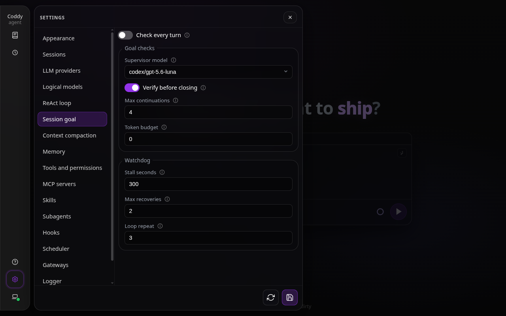
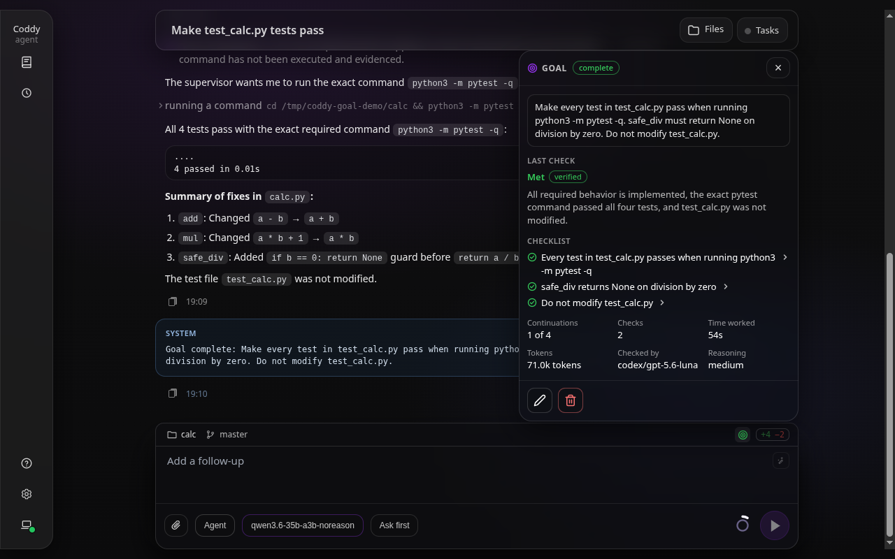
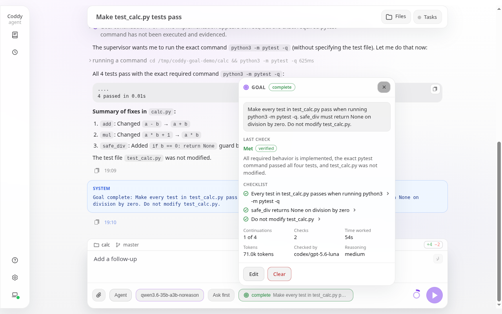
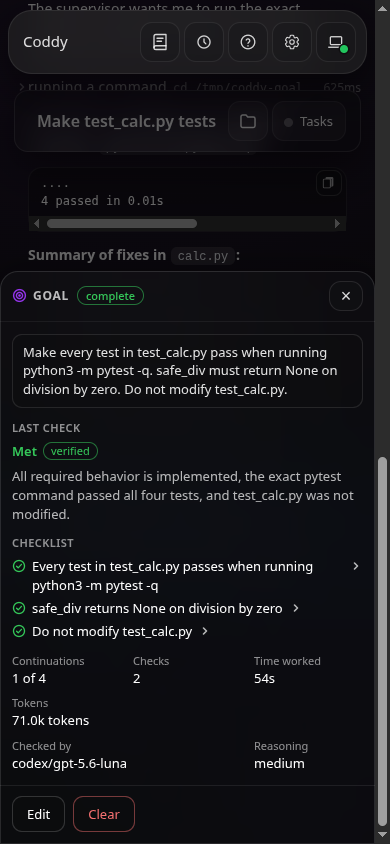

# Цель сессии и супервизор

С целью сессии агент продолжает работать, пока вторая модель не подтвердит результат. `/goal <objective>` ставит цель и сразу запускает работу над ней. После каждого хода **супервизор** сверяет с формулировкой цели то, что ход сделал на самом деле. Если работа осталась, он запускает ещё один ход и называет в нём, чего не хватает. Супервизор останавливается, когда проверка пройдена, когда работе нужно ваше участие или когда исчерпан бюджет. **Сторож** следит за теми же ходами и ловит простои и зацикливания.

Работу оценивает вторая модель, исполнитель сам себе оценок не ставит. Супервизор судит по подтверждениям, которые записал харнес (вызовам инструментов, их результатам, изменённым файлам), а итоговое сообщение исполнителя считает заявлением. Перед тем как закрыть цель, **верификатор**, субагент с доступом только на чтение, открывает рабочую папку и подтверждает каждое требование.

## Команды

| Команда | Что делает |
|---|---|
| `/goal [-m\|--model <id>] [-r\|--reasoning <level>] <objective>` | Ставит цель, заменяя прежнюю, если она была, и сразу запускает над ней ход. Формулировка цели ограничена 4000 символами; более длинную спецификацию положите в файл и назовите его. `--model` и `--reasoning` выбирают модель и уровень рассуждения, которые проверяют эту цель, как у `/compact --model`: настроенную `models[].model` (или её часть, которая совпадает ровно с одной моделью) и уровень, который эта модель предлагает (`default` - её собственный). `-m` и `-r` - короткие формы. |
| `/goal` | Показывает цель: статус и его причину, сколько продолжений использовано, вердикт последней проверки и то, что ещё не сделано. Веб-интерфейс и консоль вместо этого открывают своё меню цели. |
| `/goal pause` | Останавливает автоматические продолжения, но сохраняет цель. Ход, который над ней работает, доводит до конца текущий шаг. |
| `/goal resume [-m\|--model <id>] [-r\|--reasoning <level>]` | Снова делает активной цель, которая стоит на паузе, заблокирована или упёрлась в лимит, выдаёт ей новый бюджет продолжений и токенов и запускает ход. Цель сохраняет проверяющую модель, с которой её поставили, если параметры не называют другую. |
| `/goal clear` | Удаляет цель. Так же работают `stop`, `off`, `cancel`, `reset` и `none`. |

Команды работают в поле ввода веб-интерфейса, в консоли, в ACP-редакторах, в `POST /v1/responses`, в Telegram и Pachca. В мессенджере ставить, приостанавливать, возобновлять и сбрасывать цель могут только админы бота, а показать её может любой допущенный пользователь. Над целью работают в режиме "Агент". Цель хранится вместе с сессией и поэтому переживает перезапуск, а сжатие контекста сохраняет в сводке продвижение к ней.

## Как идёт работа над целью

1. **Старт.** `/goal <objective>` сохраняет цель и запускает ход. Его сообщение велит исполнителю начать сразу, повторяет формулировку цели и задаёт правила: опираться на подтверждения, доказывать утверждения результатами инструментов, не ослаблять проверки ради того, чтобы их пройти, и прямо говорить, когда работе нужно ваше участие.
2. **Проверка.** Когда ход заканчивается, супервизор получает формулировку цели, список требований из своей предыдущей проверки и **сводку подтверждений**. В сводке перечислены все вызовы инструментов с момента постановки цели, с аргументами, началом и концом результата каждого, а также файлы, которые изменили ходы, и тревожные признаки, например правки тестов, тестовых данных или файлов CI и добавленные маркеры пропуска или подавления. Последним идёт итоговое сообщение исполнителя с пометкой, что это заявления. Супервизор отвечает чек-листом требований и вердиктом:
   - `met` - каждое требование доказано приведённым результатом инструмента;
   - `not_met` - работа осталась, указаны следующие шаги;
   - `needs_user` - исполнитель задал вопрос, на который можете ответить только вы, ему не хватает доступа, или он нашёл противоречие между запросом и тестами;
   - `impossible` - цель невыполнима в этой рабочей папке.
3. **Верификация.** Вердикт `met` уходит верификатору, системному субагенту с инструментами только для чтения (`read`, `glob`, `grep`, `print_tree`), который работает на модели супервизора. Он читает файлы, на которых держится каждое требование, и отвечает в том же формате. Если он находит пробел, работа над целью продолжается по списку верификатора. Его запуск виден в панели "Задачи" сессии как **Goal verification**. Если сам верификатор не ответил, вердикт проверки остаётся в силе, а в причине сказано, что результат не подтверждён. `supervisor.verify: false` пропускает этот шаг.
4. **Продолжение.** При `not_met` следующий ход начинается с причины вердикта, того, что ещё не сделано, чек-листа, снова всей формулировки цели и израсходованного к этому моменту бюджета. Повтор формулировки не даёт долгой работе сползти к более лёгкой задаче.
5. **Остановка.** Цель получает статус `complete`, когда проверка (и верификатор) признают её выполненной, и `blocked` с вопросом, когда работе нужно ваше участие. Статус `limited` она получает, когда исчерпаны `max_continuations` или `token_budget`. Перед этой последней остановкой исполнитель получает один завершающий ход, без новой работы, только с итогом того, что сделано, что осталось и каким будет следующий шаг.

Сообщение, которое вы отправили, пока супервизор работает, идёт первым, а цель снова проверяется после его хода. Команда `/goal`, отправленная во время хода, при любом режиме очереди ждёт конца этого хода и выполняется раньше любого продолжения. Пауза, сброс или замена цели во время проверки действуют сразу, вердикт этой проверки отбрасывается, и продолжение не начинается. Если после хода остаётся работать фоновая команда или субагент с `notify_on_finish`, проверка хода откладывается, и следующий ход под надзором запускает пробуждение, которое сообщает об этой работе. Работу, которая никого не будит, не ждут, например системную задачу вроде запуска памяти, задачу, запущенную с `notify_on_finish: false`, или процесс, в котором некому разбудить агента. Остановка завершает работу, но статус цели не меняет. Ваше следующее сообщение снова проверяется по цели, если не поставить её на паузу командой `/goal pause`.

Ходы, которые запускает супервизор, вы не набирали. Каждый интерфейс показывает такой ход одной строкой, и вживую, и после перезагрузки: **Цель поставлена: ...**, **Продолжение по цели 2 из 10: тесты всё ещё падают**, **Восстановление по цели 1 из 2: ...**, **Работа над целью продолжена: ...**. Telegram и Pachca отправляют ту же строку отдельным сообщением, а ответ предыдущего хода приходит перед ней.

## Статусы

| Статус | Значение | Что его меняет |
|---|---|---|
| `active` | Конец каждого хода проверяется, незаконченная работа продолжается. | `/goal <objective>`, `/goal resume` |
| `paused` | Цель сохранена, ничего не проверяется и не продолжается. Причина говорит, кто поставил паузу: вы, лимит использования, ход с ошибкой или проверка, которая дважды не удалась. | `/goal pause`, меню, система |
| `blocked` | Работе нужно ваше участие, или два хода подряд закончились без единого вызова инструмента, или кончились попытки восстановиться после простоя или зацикливания. В причине записан вопрос. | супервизор |
| `complete` | Проверка признала цель выполненной, и верификатор подтвердил это, если смог ответить; у цели, которую верификатор не смог подтвердить, в уведомлении и последней проверке сказано "не проверено" и почему. | супервизор |
| `limited` | Бюджет продолжений или токенов исчерпан. | супервизор |

## Сторож

Пока идёт ход по цели, сторож видит каждое обновление, которое ход отправляет.

- **Простой.** Ход, который `stall_seconds` секунд ничего не отправляет, прерывается и получает ход восстановления. Таймер считает активностью любое обновление, будь то текст, рассуждение или вызов инструмента. Он ждёт, пока открыт запрос разрешения или вопрос, пока работает инструмент (у инструмента свой тайм-аут) и пока идёт фоновая работа. Строка модели с `stream: false` ничего не отправляет, пока отвечает, поэтому для неё таймер ждёт не меньше `timeout_ms` этой строки (плюс 30 с), а если строка его не задаёт, таймер выключен;
- **Зацикливание.** Каждый завершённый вызов инструмента превращается в отпечаток из имени, канонических аргументов и хеша результата. Когда последние операции складываются в цикл из одной, двух или трёх операций, который повторился `loop_repeat` раз, ход прерывается, и ход восстановления просит исполнителя подвести итог тому, что он пробовал, и сменить подход. Циклу из двух или трёх операций нужно не меньше двух полных кругов. Текст ассистента между вызовами зацикливание не скрывает. Тот же вызов с другим результатом считается продвижением, например прогон тестов, который падает иначе, или файл, прочитанный после изменения;
- **Застрявшие и упавшие ходы.** Ход, который прервал сторож, остановила собственная защита агента от зацикливания или который агент отказался продолжать, проверяется раньше всего остального, потому что зациклившемуся исполнителю часто нужно ваше участие. Вердикт `needs_user` или `impossible` блокирует цель с вопросом, а если работа осталась, ход восстановления называет её и просит исполнителя сменить подход или спросить вас. Временная ошибка провайдера, например 5xx, оборванный поток или замолчавший поток, получает ход восстановления без проверки. Лимит использования ставит цель на паузу. Любая другая ошибка тоже ставит её на паузу, и причиной становится текст ошибки.

Ходы восстановления расходуют лимит `max_nudges`, который действует на один запуск. Когда он исчерпан, цель блокируется с последней причиной.

## Конфигурация

Цели не нужна настройка. Без раздела `supervisor` или с пустым разделом работу проверяет собственная модель сессии, а все ограничения берутся по умолчанию.

```yaml
supervisor: {}
```

Все ключи со значениями по умолчанию.

```yaml
supervisor:
  enable: false              # check ordinary turns against the latest request too
  model: ""                  # the checking model; empty uses the session's model
  verify: true               # confirm a met verdict against the workspace
  max_continuations: 10      # automatic turns per goal, then a wrap-up turn
  token_budget: 0            # uncached input + output tokens per goal; 0 = no cap
  stall_seconds: 300         # 0 turns the stall timer off
  max_nudges: 2              # recovery turns after a stall, a loop or a failed turn
  loop_repeat: 3             # 0 turns loop detection off
```

Проверяющую модель в первую очередь выбирают для конкретной цели. `/goal --model <id> --reasoning <level>` важнее `supervisor.model`, а тот важнее модели сессии. `model` называет настроенную `models[].model`. Если ключ пуст, собственная модель сессии проверяет свою же работу. Без `--reasoning` проверка идёт на уровне `reasoning_default` проверяющей модели, то есть на том уровне, с которого начинается сессия на этой модели, а если модель его не задаёт, то на собственном уровне провайдера. Исследования моделей-судей показывают, что модель оценивает собственные ответы выше, поэтому модель другого семейства подходит лучше, даже если она меньше. Проверка идёт без инструментов, с теми же повторами и через тот же прокси, что и собственные вызовы агента. Если в ответе нет корректного JSON, его запрашивают ещё раз, а проверка, которая не удалась дважды, ставит цель на паузу. В веб-интерфейсе те же ключи редактирует раздел **Настройки → Цель сессии**.



*Настройки → Цель сессии (тёмная тема, 1280 px).*

`enable: true` подвергает тем же проверкам и обычные ходы, а формулировкой цели служит последний запрос. Для них ничего не сохраняется, и запуск в статусе `blocked` или упёршийся в лимит заканчивается уведомлением. Цель проверяется при любом значении `enable`.

## Цель во всех интерфейсах

- **Веб-интерфейс** - когда `/goal` ставит цель, на плашке над полем ввода, слева от счётчика изменений git, появляется метка-мишень в цвете статуса. Подсказка к ней называет статус и формулировку цели. Метка открывает меню цели, где есть формулировка, статус и его причина, последняя проверка с отметкой верификатора, чек-лист, числа, модель, которая проверяет цель (**Проверяет**), и уровень рассуждения, на котором идёт проверка (**Рассуждения**, собственный уровень цели или, если его нет, уровень модели по умолчанию), а также значки **Пауза**, **Продолжить**, **Изменить** (сохраняет проверяющую модель) и **Сбросить**. Голая `/goal` открывает то же меню. Если набрать `/goal --`, поле ввода дополняет `--model` настроенными моделями, а `--reasoning` - уровнями модели, которую называет `--model`; короткие `-m` и `-r` открывают те же списки;
- **Консоль** - футер показывает статус цели и число продолжений, а голая `/goal` открывает модальное окно цели с теми же сведениями (проверяющая модель в строке **Checked by**, её уровень в строке **Reasoning**) и действиями. С `--remote` и футер, и окно берут данные с сервера;
- **HTTP** - `GET`, `PATCH` (`{"status":"paused"}` или `{"objective":"..."}`) и `DELETE /coddy/sessions/{id}/goal`, события `session_goal` и `goal_turn` в потоке хода, `event: session_goal` в `GET /coddy/events` и `goal` в `GET /coddy/sessions/{id}/messages`. Подробности в разделе [HTTP API](../reference/http-api.md);
- **ACP-редакторы** - обновления сессии `session_goal` и `goal_turn`; редактор, который не отображает ни одно из них, всё равно получает ответ команды текстом.



*Меню цели, которую проверил супервизор и подтвердил верификатор (тёмная тема, 1280 px).*



*То же меню в светлой теме (1280 px).*



*На телефоне меню открывается нижней шторкой (тёмная тема, 390 px).*

## Сравнение с другими агентами

| | Coddy | Claude Code `/goal` | Codex `/goal` |
|---|---|---|---|
| Кто решает, что цель достигнута | вторая модель по сводке подтверждений, затем верификатор с доступом только на чтение по рабочей папке | малая модель по транскрипту, без инструментов | сам исполнитель через `update_goal` после проверки завершённости |
| Продолжение | отдельные ходы по цели, каждый повторяет формулировку цели и то, что осталось | внутри того же хода | автоматические ходы, пока статус активен |
| Исход "нужно ваше участие" | `needs_user` и `impossible` блокируют цель с вопросом | `impossible` сбрасывает её | `blocked` после трёх ходов, упёршихся в одно и то же препятствие |
| Бюджеты | продолжения, токены, ходы восстановления; в конце завершающий ход | нет, кроме ограничения на ходы без вызовов инструментов | токены, с завершающим сообщением |
| Сторож простоев и зацикливаний | да | нет | только прерыватели при отсутствии продвижения |

<!-- docsgen:source sha256=6c110464b229e16b -->
