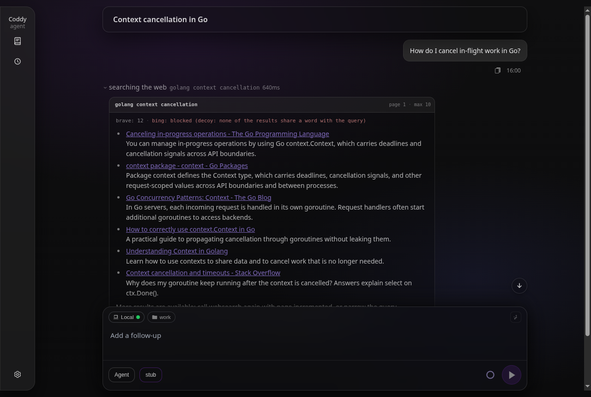

# Веб-поиск

Инструмент `websearch` опрашивает сразу несколько поисковиков и объединяет их ответы, а инструмент `webfetch` скачивает одну страницу и возвращает её в Markdown. Через них агент читает то, чего нет в репозитории.

Поисковики обращаются с программой не так, как с браузером. Один отвечает страницей проверки, другой отрисовывает результаты в браузере и отдаёт документ без содержимого, а третий на неугодный ему запрос отвечает полной страницей аккуратно оформленных результатов совсем на другую тему. Объединённый ответ, который скрывает, что из этого произошло, хуже отсутствия ответа - пустой список модель понимает как "в сети об этом ничего нет" и прекращает поиск. Поэтому каждый поисковик сообщает свой исход рядом с результатами.

## Что возвращается

```json
{
  "query": "golang context cancellation",
  "page": 1,
  "engines": [
    { "engine": "brave", "status": "ok", "results": 12, "took_ms": 620 },
    { "engine": "bing", "status": "blocked", "reason": "decoy: none of the results share a word with the query", "took_ms": 710 }
  ],
  "results": [
    {
      "title": "Canceling in-progress operations - The Go Programming Language",
      "url": "https://go.dev/doc/database/cancel-operations",
      "description": "You can manage in-progress operations by using Go context.Context...",
      "source": "brave"
    }
  ],
  "hint": "More results are available: call websearch again with page incremented, or narrow the query."
}
```

У каждого поисковика один из четырёх исходов.

`ok` - поисковик ответил, и его строки разобраны. `results` считает то, что он добавил в объединённый ответ, поэтому страница, которую уже дал другой поисковик, дважды не считается;
`empty` - поисковик вернул страницу результатов, которую парсер понял, и на ней ничего не оказалось. Только этот исход честно означает, что по этим словам в сети ничего нет;
`blocked` - поисковик вернул что-то кроме страницы результатов - статус не из 2xx, страницу проверки, разметку, которую парсер больше не распознаёт, или пачку строк, не связанных с запросом. `reason` говорит, что именно;
`error` - до поисковика вообще не удалось достучаться.

Когда заблокированы **все** поисковики, вызов завершается ошибкой вместо пустого списка, и ошибка называет каждый поисковик и его причину. На этом различии держится вся конструкция - сбой поиска сообщается именно как сбой поиска и не выдаётся за факт о мире.

`cached: true` помечает ответ, взятый из недавнего такого же поиска без повторного запроса.

### В веб-интерфейсе

Строка поиска в транскрипте показывает найденное, без JSON, приведённого выше. В её заголовке указаны запрос и все параметры, с которыми шёл поиск, - страница, число запрошенных строк (15, если вызов его не задал) и сайт, если он был, - а первая строка под заголовком говорит, как ответил каждый поисковик. Для ответившего там указано число результатов, для неответившего - исход и причина. Дальше идут найденные результаты в виде ссылок, каждый фрагмент на своей строке. Раскрытие строки загружает весь ответ сразу. Сама строка держит только первые строки вывода, и их занимает отчёт поисковиков, поэтому нажимать **Ещё**, чтобы увидеть результаты, не нужно.



*Раскрытая строка поиска - запрос и его параметры в заголовке, ответ каждого поисковика, каждый результат ссылкой*

## Поисковики

| Поисковик | Нужен ли ключ | Примечания |
|--------|-----------|-------|
| `brave` | нет (необязателен) | Включён по умолчанию, первый в порядке объединения. Читает публичную страницу результатов; с API-ключом (`brave_api_key` или `BRAVE_API_KEY`) вместо этого использует официальный Search API, где нет парсера, который мог бы сломаться. |
| `bing` | нет | Включён по умолчанию, второй. Клиенту, который ему не нравится, отдаёт набор посторонних результатов, и их ловит фильтр релевантности, описанный ниже. |
| `searxng` | нет, но нужен `searxng_url` | Ваш собственный экземпляр, к которому обращаются через его JSON API. Надёжный вариант, потому что он не ограничивает частоту запросов своему владельцу и никогда не подсовывает приманку. |
| `ddg` | нет | По умолчанию не опрашивается. С сервера оба его эндпоинта отвечают на любой запрос антибот-страницей HTTP 202, и она приходит как `blocked`; там, где DuckDuckGo вас ещё обслуживает, запрос, по которому у него ничего нет, приходит как `empty`. |
| `google` | нет | По умолчанию не опрашивается. Страница, которую получает неодобренный клиент, не содержит органических результатов ни при каком user agent, потому что результаты отрисовываются в браузере. |

Результаты объединяются в порядке перечисления поисковиков, а дубликаты убираются по нормализованному URL. Одна и та же страница, открытая через `www`, по `http`, с параметром кампании (`utm_*`, `fbclid`, `gclid` и подобные) или с завершающей косой чертой, даёт одну строку, а модели передаётся URL, который вернул её поисковик. Параметры, которые выбирают содержимое, а не указывают источник перехода, сохраняются, поэтому две ревизии одного файла дают два результата.

### Фильтр релевантности

Клиенту, который ему не нравится, Bing отвечает страницей, заголовок которой повторяет запрос, а десять строк посвящены другому - начинкам для пиццы на вопрос о Go, туристическому сайту на вопрос о репозитории GitHub и снова другой теме при следующем запросе. Дальше по цепочке такую строку уже ничем не отличить от настоящей.

Поэтому пачка оценивается целиком и только тогда, когда она достаточно велика, чтобы быть страницей результатов. Если поисковик вернул не меньше пяти строк и ни одна из них не имеет отношения к запросу, значит, на запрос он не ответил, и вся пачка отбрасывается с `status: blocked`, `reason: decoy`.

Слово запроса засчитывается щедро - как слово строки, как часть слова (на вопрос об `OOM` отвечает страница об `OOMKilled`) и с отброшенными окончаниями, так что `cancellation` совпадает с `cancel`. Проверка во всём склоняется к тому, чтобы сохранить результаты, потому что её ошибкой было бы отбросить настоящий ответ, тогда как у приманок, ради которых она существует, с запросом нет ничего общего ни по какой мере.

По той же причине решение принимается для всей пачки. Одна строка без единого слова запроса - обычное дело, страница с названием "Terminating programs" вполне отвечает на вопрос о том, как убить процесс. Целая страница таких строк - уже нет.

## Настройка

```yaml
tools:
  websearch:
    engines: [brave, bing]        # merge order; brave, bing, ddg, google, searxng
    engine_timeout_seconds: 8     # per-engine budget
    total_timeout_seconds: 20     # budget for the whole search
    max_concurrent_engines: 4     # how many engines are asked at once
    snippet_chars: 320            # per-result description cap
    cache_ttl_seconds: 300        # reuse an engine answer for this long; negative = off
    searxng_url: ""               # e.g. http://localhost:8080
    brave_api_key: ""             # official Brave Search API; or BRAVE_API_KEY
```

Имя поисковика, которое загрузчик не знает, считается ошибкой конфигурации, и такой бэкенд не пропускается молча; `searxng` без `searxng_url` отклоняется так же - `coddy -t` сообщает об обоих случаях с номером строки.

### Ключ Brave Search API

Ключ не обязательно хранить в `config.yaml`. Если `brave_api_key` пуст, поисковик читает переменную окружения `BRAVE_API_KEY`, поэтому ключ может прийти из оболочки, контейнера или `~/.coddy/.env`.

```bash
echo 'BRAVE_API_KEY=BSA...' >> ~/.coddy/.env
```

Ключ в файле важнее переменной, а `brave_api_key: ${BRAVE_API_KEY}` работает так же, как любая другая ссылка. Ни один из способов не раскрывает ключ. `config_get` и `coddy -t` печатают его как `<redacted>`, а сохранение из "Настроек" веб-интерфейса записывает ссылку `${BRAVE_API_KEY}` обратно ссылкой, а пустое поле - пустым и никогда не записывает ключ, который пришёл из окружения. Переменная читается, когда ход собирает настройки инструментов; ключ, добавленный в `.env` работающего `coddy serve`, начинает действовать после перезапуска, потому что `.env` читается при старте.

### Собственный SearXNG

[SearXNG](https://docs.searxng.org/) на своём сервере решает все проблемы, из-за которых ломается поисковик, читаемый скрейпингом. Он сам агрегирует поисковики, не ограничивает частоту запросов для машины-владельца, и ему никогда не подсовывают приманку.

```yaml
tools:
  websearch:
    engines: [searxng, brave]
    searxng_url: http://localhost:8080
```

Экземпляр должен отдавать JSON API, а в конфигурации по умолчанию он этого не делает, поэтому добавьте `json` в `search.formats` в его `settings.yml`. При неверной настройке он отвечает HTTP 403, и это приходит как `blocked` с этой причиной, а не маскируется под пустой список результатов.

В отличие от URL, который получает `webfetch`, этот адрес берётся из вашей собственной конфигурации, его задаёт не модель, а экземпляр на своём сервере обычно слушает `localhost` или адрес в локальной сети. Поэтому частные диапазоны разрешены намеренно - запрет на них отрезал бы именно те развёртывания, ради которых этот поисковик существует.

Запрещён диапазон link-local, где SearXNG не слушает, зато слушает облачный сервис метаданных. Имя хоста разрешается до этой проверки, потому что имя, указывающее туда, достигает его так же, как и сам адрес, а перенаправлениям поисковик никогда не следует - вы проверяете адрес, который настроили, и только его.

### Кэширование

Ответ одного поисковика на один запрос запоминается на `cache_ttl_seconds` (по умолчанию 300), поэтому модель, которая дважды обращается к одному и тому же поиску, не заставляет поисковик отвечать дважды.

Сбои запоминаются гораздо короче, и два их вида по-разному. Страница проверки липкая (поисковик отдаёт её и следующему вызову), поэтому она хранится 30 секунд - достаточно долго, чтобы остановить повтор внутри одного хода, и достаточно коротко, чтобы заметить восстановившийся поисковик. Недоступный поисковик запоминается на 5 секунд, и этого хватает, чтобы избавить от повторов в пределах одного хода и не скрыть хост, который снова доступен.

## Аргументы

| Аргумент | Значение |
|----------|---------|
| `query` | Обязательный. Поисковые слова на том языке, на котором, скорее всего, написан ответ. |
| `page` | Страница результатов, начиная с 1. Ведёт дальше по тому же списку результатов. |
| `max_results` | Сколько строк вернуть для этой страницы; по умолчанию 15, не больше 25. |
| `site` | Ограничить поиск одним доменом, например `go.dev`. Переводится в собственный синтаксис каждого поисковика. |

## Чтение страницы

`websearch` возвращает фрагменты, а фрагмент ещё не ответ. `webfetch` берёт один URL и возвращает статью в Markdown, извлекая её через readability, отказывается обращаться к частным сетям и localhost и проверяет каждое перенаправление по тем же правилам, прежде чем ему следовать, - см. [Инструменты](../reference/tools.md). Запрос он отправляет через клиент [`http_request`](http-requests.md) - инструмента для вызова API и всего остального, что не сводится к чтению страницы.

## Связанные страницы

[Инструменты](../reference/tools.md) - все встроенные инструменты и их аргументы;
[Конфигурация](../getting-started/configuration.md) - где лежит `config.yaml` и как его проверить;
[Режимы работы](modes.md) - `websearch` и `webfetch` доступны в любом режиме, включая `ask`, где разрешено только чтение;
[HTTP-запросы](http-requests.md) - `http_request`, curl агента, и клиент, на котором построен `webfetch`.

<!-- docsgen:source sha256=b0be300a671ef628 -->
