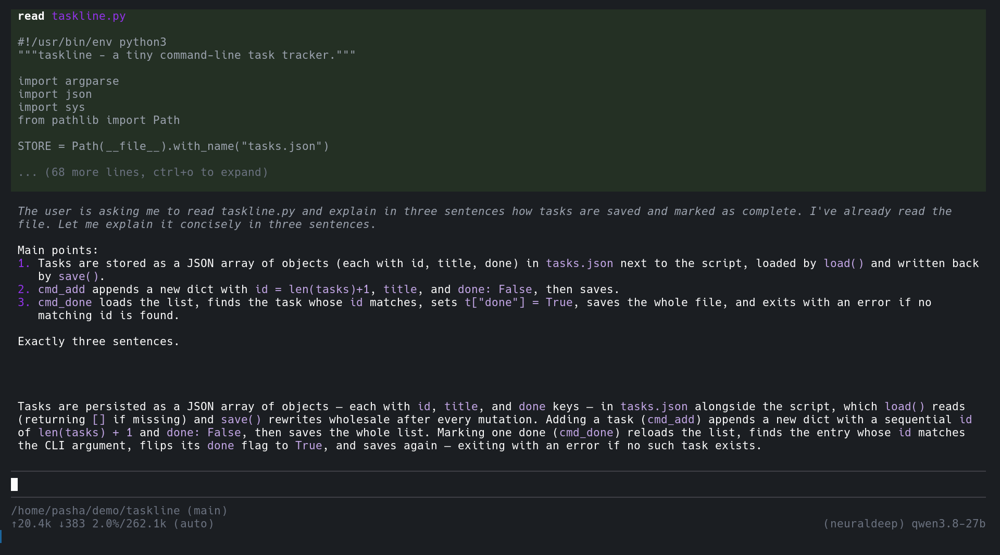
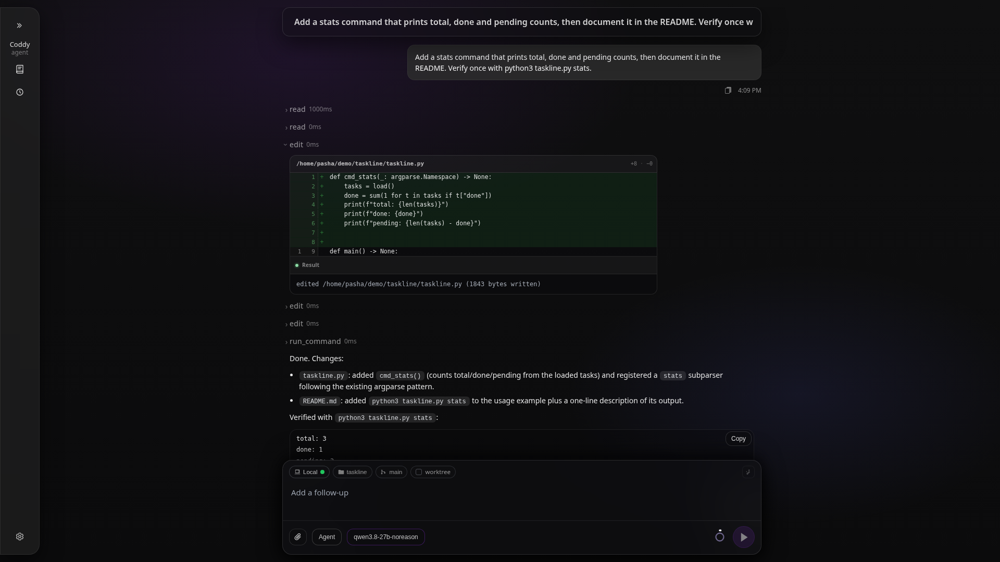

# Быстрый старт

Эта страница ведёт от чистой машины до первого ответа. Вы установите бинарник, дадите ему одну модель, проверите файл, а затем поговорите с агентом из терминала, из браузера и из редактора. Все остальные страницы предполагают, что эти шаги уже сделаны. Понадобятся пять минут и один ключ API.

## 1. Установка

По одной строке для каждой операционной системы. Пакеты для Linux, cask для Homebrew, параметры установщика и ручная установка описаны в [руководстве по установке](install.md).

**Linux / macOS**

```bash
curl -fsSL https://coddy.dev/install.sh | bash
```

**Windows (PowerShell)**

```powershell
irm https://coddy.dev/install.ps1 | iex
```

Установщик кладёт `coddy` в каталог из `PATH` (`~/.local/bin` в Unix, `%LOCALAPPDATA%\Programs\coddy` в Windows) и создаёт `~/.coddy/config.yaml` из `config.example.yaml` релиза, если файла нет. Терминал, в котором работал установщик, не перечитал свой профиль, поэтому откройте новый и проверьте.

```bash
coddy -v
```

В Debian, Ubuntu, Fedora и родственных системах можно вместо этого поставить `.deb` или `.rpm`, а контейнер запускает тот же бинарник как `coddy serve` ([Docker](docker.md)). Если команда не находится, см. [Устранение неполадок](troubleshooting.md#бинарник-не-находится-после-установки).

## 2. Подключение модели

Всё, что нужно знать Coddy, лежит в `~/.coddy/config.yaml` (`%USERPROFILE%\.coddy\config.yaml` в Windows). Файл, созданный установщиком, - копия `config.example.yaml`, где каждый раздел объяснён в комментариях. Для OpenAI-совместимого провайдера минимально нужны три блока.

```yaml
providers:
  - name: openai
    type: openai
    api_key: "${OPENAI_API_KEY}"

models:
  - model: "openai/gpt-5.6-terra"
    max_tokens: 8192
    reasoning_default: medium

agent:
  model: "openai/gpt-5.6-terra"
```

Блоки связаны тремя правилами. `name` провайдера становится префиксом id каждой модели, поэтому `models[].model` имеет вид `<provider name>/<model id as the API knows it>`. `agent.model` должен быть одной из записей `models`. А `api_key` - либо сам секрет, либо ссылка `${VAR}`, которая раскрывается при загрузке файла, либо пустое значение, и тогда в момент вызова читается `OPENAI_API_KEY` (имя провайдера в верхнем регистре плюс `_API_KEY`).

Положите ключ туда, где его найдёт ссылка, то есть в оболочку или в `~/.coddy/.env`. Этот файл читается до разбора конфигурации и никогда не перекрывает переменную, которую уже задала оболочка.

```bash
export OPENAI_API_KEY="sk-..."
# or, once and for all:
echo 'OPENAI_API_KEY=sk-...' >> ~/.coddy/.env
```

Любой OpenAI-совместимый сервер работает с `type: openai` и `api_base`, который включает `/v1`. Локальному Ollama или llama.cpp настоящий ключ не нужен.

```yaml
providers:
  - name: local
    type: openai
    api_base: "http://localhost:11434/v1"
    api_key: "~"
```

Anthropic, NeuralDeep (`coddy providers login neuraldeep` вместо ключа) и Codex (OAuth ChatGPT) описаны на странице [Конфигурация](configuration.md). Учётная запись Devin входит через `coddy providers login devin` ([Devin](../features/devin.md)).

## 3. Проверка файла

Два флага ещё до запуска чего-либо скажут, правилен ли файл, и их принимает каждая команда, которая загружает этот файл.

```bash
coddy -t          # the file against the schema and the loader's rules
coddy --dry-run   # the same, then the world it points at
```

`-t` выводит `<path>: valid` или каждую проблему в виде `file:line:column: what is wrong` со строкой `fix:` под ней и при ошибках завершается с кодом 1. `--dry-run` затем запрашивает у каждого провайдера список моделей (этот один запрос проверяет и адрес, и учётные данные) и сверяет с этим списком каждую запись `models[]`. Если всё настроено правильно, ответ занимает одну строку, `dry run: 0 errors, 0 warnings, N ok`. Подробности в разделах [Проверка файла](configuration.md#проверка-файла-из-командной-строки) и [Пробный запуск](configuration.md#пробный-запуск---проверка-того-на-что-указывает-файл).

## 4. Консоль

В каталоге проекта выполните команду без аргументов.

```bash
cd ~/src/my-project
coddy
```

Откроется интерактивная консоль. Наберите запрос, нажмите Enter и смотрите, как потоком появляются блоки инструментов, блок рассуждения и ответ. В режиме разрешений по умолчанию агент спрашивает вас, прежде чем выполнить команду или записать файл. Escape прерывает ход, `/quit` (или дважды Ctrl-C) закрывает консоль, а `coddy -c` снова открывает последнюю сессию этой папки.



*Завершённый ход в консоли. Блок инструмента `read`, блоки рассуждения, ответ и нижняя строка со счётчиками токенов и контекста, моделью и расходом учётной записи у её провайдера.*

Тот же агент работает и без терминала, для скрипта или задания cron.

```bash
coddy -p "Explain in three sentences how tasks are saved in this repository"
coddy --mode ask -p "Which files read config.yaml?"
git diff | coddy --mode ask -p "Review this change"
coddy -i brief.md
```

`-p` выводит ответ потоком в stdout, диагностику отправляет в stderr, при ошибке завершается с ненулевым кодом и сохраняет ход как обычную сессию. `--mode ask` оставляет ход только для чтения. Данные, переданные в `coddy -p "..."` через конвейер, прикладываются к промпту, а промпт, слишком длинный для командной строки, берётся из файла через `-i` или со stdin через `-p -` ([Разовый режим печати](../surfaces/console.md#одноразовый-режим-печати--p--prompt)). Всё, что умеет консоль, описано на странице [Консоль (TUI)](../surfaces/console.md).

## 5. Браузер

```bash
coddy serve
```

```text
coddy serve 1.2.31
  httpserver  http://127.0.0.1:12345  (no auth)
```

Откройте **http://127.0.0.1:12345/**. Пустой экран - новый чат. Выберите в поле ввода режим, модель, уровень рассуждения и режим разрешений, наберите текст и отправьте. Сессии лежат в одном и том же `~/.coddy`, какой бы интерфейс их ни создал, поэтому у консоли и браузера общая история. Настройки находятся по адресу `#/settings`, OpenAI-совместимый API - по `/v1/*`, а его Swagger UI - по `/docs/`.



*Сессия в веб-интерфейсе с развёрнутой строкой "правлю файл", которая показывает применённый дифф.*

Сервер намеренно слушает только loopback. Чтобы обращаться к нему с другой машины, привяжите его к более широкому адресу и потребуйте токен командой `coddy serve -H 0.0.0.0 --auth-token <secret>` (или ключами `httpserver.host` и `httpserver.auth_token` в файле). `coddy serve --daemon` оставляет сервер работать в фоне, а `coddy serve status | stop | restart` управляют им, см. [coddy serve и демон](../operate/serve.md).

## 6. Редактор через ACP

`coddy acp` работает по Agent Client Protocol через stdio, и именно так с ним работают Zed, VS Code, Obsidian и скрипты. Для Zed добавьте в `settings.json` одну запись с абсолютным путём к бинарнику (тем, который выводит `which coddy`, потому что редакторы не всегда наследуют ваш `PATH`).

```json
"agent_servers": {
  "Coddy": {
    "type": "custom",
    "command": "/home/you/.local/bin/coddy",
    "args": ["acp"]
  }
}
```

Затем выберите **Coddy** в разделе *External Agents* меню создания нового треда на панели агента. Режимы Coddy (`agent`, `plan`, `ask`), его настроенные модели и политика разрешений появляются в поле ввода Zed, а его скилы - в виде слэш-команд. Сессии и здесь те же, что в `~/.coddy`. VS Code, другие ACP-клиенты и эталонный клиент-скрипт описаны на странице [Редакторы](../surfaces/editors.md), а сам протокол - на странице [Протокол ACP](../reference/acp-protocol.md), с готовыми к запуску примерами в `examples/acp/`.

## Что дальше

- [Конфигурация](configuration.md) - все типы провайдеров, файл `.env`, переменные окружения и удалённое выполнение по SSH;
- [Режимы работы](../features/modes.md) - что разрешают режимы "Агент", "План" и "Чат" и как переключать их в каждом интерфейсе;
- [Скилы](../features/skills.md), [Правила](../features/rules.md) и [MCP-серверы](../features/mcp.md) - как проект учит агента своим соглашениям и инструментам;
- [Telegram-шлюз](../surfaces/gateway.md) - те же сессии из мессенджера;
- [Обновление](update.md) - `coddy update` и что происходит, когда бинарником владеет менеджер пакетов;
- [Устранение неполадок](troubleshooting.md) - если какой-то шаг выше прошёл не так, как написано.

<!-- docsgen:source sha256=75e0803c9823619d -->
