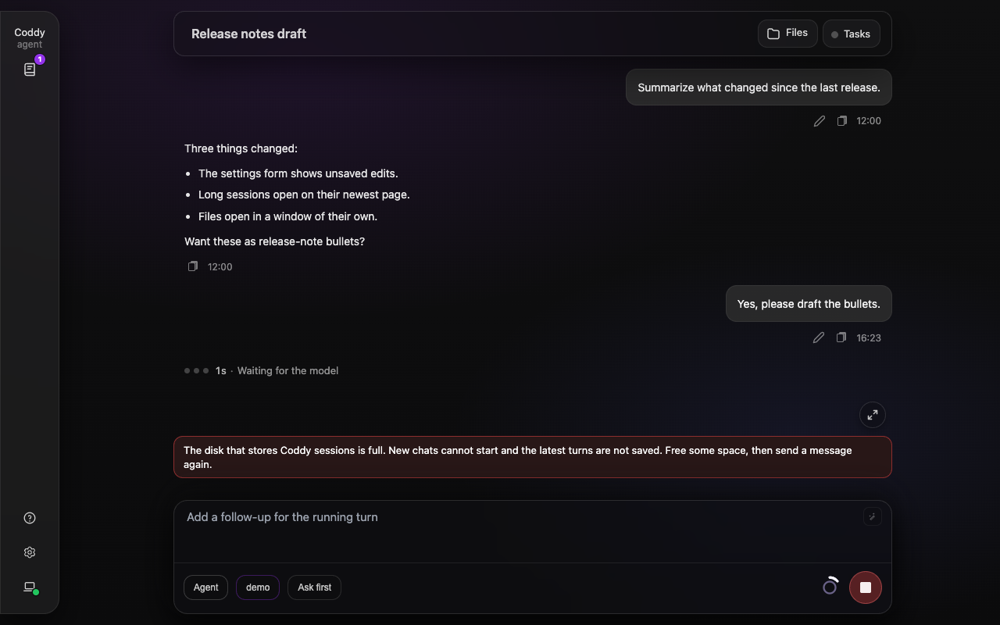

# Устранение неполадок

Что проверить, если шаг со страницы [Быстрый старт](quickstart.md) идёт не так, как написано: бинарник не находится, конфигурация не загружается, провайдер отвергает ключ, порт занят, нужного интерфейса нет в сборке, бот или хук молчит. Каждый раздел называет симптом, обычную причину и решение, а последний перечисляет, что собрать, прежде чем просить помощи. Команды одинаковы на всех платформах, если в разделе не сказано иное.

## Бинарник не находится после установки

**Симптом.** `coddy: command not found` в терминале, где запускался установщик, или редактор сообщает, что не может запустить `coddy acp`.

**Причина.** `install.sh` кладёт бинарник в `~/.local/bin` и записывает в rc-файл вашей login-оболочки защищённый блок, который добавляет этот каталог в `PATH`; терминал, из которого шла установка, этот файл заново не прочитал. В Windows `install.ps1` добавляет `%LOCALAPPDATA%\Programs\coddy` в пользовательский `PATH`, и терминал установки его тоже не видит. Редакторы и другие харнесы могут запускать агента через `cmd /c` или `sh -c` вообще без пользовательского `PATH`.

**Решение.** Откройте новый терминал или обновите текущий.

```bash
source ~/.zshrc            # or ~/.bashrc
export PATH="$HOME/.local/bin:$PATH"
coddy -v
```

```powershell
$env:Path = [Environment]::GetEnvironmentVariable("Path","User") + ";" + [Environment]::GetEnvironmentVariable("Path","Machine")
coddy -v
```

Указывайте ACP-клиентам абсолютный путь к бинарнику, а не полагайтесь на `PATH` (`/home/you/.local/bin/coddy`, `%LOCALAPPDATA%\Programs\coddy\coddy.exe`). Если копий несколько, `which coddy` называет ту, которую запускает оболочка; обновляйте именно её командой `coddy update`. `make install` из клона для пользователя без прав root кладёт бинарник в тот же `~/.local/bin`. Подробности на странице [Установка](install.md).

## Конфигурация не загружается, или `coddy -t` сообщает об ошибках

**Симптом.** Команда завершается с `load config: ...`, `coddy -t` выводит строки, которые начинаются с пути к файлу, или записанная вами настройка ни на что не влияет.

**Причина.** Загрузчик читает `$CODDY_HOME/config.yaml` (по умолчанию `~/.coddy`); если этого файла нет, он берёт `config.yaml` из текущего каталога, а если нет ни того ни другого, работает на встроенных значениях по умолчанию. Поэтому файл, отредактированный не в том месте, ничего не меняет. Декодирует он нестрого. Неизвестный ключ или ключ с опечаткой (`enabled` вместо `enable`) игнорируется, а не отвергается, а значение неверной формы проявляется позже как странное поведение. Файл, который не разбирается, при обычной загрузке восстанавливается из `config.yaml.bak`; проверка ниже этого не делает, поэтому сообщает о файле на диске.

**Решение.** Запустите проверку так, как файл загрузила бы сбойная команда; `--config PATH` и `--home DIR` выбирают его так же, как при запуске.

```bash
coddy -t
coddy serve -t
```

Каждая проблема выводится в виде `file:line:column: what is wrong`, под ней с отступом идёт строка `fix:`, а если в схеме есть описание поля, то и строка `doc:`. Синтаксическая ошибка указывает строку, на которой разбор файла останавливается, а не ту, на которую жалуется парсер, и запуск выводит ту же строку. При ошибках код выхода равен 1; предупреждения (`yes` для булева значения, отсутствующий заголовок `# yaml-language-server:`) проверку никогда не проваливают, а отсутствующий файл считается ошибкой. Если файл чистый, сделайте следующий шаг.

```bash
coddy --dry-run                 # the problems and one status line
coddy --dry-run --test-config   # the config report and every probe
```

`--dry-run` проверяет то, на что указывает файл: каталоги, список моделей каждого провайдера, исполняемые файлы stdio MCP-серверов, токен Telegram, а для `coddy serve` ещё и адреса прослушивания. Форматы отчёта и правила описаны на странице [Конфигурация](configuration.md#проверка-файла-из-командной-строки).

## Провайдер отвергает ключ или идентификатор модели

**Симптом.** Ход заканчивается ошибкой аутентификации или ошибкой неизвестной модели от провайдера; `coddy --dry-run` сообщает `providers[<name>]: cannot reach ...` или `models[<id>]: not in the model list of provider <name>`; `coddy providers list` выводит строку, которая начинается с `!`.

**Причина.** Должны сойтись три вещи. Первый сегмент каждого `models[].model` должен совпадать с одним из `providers[].name` (буквы, цифры, дефис и подчёркивание, первой идёт буква), а `agent.model` должен быть одной из записей `models`; иначе загрузчик сообщает `models[...]: unknown provider`. Ключ ищется в таком порядке: буквальный `api_key` или ссылка `${VAR}`, раскрытая при загрузке файла, затем stdout команды `api_key_command`, затем переменная окружения `NAME_API_KEY`, где `NAME` - имя провайдера в верхнем регистре с заменой дефисов на подчёркивания (`my-proxy` читает `MY_PROXY_API_KEY`). Ссылка на незаданную переменную раскрывается в пустую строку, и запрос уходит без учётных данных. Строка `type: openai` без `api_base` обращается к самому OpenAI; локальному или стороннему серверу нужен `api_base` с `/v1`, а идентификатор модели должен быть из тех, что этот сервер перечисляет.

**Решение.**

```bash
coddy providers list     # every provider with the credential source requests actually use
coddy --dry-run          # asks each provider for its model list, checks every models[] entry
```

`providers list` предупреждает о строке `openai`, которая направлена на официальный эндпоинт, но ничего не может предъявить; `--dry-run` называет адрес, к которому обращался, а для модели, которой нет в списке сервера, перечисляет идентификаторы, которые в нём есть (это предупреждение, потому что некоторые серверы обслуживают больше моделей, чем перечисляют). Положите ключ в `~/.coddy/.env` (`OPENAI_API_KEY=sk-...`), он читается раньше файла конфигурации и никогда не перекрывает значения из оболочки. Строку NeuralDeep с отвергнутым ключом чинит `coddy providers login neuraldeep`, строку Codex - `coddy providers login codex`. Описание полей - в [справочнике config.yaml](../reference/config.md#providers).

## Порт 12345 занят, или API не запущен

**Симптом.** `coddy serve` завершается с ошибкой bind, `coddy serve --dry-run` сообщает об адресе `httpserver` вместе со строкой, которая его задала, или `http://127.0.0.1:12345/` отказывает в соединении, хотя процесс работает.

**Причина.** Адрес берётся из `-H` / `-P`, затем из `httpserver.host` / `httpserver.port`, затем используется `127.0.0.1:12345`. Порт держит другой процесс - часто это запущенный раньше `coddy serve --daemon`, - или HTTP API выключен для этого процесса через `httpserver.enable: false` или `--http=false`. По умолчанию сервер слушает loopback, поэтому браузер с другой машины получает отказ, и так задумано.

**Решение.**

```bash
coddy serve status            # a daemon already up? then: coddy serve stop
coddy serve --dry-run         # binds each listen address once and releases it
coddy serve -P 12346          # or httpserver.port in the file
```

Для доступа с других машин слушайте более широкий адрес и требуйте токен, например `coddy serve -H 0.0.0.0 --auth-token <secret>` (или `CODDY_HTTP_TOKEN`, или `httpserver.auth_token`); без токена процесс предупреждает, что доступен без аутентификации. Адрес прослушивания - единственная настройка, которую работающий процесс не может принять на ходу. Под `--daemon` воркер сам перезапускается на новом адресе (код выхода 75 просит диспетчер о замене), так же поступает пользовательский сервис systemd из `coddy serve install`, а процесс на переднем плане перезапустите сами. Под `--daemon` о занятом порте сообщается в терминале, где набрали команду, и попытки повторяются, пока порт не освободится. См. [coddy serve и демон](../operate/serve.md) и [HTTP API](../reference/http-api.md#флаги-командной-строки).

## Нужного интерфейса нет в сборке

**Симптом.** `coddy serve` отказывается запускаться с `<key> is true but this binary has no <surface> support (rebuild with -tags <tag>)`; `coddy` без аргументов выводит справку по использованию вместо консоли, а `coddy cli` отвечает `interactive console is not built in`; `coddy serve`, в котором ничего не включено, сообщает `no subsystem is enabled`.

**Причина.** Консоль, HTTP API, веб-интерфейс, планировщик, субагент памяти, шлюз мессенджеров и релей роя подключаются тегами сборки Go. Обычный `make build` (или `go build`, или `go install ...@latest`) собирает облегчённый бинарник для ACP без них. `coddy serve` считает включённую подсистему, которую бинарник не может запустить, ошибкой, а не предупреждением, поэтому бот, который иначе молча остался бы офлайн, отвергается с указанием имени.

**Решение.** Возьмите релизную сборку - архивы GitHub Release, пакеты `.deb` и `.rpm` и Homebrew cask собраны со всеми тегами, а Docker-образ включает API, веб-интерфейс, планировщик, субагент памяти, консоль и шлюз, - или соберите бинарник сами.

```bash
make build TAGS="http ui scheduler memory cli gateway swarm"
```

Для `ui` нужны Node.js и npm (Makefile сначала запускает `ui-build`). `coddy serve --dry-run` сообщает об интерфейсе, без которого собран бинарник, ничего не запуская. Справочник тегов - на странице [Сборка из исходников](../contributing/build.md#справочник-тегов-сборки).

## Веб-интерфейс отдаёт API, но не страницу

**Симптом.** `GET /` возвращает короткий текстовый 404, а `/docs/`, `/v1/models` и остальной API работают.

**Причина.** Либо бинарник собран с `http`, но без `ui` (одностраничное приложение встраивается при сборке из ресурсов, которые `make ui-build` генерирует через npm), либо `ui.enable: false` намеренно запускает сервер в режиме только API.

**Решение.** Пересоберите бинарник с обоими тегами, как минимум `make build TAGS="http ui"`, с Node.js и npm в `PATH`; проверьте `ui.enable` в файле. После пересборки обычная перезагрузка страницы в браузере подхватывает новые ресурсы. Релизные бинарники содержат интерфейс. См. [Сборка из исходников](../contributing/build.md) и [HTTP API](../reference/http-api.md).

## MCP-сервер не запускается

**Симптом.** Сессия стартует, но предупреждение называет сервер пропущенным, и его инструментов нет в списке модели; в разделе **Настройки → MCP-серверы** у сервера видна кнопка со щитом.

**Причина.** Сервер, описанный в `<workspace>/.coddy/mcp.json`, пришёл вместе с чекаутом, поэтому при политике по умолчанию `mcp.project_trust: ask` он не запускается, пока вы не одобрите именно это описание для этой рабочей папки. Предупреждение называет сервер, рабочую папку, дайджест и команду, которая его одобряет, а одобренная запись, которую переписали, теряет одобрение. Серверы из `config.yaml` и `~/.coddy/mcp.json` не проверяются, но их команда всё равно должна быть в `PATH`, а сервер с пометкой `disabled: true` (`"disabled": true` в mcp.json) не подключается. Сервер, который не смог запуститься, никогда не блокирует сессию, она продолжается с предупреждением.

**Решение.**

```bash
coddy mcp list               # scope, trust state and the command of every merged server
coddy mcp trust <name>       # prints the declaration, then records the receipt
coddy --dry-run              # resolves stdio commands in PATH, contacts remote servers
```

`coddy mcp list` и `trust` принимают `--cwd DIR` для другой рабочей папки. По HTTP те же решения принимаются через `POST /coddy/mcp/{name}/trust`, а в веб-интерфейсе щитом. `coddy serve --mcp-project-trust allow` (или `coddy acp`) переопределяет политику для одного процесса, так и поступают задания CI. Расписки хранятся в `~/.coddy/mcp-trust.json`. Руководство - [MCP-серверы](../features/mcp.md#доверие-к-рабочей-папке-для-серверов-проекта).

## Telegram-бот молчит

**Симптом.** Бот никогда не отвечает, или нажатие `/model` либо `/resume` ничего не меняет.

**Причина.** В порядке частоты: в бинарнике нет тега шлюза (ошибка при запуске называет тег); `gateways.telegram.enable` равен true, но токен не удалось получить (шлюз отказывается запускаться и просит задать `gateways.telegram.token` или `TELEGRAM_BOT_TOKEN`); отправителю не разрешено писать боту - `default_access: admins` или `group:<name>` молча отбрасывает всех остальных, а в `admins` должен быть ваш числовой id пользователя Telegram; сообщение пришло в группе, и к боту не обращались (в группах он реагирует только на @упоминание, ответ на его собственное сообщение или `/clear`); того же бота опрашивает другой процесс, а Telegram отдаёт каждое обновление только одному long poll. Если на текст бот отвечал, а нажатия игнорировал и на уровне `debug` ничего не было, дело было в подписке. Telegram помнит последний `allowed_updates`, который запросил бот, и токен, который когда-то работал под другим фреймворком, может быть подписан только на сообщения. Coddy запрашивает `message` и `callback_query` при каждом опросе с тех пор, как сам на это наткнулся; `curl https://api.telegram.org/bot<token>/getWebhookInfo` показывает, что действует сейчас.

**Решение.** `coddy --dry-run` проверяет токен через Bot API и называет бота. Подключённый бот пишет в лог `telegram bot connected` на уровне `info`. Чтобы найти отброшенное обновление, поднимите уровень только этого компонента.

```bash
coddy serve --log-level "info,gateway.telegram=debug"
```

Или сделайте то же в файле, в `logger.levels`. На уровне `debug` каждое обновление записывается с причиной, по которой оно отброшено (доступ запрещён, чат только для администраторов, сообщение в группе, адресованное не боту, переполненная очередь). Тишина на `warn` и пустота на `debug` значат, что обновление вообще не пришло, поэтому проверьте токен, списки доступа и другие процессы, опрашивающие бота. Руководство - [Telegram-шлюз](../surfaces/gateway.md#отладка-чата).

Чтобы отделить проблемы Telegram от проблем бота, запустите бота с поддельным Bot API из [tgfake](https://github.com/EvilFreelancer/tgfake), задав `CODDY_TELEGRAM_API_BASE`. Сообщения вы отправляете со страницы на своей машине, каждый вызов Bot API попадает в список, а сбой можно внести по требованию. Руководство - [Отладка с поддельным Bot API](../surfaces/gateway.md#отладка-на-поддельном-bot-api).

## Хуки или определения субагентов игнорируются

**Симптом.** Хук в `<workspace>/.coddy/hooks.json` (или в `.claude/settings.json` от Claude Code) никогда не запускается, а транскрипт показывает уведомление о том, что файл хуков задержан; `spawn_agent` отвечает, что определение взято из файла проекта, не одобренного для этой рабочей папки; `coddy hooks list` или `coddy agents list` показывает `needs_approval`.

**Причина.** Файлы в cwd сессии и ниже относятся к области проекта и подчиняются `hooks.project_trust` и `subagents.project_trust`. При значении по умолчанию `ask` они разбираются и попадают в список, но ничего не запускается, пока вы не одобрите именно этот файл для этой рабочей папки на машине, где работает Coddy; расписка привязана к дайджесту файла, поэтому после правки файла одобрение запрашивается снова. Ваши собственные файлы (`~/.coddy/hooks.json`, `${CODDY_HOME}/agents`) одобрения не требуют. `hooks.enable: false` или `subagents.enable: false` полностью отключает функцию, из файла настроек Claude Code читается только ключ `hooks`, а `spawn_agent` в режиме "Чат" вообще не предлагается.

**Решение.**

```bash
coddy hooks list [--cwd DIR]
coddy hooks trust <file>        # e.g. .coddy/hooks.json
coddy agents list [--cwd DIR]
coddy agents trust <name>
```

Обе команды `trust` выводят то, что собираются одобрить, и записывают расписку (`~/.coddy/hooks-trust.json`, `~/.coddy/subagents-trust.json`). Из удалённой консоли или ACP-клиента одобрение выполняется на сервере, через `POST /coddy/hooks/trust` и `POST /coddy/subagents/{name}/trust` с рабочей папкой сессии в `cwd`. Раздел веб-интерфейса "Настройки > Субагенты" показывает определения и одобряет определение проекта щитом в его строке, а расписка записывается на сервере для рабочей папки чата на экране. Чекаут, которому вы уже доверяете, может работать с `project_trust: allow`. Руководства - [Хуки](../features/hooks.md#файлы-проекта-и-доверие), [Субагенты](../features/subagents.md#области-и-доверие-к-проекту).

## Маркетплейс проекта не синхронизируется

**Симптом.** Источник или маркетплейс, который проект объявляет в `.coddy/marketplaces.json`, ничего не устанавливает: `coddy skills sync` заканчивается строкой вроде `? team/skills: declared by <workspace>/.coddy/marketplaces.json, not approved for this workspace`, `plugin install <plugin>@<name>` сообщает, что маркетплейс не одобрен, а в разделе "Настройки > Навыки" строка показана с примечанием и неактивной кнопкой **Синхронизировать**.

**Причина.** Этот файл приходит вместе с чекаутом и решает, что установить в `${CODDY_HOME}/skills`, поэтому его записи подчиняются `skills.project_trust`. При значении по умолчанию `ask` запись действует только после того, как вы одобрите её для этой рабочей папки, а одобрение привязано к записи, поэтому чекаут, который её переписывает, запрашивает одобрение снова. При `deny` записи показываются выключенными и никогда не используются.

**Решение.** Одобрите запись в терминале в рабочей папке или щитом в её строке в разделе "Настройки > Навыки".

```bash
coddy plugin marketplace list            # what is declared, and what waits for approval
coddy plugin marketplace trust <name>    # a marketplace by name, a source by its address
coddy skills sync
```

`/plugin` в чате одобрить запись не может. Чекаут, которому вы уже доверяете, может работать с `skills.project_trust: allow`. Руководство - [Скилы](../features/skills.md#маркетплейсы-проекта-и-доверие).

## Ход останавливается на лимите использования

**Симптом.** Ход заканчивается ошибкой лимита провайдера; в нижней строке консоли написано `limit reached (resets 20:59)`, а в транскрипте `Usage limit reached`.

**Причина.** По умолчанию ход завершает `429`, в котором время сброса дальше, чем покрывает бюджет повторов. `agent.wait_for_limit_reset` выключен, потому что ожидающий ход всё это время держит блокировку хода и открытый поток клиента.

**Решение.** `/usage` в консоли выводит разбивку по аккаунту: каждое окно с процентом и временем сброса, период ожидания (cooldown), кошелёк. Дождитесь сброса или переключите модель через `/model`. Чтобы ход ждал сам, задайте следующее.

```yaml
agent:
  wait_for_limit_reset: true
  # wait_for_limit_reset_max_ms: 14400000   # at most 4 h per turn, the default
```

Тогда ход верхнего уровня ждёт сброса, каждые 20 секунд сообщает `Usage limit reached · resuming at 20:59` и повторяет тот же вызов; Escape прерывает ожидание, как и любой ход. Если хаб отвергает ключ, в нижней строке появляется `key rejected`, а чинит это `coddy providers login neuraldeep`. См. [Консоль (TUI)](../surfaces/console.md) и [справочник по `agent`](../reference/config.md#agent).

## Ход падает с сетевой ошибкой до ответа провайдера

**Симптом.** Ход заканчивается сообщением `LLM error: provider "<name>" (<address>): ...`, в конце которого стоит `net/http: TLS handshake timeout`, `dial tcp ...: i/o timeout`, `connect: no route to host` или `connection reset by peer`.

**Причина.** Соединение с провайдером не установилось или оборвалось до того, как пришёл хоть какой-то вывод. Так бывает при перегруженном или нестабильном канале (достаточно большой загрузки в фоновой задаче на той же машине), при переподключающемся VPN, при зависающем прокси. Такой запрос до сервера не дошёл, поэтому Coddy повторяет его с нарастающей паузой, которая начинается с `agent.llm_retry_base_ms` и каждый раз удваивается, а каждая попытка расходует один слот из общего на шаг бюджета `agent.llm_retry_max` (по умолчанию 3). Этот бюджет делят повторы на уровне транспорта, повторные отправки после тайм-аута первого токена и последовательные восстановления после пустых ответов на одном и том же шаге; он сбрасывается, когда модель продвигается вперёд. Ошибка доходит до хода, только если не удалась ни одна попытка. Две ошибки того же семейства так не повторяются: имя хоста, которое вообще не разрешается (`no such host`), ведь так проявляется неверный `api_base`, а не временный сбой, и поток, оборванный после того, как текст уже показан, потому что повтор показал бы этот текст дважды. Когда повторы исчерпаны или поток оборвался после текста, сам ход всё равно продолжается, см. [Провайдер падает посреди хода](#провайдер-падает-посреди-хода).

**Решение.** Убедитесь, что адрес в ошибке тот, который вы имеете в виду, а затем что он отвечает с этой машины.

```bash
coddy --dry-run          # asks every provider for its model list at the configured address
```

Если ошибка приходит и после повторов, канал не работал дольше, чем покрывают паузы. Для нестабильного канала увеличьте бюджет, а для провайдера, доступного только через прокси, задайте `proxy` в его строке.

```yaml
agent:
  llm_retry_max: 5
  llm_retry_base_ms: 2000
providers:
  - name: my-proxy
    type: openai
    api_base: https://llm.example.com/v1
    proxy: socks5h://127.0.0.1:1080
```

Не менее часто бывает наоборот. На машине в `HTTPS_PROXY` указан прокси - корпоративный, локальный форвардер, переменная, оставшаяся от другой настройки, - и этот прокси зависает или ломает рукопожатие, хотя сам провайдер доступен напрямую. Каждая строка следует этой переменной, если в ней не сказано иное, поэтому задайте `proxy: none` в строке, которая должна ходить напрямую; остальные строки продолжат работать через прокси. Если провайдер недоступен, `coddy --dry-run` называет прокси, который выбрало окружение. Подробнее в разделе [Прокси провайдера](configuration.md#прокси-провайдера).

```yaml
providers:
  - name: local
    type: openai
    api_base: http://192.168.1.20:8000/v1
    proxy: none
```

Описание полей - [`agent`](../reference/config.md#agent), [`providers`](../reference/config.md#providers).

## Ход не отвечает или заканчивается `stream stalled`

**Симптом.** Модель начинает отвечать, и текст обрывается на полуслове; через некоторое время ход заканчивается сообщением `LLM error: provider "<name>" (<address>): ... stream stalled: no data from the model for 5m0s`, а успевший прийти текст остаётся в транскрипте. Или разовый запуск (`coddy -p`) долго висит вообще без вывода, а когда его убивают, лог сессии сообщает `generation was interrupted before producing a response (the model had been silent for 25m0s)`.

**Причина.** Провайдер принял запрос и перестал присылать данные. По соединению не видно, работает ли он ещё. Это может быть застрявший воркер за шлюзом, прокси или VPN-туннель, который потерял дальнюю сторону и не закрыл соединение, или запрос, о котором шлюз забыл. Coddy ограничивает такое ожидание в трёх местах:

- защита первого токена, `agent.llm_first_token_timeout_ms` (90 с), обрывает потоковый вызов, который ничего не выдал, и один раз отправляет его заново - адрес обычно обозначает группу развёртываний, и следующая попытка попадает на другого участника группы;
- защита от простоя потока, `agent.llm_stream_idle_timeout_ms` (5 мин), обрывает потоковый ответ, сервер которого после первых байтов столько времени ничего не присылал, и сохраняет то, что пришло. Затем шаг после паузы выполняется снова, как при любом сбое провайдера посреди хода ([ниже](#провайдер-падает-посреди-хода)), и ход заканчивается с указанием на зависание, только если и это не помогло;
- пинги живости HTTP/2 закрывают соединение, другая сторона которого перестаёт отвечать примерно за 45 с, и запрос повторяется - именно так мёртвый туннель отличается от медленной модели.

Ни одна из защит не действует для модели с `stream: false`. Её ответ приходит целиком, поэтому единственное ограничение такого вызова - `providers[].timeout_ms`, а запуск, убитый извне, сообщает, сколько модель молчала.

**Решение.** Если защита срабатывает на исправной, но медленной модели, ошибки тут нет, нужно поднять значение. Большой бриф на маленьком сервере может минутами обрабатываться до первого токена, а длинный ответ может надолго замереть, когда сервер вытесняет запросы. Задайте защите значение, которое нужно развёртыванию, или `0`, чтобы её отключить, а блокирующей модели задайте вместо этого ограничение на запрос.

```yaml
agent:
  llm_first_token_timeout_ms: 600000   # ten minutes before the first token
  llm_stream_idle_timeout_ms: 600000   # ten minutes of silence mid-answer
providers:
  - name: slow-hub
    type: openai
    api_base: https://llm.example.com/v1
    timeout_ms: 3600000                # one hour for a stream: false model's whole request
```

С `-log-level debug` консоль пишет в свой лог по одной строке `llm call finished` на каждый вызов модели (`logs/cli.log` в домашнем каталоге Coddy; `coddy serve` пишет её туда, куда указывает `logger.outputs`) с длительностью вызова, временем до первого фрагмента и числом фрагментов, и по этим цифрам медленное развёртывание отличается от мёртвого.

Описание полей - [`agent`](../reference/config.md#agent), [`providers`](../reference/config.md#providers).

## Провайдер падает посреди хода

**Симптом.** Ответ обрывается на полуслове, а в логе сессии появляется уведомление вроде `The provider failed mid-turn (... server error 500: litellm.MidStreamFallbackError ...). The turn went on after a 5s pause (recovery 1 of 2).` После этого ход продолжается сам. Раньше такой ход заканчивался ошибкой и ждал, пока пользователь напишет "continue" ([issue #246](https://github.com/coddy-project/coddy-agent/issues/246)).

**Причина.** Отказал канал провайдера, а не запрос, например 5xx от прокси, у которого не сработал и резервный вариант, разрыв соединения или замолчавший поток. Соединение, закрытое удалённым хостом, выглядит в Linux как `connection reset by peer`, а в Windows как `wsarecv: An existing connection was forcibly closed by the remote host.`, и то и другое считается разрывом ([issue #389](https://github.com/coddy-project/coddy-agent/issues/389)). Событие потока, которое пришло целым кадром, но обрывается внутри своего JSON, тоже считается разрывом ([issue #384](https://github.com/coddy-project/coddy-agent/issues/384)). До исправления оно проявлялось собственным текстом декодера, `codex stream: unexpected end of JSON input` или `openai stream: undecodable SSE frame: {"choices":...`, и завершало ход. Теперь оно выглядит как `stream truncated: an event arrived with incomplete JSON (unexpected end of JSON input)` (Codex и Anthropic записывают такой разрыв ещё и как `invalid character '\n' in string literal`) или, на OpenAI-совместимом сервере, как `stream truncated: an event arrived with incomplete JSON (undecodable SSE frame: {"choices":...)`, уже показанный текст сохраняется, и ход проходит то же восстановление. `undecodable SSE frame:`, за которым идёт текст, совсем не похожий на JSON (HTML-страница ошибки), значит, что сервер или прокси записал в поток что-то постороннее; ход заканчивается с этой ошибкой, и повтора нет. Ход Codex, который восстановление за восстановлением падал с `stream truncated: an event arrived with incomplete JSON (unexpected end of JSON input)` примерно через пять секунд после того, как модель замолкала, вообще не был разрывом. Пока модель молчит, бэкенд Codex присылает комментарий `: keep-alive`, а код чтения потока принимал этот комментарий за пустое событие. Теперь комментарии и кадры без данных пропускаются, как это всегда было на OpenAI-совместимых серверах. Устойчивая обёртка повторяет вызов, только пока до пользователя ничего не дошло, поэтому сбой после первых слов или сбой, который длится дольше паузы повторов, доходит до хода. Ход обрабатывает такой сбой как предохранитель:

- текст, который пользователь уже видел, остаётся в транскрипте, и модель просят продолжить с того места, где она остановилась, а не начинать заново;
- пауза перед первым восстановлением в пять раз больше `agent.llm_retry_base_ms` (по умолчанию 5 с), а перед каждым следующим в четыре раза длиннее предыдущей (20 с, 80 с) или равна паузе, которую провайдер запросил в `Retry-After`, если та длиннее, но не больше 2 минут;
- после двух восстановлений подряд предохранитель размыкается и ход заканчивается ошибкой провайдера, а успешный вызов снова его замыкает. Субагент и запуск по расписанию, которым никто не может сказать "продолжай", выдерживают до пяти восстановлений подряд (около шести минут, если их жёсткий тайм-аут и лимит ходов это позволяют) и записывают каждое переподключение в лог своей задачи ([Субагенты](../features/subagents.md#когда-обрывается-связь-с-провайдером)). Ход верхнего уровня даже в `coddy -p` ограничен двумя, потому что тот, кто его запускает, видит ошибку и решает, запускать ли его снова;
- запрос, который провайдер отклонил (4xx), никогда не повторяется, лимит использования или частоты запросов (429) остаётся паузам повторов и [`wait_for_limit_reset`](#ход-останавливается-на-лимите-использования), Stop во время паузы завершает ход как остановку (дедлайн завершает его ошибкой провайдера), а `agent.llm_retry_max: 0` отключает восстановление вместе со всеми остальными повторами.

**Решение.** Если канал восстанавливается за секунды, ничего делать не нужно. Если он продолжает отказывать, проверьте статус провайдера или поставьте модель за шлюз с более здоровыми развёртываниями. Долгий сбой - повод увеличить `agent.llm_retry_base_ms`, это растягивает паузы. Субагент, упавший так, сохраняет транскрипт, а его отчёт говорит родителю продолжить его через `spawn_agent` `resume`, а не запускать второго субагента на ту же задачу ([Продолжение запуска](../features/subagents.md#продолжение-запуска)).

## Ход останавливается раньше, чем задача выполнена

**Симптом.** Агент прекращает работу, не закончив задачу, а уведомление под последним ответом объясняет причину: `Stopped after 40 steps, the step limit set by agent.max_turns. ...` или `The answer was cut off at the model's output limit (max_tokens). ...`. Консоль выводит ту же строку, `coddy -p` пишет её в stderr, а чат Telegram получает её отдельным сообщением ([issue #255](https://github.com/coddy-project/coddy-agent/issues/255)).

**Причина.** Ход завершил лимит, а не модель. `agent.max_turns` по умолчанию ограничивает шаги ReAct одного хода числом 165. Ставьте `0`, только чтобы явно отключить ограничение; субагент берёт свой лимит из `max_turns` своего определения, затем из `subagents.max_turns`. `max_tokens` у модели ограничивает один ответ.

**Решение.** Отправьте сообщение, чтобы агент продолжил, или поднимите лимит, который назван в уведомлении.

```yaml
agent:
  max_turns: 240        # a larger step limit for this task
models:
  - model: openai/gpt-5.6-terra
    max_tokens: 32000
```

Ставьте `max_turns: 0`, только если сознательно отключаете ограничение шагов.

## Чат падает с `no space left on device`

**Симптом.** Новый чат в веб-интерфейсе падает с `Запрос не выполнен (507). (no space left on device: the disk that stores Coddy sessions is full)`, или `POST /v1/responses` отвечает `507 Insufficient Storage`. В уже открытом чате ход выглядит нормально, но после перезапуска в транскрипте его нет, а в журнале сервера есть строки уровня error вроде `persist session: no space left on device` с атрибутом `hint` ([issue #465](https://github.com/coddy-project/coddy-agent/issues/465)). Пока эту ошибку не отличали от других, то же состояние выглядело как `Запрос не выполнен (500). (session unavailable)` и предупреждение в журнале. Веб-интерфейс показывает и уведомление над полем ввода: `Диск с сессиями Coddy заполнен. Новые чаты не запускаются, последние ходы не сохраняются. Освободите место и отправьте сообщение ещё раз.` Раньше появляется `Заканчивается место на диске: на диске с сессиями Coddy осталось 412 МБ. Когда оно кончится, новые чаты не запустятся, а новые ходы не сохранятся.`



*Уведомление после отправки сообщения на заполненном диске*

**Причина.** На томе с папкой сессий (по умолчанию `~/.coddy/sessions` или `sessions.dir`) не осталось места, либо исчерпана квота учётной записи на нём. Coddy сохраняет сессию при каждом изменении. Новую сессию без места не создать, поэтому запрос падает с 507, а ход не начинается. Уже открытая сессия продолжает работать из памяти, пока каждое сохранение не удаётся, и всё, что она сделала после последнего успешного сохранения, существует только в процессе. Windows сообщает то же состояние как `There is not enough space on the disk.`, а Coddy отвечает тем же 507 и тем же сообщением. Coddy предупреждает, пока диск ещё не заполнен: он читает свободное место этого тома и тома с `CODDY_HOME`, если тот другой, и показывает уведомление о нехватке места, когда его меньше `sessions.min_free_mb` (по умолчанию 512 МБ). Состояние попадает и в `GET /coddy/info` (`storage`), и в поток событий (`storage_status`), и в `coddy --dry-run`.

**Решение.** Освободите место на этом томе и отправьте сообщение снова. Открытая сессия записывает всё, что держит, вместе с пропущенными ходами при следующем успешном сохранении, которое наступает при следующем изменении. Сессия, процесс которой остановился, пока диск был заполнен, эти ходы потеряла, поэтому не останавливайте сервер, пока чистите диск. Чтобы найти, что занимает место, выполните `du -sh ~/.coddy/*`. Папка сессий хранит транскрипт, `assets/` и `tool_calls/` каждого чата, а `coddy sessions list` показывает чаты. Удалите ненужные чаты на экране "История" или направьте `sessions.dir` на том побольше. Демон пишет журнал в `~/.coddy/logs/serve.log`; поищите в нём `no space left`. Уведомление исчезает само, когда том снова показывает свободное место и запись проходит: пока диск заполнен, страница спрашивает каждые 15 секунд. Чтобы увидеть цифры без веб-интерфейса, выполните `coddy --dry-run --test-config` (строки `sessions.min_free_mb` показывают свободное место каждого тома) или `curl -s http://127.0.0.1:12345/coddy/info`. Если предупреждение машине не подходит, уменьшите `sessions.min_free_mb` или задайте `0`, чтобы выключить его; сбой сохранения на заполненном диске сообщается в любом случае.

## `coddy update` отказывается перезаписывать бинарник из пакета

**Симптом.** `coddy update` ничего не меняет, называет пакет, которому принадлежит установка, выводит команду пакетного менеджера и завершается с кодом 1 либо отсылает к `brew upgrade`.

**Причина.** `coddy`, который положили на диск `apt`, `dnf` или Homebrew, учтён в базе данных этого инструмента. Если перезаписать `/usr/bin/coddy` на месте, база будет описывать сборку, которой уже нет, и следующий `apt upgrade` молча вернёт старую версию. `coddy update` спрашивает у `dpkg-query -S` и `rpm -qf`, кому принадлежит файл, а путь с `Caskroom` или `Cellar` распознаёт как путь Homebrew.

**Решение.**

```bash
sudo coddy update -y                                    # fetches the .deb or .rpm, verifies it, hands it to the package manager
sudo apt-get install ./coddy_<newer>_linux_amd64.deb    # or: sudo dnf install ./coddy_<newer>_linux_amd64.rpm
brew upgrade --cask coddy                               # the cask; a formula install takes: brew upgrade coddy
```

Копию в `~/.local/bin` или собственную сборку всё это не касается, она по-прежнему обновляет себя сама. См. [Обновление](update.md#установки-которыми-владеет-пакетный-менеджер).

## Termux сообщает `has unexpected e_type: 2` или `Bad system call`

**Симптом.** В Termux на Android `coddy` сразу останавливается с `error: ".../coddy" has unexpected e_type: 2`. Или он запускается, но запрос к провайдеру падает с `x509: certificate signed by unknown authority` или `lookup ... on [::1]:53: ... connection refused`, или процесс умирает с `Bad system call`.

**Причина.** Это сборка для Linux. Termux, нацеленный на Android 10 или новее, запускает каждую программу через линкер Android, который загружает только позиционно-независимые исполняемые файлы, а сборка для Linux статическая. Там, где Termux запускает её напрямую, она ищет сертификаты и `/etc/resolv.conf` по путям Linux, которых в Android нет, а некоторые версии Android запрещают один из системных вызовов, которые она делает.

**Решение.** Установите сборку для Android, `coddy_X.Y.Z_android_arm64.tar.gz` (или `_amd64` на x86_64), её скрипт установки выбирает в Termux сам. Повторный запуск скрипта заменяет бинарник Linux на месте.

```bash
curl -fsSL https://coddy.dev/install.sh | bash
coddy -v
```

В сессии Termux, которая была открыта во время установки, `coddy` находится только после `source ~/.bashrc` или в новой сессии. См. [Android (Termux)](android.md).

## Docker-образ падает с `exec format error` на хосте arm64

**Симптом.** На Raspberry Pi, сервере arm64 или любом другом хосте `aarch64` команда `docker run ghcr.io/coddy-project/coddy-agent` сразу завершается с `exec /bin/coddy: exec format error`, хотя `docker image inspect` сообщает `Architecture: arm64`. Хост с зарегистрированным `qemu-user-static` всё равно запускает образ, медленно, под эмуляцией.

**Причина.** Вариант `linux/arm64` образов, опубликованных с 0.8.3 по 1.2.85, содержит `/bin/coddy` для x86-64. Значение по умолчанию у `ARG TARGETARCH` в Dockerfile подменяло платформу, для которой собирал BuildKit ([issue #482](https://github.com/coddy-project/coddy-agent/issues/482)). Docker помечает вариант той платформой, для которой его просили собрать, что бы ни лежало внутри.

**Решение.** Скачайте образ, опубликованный после 1.2.85, или соберите его на хосте из репозитория с BuildKit (см. [Docker](docker.md#требования)). Чтобы увидеть, что лежит в варианте, скопируйте бинарник наружу, поскольку в образе нет оболочки.

```bash
docker pull ghcr.io/coddy-project/coddy-agent:latest
c=$(docker create ghcr.io/coddy-project/coddy-agent:latest)
docker cp "$c:/bin/coddy" ./coddy-from-image && docker rm "$c"
file ./coddy-from-image   # ARM aarch64 on an arm64 host
```

Если сборка из исходников останавливается на первом `FROM` с `failed to parse platform`, она шла на устаревшем сборщике, поэтому установите плагин `buildx` или собирайте через `docker buildx build`. См. [Проверка платформ образа](docker.md#проверка-платформ-образа).

## Заметки для Windows

- **Пути.** Бинарник лежит в `%LOCALAPPDATA%\Programs\coddy\coddy.exe`, конфигурация и сессии - в `%USERPROFILE%\.coddy\`. Используйте `$env:USERPROFILE`, а не `$HOME`, который в Windows PowerShell и в Git Bash разный;
- **Оболочка.** `run_command`, `api_key_command` и хуки выполняются через `pwsh`, затем Windows PowerShell, затем `cmd.exe`, в таком порядке предпочтения; сборки для Unix выбирают `bash`, затем `sh`. Пишите команды для PowerShell;
- **`make`.** Makefile нужна Unix-подобная оболочка, поэтому запускайте его из Git Bash (или WSL, MSYS2), а не из `cmd` или PowerShell. Тегу `ui` нужны ещё Node.js и npm в `PATH`;
- **`npm --prefix`.** Если `make ui-build` падает с `npm error enoent ... open '...\package.json'`, npm на машине неправильно обрабатывает `--prefix`. Соберите интерфейс внутри его каталога, а затем дайте `make` подхватить готовые ресурсы.

  ```bash
  (cd external/ui && npm install && npm run build:go)
  make build TAGS="http ui scheduler memory cli gateway swarm"
  ```

- **Обновления из скриптов.** `coddy update -y --no-restart` устанавливает обновление, не запуская Coddy заново, для шага CI, где нет консоли;
- **Правка `config.yaml`.** Окончания строк Windows и метка порядка байтов, которую пишет Блокнот, при чтении отбрасываются, а сохранение возвращает файлу его окончания строк, поэтому файл безопасно править в любом редакторе Windows. Исключение составляет кодировка. Файл, сохранённый как **Unicode** (UTF-16), а не **UTF-8**, отвергается с прямым указанием причины - `the file is UTF-16 LE text, not UTF-8` - и его нужно пересохранить. В диалоге "Сохранить как" Блокнота кодировка выбирается рядом с кнопкой "Сохранить"; большинство других редакторов называют нужную "UTF-8 without BOM";
- **Редакторы.** Настраивайте ACP-клиенты с абсолютным путём к `coddy.exe` (см. первый раздел).

## Сбор диагностики

Прежде чем просить помощи, соберите то, что нужно читателю, чтобы воспроизвести вашу установку, без секретов.

```bash
coddy -v                          # the version (dev when the build embedded none)
coddy -t                          # the config report; api_key and token values are never echoed
coddy --dry-run --test-config     # every probe, the ones that passed included
coddy providers list              # providers and the credential source each one uses
coddy mcp list                    # MCP servers, scope and trust state
coddy hooks list                  # hook files and their trust state
coddy agents list                 # subagent definitions and their trust state
coddy serve status                # the daemon: pid, config, log and worker
```

Логи у всех долгоживущих команд настраиваются одинаково. `--log-level` принимает просто уровень (`debug`, `info`, `warn`, `error`) или спецификацию, которая поднимает уровень одного компонента, например `info,gateway.telegram=debug`; `coddy acp` и `coddy serve` принимают ещё `--log-output stdout|stderr|file|both`, `--log-file` и `--log-format text|json`. Консоль никогда не пишет лог в терминал, её записи идут в `<home>/logs/cli.log` (`--log-file` меняет место). Демон дописывает лог в `~/.coddy/logs/serve.log`. Чтобы воспроизвести проблему через протокол, запустите агент так.

```bash
coddy acp --log-level debug
```

Те же настройки можно сохранить в разделе `logger` файла `config.yaml` (`level`, `levels`, `outputs`, `file`, `format`). Справка - [Конфигурация](configuration.md), [`logger`](../reference/config.md#logger).

<!-- docsgen:source sha256=612545ec78b384fa -->
