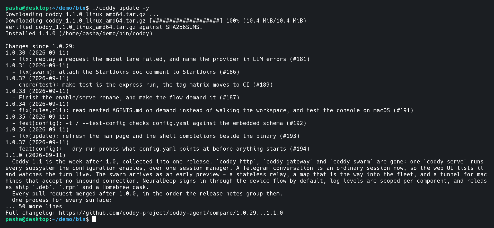

# Обновление Coddy

Команда **`coddy update`** скачивает официальные бинарники релизов из [GitHub Releases](https://github.com/coddy-project/coddy-agent/releases) и заменяет исполняемый файл **`coddy`**, который вы запускаете.

На Windows Coddy запускает короткоживущий помощник из системного временного каталога. Помощник ждёт завершения `coddy update`, сохраняет резервную копию установленного исполняемого файла, заменяет его и снова запускает обновлённый Coddy. Строки состояния помощника продолжают выводиться в той же консоли `cmd.exe` или PowerShell уже после того, как команда `update` вернула управление, поэтому `coddy update` сообщает об успехе, как только загрузка подготовлена к установке, ещё до самой замены.

Каждая загрузка проверяется по файлу `SHA256SUMS`, который публикует релиз, до того как что-либо распаковывается или устанавливается. Если в релизе этого файла нет, Coddy сообщает об этом и всё равно устанавливает релиз.

## Что устанавливается

На каждый SemVer-тег **`X.Y.Z`** CI публикует по одному архиву на платформу и пакеты для дистрибутивов Linux.

| Архив | Платформа |
|---------|----------|
| **`coddy_X.Y.Z_linux_amd64.tar.gz`** | Linux x86_64 |
| **`coddy_X.Y.Z_linux_arm64.tar.gz`** | Linux arm64 |
| **`coddy_X.Y.Z_android_arm64.tar.gz`** | Android arm64, в Termux ([Android](android.md)) |
| **`coddy_X.Y.Z_android_amd64.tar.gz`** | Android x86_64, в Termux |
| **`coddy_X.Y.Z_windows_amd64.zip`** | Windows x86_64 (**`coddy.exe`**) |
| **`coddy_X.Y.Z_darwin_amd64.tar.gz`** | macOS Intel |
| **`coddy_X.Y.Z_darwin_arm64.tar.gz`** | macOS Apple Silicon |
| **`coddy_X.Y.Z_linux_amd64.deb`** | Debian, Ubuntu и производные, x86_64 |
| **`coddy_X.Y.Z_linux_arm64.deb`** | Debian, Ubuntu и производные, arm64 |
| **`coddy_X.Y.Z_linux_amd64.rpm`** | Fedora, RHEL, openSUSE и производные, x86_64 |
| **`coddy_X.Y.Z_linux_arm64.rpm`** | Fedora, RHEL, openSUSE и производные, arm64 |

В архивах для Linux, Android и macOS рядом с бинарником лежат man-страница и автодополнения для bash и zsh; пакеты ставят те же файлы туда, где их ждёт система, - см. [Установка](install.md#пакеты-для-linux-deb-rpm). Каждый релиз также публикует **`coddy.rb`** - Homebrew cask для двух архивов macOS этого тега.

Каждый бинарник собран со всем набором тегов - **`http`**, **`ui`**, **`scheduler`**, **`memory`**, **`cli`**, **`gateway`** и **`swarm`**, - так же, как при **`make build TAGS="http ui scheduler memory cli gateway swarm"`** и в Docker-образе по умолчанию. Конвейер релиза описан в разделе [Сборка из исходников](../contributing/build.md#релизные-бинарники-ci).

## Какой файл заменяется

**`coddy update`** находит путь к запущенному исполняемому файлу (с разрешением символических ссылок) и перезаписывает файл по этому пути. На Android, где Termux может запускать Coddy через системный компоновщик, заменяется бинарник, который передан компоновщику, но не сам компоновщик. Примеры:

- после **`make install`** от обычного пользователя это обычно **`~/.local/bin/coddy`**;
- если запустить **`./build/coddy update`**, обновится **`build/coddy`** в репозитории.

В этом отличие от **`make install`**, который всегда копирует в **`~/.local/bin`** или **`/usr/local/bin`**. Чтобы обновить бинарник из **`PATH`**, запускайте тот **`coddy`**, путь к которому печатает **`which coddy`**.

## Man-страница и автодополнения рядом с бинарником

В архивах для Linux, Android и macOS рядом с бинарником лежат **`coddy.1`**, **`coddy.bash`** и **`coddy.zsh`**, и скрипт установки кладёт их в каталог **`share`** префикса бинарника (**`~/.local/bin`** → **`~/.local/share`**, **`/usr/local/bin`** → **`/usr/local/share`**; см. [Установка](install.md)). Сразу после исполняемого файла **`coddy update`** обновляет каждый из этих файлов, который там находит, поэтому **`man coddy`** и дополнение по Tab описывают работающий релиз. Автодополнение, оставшееся от предыдущего релиза, продолжает предлагать команды, которых в бинарнике уже нет, - именно так автодополнение показывало **`http`** и **`gateway`** без **`serve`**, когда бинарник уже ушёл вперёд ([issue #188](https://github.com/coddy-project/coddy-agent/issues/188)).

Новых файлов команда не создаёт. Файл, который никогда не устанавливался (**`--no-shell-setup`**, бинарник, скопированный вручную), она не трогает, а у исполняемого файла вне каталога **`bin`** - в дереве сборки или просто скачанного - нет парного каталога **`share`**. Релиз, выпущенный до того, как архивы стали содержать эти файлы, оставляет установленные копии как есть и сообщает об этом. О файле, который не удаётся записать, команда сообщает уже после установки бинарника и завершается с ненулевым кодом.

## Уже запущенный сервер

**`coddy update`** заменяет файл на диске. Уже запущенный **`coddy serve`** работает на том
бинарнике, с которым стартовал, пока не перезапустится. Пользовательский сервис systemd
перезапускается командой **`coddy serve install`** (она же перенаправляет написанный ею юнит на
бинарник, который переехал, см. [руководство по сервису](../operate/serve.md#как-пользовательский-сервис-systemd-в-linux)),
а демон - командой **`coddy serve restart`**. Обновление пакета выводит то же напоминание.

## Установки, которыми владеет пакетный менеджер

**`coddy`**, который поставили **`apt`** или **`dnf`**, записан в базе пакетов пофайлово. Если перезаписать **`/usr/bin/coddy`** на месте, база будет описывать сборку, которой больше нет, следующий **`apt upgrade`** или **`dnf reinstall`** молча вернёт старую версию, а **`dpkg --verify`** сообщит о несовпадении контрольной суммы, которого никто не ждал. Поэтому **`coddy update`** не заменяет исполняемый файл из пакета. Команда спрашивает у **`dpkg-query -S`** и **`rpm -qf`**, кому принадлежит файл, который она собирается записать, и идёт одним из двух других путей:

- **от обычного пользователя** - ничего не меняет, называет пакет, которому принадлежит установка, и печатает команду для его обновления (**`sudo apt-get install --only-upgrade coddy`**, **`sudo dnf upgrade coddy`**, ...). Код выхода **1**, чтобы скрипт это заметил;
- **от root** - скачивает **`.deb`** или **`.rpm`** для этой архитектуры, проверяет его по **`SHA256SUMS`**, как любой другой файл релиза, и передаёт найденному пакетному менеджеру (**`apt-get`**, **`apt`**, **`dnf`**, **`yum`**, **`zypper`**, иначе **`dpkg`** или **`rpm`**). База пакетов остаётся корректной.

**Homebrew** тоже распознаётся, на macOS и на Linux. Исполняемый файл, путь к которому ведёт в каталог **`Caskroom`** или **`Cellar`**, принадлежит brew. Привилегированного пути здесь нет - Homebrew отказывается работать под **`sudo`**, - поэтому и root, и обычного пользователя команда отправляет к **`brew upgrade`**. Флаг зависит от того, какой из двух признаков совпал. Путь через **`Caskroom`** означает cask, и для него нужен **`brew upgrade --cask coddy`**, путь через **`Cellar`** означает формулу, и для неё нужен **`brew upgrade coddy`**. Разница существенная - **`--cask`** на установке из формулы завершается ошибкой, потому что cask с таким именем для обновления нет.

```bash
sudo coddy update -y
```

Владельца команда спрашивает у базы пакетов и не угадывает по пути, поэтому бинарник, который вы скопировали из **`/usr/bin`**, продолжает обновляться сам, собственная пересборка Coddy в дистрибутиве распознаётся так же, как наша, а сборку в **`~/.local/bin`** всё это не затрагивает.

У релиза, опубликованного до появления этого конвейера, есть архивы, но нет пакетов. Root получает ровно это сообщение и отправляется обратно к пакетному менеджеру, вместо того чтобы получить архив, который перезаписал бы файл из пакета.

## Команды

Проверьте, вышел ли более новый релиз (код выхода **0**, если версия актуальна, и **1**, если есть более новый **`X.Y.Z`**).

```bash
coddy -v
coddy update --check
```

Установите последний релиз (без **`-y`** команда спросит **`[y/N]`**).

```bash
coddy update
coddy update -y
```

Установите конкретный тег.

```bash
coddy update --version 0.9.3
coddy update --version 0.9.3 -y
```

Укажите другой репозиторий GitHub (по умолчанию **`coddy-project/coddy-agent`**).

```bash
coddy update --repo coddy-project/coddy-agent
```

Установите на Windows без последующего перезапуска Coddy - это пригодится в скрипте или шаге CI, где у перезапущенного процесса нет консоли.

```bash
coddy update -y --no-restart
```

Установите без отчёта об изменениях (см. [Что изменилось](#что-изменилось)) - для скрипта, которому нужны только строки об установке.

```bash
coddy update -y --no-notes
CODDY_UPDATE_NOTES=0 coddy update -y
```

Список всех флагов.

```bash
coddy update --help
```

## Что изменилось



*Отчёт после обновления со всеми пропущенными релизами, их описаниями и ссылкой на сравнение*

Когда обновление установлено, **`coddy update`** сообщает, что оно принесло. Команда перечисляет все релизы между работавшей версией и установленной, от старых к новым, у каждого дату публикации и описание релиза, и в конце даёт ссылку на сравнение всего диапазона на GitHub ([issue #195](https://github.com/coddy-project/coddy-agent/issues/195)).

```console
Installed 1.0.37 (/home/user/.local/bin/coddy)

Changes since 1.0.35:
1.0.36 (2026-09-11)
  - fix(update): refresh the man page and the shell completions beside the binary (#193)
1.0.37 (2026-09-11)
  - feat(config): --dry-run probes what config.yaml points at before anything starts (#194)
Full changelog: https://github.com/coddy-project/coddy-agent/compare/1.0.35...1.0.37
```

Описания берутся из текстов релизов на GitHub и сокращаются для терминала. Сгенерированный заголовок *What's Changed*, подпись автора и подвал *Full Changelog* каждого релиза убираются, номер пул-реквеста остаётся в виде **`(#N)`**, а написанный вручную текст сохраняет свои разделы как простые заголовки. Отчёт ограничен 20 строками, поэтому длинный разрыв заканчивается строкой **`... N more lines`** и ссылкой на сравнение, которая охватывает сразу все релизы.

Отчёт печатается на каждом пути, который что-то устанавливает (архив, передача управления помощнику на Windows и путь через **`.deb`** / **`.rpm`** от root), и никогда при **`--check`** или если Coddy уже актуален. Сборка, у которой нет релиза для отсчёта (**`coddy -v`** печатает **`dev`**), и **`--version`**, который идёт назад, получают описание только что установленного релиза и ссылку на его страницу вместо диапазона.

Список запрашивается вторым запросом к GitHub API с ограничением 15 секунд, и сорвать обновление этот запрос не может. Без сети, при превышении лимита запросов или если в ответ пришёл не список, отчёт сокращается до одной строки **`Full changelog:`**. **`--no-notes`** отключает отчёт целиком, как и **`CODDY_UPDATE_NOTES=0`** (а также **`false`**, **`no`** или **`off`**) в окружении, - для скриптов и шагов CI, которым нужны только строки об установке.

## Сравнение версий

**`coddy -v`** может показывать строку git describe (например, **`0.9.2-5-gb6b7d31-dirty`**). **`coddy update`** сравнивает с тегом релиза начальный префикс **`X.Y.Z`**. Локальная сборка **`dev`** считается более старой, чем любой опубликованный SemVer-релиз.

## Другие способы обновления

| Способ | Когда использовать |
|--------|-------------|
| **`coddy update`** | На диске уже есть бинарник из релиза, и нужен следующий (или конкретный) релиз с GitHub. |
| **`make install`** | Вы собрали Coddy из клона и хотите, чтобы **`build/coddy`** был в **`PATH`**. |
| **`make build TAGS="..."`** | Нужны свои теги или локальные изменения, которых нет в релизах. |
| **Docker** | **`docker compose pull`** / тег образа **`X.Y.Z`** в [GHCR](https://github.com/coddy-project/coddy-agent/pkgs/container/coddy-agent). |
| **`go install ...@latest`** | Быстрая установка без файлов релиза; только теги модуля по умолчанию (без **`http`** / UI, если не собирать из исходников). |
| **`apt` / `dnf` / `zypper`** | Вы ставили **`.deb`** или **`.rpm`**; установите более новый файл пакета или запустите **`sudo coddy update`**, чтобы Coddy скачал его за вас. |
| **`brew upgrade --cask coddy`** | Вы ставили Homebrew cask (путь к исполняемому файлу ведёт в **`Caskroom`**). |
| **`brew upgrade coddy`** | Вы ставили формулу Homebrew (путь к исполняемому файлу ведёт в **`Cellar`**). |

## Ограничения

- Поддерживаются только платформы из таблицы релизов; на остальных команда завершается понятной ошибкой;
- на Windows Coddy ждёт до 30 секунд, пока другой процесс освободит исполняемый файл. Об ошибке прав Coddy сообщает гораздо раньше и называет каталог - для установки в `Program Files` нужна консоль с повышенными правами. Если обновление не удаётся установить, текущий исполняемый файл остаётся на месте, а если не запускается обновлённый бинарник, Coddy восстанавливает резервную копию;
- помощник на Windows удаляет себя через только что установленный Coddy. Установка релиза, который старше этой передачи управления (`coddy update --version` в сторону старых версий), вместо этого запускает старую сборку напрямую, и её помощник остаётся в `%TEMP%`, пока его не уберёт следующий `coddy update`;
- загрузка файлов релиза продолжается после временного сбоя соединения (до трёх попыток). GitHub поддерживает HTTP range-запросы, которыми Coddy докачивает файл. С сервера без поддержки диапазонов файл скачивается заново с начала, а если сервер продолжает не с того смещения, загрузка завершается ошибкой, и склеенный архив не устанавливается;
- **`coddy update`** нужен исходящий HTTPS к **`api.github.com`** и к CDN с файлами релизов (загрузки релизов GitHub);
- путь через пакеты есть только на Linux (об установках через Homebrew Coddy сообщает, но сам их не обновляет), а пакетный менеджер работает неинтерактивно, поэтому обновление, которое удалило бы другой пакет, завершается ошибкой вместо вопроса. В этом случае запустите пакетный менеджер сами;
- конфигурация в **`$CODDY_HOME`** не меняется; заменяется только бинарник или пакет, в котором он лежит.

<!-- docsgen:source sha256=ff835d6593b2c588 -->
