# Интерактивный консольный TUI (`coddy` / `coddy cli`)

https://github.com/user-attachments/assets/0fc63d52-94ca-4927-9c88-29dec02a8767

*Трёхминутная запись сессии в консоли версии 1.2.31 - шапка с `AGENTS.md` проекта и скилами, футер с использованием лимитов аккаунта, окно выбора модели, работа с файлами с запросами разрешений, скил `/commit`, встроенная документация по F1 и `coddy -c`. Файл лежит в репозитории как [console.mp4](../../assets/video/console.mp4).*

Консоль - терминальный интерфейс, работающий на том же механизме, что и все остальные интерфейсы, - `session.Manager`, раннер агента и обновления сессии ACP. На стороне агента нет ничего специфичного для консоли - TUI служит четвёртым `UpdateSender` рядом с ACP, HTTP и Telegram-шлюзом.

Сборка - `make build TAGS=cli` (или любой набор тегов, в который входит `cli`; рекомендуемый полный бинарник собирается командой `make build TAGS="http ui scheduler memory cli gateway swarm"`). В сборках без этого тега `coddy cli` объясняет, как пересобрать бинарник, а `coddy` без аргументов по-прежнему печатает справку по использованию.

Запуск - `coddy` без аргументов в терминале (и stdin, и stdout должны быть tty; в конвейерах и CI сохраняется прежнее поведение с выводом справки), явно `coddy cli [flags]` или сокращения в виде флагов, которые ведут в консоль. `coddy -c` продолжает последнюю сессию в этой папке, а `coddy -p "..."` выполняет один неинтерактивный промпт (`coddy -p -` и `coddy -i FILE` читают его из stdin или из файла). Запуск проходит до перехода терминала в raw-режим - конфигурация, хранилище сессий, скилы и папки правил, затем первый кадр. Скилы читаются только из своих папок и никогда из маркетплейсов `marketplaces.json`, поэтому сотни установленных скилов обходятся в доли секунды, а маркетплейс, который не отвечает, не стоит ничего ([Скилы](../features/skills.md#когда-читаются-скилы)). Настроенных MCP-серверов на этом пути **нет**, чем бы они ни запускались, - программой, которую называет конфигурация, npm-пакетом через `npx` или удалённым сервером по streamable HTTP или SSE. Они подключаются в фоне, когда консоль уже отрисовалась, одинаково для новой сессии и для сессии, возобновлённой через `coddy -c` или `/resume`, все сразу и каждый с ограничением в 20 секунд, а футер считает их (`MCP 2/5`), пока не ответит каждый. Промпт, отправленный раньше, ждёт свой список инструментов на строке состояния (`Connecting MCP
servers`), и Escape прерывает ожидание, как любой другой шаг.
О сервере, который упал или который не пропускает проверка доверия, консоль один раз сообщает строкой в видимом транскрипте вместе с тем, что с этим делать. К серверу, который не ответил вовремя, консоль ещё раз пробует подключиться при следующем промпте - первый запуск `npx`-пакета может не уложиться в ограничение, пока пакет устанавливается, - а сервер, упавший по другой причине или дважды, больше не подключается, пока его не переключат в `/mcp`, не перезагрузят конфигурацию или не начнут новую сессию. При возобновлении сессии её текущие уведомления MCP восстанавливаются после очистки транскрипта. Серверы глобальной конфигурации стартуют вместе с консолью, ещё до того, как их запросит первая сессия, и работают всё время, поэтому `/new` и `/resume` застают их подключёнными и не запускают заново; проектный сервер - один процесс на все сессии своей рабочей папки ([MCP](../features/mcp.md#общие-серверы)). Дерево рабочей папки никто не обходит. Вложенные файлы `AGENTS.md` читаются по требованию из папок, в которые заходит инструмент (`docs/features/rules.md`), поэтому консоль, открытая в домашнем каталоге (один только `~/Library` в macOS насчитывает сотни тысяч записей), сразу рисует кадр и не выглядит зависшей. По той же причине ветка git в футере читается с ограничением в три секунды. Первое нажатие ctrl+c во время запуска отменяет его; второе завершает процесс обычным способом, а не поглощается.

При выходе из консоли (двойное ctrl+c, ctrl+d, `/quit`) после восстановления терминала печатается подсказка, как вернуться к сессии.

```
session: sess_1a2b3c4d
continue: coddy cli --session-id sess_1a2b3c4d  (or: coddy -c)
```

Сессия записывается на диск вместе с первым промптом. Консоль, запущенная и закрытая без промпта (или оставленная через `/new`, пока ничего не отправлено), не оставляет папки в каталоге сессий и строки в "Истории" и подсказку не печатает, потому что продолжать нечего. Настройки, изменённые до первого промпта (модель, режим, режим разрешений), хранятся в памяти и записываются вместе с ним.


## Черновики файлов на лету

Когда модель готовит `write`, `edit` или `apply_patch`, карточка инструмента показывает **Generating**, путь, как только он получен, байты и строки декодированного содержимого и байты сырых аргументов. Последний счётчик продолжает расти, пока правка передаёт свой текст поиска или другой аргумент. Счётчики показывают полученный объём; ни процентом, ни прогнозом итогового размера файла они не служат. Оценка токенов хода учитывает фрагменты аргументов по мере их прихода; когда вызов заканчивается, эту оценку заменяют данные провайдера об использовании, и полные аргументы второй раз не учитываются.

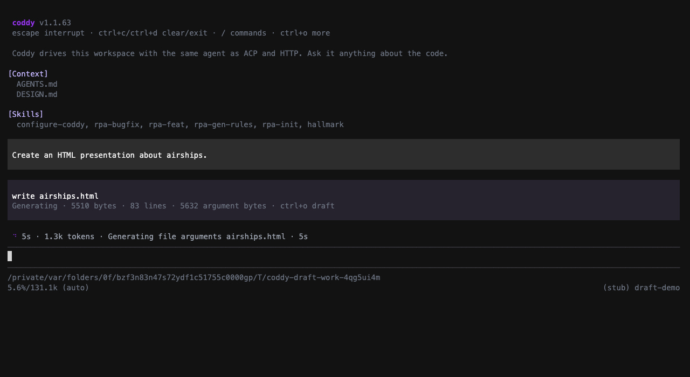

*Файл ещё не записан, модель пока генерирует его аргументы.*

`ctrl+o` показывает последние шесть строк черновика, не больше 1 КиБ. Для `edit` это `newString`, для `apply_patch` - текст патча. Предпросмотр не показывает результат выполнения, а другие инструменты предпросмотра аргументов не дают. Обновления ограничены пятью в секунду на вызов, с финальной отправкой в конце. Те же метаданные доходят по ACP и HTTP до удалённой консоли. Потоки OpenAI-совместимых провайдеров, Anthropic, Codex и Devin передают фрагменты аргументов; провайдер без фрагментов всё равно показывает имя инструмента и сообщает аргументы, когда они готовы.

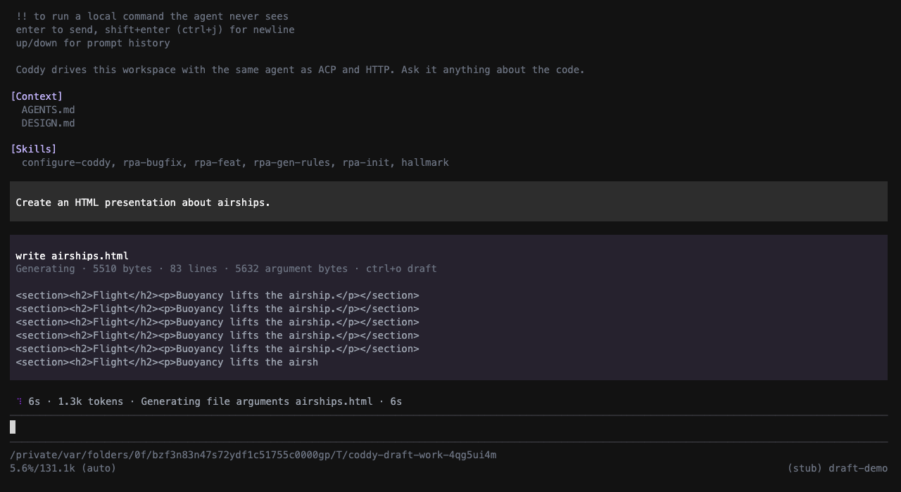

*Ограниченный хвост обновляется во время генерации; управляющие последовательности терминала вычищаются.*

Выполнение по-прежнему ждёт полного вызова и обычной проверки разрешений. Отмена незавершённого черновика не записывает часть файла. После выполнения карточка показывает обычный результат, и `ctrl+o` загружает уже его.

Снять это состояние можно без провайдера и учётных данных.

```bash
make build TAGS=cli
CLI_E2E_COLS=148 CHROME=/path/to/chromium python3 examples/cli/capture_tool_progress.py /tmp/coddy-draft-shots
```


## Визуальная модель

Раскладка повторяет TUI агента для программирования pi (pi-mono `b1efcf7d7`, v0.84.2, MIT, Mario Zechner - см. раздел об авторстве ниже) с цветами из палитры веб-интерфейса coddy (`external/ui/src/styles.css`); этот документ служит визуальным контрактом консоли coddy.

Сверху вниз:

- **Шапка** - `coddy` (жирным акцентным цветом) и приглушённая версия; приглушённая строка подсказок (`escape interrupt · ctrl+c/ctrl+d clear/exit · / commands · ctrl+o more`); приглушённая строка приветствия; `[Context]` (документы, которые несёт промпт сессии, - существующие ваши и рабочей папки `AGENTS.md` и `DESIGN.md`, затем файлы, которые добавляет `instructions.files`, каждый по одному разу; после них цветом предупреждения запись `instructions.files`, файл которой сессия прочитать не может, в виде `<path> (not read: <reason>)`, см. [Правила](../features/rules.md#дополнительные-файлы-инструкций)) и `[Skills]` (загруженные скилы, встроенные первыми). `ctrl+o` разворачивает полный список подсказок и добавляет разделы `[Rules]` и `[MCP]`; `[MCP]` перечисляет серверы, которые запускает сессия этой рабочей папки, - включённые серверы из `~/.coddy/mcp.json` и из `.coddy/mcp.json` проекта, которые пропускает проверка доверия;
- **Транскрипт** - сообщения пользователя в блоках с фоном на всю ширину; markdown ассистента (заголовки, жирный и курсив, встроенный код, ``` блоки кода с рамкой, цитаты `│ `, списки, таблицы псевдографикой, ссылки OSC 8); серые курсивные блоки рассуждений (сворачиваются по `ctrl+t`); вызовы инструментов в виде блоков с подкрашенным фоном (ожидание → зелёный оттенок при успехе / красный при ошибке) с жирным заголовком, который называет, над чем работает вызов (`read <path>`, `$ command`, `load_skill <skill>`, `Searching the docs <query>`, `Reading the docs <page>`, `spawn_agent <subagent> · <task> · background · timeout 300s`, где каждая часть после субагента появляется, только если вызов её передал), с предпросмотром до 10 строк и с `... (ctrl+o to expand)`, который читает полный результат из `sessions/<id>/tool_calls/`. Блок `spawn_agent` несёт и само делегирование - под заголовком приглушённым курсивом идёт промпт, полученный дочерним агентом, обрезанный по 10 строкам или 600 символам, смотря что наступит раньше, с `... (ctrl+o for the whole prompt)`. Отчёт дочернего агента появляется под ним как тело блока, так что задача и ответ читаются одним блоком;
- **Состояние** - пока идёт ход, показывается спиннер из символов Брайля `⠋⠙⠹...` с шагом 80 мс и живая строка состояния. Строка начинается с собственных чисел хода - сколько он уже идёт, сколько токенов модель в нём сгенерировала и сколько фоновых задач работает прямо сейчас - `15m 08s · 13.5k tokens · 1 running task ·
  Thinking…`.
  До первого токена в ней только часы и фраза (`57s · Waiting for the model`), а задачи появляются, только пока что-то работает. Для промпта, отправленного, пока настроенные MCP-серверы сессии ещё подключаются, строка вместо этого начинается с `Connecting MCP servers` и собственного счётчика и возвращается к ожиданию модели, когда серверы ответили. Токены приходят в обновлении агента `turn_progress` - это цифры провайдера по завершённым вызовам плюс оценка текущего, поэтому счётчик растёт, пока ответ идёт потоком; консоль, подключённая через `--remote`, получает то же обновление. Затем идёт фраза текущего шага и, если шаг запускает что-то кроме модели, его собственный счётчик (`2m 05s ·
  1.2k tokens · Running a command · 45s`, `Running a subagent · 40s`, пока идёт вызов
  `spawn_agent`); для размышления, ответа и ожидания счётчиком служат часы хода. Строка показывает фазу и **ничего из того, над чем работает шаг**, - ни команды, ни пути, ни URL. То, над чем работает вызов, называется один раз, в блоке инструмента над строкой, поэтому каждая фраза закончена сама по себе (`Running a
  command`, и никогда просто
  `Running` в ожидании, что за ним последует команда). Обычное ожидание со временем меняет фразу - `Waiting for the model` → `The model is taking longer than usual` (15 с) → `Still no response from the server` (60 с). Пока открыто модальное окно разрешения или вопроса, строка показывает `Waiting for your approval` / `Waiting for your
  answer` **без** счётчика шага (ничего не выполняется), а после одобрения возвращается к инструменту, ждавшему разрешения, с заново запущенным счётчиком.
  Таблица фраз лежит в `external/cli/status.go` (Go-двойник `liveStatus.ts` из веб-интерфейса);
- **Виджет плана** - текущие пункты списка задач (`✓` выполнен, `◐` в работе, `○` ожидает, `✗` провален) над редактором;
- **Редактор** - многострочное поле ввода между горизонтальными линиями `─` во всю ширину (зелёными, пока в буфере команда `!!`); перемещение курсора с учётом переносов и с запоминанием колонки; история промптов (вверх/вниз на краях, не больше 100); большие вставки сворачиваются в метки `[paste #N +K lines]`; прокрученное содержимое показывает границы `─── ↑ N more ───`. Автодополнение - команды `/` на первой строке и упоминания `@` где угодно, `tab` принудительно дополняет путь для отдельного слова. Список `@` спрашивает тот же поиск, что и веб-интерфейс (`GET /coddy/mentions`, внутри процесса, когда консоль локальная), - вся рабочая папка ранжируется по введённому тексту, поэтому фрагмент имени находит файл в любом месте дерева; индекс перестраивается, когда начинается упоминание, поэтому файл, записанный после запуска консоли, предлагается, а удалённый исчезает; запрос, начинающийся с `/`, `~`, `./` или `../`, показывает содержимое этой папки в любом месте диска; `@session:`, `@rule:`, `@agent:` и `@coddy:` (страницы встроенной документации) перечисляют объекты этих видов. Обрезанный список сообщает об этом в строке прокрутки, `(3/50 of 1204, type to narrow)`. Строка папки или схемы оставляет список открытым; файл завершает упоминание пробелом и берётся в кавычки, если в его пути есть пробел (папка в кавычках закрывает кавычку перед курсором, так что текст называет её, даже если файл за ней так и не последует). Упоминание может сузить файл до диапазона строк, `@Dockerfile:21-31` или `@f.go#L21-31`, в том числе для абсолютных путей. В удалённом режиме список приходит с сервера, на котором работает сессия. Грамматика, что прикрепляет каждый вид и ограничения описаны на странице [Упоминания](../features/mentions.md);
- **Футер** - приглушённая строка `cwd (git-branch) [• plan|ask] [• MCP N/M] [• N tasks running (/tasks)] [• accept edits|bypass]`, затем `↑in ↓out  N.N%/ctx (auto)` слева и `(provider) model [• reasoning]` справа. Режим разрешений завершает первую строку, если он не `ask`, причём `bypass` выводится цветом предупреждения, чтобы сессия, которая одобряет всё, никогда не выглядела как сессия, которая спрашивает; показывается режим той сессии, что на экране, и после `/new` и `/resume` он вместе со строкой переопределений хода переключается на сессию, в которую вы перешли. Настройка, изменённая на несколько ходов, добавляет под второй строкой строку акцентного цвета `next turn: model x • next 3
  turns: reasoning high` (`this turn`, пока её держит текущий ход). Пометка о работающих задачах остаётся и после того, как ход, запустивший задачи, закончился, то есть когда строки состояния, которая их считала, уже нет. Счётчик MCP виден, только пока какой-то настроенный сервер ещё подключается после первого кадра - подключённые из числа тех, к которым идёт подключение, без учёта объявлений проекта, ожидающих одобрения, - и исчезает, когда ответили все. Если строка не помещается, сокращается путь, а пометки остаются.
  Третья строка появляется, пока провайдер активной модели сообщает об использовании аккаунта (сейчас это `neuraldeep` с данными из `GET /v1/limits` хаба, `codex` с данными из эндпоинта использования бэкенда Codex и `devin` с данными из RPC статуса seat-management) - `Pro • 3h 3% (resets 20:59) • week 7% (resets Mon 03:00) • wallet -1 229 ₽`, то есть план, каждое учётное окно в процентах **использованного** со временем сброса по вашим часам (время суток в пределах 24 ч, день недели в пределах недели, дальше дата и время) и собственный рублёвый баланс аккаунта для ключей-кошельков NeuralDeep. NeuralDeep показывает дневное окно, только когда оно больше нуля; Codex и Devin показывают каждое окно, о котором сообщают, включая нулевые. Окна Codex подписаны длительностями, которые сообщает сервис (`5h`, `week` и записи для отдельных функций вроде `Fast model · week`); тарифный план Devin с квотами показывает `day` и `week` (оставшиеся проценты выводятся как использованные), план ACU показывает `acu`, а источник, которому нечего сообщить, показывает `quota unavailable` и не выдумывает чисел. Окно, заполненное на 80 % и больше, окрашивается цветом предупреждения, а уведомление в транскрипте сообщает `You've used 82% of your NeuralDeep 3h
  limit · resets 20:59`, один раз на окно и период; исчерпанный лимит заменяет окна на
  `limit reached (resets 20:59)` цветом ошибки (`rate
  limited (retry in 42s)` при поминутной блокировке,
  `key blocked`, `wallet
  empty` или
  `account blocked` для блокировок, которые не снимаются со временем) и один раз публикует `Usage
  limit reached`.
  Если включён `agent.wait_for_limit_reset`, ход, упёршийся в лимит, который повторные попытки никогда не покроют (`429` со сбросом далеко впереди), ждёт сброса, а не завершается ошибкой. Живая строка состояния показывает `Usage
  limit reached · resuming at 20:59` без бегущего счётчика, футер сохраняет цифры хаба, а тот же вызов выполняется снова, когда лимит снимается (Esc прерывает ожидание, как любой ход). Модель на безлимитном варианте NeuralDeep (Qwen ∞)
  показывает `∞ volume`. Отклонённый ключ показывает `neuraldeep: key rejected, run
  coddy providers login neuraldeep`; если хаб недоступен, последние цифры остаются с пометкой
  `(stale)`. На узких терминалах по порядку исчезают кошелёк, день, неделя и план. Цифры приходят от менеджера сессий при старте сессии и после каждого хода (обновление `provider_usage`, то же через `--remote`); после `/model` консоль запрашивает у бэкенда цифры нового провайдера (из кэша, если он прогрет), после сброса окна запрашивает свежие данные, а если бэкенд отложил обновление из-за минимального интервала между запросами, консоль перечитывает кэш в момент, который назвал ответ. Других опросов нет. `usage_limits_panel: false` в записи провайдера выключает панель - строка остаётся скрытой, `/usage` сообщает об этом, и к хабу для этой записи не уходит ни одного запроса; перезагрузка конфигурации перечитывает кэш, поэтому переключённая панель применяется без перезапуска. Проектный документ - `docs/plans/neuraldeep-usage.md`.

Отрисовка следует модели pi с выводом прямо в основной экран - построчный дифф с предыдущим кадром, синхронизированный вывод (`ESC[?2026h/l`), сброс SGR и OSC 8 в каждой строке, маркер курсора APC нулевой ширины для размещения аппаратного курсора IME, ограничение частоты отрисовки до одного кадра в 16 мс с немедленной отрисовкой после нажатий клавиш.

## Команды и клавиши

Слэш-команды делятся на три группы - команды настроек `/model`, `/reasoning` (`/effort`), `/think`, `/nothink`, `/agent`, `/plan`, `/ask` и `/permissions`, каждая с `--once` или `--count=N`, чтобы действовать только на ближайшие ходы ([Настройки сессии](../features/session-settings.md)); клиентские `/resume`, `/new`, `/theme`, `/hotkeys`, `/queue`, `/usage`, `/tasks`, `/mcp`, `/docs`, `/quit` и `/goal` без аргументов, который открывает меню цели; серверные `/compact`, `/goal <objective>` с формами `pause`, `resume` и `clear`, `/export`, `/plugin` и каждый загруженный скил (из каталога доступных команд ACP). `/model`, `/reasoning` или `/permissions` без аргументов открывают своё окно выбора; со значением команду применяет менеджер сессий, и футер показывает изменение, а команды, за которыми следует сообщение, применяются к ходу, который это сообщение начинает. В транскрипте строка появляется только для изменения, которое агент сделал сам, например `Model: stub/coddy-mini for this session` после его вызова `switch_model`. Команды `/mode` больше нет, у режимов есть собственные команды.

**Запоминание модели** - консоль считается отдельным интерфейсом. Выбор на уровне сессии (`/model`, окно выбора или `/model <id>` перед промптом) запоминается в `$CODDY_HOME/console-state.json` (`{"last_model": "..."}`), и каждая **новая** сессия (`/new`, новый запуск) начинает с этой модели, а не с `agent.model`. При самом первом использовании консоли, пока запомненного выбора нет, новая сессия начинает с первой по алфавиту настроенной модели. Открытые заново и возобновлённые сессии сохраняют модель из своего бандла, `--model` переопределяет модель только для одного запуска и не перезаписывает запомненную, а `coddy -p` всегда следует конфигурации.

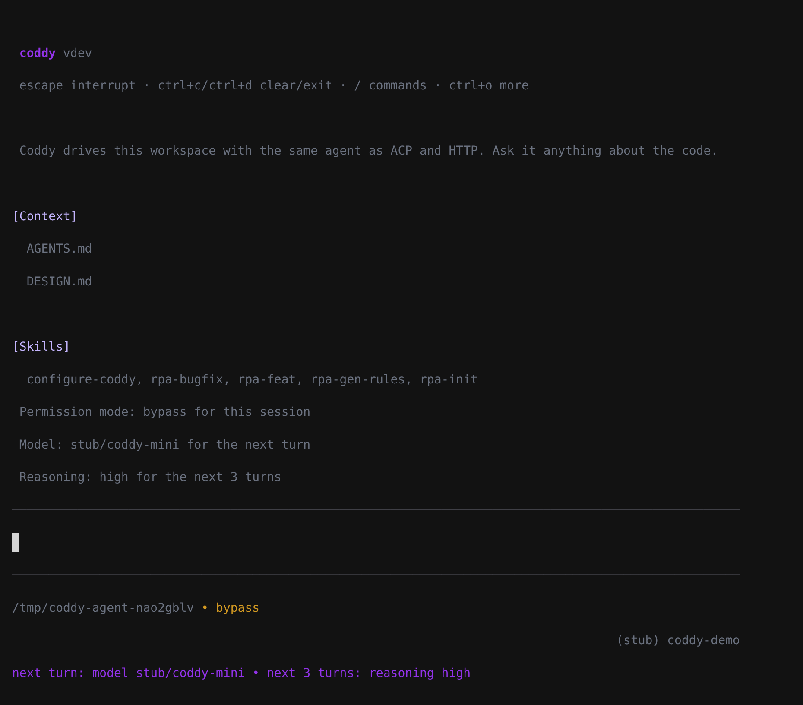

*После `/permissions bypass` и `/model stub/coddy-mini --once /reasoning high --count=3` в футере `bypass`, под моделью переопределения хода, в транскрипте ничего.*

Enter на подсказке слэш-команды применяет и отправляет её одним нажатием. `/export [md|html|json|jsonl]
[path]` записывает транскрипт в рабочую папку
(`docs/features/session-export.md`); при `--remote` файл оказывается на сервере. `/usage` принудительно заново читает использование аккаунта активного провайдера (для записи с выключенной панелью вместо этого называет переключатель `usage_limits_panel`) и печатает разбивку приглушённым блоком. В заголовке блока стоит бренд и, если запись названа не по своему типу, имя записи (`Codex · codex-work`), а дальше идут каждое окно с полосой из десяти ячеек, его процент, счётчики и время сброса, текущее число запросов в минуту, период ожидания, кошелёк с расходами за последние 30 дней, строка `refresh in Ns (pacing)`, если чтение отложено минимальным интервалом между запросами, и возраст снимка. Источник сообщает только те поля, что у него есть, - Codex и Devin печатают окна и план, но никогда rpm, период ожидания или кошелёк, а источник, которому нечего сообщить, печатает `quota
unavailable` и не выдумывает чисел.
При `--remote` читается ключ самого сервера, поэтому строка `key rejected` там носит справочный характер (войдите на сервере).

`/mcp` открывает список серверов с областью, состоянием и числом инструментов, а у выключенного сервера, чьё состояние - вердикт доверия, стоит `off`. Enter открывает управление сервером - включение и выключение, доверие проекта и отдельные инструменты. Выдать и отозвать доверие можно только для проектного сервера при `mcp.project_trust: ask`, так же, как щитом в веб-интерфейсе. Перед одобрением консоль печатает над выбором всё объявление - транспорт, командную строку или URL, имена его переменных и заголовков, рабочую папку и файл, - и одобрение ссылается на это объявление по его отпечатку, поэтому чекаут, переписанный в промежутке, получает отказ, а не одобрение. Выключение проектного сервера сохраняет переключатель в домашнем каталоге оператора, не трогая чекаут, и переключатель сразу доходит до работающей сессии - этот сервер подключается или закрывается, остальные продолжают работать. То же меню работает через `--remote` по маршрутам управления MCP.

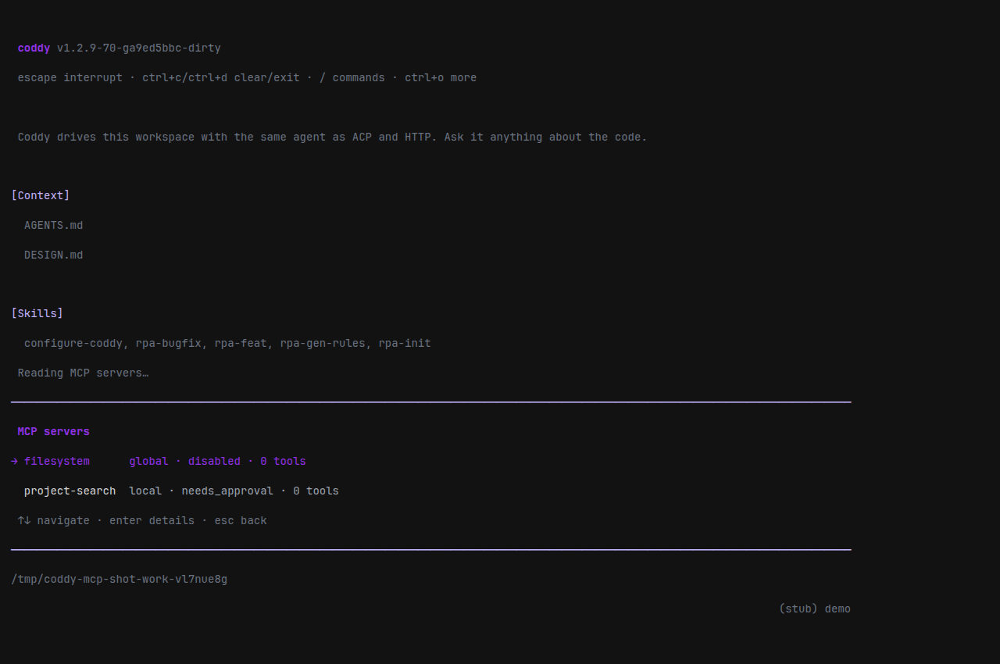

*`/mcp` показывает обе области и состояние доверия ещё до того, как открыто управление сервером.*

Цель сессии ([Цель сессии и супервизор](../features/session-supervisor.md)) видна в консоли как строки транскрипта, пометка в футере и меню. `/goal <objective>` уходит менеджеру сессий, как любой промпт, - задаёт цель и сразу начинает над ней работать; так же работают `/goal pause`, `/goal resume` и `/goal clear`. Ход, который запускает супервизор, выглядит в транскрипте приглушённой строкой вместо инструкции, которую читает модель, - `◎ Goal set: ...`, `◎ Goal continuation 1 of 10: <what the
check found>` с оставшейся работой под ней,
`◎ Goal resumed: ...` - и вживую, и при возобновлении сессии, а изменение, которое супервизор делает сам (`Goal blocked: <its question>`, `Goal complete: ...`), занимает одну строку, причём цветом предупреждения, если цель ждёт оператора. Пока цель есть, футер называет её после пометок первой строки - `◎ goal active 1/10
(/goal)` акцентным цветом,
`blocked` цветом предупреждения, `complete` зелёным, `paused` и `limited` приглушённо; на узком терминале пометка сначала теряет команду, затем счётчик, и только потом путь обрезается до нуля. `/goal` без аргументов открывает меню цели на месте редактора - формулировка цели, статус и его причина, последняя проверка с вердиктом, подтвердил ли его проверяющий и какую оставшуюся работу он нашёл, чек-лист, который ведёт супервизор, и цифры - использованные продолжения из `supervisor.max_continuations`, проверки, время работы ходов цели и потраченные ими токены относительно `supervisor.token_budget`. **Pause** предлагается, пока супервизор работает над целью, **Resume** - пока цель на паузе, заблокирована или вышла за бюджет (отправляет `/goal resume`, который запускает ход), а **Clear** переспрашивает, прежде чем удалить цель. Открытое меню следит за целью. При `--remote` меню читает и меняет цель через `GET`, `PATCH` и `DELETE /coddy/sessions/{id}/goal`, а футер следит за событиями `session_goal` сервера, поэтому цель, поставленная на паузу в браузере, видна и здесь.

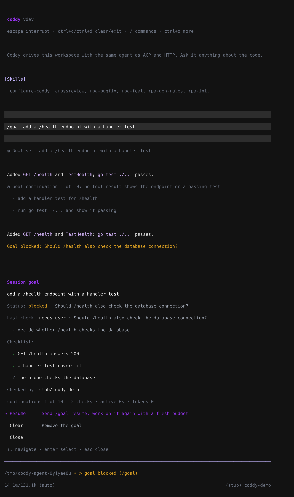

*Цель, которую супервизор один раз продолжил, а затем заблокировал на вопросе, - строки в транскрипте, меню цели над редактором и `◎ goal blocked (/goal)` в футере.*

`/tasks` открывает фоновые задачи сессии на месте редактора ([Фоновые задачи](../features/background-tasks.md#в-консоли)). У агента `background_list`, `background_output` и `background_stop` были всегда, а это сторона того же пула для оператора. Каждая задача занимает одну строку - отметка состояния, тег, который говорит, что за ней стоит (`shell` для команды, имя агента для запуска субагента, `memory` для запуска памяти в ходе), заголовок (команда или то, что поручили агенту) и ход выполнения (`1m 08s · est. 5m 00s`, `1m 30s` после завершения) с моделью и токенами запуска агента (`44s · qwen3.8-27b · 88.7k tokens`); новые идут первыми, как в панели "Задачи" веб-интерфейса. Работающая задача, которая разбудит агента, когда закончится, показывает в своей строке `wakes the agent` там, где у карточки веб-интерфейса колокольчик. Чем закончилась задача, показывает её отметка (`✓`, `✗`, `■`); открытая задача говорит об этом словами. **enter** открывает задачу под курсором и показывает, чем она закончилась, с кодом выхода и длительностью (`failed · exit 2 · 1m 30s`), её команду, дочернюю сессию запуска агента, ошибку, с которой она завершилась, если это не просто тот же код выхода, и последние строки её вывода, которые перечитываются, пока задача работает, и ещё раз по её окончании, чтобы показать напечатанное последним. Одновременно выполняется только одно чтение вывода, как и чтение списка, поэтому на медленном сервере очередь из них не копится. **s** останавливает задачу под курсором или открытую задачу вместе со всей группой процессов; **r** перечитывает всё; **escape** сначала закрывает открытую задачу, затем оверлей. При `--remote` строки, вывод и остановка идут через REST-маршруты сервера, поэтому оверлей управляет процессами той машины, на которой работает агент. Список обновляется каждые 2,5 с, пока открыт оверлей, идёт ход или работает задача, и каждые 15 с в остальное время; между ходами футер продолжает показывать, сколько задач ещё работает.

Фоновая задача, запущенная агентом, по окончании будит его в этой консоли, если вызов не задал `notify_on_finish: false` ([Фоновые задачи](../features/background-tasks.md#пробуждение-агента-по-завершении-задачи)).

**F1** открывает собственную документацию Coddy на месте редактора, прочитанную прямо из бинарника ([Встроенная документация](../features/built-in-docs.md#справка-в-консоли)). Ввод текста ищет по разделам, **enter** открывает найденную страницу на её разделе, **tab** переходит между разделами, **n** и **p** листают страницы, **escape** возвращает назад. `/docs [words or page]` открывает тот же экран там, где терминал оставляет F1 себе (так делает GNOME Terminal), - с поиском или сразу на странице, например `/docs features/mentions#completion`. Страницы идут на языке терминала - `CODDY_LANG` или локали (`LC_ALL`, `LC_MESSAGES`, `LANG`), - и на нём же документация, которую прикрепляют ходы консоли и читает агент.

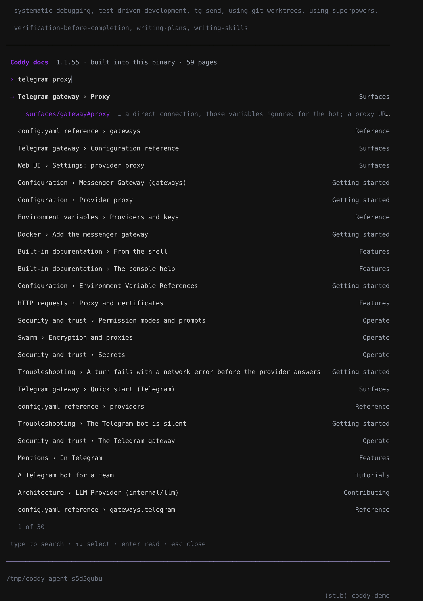

*F1, затем `telegram proxy` - найденные разделы, выбранный с адресом и фрагментом текста*
Разбуженный ход идёт так же, как набранный вручную, - строка состояния, очередь, запрос разрешения для инструмента в модальном окне, - и ничего не показывает там, где стояло бы сообщение оператора. Ответ агента идёт сразу за предыдущим ходом как продолжение работы, и вживую, и когда `/resume` воспроизводит сессию. Задача сообщает об этом в `/tasks` - `wakes the agent`, пока задача работает, и `woke the agent`, когда её окончание запустило ход. Пробуждение, пришедшее во время хода, команды `!!` или смены сессии, ждёт их завершения; пробуждение для сессии, которую консоль покинула через `/new` или `/resume`, ждёт, пока оператор не вернётся в эту сессию, и приглушённая строка один раз сообщает, где оно ждёт. `coddy -p` механизм пробуждения не запускает, поэтому там инструмент сообщает модели, что будить её никто не будет.

При первой отправке сообщения во время хода консоль спрашивает на строке состояния режим очереди по умолчанию - **1** steer, **2** после хода, **Esc** возвращает черновик. Ответ сохраняется в `agent.queue_mode`, а сообщение ставится в очередь; сообщение, отправленное через **Tab**, по-прежнему уходит в другом режиме, а второе сообщение, написанное до ответа, присоединяется к первому. Дальше **Enter** использует этот режим, а **Tab** - другой. `steer` доходит до следующего шага ReAct, а `after_turn` выполняется отдельным промптом после ответа ([Очередь сообщений](../features/message-queue.md)). Ждущие сообщения показываются над полем ввода с номерами для команд `/queue`.

```
queued messages (2) · /queue to manage
1. [steer] check the Windows path too
2. [after_turn] and skip the integration suite
```

`/queue` перечисляет их, `/queue mode <n> steer|after_turn` меняет режим одного из них, `/queue drop <n>` забирает одно обратно и вставляет его текст в поле ввода перед всем, что набрано после, а `/queue clear` очищает очередь. Сообщение, которое прочитал ход, и сообщение после хода в момент, когда начинается его промпт, появляются в транскрипте как ваше сообщение, а файлы, которые принесло упоминание, свёрнуты до самого упоминания. `escape` отменяет ход и его непрочитанные сообщения steer; сообщения после хода остаются ждать и сами не запускаются. При `--remote` эти элементы управления работают и для хода, который начал другой клиент на том же `coddy serve`, - **Enter** ставит текст в очередь этого хода, а **Escape** запрашивает отмену. Успешный ответ на отмену подтверждает запрос; сервер в этот момент может ещё освобождать ход.

Удалённая консоль читает активность и очередь сессии при открытии и переподключении, а изменения получает через `GET /coddy/events`. Обычные доставки очереди сохраняют наибольшую замеченную версию. После перезапуска сервера понизить эту версию (вплоть до нуля) может только последний свежий снимок без промежуточных обновлений очереди. Восстановление также отсекает задержавшиеся ответы и уведомления, отправленные до перезапуска, поэтому они не возвращают старые строки. Это работает, даже если перезапущенный сервер уже выполняет ход. Неудачное чтение или снимок, пересёкшийся с обновлением, перечитывается - до трёх попыток с короткой задержкой; более новое обновление или завершение работы останавливает старое восстановление. У чтений очереди собственный бюджет тайм-аута, поэтому медленное чтение активности не может его израсходовать. Активность сервера отделена от собственного запроса промпта консоли - наблюдение за ходом другого клиента не начинает и не завершает этот запрос. Эти элементы управления не подписываются на живой транскрипт другого клиента и не перехватывают его диалоги разрешений и вопросов.

Если ход заканчивается между нажатием Enter и постановкой в очередь, консоль возвращает отправленный текст вместе с более новым черновиком, если он есть, и не запускает новый промпт автоматически. Отправьте его снова, когда сессия освободится.

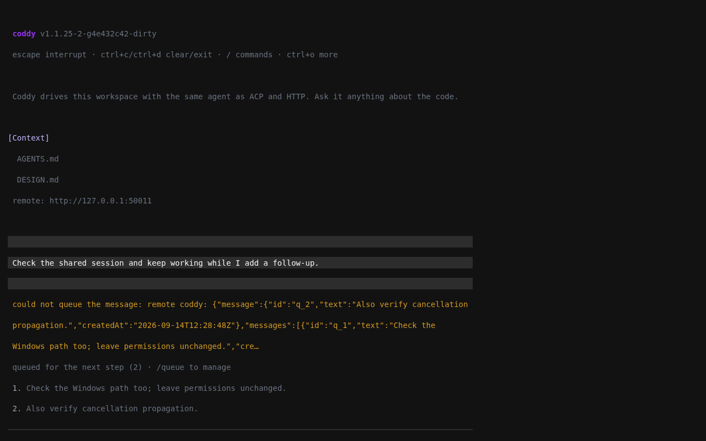

*Удалённая консоль управляет ходом, начатым извне, - Enter ставит продолжение в очередь, а Escape запрашивает отмену.*

Общая очередь требует, чтобы клиенты работали с одним серверным процессом. Обычная локальная консоль или локальный процесс ACP, у которых общая только папка сессий, имеют собственную очередь и каналы ответов; отмена между процессами идёт через маркер отмены в бандле. Одноразовые вызовы `-p/--prompt` сохраняют прежнее поведение промпта и неинтерактивную обработку разрешений и вопросов.

`/reasoning` без аргумента открывает селектор с доступными уровнями активной модели; выбранное значение сохраняется в сессии. `/reasoning <level>` сразу выбирает и сохраняет этот уровень. `shift+tab` перебирает те же уровни и сохраняет выбор так же. Для моделей без уровней рассуждения консоль сообщает, что рассуждение недоступно; на неподдерживаемое значение, заданное напрямую, она перечисляет уровни, которые можно выбрать.

Самонастройка агента работает так же, как через ACP и HTTP. Каждый ход предлагает поэтапные инструменты конфигурации (`config_get`, `config_set`, `config_changes`, `config_commit`, `config_revert`, `config_rollback`; см. **Самонастройка агента** в `docs/reference/config.md`), а фиксация или откат перезагружают работающую консоль на лету, поэтому каталог моделей (`ctrl+l`, `ctrl+p`), футер и разделы шапки `[Context]`, `[Skills]`, `[Rules]` и `[MCP]` следуют новому файлу без перезапуска. MCP-серверов в этом файле нет - консоль следит за `~/.coddy/mcp.json`, и его правка доходит до сессии за пару секунд ([MCP](../features/mcp.md#правки-вне-coddy)). `-p/--prompt` предлагает те же инструменты; при `--remote` перезагрузкой управляет сервер.

| Клавиша | Действие |
|-----|--------|
| enter | отправить, когда ход не идёт; во время хода поставить черновик в очередь в режиме `agent.queue_mode` (в первый раз спрашивает, в каком) |
| tab | во время хода с черновиком поставить его в очередь в другом режиме |
| shift+enter / ctrl+j | новая строка (обратная косая черта и enter тоже разбивают строку) |
| escape | прервать текущий ход (`HandleSessionCancel`) или остановить команду `!!` |
| ctrl+c | очистить редактор; два нажатия за 2 с завершают работу |
| ctrl+d | выйти, когда редактор пуст |
| ctrl+l | селектор моделей |
| F1 | встроенная документация - поиск, чтение, листание страниц (также `/docs`) |
| ctrl+p / ctrl+shift+p | перебрать настроенные модели |
| shift+tab | перебрать и сохранить уровень рассуждения сессии (для моделей с `reasoning_levels`) |
| ctrl+o | развернуть подсказки шапки, последний вывод инструмента и последний блок `!!` |
| ctrl+t | свернуть или развернуть блоки рассуждений |
| up / down | история на первой или последней строке, иначе перемещение курсора |

## Локальная оболочка (`!!`)

Отправленная строка, которая начинается с `!!`, не считается промптом. Coddy выполняет остаток строки в рабочей папке той оболочкой, которой пользуется `run_command`, и ни команда, ни её вывод не показываются модели, не сохраняются в бандле сессии и не учитываются в окне контекста. Это префикс bash-режима из pi; вторая его половина из pi, `!`, которая передаёт вывод обратно модели, пока отложена.

- префикс учитывается только в начале отправленной строки; пока в буфере команда, линии редактора зеленеют. Чтобы отправить промпт, который действительно начинается с `!!`, экранируйте его один раз - `\!!careful` дойдёт до модели как `!!careful`;
- вывод потоком идёт в отдельный блок транскрипта - последние 10 строк в свёрнутом виде, весь захваченный вывод по `ctrl+o` и завершающая строка `exit N`, если команда завершилась с ошибкой. Вывод декодируется и очищается от управляющих последовательностей точно так же, как вывод инструментов, и хранятся только последние 256 КиБ (блок сообщает, сколько отброшено), поэтому `tail -f` не раздувает консоль и не замедляет её;
- модального окна разрешений нет, и `ask` / `accept_edits` / `bypass` не действуют - команду отдаёт оператор, который её набрал, а не модель. Режим "План" ограничивает инструменты агента, а не терминал перед вами;
- `escape` убивает работающую команду и группу процессов, которую она возглавляет, и выход из консоли делает то же самое, поэтому в терминал, который coddy только что вернул, ничего не продолжает печататься. Работа, которую команда намеренно отсоединяет (`cmd &`, `nohup`), переживает её точно так же, как в вашей собственной оболочке, - когда сама команда завершилась, консоли уже нечего останавливать. Второй `escape` возвращает консоль, если завершить процесс никак не удаётся. Тайм-аута нет, и в пул фоновых задач команда не передаётся - этот пул намеренно виден агенту;
- по одной за раз - строка `!!` отклоняется, пока идёт ход, а пока работает команда, консоль отклоняет промпты, ещё одну `!!` и любые модальные окна (`/new`, `/resume`, `/permissions`, `/theme`, `ctrl+l`), каждый раз сообщая об этом в строке состояния, и ничего из этого не ставится в очередь. Модальное окно перехватило бы `escape`, а это единственная клавиша, которая останавливает команду;
- команда читает из нулевого устройства, а не из терминала, поэтому интерактивная программа (`!!python`) видит EOF и не перехватывает нажатия клавиш у редактора;
- `--remote` её отклоняет. Рабочая папка сессии находится на сервере, и команда, выполненная на этой машине, молча затронула бы другое дерево;
- `-p/--prompt` префикс не интерпретирует, и одноразовый промпт уходит модели дословно.

Блок принадлежит только работающей консоли. При повторном открытии сессии через `-c`, `--session-id` или `/resume` он не воспроизводится, потому что ничего о команде `!!` на диск не пишется.

Открытые модальные окна заменяют редактор - запросы разрешений (список вариантов берётся из `permission.Options` агента), инструмент вопросов (одиночный или множественный выбор пробелом, свободные ответы текстом), селекторы модели, рассуждения, разрешений, темы и сессии (курсор `→ `, фильтр по вводу, индикатор прокрутки `(i/n)`).

Фоновый субагент продолжает работать после того, как запустивший его ход закончился, и когда ему нужно разрешение, он спрашивает через то же модальное окно с заголовком `[subagent <name>] …`, в том числе между ходами. Разрешение или вопрос, пришедшие, пока на экране другой запрос, ждут его закрытия, а не заменяют его, а запрос, автор которого перестал ждать (субагента остановили или у него истекло время), убирается. Запрос субагента, ещё открытый, когда заканчивается запустивший его ход, закрывается вместе с этим ходом и сразу открывается снова уже как запрос самого субагента, так что отвечать на него нужно один раз. Одноразовый режим печати завершается вместе со своим ходом, поэтому фоновый субагент там отклоняется с указанием причины.

Модальное окно вопроса отдаёт каждую строку под подпись варианта и печатает описание выделенного варианта под списком с переносом по словам на всю ширину, поэтому ответ длиной в предложение остаётся читаемым и не обрезается на границе колонки. Когда на вопрос ответили, его блок инструмента показывает вопросы с выбранными ответами (`→ answer`, `→ (no answer)` для отклонённого), а не JSON, который инструмент передаёт модели.

## Флаги

`--config --home --cwd --sessions-dir` работают так же, как в других подкомандах. `-t/--test-config` проверяет файл конфигурации, который загрузила бы консоль, по схеме и правилам загрузчика, печатает каждую проблему с номером строки и способом исправления и при ошибках завершается с кодом 1 (см. [config.md](../getting-started/configuration.md#проверка-файла-из-командной-строки)); он работает и в облегчённых сборках без тега `cli`. `--dry-run` идёт на шаг дальше. После этой проверки он опрашивает то, на что указывает файл (каталоги, которые он называет, список моделей каждого провайдера с адресом и учётными данными в одном запросе, команды MCP, токен Telegram, цель `--remote`, если она задана), и завершается с кодом 1, если какой-то опрос не прошёл. Сам по себе он печатает только проблемы и строку состояния; вместе с `--test-config` он печатает отчёт проверки конфигурации и результаты всех опросов (см. [config.md](../getting-started/configuration.md#пробный-запуск---проверка-того-на-что-указывает-файл)). `--session-id <id>` открывает заново (или создаёт) эту сессию и воспроизводит её транскрипт. `-c/--continue` открывает последнюю сессию, записанную для этой папки, пропуская запуски одноразового режима печати, которые продолжает только `-c -p` (если такой нет, выдаёт ошибку; несовместим с `--session-id` и `--resume`). `--resume` сначала открывает окно выбора сессии и ничего не создаёт, пока вы не выберете, запусков режима печати в нём тоже нет (несовместим с `--session-id`; `--model`, `--mode` и `--permission-mode` применяются к той сессии, которую вы выберете). `--model`, `--mode agent|plan|ask` и `--permission-mode ask|accept_edits|bypass` применяются через проверяемый API параметров конфигурации менеджера до запуска интерфейса, в любом режиме запуска (интерактивном, `--continue`, `--resume` и `--prompt`), и записываются в сессию так же, как переключение внутри неё, включая режим разрешений, поэтому сессия сохраняет их, когда её открывают снова, в том числе после перезапуска, а режим разрешений заодно становится режимом новых сессий. `--theme
dark|light|auto` (auto смотрит на COLORFGBG, а без него выбирает dark).
`--plain` отключает запросы к терминалу, modifyOtherKeys, заголовки окна и OSC 8 ради детерминированной автоматизации. Логи принудительно уводятся из терминала в `<home>/logs/cli.log` (`--log-file`, `--log-level`). `--log-level` принимает просто уровень или спецификацию через запятую, которая отдельно поднимает уровень одной подсистемы, например `--log-level "info,agent=debug"` (см. [config-reference.md](../reference/config.md#logger)).

## Одноразовый режим печати (`-p/--prompt`)

`coddy -p "..."` (или `coddy cli --prompt "..."`) выполняет один ход агента без терминала - текст ассистента потоком идёт в stdout, диагностика в stderr, а при ошибках или отменённом ходе процесс завершается с ненулевым кодом. Tty не нужен, поэтому режим подходит для скриптов и cron. Ход сохраняется как сессия с пометкой запуска режима печати (`origin: print` в `session.json`), и `-c -p "..."` продолжает её - токены, файлы и состояние инструментов переносятся точно так же, как в интерактивной консоли. Списки, из которых человек выбирает диалог, запуски режима печати не показывают. Это История веб-интерфейса, пока в ней не выбран фильтр **Запуски CLI**, `/resume`, интерактивный `coddy -c` и `session/list` редактора ([Сессии](../features/sessions.md#теги-и-архив)). `coddy sessions list` их по-прежнему выводит, поэтому запуск, которому не хватило времени, находится по папке и продолжается через `--session-id <id> -p "..."`. Сессия, которую запуск открывает заново (`-c` или существующий `--session-id`), сохраняет своё происхождение. Запросы разрешений решаются без участия человека - `bypass` разрешает, при любом другом режиме вызов отклоняется с пометкой в stderr. Инструмент вопросов возвращает пустые ответы. `--model`, `--mode`, `--permission-mode`, `--session-id` и `--continue` сочетаются с `--prompt`, а `--resume` нет (ему нужно интерактивное окно выбора).

`--ephemeral` удаляет сессию запуска, когда запуск заканчивается, как бы он ни закончился, в том числе после неудачной настройки, неудачного или отменённого хода. Пока запуск идёт, сессия существует, поэтому субагенты, фоновые команды и записи инструментов работают как в любом запуске, а удаление останавливает всё, что запуск оставил работать. После аварийного завершения сессия может остаться, скрытая, как любой запуск режима печати. Если удалить её не удалось, в stderr выводится предупреждение, а код выхода остаётся кодом хода. С `--remote` сессию удаляет сервер. Флаг не принимается без одноразового промпта, а также вместе с `-c` и `--session-id`, потому что их сессии запуску не принадлежат.

### Промпт из файла или stdin

Промпту не обязательно проходить через командную строку, где операционная система ограничивает размер одного аргумента (128 КиБ в Linux), а `$(< file)` теряет завершающие переводы строк файла. coddy читает его сам.

```bash
coddy -p - < brief.md          # the prompt on stdin
cat brief.md | coddy -p        # the same: a bare -p reads a pipe
coddy -i brief.md --mode ask   # the prompt from a named file
coddy -p -i brief.md           # the same, -p only asks for print mode
```

Промпт берётся ровно из одного места - из текста после `-p`, из stdin (`-p -`, `-i -` или `-p` без значения, когда stdin не терминал) или из файла, который называет `-i`. `-p -` в терминале сообщает в stderr, что читает промпт из терминала, и берёт всё, что набрано до ctrl+d. Промпт, который сам выглядит как флаг coddy (`-c`, `--mode`), нужно записывать как `-p=-c`, потому что `-p`, за которым идёт флаг, читает промпт из stdin. Промпт отправляется точно в том виде, в каком прочитан, вместе с концами строк, завершающими переводами строк и кавычками, и разбирается как набранный текст - упоминание `@path` в нём прикрепляет этот файл, а `/skill` или `/model ...` в начале работают так же, как в редакторе. Относительный путь в `-i` разрешается от каталога, в котором запущена команда, как любой аргумент оболочки (`--cwd` переносит сессию, но не путь). Символические ссылки раскрываются, FIFO вроде `-i <(make report)` читается до конца, а каталог отклоняется.

### Данные, переданные через конвейер вместе с промптом

Если промпт пришёл из командной строки или из `-i`, а stdin - конвейер или перенаправленный файл, coddy читает stdin до конца и прикрепляет его после промпта, так же как `codex exec` дописывает stdin из конвейера.

```bash
git diff origin/main...HEAD | coddy -p "Review this change" --mode ask
make test 2>&1 | coddy -p "Why does the build fail?"
coddy -p "Summarize the incidents" < app.log
```

Модель видит его как `<coddy_attachment path="stdin" name="stdin"
kind="stdin">`, а транскрипт показывает на его месте
`[stdin]`. Это данные - `@` внутри них не читает файл и не загружает страницу, `/command` внутри них ничего не запускает, поэтому текст из источника, который вы не контролируете, передавайте здесь, а не в промпте. Строка в stderr сообщает, сколько прикреплено, а пустой ввод ничего не прикрепляет. Терминал, `/dev/null` и сокет на stdin никогда не прикрепляются; они читаются, только когда сам промпт должен прийти из stdin (`-p -`, а для всего, кроме терминала, и `-p` без значения, чтобы программа, запускающая coddy, могла записать промпт в него).

Поэтому существующий вызов `coddy -p "..."` начинает отправлять другое везде, где его stdin занят чем-то посторонним. В таких местах передавайте `--no-stdin` (или перенаправляйте `< /dev/null`):

- в цикле `while read -r f; do ...; done < list`, где первый запуск прочитал бы остаток списка;
- за `ssh host coddy -p ...`, который держит stdin открытым (`ssh -n` тоже помогает);
- в раннере CI, который подаёт скрипт джобы оболочке через stdin, как это делают раннеры GitLab, - без флага coddy прочитал бы остаток скрипта и отправил его модели, а строки после вызова так и не выполнились бы;
- в git-хуке, который получает строки ссылок через stdin (`pre-push`, `pre-receive`), и в контейнере, запущенном через `docker run -i`;
- в Windows PowerShell, где нет перенаправления `<`.

Если конвейер молчит 3 секунды, в stderr появляется одна строка о том, что запуск ждёт ввода, и запуск продолжает ждать. Вывод медленного источника вроде `make` всё равно прикрепляется, а конвейер, который никто не закрывает, проявляется сообщением, а не молчаливым зависанием.

### Что отклоняется

Ввод читается и проверяется до загрузки конфигурации, до создания сессии и до любого запроса, поэтому отклонённый запуск ничего не отправляет и завершается с кодом 1:

- два промпта (`-p "text" -i brief.md`, `-p - -i brief.md`), повторный `-p` или `-i`, пустой `-p ""` или слова, оставшиеся после флагов (`coddy -p fix the
  bug` останавливается на "the", возьмите промпт в кавычки);
- отсутствующий или нечитаемый файл либо каталог;
- текст не в UTF-8 (ошибка называет смещение в байтах) или с байтом NUL. Метка порядка байтов UTF-8 отбрасывается, а UTF-16 с меткой порядка байтов декодируется; любую другую кодировку, включая UTF-16 без метки, сначала нужно перекодировать (`iconv -f cp1251 -t utf-8`);
- больше 8 МиБ входных данных промпта, файла промпта и stdin вместе. Ничего не обрезается, чтобы уложиться в предел. Ограничение касается того, что читает coddy; поместится ли такой большой промпт, зависит от окна контекста модели.

При `--remote` клиент читает всё сам и отправляет промпт как `input` запроса, а данные из конвейера - как буквальное вложение вида `stdin`. Сервер обрезает пробельные символы вокруг `input`, поэтому собственные начальные и завершающие переводы строк промпта по пути теряются, а вложение доходит байт в байт. Упоминание `@` в файле промпта разрешается на сервере, в его рабочей папке.

## Удалённый режим (`--remote`)

`--remote <target>` направляет консоль (интерактивную и запуски печати `-p`) на удалённый сервер `coddy serve`, вместо того чтобы выполнять агента в своём процессе. Цель - имя настроенного удалённого сервера (`httpserver.remotes`), просто `host:port` (схема по умолчанию http) или полный URL http(s). Bearer-токен берётся из первого заданного источника - `--remote-token`, `token` подходящей записи `httpserver.remotes` (узел, смонтированный за настроенным релеем, берёт токен релея) и `CODDY_REMOTE_TOKEN`. Та же пара флагов работает в `coddy acp`, так что и ACP-редактор может управлять удалённым coddy.

Ходы выполняются на сервере, в его рабочей папке. Для хода, который начинает эта консоль, транскрипт, блоки инструментов, рассуждения, обновления плана, статистика токенов и контекста возвращаются потоком по SSE; модальные окна разрешений и вопросов отвечают через REST-эндпоинты сервера; `ctrl+o` получает полный вывод инструмента с сервера. Селектор моделей показывает удалённый каталог (`GET /v1/models`) и ставит сессию без собственной модели на строку, которую сервер помечает `default` (`agent.model` сервера или его первая строка `models`, если `agent.model` называет модель, которой нет в списке), а `/resume`, `-c` и `--session-id` работают со списком сессий сервера (фильтр по локальной папке не действует). Команды настроек меняют сессию на сервере через тот же `PATCH /coddy/sessions/{id}`, что и браузер, включая режим разрешений, - `/permissions`, `--permission-mode` и переключатель сессии в диалоге доходят до сервера, а футер следует событиям `session_settings` сервера и, при загрузке сессии, снимку, которым отвечает сервер. Изменение, сделанное до того, как на сервере появилась сессия, откладывается и отправляется строками команд перед первым промптом. `/reasoning` и `shift+tab` сохраняют выбранный уровень рассуждения в серверной сессии. Сессии хранятся только на сервере; баннер при запуске показывает `remote: <url>`, а подсказка при выходе печатает команду переподключения вместе с `--remote`.

Субагенты работают на удалённом хосте - определения, расписки доверия и дочерние сессии принадлежат серверу. Одобряйте проектное определение там (`coddy
agents trust` на сервере или
`POST /coddy/subagents/{name}/trust`); локальные подкоманды `coddy agents` не принимают `--remote`. Запросы разрешений дочернего агента доходят до удалённой консоли так же, как запросы родителя, с префиксом `[subagent <name>]`, а строка состояния показывает `Running a subagent`, пока дочерний агент работает; субагента, взявшего задачу, называет блок инструмента над строкой, и строка состояния этого никогда не повторяет. Фоновый дочерний агент, который спрашивает после окончания хода, тоже доходит до консоли - сервер объявляет запрос в своём потоке событий, а консоль открывает модальное окно для сессий, которые она открыла, и отвечает дочерней сессии; если на запрос первым ответили в браузере или в чате, модальное окно закрывается. После переподключения консоль сверяет полный снимок ожидающих запросов - запросы, на которые ответили, пока консоль была отключена, закрываются, а ещё ждущие остаются открытыми без дублирующих модальных окон. Прерванный снимок не снимает ожидающий запрос. Футер показывает локальную папку; ключ расписки доверия - серверная рабочая папка сессии (cwd сервера по умолчанию для сессии, которую создала консоль). Если соединение оборвалось, ход на сервере и его дочерний агент продолжают работать; `/resume` покажет результат, когда ход закончится, а ответ на запрос, который сервер уже отозвал, игнорируется. За ходом, который сервер сам разбудил в сессии, открытой в консоли (по окончании задачи с `notify_on_finish`), консоль следит через релей поля ввода сессии. О таком ходе объявляет `background_wake` в потоке событий, а для консоли, которая открывает сессию (`/resume`, `--session-id`), когда этот ход уже идёт, - `backgroundWake` в активности сессии, и после переподключения - снимок потока событий, который подхватывает тот же ход после последнего показанного кадра. Ответ и запрос разрешения доходят до консоли так же, как для хода, который она начала сама, а запрос, на который первым ответили в браузере, снова закрывается. Собственный механизм пробуждения консоли при `--remote` выключен - задачи работают в пуле сервера, и агента будит сервер. Выход из консоли посреди хода ненадолго ждёт, пока удалённая отмена дойдёт до сервера. См. `docs/features/subagents.md`, раздел об удалённом режиме.

## Определения субагентов (`coddy agents`)

Три подкоманды управляют определениями субагентов, которым агент может делегировать работу (`docs/features/subagents.md`). Как и `coddy mcp` и `coddy rules`, им не нужен тег сборки.

```
coddy agents list [--cwd DIR]
coddy agents trust <name> [--cwd DIR]
coddy agents untrust <name> [--cwd DIR]
```

`list` выводит рабочую папку и действующее значение `subagents.project_trust`, затем каталог в виде таблицы с колонками `NAME`, `SCOPE` (`builtin`, `user`, `project`), `TRUST` (`trusted` или `needs_approval`), `FLAGS` (`hidden`, `model=…`, `mode=…`), `DESCRIPTION` и `PATH` (`(embedded)` для встроенных), строку `(total N)` и подсказку, если проектные определения ждут одобрения. `trust` сначала выводит действующее объявление (файл, модель, режим, режим разрешений, списки инструментов, хеш, путь к расписке), а затем записывает расписку на файл в его нынешнем виде на диске с ключом из канонической рабочей папки, имени и хеша файла в `<home>/subagents-trust.json`; встроенному имени или имени из пользовательской области одобрение не нужно, и команда об этом сообщает. `untrust` отзывает расписку. По умолчанию `--cwd` равен рабочему каталогу процесса и разрешается так же, как у `coddy mcp`. При `subagents.project_trust: deny` файлы проекта вообще не попадают в список, а при `allow` им не нужна расписка.

В консоли вызов `spawn_agent` выглядит как блок инструмента, заголовок которого называет субагента, взявшего задачу (`spawn_agent explore · find every caller`); под заголовком выводится промпт, который получил дочерний агент, а его отчёт, когда вернётся, добавляется телом блока. Пока дочерний агент работает, строка состояния показывает `Running a subagent` со счётчиком прошедшего времени, а имя стоит в заголовке блока.

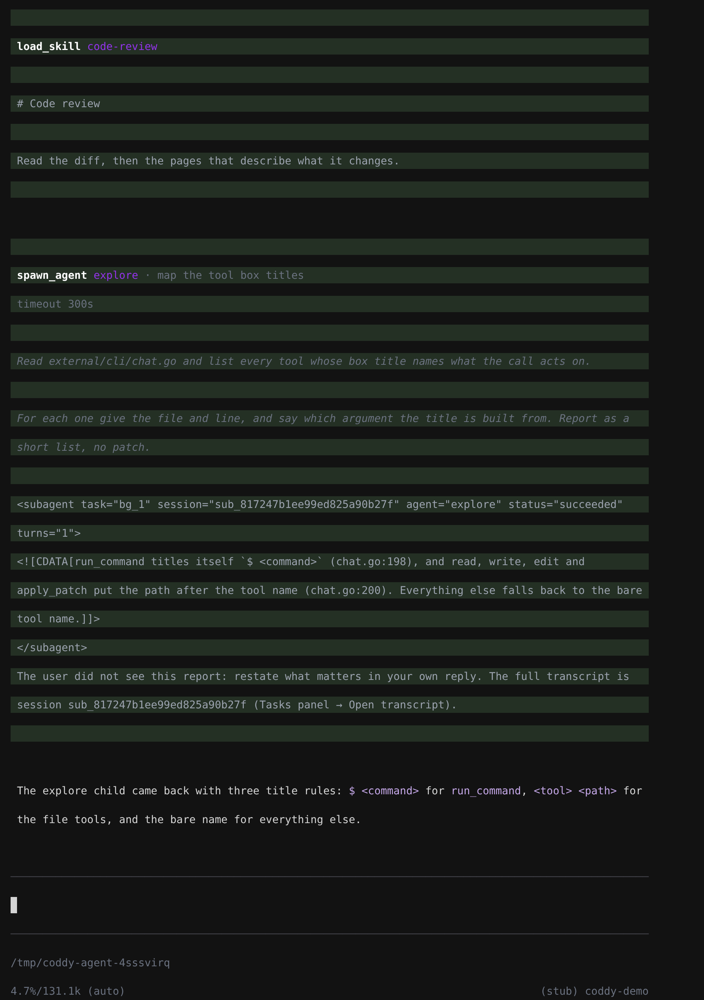

*Загруженный скил и делегированный запуск - заголовки блоков называют скил и субагента с задачей и выданным ему тайм-аутом; приглушённый курсивный блок - промпт, который получил дочерний агент, а за ним идёт его отчёт*

Запрос разрешения дочернего агента, пока запустивший его ход ещё жив, открывает обычное модальное окно в родительском чате с префиксом `[subagent <name>]` в заголовке. Дочерние сессии доступны только для чтения. `-c` никогда их не выбирает, а промпт, отправленный в такую сессию, отклоняется с сообщением, которое называет родительскую сессию.

## Файлы определений хуков (`coddy hooks`)

Три подкоманды управляют файлами определений хуков, которые загрузила бы сессия (`docs/features/hooks.md`). Как и `coddy agents`, им не нужен тег сборки.

```
coddy hooks list [--cwd DIR]
coddy hooks trust <file> [--cwd DIR]
coddy hooks untrust <file> [--cwd DIR]
```

`list` выводит рабочую папку и действующее значение `hooks.project_trust`, затем таблицу с колонками `FILE` (имя, которое используют расписки, - путь относительно рабочей папки для файла проекта и абсолютный путь для собственного файла оператора), `SCOPE` (`user`, `project`), `TRUST` (`trusted` или `needs_approval`) и `HOOKS` (сводка вроде `PreToolUse(run_command); PostToolUse(*)` или `invalid: <error>` для файла, который не разбирается), строку `(total N)` и подсказку, если файлы проекта ждут одобрения. `trust` выводит хуки, которые собирается одобрить (событие, матчер, команда), и записывает расписку на файл в его нынешнем виде на диске с ключом из канонической рабочей папки, файла и его хеша в `<home>/hooks-trust.json`; файлу пользовательской области одобрение не нужно, и команда об этом сообщает, а некорректный файл отклоняется. `untrust` отзывает расписку. По умолчанию `--cwd` равен рабочему каталогу процесса и разрешается так же, как у `coddy mcp`. При `hooks.project_trust: deny` файлы проекта вообще не попадают в список, а при `allow` им не нужна расписка. Удалённая консоль (`--remote`) вместо этого одобряет файл через `POST /coddy/hooks/trust` на сервере, потому что расписка должна лежать на машине, где работают хуки.

## Безопасность

Весь текст, пришедший не от отрисовщика, - вывод модели, предпросмотры инструментов, заголовки, имена файлов, имена скилов и MCP - перед выводом очищается. ESC, управляющие символы C0 (кроме перевода строки и табуляции), DEL и управляющие символы C1 удаляются, поэтому escape-последовательности от модели или инструмента никогда не доходят до терминала. Единственные управляющие последовательности в отрисованных строках - стили, которые создаёт сам отрисовщик.

Режим разрешений `ask` показывает каждый запрос модальным окном; `bypass` пропускает запрос точно так же, как путь `serverRef` в ACP. У префикса `!!` намеренно нет проверки разрешений (см. **Локальная оболочка**) - до него можно добраться только из отправленного буфера редактора и никогда из вывода модели, поэтому ничто, написанное моделью, не может запустить через него команду. Проектные MCP-серверы по-прежнему проходят проверку доверия рабочей папки; сервер, ждущий одобрения, остаётся отключённым и виден через `coddy mcp list` (одобрить его можно командой `coddy mcp trust <name>`).

## Скриншоты


*Строка запуска с шапкой, разделы `[Context]` и `[Skills]`, редактор и футер с использованием аккаунта у провайдера модели*


*Селектор моделей по ctrl+l - все настроенные модели, текущая отмечена стрелкой*

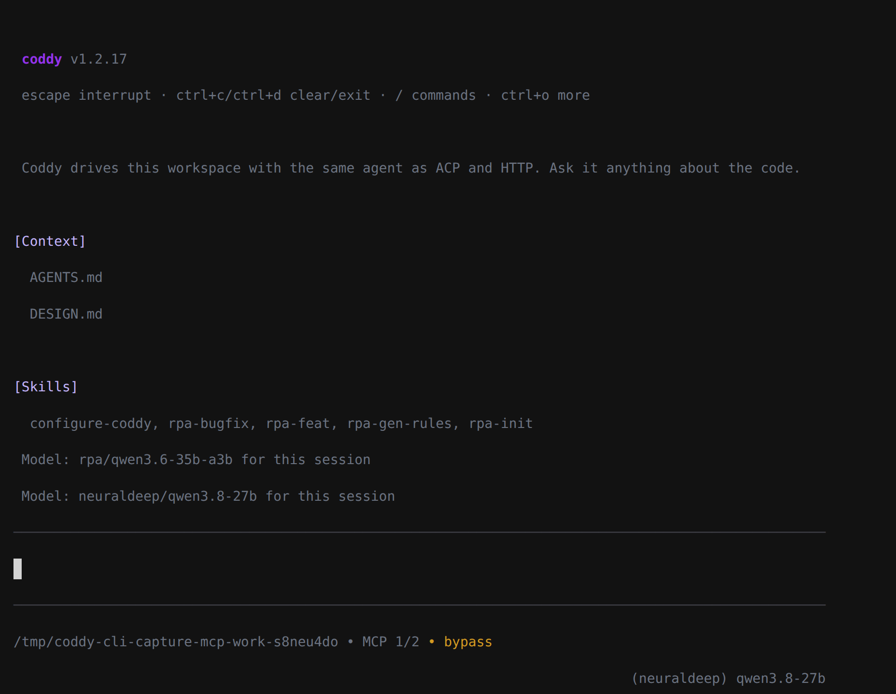

*Первый кадр - консоль отрисована и принимает нажатия, пока её MCP-серверы подключаются, а футер считает их (`MCP 1/2`)*

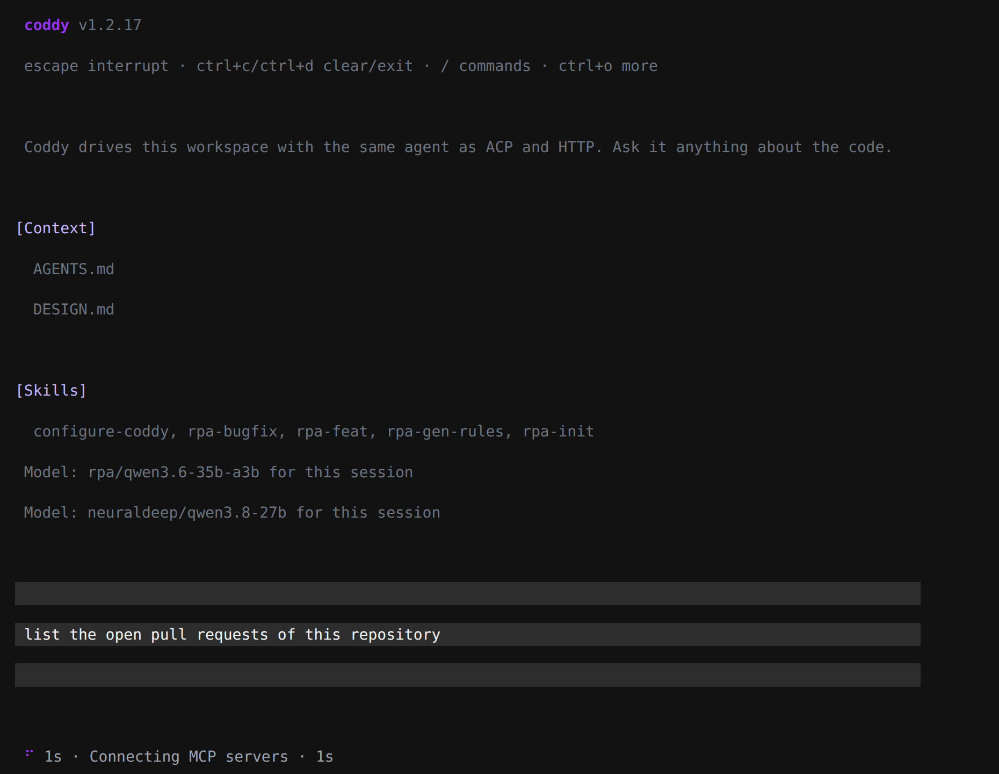

*Промпт, отправленный до ответа серверов, ждёт свой список инструментов на строке состояния*

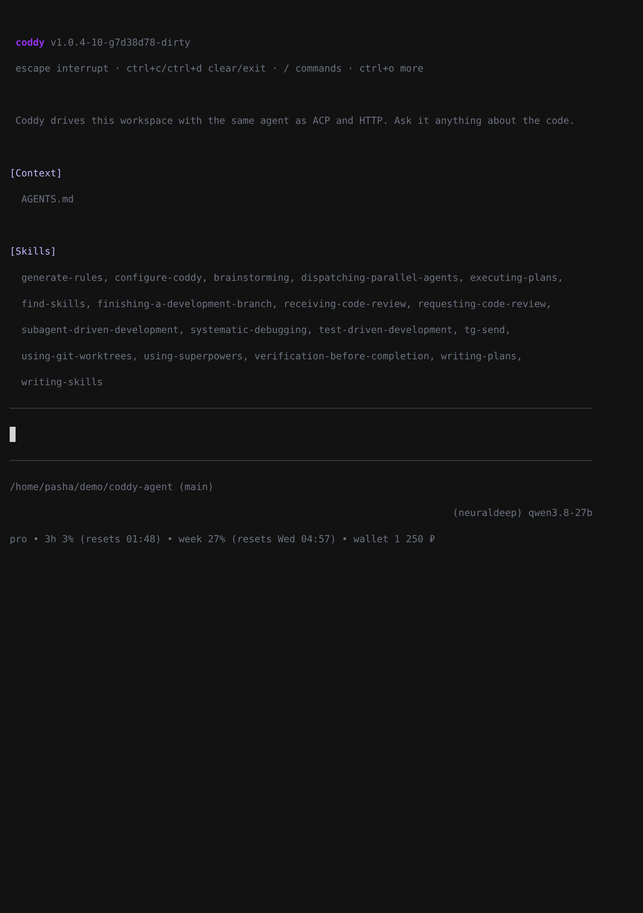

*Футер с окнами использования аккаунта*

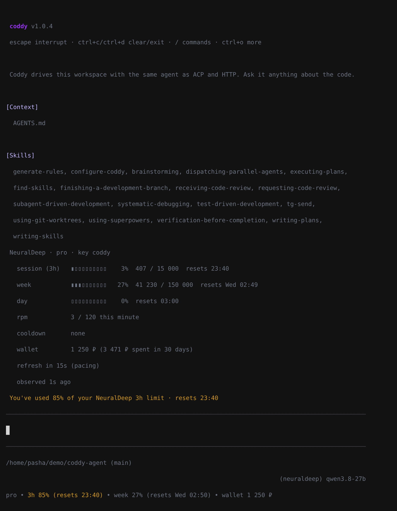

*Предупреждение в футере, когда окно заполняется*

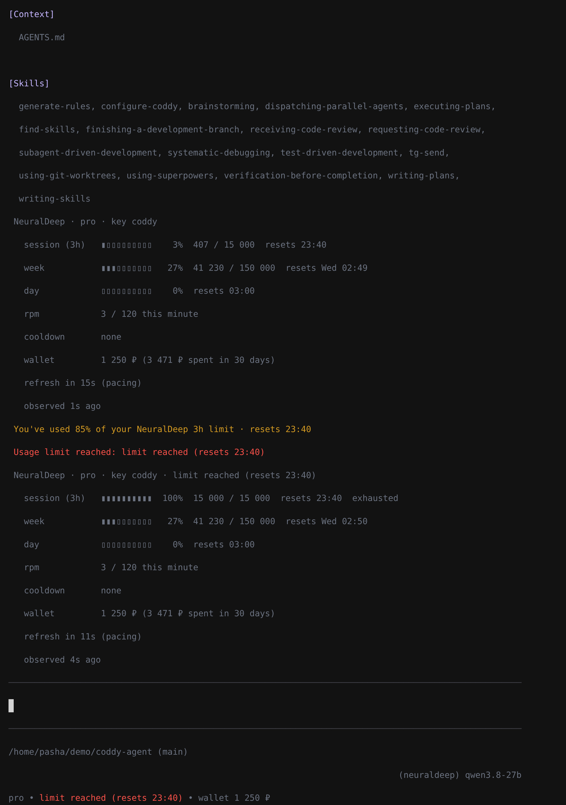

*Лимит исчерпан, ход ждёт сброса*

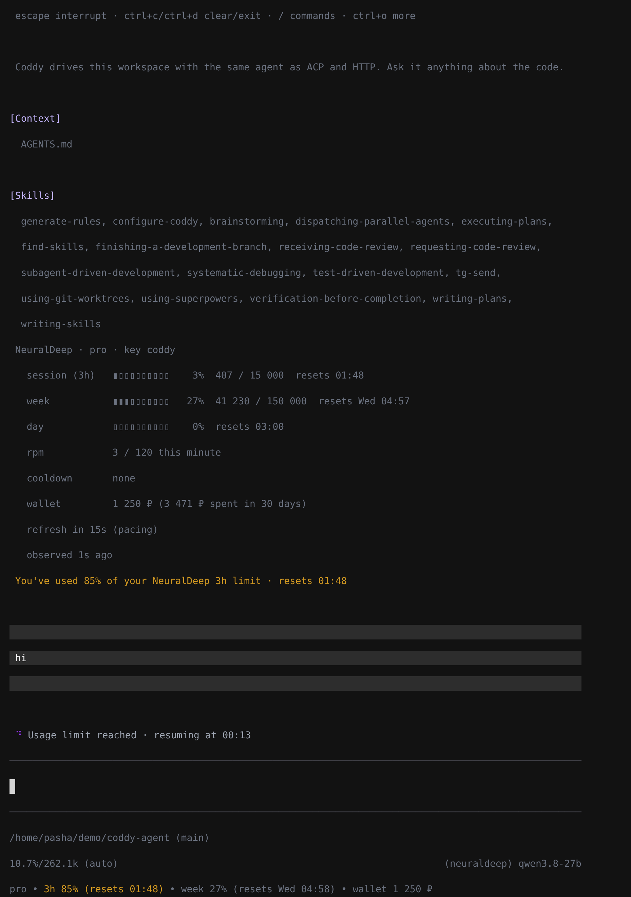

*Ход возобновляется после сброса*


*Строка состояния идущего хода начинается с его часов, сгенерированных в нём токенов и работающей фоновой задачи; футер тоже называет задачу*


*`/tasks` - фоновые задачи сессии на месте редактора*

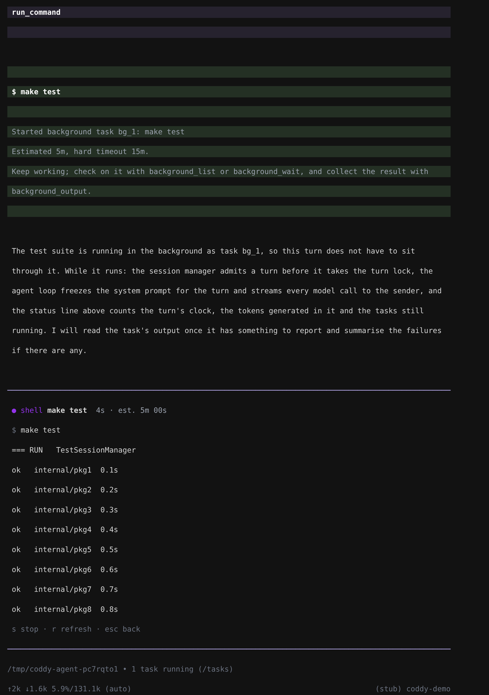

*Задача, открытая по enter, - команда, последние строки вывода и `s` для остановки*

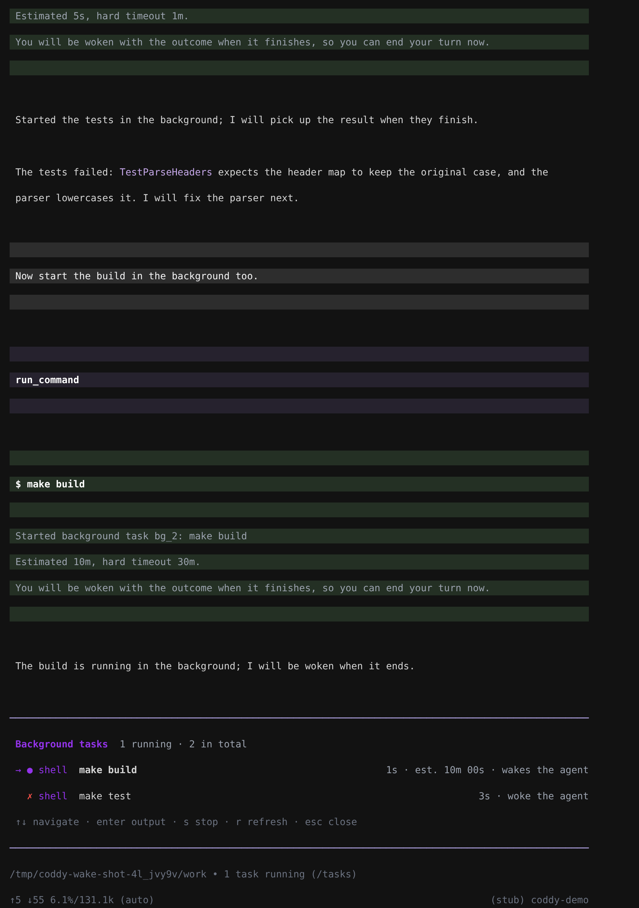

*После пробуждения ответ агента идёт сразу за его предыдущим ходом, а `/tasks` сообщает, какая задача его разбудила и какая разбудит*

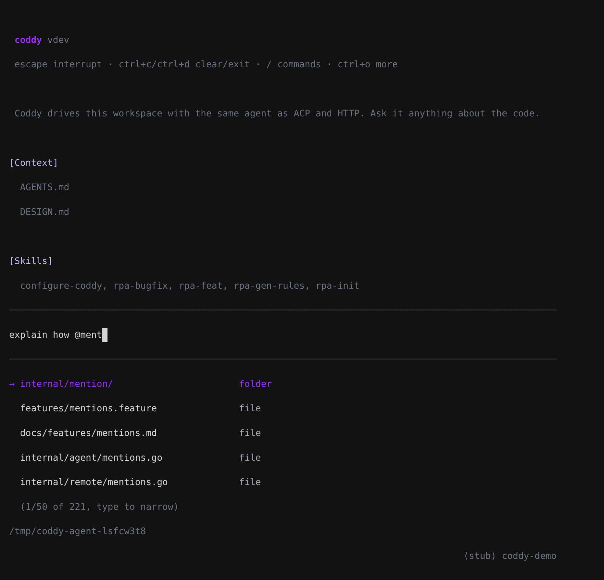

*`@ment` - вся рабочая папка, ранжированная по фрагменту, вид каждой строки и сколько совпадений не вошло в пятьдесят, которые вмещает список*

Наборов скриншотов два, и они отвечают на разные вопросы.

`docs/assets/screenshot-console-*.png` снимают работающую консоль в настоящем окне **Konsole** (ширина 1920 пикселей, обрезка по занятым строкам). Это строка запуска и шапка с `[Context]` / `[Skills]` (`screenshot-console-start.png`), селектор моделей по `ctrl+l` (`screenshot-console-models.png`) и завершённый ход с блоком инструмента, блоком рассуждений и счётчиками футера (`screenshot-console-chat.png`). Используйте их в README и на сайте, потому что они показывают то, что пользователь действительно видит в эмуляторе терминала. Они сняты на чистом `CODDY_HOME` с двумя собственными скилами и небольшим проектом с `AGENTS.md`, поэтому шапка перечисляет то, что видит новый пользователь.

В `docs/assets/cli-tui/` лежат PNG, отрисованные из буфера pyte скриптами `examples/cli/capture_*.py`, по одному на функцию; каждый управляет общим e2e-драйвером с моделью-заглушкой по сценарию. Это эталоны цветов и раскладки ячеек, а не рекламные картинки; перегенерируйте те, у которых изменилось оформление. `examples/cli/capture.py` отрисовывает базовые состояния (запуск, меню слэш-команд, селектор моделей, ход) для сравнения на вашей машине; ни одно из них не коммитится. Четыре состояния использования (`09-usage-footer`, `10-usage-warning`, `12-usage-resuming`, `11-usage-blocked`) дают `examples/cli/capture_usage.py`, который поднимает поддельный хаб `GET /limits` за `CODDY_NEURALDEEP_BASE_URL` и один chat completion, отвечающий для ожидающего хода `429` со сбросом далеко впереди, поэтому настоящий ключ не нужен; хранятся только их PNG. `13-subagent-delegation` так же получается из `examples/cli/capture_subagent.py` - локальный OpenAI-совместимый эндпоинт по сценарию выдаёт вызов `load_skill`, вызов `spawn_agent`, отчёт дочернего агента и ответ родителя, поэтому для снимка не нужны ни провайдер, ни ключ. `18-mention-list` получается из `examples/cli/capture_mentions.py`, который раскладывает файлы этого репозитория пустыми и под git во временной папке с временным домашним каталогом и набирает `@ment` при провайдере, которому не задаётся ни одного вопроса. `session-settings-console-footer-dark` получается из `examples/cli/capture_settings.py` - `/permissions bypass`, затем цепочка `/model --once /reasoning --count=3` с временным домашним каталогом, который подменяет и `HOME`, поэтому шапка перечисляет только встроенные скилы.


## Тестирование

- юнит-тесты и BDD - `go test -tags=cli ./...`; спецификация основного сценария - `features/cli_tui.feature`, её выполняет `external/cli/bdd_cli_tui_test.go` (раннер-заглушка, поддельный терминал, без LLM и без pty). Сценарии использования провайдера поднимают поддельный хаб `GET /limits` за `CODDY_NEURALDEEP_BASE_URL` (на весь процесс, поэтому пакет остаётся последовательным) и управляют часами интервала опроса менеджера через `SetProviderUsageClock`; `external/cli/usage_test.go` фиксирует формулировки футера, порядок исчезновения элементов, тексты блокировок, очистку строк хаба и таймер сброса;
- одноразовый ввод - `features/cli_prompt_input.feature` (`external/cli/bdd_prompt_input_test.go`) запускает `cli.Run` в тестовом процессе с конвейером или файлом на stdin с моделью по сценарию, которая записывает каждый запрос, и проверяет промпт байт в байт, вложение из stdin и метку в транскрипте; `external/cli/prompt_input_test.go` покрывает правила флагов, виды stdin, декодирование и ограничение и проверяет, что отклонённый ввод никогда не доходит до модели. `examples/cli/cli_e2e_print_input.py` делает то же с собранным бинарником и настоящей оболочкой - конвейеры, файлы, промпт на 200 КиБ, цикл `while read` и `-p` без значения на pty;
- настоящий pty без модели - `examples/cli/cli_e2e_startup.py` открывает собранный бинарник в pty (pexpect + pyte), ждёт первого кадра, печатает в редакторе, очищает его через ctrl+c и выходит вторым нажатием, затем проверяет подсказку для возврата к сессии и код выхода; второй сценарий настраивает stdio MCP-сервер, который никогда не отвечает (`sleep 600`), и проверяет, что первый кадр всё равно появляется за секунды, с `MCP 0/1` в футере, и что из консоли по-прежнему можно выйти двойным ctrl+c; третий добавляет 300 установленных скилов и источник в `marketplaces.json`, который принимает соединения и никогда не отвечает (issue #319), и проверяет, что первый кадр появляется в пределах двух секунд, набранная клавиша отображается, а к источнику ни разу не обращались. Второй и третий сценарии задают ограничения на запуск, которые проверяет CI. Производительность самого запуска измеряется, но сборку не блокирует - `make bench-cli-startup` замеряет первый кадр и эхо набранной пробной клавиши на разных наборах скилов в том же pty, а `make bench-cli-startup-real` делает то же на личной копии `~/.coddy` оператора вместе с MCP-серверами и сообщает, когда каждый сервер пришёл в устойчивое состояние и какие упали (`docs/plans/console-mcp-startup.md` хранит цифры, на которые ссылались изменения). CI запускает его в джобе `cli` тестовой матрицы Linux и на `macos-latest` (джоба `test-macos`, которая также прогоняет платформенные пакеты и набор тестов консоли на macOS), потому что набор тестов Go никогда не открывает pty, а терминальный путь консоли как раз и отличается между хостами;
- MCP-серверы всех видов на настоящем pty - `examples/cli/cli_e2e_mcp_servers.py` настраивает нативную программу (скрипт компилирует её из Go и запускает по пути), npm-пакет, запускаемый через настоящий `npx -y` из локальной папки (реестр не опрашивается), удалённый сервер по streamable HTTP и ещё один по SSE и обслуживает модель по сценарию, которая по очереди вызывает инструмент каждого. Скрипт проверяет первый кадр, четыре токена в ответе, что модель получила от каждого сервера и что в `/mcp` все четыре сервера значатся подключёнными. Ему нужны `go` и `npx` в `PATH`; CI запускает его в джобе `cli` тестовой матрицы Linux. `features/cli_tui.feature` описывает тот же сценарий в наборе тестов Go для программы, streamable HTTP и SSE, а `features/mcp_tool_calls.feature` прогоняет все виды, включая `npx`, через настоящий ход ReAct в HTTP-интерфейсе;
- очередь сообщений на настоящем pty без модели - `examples/cli/cli_e2e_queue.py` обслуживает модель по сценарию, первый ответ которой ждёт сигнала от скрипта, и проверяет вопрос при первом использовании и сохранённый `agent.queue_mode`, постановку в очередь в другом режиме через Tab, возврат сообщения в поле ввода через `/queue drop`, а после того как ответ отпущен, - сообщение steer, прочитанное в ходе, и отложенное, на которое ответили после него, показанное между двумя ответами. CI запускает его в джобе `cli` тестовой матрицы Linux;
- живой e2e - `./examples/test_cli.sh` управляет настоящим бинарником в pty (pexpect + pyte, только Linux), по умолчанию с моделью `neuraldeep/qwen3.8-27b`, см. `examples/README.md`.

Чек-лист регрессии остановки и очереди для интерактивной консоли с `--remote`:

- откройте сессию, ход в которой начал другой клиент, - Enter ставит текст в очередь вместо попытки второго промпта, Escape отправляет отмену;
- переподключитесь, пока продолжения ждут, - чтение очереди восстанавливает их без новой мутации, и более старые версии HTTP/SSE не заменяют более новые;
- понаблюдайте, как начинается или заканчивается внешний ход, - его активность не завершает собственный запрос промпта консоли и не подключает чужого читателя транскрипта;
- убедитесь, что одноразовые вызовы `-p` и модальные окна разрешений и вопросов сохраняют прежнюю принадлежность и обработку.

## Известные расхождения v1 с pi

Не перенесены отмена и yank-pop, а также режим прыжков в редакторе, согласование протокола клавиатуры kitty, встроенные изображения, bash-режим `!` из pi (та половина, что передаёт вывод команды обратно модели; `!!` поставляется так, как описано в разделе **Локальная оболочка**, а `!` требует записи в транскрипте, видимой модели, и пока отложен), интерфейс `/settings` из pi и элементы управления областью, сортировкой и переименованием в окне выбора сессии. Смена темы перестраивает оформление; уже отрисованные строки транскрипта сохраняют свои цвета до следующей сессии.

## Авторство

Модель отрисовки TUI и визуальный дизайн перенесены из [`pi-mono`](https://github.com/badlogic/pi-mono), а именно из `packages/tui` и интерактивного режима `packages/coding-agent` (MIT License, Copyright (c) 2025 Mario Zechner), коммит `b1efcf7d7`. Реализация на Go в `external/cli/tui` написана заново и независимо по документированному поведению.

<!-- docsgen:source sha256=cc2d20b8d5a17059 -->
