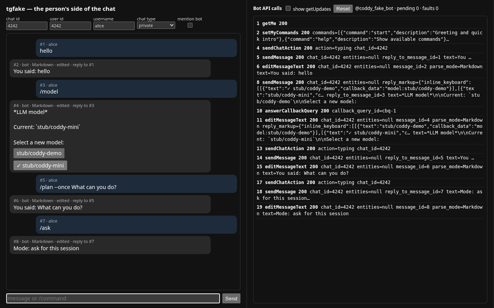
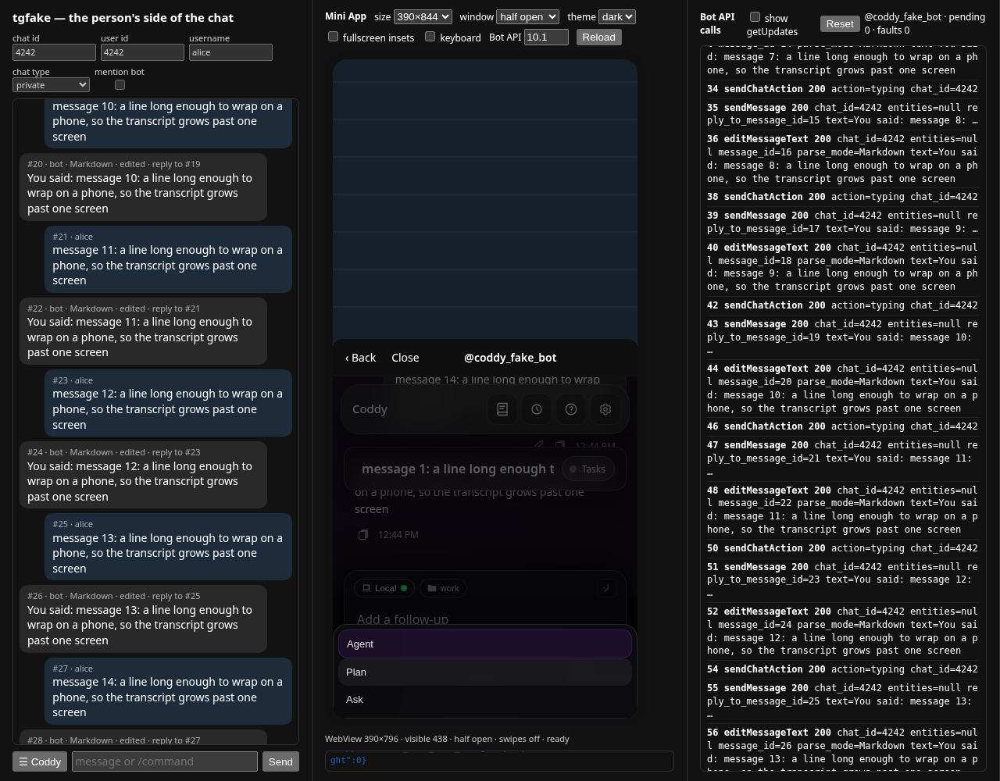

# Шлюз мессенджеров

Через шлюз мессенджеров вы управляете агентом Coddy прямо из мессенджера, например из Telegram. Агент работает в том же цикле ReAct, с теми же инструментами и скилами, что и в веб-интерфейсе по HTTP или в режиме ACP, а шлюз служит только транспортным слоем.

Эта страница посвящена Telegram-боту и общим частям шлюза. У бота-интеграции Pachca (Пачка) своя страница - [Шлюз Pachca](pachca.md).

## Содержание

- [Обзор](#обзор);
- [Теги сборки](#теги-сборки);
- [Быстрый старт (Telegram)](#быстрый-старт-telegram);
- [Справочник по конфигурации](#справочник-по-конфигурации);
  - [Уровни доступа](#уровни-доступа);
  - [Режимы изоляции сессий](#режимы-изоляции-сессий);
  - [Переопределения для отдельных чатов](#переопределения-для-отдельных-чатов);
  - [Группы пользователей](#группы-пользователей);
- [Запуск шлюза](#запуск-шлюза);
- [Отладка чата](#отладка-чата);
- [Модель взаимодействия с ботом](#модель-взаимодействия-с-ботом);
  - [Личные чаты](#личные-чаты);
  - [Ответы на сообщения](#ответы-на-сообщения);
  - [Групповые чаты](#групповые-чаты);
  - [Команды](#команды);
- [Что нужно мессенджеру и где это сказано](#что-нужно-мессенджеру-и-где-это-сказано);
- [Как написать новый адаптер](#как-написать-новый-адаптер);
  - [1. Реализуйте интерфейс Adapter](#1-реализуйте-интерфейс-adapter);
  - [2. Добавьте serve_name.go и его заглушку](#2-добавьте-serve_namego-и-его-заглушку);
  - [3. Реализуйте acp.UpdateSender](#3-реализуйте-acpupdatesender);
  - [4. Добавьте тег сборки](#4-добавьте-тег-сборки);
  - [5. Зарегистрируйте подсистему в coddy serve](#5-зарегистрируйте-подсистему-в-coddy-serve);
- [Одна сессия в чате и в браузере](#одна-сессия-в-чате-и-в-браузере);
- [Mini App](#mini-app);
- [Ходы после пробуждения приходят в чат](#ходы-после-пробуждения-приходят-в-чат);
- [Картинки, которые смотрел агент](#картинки-которые-смотрел-агент);
- [Жизненный цикл сессии](#жизненный-цикл-сессии);
- [Замечания по безопасности](#замечания-по-безопасности).

## Обзор

```
Telegram / Pachca / future messengers
         │  polling / events history
         ▼
  external/gateway/          ← build tag: gateway | gateway.telegram | gateway.pachca
    Hub (goroutine per adapter, auto-restart)
         │
         ▼
  sessionstore               ← maps chat+user context → Coddy session ID
         │                     /clear replaces the stored ID, /resume binds it
         │                     to a session chosen from the server's list
         ▼
  session.Manager            ← shared with coddy acp / coddy serve
    HandleSessionPromptWithSender(...)
         │
         ▼
  ReAct agent loop           ← identical to HTTP and ACP paths
  (tools, skills, MCP, LLM)
         │
         ▼
  Sender (per-message)       ← buffers agent output, sends back to chat
```

Несколько шлюзов (сейчас Telegram и Pachca) работают в одном процессе, каждый как отдельная подсистема со своей картой сессий, поверх одного и того же менеджера сессий.

Этот менеджер они делят и со всем остальным, что запустил `coddy serve`. Один
процесс, один `session.Manager`, поэтому диалоги в чатах - обычные сессии Coddy,
которые видны в списке веб-интерфейса и открываются в нём прямо во время разговора.

## Теги сборки

| Тег | Что включает |
|-----|----------|
| `gateway.telegram` | только адаптер Telegram |
| `gateway.pachca` | только адаптер Pachca |
| `gateway` | все адаптеры (Telegram и Pachca) |

`gateway` входит в рекомендуемый полный набор, поэтому он есть в бинарниках
релиза, в пакетах и в опубликованном образе. Отдельно его собирают только ради
более компактного бинарника.

```bash
# Telegram only
make build TAGS="gateway.telegram"

# Pachca only
make build TAGS="gateway.pachca"

# All gateways
make build TAGS="gateway"

# The full set (what a release ships)
make build TAGS="http ui scheduler memory cli gateway swarm"
```

Если бот включён в `config.yaml`, но не вкомпилирован в бинарник, `coddy serve` при запуске завершается ошибкой с именем тега; на остальные подкоманды это не влияет.

## Быстрый старт (Telegram)

**Шаг 1 - создайте бота**

Напишите [@BotFather](https://t.me/BotFather) в Telegram.

```
/newbot
```

Сохраните токен, который он вернёт. **Никогда не коммитьте токен в систему контроля версий.** Храните его в переменной окружения.

```bash
export TELEGRAM_BOT_TOKEN="<your-token>"
```

**Шаг 2 - узнайте свой ID пользователя Telegram**

Отправьте любое сообщение [@userinfobot](https://t.me/userinfobot). В ответ он пришлёт ваш ID пользователя. Этот ID станет элементом списка `admins`.

**Шаг 3 - добавьте конфигурацию шлюза**

Добавьте в `~/.coddy/config.yaml` (или туда, где лежит ваш `config.yaml`) следующий блок.

```yaml
gateways:
  telegram:
    enable: true
    token: "${TELEGRAM_BOT_TOKEN}"
    admins: [98874093]           # your Telegram user ID
    default_access: "all"
    default_isolation: "individual"
```

**Шаг 4 - соберите и запустите**

```bash
make build TAGS="gateway.telegram"
./build/coddy serve --config ~/.coddy/config.yaml
```

Откройте Telegram, найдите своего бота и отправьте сообщение. Агент ответит в том же чате.

## Справочник по конфигурации

Вся конфигурация шлюзов лежит под ключом `gateways` в `config.yaml`. Когда `coddy serve` работает со встроенным интерфейсом, те же поля можно править в разделе **Настройки → Шлюзы → Telegram**. Блок `gateways` проходит через `GET`/`PUT /coddy/config` без потерь, поэтому сохранение настроек в интерфейсе его не затирает (токен бота показан полностью, так что пользуйтесь этим только в доверенных сетях).

```yaml
gateways:
  telegram:
    enable: false
    # Bot token. Optional: leave empty (or omit) to read it from the TELEGRAM_BOT_TOKEN
    # environment variable (e.g. via .env), the same way provider api_key falls back to
    # NAME_API_KEY. When telegram is enabled but no token can be resolved, the gateway
    # logs a warning and skips the bot instead of failing config validation.
    token: "${TELEGRAM_BOT_TOKEN}"

    # How the bot reaches the Bot API (see "Proxy" below). Left out, or inherit,
    # it follows HTTPS_PROXY, HTTP_PROXY and NO_PROXY of the Coddy process;
    # none connects directly; a URL (http, https, socks5, socks5h) goes through it.
    # proxy: none
    # proxy: "socks5h://127.0.0.1:1080"
    # proxy: "http://proxy.example.com:3128"

    # Bot API 10.1 Rich Messages (see "Rich Messages" below). Default false.
    rich_messages: true

    # Telegram user IDs with elevated privileges.
    # Admins always pass every access check regardless of default_access.
    admins: []

    # Default access level for chats without a per-chat override.
    # Values: "all" | "admins" | "group:<name>"
    default_access: "all"

    # Default session isolation for group chats without a per-chat override.
    # Values: "individual" | "shared" | "admin"
    default_isolation: "individual"

    # Named user groups for group-level access control.
    user_groups:
      - name: "devs"
        user_ids: [111222333, 444555666]

    # Per-chat overrides (optional). chat_id is negative for groups/supergroups.
    chats:
      - chat_id: -1001234567890
        isolation: "individual"
        access: "all"
      - chat_id: -1009876543210
        isolation: "admin"
        access: "admins"
```

### Прокси

`proxy` определяет, как бот добирается до Bot API, и читается так же, как `proxy` провайдера ([Прокси провайдера](../getting-started/configuration.md#прокси-провайдера)):

- значение не задано или `inherit` (по умолчанию) - прокси из окружения процесса Coddy, то есть `HTTPS_PROXY` для `https://api.telegram.org` и `NO_PROXY` для хостов, к которым бот идёт напрямую; для loopback-адреса прокси не используется никогда, а `ALL_PROXY` не читается. Пустое поле никогда не означало прямое соединение, и на машине с заданным `HTTPS_PROXY` бот ходит через этот прокси;
- `none` - прямое соединение, эти переменные для бота игнорируются;
- URL прокси - каждый запрос к Bot API идёт через него.

```yaml
gateways:
  telegram:
    proxy: none                       # the machine's proxy cannot reach Telegram
    # proxy: "socks5h://127.0.0.1:1080"  # or "http://proxy.example.com:3128"
```

Поддерживаются схемы `http`, `https`, `socks5`, `socks5h`; с любой из схем SOCKS имена хостов разрешает прокси. В веб-интерфейсе этому полю соответствует переключатель **Игнорировать системный прокси**, который записывает `none`, над полем **URL прокси** (**Настройки → Шлюзы**, блок Telegram). `coddy --dry-run` вызывает `getMe` так же, как это сделает бот, тем же маршрутом.

### Rich Messages

Задайте `rich_messages: true`, чтобы вместо устаревшего подмножества Telegram Markdown использовать транспорт [Rich Messages из Bot API 10.1](https://core.telegram.org/bots/api#rich-messages).

```yaml
gateways:
  telegram:
    rich_messages: true
```

| Аспект | Старый режим (по умолчанию) | `rich_messages: true` |
|--------|------------------|------------------------|
| Итоговое сообщение | `mdToTelegram` превращает заголовки и таблицы в простой текст | родной Markdown агента уходит как есть через `sendRichMessage`, и заголовки, таблицы, списки задач, блоки кода, сноски и LaTeX отображаются |
| Потоковая передача (личные чаты) | последовательные `editMessageText` живого сообщения | временное превью `sendRichMessageDraft` (30 с, с анимацией) |
| Работа инструментов | строка `⚙️ toolname…`, которая из итогового сообщения убирается | живой плейсхолдер `<tg-thinking>` во время потоковой передачи **и** по одному свёрнутому блоку `<details>` на каждый выполненный инструмент (имя и вывод, `❌` при ошибке) в итоговом сообщении |
| Что видит сессия | то, что набрал человек | то, что набрал человек |
| Блок системного промпта | старое подмножество, расписанное для хода | полный GFM отображается; пишите коротко, для телефона |

**Особенности поведения:**

- **Групповые чаты** не получают потоковых черновиков (`sendRichMessageDraft` работает только в личных чатах); бот отправляет итоговый `sendRichMessage` после хода, а пока работает, показывает индикатор набора текста;
- **Черновики временные** - они исчезают примерно через 30 с и нигде не сохраняются, а ход завершается отдельным `sendRichMessage`. В Bot API 10.1 нет `editRichMessage`;
- **Мягкий откат** - если отправка через Rich Messages не удалась (например, сервер Bot API не поддерживает 10.1), шлюз автоматически возвращается к старой отправке с форматированием, так что бот никогда не замолкает;
- нужен сервер Bot API, который реализует Bot API 10.1.

### Уровни доступа

| Значение | Кто может общаться с ботом |
|-------|-----------------|
| `all` | любой, кто может писать в чат |
| `admins` | только пользователи, чьи ID перечислены в `admins` |
| `group:<name>` | участники записи `user_groups` с этим именем (админы проходят всегда) |

Доступ проверяется для каждого входящего сообщения. Сообщения без доступа молча отбрасываются.

### Режимы изоляции сессий

Действует **только в группах и супергруппах**. В личных чатах у каждого пользователя всегда своя сессия, независимо от этой настройки.

| Режим | Область сессии |
|------|--------------|
| `individual` | каждый участник группы получает свою личную сессию |
| `shared` | все участники группы работают в одной общей сессии |
| `admin` | общаться с ботом могут только админы, и у всех админов одна общая сессия |

Например, общий DevOps-бот для командного чата использует `shared`, а личный ассистент, добавленный в группу, - `individual`.

### Переопределения для отдельных чатов

Чтобы переопределить `isolation` и `access` для отдельных чатов, используйте `chats`.

```yaml
gateways:
  telegram:
    default_access: "all"
    default_isolation: "individual"
    chats:
      - chat_id: -1001111111111   # team group: shared session, all members
        isolation: "shared"
        access: "all"
      - chat_id: -1002222222222   # private project: admins only
        isolation: "admin"
        access: "admins"
```

### Группы пользователей

Задайте именованные группы ID пользователей Telegram и ссылайтесь на них в `access`.

```yaml
gateways:
  telegram:
    user_groups:
      - name: "devs"
        user_ids: [111, 222, 333]
      - name: "qa"
        user_ids: [444, 555]
    chats:
      - chat_id: -1001234567890
        access: "group:devs"    # only devs (+ admins) can use the bot here
```

## Запуск шлюза

У шлюза нет отдельной команды. `coddy serve` запускает все подсистемы, которые
включены в конфигурации, и бот - одна из них.

```yaml
gateways:
  telegram:
    enable: true
```

```bash
coddy serve [flags]
```

| Флаг | По умолчанию | Описание |
|------|---------|-------------|
| `--config` | `$CODDY_HOME/config.yaml` | путь к файлу конфигурации |
| `--home` | `~/.coddy` | каталог состояния агента (`CODDY_HOME`) |
| `--cwd` | cwd процесса | рабочий каталог сессии по умолчанию |
| `--sessions-dir` | `$CODDY_HOME/sessions` | где хранятся бандлы сессий |
| `--log-level` | из конфигурации | `debug\|info\|warn\|error` или спецификация через запятую с переопределениями для отдельных компонентов, например `info,gateway.telegram=debug` (см. [Отладка чата](#отладка-чата)) |
| `--gateway` | из конфигурации | переопределяет `gateways.telegram.enable` на этот запуск |
| `--http=false` | - | запускает бота без HTTP API |

Типичный запуск в рабочем окружении.

```bash
coddy serve \
  --config /etc/coddy/config.yaml \
  --home /var/lib/coddy \
  --sessions-dir /var/lib/coddy/sessions
```

Этот процесс заодно отдаёт веб-интерфейс на `127.0.0.1:12345`, потому что
`httpserver.enable` по умолчанию true. Чтобы запустить только бота, укажите
`--http=false` или `httpserver.enable: false` в файле.

Если бинарник собран без тега шлюза, включённый бот вызывает при запуске ошибку
с именем тега, а не предупреждение, которое никто не прочитает.

Процесс блокируется до `SIGINT` или `SIGTERM`. Каждый адаптер работает в своей горутине и при ошибке автоматически перезапускается (пауза 5 секунд). При остановке опрос сначала перестаёт принимать новые сообщения, а ходам, которые уже генерируют ответ, даётся до 20 секунд на завершение, чтобы ответ не оборвался на полуслове.

**С Docker Compose** - compose-файлы репозитория запускают `coddy serve`, поэтому
бот включается одной строкой в смонтированном `config.yaml`, а не вторым контейнером.

```bash
export TELEGRAM_BOT_TOKEN="<bot-token>"          # or leave it in $CODDY_HOME/.env
docker compose -f docker-compose.dev.yml up -d --build
docker compose -f docker-compose.dev.yml logs -f coddy   # expect: "telegram bot connected"
```

Запустить бота отдельным от веб-интерфейса сервисом по-прежнему можно (два
процесса `coddy serve`, один с `--http=false`, другой с `--gateway=false`), но
тогда у них снова раздельные менеджеры сессий, и диалог в чате больше не виден
в браузере вживую. Если изоляция не нужна, держите один процесс.


## Отладка чата

Команда, которая будто ничего не делает (нажатие в меню `/model`, после которого модель не меняется, сообщение, на которое бот так и не ответил), не оставляет следов на уровне `info`. Этот уровень содержит то, что получилось (подключение, загруженные и очищенные сессии, применённые модель или режим), и то, что сломалось достаточно громко для предупреждения; тихо отброшенное обновление или нажатие, которое так и не дошло, не попадает ни в то, ни в другое. `gateway.telegram` на уровне `debug` записывает весь путь целиком, а именно каждое обновление в момент прихода, причину, по которой обновление отброшено (нет доступа, чат только для админов, сообщение в группе не адресовано боту, очередь обработчиков заполнена), каждую распознанную команду, каждое меню, которое строит бот, вместе с сессией, к которой оно относится, и каждый callback с моделью или режимом, к которым он привёл, и с отметкой, применились ли они.

Поднимите уровень только этого компонента, не трогая остальной процесс.

```yaml
logger:
  level: "info"
  levels:
    - component: "gateway.telegram"
      level: "debug"
```

Для одного перезапуска под systemd ту же спецификацию передаёт флаг, и файл конфигурации править не нужно.

```bash
coddy serve --log-level "info,gateway.telegram=debug"
```

Каждая запись сохраняет атрибут `component`, поэтому файл, где перемешаны подсистемы, всё равно можно отфильтровать.

```bash
grep '"component":"gateway.telegram"' /var/log/coddy/coddy.log
```

Успешное переключение записывается на уровне `info`, поэтому подтверждение есть в логе без повышения уровня. `telegram: model applied` и `telegram: mode applied` называют сессию и новое значение, `telegram: session resumed` - сессию, из которой чат ушёл, и ту, в которую перешёл. Нажатие, которое дошло до бота, но не сработало, записывает причину на столь же заметном уровне `warn`. Это `telegram: callback session`, если сессию не удалось загрузить, `telegram: callback model unknown`, если кнопка называет модель, которой больше нет в конфигурации, `telegram: callback session unknown`, если кнопка возобновления называет сессию, удалённую после отправки клавиатуры, `telegram: resume session`, если выбранный бандл не загружается, и `telegram: set model`, если менеджер отказывается от изменения. На уровне `debug` запись `telegram: resume menu` фиксирует каждую страницу выбора вместе с текущей сессией чата, а `telegram: resume query` - слова после `/resume` и число сессий, которые им соответствуют. Если на `warn` тишина и на `debug` ничего нет, обновление так и не пришло. Проверьте токен бота, ACL и не опрашивает ли того же бота другой процесс, потому что Telegram доставляет каждое обновление только одному запросу long polling.

### Отладка на поддельном Bot API

Лог рассказывает, что бот сделал с обновлением, но отправить обновление без
телефона, токена и модели, которая ответит, он не даёт.
Это умеет [tgfake](https://github.com/EvilFreelancer/tgfake), офлайн-стенд Telegram,
на котором этот репозиторий тестирует своего бота, и самостоятельный проект. Он
поднимает подменный сервер Bot API, который отвечает на каждый метод, вызываемый шлюзом
(`getMe`, `getUpdates` с настоящим long polling, `sendMessage`,
`editMessageText`, `answerCallbackQuery`, `sendRichMessage`
и `sendRichMessageDraft` из Bot API 10.1, ...), хранит отправленные ему чаты и отдаёт страницу,
на которой человеком в чате выступаете вы, а inline-клавиатуры бота становятся кнопками.
С `--llm` он ещё и обслуживает модель по сценарию, так что весь стенд работает
вообще без сети. Возьмите бинарник релиза
([скрипт установки](https://github.com/EvilFreelancer/tgfake#install) или
страница релизов) или запустите из корня этого чекаута закреплённую в нём версию
командой `go tool tgfake`.

```bash
tgfake --llm --llm-strip-tag turn_context --llm-delay 50ms           # a release binary: Bot API + model on 127.0.0.1:18790
go tool tgfake --llm --llm-strip-tag turn_context --llm-delay 50ms   # the same, the version go.mod pins
```

`--llm-strip-tag turn_context` велит модели пропускать блок `<turn_context>`,
который Coddy добавляет к каждому запросу, чтобы она отвечала на то, что написал человек.
Направьте `coddy serve` на стенд через **`CODDY_TELEGRAM_API_BASE`** (этот адрес
учитывает и проверка `--dry-run`) и укажите заглушку в качестве провайдера.

```yaml
providers:
  - name: stub
    type: openai
    api_base: "http://127.0.0.1:18790/v1"
    api_key: "sk-tgfake"            # any key; the stub checks none
models:
  - model: stub/tgfake-demo
agent:
  model: stub/tgfake-demo
httpserver:
  enable: false                     # the stand is the bot alone; drop this to watch the chat in the web UI too
gateways:
  telegram:
    enable: true
    token: "123456:fake"            # any token; the fake accepts all of them
    admins: [4242]                  # the page's user: /resume, approvals and settings are an admin's
logger:
  levels:
    - component: gateway.telegram
      level: debug
```

```bash
export CODDY_TELEGRAM_API_BASE=http://127.0.0.1:18790   # PowerShell: $env:CODDY_TELEGRAM_API_BASE="http://127.0.0.1:18790"
coddy serve --dry-run --config stand.yaml               # ok  gateways.telegram: token accepted by the Bot API, bot @tgfake_bot
coddy serve --gateway --http=false --config stand.yaml  # telegram: api base override ... telegram bot connected
```

Затем откройте `http://127.0.0.1:18790/`, наберите `hello`, отправьте `/model` и
выберите модель (добавьте вторую запись в `models`, чтобы клавиатуре было из чего
выбирать), попробуйте команду настройки, например `/plan --once What can you do?`,
и читайте вызовы Bot API справа, пока слева заполняется лог.



*Страница чата tgfake - приветствие с ответом модели по сценарию, клавиатура `/model` с применённым выбором, сообщение, отправленное в режиме "План" на один ход, уведомление на `/ask` без текста, а справа все вызовы Bot API, которые сделал бот, без опросов `getUpdates`.*

Та же страница служит HTTP API, через который ей управляет скрипт или агент
для программирования (полный справочник -
[API симуляции](https://github.com/EvilFreelancer/tgfake/blob/main/docs/sim-api.md) tgfake).

| Маршрут | Тело / ответ |
|-------|---------------|
| `POST /sim/message` | `{"chat_id": 4242, "user_id": 4242, "username": "alice", "text": "hello"}`; `chat_type: group`, `mention: true` и `reply_to_message_id` для групповых сценариев. `/word` в начале текста становится сущностью `bot_command`. |
| `POST /sim/callback` | `{"chat_id": 4242, "label": "stub/coddy-mini"}` нажимает кнопку по её тексту (префикс `✓` игнорируется), либо `{"message_id": 4, "data": "model:stub/coddy-mini"}`. |
| `GET /sim/chat/4242` | транскрипт (сообщения, клавиатуры после каждой правки, черновики, `typing`); `?format=text` для `grep`. |
| `GET /sim/outbox?method=sendMessage&since=10` | каждый вызов Bot API с параметрами и ответом; `/sim/outbox/count?method=...` для скрипта. |
| `POST /sim/fault` | `{"method": "sendMessage", "code": 429, "retry_after": 2, "times": 1}` заставляет следующий `sendMessage` упасть, как при флуде; `"method": "*"` роняет всё до `DELETE /sim/fault`; `"contains": "<details>"` сужает сбой до вызовов, в параметрах которых есть этот текст, - так Telegram отклоняет одну сущность, а не метод целиком. |
| `POST /sim/webapp/launch` | `{"chat_id": 4242, "url": "https://coddy.example.com/"}` открывает Mini App так же, как клиент, и возвращает `{url, init_data}`, то есть адрес с параметрами запуска во фрагменте и данные запуска, подписанные токеном бота. Без `url` открывает кнопку меню чата, которая есть только в личном чате. |
| `POST /sim/reset` | забывает чаты, outbox, сбои и кнопки меню. Идентификаторы обновлений продолжают расти, чтобы опрашивающий бот не запутался. |

Подделка строга там же, где строг Telegram. Правка, которая ничего не меняет,
правка никогда не отправленного сообщения, текст длиннее 4096 символов, ответ на
сообщение, которого в чате нет (если только `allow_sending_without_reply` не
велит всё равно его отправить), ответ на callback-запрос, который подделка не
выдавала, второй ответ на выданный (на запрос отвечают один раз, поэтому ошибка,
показанная алертом после подтверждения нажатия, до пользователя не доходит),
`reply_markup`, у которого `inline_keyboard` не массив (включая `null`, в который
кодируется пустая клавиатура Go-библиотеки), клавиатура с `callback_data` длиннее
64 байт (`BUTTON_DATA_INVALID`), кнопка без действия и кнопка `web_app` вне
личного чата или с адресом, который не https и не обычный http на этой машине, -
всё это отклоняется собственной ошибкой Telegram. В одном месте стенд строже
Telegram и отклоняет кнопку с несколькими действиями, которую Telegram прочитал
бы по первому из них. Клавиатура, которая работает на стенде, работает и в чате.

Кроме того, стенд, как и Telegram, запоминает `allowed_updates`. Токен бота,
который когда-то работал под другим фреймворком, может быть подписан только на
сообщения, и опрос, который не называет типы обновлений, наследует эту подписку,
так что текст приходит, а нажатия на клавиатуру отбрасываются раньше, чем их
кто-то увидит. Поэтому шлюз при каждом опросе запрашивает `message` и
`callback_query`. `GET /sim/state` показывает действующую подписку, а `Options.AllowedUpdates` из `pkg/server` tgfake запускает бота с устаревшей подпиской,
и так этот случай воспроизводит спецификация опроса. У настоящего бота то же поле возвращает
`getWebhookInfo`.
Подписка применяется в момент создания обновления, поэтому её изменение сохраняет
уже поставленные в очередь обновления и не возвращает события, исключённые при создании.

Страница служит и клиентом Telegram для [Mini Apps](#mini-app). Кнопка
`web_app` или кнопка меню, которую бот направил на Mini App (слева от поля
сообщения), открывает приложение в рамке телефона рядом с чатом, и для него
страница играет роль Telegram, как web.telegram.org. Она подписывает данные
запуска токеном бота (тем, что был в последнем вызове Bot API, или `--token`),
отвечает на запросы области просмотра, безопасной зоны и темы, показывает
**Back**, когда приложение об этом просит, красит его заголовок в цвет, который
задаёт приложение, и записывает под телефоном каждое событие в обе стороны.
Элементы управления над телефоном переключают размер, режим окна между
развёрнутым и наполовину открытым (рамка обрезает WebView во всю высоту, как это
делает телефон), тему Telegram, отступы полноэкранного режима и клавиатуру
Android. Чтобы открыть там веб-интерфейс, пусть `coddy serve` на стенде отдаёт
его и объявляет.

```yaml
httpserver:
  allow_insecure: true                 # no sign-in on the stand, advertised on purpose
gateways:
  telegram:
    mini_app:
      url: "http://127.0.0.1:12345/"   # plain http passes on a loopback host
```

Затем отправьте `/app` и нажмите **Open in Coddy**. Для cookie страница и
веб-интерфейс на одном хосте - один сайт, поэтому рамка сохраняет вход так же,
как WebView телефона; страница на `localhost` с веб-интерфейсом на `127.0.0.1` -
межсайтовая рамка, как в Telegram Web. `npm run check:telegram` управляет тем же
стендом из скрипта (*Проверка Telegram Mini App* на
[странице веб-интерфейса](web-ui.md)).



*Страница чата tgfake с веб-интерфейсом, открытым как Mini App бота, наполовину. Панель выбора режима и поле ввода остаются в той части, которую показывает телефон, а чат - над ней.*

Превью Rich Messages истекают через 30 секунд после последней успешной правки.
Страница чата и `/sim/chat/{id}` перестают показывать истёкшие черновики, а
чтение чата или запись нового черновика ещё и удаляют истёкшие записи из его
хранилища. В outbox вызовы остаются для отладки, постоянные сообщения тоже остаются.

`--llm-answer` (можно повторять) задаёт ответы модели по очереди, `--llm-script
rules.json` сопоставляет их по подстроке
(`[{"match": "weather", "answer":
"Sunny."}]`), а без этих флагов модель повторяет промпт, то есть сообщение
человека, а не блок `<turn_context>`, если передан `--llm-strip-tag
turn_context`. Правила надёжнее, потому что заголовок, который сессия выводит
из первого сообщения, - ещё один вызов модели, и список ответов сдвигается на
шаг раньше, чем это видно в чате. Правило может и заставить модель действовать.
С `"tool": {"name": "run_command",
"arguments": {...}}` первый запрос подходящего хода получает этот вызов
инструмента, а запрос с его результатом получает `answer` из правила. Этого
хватает, чтобы запустить фоновую команду или дойти до запроса разрешения без модели.
Потоковый ответ приходит по одному слову за `--llm-delay`, и этого времени
хватает, чтобы успел отработать путь живого `editMessageText` или, при
`rich_messages: true`, путь черновика.

**`examples/gateway/tg_e2e_offline.sh`** делает всё перечисленное за один раз.
Он запускает tgfake (бинарник из `CODDY_TGFAKE_BIN`, иначе собранную версию,
закреплённую в `go.mod`), создаёт временный домашний каталог, поднимает на нём `coddy serve`, отправляет
`hello` и проверяет ответ, затем уходит из сессии через `/clear`, возвращается
в неё с клавиатуры `/resume` и проверяет, что следующее сообщение попало в этот
бандл, и наконец просит агента "start the tests" (правило-инструмент запускает в
фоне падающую команду с `notify_on_finish`) и ждёт, пока
[ход после пробуждения](#ходы-после-пробуждения-приходят-в-чат) дойдёт до чата, сначала
заметка, затем ответ, причём HTTP-сервера в процессе нет. С `TG_E2E_KEEP=1`
стенд остаётся работать, а адрес страницы печатается. Скрипт работает и в Git Bash на Windows.

Эта переменная нужна не только для подделки. Собственный сервер Bot API
(`telegram-bot-api` для больших файлов или локальной сети) подключается так же,
и `coddy serve --dry-run` ещё до запуска бота подтверждает, какой сервер ответил.

## Модель взаимодействия с ботом

### Личные чаты

Каждый пользователь, который начинает личный диалог с ботом, получает свою изолированную сессию. Настраивать ничего не нужно. Каждое сообщение адресовано боту, с упоминанием или без.

### Ответы на сообщения

Человек, который отвечает на сообщение, спрашивает о нём. Агент получает цитату этого сообщения перед тем, что написал человек, и первая строка цитаты называет автора.

```
> Anna:
> the build is red since noon

why?
```

Это работает одинаково в личном чате и в группе, для ответа на сообщение самого бота и для ответа на чужое сообщение (в группе вместе с упоминанием бота). Одно лишь упоминание в ответе просит агента разобраться с процитированным сообщением. Цитата входит в сообщение пользователя, поэтому транскрипт в веб-интерфейсе читается так же, как чат; команда настройки никогда не цитируется. Об этом соглашении модели сообщают на каждом ходе ([Что нужно мессенджеру](#что-нужно-мессенджеру-и-где-это-сказано)).

### Групповые чаты

В группе разговаривают многие, поэтому бот **отвечает только** тогда, когда к нему обращаются явно:

1. сообщение, в котором бот **упомянут через @** (`@coddy_agent_bot hello`);
2. **прямой ответ** на предыдущее сообщение бота.

Команды подчиняются тому же правилу. В группе команде бота или команде настройки нужно упоминание, которое Telegram записывает как `/clear@coddy_agent_bot` (меню команд в группе вставляет именно такую форму), или ответ на сообщение бота. `/clear` без упоминания бот в группе оставляет людям.

### Что можно тем, кто не админ

Бот видит автора каждого сообщения, и его админам (`gateways.telegram.admins`) можно всё. Все остальные, кого пускают правила доступа, получают разговор и ничего, что меняет агента:

- ход может вызывать только читающие инструменты (`read`, `grep`, `glob`, `print_tree`) в пределах рабочего каталога сессии и вне домашнего каталога агента, встроенную документацию, веб-поиск, план и список дел сессии и встречный вопрос; всё остальное (конфигурация, `switch_model`, субагенты, worktree, планировщик, фоновые задачи, серверы, команды оболочки, запись, загрузка страницы, любой инструмент MCP) отклоняется, и модели сообщают причину;
- упоминание через `@` прикрепляет только файлы рабочего каталога и никаких веб-страниц;
- каждый вызов, которому нужно одобрение, спрашивает бота независимо от режима разрешений сессии, и бот его отклоняет; разрешения "always allow", которые админ выдал в общей сессии, не действуют;
- на кнопку разрешения отвечает только админ, в том числе в группе с общей сессией;
- ход после пробуждения и запрос фонового субагента получают права того, кому принадлежит диалог, то есть человека из личного чата или из индивидуальной сессии в группе, но никогда не общей группы.

Определения инструментов, которые видит модель, остаются прежними, поэтому кэш промпта у провайдера сохраняется и для админов, и для всех остальных в одной общей сессии. Значит, бот с пустым списком `admins` всем разрешает только разговаривать; `coddy serve --dry-run` об этом предупреждает.

В группе всё, что меняет настройки, доступно только админам. Это команды настройки (`/agent`, `/plan`, `/ask`, `/think`, `/nothink`, `/reasoning`, `/model <id>`), меню `/model` и нажатия в нём, `/clear` и `/resume`. Все остальные получают *Only the bot's admins can change settings in this chat.*, и ничего не меняется; в личном чате каждый по-прежнему меняет свою сессию. Переключатели `/mcp` меняют конфигурацию всего агента, поэтому нажимать на них в любом чате могут только админы, как и вызывать `/resume`, который добирается до каждой сессии на сервере, включая сессии самого оператора.

Когда `isolation` равен `admin`, бот вдобавок игнорирует всех, кого нет в списке `admins`.

### Команды

| Команда | Кому доступна | Действие |
|---------|-------------|--------|
| `/start` | все пользователи | Приветствие и краткое знакомство. |
| `/help` | все пользователи | Список всех доступных команд. |
| `/model [id]` | все допущенные пользователи (в группе только админы) | Без аргумента открывает inline-клавиатуру для смены активной модели LLM (из настроенного списка `models`), с идентификатором сразу переключает на неё. С выбранной админом модели начнётся и следующий новый чат бота; выбор любого другого пользователя остаётся в его собственной сессии. |
| `/mcp` | все допущенные пользователи (переключатели - только админы) | Перечисляет глобальные и проектные MCP-серверы со статусом и числом инструментов; у выключенного сервера, статус которого - вердикт доверия, тоже стоит `off` (`checkout · needs_approval · off · 0 tools`). Кнопки включают и выключают серверы, которым уже доверяют в этой рабочей папке; у проектного сервера, который никто не одобрил, кнопок нет, потому что доверие к проекту выдаётся через CLI, консоль или веб-интерфейс. Если нажатие не сработало, причина пишется первой строкой сообщения с меню над заново нарисованным меню либо одна и без кнопок, если список серверов прочитать не удалось. |
| `/agent`, `/plan`, `/ask` | все допущенные пользователи (в группе только админы) | Переключают режим сессии. |
| `/reasoning <level>`, `/think [level]`, `/nothink` | все допущенные пользователи (в группе только админы) | Задают уровень рассуждения или включают и выключают размышление там, где это умеет провайдер модели. В меню команд их нет. |
| `/context` | все допущенные пользователи | Показывает заполненность окна контекста текущей сессии с разбивкой по категориям (диалог, системный промпт, определения инструментов, правила, скилы, MCP). |
| `/goal <objective>`, `/goal`, `/goal pause`, `/goal resume`, `/goal clear` | менять - админы (`admins`), смотреть - все допущенные пользователи | Задаёт цель сессии и начинает работу над ней, показывает её, ставит на паузу, возобновляет или удаляет ([Цель сессии и супервизор](../features/session-supervisor.md)). О каждом ходе, который запускает супервизор, бот сообщает отдельным сообщением после ответа на предыдущий ход. |
| `/resume [id or title]` | админы (`admins`) | Продолжает другую сессию. Без аргументов открывает inline-клавиатуру со списком сессий на сервере, от новых к старым, по восемь на странице, с отметкой у собственной сессии чата; нажатие привязывает чат к выбранной. Если после команды есть слова, сразу возобновляется сессия, чей идентификатор совпадает с ними или начинается с них либо чей заголовок их содержит (последние два сравнения без учёта регистра); несколько совпадений возвращаются клавиатурой, а на отсутствие совпадений бот отвечает сообщением. В ответе названы модель и уровень рассуждения, на которых работает возобновлённая сессия, то есть её собственные. Покинутая сессия остаётся загруженной. |
| `/app` | админы (`admins`) | Работает, только если задан `gateways.telegram.mini_app.url`. Отвечает кнопкой **Open in Coddy**, которая открывает диалог чата в веб-интерфейсе - как Mini App в личном чате и как ссылку в группе ([Mini App](#mini-app)). |
| `/clear` | все допущенные пользователи (в группе только админы) | Начинает новую сессию для текущего контекста пользователя или чата. Старая сессия выгружается из памяти (сохранённая история остаётся на диске); `/resume` возвращает её. |

Когда супервизор запускает продолжение в чате, бот перед следующим ответом публикует отдельную заметку `🔁` с оставшейся работой. Тот же промпт сохраняется отдельной строкой транскрипта, поэтому его видит и `/resume` в другом интерфейсе.

Команды настройки принимают `--once` или `--count=N`, чтобы изменить настройку только для следующих сообщений, и после них может идти сообщение. Например, `/plan --once how would you split this package?` строит план для одного ответа и оставляет чат в прежнем режиме. Команда без сообщения не запускает ход, и бот отвечает строкой о том, что изменилось. `/permissions` не входит в команды бота, потому что бот сам одобряет инструменты агента своего чата, и режим разрешений сессии изменил бы только то, что спрашивают другие интерфейсы, которые следят за сессией ([Настройки сессии](../features/session-settings.md)).

## Что нужно мессенджеру и где это сказано

У мессенджера свой диалект разметки и своя форма экрана. Coddy говорит и о том,
и о другом в двух местах, которые принадлежат шлюзу, и ни одно из них не
затрагивает диалог, который хранит сессия. Ещё Telegram-бот передаёт язык,
который сообщает клиент человека (`language_code`), как язык хода, поэтому
документация, которую прикрепляют упоминания `@coddy:` этого хода и читает агент,
идёт на этом языке, если документация Coddy на нём есть ([Встроенная
документация](../features/built-in-docs.md#языки)).

### Модели говорят об этом на время хода

Перед ходом в чате адаптер передаёт сессии блок **системного промпта** о том,
как отвечать в этот чат. В нём сказано, какое выделение Telegram отображает, а
какие заголовки нет, что таблица превращается в стену из вертикальных черт, что
идентификаторы нужно брать в обратные кавычки, потому что одиночный `_` открывает
курсив, и что на телефоне чат - узкая колонка. Блок лежит в
`external/gateway/telegram/prompt.go`, а при `rich_messages: true` отправляется
другой, потому что там чат полностью отображает GitHub-flavoured Markdown, и
сказать стоит только то, сколько его уместно на экране телефона.

Блок относится к **ходу**, а не к сессии
(`session.PromptRunOpts.SurfaceSystemPrompt`). Из него ничего не сохраняется,
поэтому транскрипт хранит диалог, а не интерфейс, в котором он шёл, и ход из
браузера в той же сессии собирается без этого блока. Из-за этого префикс промпта
в разных интерфейсах различается, и ход, который следует за ходом из другого
интерфейса, не использует его закэшированный префикс. Это сознательная цена за
то, что каждая интеграция говорит сама за себя, а ядро ничего не знает о мессенджерах.

### Ответ преобразуется на выходе

Модель не всегда слушается, а чат с сырым `##` хуже ответа, который шлюз тихо
исправил, поэтому ответ ещё и преобразуется на выходе, в
`external/gateway/telegram/markdown.go`.

При старой отправке заголовки ATX и `**bold**` становятся `*bold*`, `__x__`
становится `_x_`, маркер списка со звёздочкой - `•`, таблица разворачивается в
простые строки, а горизонтальная черта - в строку-разделитель. Блоки кода и
inline-код откладываются в сторону до применения правил и возвращаются
нетронутыми, поэтому `**p` из кода на Go
или `# comment` внутри блока доходят до чата так, как их написала модель. Живое
потоковое превью отправляется без режима разбора (половина предложения - это
половина разметки), поэтому к нему применяется то же преобразование, но маркеры
выделения выбрасываются, а не показываются как знаки препинания. Если Telegram
всё равно отказывается разбирать сообщение, отправитель переотправляет его без
режима разбора, так что случайная звёздочка в тексте стоит форматирования, но
никогда не ответа.

С `rich_messages: true` упрощать нечего, Markdown агента уходит как есть, а
запасной путь - описанное выше старое преобразование.

### Добавление интеграции

Обе половины пишет новый адаптер - `prompt.go`, где сказано, что нужно его
мессенджеру, и преобразователь под его синтаксис. Ничего в `internal/` о нём не
узнаёт.

## Как написать новый адаптер

Чтобы добавить, например, адаптер Discord рядом с Telegram, действуйте по этой схеме.

### 1. Реализуйте интерфейс Adapter

Создайте `external/gateway/discord/bot.go`.

```go
//go:build gateway || gateway.discord

package discord

import (
    "context"
    "fmt"

    "github.com/EvilFreelancer/coddy-agent/external/gateway"
    "github.com/EvilFreelancer/coddy-agent/external/gateway/access"
    "github.com/EvilFreelancer/coddy-agent/external/gateway/sessionstore"
    "github.com/EvilFreelancer/coddy-agent/internal/config"
)

type Bot struct {
    cfg   *config.DiscordGatewayConfig  // add to config.GatewayConfig
    store *sessionstore.Store
    // ... discord client, session runner, logger
}

func New(cfg *config.DiscordGatewayConfig, runner SessionRunner, cwd string, log *slog.Logger) *Bot {
    return &Bot{cfg: cfg, store: sessionstore.New()}
}

// Name satisfies gateway.Adapter.
func (b *Bot) Name() string { return "discord" }

// Start connects and polls. Must block until ctx is cancelled.
func (b *Bot) Start(ctx context.Context) error {
    // connect discord client
    // poll or use websocket events
    // for each message: call b.handleMessage(ctx, msg)
    return nil
}
```

От менеджера сессий вам нужен интерфейс `SessionRunner` (`external/gateway/telegram/bot.go`).

```go
type SessionRunner interface {
    EnsureHTTPSession(ctx context.Context, sessionID string, defaultCWD string) (*session.State, error)
    HandleSessionPromptWithSender(ctx context.Context, params acp.SessionPromptParams, sender acp.UpdateSender, opts *session.PromptRunOpts) (*acp.SessionPromptResult, error)
    ForgetLiveSession(sessionID string)
    HandleSessionSetConfigOption(ctx context.Context, params acp.SessionSetConfigOptionParams) (*acp.SessionSetConfigOptionResult, error)
    HandleSessionList(ctx context.Context, params acp.SessionListParams) (*acp.SessionListResult, error)
    Cfg() *config.Config
}
```

`session.Manager` уже реализует этот интерфейс, передавайте его напрямую. `HandleSessionSetConfigOption` вызывает inline-клавиатура `/model`, а команды настройки (`/agent`, `/model <id> --once`, ...) доходят до сессии как текст промпта через `HandleSessionPromptWithSender`, и менеджер снимает их с начала сообщения; `HandleSessionList` даёт то, что `/resume` предлагает чату; `Cfg()` возвращает загруженную конфигурацию (по ней `/model` перечисляет доступные модели).

### 2. Добавьте serve_name.go и его заглушку

Каждый адаптер запускается своей функцией в `external/gateway`, в файле под тегом адаптера, с заглушкой для сборок без этого тега. У Telegram это пара `serve_telegram.go` / `serve_telegram_stub.go`, у Pachca - `serve_pachca.go` / `serve_pachca_stub.go`.

```go
//go:build gateway || gateway.discord

package gateway

// DiscordAvailable reports whether this binary carries the Discord adapter.
const DiscordAvailable = true

// ServeDiscord builds the Discord bot and runs it until ctx is cancelled.
func ServeDiscord(ctx context.Context, opts Options) error {
    bot := discord.New(&opts.Cfg.Gateways.Discord, opts.Mgr, opts.DefaultCWD,
        logger.Component(opts.Log, logger.ComponentGatewayDiscord), storePath, opts.Mirror)
    NewHub(logger.Component(opts.Log, logger.ComponentGateway), bot).Start(ctx)
    return nil
}
```

Заглушка (`//go:build !(gateway || gateway.discord)`) задаёт `DiscordAvailable = false` и возвращает ошибку с именем тега. Дайте адаптеру собственный файл карты сессий, потому что два экземпляра `sessionstore.Store`, перезаписывающие один файл, отменяли бы записи друг друга.

### 3. Реализуйте acp.UpdateSender

Для отправки каждого сообщения нужен `Sender`, реализующий три метода.

```go
type UpdateSender interface {
    SendSessionUpdate(sessionID string, update interface{}) error
    RequestPermission(ctx context.Context, params acp.PermissionRequestParams) (*acp.PermissionResult, error)
    RequestQuestion(ctx context.Context, params acp.QuestionRequestParams) (*acp.QuestionResult, error)
}
```

- `SendSessionUpdate` получает потоковые события - `acp.MessageChunkUpdate` несёт приращение текста в `update.Content.Text`, `acp.ToolCallUpdate` уведомляет о запуске инструмента. Буферизуйте фрагменты текста и отправляйте их одним сообщением в `Flush()` после хода агента;
- `RequestPermission` должен автоматически одобрять собственные запросы агента чата (админ настроил бота сознательно) и возвращать `&acp.PermissionResult{Outcome: "allow", OptionID: "allow"}`. Запрос, помеченный собственным режимом субагента ниже `bypass` (`params.EffectivePermissionMode`), так пропускать нельзя, поэтому спросите чат, как это делает `external/gateway/telegram/permission.go`, или откажите;
- `RequestQuestion` может отправить текст вопроса в чат и вернуть пустой ответ или реализовать полноценный обмен через ответы.

Рабочий пример - `external/gateway/telegram/sender.go`.

### 4. Добавьте тег сборки

Следуйте существующей схеме:

- `external/gateway/discord/*.go` → `//go:build gateway || gateway.discord`;
- `external/gateway/discord/*_test.go` → то же ограничение;
- заглушка (если нужна) → `//go:build !(gateway || gateway.discord)`.

Добавьте тег в ограничение общих файлов (`gateway.go`, `hub.go`, `access`, `sessionstore`, `proxyutil`) и в `TEST_TAG_SETS` в `Makefile`.

### 5. Зарегистрируйте подсистему в coddy serve

Добавьте `serve.Kind` для бота в `internal/serve/subsystem.go` и дескриптор в `subsystems()` из `cmd/coddy/serve.go` с его `ConfigKey`, `BuildTag`, `Available: gateway.DiscordAvailable`, `NeedsSessions: true`, `Fingerprint` по каждой настройке, которую пересобранный бот прочитал бы иначе, и `Run`, вызывающим `gateway.ServeDiscord`. Бот, который служит отдельной подсистемой, при изменении своих настроек пересобирается один, а если он включён в бинарнике без своего тега, запуск отклоняется с его именем. Добавьте строку в баннер (`printServeBanner`) и проверку токена в `internal/dryrun`.

## Одна сессия в чате и в браузере

Когда включены и `httpserver.enable`, и `gateways.telegram.enable`, диалог в
Telegram и веб-интерфейс показывают одну и ту же сессию.

- **Сессия чата появляется в браузере.** Диалог в чате - обычная сессия с
  обычным идентификатором `sess_` (где сидит человек, на сессию за диалогом
  никак не влияет), поэтому `GET /coddy/sessions` показывает её рядом с
  сессиями, начатыми в терминале или во вкладке браузера, а открытие загружает
  тот же транскрипт;
- **Ход в чате транслируется в браузер, пока идёт.** Шлюз публикует свой ход в
  релей поля ввода сессии (тот же релей, которым пользуются собственные ходы
  HTTP-сервера и ходы после пробуждения), поэтому вкладка, которая следит за
  этой сессией, видит токены по мере поступления, а не задним числом;
- **Браузер смотрит, чат отвечает.** Обновления сессии расходятся в оба
  интерфейса, но запросы разрешений и вопросы идут только в чат, потому что
  только там их кто-то читает. Наблюдатель - лишь зритель. Единственное
  исключение - фоновый субагент, который спрашивает уже после окончания хода;
  его запрос предлагается чату и браузеру одновременно, и побеждает первый
  ответ;
- **Продолжать можно в обе стороны.** Ответьте в браузере, и следующая
  `/context` в Telegram это покажет; ответьте в Telegram, и браузер увидит это
  при следующей загрузке. Одновременно идёт только один ход, потому что
  блокировка хода сессии файловая, и сообщение, которое приходит во время хода
  из браузера, получает ответ "занято", а не вклинивается;
- **Ход, за которым уже следят, не трогают.** Если в сессии идёт ход из
  браузера, пришедшее из чата сообщение не перехватывает его поток, а через
  мгновение всё равно получает ответ "занято".

Если сессию удалить из браузера, запись чата в
`gateway_sessions.json` по-прежнему указывает на этот идентификатор; следующее
сообщение не находит бандла и начинает под ним новый транскрипт. Диалог
начинается заново, и именно это означало его удаление.

## Mini App

Бот умеет открывать веб-интерфейс как свой [Mini App](https://core.telegram.org/bots/webapps). Нажатие на кнопку меню рядом с полем сообщения или на кнопку, которой отвечает `/app`, открывает веб-интерфейс внутри Telegram на собственном диалоге чата. Этот диалог - та самая сессия, которую показывает браузер ([выше](#одна-сессия-в-чате-и-в-браузере)), поэтому чат и Mini App - два вида одной сессии. Что веб-интерфейс делает внутри Telegram, описано в разделе *Telegram Mini App* на [странице веб-интерфейса](web-ui.md).

Telegram открывает Mini App с телефона человека и только по https, поэтому веб-интерфейс должен быть оттуда доступен:

1. опубликуйте `coddy serve` за TLS-прокси (Caddy, nginx, туннель) по публичному адресу, например `https://coddy.example.com/`, а `httpserver.host` оставьте за ним на loopback;
2. включите вход через `coddy serve set-password` или `CODDY_HTTP_USER` и `CODDY_HTTP_PASSWORD`. Кнопку меню видит каждый, кто открывает личный чат с ботом, что бы ни говорил `default_access`, поэтому бот не объявляет веб-интерфейс, который ни о чём не спрашивает. Без входа и без токена он не трогает кнопку меню, `/app` сообщает, чего не хватает, а `coddy serve --dry-run` предупреждает. `httpserver.allow_insecure: true` говорит боту, что вы публикуете веб-интерфейс открытым сознательно;
3. укажите адрес.

```yaml
gateways:
  telegram:
    mini_app:
      url: https://coddy.example.com/
      menu_button: true     # the default
```

Открыть веб-интерфейс из чата могут только админы бота (`gateways.telegram.admins`). Mini App выполняет вход админа по данным запуска, без пароля. Telegram подписывает эти данные токеном бота, сервер проверяет подпись, принимает каждый запуск один раз и не старше часа и открывает собственную сессию входа (`POST /coddy/auth/telegram`), которая работает и за защитой только по токену и заканчивается, когда меняется токен или человек перестаёт быть админом. Любой другой, кто нажмёт кнопку меню, увидит *Открыть Coddy из Telegram могут только админы бота.* над обычной формой входа (или одну эту надпись, если формы на сервере нет), и `/app` отвечает ему так же. В веб-интерфейсе доступен весь агент, а всем остальным достаётся чат.

После этого при каждом запуске бот направляет свою кнопку меню с подписью **Coddy** на `url` и добавляет `/app` в список команд. `/app` отвечает кнопкой **Open in Coddy**. В личном чате это кнопка, которая открывает диалог чата как Mini App (`url?session=<id>`), в группе - обычная ссылка на тот же адрес, потому что Telegram разрешает кнопки Mini App только в личных чатах. Пока у чата нет диалога, кнопка открывает стартовый экран.

Бот берёт кнопку меню у @BotFather взаймы и возвращает её. В первый раз он сохраняет заменяемую кнопку в `gateway_sessions.json`, а если Telegram не сообщает, какая это кнопка, не трогает кнопку меню до следующего запуска. Когда вы задаёте `menu_button: false`, очищаете `url` или веб-интерфейс перестаёт требовать вход, бот возвращает сохранённую кнопку, если текущая кнопка меню по-прежнему открывает адрес, который задал бот. Ваша кнопка, которая открывает тот же адрес, что и кнопка бота, тоже возвращается, если только веб-интерфейс не перестал требовать вход; в этом случае чат показывает команды. Кнопка, которую вы тем временем изменили в @BotFather, остаётся такой, какой вы её оставили. Бот приводит кнопку в порядок при запуске, поэтому после выключения бота (`gateways.telegram.enable: false`) кнопка продолжает открывать веб-интерфейс. Чтобы вернуть её, задайте `menu_button: false` и один раз запустите бота. Без `url` бот никогда не трогает кнопку меню, так что Mini App, который вы вручную настроили в @BotFather, продолжает работать, ведь веб-интерфейс подстраивается под Telegram, кто бы его ни открыл.

`coddy serve --dry-run` запрашивает веб-интерфейс по `url` и сообщает, если бот не будет его объявлять. Telegram Web (web.telegram.org) запускает Mini App в рамке другого сайта, где браузер отбрасывает cookie входа; тогда экран входа сообщает об этом и даёт ссылку на Coddy в отдельной вкладке. Чтобы попробовать всё это без Telegram и без телефона, откройте Mini App с офлайн-стенда ([Отладка на поддельном Bot API](#отладка-на-поддельном-bot-api)).

## Ходы после пробуждения приходят в чат

Агент в чате может запустить в фоне долгую команду или субагента и завершить
ход. Когда задача заканчивается, процесс будит агента, если только в вызове не
было `notify_on_finish: false` ([Фоновые задачи](../features/background-tasks.md#пробуждение-агента-по-завершении-задачи)).
Ход после пробуждения принадлежит чату, привязанному к сессии, поэтому бот
выполняет его там, через собственного отправителя чата, точно так же, как
сообщение, которое отправил человек:

- сначала чат получает над ответом отдельную заметку
  `🔔 Woken by a finished background task: bg_3 make test, failed, exit 2, 1m 30s`
  (по строке на задачу, если закончились сразу несколько);
- затем ответ передаётся потоком и завершается, как любой другой, с тем же
  промптом интерфейса и тем же преобразованием Markdown;
- браузер, который следит за сессией, видит этот ход через релей поля ввода, и
  действуют правила разрешений чата, то есть агенту чата разрешено то, что он просит, а
  о субагенте спрашивают в чате.

HTTP-сервер для этого не нужен. В `coddy serve` механизмом пробуждения владеет
процесс, и каждый ход после пробуждения он предлагает сначала интерфейсу,
которому принадлежит диалог (боту, если к сессии привязан чат), и только потом
HTTP-серверу; `coddy serve --gateway --http=false` будит чат точно так же. Сессия,
к которой не привязан ни один чат (чат ушёл из неё через `/clear` или `/resume`),
боту не принадлежит. Она выполняется в релее веб-интерфейса или вообще без
интерфейса, через менеджер, и чат ничего о ней не узнаёт. Бот берёт ход после
пробуждения, только пока подключён; ход после пробуждения, который застаёт
собственный ход чата ещё работающим, ждёт его, как и в любом другом интерфейсе.

## Картинки, которые смотрел агент

Когда агент чата читает файл изображения, а модель сессии умеет читать
изображения (`models[].multimodal: true`), бот сразу после завершения `read`
отправляет эту картинку в чат как фото с именем файла в подписи
([Изображения](../features/images.md)). Человек видит, на что смотрел агент, ещё
до ответа, и в личных чатах, и в группах. Фото берётся из копии, которую Coddy
сохранил вместе с сессией, поэтому это та самая картинка, которую показали
модели, даже если файл в рабочей папке с тех пор изменился. Без Rich Messages
живое сообщение, в котором растёт ответ, отправлено ещё до вызова, поэтому после
публикации фото бот его бросает, и ответ приходит под фото новым ответом на
вопрос; старое сообщение удаляется, если Telegram это разрешает.

Картинка, которую Telegram не принимает как фото (слишком длинная сторона,
слишком узкая форма, фото в чате запрещены), отправляется документом; при
ограничении частоты запросов, сбое по дороге или отказе, связанном с самим чатом,
повторной отправки документом нет. Картинки отправляет только
собственная сессия чата. То, что читает субагент, остаётся в его сессии, и
веб-интерфейс показывает это там. Модели без `multimodal` картинку не отдают,
поэтому ничего не отправляется, а `read` сообщает причину.

## Жизненный цикл сессии

```
User message arrives
        │
        ▼
sessionstore.SessionKey(gateway, chatID, userID, isolationMode, isGroup)
        │  returns a string key like "tg:chat:-100:user:42"
        ▼
store.Get(key)
        │  returns existing session ID (from gateway_sessions.json),
        │  or mints a new one on first use
        ▼
manager.EnsureHTTPSession(ctx, sessionID, cwd)
        │  loads from disk if persisted, creates fresh otherwise
        ▼
manager.HandleSessionPromptWithSender(ctx, params, sender, nil)
        │  runs the ReAct loop; sends stream events to Sender
        │  Sender streams tokens: first chunk → new Telegram message;
        │  subsequent chunks → progressive editMessageText (throttled);
        │  tool executions → shows "⚙️ toolname…" indicator in the live message.
        ▼
sender.Flush()
        │  replaces the live streaming message with the final formatted text
        │  (markdown.go renders the answer for Telegram: headings, double-star
        │   bold and tables into the legacy subset, fenced code untouched)
        ▼
Session bundle written to disk ($CODDY_HOME/sessions/<id>/)
```

**Хранение карты сессий** - соответствие ключа и идентификатора сессии сохраняется в `gateway_sessions.json` внутри `$CODDY_HOME/sessions/` (в том же каталоге, что и бандлы сессий). После перезапуска бот заново читает этот файл и без разрывов продолжает существующие диалоги. В том же файле есть зарезервированная запись `$last_model` с моделью, которую оператор последней выбрал в этом шлюзе (клавиатурой `/model` или набранной командой `/model <id>` для сессии). **Новая** сессия (первое обращение чата или новая сессия после `/clear`) начинается на этой модели вместо `agent.model`, а при самом первом использовании шлюза - на первой по алфавиту настроенной модели. Сессия, которая уже выбрала модель, в том числе выбрала, но ещё без сообщений, эту модель сохраняет.

**Как работает `/clear`.**

```
store.Reset(key)   → replaces stored session ID in gateway_sessions.json
manager.ForgetLiveSession(oldID)   → drops the in-memory session (disk persists)
Next message → EnsureHTTPSession creates a fresh session for the new ID
```

Файлы старой сессии остаются на диске под старым идентификатором. Посмотреть их можно через `coddy sessions list`, а вернуться к одной из них - через `/resume` в чате.

**Как работает `/resume`.**

```
manager.HandleSessionList(...)     → the sessions the server keeps, newest first
                                     (no folder filter: a chat has no cwd of its own)
/resume            → inline keyboard, one button per session: the title, or the
                     id of a session without one, then its age; the chat's own
                     session is marked; eight per page with Prev/Next
/resume <query>    → the session whose id the query is (byte for byte), or
                     whose id starts with it or whose title contains it (case-
                     insensitive); one match is resumed at once, several come
                     back as the keyboard
manager.EnsureHTTPSession(ctx, chosenID, cwd)   → loads the bundle first, so a
                                                   bundle that cannot be read is
                                                   reported here and nothing changes
store.Bind(key, chosenID)   → replaces the stored id in gateway_sessions.json
Next message → runs in the resumed session
```

Сессия, из которой пришёл чат, остаётся загруженной. `/resume` переключает, а не
завершает (чат может сразу вернуться), тогда как `/clear` означает, что разговор
окончен, и выгружать сессию из памяти уместно именно там. Нажатие на клавиатуру,
которая пережила свою сессию (её удалили в веб-интерфейсе после показа списка),
ничего не привязывает, и бот отвечает в чате ответом на клавиатуру. Алертом это
не делается, потому что бот подтверждает каждое нажатие сразу при получении, а
Telegram принимает один ответ на нажатие.

## Замечания по безопасности

- **Утечка токена** - никогда не коммитьте токен бота в систему контроля версий. Пишите в YAML `"${TELEGRAM_BOT_TOKEN}"` и экспортируйте переменную перед запуском;
- **Разрешения** - шлюз автоматически одобряет собственные запросы разрешений агента чата на инструменты, чтобы тот работал без присмотра. Если хотите ограничить команды оболочки, которые может запускать агент, сузьте `tools.command_allowlist` в `config.yaml`. Субагента, чьё определение сузило режим разрешений ниже `bypass`, бот так не пропускает. Он спрашивает в чате кнопками **Allow** / **Reject** с именем субагента (во время хода, а для фонового субагента и после его окончания), и ответить может только человек, чья сессия спросила (в группе с индивидуальными сессиями нажатие другого участника игнорируется, и кнопки владельца остаются доступны). Когда вопрос решён, сообщение показывает *Allowed*, *Denied* или *No longer waiting*;
- **Контроль доступа** - для ботов, которые должны отвечать только определённым пользователям, задайте `default_access: "admins"`. Открытые боты (`default_access: "all"`) отвечают любому пользователю Telegram, который может писать в чат;
- **`/resume` показывает все сессии сервера** - включая начатые в консоли или в браузере, и допущенный пользователь может продолжить любую из них из чата, а значит, их транскрипты попадут к модели. С настройками по умолчанию (все разрешения одобряются автоматически, оболочка без ограничений) бандлы на диске и так были в досягаемости допущенного пользователя; с суженным набором инструментов (`tools.command_allowlist`, режим `ask`) `/resume` открывает новый путь к чужим диалогам. В любом случае держите `default_access` узким у бота, которому могут писать несколько человек;
- **Mini App** - кнопку меню видит каждый, кто открывает личный чат с ботом, что бы ни говорил `default_access`, и нажатие на неё ведёт на адрес веб-интерфейса. Поэтому бот объявляет веб-интерфейс, только если тот требует вход или токен либо если `httpserver.allow_insecure: true` говорит, что он открыт сознательно. По данным запуска, которые подписывает Telegram (`initData`), входят только админы бота и только через сервер. `POST /coddy/auth/telegram` проверяет подпись токеном бота, принимает каждый запуск один раз и не старше часа, а тем, кого нет в `gateways.telegram.admins`, отказывает, и они входят так же, как в браузере. Сам веб-интерфейс не пускает данные запуска в свой адрес и никогда не принимает их за удостоверение личности;
- **Сеть** - шлюз использует long polling Telegram (не вебхуки). Открывать входящий порт не нужно. Mini App - исключение, которое вы выбираете сами, потому что его `url` должен быть доступен тем, кто его открывает.

<!-- docsgen:source sha256=5cc757a2962be00b -->
