# Спецификация встроенного веб-интерфейса Coddy

На этой странице собраны исходные требования к интерфейсу и его целевое состояние. Это функциональная спецификация и контракт дизайна, и рядом с разделом о каждой части интерфейса стоит её скриншот. Визуальные токены и контракты компонентов описаны в [DESIGN.md](../../../DESIGN.md).

https://github.com/user-attachments/assets/34752734-2715-4aa3-936b-acfb5c7233bf

*Трёхминутная запись веб-интерфейса версии 1.2.31 показывает выбор модели, вызовы инструментов строками с названием действия, карточку разрешения с diff правки, скил `/commit` из slash-меню и "Историю" с группировкой по папкам, из которой сессия продолжается. Файл лежит в репозитории как [web-ui.mp4](../../assets/video/web-ui.mp4).*

## Ограничения

- Интерфейс поставляется как статические ресурсы, встроенные в бинарник `coddy` (тег сборки `http`);
- во время работы для интерфейса нет ни аутентификации, ни проверки API-ключа;
- интерфейс должен работать на том же origin, что и `coddy serve`;
- локализация интерфейса строится на реестре; по умолчанию используется английский, сейчас в поставке есть и **русский (RU)**, он выбирается в разделе **Настройки → Оформление → Язык** (см. ниже);
- фавикон совпадает с [coddy.dev](https://coddy.dev/) (**`/coddy-favicon.svg`**, тот же знак, что и **`docs/assets/coddy-logo-mark-flat.svg`**, плюс запасные PNG/ICO, встроенные вместе с SPA).

## Оформление (тема и язык)

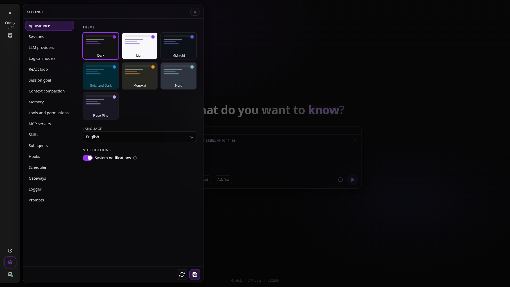

*Настройки, вкладка "Оформление" с образцами тем и выбором языка*

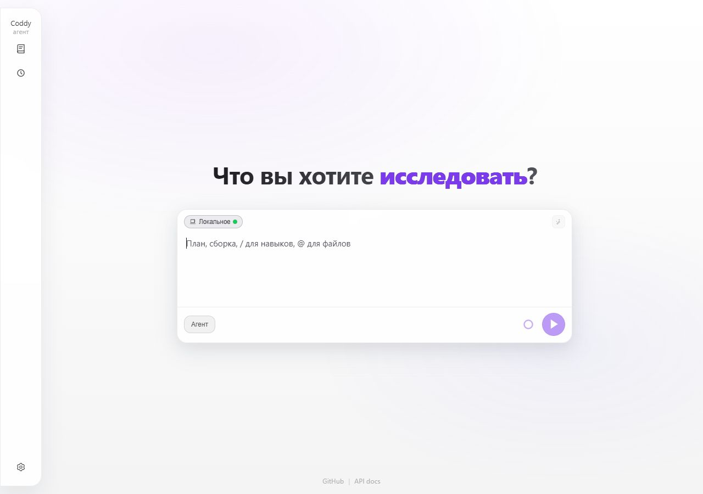

*Диалог с русским словарём - заголовок чата, строки инструментов и поле ввода*

- **По умолчанию** - тёмная тема при первом визите; язык определяется по **`navigator.language`** (RU для русского, иначе EN);
- **cookie темы** - **`coddy_ui_theme`** с одним из семи идентификаторов тем (**`dark`**, **`light`**, **`midnight`**, **`solarized-dark`**, **`monokai`**, **`nord`**, **`rose-pine`**; путь **`/`**, **`SameSite=Lax`**, `Max-Age` на один год);
- **выбор темы** - **Настройки** (**`#/settings`**) → **Оформление** → сетка образцов тем (**`data-testid="theme-swatch-<id>"`** внутри **`appearance-theme-picker`**). Выбор применяется сразу и действует только на клиенте (конфигурация не сохраняется);
- **выбор языка** - один нативный select **сразу под сеткой тем** (**`data-testid="appearance-language-select"`**) с пунктом **Авто** (язык берётся из **`navigator.language`**, cookie не записывается), за которым идут все локали, зарегистрированные в **`locales.ts`**. Сейчас реестр показывает **English** и **Русский**; смена значения сразу применяет локаль;
- **cookie языка** - **`coddy_ui_lang`** хранит идентификатор зарегистрированной локали (сейчас **`en`** или **`ru`**) с теми же флагами, что и cookie темы. Выбор **Авто** её удаляет. Порядок выбора при загрузке - **`?lang=<registered-id>`** в URL (тоже сохраняется в cookie) > cookie > **`navigator.language`**. Переключение выставляет **`document.documentElement.lang`** и перерисовывает страницу без перезагрузки. Документация следует за ним: окно документации запрашивает страницы на этом языке (**`lang=`** у **`/coddy/docs*`**), а каждый ход называет его (**`metadata.lang`**), поэтому и агент читает и прикрепляет документацию Coddy на нём же ([Встроенная документация](../features/built-in-docs.md#языки)). В конфигурацию ничего не записывается;
- **движок i18n** - **`external/ui/src/ui/i18n/`** (**`translate`/`t`**, хранилище локали, **`I18nProvider`** + **`useT()`**). **`locales.ts`** - единственный реестр поддерживаемых идентификаторов, подписей в списке выбора и словарей; из него выводятся список выбора, проверка локали, начальная загрузка и тесты паритета. **`main.tsx`** оборачивает приложение вместе с общим провайдером подтверждений в **`I18nProvider`**. **`useT()` вне провайдера откатывается на `translate`**, поэтому компоненты рендерятся в тестах без обёртки; английские значения по умолчанию в точности совпадают с прежними зашитыми в код литералами;
- **сопровождение локалей** - новой локали нужны её словарь и одна запись в **`locales.ts`**. Каждый зарегистрированный словарь добавляет или меняет тот же ключ и те же токены интерполяции в одном патче; **`messagesParity.test.ts`** проверяет и то и другое;
- **множественное число** - строки со счётчиком идут через **`translatePlural`** / **`tp(key, count)`** с одной записью словаря на каждую категорию CLDR (**`key.one`**, **`key.few`**, **`key.many`**, **`key.other`**), поэтому русский склоняет существительное по числу, а не сводит всё к одной форме. Каждая локаль задаёт ровно те категории, которые выдаёт её собственный **`Intl.PluralRules`**; тест паритета выводит этот набор для каждой локали;
- **охват** - переведены экраны оформления и настроек (оболочка настроек, разделы, MCP, скилы, CodexAuth, ModelField/Picker, Combobox), переведены подписи и описания полей настроек, построенных по схеме (см. ниже), переведены и экраны диалога: боковая панель, заголовок стартового экрана, поле ввода (режимы, выбор модели, вложения, меню / и @, окна окружения и папки), отображение сообщений (размышления, вызовы инструментов, сжатие контекста, кнопки копирования), запросы разрешений и вопросы, карточка документа плана, панель "Истории", выдвижная панель планировщика и редактор заданий, панель фоновых задач, баннер состояния окружения и экран роя с графом топологии. Общие подтверждения удаления для черновиков, чатов и заданий планировщика тоже переведены;
- **локализация полей схемы** - разделы настроек, которые строятся по JSON Schema сервера (провайдеры, модели, агент, супервизор, инструменты, субагенты, хуки, память, сжатие контекста, планировщик, логирование, шлюзы, сессии и части вкладки "Промпты"), локализуют подписи и описания полей на клиенте через **`settings/schemaI18n.ts`**. Ключ словаря детерминированно выводится из идентификатора раздела и пути поля через точку (**`settings.schema.<section>.<path>.label` / `.desc`**; части вкладки "Промпты", собранные из ключей `prompts` и `instructions`, получают ключи **`settings.schema.system.<child>.<path>`**). Ключ, которого нет ни в одном словаре, откатывается на собственный английский текст схемы, поэтому несопоставленные или новые серверные поля никогда не показывают сырой ключ. Строки элементов массива наследуют домен для вложенных полей, но сохраняют свой запасной текст для подписи строки, поэтому легенда и описание объемлющей группы полей не повторяются в каждой строке;
- **настройки показывают одну вкладку за раз** - "Оформление" и "Навыки" стоят вкладками в том же списке, что и разделы конфигурации;
- **запоминание** - смена темы записывает cookie и выставляет **`document.documentElement.dataset.theme`**; после перезагрузки выбранная тема должна сохраняться;
- **контракт CSS** - **`--text`** и **`--bg`** на **`[data-theme="light"]`** равны **`#18181b`** и **`#f8f8fa`**; стеклянные панели используют **`rgba(255, 255, 255, 0.9)`** (без тёмного оттенка). Тёмные значения по умолчанию остаются на **`:root`** / **`[data-theme="dark"]`**.

## Цель сессии

Когда у сессии есть цель, на плашке над полем ввода, слева от счётчика git `+A −D`, стоит значок мишени цвета статуса цели (в работе, на паузе, ждёт вас, выполнена, бюджет исчерпан); при наведении он показывает статус и формулировку цели. Значок появляется, только когда команда `/goal` задала цель, и тогда плашку с названием папки получает и чат вне git-репозитория. Значок открывает меню цели. В нём полная формулировка цели, статус и его причина, последняя проверка супервизора с отметкой **проверено**, если её подтвердил верификатор с доступом только на чтение, чек-лист требований, продолжения, проверки, время работы и токены, затем модель, которая проверяет цель (**Проверяет**), с уровнем рассуждения проверки рядом (**Рассуждения** - уровень, выбранный через `/goal -r`, иначе уровень модели по умолчанию; у модели без уровней этого поля нет), и действия в виде значков с названиями в подсказках - **Пауза**, **Продолжить**, **Изменить** (отправляет `/goal <new objective>` с тем же проверяющим, и это заменяет цель и запускает работу) и **Сбросить** (сначала спрашивает). Команда `/goal` без аргументов, отправленная из поля ввода, открывает то же меню и ничего не отправляет; если цели нет, меню предлагает поле, чтобы её задать. Ходы, которые запускает супервизор, показываются однострочными записями цели, а не вашими сообщениями, и во время работы, и после перезагрузки. Ключи `supervisor` редактируются в разделе **Настройки → Цель сессии**. См. [Цель сессии и супервизор](../features/session-supervisor.md).

## Модель сжатия контекста в настройках

В разделе **Настройки → Сжатие контекста** поле **Модель суммаризации** предлагает
выпадающий список с поиском по логическим моделям из текущего документа настроек,
включая несохранённые правки моделей. Выберите модель или введите идентификатор вручную.
Очистите поле, чтобы суммаризацию выполняла модель сессии.

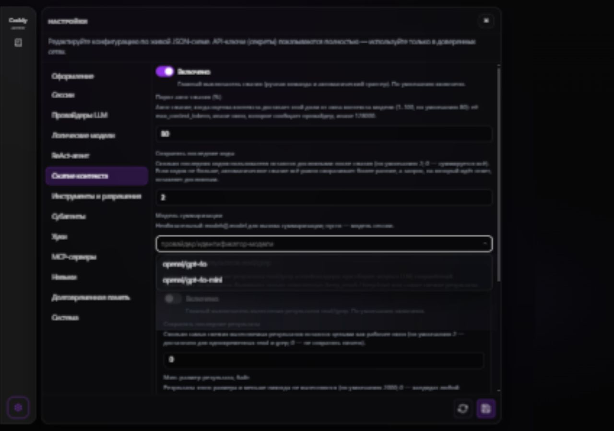

*Настроенные модели суммаризации в разделе Настройки → Сжатие контекста (Dark, 1280 px).*

## Codex OAuth в настройках

- В разделе **Настройки → Провайдеры LLM** строка с **`type: codex`** скрывает общие поля **Базовый URL API**, **API-ключ** и **Команда получения API-ключа** и показывает кнопку **Войти через ChatGPT**. Вход работает до сохранения, одинаково на новой строке и на сохранённой строке, тип которой только что переключили на codex; у последней для входа остаётся только её **`proxy`**;
- кнопка вызывает **`POST /coddy/providers/{name}/codex-auth/device`**, открывает полученную официальную страницу подтверждения, показывает одноразовый код и опрашивает **`GET .../device/{loginID}`**, пока вход не завершится успехом или ошибкой. Если браузер заблокирует автоматическое открытие вкладки, показанная ссылка остаётся доступной;
- состояние подключения берётся из **`GET /coddy/providers/{name}/codex-auth`**. Строка, которую не обслуживает вход Codex CLI на сервере (при нескольких строках codex этот вход заменяет только строку с именем **`codex`**), не считается подключённой, пока в ней не выполнен вход, и поле называет строку, которую обслуживает этот вход (**`cli_login_row`** в статусе). **Выйти** удаляет через **`DELETE`** только учётные данные, которыми управляет Coddy, и отменяет вход, который ещё ждёт подтверждения, поэтому подтверждение во вкладке, оставшейся открытой, потом ничего не сохранит; повторное нажатие **Войти** так же заменяет ожидающий вход. Вход Codex CLI на сервере всё ещё может отображаться как подключение для совместимости;
- токены OAuth никогда не попадают ни в документ настроек, ни в браузер. Сервер хранит их в **`$CODDY_HOME/providers/<name>/codex-auth.json`**.

## Вход в NeuralDeep в настройках

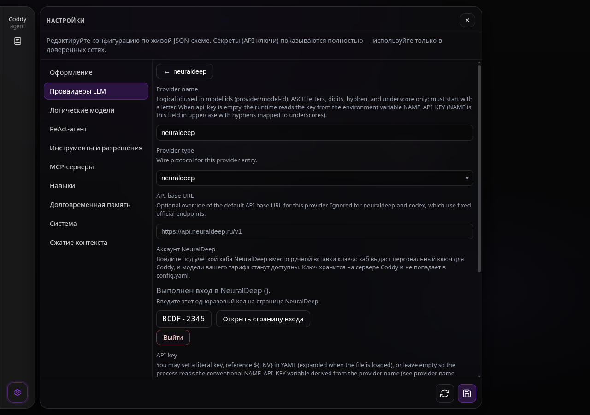

*Строка провайдера NeuralDeep после входа, используется ключ, выданный хабом*

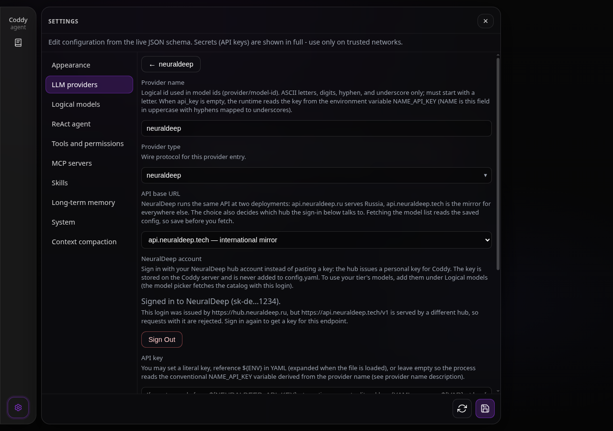

*Выпадающий список эндпоинтов предупреждает, что сохранённый вход получен от другого развёртывания*

- В разделе **Настройки → Провайдеры LLM** строка с **`type: neuraldeep`** заменяет свободное поле **Базовый URL API** выпадающим списком из двух официальных развёртываний - **`https://api.neuraldeep.ru/v1`** (Россия) и **`https://api.neuraldeep.tech/v1`** (международное зеркало), - который записывает значение в **`providers[].api_base`**; выбор заодно определяет, с каким хабом работает вход ниже, и вход следует за списком в том виде, в каком он стоит в форме (запуск device-входа передаёт выбранный эндпоинт), поэтому сохранять заранее не нужно. Это верно и для сохранённой строки, тип которой только что переключили на neuraldeep, например для строки **`openai`** из поставляемого **`config.example.yaml`**. Вход не отклоняется из-за типа, с которым строка была сохранена, и к нему переходит только **`proxy`** этой строки, поскольку её эндпоинт и ключ относятся к другому типу. Сохранённый **`api_base`**, который не совпадает ни с одним из двух, помечается под полем, и сервер его игнорирует. В строке остаётся ручное поле **API-ключ**, а под выбором эндпоинта появляется кнопка **Войти через NeuralDeep** (**`NeuralDeepAuthField`**). Вход избавляет от вставки ключа вручную; явно заданный ключ всегда приоритетнее, и виджет прямо об этом говорит, а не делает вид, что вход активен (**`source`** из эндпоинта статуса). Когда побеждает серверная переменная **`<NAME>_API_KEY`** (**`OPENAI_API_KEY`** для строки с именем **`openai`**), подсказка называет эту переменную, а не указывает на пустое поле **API-ключ**;
- кнопка вызывает **`POST /coddy/providers/{name}/neuraldeep-auth/device`** (device flow хаба по RFC 8628 для клиента **`coddy`** - браузер и сервер Coddy могут работать на разных машинах), открывает полученную страницу портала с заранее подставленным кодом, показывает одноразовый код и опрашивает **`GET .../device/{loginID}`**, пока вход не завершится успехом или ошибкой;
- состояние подключения берётся из **`GET /coddy/providers/{name}/neuraldeep-auth`** (только маскированный ключ) для выбранного сейчас эндпоинта (**`?api_base=`**). Если сохранённый вход выдан хабом другого развёртывания (**`hub`** отличается от **`endpoint_hub`**), подсказка под статусом сообщает, что запросы с ним отклоняются, и просит войти заново для этого эндпоинта; пока явный ключ перекрывает вход, подсказка скрыта. Уже начатый вход продолжает опрос, даже если тем временем сменить эндпоинт (ключ приходит от хаба, с которым начался поток), и следующее чтение статуса отмечает несовпадение. **Выйти** по возможности отзывает ключ на хабе, а затем удаляет локальные учётные данные через **`DELETE`**;
- ключ никогда не попадает ни в документ настроек, ни в браузер; сервер хранит его в **`$CODDY_HOME/providers/<name>/neuraldeep-auth.json`**. Модели тарифа добавляются в **Логические модели** из списка **Модели** в конце формы провайдера, который получает каталог провайдера с этим входом ещё до сохранения строки (см. [Модели провайдера в настройках](#модели-провайдера-в-настройках)); поток CLI (**`coddy providers login neuraldeep`**) дописывает их в конфигурацию автоматически.

## Прокси провайдера в настройках

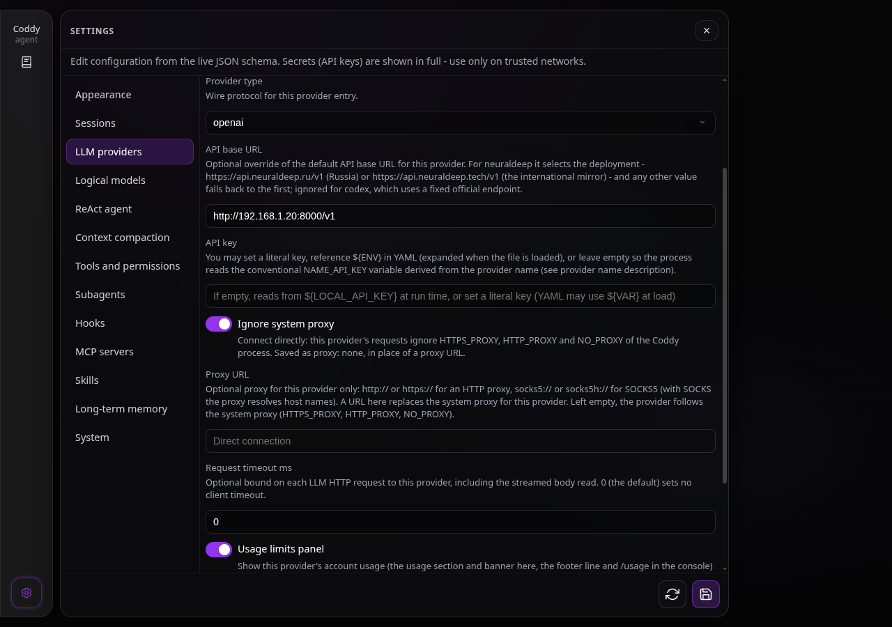

*Строка провайдера с прямым подключением, поле URL прокси отключено*

- В каждой строке раздела **Настройки → Провайдеры LLM**, включая codex, над полем **URL прокси** есть переключатель **Игнорировать системный прокси** (**`ProxySettingField`**). Оба меняют **`providers[].proxy`**, то есть маршрут каждого запроса строки, будь то completions, список моделей, расход аккаунта, вход через OAuth или device flow и обновление токена, а также отзыв при выходе ([Прокси провайдера](../getting-started/configuration.md#прокси-провайдера)). **Войти** берёт значение, которое стоит в форме сейчас, ещё до **Сохранить все**. Отсутствующее значение оставляет сохранённый маршрут строки, очищенное поле следует системному прокси, а `none` подключается напрямую. Это относится и к сохранённой строке, которую только что переключили на другой тип провайдера. **`gateways.telegram.proxy`** Telegram-бота читается так же, и та же пара есть в разделе **Настройки → Шлюзы**, в блоке Telegram ([Telegram-шлюз](gateway.md#прокси));
- переключатель записывает **`none`**, и строка подключается напрямую, игнорируя **`HTTPS_PROXY`**, **`HTTP_PROXY`** и **`NO_PROXY`** процесса Coddy. Пока он включён, поле URL отключено и показывает **Прямое подключение**;
- при выключенном переключателе URL в поле направляет каждый запрос строки через этот прокси, а пустое поле (или сохранённое **`inherit`**) показывает **Через системный прокси**, маршрут по умолчанию;
- пока форма открыта, выключение переключателя возвращает то, что было в строке до его включения. Документ хранит одно значение, поэтому после **Сохранить** строка со значением **`none`** уже не помнит URL, который оно заменило;
- значение проходит через **`GET`** / **`PUT /coddy/config`** в том виде, в каком написано. Если значение не ключевое слово и не URL прокси, **Сохранить** его отклоняет, и ошибка называет допустимые значения.

## Модели провайдера в настройках

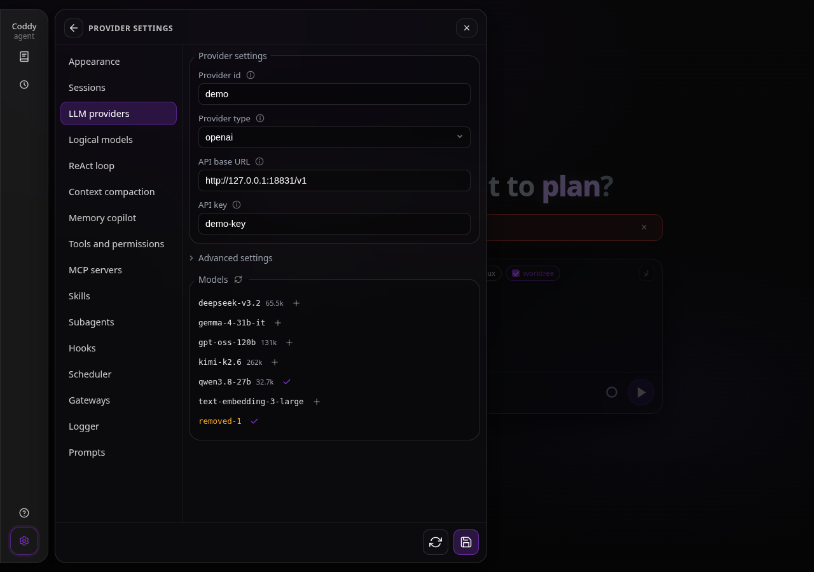

*Форма провайдера заканчивается тем, что объявляет провайдер. Плюс заносит идентификатор в "Логические модели", галочка отмечает уже добавленный и убирает его обратно, а янтарный идентификатор провайдер больше не объявляет.*

- Форма провайдера (**Настройки → Провайдеры LLM → строка**) состоит из трёх блоков: **Настройки провайдера** (идентификатор, тип, эндпоинт, ключ, вход, переключатель расхода), **Расширенные настройки** (команда получения учётных данных, прокси, таймаут запроса), свёрнутые, пока не нажата их стрелка, и **Модели**;
- **Модели** показывает то, что объявляет провайдер; список запрашивается через **`POST /coddy/providers/models`** со строкой ровно в том виде, в каком её держит форма, поэтому несохранённая строка, вход, который есть только на диске, и провайдер, которого ещё нет в документе, показывают свои модели так же, как сохранённая строка (issue #335). Список запрашивается при открытии формы и ещё раз, когда строка становится другим провайдером, как только её идентификатор или тип перестал меняться; правка эндпоинта, ключа или прокси ждёт значка обновления рядом с заголовком **Модели**, который сразу делает запрос со строкой в её текущем виде. Автоматический запрос никогда не передаёт команду получения учётных данных, чтобы недопечатанная команда не запустилась, и запускает её только значок обновления;
- каждая строка списка - это идентификатор модели, справа от него окно контекста, о котором сообщает провайдер (**`131k`**, точное число во всплывающей подсказке), и переключатель. Плюс добавляет **`provider/id`** в **Логические модели** того же несохранённого документа и записывает сообщённое окно в его **Окно контекста**; галочка означает, что модель уже там, а нажатие на неё убирает модель обратно. До **Сохранить все** в `config.yaml` ничего не попадает. Идентификатор, который "Логические модели" перечисляют под этим провайдером, а провайдер больше не объявляет, показан янтарным и отмеченным, причина - в подсказке. Строка текста под заголовком появляется, только когда показывать нечего: во время запроса, при ошибке, при пустом ответе или для строки без идентификатора и типа. Если моделей больше восьми, список сужает поле фильтра;
- открытая строка входит в адрес, например **`#/settings/providers?id=demo`**, **`#/settings/models?id=demo%2Fqwen3.8-27b`**. Открытие строки записывает её в адрес, возврат к списку убирает, переименование строки переписывает, а правка адреса открывает названную в нём строку. Адрес со строкой, которой нет, показывает список и отбрасывает имя. Пока строка открыта, в шапке выдвижной панели за стрелкой назад, которая возвращает к списку, написано **Настройки провайдера** (или **Настройки модели**), и на компьютере, и на телефоне;
- **Настройки → Логические модели → строка** состоит из трёх блоков: **Модель** (провайдер, идентификатор модели, окно контекста, мультимодальный ввод), **Генерация** (максимум токенов, температура, потоковые ответы) и **Рассуждение** (уровни и уровень по умолчанию). **Провайдер** - комбобокс по строкам `providers[].name` документа (имя, которого ещё нет в списке, всё равно можно ввести), а **Идентификатор модели** - обычное поле; вместе они складываются в `provider/id` по первому слэшу. Идентификатор из того, что объявляет провайдер, выбирают в форме самого провайдера;
- **Окно контекста (токены)** тоже спрашивает провайдера. Если оставить 0, модель отсчитывает от окна, которое сообщает список провайдера (иначе 128000), поэтому поле показывает это число как плейсхолдер, например **`131072, reported by demo`**, и ничего не записывает. Значок обновления рядом с ним спрашивает снова и записывает число в `max_context_tokens`, что его закрепляет; подсказка под полем сообщает, если провайдер не называет окно для этого идентификатора или запрос не удался.

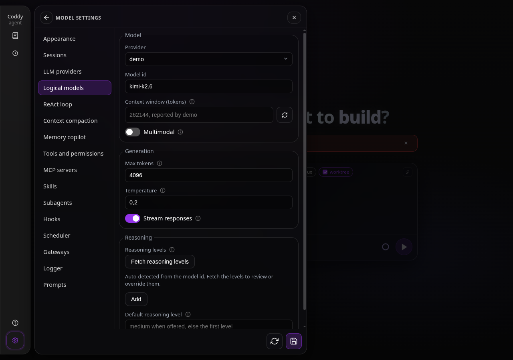

*Логическая модель - это провайдер плюс идентификатор, который ждёт его API; окно контекста приходит от провайдера.*

- Переключатель **Панель лимитов** (`providers[].usage_limits_panel`) показывается только для типов провайдеров, у которых есть источник данных о расходе (`neuraldeep`, `codex`, `devin`); для остальных он ничего бы не менял;
- на компьютере выдвижная панель настроек шириной 680px, этого хватает на три карточки тем в ряд в **Оформление** и на удобную для чтения ширину форм;
- автоматические проверки - **`ProviderModelList.test.tsx`** (запрос со строкой в том виде, в каком её держит форма, и без команды, повторный запрос только для нового идентификатора или типа, добавление и удаление, устаревшая строка, строка ошибки, значок окна контекста, фильтр, правила удержания в границах), **`ModelField.test.tsx`**, **`ContextWindowField.test.tsx`** (сообщённое окно как плейсхолдер, явный запрос, который его записывает, отброшенный поздний ответ для изменённого идентификатора), **`SettingsArraySection.test.tsx`** (адрес в обе стороны, ссылка назад), **`SettingsSection.test.tsx`** (три блока формы провайдера, сообщённое окно, подставленное при добавлении, переключатель расхода по типу провайдера, форма строки не переживает смену вкладки), **`features/provider_models_web_ui.feature`** (**`external/ui/bdd_provider_models_ui_test.go`**), а на стороне API **`features/provider_models_fetch.feature`** с **`external/httpserver/providers_models_http_test.go`**. При живой проверке на **390px** форма провайдера прокручивается только по вертикали (у `.settings-scroll` `scrollWidth` равен `clientWidth`), а длинные идентификаторы обрезаются многоточием.

## Вкладки и раскладка форм настроек

- Вкладки идут группами: **Оформление** и **Сессии**; откуда берутся модели (**Провайдеры LLM**, **Логические модели**); цикл, который их запускает (**Цикл ReAct**, **Сжатие контекста**, **Память**); что умеет агент (**Инструменты и разрешения**, **MCP-серверы**, **Навыки**, **Субагенты**, **Хуки**); что запускает его без человека у поля ввода (**Планировщик**, **Шлюзы**); и работа самого процесса (**Логирование**, **Промпты**). Вкладка **Промпты** содержит шаблоны промптов и файлы инструкций и всегда стоит последней;
- вкладка **Сессии** над таблицей сохранённых сессий задаёт, где хранятся бандлы сессий (**Хранилище**, `sessions.dir`); сама таблица действует сразу, а путь хранилища сохраняется через **Сохранить все**;
- собственный переключатель вкладки **Включено** открывает форму и стоит над всеми блоками (Субагенты, Хуки, Память, Сжатие контекста, Планировщик). Остальные поля сгруппированы по смыслу, например **Модель и ходы**, **Повторы**, **Таймауты потока**, **Защита от зацикливания** и **Лимиты использования** на вкладке **Цикл ReAct**; список (папки определений, запасные модели, уровни компонентов) образует отдельный блок рядом с ними. Внутри вложенного блока список сохраняет свою рамку (администраторы Telegram, группы пользователей и переопределения для отдельных чатов);
- список значений - это его поля ввода, у каждого кнопка корзины, а под ними **Добавить**, без подписи у каждой строки и без линии между строками. Элемент списка объектов - отдельная рамка без номера в заголовке;
- словарь значений, например **Заголовки по умолчанию** в **HTTP-запросы** (`tools.http_request.default_headers`), показывается строкой на запись: имя и значение рядом, кнопка корзины и **Добавить** под строками. Строка без имени остаётся на экране, но не попадает в сохранённую конфигурацию; пустое значение сохраняется и для заголовка означает "не отправлять этот заголовок";
- пустые поля путей показывают, куда ведёт значение по умолчанию (`${CODDY_HOME}/sessions`, `${CODDY_HOME}/memory`), или пример того, что туда написать;
- автоматические проверки - **`SchemaForm.groups.test.tsx`** (переключатель первым, группа для всего остального, группа на месте своего первого поля, сохранённый более поздний ключ, списки), **`SchemaForm.map.test.tsx`** (строки словаря в порядке документа, правка на месте, строка без имени, две строки с одним именем, документ, заменённый извне), **`settingsSections.test.ts`** (порядок, "Промпты" последними, вкладки "Логирование", "Шлюзы" и "Планировщик", вкладка "Сессии", которой принадлежит `sessions`), **`TestUISchemaRootPropertyOrder`** (`internal/config/jsondto_schema_test.go`), **`settingsDrawerRhythmCss.test.ts`** (строка списка той же высоты, что и её поле ввода).

## Открытие и сохранение настроек

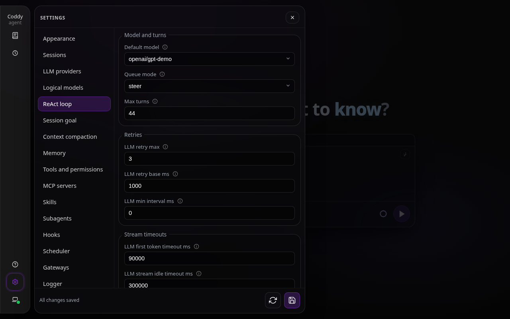

*Успешное сохранение. Кнопка сохранения две секунды зелёная, и больше на экране ничего не меняется.*

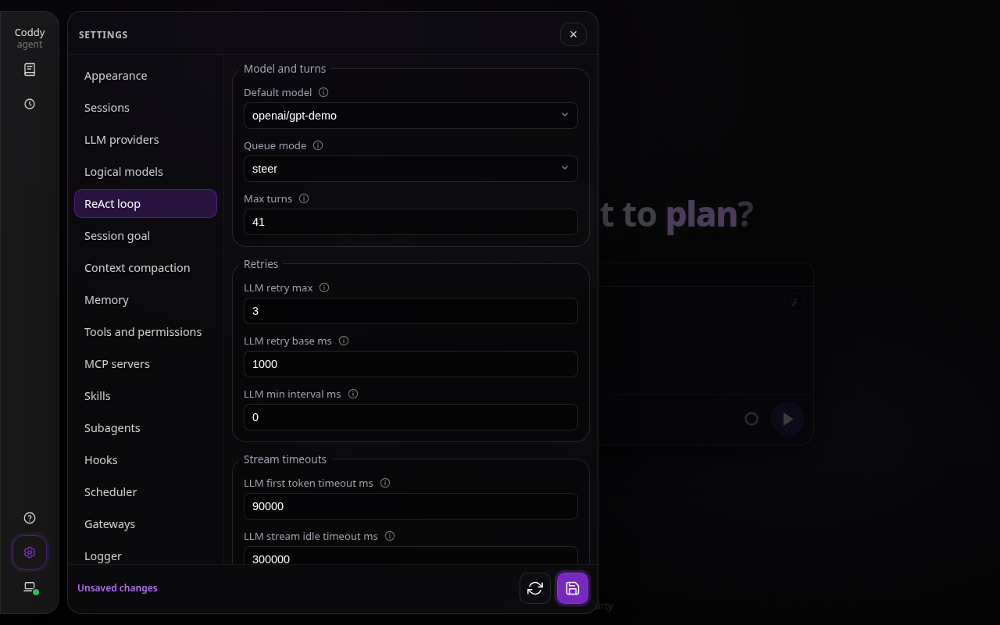

*Правка ещё не сохранена. Кнопка сохранения выделена, и строка перед кнопками говорит об этом.*

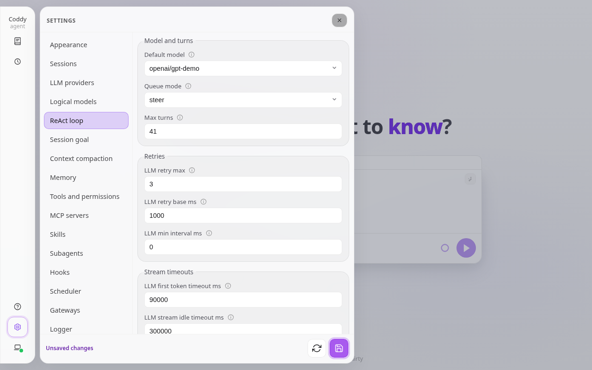

*То же в светлой теме.*

- Выдвижная панель сразу открывается на вкладке, которую называет адрес. Приложение хранит схему и конфигурацию, прочитанные при первом открытии настроек на этой странице, поэтому следующее открытие рисует вкладку из этой копии уже в первом кадре, а не показывает пустую панель, чтобы потом её перестроить. Копия следует за сервером, потому что каждое событие **`config_reloaded`** и каждое переподключение потока событий перечитывают её в фоне;
- самому первому открытию на странице рисовать пока не из чего. Оно показывает запрошенную вкладку скелетом - серыми полями, серыми строками в колонке разделов или серыми плитками на узком экране - и никогда не подставляет на её место вкладку "Оформление";
- форма без несохранённых правок принимает более новую копию, как только та приходит, поэтому в ней появляется изменение, сделанное агентом или другим браузером. Форма с несохранёнными правками их сохраняет; **Перезагрузить** берёт то, что есть на сервере, и отбрасывает их (поле, в которое печатали, пока шла перезагрузка, сохраняет напечатанное);
- сохранение сразу кладёт записанное в хранимую копию, поэтому если закрыть и снова открыть панель сразу после сохранения, она покажет сохранённые значения ещё до того, как сервер будет прочитан заново;
- **Сохранить все** сообщает об успехе самой кнопкой, она становится зелёной на две секунды, без строки текста. Если сервер отклонил сохранение, причина пишется словами над вкладками, а кнопка остаётся прежней;
- изменение в форме вступает в силу только после **Сохранить все**, и панель напоминает об этом, пока оно ждёт: кнопка выделена (залита акцентным цветом и обведена кольцом), а строка перед кнопками гласит **Есть несохранённые изменения**. Это касается и провайдера, в который вошли через **Войти через ChatGPT** или **Войти через NeuralDeep**: вход сохраняет учётные данные сразу, но строка провайдера попадает в `config.yaml` только при сохранении. Правка, возвращённая к исходному значению (значение набрано обратно, поле очищено, переключатель снова выключен), правкой не считается, и кнопка возвращается к обычному виду;
- закрытие панели с несохранёнными правками - кнопкой закрытия, клавишей Escape или щелчком рядом с панелью - сначала спрашивает **Сохранить и закрыть** или **Вернуться к правке**; отбросить правки по-прежнему можно через **Перезагрузить**. Перезагрузка или закрытие страницы с такими правками просит браузер подтвердить действие. Переключение на другое окружение не спрашивает: правки относятся к серверу, который вы покидаете, и **Сохранить все** никогда не отправляет их на другой сервер (страница, чью перезагрузку на другой сервер остановили, отказывается сохранять и просит перезагрузиться). Правка, введённая, пока сохранение в пути, остаётся несохранённой относительно того, что записало это сохранение, и **Сохранить и закрыть** оставляет панель открытой поверх неё;
- сохранение записывает в `config.yaml` только изменённое. Значение, которое вы не трогали, сохраняет своё написание (`${CODDY_HOME}/memory`, `~/.agents/skills`, `${OPENAI_API_KEY}`, кавычки, список в одну строку), запись провайдера или модели сохраняет только те поля, которые в ней были (переименованная тоже), а то, что процесс использует не так, как записано в файле (флаг командной строки, адрес релея, который подставляет `coddy serve`), в файл не попадает. Отступы и пустые строки не сохраняются, файл возвращается с отступом в два пробела и без пустых строк между разделами. См. [Конфигурация](../getting-started/configuration.md#ссылки-на-переменные-окружения);
- нетронутое определяется относительно того, что прочитал этот браузер. Документ называет конфигурацию, из которой он получен, поэтому если после открытия формы что-то сохранили другой браузер, агент или ручная правка, ваше сохранение не трогает эти значения и записывает только ваши. Список, который вы правили, записывается в том виде, в каком вы его оставили;
- автоматические проверки - **`Settings.unsaved.test.tsx`** с **`features/web_ui_settings_unsaved.feature`** (правка, которая выделяет кнопку сохранения, пока её не сохранят, возвращённая правка, закрытие и Escape поверх несохранённых правок, уход со страницы, отказ сохранять на другой сервер, правки и переключения во время сохранения, более новая копия, пришедшая в форму с возвращённой правкой), **`App.settingsUnsaved.test.tsx`** (щелчок по подложке сначала спрашивает), **`settingsDirty.test.ts`** (что считается правкой, в том числе пустое значение заголовка), **`Settings.test.tsx`** (второе открытие из копии без запроса, скелет на широком и узком экране и после неудачного первого чтения, перезагрузка, которая доходит до нетронутой формы и никогда не затрагивает несохранённые правки, зелёная кнопка сохранения и строка ошибки, неудачное сохранение после успешного, правки и более новая копия, пришедшие во время сохранения, "Логические модели", открытые списком после провайдера, глубокая ссылка на строку при первом открытии, сохранённые значения при повторном открытии сразу после сохранения, правки, введённые во время перезагрузки), **`settingsConfigStore.test.ts`** (одно чтение на все открытия, уведомление о перезагрузке, ответы, применённые по порядку, неудачное чтение, которое сохраняет копию, копия старше неудачного чтения, прочитанная заново, сохранённый документ как копия), **`settingsSaveStateCss.test.ts`** (зелёный цвет и выделение как состояния, которые сохраняются при reduced motion, отсутствие строки об успехе, скелет, окрашенный от цвета текста темы), **`features/config_save_round_trip.feature`** с **`external/httpserver/bdd_config_round_trip_test.go`** (сохранение без правок оставляет файл байт в байт прежним, одна правка меняет одну строку, сохранение из браузера, прочитавшего конфигурацию раньше, не отменяет другое сохранение) и тесты сохранения в **`internal/config/yaml_comments_test.go`**. Проверка в браузере - **`npm run check:settings-unsaved`** на временном `coddy serve` (**`scripts/settings-unsaved-check.mjs`**: выделенная кнопка сохранения и строка перед ней помещаются в нижнюю панель, а кнопка нажимается пальцем на всём от телефонов шириной 320px в обеих ориентациях до десктопа шириной 1280px, на английском и на русском; ничего не записывает).

## Описания полей настроек

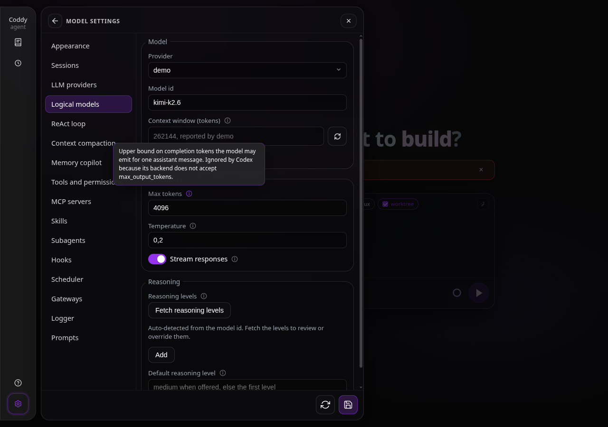

*Если навести указатель на (i) рядом с названием поля, над значком поверх страницы появится описание этого поля.*

- Форма настроек показывает названия полей и элементы управления, и больше ничего. Смысл поля спрятан за **(i)** сразу после его названия. Наведите на значок (или перейдите к нему клавишей Tab), и над ним появится описание; на сенсорном экране нажмите на него. Описание закрывается, если увести указатель, нажать Escape, коснуться другого места или прокрутить форму. Группы полей (список **Модели** провайдера, **Маркетплейсы** в "Навыках", **Обнаружение MCP**, **Определения** в "Субагентах", блоки объектов и списков в сгенерированных формах) показывают описание так же, рядом с легендой;
- подсказка рисуется поверх всей страницы, а не внутри панели настроек, поэтому панель её никогда не обрезает и полоса прокрутки в панели из-за неё не появляется. Текст о состоянии (результат запроса, код входа, предупреждение о сохранённом значении) остаётся в форме под своим элементом управления;
- автоматические проверки - **`FieldHint.test.tsx`**. Живая проверка - наведите указатель на (i) при **1280px** и нажмите на (i) при **390px**; подсказка должна быть дочерним элементом `<body>`, стоять на 8px выше (i) по его центру, а у `.settings-scroll` `scrollWidth` должен оставаться равным `clientWidth`.

## Переключатели в формах настроек

- Каждая опция вкл/выкл в формах настроек рисуется общим **`SwitchField`** (**`external/ui/src/ui/settings/SwitchField.tsx`**), то есть элементом **`Switch`** и ячейкой подписи на одной сетке в две колонки (**`.settings-switch-field`**). Сюда относятся булевы поля **`SchemaForm`**, построенные по схеме (например, **Логические модели → Мультимодальная** и **Потоковые ответы**, **Инструменты и разрешения → Фоновые задачи → Включено**, флаги **Шлюзы → Telegram**), и строка **Навыки → Автообнаружение скилов**;
- подпись стоит вровень с переключателем (вертикальные центры совпадают с точностью до 1px, зазор 8px), а описание поля спрятано за (i) сразу после подписи, как у любого другого поля;
- подпись - настоящий **`<label for>`**, поэтому щелчок по тексту меняет состояние переключателя, а щелчок по (i) только открывает описание. Имя переключателю даёт эта подпись (**`aria-labelledby`**); когда видимый текст описывает состояние (**Включён** / **Отключён**), строка передаёт явный **`ariaLabel`**, и он важнее;
- автоматические проверки - **`SwitchField.test.tsx`** (структура и правила CSS), **`SchemaForm.switch.test.tsx`**, **`SkillsSection.autoDiscovery.test.tsx`**. Живая проверка - откройте форму модели при **1280px** и **390px** и для каждого **`[role=switch]`** сравните **`getBoundingClientRect()`** переключателя, **`.settings-switch-field-label`** и его **`.field-hint`** (разница центров ≤ 1px).

## Перезагрузка конфигурации на лету

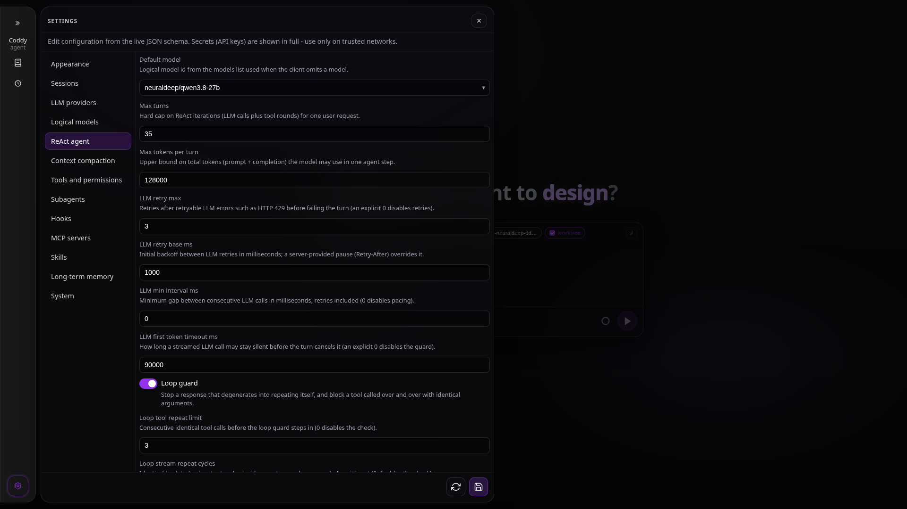

*Панель настроек с навигацией по вкладкам, вкладка "Цикл ReAct" с полями, сгруппированными по смыслу*

- Coddy перезагружает свою конфигурацию на лету, и не только из этой страницы. Инструменты агента **`config_commit`** / **`config_rollback`** переписывают её посреди хода, установка скила её переписывает, другая вкладка браузера может сохранять форму настроек. Всё, что SPA выводит из конфигурации (выбор **Модель** в поле ввода, кнопка вложений **`multimodal`**, имена slash-команд), читается один раз при загрузке и иначе оставалось бы устаревшим до перезагрузки страницы (issue **#161**);
- **`GET /coddy/events`** передаёт **`event: session_question_pending`** только с **`{object, sessionId}`** всякий раз, когда интерактивное ожидание `question` начинается или завершается. Событие и поле `questionPending` локальны для процесса сервера Coddy, которому принадлежит интерактивное ожидание; **`event: config_reloaded`** приходит после каждой замены живой конфигурации. **`chat/serverEvents.ts`** превращает их в необязательные колбэки **`onQuestionPending`** и **`onConfigReloaded`**, которые доставляются по потоку, общему для этой вкладки и остальных (см. [Серверные события, общие для вкладок](#серверные-события-общие-для-вкладок)); **`App.tsx`** по первому перечитывает "Историю", а по второму увеличивает **`configEpoch`**. Оба запроса, зависящие от конфигурации, **`GET /v1/models`** и **`GET /coddy/slash-commands`**, зависят от этого счётчика и потому перечитываются вместе. Кнопка **Сохранить** в настройках увеличивает тот же счётчик через **`onConfigSaved`**, поэтому локальное сохранение и удалённая замена ведут себя одинаково;
- событие не несёт список моделей. Изменения уже доступны за этими двумя эндпоинтами, а сервер публикует событие только после того, как новая конфигурация заработала, поэтому повторное чтение не застанет уходящую;
- если сам поток событий недоступен (старый сервер, прокси, который съедает SSE), список моделей больше ничто не перечитывает, и страница возвращается ровно к прежнему поведению, оставаясь устаревшей до перезагрузки. Поток здесь служит оптимизацией без гарантий, и дополнительного опроса ради него не добавляли;
- событие также перечитывает копию конфигурации, которую хранит панель **Настройки** (см. [Открытие и сохранение настроек](#открытие-и-сохранение-настроек)). Открытая форма принимает её, только пока в ней нет собственных правок. Повторный запрос поверх несохранённых правок уничтожил бы работу, поэтому они остаются, а кнопка **Перезагрузить** в форме - осознанный способ их отбросить;
- автоматические проверки - **`serverEvents.test.ts`** (событие доходит до колбэка и безвредно без него), **`features/config_reload_broadcast.feature`** с **`external/httpserver/bdd_config_reload_test.go`** (объявление доходит до каждого открытого клиента, и список моделей, прочитанный по нему, уже содержит новую модель) и **`external/httpserver/events_http_test.go`** (форма кадра, защита от объявления замены, которой не было, и актуальность списка slash-команд в момент объявления).

## Вход (`httpserver.login`)

Выключен, пока на сервере нет учётной записи, и сервер без неё выглядит ровно так же, как всегда.

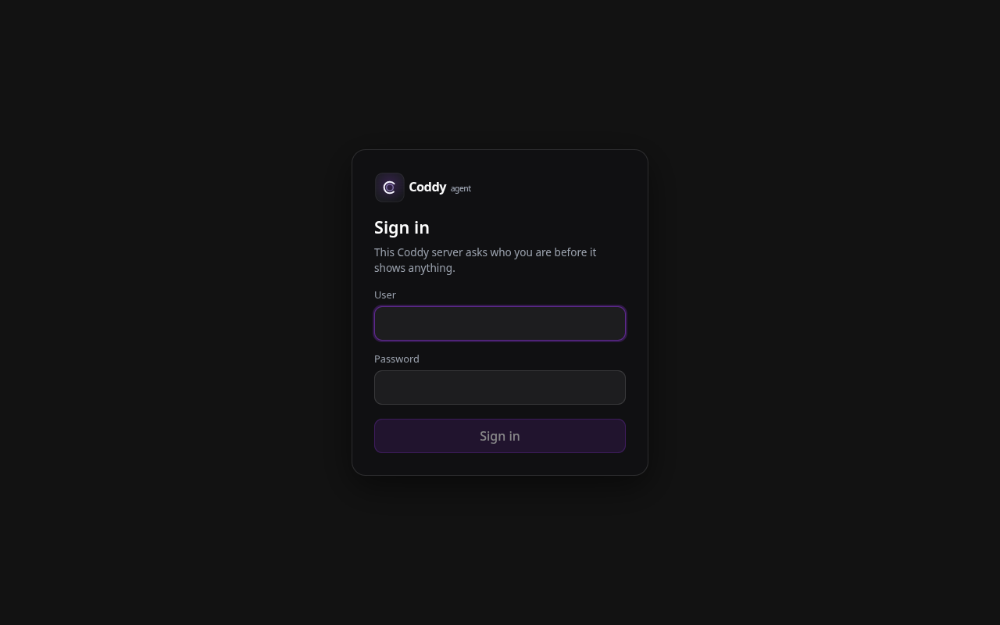

*Экран входа, который получает анонимный браузер, когда настроен `httpserver.login`.*

- **Что решает** - **`AuthGate`** (**`external/ui/src/ui/auth/AuthGate.tsx`**, оборачивает **`<App/>`** в **`main.tsx`**) один раз при загрузке вызывает **`GET /coddy/auth/me`**. При **`login_required`** без **`authenticated`** вместо приложения рисуется **`SignInScreen`**, в любом другом случае - приложение. Пока ответа нет, рисуется пустой фон **`.auth-boot`**, а не приложение, поэтому транскрипт никогда не появляется, чтобы тут же исчезнуть;
- **сервер, который не может ответить** (сетевая ошибка или **404** от `coddy serve`, собранного до появления этой функции), считается сервером "без входа", поэтому старый сервер продолжает работать с новой страницей;
- **экран** (**`SignInScreen.tsx`**, **`.auth-screen`** / **`.auth-shell`** / **`.auth-card`**) занимает всю страницу и не служит диалоговым окном поверх размытого транскрипта, ведь за ним нечего показывать. Текстовый логотип стоит над карточкой, по центру и вне её; в карточке заголовок, пользователь, пароль, одна строка ошибки (**`role="alert"`**) и кнопка отправки, неактивная, пока оба поля не заполнены, без поясняющей строки под заголовком. Каждая строка текста - ключ словаря (**`auth.signIn.*`**), а карточка использует только токены темы, поэтому её поддерживают все семь тем и оба языка;
- **текстовый логотип** - прямоугольный логотип (**`src/assets/coddy-logo-wordmark.svg`**, а в светлой теме **`-light.svg`**), встроенный в бандл, а не загружаемый отдельно, поэтому экран отрисовывается за один запрос. Его альтернативный текст локализован (**`auth.signIn.logoAlt`**);
- **после успешного входа** страница перезагружается, потому что все списки, потоки и закэшированные ответы на ней получены браузером без сессии;
- **сессия, которая закончилась при открытой странице** (истекла, была заменена, из неё вышли в другой вкладке), возвращает экран входа. Обёртка **`fetch`** для локального origin сообщает о **401** от любого вызова **`/v1/*`** или **`/coddy/*`** (кроме маршрутов **`/coddy/auth/*`**), и компонент входа перечитывает состояние;
- **выход** - последний пункт боковой панели (**`data-testid="nav-sign-out"`**), он виден, только пока настроена форма входа и этот браузер её прошёл; его подсказка называет учётную запись. Пункт отправляет POST на **`/coddy/auth/logout`** и перезагружает страницу, **только когда сервер действительно закрыл сессию**. Cookie помечена HttpOnly, поэтому страница, которая очистила бы своё состояние после отказа, после перезагрузки снова оказалась бы с выполненным входом, и кнопка выглядела бы сломанной, а не отклонённой;
- **удалённые окружения здесь не проверяются.** К удалённому серверу обращаются с другого origin с bearer-токеном из выбора окружения, и cookie этого origin с такими вызовами не уйдёт; в удалённом режиме **`AuthGate`** просто пропускает дальше.

Поведение сервера, cookie и правило CSRF описаны в [HTTP API](../reference/http-api.md#вход-в-веб-интерфейс-необязательно). Визуальный контракт - в [DESIGN.md](../../../DESIGN.md).

## Окружение (локальный или удалённый сервер)

- **Пункт боковой панели** - окружение выбирается пунктом боковой панели (**`nav/EnvironmentSwitcher.tsx`**, **`data-testid="nav-environment"`**) в её нижней части, под "Настройками" и над **Выйти**, если этот пункт есть, иначе последним; у поля ввода чипа окружения нет. Значок пункта обозначает хост (ноутбук для собственного сервера этого браузера, для другого хоста - две стрелки-шеврона, направленные друг к другу, одна чуть выше другой), а в его углу стоит точка активного окружения; в подсказке написано **`Environment: <хост>`**, где хост - короткое имя машины, на которой работает собственный сервер страницы (**`devbox`** для **`devbox.example.org`**, читается из **`GET /coddy/info`**; пока оно неизвестно, стоит **Local**), или имя удалённого сервера. Широкая боковая панель показывает имя рядом со значком и обрезает его многоточием, если оно длиннее панели, а полное имя хоста стоит в подсказке. На верхней панели планшета или телефона это один из значков, и он никогда не прячется в **Ещё**. Пункт открывает меню-портал (**`data-testid="env-menu"`**, из семейства меню режимов; в раскладке с верхней панелью это лист снизу) с разделом **Окружение** (**Локальное**) и разделом **Удалённые** (настроенные удалённые серверы и **`Connect to…`**). На компьютере меню открывается рядом с боковой панелью так, что его низ на уровне низа пункта, растёт вверх и не выходит за окно; его высота равна месту над низом пункта, а сверх этого оно прокручивается, поскольку агенты релея и подсказки под удалённым сервером, которым нельзя воспользоваться, могут не поместиться в окно. Меню со всеми видами удалённых серверов показано в [Удалённый режим](../operate/remote.md#меню-окружения);
- **выбор = подключение** - выбор **Локальное** или удалённого сервера подключает **сразу** (без шага подтверждения); запроса токена при каждом выборе нет. При переходе между двумя удалёнными серверами приложение начинает заново на новом сервере на месте, без перезагрузки страницы (**`EnvScope`**, **`onEnvironmentSwitch`**); при переходе на "Локальное" или обратно страница перезагружается. **Bearer-токен** берётся из записи `httpserver.remotes` удалённого сервера, если он там есть, иначе его вводят в **`Connect to…`** (имя / URL / токен), и браузер запоминает его для каждого удалённого сервера. Удалённый сервер, который отклоняет токен и не имеет токена в конфигурации, предлагает **Ввести токен**, и эта кнопка открывает ту же форму, заполненную для него;
- **где осталось каждое окружение** - смена окружения запускает приложение заново, поэтому маршрут запоминается для каждого окружения (**`coddy_env_routes`**). По возвращении на "Локальное" приложение открывает диалог, в котором "Локальное" оставили, удалённый сервер открывается там, где его оставили, или на своей домашней странице, а карта релея никогда не переходит за приложением к обычному агенту;
- **точки доступности** - каждый удалённый сервер проверяется при открытии меню (**`env/remoteProbe.ts`**): точка **зелёная**, когда он отвечает и принимает токен, **красная**, когда нет, **янтарная**, пока идёт проверка; у **Локальное** она всегда зелёная. Под красным удалённым сервером строка объясняет причину: он не отвечает, он отклоняет токен (**`httpserver.auth_token`** агента, **`swarm.auth_token`** релея) или браузер скрывает его ответ от страницы, а именно так из браузера выглядит настройка CORS, в которую не входит этот origin (строка называет origin и два ключа, а если сама страница открыта с loopback-адреса, то есть с собственного `coddy serve` ноутбука, то и переключатель `allow_loopback`, который пускает её с любого порта, **`isLoopbackOrigin`** в **`env/loopbackOrigin.ts`**). У агента запрашивается **`GET /v1/models`**; релей, который не обслуживает **`/v1`**, распознаётся по его публичному **`GET /swarm/info`**, а его токен проверяется на **`GET /swarm/nodes`**, и запрос в режиме no-cors отличает удалённый сервер, который отвечает, от того, который не отвечает;
- **агенты релея** - как только релей принимает токен, под ним перечисляются его агенты (на любую глубину хопов, из **`GET /swarm/topology`**), и каждый из них - пункт меню, который открывает этот узел через релей;
- **запись без имени** показывается под именем, которое сообщает удалённый сервер (**`reportedName`** в **`env/remoteProbe.ts`**): для релея это имя из его публичного **`GET /swarm/info`** (имя хоста, если **`swarm.name`** не задаёт другое), для агента - имя хоста из **`GET /coddy/info`**. Адрес остаётся справа в строке; если сервер не сообщил имя, именем служит адрес, и он не повторяется дважды;
- **назначение** - направить интерфейс на удалённый, уже запущенный сервер **`coddy serve`** или релей роя либо работать с локальным. Предлагаемые удалённые серверы берутся из **`httpserver.remotes`** локального сервера (**`[{name, url, token?}]`**), который читается при открытии меню и при каждой перезагрузке конфигурации; **`Connect to…`** принимает произвольные имя, URL и токен;
- **состояние на клиенте** - активное окружение хранится в ключе **`coddy_env`** хранилища **`localStorage`**, токены удалённых серверов - в **`coddy_env_tokens`**. В конфигурацию сервера они никогда не сохраняются; для удалённого сервера без аутентификации оставьте токен пустым. Список **недавних рабочих папок** разделён по окружениям (**`envStorageSuffix()`**), поэтому каждый удалённый сервер помнит свои последние пути; **модели** и значения по умолчанию после перезагрузки берутся из **`GET /v1/models`** удалённого сервера;
- **механизм** - глобальная обёртка **`fetch`** (**`external/ui/src/ui/env/remoteEnv.ts`**, устанавливается в **`main.tsx`**) переписывает API-запросы к своему origin (**`/v1/*`**, **`/coddy/*`**, **`/openapi*`**) на базовый URL выбранного удалённого сервера и добавляет **`Authorization: Bearer <token>`**. В локальном режиме запросы проходят без изменений. Выбор записи сохраняется и запускает приложение заново (на месте между двумя удалёнными серверами, с перезагрузкой при переходе на "Локальное" или обратно), чтобы всё состояние заново загрузилось с выбранного бэкенда; оболочка SPA всегда загружается с локального origin, поэтому вернуться на **Локальное** через чип можно всегда, даже если удалённый сервер недоступен;
- **картинки, которые браузер загружает сам** - **``** никогда не проходит через обёртку, поэтому картинку, которую сервер называет путём API (миниатюру изображения из сообщения пользователя, **`preview_url`**, и его оригинал, **`url`**), браузер запросил бы у собственного origin страницы и без токена. Через релей роя этот origin не обслуживает маршрут **`/coddy/`**, и картинка ломалась. В удалённом окружении такие картинки запрашиваются через него (**`useApiImageSrc`** в **`external/ui/src/ui/env/apiImage.ts`**, то же сопоставление **`remoteApiRequest`**, что использует обёртка: базовый URL спереди, токен в заголовке **`Authorization`** и никогда в URL) и показываются из object URL, который освобождается, когда картинка уходит с экрана; пока байты не пришли, у изображения просто нет **`src`**, вместо сломанного. На локальном origin и для адресов **`blob:`** / **`data:`** и прочих URL используется как есть. Лайтбокс при открытии читает оригинал так же;
- **CORS** - удалённый сервер должен разрешать origin интерфейса через **`httpserver.cors`**, точным значением в **`allowed_origins`** или через **`allow_loopback: true`**, когда интерфейс отдаёт собственный `coddy serve` ноутбука с loopback-адреса, на любом порту (см. [http-api.md](../reference/http-api.md)). Повторное подключение к SSE (**`GET /coddy/sessions/{id}/composer-stream`**) идёт через fetch (не `EventSource`), поэтому заголовок bearer применяется; этот маршрут также принимает **`?access_token=`** для внешних клиентов `EventSource`;
- **показ ошибок (issue #60)** - `fetch()` к удалённому серверу, который недоступен, отказал в соединении, не прошёл TLS или DNS или заблокирован CORS, завершается `TypeError` (без `Response`); последний `catch` потока отправки теперь отличает это от собственного `AbortError` пользователя и выдаёт ошибку `system_notice` (**`remoteSendErrorMessage`**), а читаемый `401/403` получает сообщение про аутентификацию (**`remoteHttpErrorMessage`**) вместо голого статуса. Чистые вспомогательные функции лежат в **`external/ui/src/ui/env/remoteErrors.ts`**;
- **состояние активного окружения (issues #60, #401)** - общий монитор (**`external/ui/src/ui/env/activeHealth.ts`**, запускается в **`main.tsx`**) проверяет *выбранное* окружение при загрузке, каждые 30 с и при фокусе окна той же проверкой, что и меню (**`probeRemote`**), то есть **`GET /v1/models`** у агента, **`GET /swarm/info`** и **`GET /swarm/nodes`** у релея. Точкой на чипе поля ввода управляет это состояние (зелёная - доступен, красная - недоступен, янтарная - идёт проверка, **`.env-status`**), а **`EnvHealthBanner`** показывает постоянное предупреждение с действием **Переключиться на локальное**, когда активный удалённый сервер недоступен, отклоняет токен или отвечает так, что браузер скрывает ответ от страницы, поэтому приложение никогда молча не показывает пустоту поверх мёртвого бэкенда. Предупреждение говорит, какой из трёх случаев произошёл, и называет настройку, которая это исправляет: ключ токена агента или релея либо ключ CORS с origin этой страницы, а для страницы на loopback-адресе ещё и ключ `allow_loopback` рядом (узлу, к которому обращаются через релей, отвечает CORS релея). В раскладке с верхней панелью боковая панель становится панелью, закреплённой вверху страницы, и предупреждение висит под ней; его высота (**`--coddy-env-banner-h`**) сдвигает страницу вниз, поэтому панель его никогда не закрывает. При повторной проверке (по интервалу, при фокусе или когда снова выбран тот же удалённый сервер) удалённый сервер сохраняет свой вердикт, пока ответ его не изменит, поэтому предупреждение не мигает на время проверки; учитывается только ответ на самый новый запрос, а токен, сменённый в конфигурации, сразу используется в запросе.

## Раскладка

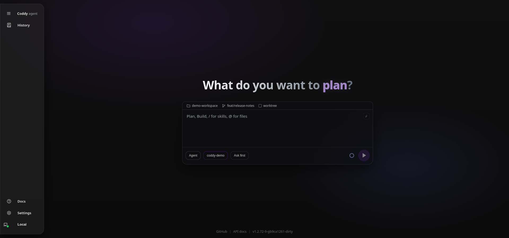

*Широкая боковая панель с подписями при 1920 px; пункт окружения внизу называет машину, на которой работает сервер страницы*

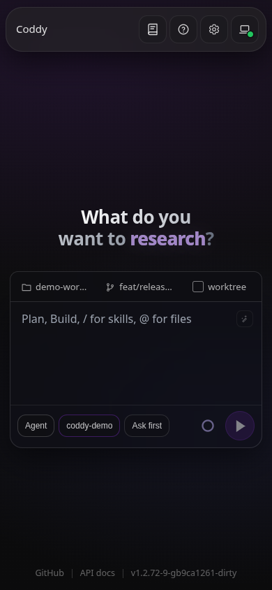

*Та же оболочка при 390 px - боковая панель становится верхней панелью, стартовый экран умещается по ширине*

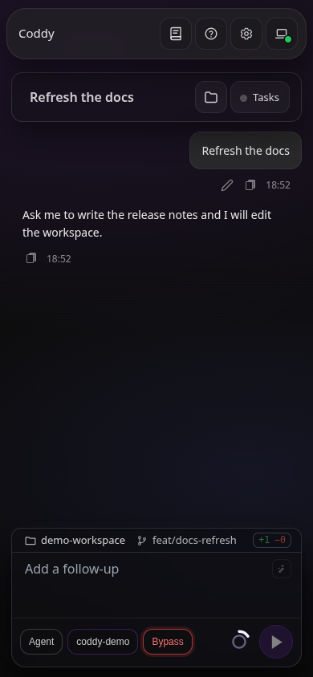

*Чат на телефоне - плашка над полем ввода со счётчиком git в виде таблетки, чипы выбора в одну строку, "Отправить" на своём месте*

Раскладка для компьютера

- **Бренд** - **только типографика** (**Coddy** и **агент**). Перед текстом бренда **нет** круглого логотипа или значка, даже если на старых референсах есть круг;
- навигация на компьютере - **вертикальная панель** со скруглением по **правому** краю (а не таблетка во всю высоту по центру). При **`min-width: 1920px`** в шапке широкой боковой панели есть значок с **горизонтальными линиями**, который служит **только** для **сворачивания** в узкую панель, а не глобальной выдвижной панелью навигации;
- левая боковая панель открывает **историю чатов** пунктом **История** под брендом; щелчок по бренду ведёт на **стартовый экран** (**новый чат**);
- **бренд**, **История**, **Планировщик** (когда есть ссылка), **Настройки** и каждая строка списка **История** используют настоящие значения **`href`** с фрагментом (**`#/`**, **`#/history`**, **`#/scheduler`**, **`#/scheduler/new`** (редактор нового задания), **`#/settings`**, **`#/s/<sessionId>`**), поэтому **щелчок средней кнопкой** или **Ctrl/Cmd+щелчок** открывает **новую вкладку браузера** на том же origin, пока другая вкладка продолжает получать поток;
- список сессий - **всегда** **выдвижная панель поверх** содержимого с подложкой на **всех** брейкпойнтах и при любой ширине боковой панели (**никакой** встроенной колонки рядом с боковой панелью, которая сужала бы область чата). Заголовок панели и связанные с ней элементы используют надпись **История**;
- выбор боковой панели, **узкая или широкая** (значки с подписями), только при **`min-width: 1920px`**, сохраняется в cookie **`coddy_nav_rail`** (по умолчанию **`narrow`**);
- основная область чата с потоковым выводом ассистента;
- правая панель не входит в текущий этап.

Широкие экраны

- При **`min-width: 1920px`** может включаться кнопка расширения боковой панели и раскладка, сохраняемая в cookie (**см. DESIGN.md**). **История** остаётся **плавающей выдвижной панелью** рядом с измеренной колонкой навигации (**`--rail-shell-track-width`**); не фиксируйте **`left`** статической константой в пикселях для широкой панели.

Мобильная раскладка

- На мобильных левая боковая панель становится верхней панелью, чтобы сберечь место по горизонтали; верхняя панель закреплена (**`position: fixed`**) у верха области просмотра (у **`shell-main`** отступ **`--coddy-mobile-top-inset`**), а чат прокручивает **`body`**;
- на мобильных бренд остаётся в одну строку;
- при **`max-width: 1199px`** (и на телефонах, и на планшетах) у выдвижной панели **Настройки** один горизонтальный отступ, **14px**, для всех полос, которые она складывает друг под другом: шапка **НАСТРОЙКИ**, полоса статуса под ней (видна, только если загрузка не удалась или сохранение отклонено), плитки разделов, открытый раздел и подвал с перезагрузкой и сохранением начинаются и заканчиваются на одной линии. Проверьте это, сравнив `getBoundingClientRect().left` у `.settings-tile` и `.settings-body` с `.settings.drawer`, значения должны совпасть.

Раскладка для телефона (**`max-width: 599px`**)

У оболочки четыре уровня по ширине окна: **телефон** до **599px**, **планшет** от **600** до **1199px**, **компьютер** от **1200px** и **широкий** экран от **1920px** (таблица - **Layout grid** в **`DESIGN.md`**). На планшете и компьютере все элементы управления уже помещаются, на телефоне нет, поэтому у самого узкого уровня свой блок в конце **`styles.css`**, и ничего из него не действует шире **599px**. **599px** - граница, которую мобильные платформы используют для класса компактного окна. Любой телефон в портретной ориентации уже неё (Galaxy S21 - 360, iPhone 13 mini - 375, Honor X9d - 393), а самый маленький планшет в портретной ориентации шире.

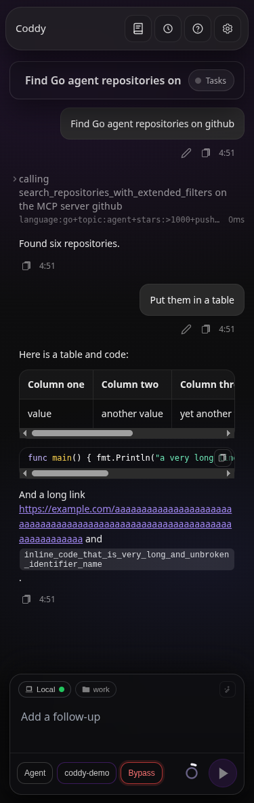

*Чат при 375 px. Строка MCP-инструмента переносит подпись и уводит цель и длительность под неё, а длинная ссылка в ответе разрывается и не расширяет страницу.*

- **Верхняя панель.** Бренд теряет второе слово и показывает только **Coddy**, значки размером **40px** с зазором **4px** прижаты к правому краю. Всё, что не помещается рядом с брендом, прячется за кнопкой **Ещё** (три точки). **История**, **Рой** и окружение всегда остаются на панели, остальные возвращаются по мере появления места в порядке **Настройки**, **Планировщик**, **Документация**, **Выйти**, а меню перечисляет спрятанные пункты как **Документация**, **Планировщик**, **Настройки** и под разделителем **Выйти**. Меню закрывается выбором пункта, **Escape** или нажатием вне его; пока открыта спрятанная панель, кнопка подсвечена. При значках по 40px пять пунктов помещаются примерно с 290px, поэтому на большинстве телефонов меню появляется только на релее или на очень узком экране. Разбиение делает **`nav/navOverflow.ts`**, а замеряет **`NavRail`**, и только в раскладке с верхней панелью;
- **поле ввода, плашка.** У карточки поля ввода нет ряда чипов, рабочая папка показана на плашке над ней одной строкой, в которой папка и ветка сжимаются с многоточием. На телефоне и на любом сенсорном экране элементы выбора на плашке и флажок worktree высотой **36px**, а счётчик git сохраняет тонкий вид в рамке с невидимой областью нажатия **40px** поверх, чтобы в них попадал палец; волшебная палочка улучшения промпта стоит в правом верхнем углу поля;
- **поле ввода, чипы выбора.** Кнопка вложений мультимодальной модели, затем режим, модель, рассуждение и разрешения (в этом порядке на любой ширине) образуют одну полосу, которая прокручивается вбок под затуханием у правого края; кольцо контекста и **Отправить** никогда не сжимаются, поэтому ни один чип под ними не рисуется. Длинное имя модели заканчивается многоточием;
- **стартовый экран.** Его главный блок - одна дорожка сетки, которая не может вырасти шире контейнера (**`grid-template-columns: minmax(0, 1fr)`**), поэтому страница никогда не прокручивается вбок, а заголовок остаётся по центру;
- **транскрипт.** В раскладке с верхней панелью транскрипт и есть страница, поэтому строка шире него прокручивала вбок всю страницу. Строка инструмента с именем MCP-инструмента делала это на 400px на телефоне шириной 360px, как и длинная ссылка или идентификатор в ответе. Теперь ничто в транскрипте не шире него, на любой ширине. Строка инструмента, подписи которой не хватает места в строке, переносит цель, отметку ошибки и длительность вместе под неё, подпись длиннее строки переносится внутри неё, а текст, ссылки и встроенный код разрываются там, где нужно, тогда как таблицы и блоки кода сохраняют свою ширину и прокручиваются в собственной рамке. Строки инструментов остаются свёрнутыми, пока по ним не нажать;
- **настройки.** Плитки разделов остаются в две колонки, а название раздела переносится на две строки вместо многоточия, ведь на телефоне нет наведения, и обрезанное название было недоступно за его подсказкой;
- **текстовые поля** не меньше **16px** на телефоне и на любом устройстве только с сенсорным вводом (**`(any-hover: none) and (any-pointer: coarse)`**), потому что iOS Safari при фокусе увеличивает страницу к более мелкому полю и не возвращает масштаб. Поле ввода и его зеркало подсветки меняются вместе, поскольку зеркало должно сохранять метрики textarea;
- метатег viewport содержит **`interactive-widget=resizes-content`**, поэтому браузеры Android сжимают раскладку, когда открывается экранная клавиатура, и закреплённое поле ввода остаётся над ней. Браузер, который это игнорирует (iOS Safari), сжимает только визуальную область просмотра; тогда закреплённый блок поднимается на высоту, которую закрывает клавиатура (**`--coddy-keyboard-inset`**, измеряется по **`visualViewport`**);
- **клавиатура не появляется сама.** Открытие стартового экрана или чата и закрытие "Истории" не переводят фокус в поле ввода на телефоне или планшете (устройстве только с сенсорным вводом), потому что поле в фокусе открывает экранную клавиатуру; она появляется, когда вы касаетесь поля. Окно на компьютере, узкое или нет, фокус сохраняет.

Проверьте это вживую при **360**, **375**, **393** и **430px** на стартовом экране и в чате, с закрытыми меню и с открытой "Историей". **`document.documentElement.scrollWidth`** должен быть равен **`clientWidth`**, прямоугольник кнопки **Отправить** не должен пересекаться ни с одним **`.composer-tab`**, а прямоугольник бренда - ни с одним значком верхней панели. При **600**, **834** и **1280px** раскладка планшетная и компьютерная. Транскрипт замеряется на каждой ширине сетки командой **`npm run check:overflow`** (см. **Проверка транскрипта на каждой ширине сетки** ниже). Контракт CSS закреплён тестами **`phoneLayoutCss.test.ts`**, **`transcriptWrapCss.test.ts`** и **`layoutGridCss.test.ts`**, последний падает на ширине, о которой спрашивает таблица стилей, но которой нет в сетке; сценарии - **`features/web_ui_phone.feature`**.

Telegram Mini App (issue [#320](https://github.com/coddy-project/coddy-agent/issues/320))

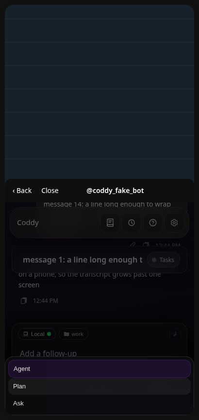

*Диалог в наполовину открытом Mini App. Лист выбора режима и поле ввода остаются в той части, которую показывает Telegram.*

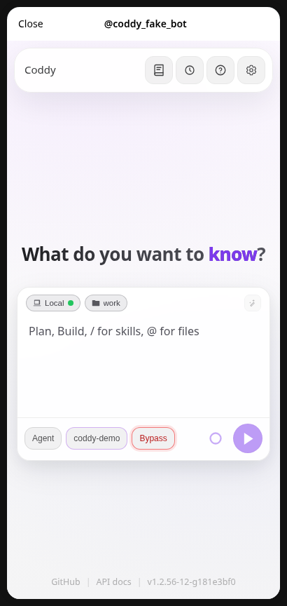

*Открыт из светлой темы Telegram, а в Coddy тема не выбрана, поэтому веб-интерфейс следует теме Telegram, как и шапка Telegram.*

Telegram-бот может открыть веб-интерфейс как свой Mini App из кнопки меню, из кнопки `web_app` или по ссылке. Telegram-шлюз настраивает это, когда `gateways.telegram.mini_app.url` указывает публичный https-адрес веб-интерфейса ([Mini App](gateway.md#mini-app) на странице шлюза); кнопку меню можно направить на веб-интерфейс и вручную в @BotFather. Внутри Telegram веб-интерфейс меняется так, как описано ниже, а обычный браузер ничего из этого не видит.

- **Никаких скриптов с telegram.org.** Веб-интерфейс сам реализует [web events](https://core.telegram.org/api/web-events) Telegram (`ui/telegram/bridge.ts`) через `TelegramWebviewProxy`, который внедряют мобильные и десктопные приложения, или через родительский фрейм Telegram Web, которому он отправляет сообщения на origin родителя и принимает их только от родителя с этого origin. `index.html` ничего не загружает с другого origin, поэтому сеть, которая блокирует telegram.org, ничью страницу не замедляет;
- **параметры запуска.** Telegram кладёт их в адрес (`#tgWebAppData=...&tgWebAppVersion=...`). Веб-интерфейс читает их раньше всего остального (`ui/telegram/launch.ts`), хранит в `sessionStorage` вкладки, чтобы после перезагрузки внутри Telegram страница осталась Mini App, и убирает их из адреса, чтобы роутер видел свой маршрут, а ссылка, скопированная со страницы, не уносила подписанные данные запуска. `?session=<id>`, ссылка, которую выдаёт `/app` бота, открывает этот диалог и в Mini App, и в обычном браузере. Данные запуска никогда не заменяют пользователя, входить нужно так же, как в браузере;
- **окно.** Веб-интерфейс разворачивает Mini App на всю высоту, отключает вертикальный свайп, который сворачивал бы его при прокрутке транскрипта (шапка Telegram по-прежнему его сворачивает), и передаёт шапке, фону и нижней панели Telegram цвета темы, заново при каждой смене темы. Пока вы не выберете тему в разделе **Настройки → Оформление**, он следует светлой или тёмной теме Telegram;
- **назад.** Кнопка "Назад" в Telegram работает как **Escape**, то есть закрывает верхнее меню, лист, диалоговое окно или экран, а в диалоге, где ничего не открыто, переходит на стартовый экран. Она никогда не пропускает вопрос, который задал вам агент. На стартовом экране, где ничего не открыто, Telegram показывает **Закрыть**, а клавиша "Назад" в Android закрывает Mini App;
- **наполовину открытое окно.** Telegram может показывать только верхнюю часть Mini App. Закреплённое поле ввода, меню и элементы выбора (листы снизу, как везде на телефоне), окно подтверждения и просмотрщик изображений поднимаются в показанную Telegram часть на высоту скрытой части или экранной клавиатуры, смотря что больше, а самое новое сообщение транскрипта остаётся над полем ввода. "История", "Настройки" и другие выдвижные панели остаются на месте, их шапка и кнопка закрытия на виду. В полноэкранном режиме верхняя панель не заходит на строку состояния и собственные кнопки Telegram;
- **Telegram Web.** web.telegram.org запускает Mini App во фрейме чужого сайта, где браузер не хранит cookie входа. Если сервер принял вход, а браузер выбросил cookie, экран входа сообщает об этом и даёт ссылку на Coddy в отдельной вкладке. Мобильные и десктопные приложения дают Mini App собственное окно, где вход работает как в браузере.

Модуль - `external/ui/src/ui/telegram/` с собственной таблицей стилей `telegram.css`; сценарии - `features/web_ui_telegram_mini_app.feature`. Чтобы посмотреть на него без Telegram и без телефона, откройте его со стенда без сети. [Отладка с поддельным Bot API](gateway.md#отладка-на-поддельном-bot-api) показывает стенд вручную, а `npm run check:telegram` прогоняет его от начала до конца (*Проверка Telegram Mini App* ниже).

Ссылки в шапке

- Ссылка GitHub на `https://github.com/coddy-project/coddy-agent` (**новая вкладка**, `rel=noopener`);
- ссылка API docs на `/docs/` (**новая вкладка**, `rel=noopener`);
- версия сервера, с которым общается страница, справа (**`GET /coddy/info`**). Релиз выглядит как **`v1.2.36`** и ведёт на свои заметки о релизе на GitHub, сборка между релизами показывается как есть. В удалённом окружении или внутри узла, открытого через релей, это версия того сервера, а не страницы;
- все три стоят в подвале стартового экрана (**GitHub** | **API docs** | **v1.2.36**, **`chat/HeroFooter.tsx`**) и исчезают, как только открыт чат; на боковой панели их нет.

Подсказки узкой боковой панели (компьютер)

- Когда у боковой панели **нет** широких подписей, **всплывающие подсказки** при наведении поясняют значки (например, **Новый чат** на бренде, **История** на истории). **Широкая панель с подписями** скрывает эти подсказки, их роль выполняют подписи;
- после открытия **История** подсказка кнопки истории **не** должна оставаться видимой, даже если указатель всё ещё над боковой панелью (см. **DESIGN.md**).

Закрытие экрана клавишей Escape

- Каждый пункт боковой панели, кроме **Выйти**, открывает экран поверх чата: **История**, **Планировщик**, **Рой**, **Документация** и **Настройки**. **Escape** закрывает открытый экран так же, как его **×**, и адрес возвращается к тому, что было под ним (чат, стартовый экран или место, откуда открыли документацию), поэтому перезагрузка не возвращает экран. Экран роя поверх чата закрывается так же, как по щелчку на подложку; на релее карта роя - домашний экран и остаётся;
- клавиша отменяет по одному шагу за раз. Первым её получает то, что ближе: открытое меню (⋮ строки "Истории", меню фильтра, **Ещё** на телефоне, меню **Режим**, **Модель**, **Рассуждение** и **Разрешения** поля ввода, меню окружения, папки и ветки), элемент выбора или всплывающее окно контекста поля ввода, обзор папок, переименовываемый заголовок чата, подсказка (i) поля настроек, открытый список комбобокса настроек, результаты маркетплейса под поиском установки в "Навыках" (Escape очищает поиск), поиск по документации, пока в нём есть текст (первый Escape очищает его, следующий закрывает документацию), окно подтверждения, просмотрщик изображений. Экран с собственным шагом делает этот шаг до закрытия, тот же, что и стрелка в его шапке: открытое задание планировщика или его запуски возвращаются к списку заданий; открытая строка настроек (провайдер, модель) возвращается к своему списку; раздел настроек на телефоне или планшете возвращается к плиткам;
- Escape, закрывший экран, дальше не идёт, и карточка вопросов чата под ним сохраняет свои вопросы (когда экран не открыт, Escape пропускает их, как и раньше, а Escape, закрывший элемент выбора поля ввода, нет). Удерживаемая клавиша, Escape с модификатором и Escape, который завершает набор в методе ввода, ничего не закрывают;
- правило записано один раз для всех экранов (**`nav/railEscape.ts`**, его вызывает **`App.tsx`** с таблицей всех экранов боковой панели, типизированной по её пунктам), поэтому экран, добавленный на боковую панель позже, закрывается по Escape без собственного обработчика и не проходит проверку типов без записи в таблице. Меню, всплывающее окно или диалоговое окно закрывается по Escape через **`useEscapeCloses`** (**`components/useEscapeCloses.ts`**), который перехватывает клавишу раньше экрана под ним. Контракт - **`DESIGN.md`** (**Escape and the screens of the rail**); тесты - **`nav/railEscape.test.tsx`**, **`App.railEscape.test.tsx`**; сценарии - **`features/web_ui_rail_escape.feature`**.

## Сессии

- Идентификатор сессии создаётся на клиенте и только после отправки первого сообщения из нового чата;
- Идентификатор сессии хранится во фрагменте URL:
  - рекомендуемый формат `#/s/<sessionId>`;
- Неотправленный текст поля ввода может сохраняться как черновая сессия, которая есть только на клиенте:
  - черновые сессии используют `#/draft/<draftId>` и хранятся в `localStorage` под ключом `coddy_draft_sessions_v1`;
  - строки истории показывают перед названием префикс `Draft:`;
- В транспорте чата идентификатор сессии передаётся в заголовке `X-Coddy-Session-ID`;
- Проверка идентификатора сессии совпадает с `internal/session/ValidateFolderSessionID`;
- Сохранённые файлы сессии лежат в её каталоге и удаляются вместе с сессией:
  - `tool_calls/` - история вызовов инструментов;
  - `stats.json` - суммарный расход токенов.

### Параллельные сессии и отмена генерации

- Несколько сессий могут **одновременно получать ответ потоком**, у каждой свой **`POST /v1/responses`** и свой **`X-Coddy-Session-ID`**. Приложение ведёт **теневой транскрипт для каждой сессии**, чтобы при быстрой смене хеша обновления SSE не попадали не в ту сессию; см. **`pickStreamMutationBase`** в **`external/ui/src/ui/chat/streamMutationBase.ts`**;
- Теневые транскрипты **ограничены** LRU-кэшем на **3** незакреплённые сессии (**`ShadowTranscriptCache`** в **`external/ui/src/ui/chat/sessionTranscriptCache.ts`**). Открытая сессия и любая сессия с живым потоком никогда не вытесняются; вытесненная сессия загружается заново при следующем открытии, без лишнего запроса по сравнению с нынешним поведением. Строки сообщений и **`Markdown`** мемоизированы (**`React.memo`**, **`useStableHandler`**), поэтому неизменившиеся строки не перерисовываются, пока приходят токены (**`MessageList`** обрабатывает срез окна транскрипта, см. **Длинные сессии**; строки плана, разрешений и вопросов не мемоизированы). У строк транскрипта нет **`content-visibility`**. Когда строкам за пределами экрана позволяли пропускать раскладку, высота каждой строки выше первого экрана бралась из запасной оценки, поэтому на длинной сессии область прокрутки оказывалась короче примерно на шестую часть, а прокрутка вверх сдвигала позицию вниз по мере того, как приходили настоящие высоты. См. **`DESIGN.md`** (**Multi-session streaming and Stop**);
- **Активность на сервере не зависит от локального читателя потока.** Интерфейс запрашивает **`GET /coddy/sessions/{id}/activity`** при открытии сессии и при переподключении, независимо от того, попала ли эта сессия в отфильтрованный или постраничный список **История**. **`chat/useSessionTurnActivity`** не подгружает ни активность, ни очередь, пока собственный POST этой вкладки ждёт допуска. Пока ход идёт, кнопка остановки и постановка в очередь доступны даже без локального читателя; потеря или закрытие читателя не доказывает, что ход закончился. Если **`turn_ended`** пересекается с ожидающим или уже принятым POST этой вкладки, интерфейс объявляет простой только после свежего подтверждения активности через REST;
- Кнопка остановки вызывает **`POST /coddy/sessions/{id}/cancel`** и обрывает потоковый **`fetch`** хода в этой вкладке сразу после отправки запроса, не дожидаясь ответа. Браузер держит шесть соединений HTTP/1.1 на хост на все свои вкладки; если открыто несколько вкладок Coddy, потоки событий и ходов могут занять их все, и запрос отмены ждал бы соединения, которое держит этот читатель. Без читателя ход продолжает выполняться на сервере. Неудачный запрос показывает ошибку, сохраняет состояние выполнения и кнопку остановки для повторной попытки, а вкладка снова подключается к ходу через релей поля ввода. Успешный ответ подтверждает кооперативную отмену; интерфейс считает сессию остановленной только после того, как сервер завершит ход или свежий снимок активности сообщит о простое. Если токены уже пришли, сервер сохраняет **частичный** **`content`** ассистента за этот ход. **`GET /coddy/sessions/{id}/messages`** может недолго возвращать более старый снимок; если ответ оказался только префиксом, интерфейс **объединяет** его с локальными теневыми или видимыми строками (**`mergeTranscriptPreferLocalSuffix`**, **`keepLocalTranscriptIfServerEmpty`** в **`external/ui/src/ui/chat/transcriptServerSnapshot.ts`**). При ошибке загрузки транскрипт очищается **только** тогда, когда неудачная загрузка относится к **открытой сейчас** сессии, поэтому остановка не стирает чат;

- **Вызовы инструментов сохраняют свой исход.** Если остановка прерывает ход до того, как начался стоящий в очереди вызов, его сохранённый результат - `cancelled` / **не выполнен**. Вызов, который уже выполняется, сохраняет свой фактический исход, потому что отмена не откатывает побочные эффекты. Если в старом транскрипте результата нет, запрос к провайдеру получает фиксированную заглушку, которая предупреждает о **неизвестном исходе**; сам старый транскрипт и его строки в интерфейсе не меняются. Ответ на запрос разрешения, пришедший после более нового сообщения пользователя, устарел. Он закрывает этот запрос, по возможности записывает вызов как отменённый, не запускает инструмент и не переписывает более новое сообщение. Некорректные или неоднозначные ID вызовов и результаты дают локальную диагностику вместо ошибки `400` от провайдера. Чтобы восстановиться, выполните **`/compact`** или начните новую сессию и не повторяйте вслепую вызов с побочными эффектами, исход которого неизвестен.

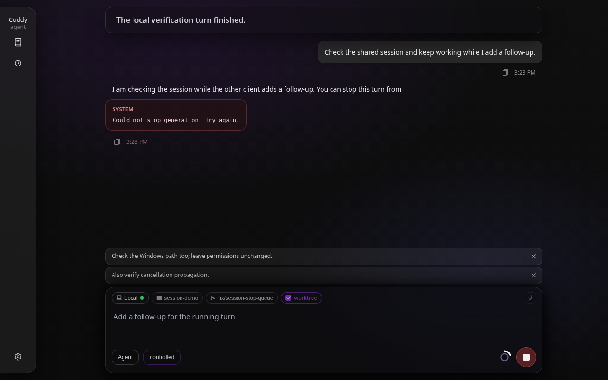

*Отмена не удалась, ход продолжается, а кнопка остановки доступна для новой попытки.*

Название сессии

- Интерфейс показывает название сессии в заголовке чата;
- Если названия нет, интерфейс показывает `New chat`;
- Название редактируется прямо на месте. При потере фокуса интерфейс сохраняет его через `PATCH /coddy/sessions/{id}`;
- Пока новому чату придумывается название, в заголовке на его месте вместо первого сообщения мерцает полоса ([Список сессий](#список-сессий)).

### Модель сессии

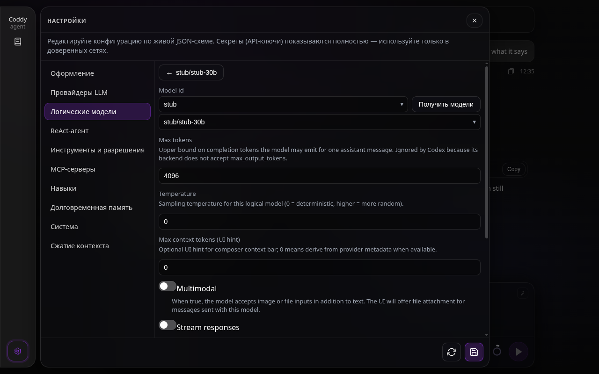

*Переключатель потоковых ответов в строке модели в настройках*

- **Новый чат** берёт **Модель** по умолчанию из cookie **`coddy_llm_model`**, если она называет настроенный бэкенд, иначе первую по алфавиту строку YAML. Набранная в отправленном сообщении команда **`/model <id>`** на этом интерфейсе тоже считается выбором и записывает ту же cookie (формы **`--once`** / **`--count`**, действующие на отдельные ходы, её не записывают);
- **При открытии сессии** значение **Модель** восстанавливается из снимка **`settings`** в ответе **`GET /coddy/sessions/{id}/messages`** (собственная модель сессии; **`model`** верхнего уровня называет модель, на которой работает идущий ход), и никогда из cookie. Cookie и выбор на стартовой странице задают значение по умолчанию только для нового чата;
- Смена значения **Модель** записывает cookie (значение по умолчанию для следующего чата, созданного через **Новый чат**) и отправляет **`PATCH`** **`selectedModelId`** для активной сессии. Ходы ReAct по-прежнему передают **`metadata.model`** в **`POST /v1/responses`**;
- **Много моделей и длинные имена** - идентификаторы бэкендов имеют вид **`vendor/model`**. Если настроено больше одного вендора, меню группирует строки под заголовками вендоров в верхнем регистре, а каждая строка показывает только имя модели (полный идентификатор остаётся в подсказке строки). Вендоры идут в порядке конфигурации, модели каждого вендора - по алфавиту, а версии сравниваются как числа (**`gpt-5.6-luna`**, **`gpt-5.10`**, **`gpt-6-astra`**), поэтому модель, добавленная в **`models[]`** позже, встаёт туда, куда её ставит имя, а не в конец своей группы; **Enter** в фильтре берёт первую строку в этом порядке. На десктопе список прокручивается и показывает не больше ~5 строк. Если бэкендов **больше 5**, сверху появляется **поле фильтра** (сразу с фокусом), которое ищет по вендору, имени модели или полному идентификатору без учёта регистра; **Enter** выбирает первое совпадение, **Escape** закрывает меню, а при пустом результате показывается уведомление "Нет моделей по запросу …". Каждое меню поля ввода (**Режим**, **Модель**, **Рассуждение**, **Разрешения**) закрывается по **Escape**, с фильтром и без него, где бы ни был фокус. Логика фильтра, групп и порога лежит в **`chat/llmModelMenu.ts`** (юнит-тесты в **`llmModelMenu.test.ts`**; подключение меню покрывает **`ComposerModelMenu.test.tsx`**);
- **Нижняя панель на телефоне** - в узкой или мобильной оболочке (брейкпойнт стека оболочки **`max-width: 1199px`**) меню **Режим** / **Модель** / **Рассуждение** открываются не тесным выпадающим списком у кнопки, а **нижней панелью во всю ширину** поверх затемнённой подложки, так же как пикеры слэш-команд (**`/`**) и **`@`**. Фильтр и группировка внутри панели работают так же. На десктопе остаётся выпадающий список у кнопки.

### Уровень рассуждения сессии

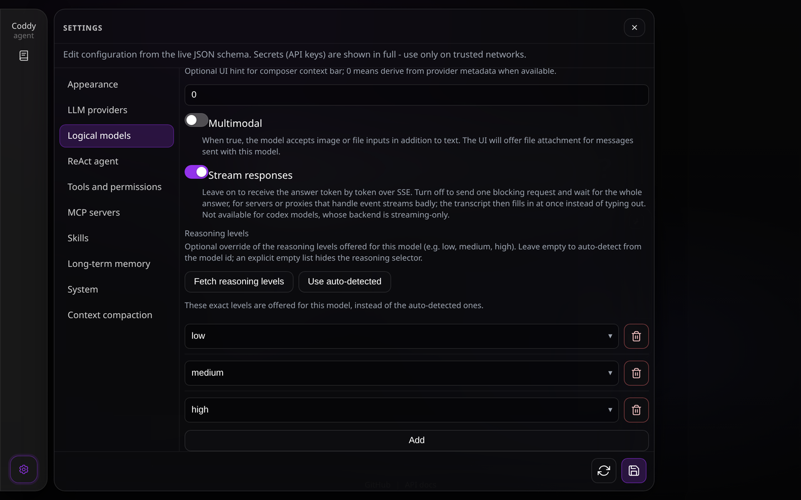

*Выпадающий список уровня рассуждения в поле ввода, уровни получены от провайдера*

- Селектор **Рассуждение** появляется в поле ввода рядом с **Модель** **только** тогда, когда активная модель отдаёт **`reasoning_levels`** в **`GET /v1/models`** (модели с рассуждением, например gpt-5, o-серия, thinking-модели Claude). Уровни берутся из **`models[].reasoning_levels`** (если ключ не задан, они определяются автоматически по идентификатору модели) и передаются по цепочке **`ModelInfo.reasoningLevels`** → **`llmReasoningLevels`** в **`App.tsx`** → **`Composer`**;
- **Новый чат** берёт уровень по умолчанию из cookie **`coddy_llm_reasoning`**, затем из **`reasoning_default`** модели, затем **`medium`** (или первый предложенный уровень). **При открытии сессии** уровень восстанавливается из **`settings.reasoning`** снимка, и никогда из cookie. Сессия, работающая с выключенным рассуждением, показывает **Off**, если в её логической модели включено **`allow_reasoning_off: true`**, а сессия без собственного уровня на модели без **`reasoning_default`** показывает **`medium`** или первый уровень, при входе и после каждого следующего снимка, и не отправляет его, пока уровень не выбран. Меню предлагает **Off** для сессии, в снимке которой он указан. При переключении на модель, которая не предлагает текущий уровень, он заменяется допустимым (см. **`pickReasoningLevel`** в **`chat/reasoningSelection.ts`**);
- Смена уровня записывает cookie и отправляет **`PATCH`** **`selectedReasoning`** для активной сессии; ходы ReAct также передают **`metadata.reasoning`** в **`POST /v1/responses`**, чтобы совсем новая сессия применила уровень уже на первом ходе.

### Настройки сессии - чип разрешений, переопределения на ходы, живое зеркало

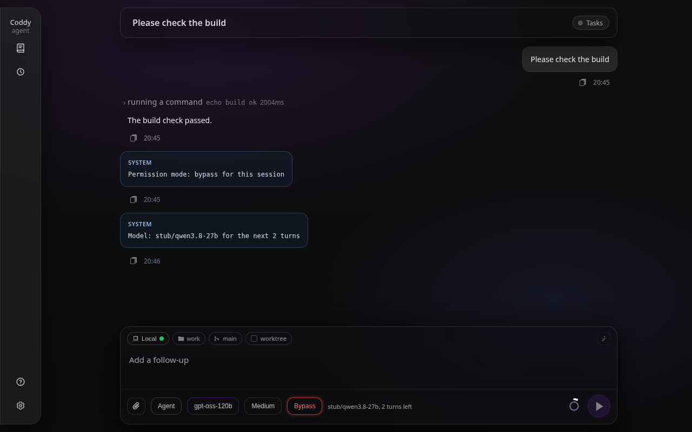

*Поле ввода после того, как сессию перевели в режим без вопросов из запроса разрешения, а модель сменили на два хода.*

- Поле ввода отражает снимок настроек сессии ([Настройки сессии](../features/session-settings.md)), который приходит как **`settings`** в **`GET /coddy/sessions/{id}/messages`** и в ответе на **`PATCH /coddy/sessions/{id}`**, а также как **`event: session_settings`** в потоке хода и в **`GET /coddy/events`**. Снимок разбирает **`chat/sessionSettings.ts`**; **`App.tsx`** хранит для каждой сессии наибольшую **`version`** (**`isNewerSettings`**), поэтому одно и то же изменение, пришедшее по обоим соединениям, или ответ, пришедший после события более позднего изменения, применяется один раз и никогда не откатывается;
- **Режим**, **Модель** и **Рассуждение** следуют за изменением, где бы его ни сделали, будь то набранная команда, диалог разрешения, вызов **`switch_model`** самой модели, консоль или редактор на той же сессии. Каждый **`POST /v1/responses`** несёт **`metadata.settingsVersion`**, то есть версию, которую вкладка применила последней; если с тех пор опубликован более новый снимок, сервер игнорирует **`model`** / **`reasoning`** / режим вкладки, поэтому устаревшая вкладка не может отменить изменение, которого не видела;
- **Режим**, **Модель** и **Рассуждение** принадлежат сессии на экране. Открытая сессия показывает режим из своего снимка (**`settings.mode`**). Новый чат - **Новый чат**, кнопка "Назад" браузера к **`#/`**, черновик в **Истории**, id сессии, на который сервер отвечает **404**, - начинается в режиме **Агент** с моделью и уровнем нового чата по умолчанию, а не в режиме чата, из которого вы ушли, и режим, выбранный на стартовом экране, достаётся созданному чату. Пока открытая сессия загружается, селекторы ещё показывают покинутую, и промпт унёс бы их режим, **`metadata.model`** и **`metadata.reasoning`** без **`settingsVersion`** открытой сессии, а сервер сохранил бы их. Поэтому кнопка **Отправить** и клавиша **Enter** ждут, пока не применён собственный снимок сессии, а черновик остаётся в поле ввода. Чтение, которое не удалось, повторяется через 1, 3 и 9 секунд, а затем раз в 30 секунд, пока чат открыт, а новым чатом адрес открывает только ответ сервера **404**. История держит одну страницу, поэтому сессии, которой в ней нет, вполне может быть на сервере. Сообщение для идущего хода по-прежнему встаёт в очередь, и оно ничего из этого не несёт. Контракт закреплён тестами **`App.settingsPerSession.test.tsx`**, **`Composer.sessionLoading.test.tsx`** и сценарием **`features/web_ui_session_settings.feature`**;
- **Чип разрешений** (**`data-testid="composer-permission"`**) - последний селектор в ряду, после **Модель** и **Рассуждение**. Он показывает **Спрашивать**, **Правки без вопросов** или **Без вопросов**, последний режим - красным со свечением, а его подсказка называет режим из конфигурации, к которому сессия вернётся после перезапуска. Его меню вызывает **`PATCH`** **`permissionMode`**. В новом чате (на стартовом экране или в черновике, пока сессии ещё нет) чип называет режим, с которым настроен сервер, то есть **`permissionMode`** из **`GET /coddy/info`** (**`tools.permission_mode`**). Этот режим читается через активное окружение (локальный сервер, удалённый сервер, узел за точкой монтирования релея) и перечитывается при каждом **`config_reloaded`** и каждом переподключении **`GET /coddy/events`**. Выбор, сделанный там, запоминается и отправляется строкой **`/permissions <mode>`** перед первым сообщением, если он не совпадает с настроенным режимом. Пока настроенный режим неизвестен (ответа ещё нет или сервер его не сообщает), выбор отправляется всегда, поэтому явный **Спрашивать** при конфигурации **`bypass`** никогда не теряется. Без выбора отправляется режим, который показывает чип, и первый ход никогда не идёт в режиме, который страница не смогла назвать. Если сервер так и не принял первое сообщение, выбор сохраняется для следующей попытки в ту же сессию. Контракт описывает **`App.permissionDefault.test.tsx`**;
- **Строка переопределений** (**`data-testid="composer-overrides"`**) перечисляет, что изменено на следующие ходы (**`stub/qwen3.8-demo, 2 turns left`**, **`plan this turn`**), а полный список лежит в её подсказке; в узкой оболочке она сокращается с многоточием и не выталкивает кнопку отправки за край панели;
- Промпт, состоящий только из команд настроек, не запускает ход. Поток заканчивается **`coddy_meta.settings_only`**, вкладка убирает свои оптимистичные строки пользователя и ассистента и перечитывает транскрипт. Изменение видно на селекторах и в строке переопределений, а в транскрипте строки для него не появляется;
- Строку-уведомление **СИСТЕМА** оставляет только изменение, которое агент сделал сам, то есть его вызов **`switch_model`** или frontmatter скила (`Model: stub/qwen3.8-27b for this session`). То, что выбирает пользователь (селектором, командой, в диалоге разрешения, а также модель и режим, с которыми консоль или **`coddy -p`** запустили сессию), уже видно на селекторах; строки о таких изменениях, которые хранит сессия, сохранённая более ранней версией, не показываются.

### Уровни рассуждения логической модели в настройках

Функциональный чек-лист для **Настройки → Логические модели → Уровни рассуждения**
(**`ReasoningLevelsField.tsx`**, **`useReasoningLevels.ts`**):

- Поле отвечает за три состояния **`models[].reasoning_levels`** и называет текущее в строке статуса. Это **ключ отсутствует** (уровни определяются автоматически по идентификатору модели), **`[]`** (селектор **Рассуждение** в поле ввода для этой модели скрыт) и **непустой список** (предлагаются ровно эти уровни). Обычный редактор массивов не может выразить первое состояние, и без этого поля модель, добавленная через настройки, не смогла бы вернуться к автоопределению;
- **Получить уровни ризонинга** вызывает **`GET /coddy/config/reasoning-levels?model=<id>&provider_type=<type>`** с идентификатором, который сейчас стоит в форме (запись можно ещё не сохранять), и заполняет список тем, что определил шлюз, с той же перекодировкой Codex, которую применяет поле ввода (**`minimal`** становится **`none`**). **`provider_type`** - тип строки провайдера, на которую указывает идентификатор; он берётся из редактируемого документа настроек, а не из сохранённой конфигурации, поэтому провайдер, который ещё не сохранён или чей тип только что изменили, разрешается так же, как после **Сохранить**. Кнопка неактивна, пока не задан идентификатор модели;
- Если у идентификатора модели **нет** семейства рассуждений, поле остаётся нетронутым, и интерфейс об этом сообщает. Запись **`[]`** читалась бы как явный отказ и скрыла бы селектор, то есть сделала бы противоположное тому, о чём просили кнопку. Неудачный запрос показывает ошибку прямо в поле и тоже его не трогает;
- Строка статуса сначала описывает список, на который смотрит оператор, и только потом повторяет результат запроса. Как только в списке есть уровень (полученный или добавленный вручную), она читается как переопределение, а сообщения "ничего не найдено" и об ошибке относятся только к состоянию, когда ключа ещё нет. Повторный ввод идентификатора модели или ручная правка списка (добавить, изменить, удалить уровень) сбрасывает этот результат и отказывается от ответа, который ещё в пути. Ответ, пришедший после смены идентификатора, после ручной правки или после удаления строки из списка, отбрасывается и не записывается поверх более нового выбора оператора, а ответ, который всё же применяется, записывается через самый новый `onChange` поля, поэтому соседнее поле, изменённое во время запроса (например, переключатель **Потоковые ответы**), сохраняет новое значение (**`useReasoningLevels`** выдаёт каждому запросу талон, и запрос, ответивший после того, как поле ушло дальше, разрешается в **`null`**);
- Кнопка **Использовать автоопределение** появляется всякий раз, когда ключ задан, и удаляет его, так что следующее сохранение не пишет **`reasoning_levels`**, и автоопределение возобновляется. Чтобы намеренно получить отказ **`[]`**, удалите последний уровень вручную;
- Отказ **`[]`** и автоопределение по умолчанию переживают сохранение настроек в обе стороны. **`ModelEntry.ReasoningLevels`** и **`ModelJSON.ReasoningLevels`** имеют тип **`*[]string`**, поэтому пропущенный ключ остаётся пропущенным в записанном **`config.yaml`** и не сериализуется как **`reasoning_levels: []`**.

### Рабочая папка сессии (папка / ветка / worktree)

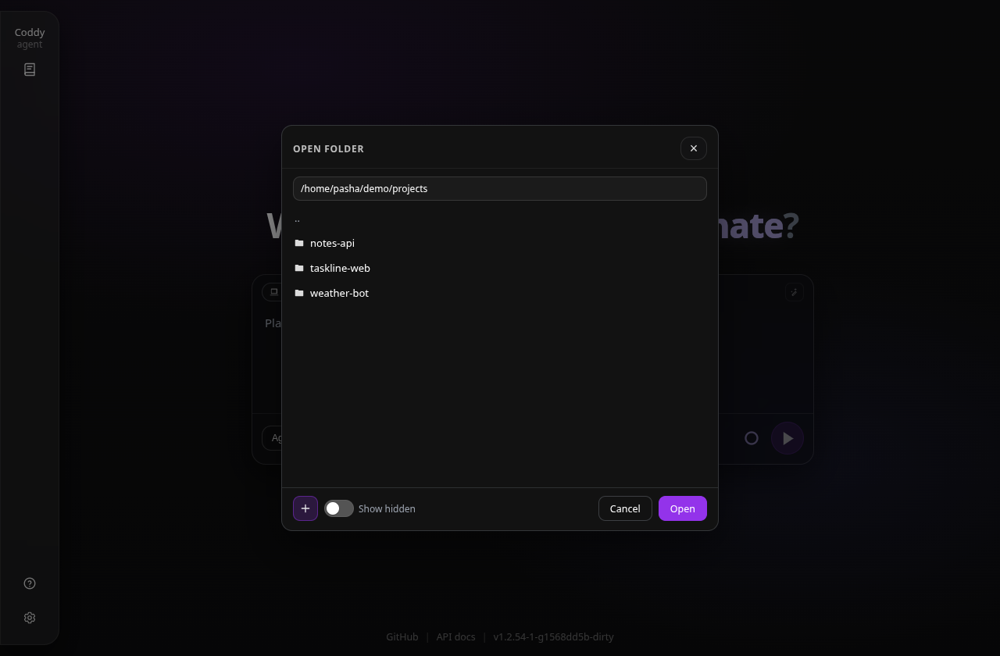

*Диалог "Открыть папку" с кнопкой "Новая папка" и переключателем "Скрытые" слева внизу*

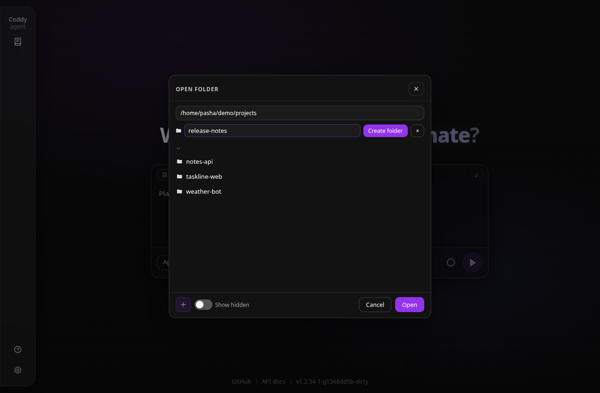

*Строка ввода имени новой папки*

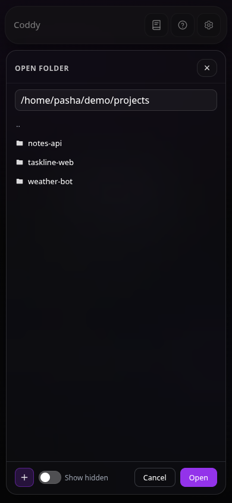

*Диалог "Открыть папку" на телефоне открывается там же, где История*

- До первого сообщения папка, ветка и worktree **выбираются на плашке над полем ввода** (**`WorkspaceChips.tsx`** в режиме выбора плашки, вспомогательные функции в **`chat/workspaceContext.ts`**). Это **папка** (для worktree - имя и путь основного проекта, иначе текущая папка), **ветка** (текущая ветка git) и **флажок worktree**, причём последние два есть только тогда, когда рабочая папка - git-репозиторий. В самой карточке поля ввода нет ряда чипов, поэтому поле начинается с её верха. Рабочий каталог сессии остаётся внутри её worktree;
- **Одна строка** - элементы выбора принадлежат самой плашке; папка и ветка сокращаются с многоточием, более светлый фон отмечает элемент при наведении и пока открыто его меню, а счётчика git до появления сессии нет. На телефоне и сенсорном экране элементы выбора и флажок имеют высоту **36px**, а счётчик git сохраняет тонкий вид с невидимой областью нажатия **40px** поверх него, чтобы в них можно было попасть пальцем;
- Контекст загружается из **`GET /coddy/workspace/context`** с **`X-Coddy-Session-ID`** при каждой смене открытой сессии; без сессии показывается рабочий каталог сервера по умолчанию;
- **Что помнит стартовый экран** - папку, последней выбранную для нового чата в этом браузере (cookie **`coddy_workspace_dir`**, своя для каждого окружения), иначе папку сервера по умолчанию, и флажок worktree (cookie **`coddy_worktree`**), один выбор для всех папок с git. Чат, из которого перешли на стартовый экран, не передаёт ему ничего своего - ни папку, ни связанный worktree, ни ветку. Показывается ветка, на которой папка стоит сейчас; она перечитывается при открытии стартового экрана и при возврате фокуса на страницу, поэтому `git switch` в терминале будет виден, а сменить ветку для нового чата можно прямо там;
- **Новый чат следует за выбранной папкой** - до первого сообщения сессии нет, поэтому выбор хранится в **`App.tsx`** (**`pendingWorkspaceRef`**, отражённый в состоянии **`pendingWorkspacePath`**) и применяется при первой отправке. Всё, что поле ввода предлагает во время набора, запрашивается для этой папки. Каждый запрос, привязанный к рабочему каталогу (**`/coddy/slash-commands`**, **`/coddy/mentions`**, **`POST /coddy/mentions/check`**, **`/coddy/workspace/file`**), несёт **`cwd=<folder>`** рядом с **`X-Coddy-Session-ID`** (вспомогательный модуль **`chat/workspaceScope.ts`**), поэтому меню **`/`** показывает **`.coddy/skills`** этой папки, **`@agent:`** - её субагентов, а **`@`** - её файлы. Известные имена скилов, по которым поле ввода и транскрипт отмечают **`/name`** как скил, следуют за той же папкой. Другой выбор сразу сбрасывает их и запрашивает заново, ответ для папки, которую уже покинули, отбрасывается, а более медленный предпросмотр раннего выбора никогда не перекрывает более поздний. Настройки → Навыки и Субагенты показывают ту же папку;
- **Первое сообщение видно сразу** (issue #357) - чат открывается на нём в том же кадре, в котором оно отправлено, а живая строка под ним пишет `Готовлю сессию…`, пока применяются папка и ветка, выбранные на стартовом экране, и сервер поднимает MCP-серверы сессии. Папка или ветка, которую не удалось применить, молча не пропускается: ничего не отправляется в другую рабочую папку, стартовый экран возвращается в том виде, из которого ушло сообщение (выбор папки и ветки, текст и файлы на месте), и под полем ввода сказано почему (`Не удалось подготовить рабочую папку: … Сообщение не отправлено.`), так что повторная отправка снова применяет выбор. Текст ждёт на стартовом экране, даже если вы успели уйти в другой чат, пока выбор применялся, а несостоявшийся чат не остаётся в истории;
- **Выбирается один раз** - папка, ветка и worktree задаются до начала диалога. Когда в транскрипте появляются сообщения (**`workspaceLocked`**), элементы выбора уступают место [плашке идущего чата](#плашка-над-полем-ввода), которая показывает, где работает чат; на **`POST .../workspace`** сервер отвечает **409**, и ход, который уже выполняется, тоже отвечает **409**;
- **Выбор папки** открывает меню **Недавние** (в стиле Claude Desktop). В нём недавно использованные папки из **`localStorage`** **`coddy_workspace_recents_v1`** (**`chat/workspaceRecents.ts`**), текущая рабочая папка, отмеченная **✓**, локальное поле фильтра для длинного списка, а внизу **`Open folder…`**, который открывает **модальное окно выбора папки** (**`WorkspaceFolderModal.tsx`**) с данными из **`GET /coddy/workspace/folders?path=`**. Строки открывают папки, **`..`** поднимается на уровень выше, **Открыть** выбирает просматриваемую папку, **Отмена** закрывает окно. Список папок - единственная область прокрутки диалога. Это единственный дочерний элемент, которому разрешено сжиматься (**`min-height: 0`**), поэтому **Отмена** / **Открыть** остаются доступны в низком окне браузера и не обрезаются ограничением высоты диалога, а прокрутка колесом дальше последней папки остаётся в списке и не прокручивает страницу за ним. Проверено в WebKit скриптом **`external/ui/scripts/webkit-scroll-check.mjs`** (см. ниже);
- **Размер** - начиная с ширины планшета это карточка по центру шириной 560px (меньше в узком окне); на телефоне диалог открывается там же, где **История**, такой же стеклянной панелью под верхней панелью, поэтому списку папок достаётся вся высота экрана. Заголовок нарисован так же, как заголовки **Истории** и **Планировщика**, а поле, строки и кнопки используют шрифт приложения;
- **Ссылки на папки** - символическая ссылка на каталог отмечена в списке стрелкой на иконке папки и целью после имени (**`→ /path/to/target`**), чтобы ссылка не выглядела обычной папкой; щелчок по ней открывает путь самой ссылки;
- **Новая папка** (квадратный **+** слева в нижней части диалога, в цветах кнопки добавления **Планировщика**, сразу за ней переключатель **Скрытые**; **Отмена** / **Открыть** стоят справа) открывает строку ввода имени **между полем пути и списком**. Строка стоит рядом со списком, вне его, поэтому никогда не уезжает при прокрутке и остаётся целой в низком окне, где сам список сжался до нуля. **Enter** или **Создать папку** отправляет **`POST /coddy/workspace/folders`** **`{"path": <browsed folder>, "name"}`**; затем диалог показывает список, которым ответил сервер, то есть содержимое **новой папки**, поэтому **Открыть** сразу выбирает её. **Escape** или **×** в строке отменяют создание; если строка не открыта, **Escape** закрывает диалог так же, как **Отмена**. Кнопка неактивна на уровне дисков (там негде создать каталог) и пока строка уже открыта; **Создать папку** остаётся неактивной, пока не введено имя. Если имя уже занято (**409**), строка остаётся открытой с введённым текстом и сообщает об этом, и так же при любой другой ошибке - ничего не создаётся, и просматриваемая папка не меняется;
- **Выход за пределы диска (Windows)** - **`..`** из корня диска открывает **уровень дисков** (**`?path=:drives:`**, **`drives:true`** в ответе). На нём по строке на каждый том (**`C:`**, **`D:`**, …), над ним нет **`..`**, а **Открыть** неактивна, потому что по этому уровню только перемещаются, рабочей папкой он быть не может. **Строка пути - редактируемое поле** (**`workspace-modal-path`**). Если ввести или вставить путь и нажать **Enter**, диалог перейдёт туда; кавычки вокруг пути из пункта *Копировать как путь* Проводника убираются (**`cleanPathInput`**), а пока в поле стоит путь, который ещё не открывали, основная кнопка называется **Перейти** вместо **Открыть**, поэтому вставленный путь никогда не примут за открываемую папку. Просмотр начинается с **`pathParent(ctx.path)`**, который сохраняет текущий диск (раньше пути Windows сворачивались в **`/`**). Выбор вызывает **`POST /coddy/sessions/{id}/workspace`** **`{"path"}`** - рабочий каталог сессии переключается и сохраняется; скилы, правила проекта, слэш-команды, настроенные MCP-серверы (они заново подключаются для новой рабочей папки через её проверку доверия, а серверы старой закрываются) и контекст хука SessionStart заново выводятся из нового рабочего каталога;
- **Выбор ветки** открывает список веток (текущая первой и отмечена выбранной) с локальным фильтром для длинных списков. Выбор ветки отправляет **`{"branch", "worktree": <checkbox>}`**. По умолчанию ветка переключается на месте, а при включённом флажке для неё создаётся отдельный worktree в **`<repo>/.coddy/worktrees/<branch>/`**. При создании worktree выполняется fetch `origin`, новая ветка начинается от свежей ветки по умолчанию `origin/HEAD`, а ветка по умолчанию и ветка, которая её отслеживает, отклоняются. Без флажка выбор ветки, уже извлечённой в другом worktree, переходит туда (в том числе обратно в основной чекаут);
- **Список веток всегда свежий** - при каждом открытии он сначала делает fetch всех настроенных удалённых репозиториев (**`POST /coddy/workspace/fetch`**, для папки, выбранной новым чатом, или для папки сессии), пока ждёт, показывает **Получаю ветки с удалённых репозиториев…**, а затем перечисляет ветки так, как они есть в git после fetch. Поэтому ветка, запушенная после последнего fetch, появляется без терминала, а ветка, с тех пор удалённая на своём удалённом репозитории, из списка пропадает (локальная ветка с тем же именем остаётся, она ваша). Fetch выполняется как `git fetch --all --prune` без тегов. Он только сдвигает ссылки отслеживания удалённых веток и никогда не делает checkout, reset или merge и не трогает рабочие файлы, индекс, локальные ветки и теги. Он использует собственные учётные данные репозитория (credential helper, ssh-агент) и никогда их не запрашивает, ни в терминале, ни в диалоге askpass; без бинарника git обновить можно только те удалённые репозитории, которым не нужны учётные данные или которые берут ssh-ключи из агента. Всё обновление ограничено 20 секундами, после чего оно считается неудачным;
- **Ветки, которые есть только на удалённом репозитории**, стоят в том же списке, что и локальные, в едином алфавитном порядке после текущей ветки. Они названы так, как называлась бы локальная ветка (**`feature/search`**, а не **`origin/feature/search`**), и отмечены облаком в начале строки; ветка, которая у вас уже есть локально, показывается один раз, как локальная, и имя, которое есть на нескольких удалённых репозиториях, тоже показывается один раз. Выбор такой ветки создаёт локальную ветку, отслеживающую удалённую (ветку origin, если она есть в origin, иначе ветку первого по имени удалённого репозитория), на месте или в worktree, как указывает флажок; до первого сообщения плашка показывает выбор, а ветка создаётся при старте чата;
- **Неудачное обновление** (нет сети, отказ во входе, удалённый репозиторий не отвечает) сохраняет прежний список и сообщает об этом янтарной заметкой над ним, **Не удалось обновить ветки с удалённых репозиториев. Список может быть устаревшим.**, под которой стоит первая строка причины от git, а целиком причина видна в подсказке заметки. Рабочей папкой можно пользоваться и дальше, перечисленные ветки по-прежнему можно выбрать.

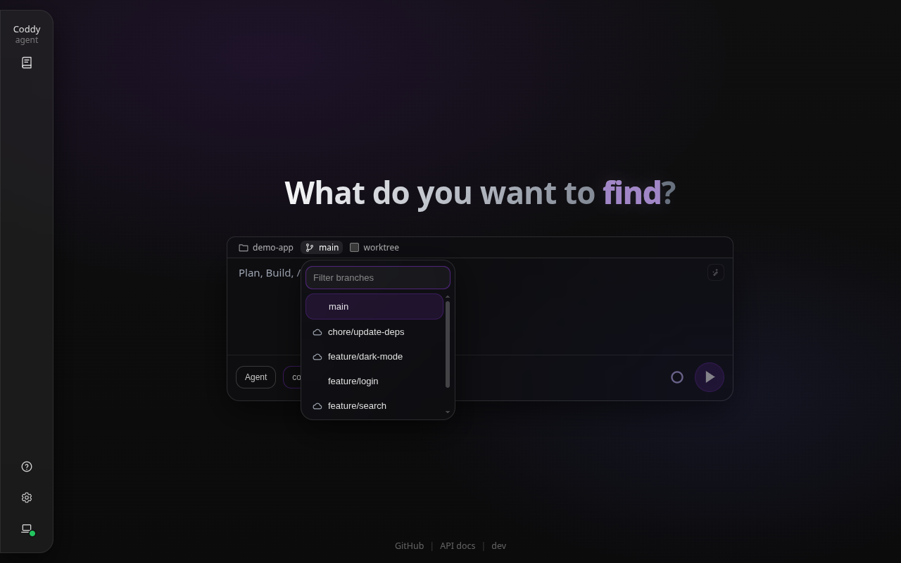

*Список веток после обновления, ветки только на удалённом репозитории отмечены облаком*

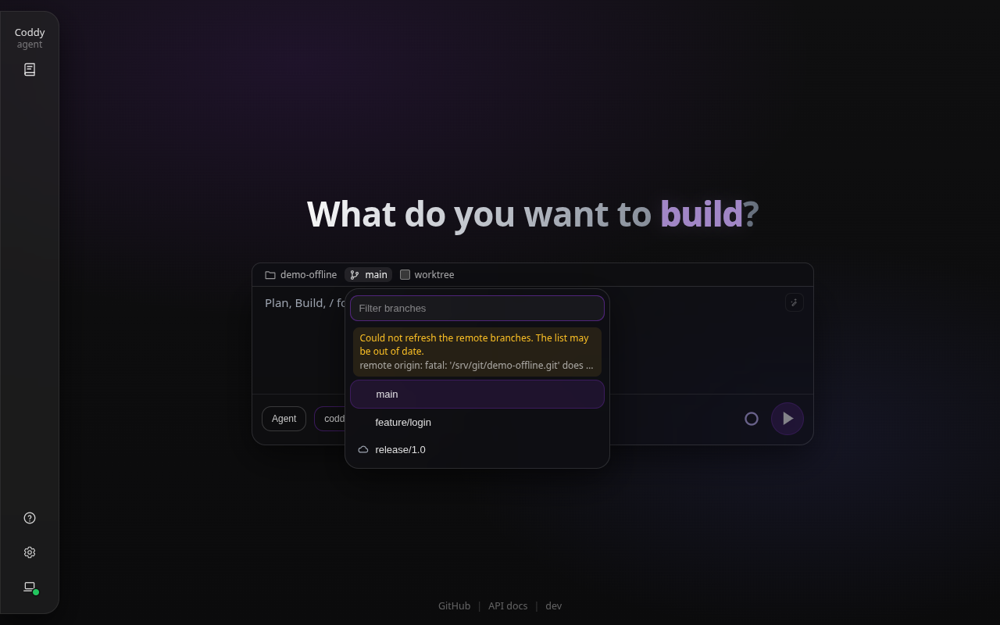

*Неудачное обновление оставляет список из кэша под предупреждением*

- **Флажок worktree** (**`composer-worktree-checkbox`**, настоящий **`input[type=checkbox]`**) задаёт предпочтение worktree; если сессия уже работает внутри связанного worktree, он показан отмеченным и неактивным;
- **Группировка по папкам в Истории** использует путь основного чекаута, который приходит как `repoRoot` в каждой строке сессии с git. Диалог в `main` и диалоги в его worktree стоят под одним заголовком проекта, при этом каждая сессия сохраняет свой рабочий каталог. См. [Git worktree](../features/worktrees.md);
- **До сессии (черновик или стартовый экран)** - выбор хранится на клиенте, предпросмотр идёт через **`GET /coddy/workspace/context?path=`**, а при первой отправке выбор применяется к новому идентификатору сессии до **`POST /v1/responses`**. При возврате из диалога проекта на стартовый экран папка этого диалога остаётся предпросмотром для следующего чата; переход на другую сессию сбрасывает ожидающий выбор;
- При ошибках (папки нет - **400**, конфликты git или заблокированная рабочая папка - **409**) текущие чипы остаются, а контекст запрашивается заново, чтобы показывать действительное состояние;
- Автоматические проверки - **`chat/workspaceContext.test.ts`**, **`chat/workspaceRecents.test.ts`** (вспомогательные функции), **`chat/WorkspaceChips.test.tsx`** (чипы, меню, обновление перед списком веток, предупреждение, удалённые строки, модальное окно, блокировка), **`App.workspaceHome.test.tsx`** (для какой папки запрашивается обновление); поведение бэкенда задано исполняемой спецификацией **`features/workspace_switching.feature`** (godog), а сам fetch - в **`internal/gitws/remotes_test.go`** (все удалённые репозитории, prune, ничего локального не тронуто, защита refspec, дедлайн, оба бэкенда git).

## Список сессий

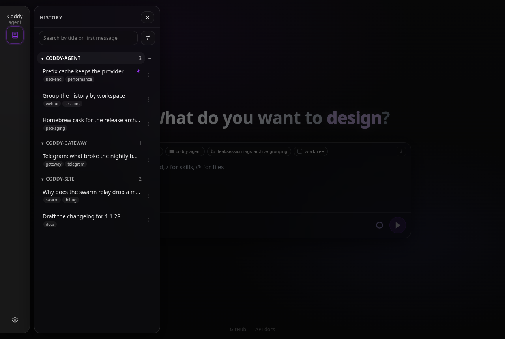

*Группировка по папкам. Заголовок - имя папки с числом строк, а при наведении он предлагает новый чат в этой рабочей папке. Первая строка закреплена*

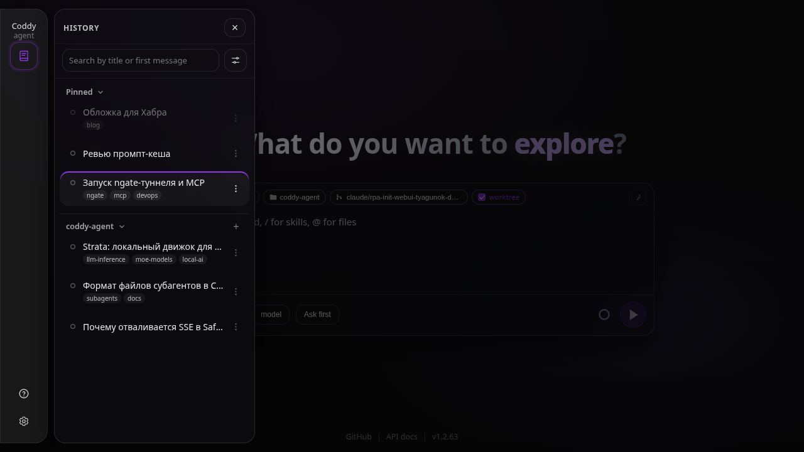

*Закреплённые диалоги в любом режиме идут первыми одной группой, а порядок задаётся перетаскиванием за саму строку; перемещаемая строка бледнеет, а та, на место которой она встанет, выделяется*

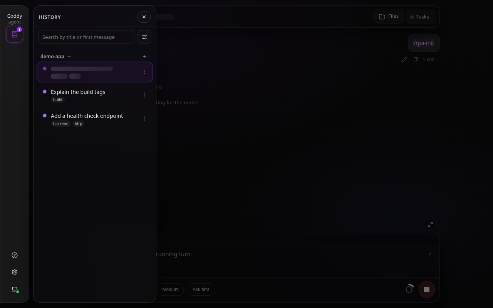

*Чат, начатый с `/rpa-init`, пока вызов describe придумывает ему название: в его строке "Истории" вместо команды стоит заглушка для названия и тегов.*

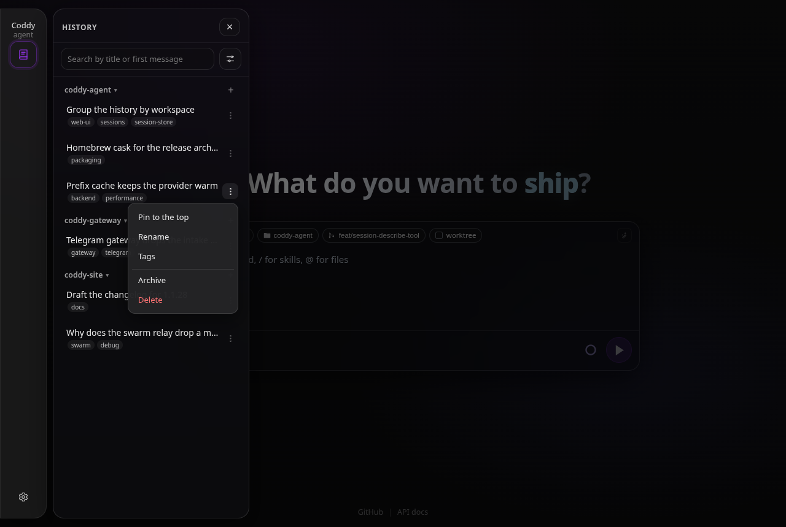

*Один элемент управления на строку. В меню закрепление, переименование и теги, затем черта и два действия, которые убирают диалог из списка, причём удаление выделено цветом опасного действия*

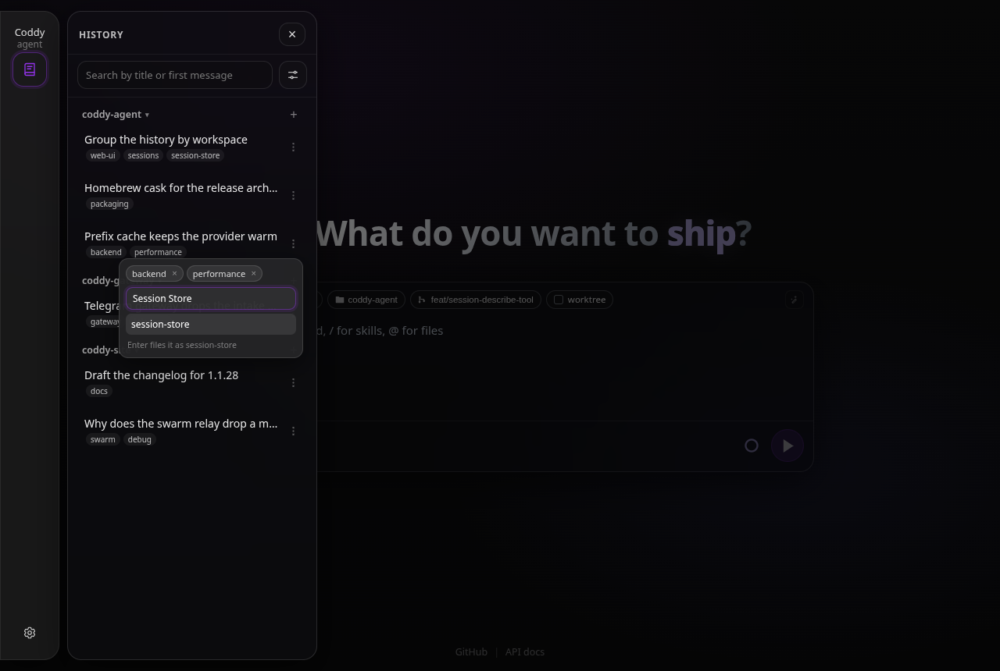

*Метки одного диалога. Крестик на каждом чипе, поле, которое предлагает слова, уже используемые в этой истории, и нормализованное написание, в котором сохранится введённая метка*

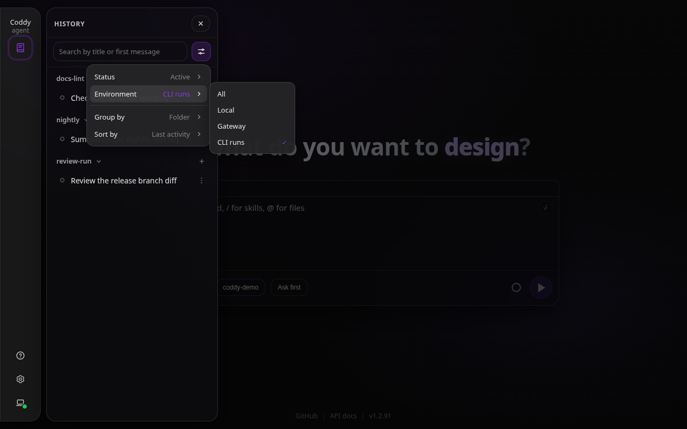

*Четыре строки, каждая называет свой вопрос и действующий ответ; цветом выделено только значение, изменённое относительно значения по умолчанию, а варианты открываются рядом со строкой. Здесь выбраны **Запуски CLI**, и в списке только запуски, которые скрипты начали через `coddy -p`*

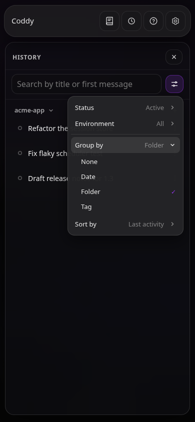

*На телефоне ни с одной стороны меню нет места для списка, поэтому варианты раскрываются под своей строкой, в пределах экрана*

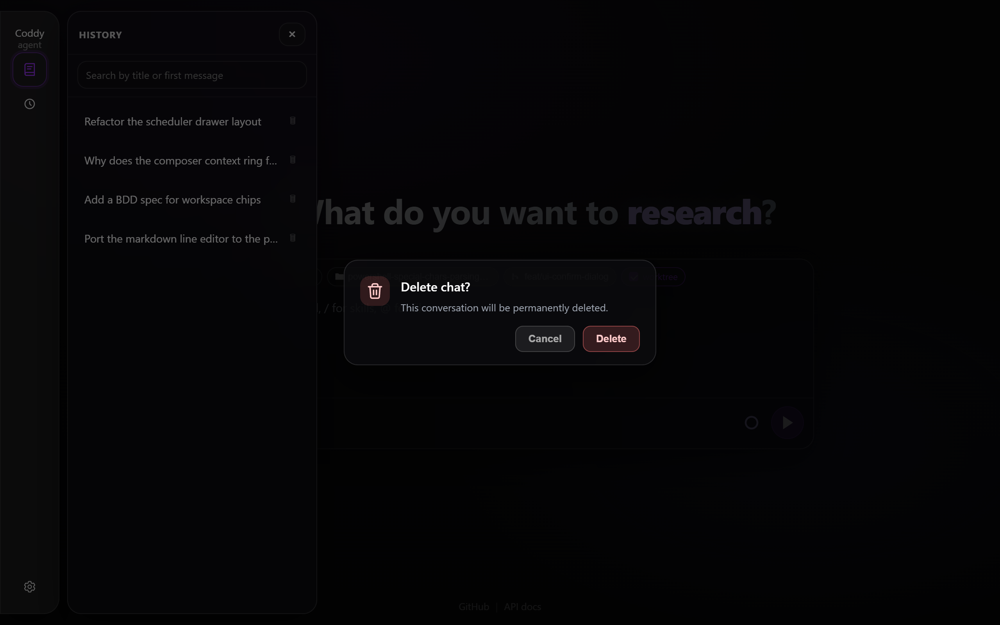

*Общий диалог подтверждения перед удалением чата*

- Панель **История** показывает сессии через `GET /coddy/sessions` (по-прежнему как **выдвижная панель**, без постоянной второй колонки);
- Постраничная загрузка использует `limit` и `cursor`, а более старые строки подгружаются **бесконечной прокруткой**;
- Необязательный параметр запроса **`q`** (**название, путь рабочей папки, тег или текст первого сообщения** с ролью **`user`**, подстрока без учёта регистра; **не** полнотекстовый поиск по всему чату). Ввод в поле поиска обрабатывается на клиенте с задержкой (debounce);
- **Всё, что определяет содержимое списка, собрано в одном элементе управления** - кнопка с ползунками в правом конце строки поиска открывает меню из четырёх строк (**`SessionsFilterMenu.tsx`**). Она стоит рядом с поиском, потому что оба сужают список ниже; в заголовке выдвижной панели осталась только кнопка закрытия. Каждая строка называет свой вопрос и действующий ответ, а её варианты открываются рядом с ней. Наведите на строку мышь, щёлкните или коснитесь её, и предыдущая свернётся; щелчок по строке, которую только что открыла мышь, оставляет её открытой. Меню отрисовывается в документе, а не внутри выдвижной панели, которая обрезает всё, что выходит за её края, поэтому подменю выходит за край панели. Список открывается с той стороны, где хватает места на всю его ширину, сначала справа, а у края окна слева; на телефоне, где места нет ни с одной стороны, варианты раскрываются под своей строкой внутри меню, и касание строки раскрывает или сворачивает её. Меню никогда не бывает шире места слева от своей кнопки, а с раскрытым списком оно прокручивается и не уходит за нижний край экрана.
  - **Статус** - **Активные** (по умолчанию), **В архиве**, **Все**, то есть параметр запроса **`archived`**. Эта строка идёт первой, потому что этот вопрос задают чаще всего;
  - **Окружение** - **Все**, **Локальные**, **Мессенджеры**, **Запуски CLI**, затем по строке на каждый настроенный удалённый сервер. Первые четыре относятся к списку того сервера, который сейчас читается (**`origin`**), и показывают соответственно все диалоги, диалоги, открытые на этом хосте, чаты, которые держит шлюз мессенджера, или запуски одноразового режима печати (**`coddy -p`**), которых нет ни в одной другой строке ([Сессии](../features/sessions.md#теги-и-архив)). Это **фильтр**, поэтому они ничего не перезагружают. Строка удалённого сервера - **переключатель**, она направляет всё приложение на этот сервер так же, как меню окружения на боковой панели, и это уже перезагрузка, при которой вместе со всем остальным меняется и фильтр по origin. Если выбирать можно только из одной строки, раздел не показывается вовсе;
  - **Группировать по** - **Без группировки**, **Дате**, **Папке** (по умолчанию, потому что диалог гораздо чаще помнят по чекауту, о котором он был, чем по дню, когда он был), **Тегу**;
  - **Сортировать по** - **Последней активности** (по умолчанию), **Дате создания**, **Названию**, то есть параметр **`sort`**, каждый вариант в направлении, естественном для своего типа значения.

  Черта отделяет первые две строки от двух последних. Первая пара решает, *что показывать*, вторая - *как это расположить*. Значение строки рисуется **акцентным** цветом, только когда оно **отличается** от значения по умолчанию (меню, где раскрашена каждая строка, ничего не говорит о том, что сужено), и каждое из четырёх значений переживает перезагрузку в своей cookie (**`coddy_sessions_group`**, **`_status`**, **`_origin`**, **`_sort`**), потому что фильтр, который забывается при следующей загрузке страницы, настройкой не назовёшь;
- **Группировка** - забота клиента (сервер отвечает плоской упорядоченной страницей, а выдвижная панель решает, где встанут заголовки), поэтому переключение не стоит запроса и никогда не меняет порядок, который сервер задал внутри группы. Заголовок - это имя группы с шевроном после него, и щелчок по имени сворачивает группу; пустая группа не рисуется, а сессия с тремя тегами показывается под всеми тремя.
  - Группировка по **Дате** раскладывает сессии по локальным календарным дням - **Сегодня**, **Вчера**, **Предыдущие 7 дней**, **Предыдущие 30 дней**, **Раньше** и последней **Без даты** для бандла без отметки времени.
  Только заголовок группы по **Папке** несёт **+**, потому что дата или тег - не место, куда можно положить сессию;

  - Группировка по **Папке** использует полный путь как ключ и показывает имя папки, поэтому два чекаута с именем `one` не смешиваются, а если одно имя действительно стоит у нескольких заголовков, под каждым выписан полный путь, потому что по одному имени их не различить. Сессии без рабочей папки идут последними. Заголовок папки также несёт **+**, который начинает новый чат, уже направленный на эту рабочую папку; выбор проходит тот же путь до сессии, что и чип папки в поле ввода, поэтому сервер определяет для нового диалога текущую ветку git этой папки;
  - Группировка по **Тегу** ставит сессии без тегов последними;
- **Всё, что можно сделать с одним диалогом, спрятано за его ⋮** - **Закрепить сверху**, **Переименовать** и **Теги** (три действия, которые меняют место строки или то, что она говорит о себе), затем под чертой **Заархивировать** и **Удалить**, два действия, которые убирают диалог из списка, причём удаление выделено цветом опасного действия. Иконка на каждое действие отнимала у названия по ширине кнопки и ставила удаление на расстояние одного промаха; внутри меню у действий есть место для слов. Одновременно открыто только одно меню, **Escape** закрывает его, а через портал оно выносится из выдвижной панели, чтобы его не обрезал край (у нижнего края окна оно открывается над строкой);
- **Закреплённые диалоги - одна группа наверху** с заголовком **Закреплённые**, отделённая чертой, в любом режиме группировки. Оператор ведёт этот единый список вручную, и он не проходит полосой через все группы, ведь один и тот же диалог наверху *и* внутри своей папки поставил бы вопрос, какую из копий двигает перетаскивание;
- **Порядок закреплённых меняется перетаскиванием самой строки** - мышью нажмите на строку и сдвиньте её (обычный щелчок по-прежнему открывает диалог); пальцем удерживайте строку мгновение, затем тяните (быстрый свайп по-прежнему прокручивает список). Перетаскивание работает на **pointer events** (HTML5 drag-and-drop никогда не начинается с касания), и список показывает, куда встанет строка, вместо строки, которая следует за указателем; такой показ переживает прокрутку и не требует слоя композитинга. Новый порядок записывается через **`POST /coddy/sessions/pins/reorder`**, который принимает **весь** порядок, а новое закрепление встаёт **над** уже существующими. На клиенте строка не двигается, порядок задаёт ответ сервера, поэтому после изменения список перечитывается;
- **Заархивированный диалог приглушён в списке, и писать в него нельзя** - его строка бледнее, а при открытии вместо поля ввода показывается уведомление, что диалог в архиве, и одна кнопка, которая достаёт его оттуда. Сервер ничего не запрещает (архив - полка, замка на нём нет), но оставленное поле ввода приглашало бы написать промпт, который молча отменит собственное *не сейчас* оператора. Поле ввода узнаёт об архиве из **`GET /coddy/sessions/{id}/messages`**, где есть **`archived`**, потому что список сессий пропускает архив, и диалога на экране может не быть ни на одной странице, которая есть у клиента;
- **Архивирование** убирает диалог из рабочего списка, не удаляя его (**`PATCH`** с **`archived`**). Строка сразу уходит из списка, запрос идёт следом, а список не перечитывается, поэтому подгруженные прокруткой строки и место в списке остаются как были, и следующий диалог для архивирования уже под рукой. Если запрос отклонён, строка возвращается на прежнее место, и это сообщается на самой строке (*Диалог не заархивирован*), потому что верх списка, где показываются ошибки списка, к этому времени обычно не виден; заметка исчезает, когда вы пробуете снова или закрываете **Историю**. Список, который уже был в пути, когда запрос завершился, не может вернуть строку, а следующая страница начинается на одну строку раньше за каждый диалог, заархивированный из загруженной части, поэтому ни один не проваливается между двумя страницами. У заархивированной строки рядом с названием стоит **отметка** архива (это состояние диалога, а не одна из его меток-тегов), и тот же пункт меню возвращает диалог из архива. Архивирование диалога, открытого на экране, сразу заменяет поле ввода тем же уведомлением об архиве, а возврат из архива возвращает поле ввода; флаг следует за ответом на **`PATCH`** и не ждёт следующей загрузки транскрипта. Фильтр **Статус** помнит своё значение, поэтому отложенная сессия не мешает, пока оператор сам её не попросит;
- **Теги** строки показываются под её названием маленькими чипами (первая строка целиком отдана названию). Их предлагает генерация названия, вручную их правят в редакторе **Теги** из меню строки, а модель записывает их сама инструментом `session_describe` ([Сессии](../features/sessions.md#теги-и-архив));
- **Чат, которому придумывается название** (вызов `POST /coddy/describe` для первого сообщения нового чата), показывает мерцающую полосу на месте названия в своей строке **Истории** и в заголовке чата и две короткие полосы на месте тегов, а не первое сообщение (токен `/rpa-init`) или *Новый чат*. Название и теги встают на место, как только вызов отвечает; пустой ответ, ошибка или 30 секунд без ответа тоже убирают заглушку, а название, пришедшее позже, всё равно встаёт на место. При `prefers-reduced-motion` полосы не мерцают. Первое сообщение, которое запускает команду, получает название по тому, что эта команда делает ([Сессии](../features/sessions.md#теги-и-архив));
- **Редактор тегов - один компонент в обоих местах, где показываются теги** (**`SessionTagEditor.tsx`**). В нём крестик на каждом чипе, поле, которое предлагает метки, уже используемые в этой истории (сначала самые частые, собственные метки диалога исключены, совпадения по префиксу впереди), **Enter**, чтобы добавить введённое, стрелки и **Enter**, чтобы взять подсказку, **Backspace** в пустом поле, чтобы убрать последний чип, и **Escape**, чтобы закрыть. Кнопки сохранения нет, каждое изменение сразу уходит как **`PATCH`**. Строка принимает новый набор **до** запроса, поэтому второе действие, сделанное, пока первый запрос ещё в пути, опирается на него и не отменяет его; затем набор заменяется ответом сервера (приведённым к нижнему регистру, с дефисами вместо пробелов, не больше восьми меток), поэтому чип никогда не меняет написание при следующем обновлении, а отклонённая запись возвращает то, что было у строки. Нормализованная форма набираемого текста показывается под полем, только когда отличается от введённой;
- Индикаторы:
  - Пульсирующая точка (фиолетовая точка непрочитанного, на треть темнее) появляется на каждой строке, чей ход ещё идёт, включая открытый диалог. Она появляется и на строке, где **фоновые задачи ещё выполняются, а хода нет**, потому что отсоединённая работа переживает запустивший её ход, и строка без отметки выглядела бы завершённой; подсказка точки говорит, какой из двух случаев это. Счётчик - **`backgroundRunning`** из списка сессий (собственные задачи модели, без завершённых и без системных поручений), а список перечитывается по событиям ходов и при опросе выдвижной панели, поэтому задача, которая начинается или заканчивается **вне** хода, сдвигает точку при следующем опросе, а не сразу. Ход, ожидающий разрешения или ответа на вопрос, вместо этого показывает свою отметку;
  - У каждой строки, которая в остальном простаивает, есть прозрачное кольцо-контур, чтобы её название не сливалось с заголовком группы. Фиолетовая точка заменяет кольцо, только если сессия завершилась, когда не была активным чатом;
  - Ход, закончившийся настоящей ошибкой, записывает **`lastErrorSeq`**. Если её поколение новее курсора прочтения сессии, **История** показывает закрашенную красную точку; открытие сессии подтверждает ошибку и меняет отметку на красный контур. Контур остаётся, пока более поздний успешный ход не сбросит состояние ошибки. И непросмотренная ошибка, и её подтверждённый контур важнее обычной фиолетовой точки непрочитанного завершения;
  - Иконка вопросительного знака появляется, когда сессия ждёт разрешения пользователя или ответа на интерактивный вопрос. Она не анимируется, потому что ход стоит на паузе в ожидании человека и не продвигается. Событие ожидающего вопроса заставляет **Историю** сразу перечитать список сессий; глобальное событие никогда не несёт текст вопроса, он остаётся в потоке поля ввода.

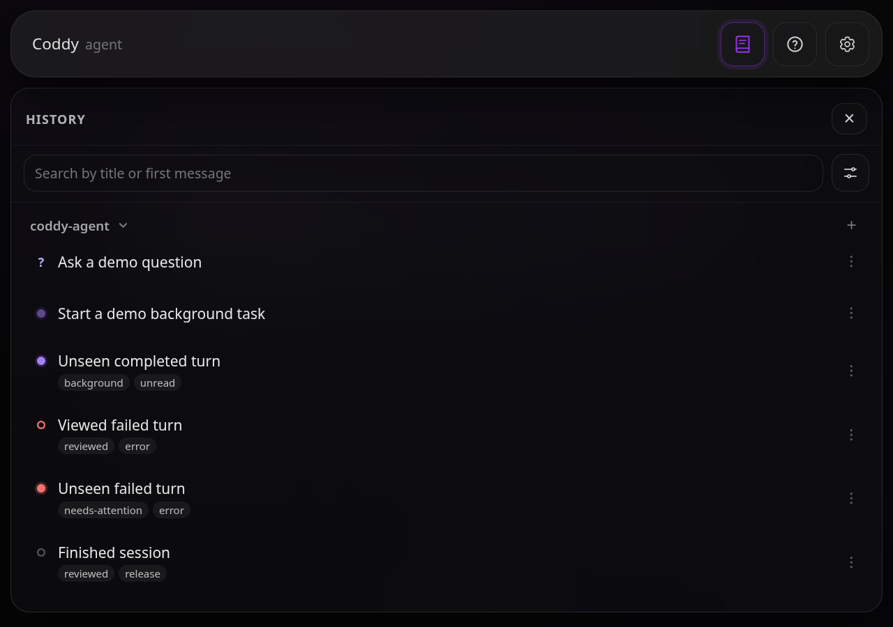

*Группы Истории дают каждой строке визуальную опору. У завершённой сессии нейтральный контур, у непросмотренного неудачного хода закрашенная красная точка, у просмотренной ошибки красный контур.*
- CRUD:
  - переименование через `PATCH /coddy/sessions/{id}` с полем `title`;
  - удаление через `DELETE /coddy/sessions/{id}`;
  - создание нового чата начинается на стартовом экране, а идентификатор сессии появляется только при первой отправке.

Переименование сессии

- Название меняют в заголовке чата или через **Переименовать** в меню **⋮** строки, которое превращает название строки в поле с выделенным именем;
- При потере фокуса интерфейс сохраняет название через `PATCH /coddy/sessions/{id}`; **Enter** сохраняет, **Escape** оставляет название как было.

Удаление сессии

- Удаление - пункт меню **⋮** строки, отделённый от остальных и выделенный цветом опасного действия;
- Щелчок по удалению показывает один диалог подтверждения и затем вызывает `DELETE /coddy/sessions/{id}`. Здесь диалог открывается с фокусом на **Удалить**, поэтому **Enter** завершает то, что начал щелчок, ведь **Удалить** в меню строки делает одно действие, и диалог спрашивает именно о нём. Во всех остальных местах общий диалог по-прежнему открывается с фокусом на **Отмена**, потому что там случайный Enter не должен подтвердить то, чего никто не хотел (**`initialFocus`** в **`confirm({...})`**);
- Если удалённая сессия **не** та, что сейчас показана в основном чате, уберите её из списка (и обновите список с сервера) и **оставьте выдвижную панель История открытой**. Не меняйте URL и не очищайте транскрипт сессии, которая осталась на экране;
- Если удалённая сессия **и есть** та, что сейчас показана, перейдите в **новый чат** (пустой стартовый экран, хеш сессии очищен), **закройте** выдвижную панель **История** и очистите состояние поля ввода так же, как при обычном переходе на стартовый экран;
- Удалять несколько диалогов сразу и смотреть, во что обошёлся каждый, можно в **Настройки → Сессии** (ниже). **История** остаётся местом, где сессию *открывают*.

## Управление сессиями в настройках

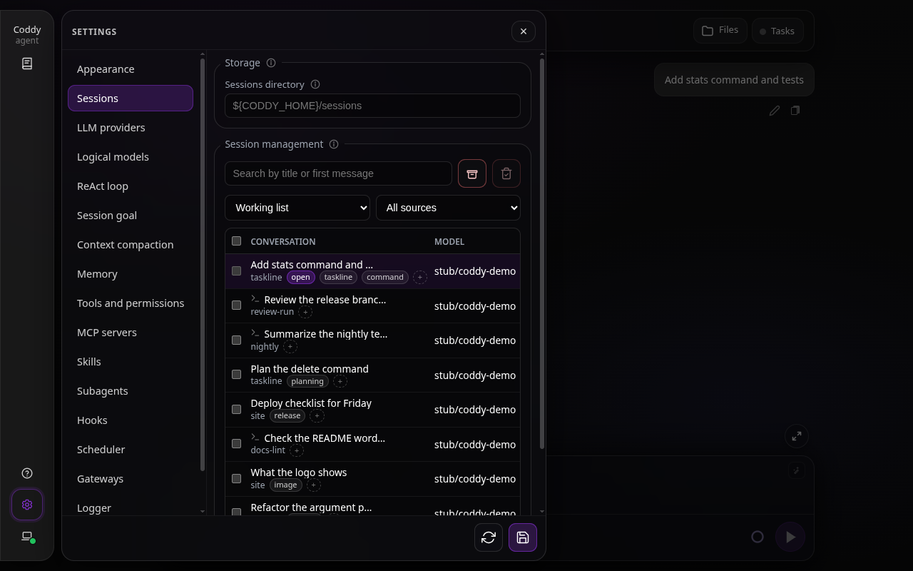

*Всё сохранённое, включая архив и запуски режима печати. Строка говорит, где лежит диалог и под какими тегами он записан, значок терминала стоит перед названием запуска, начатого через `coddy -p`, **+** после тегов открывает тот же редактор, что и в Истории, два списка под поиском сужают таблицу по архиву и источнику, столбцы сортируют весь список, а две иконки рядом с поиском - единственные опасные элементы управления*

**Настройки → Сессии** (**`#/settings/sessions_manager`**, **`SessionsManager.tsx`**, чистые вспомогательные функции в **`sessions/sessionManagerRows.ts`**) показывают сохранённую историю таблицей, а не списком для прокрутки, в группе полей **Управление сессиями**, чей значок (i) объясняет, для чего нужна таблица. Это клиентская вкладка, как **Оформление**. Таблица читает и удаляет бандлы сессий через **`/coddy/sessions`**, поэтому отрисовывается ещё до загрузки схемы конфигурации. Её идентификатор - **`sessions_manager`**, потому что **`sessions`** уже занят ключом конфигурации, каталогом хранения, который эта вкладка правит над таблицей (**Хранилище**), как только схема загрузится, и который сохраняется кнопкой **Сохранить все разделы**.

- **Строки** приходят из **`GET /coddy/sessions?include_stats=true&include_print=true`** по 50 за раз, с кнопкой **Показать ещё**. Каждая показывает название с **рабочей папкой** под ним, **модель**, которую сессия переопределила (**`default`**, если не переопределяла, то есть то, что было в **`agent.model`** в то время), **число сообщений**, **всего токенов** (ввод и вывод в подсказке ячейки) и даты **создания** / **изменения** (точный момент в подсказке). Бандл, сохранённый до того, как Coddy начал записывать отметку создания, показывает прочерк, а не дату, придуманную по более позднему сохранению;
- **Поиск** - тот же фильтр **`q`**, что и в выдвижной панели **История** (название, рабочая папка, тег или первое сообщение пользователя, без учёта регистра), с задержкой во время набора;
- **Сортировка** задаётся заголовками столбцов. **Диалог** (название), **Сообщ.**, **Токены**, **Создан** и **Изменён** - кнопки, а у столбца, по которому идёт сортировка, есть шеврон и **`aria-sort`**. Щелчок по уже отсортированному столбцу меняет направление; другой столбец начинает с естественного для своего типа значения, дата или число - с наибольшего, название - с первой буквы. Порядок уходит на сервер (**`sort`** и **`order`**) и применяется ко **всему отфильтрованному списку до разбиения на страницы**, поэтому **Показать ещё** продолжает отсортированный результат и не пересортировывает страницу;
- **Архив** - выпадающий список рядом с поиском, в нём **Рабочий список** (по умолчанию), **Архив** и **Всё**. Заархивированная строка несёт нейтральную метку **в архиве**, подсказка которой говорит, когда диалог отложили. Диалоги архивируются из **Истории**, а не здесь; на этой вкладке смотрят, что лежит в архиве, и очищают его;
- **Источник** - второй выпадающий список, в нём **Все источники** (по умолчанию), **Локальные**, **Мессенджеры** и **Запуски CLI** (**`origin`**). В отличие от Истории, таблица выводит запуски одноразового режима печати (**`coddy -p`**) вместе с остальными, потому что именно здесь их чистят, и у такой строки перед названием стоит значок терминала с подсказкой **запуск CLI** ([Сессии](../features/sessions.md#теги-и-архив)). Обе области удаления тоже их затрагивают;
- **Удаление работает в двух областях, и только в них** - иконка корзины рядом с полем поиска удаляет **отмеченные** строки (**`POST /coddy/sessions/bulk-delete`** с их идентификаторами), а иконка архивной коробки рядом с ней очищает **архив** (**`scope: "archived"`**, открытый диалог указан в **`except`**, чтобы описанная ниже защита действовала даже для области, которую определяет сервер); оба действия идут через общий диалог подтверждения. Что делает каждая иконка, говорят её **подсказка** и доступное имя, надписи на ней нет; единственный нарисованный текст - метка **числа выбранных** на первой иконке, потому что подсказка не покажет его с одного взгляда. Отмеченные строки оператор видит сам, а архив - область, которую определяет сервер, потому что в архиве может быть больше, чем на странице, и подтверждение говорит об этом словами. Третьей кнопки, которая дотягивается дальше любой из двух, нет;
- **Теги** показываются под названием чипами. Щелчок по тегу сужает таблицу до диалогов с этим тегом (**`tags`**), а строка под панелью инструментов говорит, какой тег показан, и содержит ссылку, которая его сбрасывает;
- У строки **нет собственного удаления** - галочка и та единственная кнопка составляют всё, чем можно действовать на строку, поэтому область опасного щелчка всегда однозначна;
- **Очистить страницу** можно флажком в заголовке и той же единственной кнопкой. Если строк больше, чем помещается на странице, сначала нажмите **Показать ещё**; итоговая строка под таблицей говорит, сколько строк показано и сколько отмечено;
- **Открытый у вас диалог защищён** от любого удаления здесь, включая очистку архива. Его строка подсвечена и помечена как **открыт**, его флажок неактивен, а подсказка объясняет почему, флажок в заголовке его пропускает, а очистка архива щадит его по имени, даже если заархивирован именно он. Таблица не может выдернуть чат у вас из-под рук; сначала закройте его или переключитесь на другой диалог, затем удалите его из **Истории**;
- **Выбор следует за тем, что показывает таблица** - флажок в заголовке отмечает отрисованные строки и снимает с них отметку, а поиск, скрывший отмеченную строку, забирает с собой и её отметку (после сброса поиска строка возвращается неотмеченной). Опасное действие никогда не достаёт до строки за пределами экрана, и отметка не может позже появиться снова оттого, что незаметно сохранилась;
- Сессия, которую не удалось удалить (в её дереве ещё шёл ход), **указывается** под панелью инструментов с причиной, а её строка остаётся. Остальные всё равно удалены, ведь запрос отвечает отдельно **`deleted`** и **`failed`**;
- Список **перечитывается после каждого удаления**, страница не перезагружается. Если диалог на экране за панелью был среди удалённых, чат сбрасывается на новый, а **Настройки** остаются открытыми на этой вкладке;
- Таблица - единственный элемент вкладки с горизонтальной прокруткой, поэтому в узкой оболочке прокручиваются столбцы, а не страница.

## Серверные события, общие для вкладок

Каждой вкладке нужен **`GET /coddy/events`**, потому что туда приходят начала и концы ходов, изменения очереди, расход аккаунта, переходы ожидания вопроса и перезагрузки конфигурации. Уведомление `session_question_pending` на обоих краях жизненного цикла несёт только `{object, sessionId}`. Уведомление и `questionPending` локальны для того процесса сервера Coddy, которому принадлежит интерактивное ожидание; SPA перечитывает строки сессий, чтобы получить `questionPending`, а текст вопроса остаётся в потоке поля ввода конкретного хода. По обычному HTTP/1.1 браузер держит шесть соединений с одним хостом на все свои вкладки, поэтому, когда у каждой вкладки был свой поток, шесть открытых вкладок занимали все соединения, и ни одна вкладка не могла отправить ни одного запроса, ни промпта, ни остановки, ни чтения истории. Теперь вкладки одного окружения делят одно соединение.

- **SharedWorker** - если он есть в браузере (настольные Chrome, Edge, Firefox и Safari 16+, как по http, так и по https), соединение держит **`events-worker.js`**. Каждая вкладка подключает порт и здоровается; первое приветствие открывает поток, уход последней вкладки закрывает его. Удалённое окружение передаёт в приветствии свой адрес и bearer-токен, потому что fetch-прослойка страницы не дотягивается до воркера;
- **Web Locks и BroadcastChannel** - если SharedWorker нет, вкладки выбирают одну из своих через **`navigator.locks`**; вкладка, держащая блокировку, держит поток и пересылает его по **`BroadcastChannel`**. Когда эта вкладка закрывается, следующая в очереди берёт блокировку и сообщает, что поток упал, пока не поднимет собственное соединение. Web Locks есть только в защищённых контекстах (https, **`localhost`**, **`127.0.0.1`**);
- **Поток на каждую вкладку** - если нет ни того, ни другого или если воркер не загрузился или не ответил за пять секунд, вкладка держит собственное соединение, как раньше делала каждая вкладка. Только в этом случае много открытых вкладок по-прежнему могут занять все шесть соединений, то есть при обычном http по сетевому адресу в браузере без SharedWorker;
- **Область** - вкладки делят соединение только в пределах одного окружения. Воркер, блокировка и канал названы по локальному серверу или по адресу удалённого сервера и отпечатку его токена (никогда не по самому токену), плюс номер протокола, чтобы вкладки разных сборок никогда не встречались;
- **Что слышит вкладка** - то же, что дало бы ей собственное соединение, то есть состояние подключения, по одному **`turn_started`** на каждый идущий ход, **`ready`**, а затем живые события. Вкладка, которая присоединяется к уже поднятому потоку, получает идущие ходы и **`ready`**, адресованные только ей, потому что **`ready`** заставляет вкладку сверить свои сессии и отказаться от ожидающей остановки, а другим вкладкам сверять нечего. Ответ 401, полученный воркером или выбранной вкладкой, передаётся дальше, поэтому каждая вкладка возвращается на экран входа;
- **Код** - **`chat/sharedServerEvents.ts`** выбирает транспорт, **`chat/serverEventsHub.ts`** владеет соединением и принимает события в каждой вкладке, **`chat/eventsWorker.ts`** вместе с **`chat/eventsWorkerHost.ts`** составляют воркер, а **`chat/serverEvents.ts`** разбирает поток. Vite выпускает воркер как **`events-worker.js`** рядом с **`app.js`**, и бинарник встраивает его вместе с остальной оболочкой. Тесты - **`chat/sharedServerEvents.test.ts`** и сценарий с тремя вкладками в **`App.stopQueue.test.tsx`**.

## Транспорт чата

- Основной транспорт - `POST /v1/responses`;
- `stream: true` использует SSE.

Выбор режима

- Интерфейс даёт пользователю выбрать режим из `GET /v1/models` (как минимум `agent`, `plan` и `ask`);
- Выбранный режим отправляется в поле `model` запроса `POST /v1/responses`.

Содержимое SSE

- Обычные строки SSE передают дельты в стиле OpenAI;
- Именованные события SSE:
  - `tool_call`;
  - `tool_call_update`;
  - `plan`;
  - `token_usage`;
  - `usage_update` (`used` / `size` для контекста текущей модели; отправляется повторно после сжатия контекста);
  - по умолчанию (без `event:`) - дельты чанков chat completion, включая `delta.content` и необязательный `delta.reasoning_content`.

## Длинные сессии

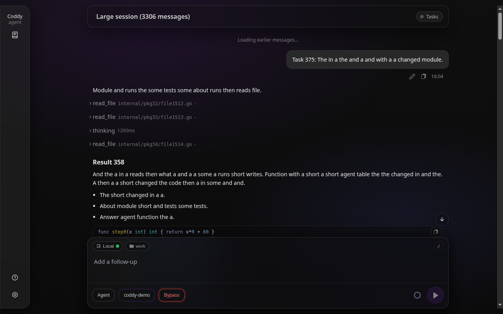

*Верх длинного транскрипта, пока загружается страница над ним, тёмная тема, 1280 px*

Сессия может разрастись до тысяч сообщений, и раньше веб-интерфейс читал, обрабатывал и отрисовывал их все, прежде чем что-то показать. Сессия из 3306 сообщений открывалась 7,5 с при задаче длиной 5 секунд на десктопе и 41 с при задаче длиной 32 секунды на процессоре, замедленном в шесть раз (старый телефон из issue #338), а на странице было 94 тысячи элементов. Теперь веб-интерфейс держит скользящее окно поверх диалога.

- **Сначала самая новая страница.** При открытии диалога читается `GET /coddy/sessions/{id}/messages?limit=60` (страница примерно из шестидесяти сообщений, которая начинается с промпта своего хода) и превью вызовов инструментов только этой страницы (`GET .../tool-calls?from=&to=`). Короткая сессия приходит целиком за одно чтение. Поле `window` ответа говорит, где находится страница, и строки нумеруются от него, поэтому идентификаторы и индексы правок такие же, как при чтении целиком ([HTTP API](../reference/http-api.md));
- **На экране ограниченный срез.** Транскрипт отрисовывает последние строки из того, что держит, и за каждый кадр добавляет несколько строк в сторону края, к которому приближается читатель, поэтому ни один кадр не раскладывает длинный кусок разом. Строки, ушедшие с другой стороны дальше чем на экран, отбрасываются, когда их становится больше примерно 130. Исключения - строка, в которой читатель печатает, и самые новые строки, пока в них запрос разрешения или вопрос ждёт ответа; они сохраняют выбранные варианты и набранный текст, как бы высоко читатель ни ушёл. Строка под читателем остаётся на месте, потому что окно само исправляет позицию прокрутки после каждого изменения выше видимой области, ведь WebKit не привязывает прокрутку. Пока самая новая строка отрисована, окно следует за новым выводом; кнопка прокрутки вниз возвращает окно, оставленное далеко вверху, к самым новым строкам, и оно сразу оказывается там;
- **Старые страницы по пути вверх.** У верхнего края того, что держит окно, читается страница выше (`?limit=80&before=<the first message held>`) и ставится впереди. Элемент вверху транскрипта обозначает то, что выше. Это **Показать более ранние сообщения** (кнопка для клавиатуры, прокрутка до неё делает то же самое), **Загружаю более ранние сообщения…**, пока страница читается, и **Повторить** после неудачного чтения, которое не повторяется, пока кнопку не нажмут;
- **Отпустить у самого нового сообщения.** Как только читатель вернулся к самому новому сообщению и в сессии ничего не выполняется (нет хода, не отправляется ответ, не ждёт запрос), старые страницы, прочитанные по пути вверх, отбрасываются, а окно, выросшее за много ходов, начинается заново с самой новой страницы. То же происходит в конце хода для читателя у самого нового сообщения или для сессии в фоне, потому что сессия, которая выполняет ход за ходом, никогда долго не простаивает. Отбрасывается то, что далеко выше экрана, а экран остаётся на самом новом сообщении;
- **Перезагрузки читают окно, а не историю.** Конец хода, ответ на запрос разрешения или релей, пропустивший кадры, перечитывают живое окно с его первого сообщения (`?from=`), а старые страницы в этом не участвуют. Если история обрезана под окном (откат с другого интерфейса, о котором сообщает `session_rewound`, или история, оказавшаяся короче окна), окно начинается заново с самой новой страницы;
- **Правка откатывает нужный промпт.** Карандаш на промпте передаёт индекс, под которым его знает сервер, то есть число промптов до окна (`window.turnsBefore`) плюс его позицию среди промптов в окне;
- **Несколько браузеров, вкладок и интерфейсов.** Каждая вкладка держит своё окно, а сервер не хранит о нём никакого состояния, поэтому одна сессия может быть открыта сразу в нескольких браузерах, вкладках и консолях. Ход, запущенный другой вкладкой, как и раньше транслируется в эту; читатель, ушедший глубоко в историю, сохраняет своё место, пока ход идёт, а потом находит его у самого нового сообщения. Консоль и клиенты `--remote` читают историю без окна и получают её целиком, как и всегда;
- **Через релей роя.** Каждое чтение передаёт свою страницу в строке запроса, которую точка монтирования релея пересылает узлу без изменений, в том числе через туннель ([Рой](../operate/swarm.md));
- **Чем за это платим.** Поиск по странице видит только отрисованные строки. Карточка инструмента, которую открыли, а затем прокрутили далеко за пределы окна, оказывается закрытой, когда снова попадает в него (документ плана сохраняет своё состояние). Сервер, выпущенный до появления постраничного чтения, отвечает всей историей, и веб-интерфейс держит её как одну страницу.

На той же сессии из 3306 сообщений при замедлении процессора x6 и размере экрана телефона самое новое сообщение теперь появляется за 2,8 с, включая загрузку страницы, самая длинная задача занимает 0,9 с, а на странице около 600 элементов и 6 МБ кучи; при быстрой прокрутке вверх через всю историю половина кадров укладывается в 50 мс. Это измеряет **`npm run check:transcript`** (см. **Проверка длинного транскрипта** ниже).

## Переход к концу транскрипта

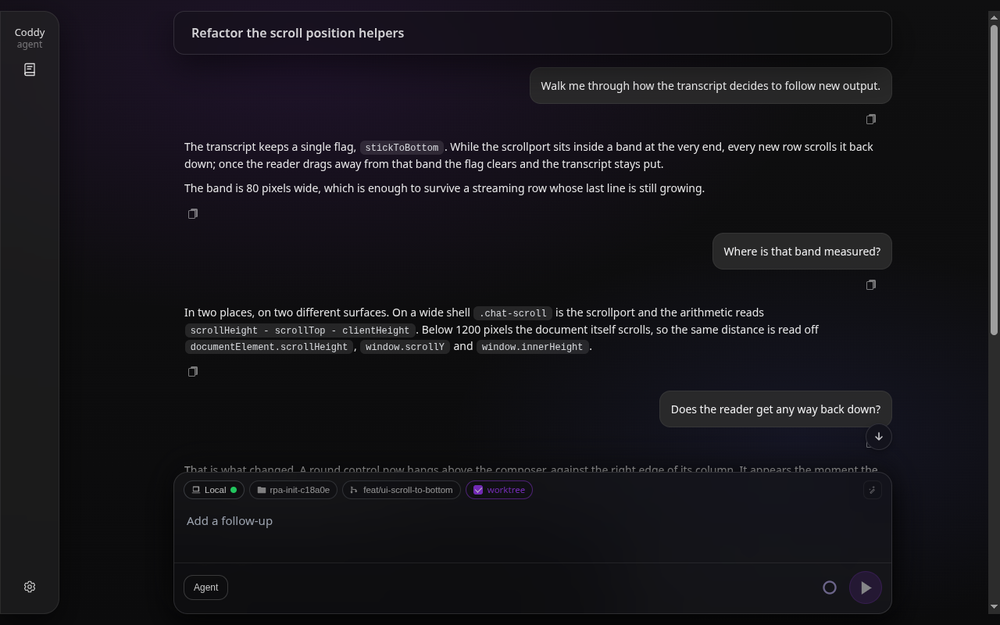

*Кнопка перехода к последнему сообщению над полем ввода, тёмная тема, 1280 px*

Если прокрутить длинный чат вверх, новые сообщения уходят за пределы экрана, и вернуться вниз можно только перетаскиванием полосы прокрутки. Круглая кнопка над полем ввода делает это одним нажатием.

- **Когда она видна** - транскрипт следует за новым выводом, пока область прокрутки находится не дальше `TRANSCRIPT_BOTTOM_THRESHOLD_PX` (**80px**) от конца. Кнопка появляется ровно тогда, когда это условие перестаёт выполняться, и исчезает, когда оно выполняется снова, поэтому если кнопка видна, значит, ниже края экрана в транскрипте что-то есть. Она плавно появляется и исчезает на одном смонтированном узле (**~0,14 с** на появление, **0,12 с** на исчезновение); скрытая кнопка получает `inert` и выпадает из порядка табуляции;
- **Где она стоит** - в собственной колонке поля ввода (`.chat-bottom-inner`), у её правого края, на `10px` выше закреплённого блока; в чате она стоит над кнопкой развёртывания поля, обе на расстоянии 10px друг от друга и по центру вертикальной линии палочки улучшения промпта. Это одни и те же координаты для любой раскладки - абсолютно позиционированного дока на десктопе, поля ввода с `position: fixed` при ширине меньше `1200px` и отступа, который резервирует панель фоновых задач;
- **Переход** длится **220-460 мс** в зависимости от расстояния и идёт по кривой с замедлением в конце - быстро трогается и мягко доходит до последних пикселей вместо резкой остановки. Анимация считается покадрово (`transcriptJumpDurationMs` / `easeTranscriptJump` в `chat/transcriptScrollPosition.ts`) и не отдаётся `scrollTo({ behavior: "smooth" })`, поэтому ощущается одинаково во всех движках. По прибытии следование за выводом включается снова, и остаток хода опять прокручивается сам;
- **Потоковый вывод, когда читатель прокрутил вверх** - позиция не сдвигается, и кнопка остаётся, потому что расстояние до конца только растёт. Переход, начатый посреди хода, перечитывает положение конца на каждом кадре и попадает на самое новое сообщение, а не туда, где транскрипт заканчивался в момент нажатия;
- **Последнее слово за читателем** - колесо мыши, палец или нажатие на полосу прокрутки останавливают движение на месте и сразу возвращают кнопку, если до конца не дошли;
- **Только вниз** - кнопка никогда не прокручивает чат вверх. На телефоне конец отсчитывается от того, что видно над экранной клавиатурой, а там, где клавиатура перекрывает страницу, а не сжимает её (iOS Safari), поле ввода и кнопка поднимаются над ней; раньше кнопка оставалась там под клавиатурой и сдвигала страницу вверх на высоту клавиатуры;
- **Обе прокручиваемые области** - широкая раскладка прокручивает `.chat-scroll`, узкая прокручивает документ; один и тот же модуль считывает расстояние и позицию конца для обеих, и одно измерение управляет флагом следования, кнопкой и переходом;
- **`prefers-reduced-motion: reduce`** переводит транскрипт в конец за один шаг и отключает плавное появление кнопки;
- **Доступное имя и подсказка** кнопки задаются одним ключом `chat.scrollToBottom`; на пустом стартовом экране кнопки нет;
- **Открытие другого диалога** приводит к его последнему сообщению, где бы ни остался предыдущий. Выбор в истории, ссылка на `#/s/<id>` или кнопка "Назад" после чтения далеко вверх в одном чате больше не открывают следующий чат на старом смещении (issue #342). При смене id сессии незавершённый переход отменяется, а следование за выводом включается снова, ещё до прихода новых строк.

## Длинные промпты в поле ввода

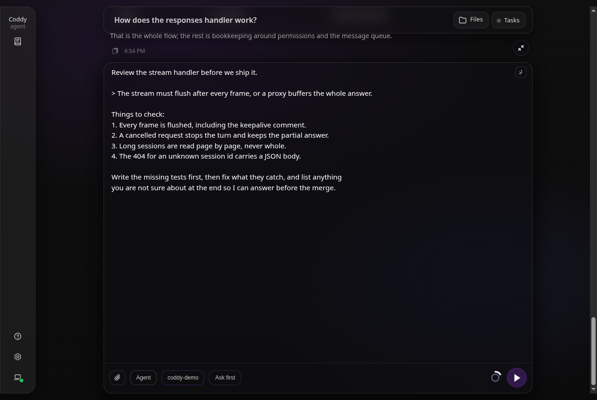

*Закреплённое поле ввода, развёрнутое поверх чата для длинного промпта, его кнопка на один шаг ниже заголовка, тёмная тема, 1280 px*

Поле ввода подстраивается под свой текст (issue #342). Оно начинается с прежней высоты - пять строк на стартовом экране, две строки и минимум 76px в чате - и растёт построчно до **восьми строк** или до **40%** видимой области окна, если это меньше (телефон с открытой клавиатурой), а дальше прокручивается. Если удалить текст, поле снова уменьшается; при сужении окна, открытии клавиатуры и масштабировании страницы его размер подгоняется заново. Правило задано в **`chat/composerHeight.ts`**, применяет его **`chat/useComposerFieldHeight.ts`**.

- **Развернуть** - в чате над полем ввода есть круглая кнопка (`data-testid="composer-expand"`, **Развернуть поле сообщения** / **Свернуть поле сообщения**, `aria-pressed`). Она стоит в 10px над полем ввода по центру вертикальной линии палочки улучшения промпта и размером совпадает с кнопкой перехода к последнему сообщению, которая, когда видна, стоит на 10px выше на той же линии. Кнопка отдаёт полю весь чат под его заголовком, чтобы написать или вставить длинный промпт; её стрелки расходятся по углам, а в развёрнутом состоянии сходятся обратно. В развёрнутом виде заголовок, кнопка и карточка стоят друг от друга на один шаг, равный отступу от края окна до верхней панели (10px на телефонах и планшетах, 14px на десктопе), а кнопка перехода к последнему сообщению скрыта;
- **Списки выбора в развёрнутом поле** - списки скилов, упоминаний и команд открываются внутри поля, у его нижнего края над панелью поля ввода, и не выходят за его высоту; на телефонах и планшетах они ничего за собой не затемняют, развёрнуто поле или нет;
- **Экранная клавиатура** - развёрнутое поле заканчивается над клавиатурой. Там, где клавиатура сжимает страницу (Android), окно становится ниже, а там, где она перекрывает страницу (iOS Safari), поле ввода поднимается над ней и держится в видимой области, под заголовком или под верхним краем видимой части, если страницу сдвинуло вверх. На телефоне, где с открытой клавиатурой не помещается даже минимальная высота поля, поле остаётся минимальным;
- **Сворачивание** - той же кнопкой, клавишей **Escape** в поле (сначала Escape сворачивает поле и только потом выходит из правки, а сворачивание ничего не теряет), отправкой промпта или постановкой его в очередь и открытием другого чата. Текст остаётся прежним;
- **Стартовый экран** растёт вместе с текстом, но кнопки развёртывания на нём нет - карточка стоит посреди страницы, и места вокруг неё хватает.

## Цитирование транскрипта

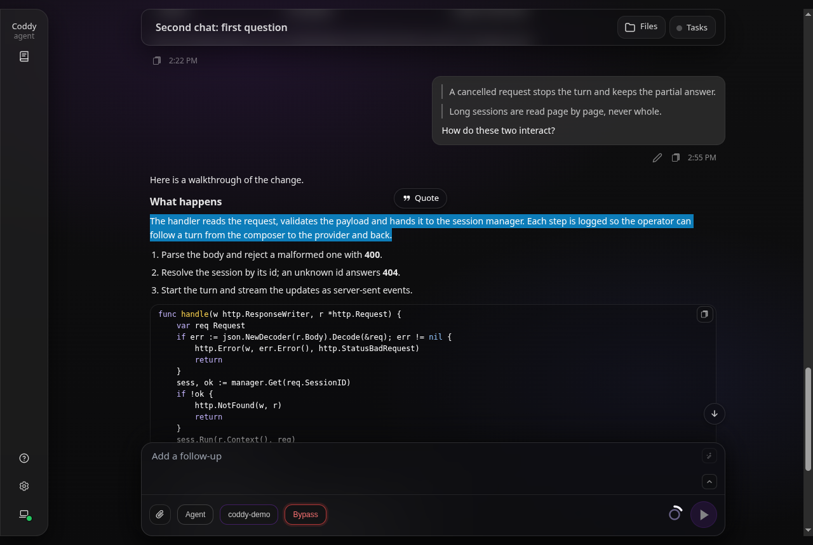

*Выделение в ответе предлагает "Цитировать"; отправленный промпт показывает процитированные фрагменты, тёмная тема, 1280 px*

Выделите текст в любом месте транскрипта - в ответе, промпте, карточке инструмента, - и когда выделение перестанет меняться, рядом с ним появится кнопка **Цитировать** (`data-testid="transcript-quote"`, **`chat/TranscriptQuoteButton.tsx`**). При работе мышью она стоит над выделением, а на сенсорном экране под ним, потому что место сверху занимает собственное меню выделения браузера. Кнопка держится между заголовком чата и полем ввода и пропадает, когда выделение сбрасывается или уходит из видимой области. Заголовок чата, поле ввода и всё, что вне транскрипта, кнопку не показывают, как и транскрипт субагента только для чтения и архивный чат, у которых нет поля ввода.

- **Что делает нажатие** - фрагмент попадает в черновик строками цитаты Markdown (`> `, для пустой строки просто `>`) после уже написанного, с пустой строкой с обеих сторон и пустой строкой под ним для продолжения; выделение снимается, а каретка переходит в конец черновика (поле получает фокус везде, где приложение может его ставить, то есть не на телефоне, где фокус открывает клавиатуру). Если процитировать ещё раз, фрагменты накапливаются в том порядке, в каком их взяли (issue #342);
- **Черновик остаётся обычным текстом** - цитата входит в черновик, поэтому всё, что сохраняет черновик, ставит его в очередь или возвращает, сохраняет и цитаты, а убрать цитату значит отредактировать текст. Модель читает её как цитату Markdown; кнопка **Спросить о выделенном** в просмотре документации цитирует так же (**`chat/quoteDraft.ts`**);
- **В диалоге** - отправленный промпт показывает процитированные строки блоками цитат с полосой слева, более приглушённым цветом, чем написанный вокруг текст (`data-testid="user-message-quote"`). Цитату открывает только маркер в начале строки, за которым идёт пробел или ничего, поэтому `>=5` остаётся текстом. Копирование и карандаш по-прежнему возвращают промпт ровно в том виде, в каком он был отправлен.

## Основная кнопка поля ввода (`#btn-send`)

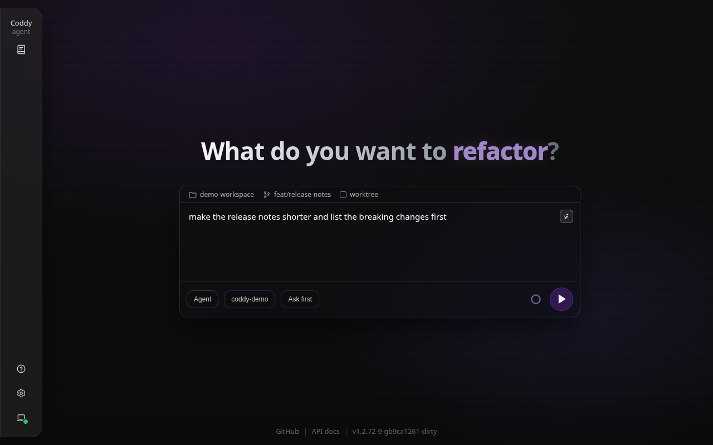

*Палочка улучшения промпта в правом верхнем углу поля подсвечена, пока в черновике есть текст*

Кольцо контекста и всплывающая панель с разбивкой

- **Наведение** на **`.composer-context-tip-host`** показывает прежнюю компактную подсказку (процент, вход/выход/всего, максимальный контекст);
- **Щелчок** открывает **`ContextBreakdownPopover`** рядом с кольцом на широких экранах (**`context-breakdown-menu--portal`**); в одноколоночной раскладке (**`max-width: 1199px`**) панель открывается в той же нижней шторке, что и списки выбора по слэшу и **`@`**, поверх собственной затемняющей подложки (**`context-breakdown-menu--sheet`**, **`slash-sheet-backdrop`**; подложка списков выбора прозрачная). **Escape** или **Закрыть** закрывают панель; после закрытия подсказка при наведении возвращается;
- Ключи легенды соответствуют **`contextBreakdown`** в **`GET /coddy/sessions/{id}/stats`** (`systemPrompt`, `toolDefinitions`, `rules`, `skills`, `mcp`, `conversation`). Живое SSE-событие **`usage_update`** сразу заменяет показанный итог (в том числе после `/compact` или автоматического сжатия контекста), после чего интерфейс обновляет подробную статистику. Тесты Vitest - **`Composer.test.tsx`** (`click context ring opens breakdown popover`) и **`consumeComposerSse.order.test.ts`** (`usage_update replaces the displayed current context after compaction`).

Форма и значки

- Кнопка стоит **справа** от кольца контекста (**`.composer-icon`** в **`Composer.tsx`**);
- Область нажатия - **правильный круг** с равными **шириной** и **высотой**, **`border-radius: 50%`**, **`box-sizing: border-box`** (сейчас **42×42px** в **`styles.css`**). **Не** выпускайте для этой кнопки скруглённый квадрат или сквиркл, пока визуальная спецификация явно не изменится снова;
- **Пуск** (**в простое**, черновик не пуст) - SVG-треугольник **17x17px** внутри **`composer-send-glyph`**, его контур сдвинут правее центра для оптического баланса;
- **Стоп** (**пока в сессии идёт ход, черновик пуст**) - залитый квадрат **`.composer-stop-square`** (**14x14px**, по центру круга **42px**). Остаётся в **`composer-bar-actions`** справа, рядом с кольцом контекста, даже если у этой вкладки нет читателя потока;
- **Очередь** (**пока в сессии идёт ход, а в черновике есть текст или вложение**) - значок **Пуск** возвращается на акцентной заливке (**`.composer-run-icon--queue`**, **`data-queue="true"`**). Если очистить поле и вложения, возвращается **Стоп**. Подробнее в разделе **Очередь сообщений поля ввода** ниже;
- **Неактивное** состояние в простое, когда в textarea только пробелы **и нет вложенных файлов** (**`:disabled`** на **`composer-send-play`**); одного вложения достаточно, чтобы разблокировать отправку (см. **Вложения файлов в поле ввода (мультимодальность)**).

Поведение

- **Enter** отправляет промпт в простое и ставит черновик в очередь, пока в сессии идёт ход, на любом устройстве с клавиатурой, включая окно десктопа уже **1200px**; **`Shift+Enter`** вставляет перевод строки. **`Ctrl+Enter`** или **`Alt+Enter`** тоже вставляют перевод строки, кроме строки из одного **`````** - на ней они открывают пустой блок кода в ограждении и ставят каретку в его моноширинное поле; стрелки естественно выводят из блока через его границу строк. Действие Enter зависит от устройства ввода, а не от ширины. На **только сенсорном** устройстве (**`(any-hover: none) and (any-pointer: coarse)`**, телефон) Return вставляет перевод строки, а отправляет или ставит в очередь основная кнопка, потому что на клавиатуре телефона нет Shift+Enter; с подключённой клавиатуры **`Cmd+Enter`** по-прежнему отправляет. Атрибут **`enterkeyhint`** у textarea сообщает то же экранной клавиатуре (**`send`** или **`enter`** на только сенсорном устройстве). Enter, подтверждающий кандидата метода ввода (**`isComposing`**, **`keyCode` 229**), никогда не отправляет. Правило задано в **`chat/composerEnter.ts`**. Клавиши, которыми метод ввода набирает текст, не доходят и до остального поля ввода (проверка стоит в начале **`onKeyDown`** у textarea в **`Composer.tsx`**) - списки выбора по слэшу, **`@`**, опциям команд и диапазонам строк не выбирают по ним строку, не двигают подсветку и не закрываются, а Ctrl+Z не возвращает черновик, каким он был до "Улучшить промпт". Нажатие считается набором, если у него есть **`isComposing`** или если это нажатие с **`keyCode` 229** в пределах 100 мс после **`compositionend`** - такую клавишу Safari отправляет после окончания набора. Любой другой код 229, который клавиатуры Android отправляют для обычных клавиш, работает в списках выбора как обычная клавиша, но правило отправки выше всё равно не принимает Enter с таким кодом;
- **Стоп** отправляет **`POST /coddy/sessions/{id}/cancel`** и сразу прерывает собственного читателя вкладки, чтобы запрос не ждал соединения, которое этот читатель держит. Ошибка остаётся на виду, запрос можно повторить, а вкладка снова подключается к идущему ходу; одно лишь подтверждение не переводит ход в простой. Сохранение частичного ответа ассистента и слияние транскрипта описаны в разделе [Параллельные сессии и отмена генерации](#параллельные-сессии-и-отмена-генерации);
- **Отправка, которую сервер не принял**, возвращается в поле ввода - текст (перед всем, что набрано после) и прикреплённые файлы. Это касается отказа по статусу (**409** занято, **4xx** или **5xx**), запроса, сорвавшегося по дороге (оборванная загрузка, отклонённое соединение), и вложения, которое браузер не смог прочитать (файл перемещён или изменён на диске после выбора, облачной фотографии нет на устройстве); в последнем случае ничего не отправляется. Оптимистичное облачко уходит из транскрипта, а красное уведомление объясняет причину и приводит в скобках объяснение браузера или сообщение сервера (`Failed to fetch`, `request body too large`). Так сбой, который не дошёл до сервера и поэтому ничего не оставил в его логе, можно отличить от остановленного сервера. После запроса, сорвавшегося по дороге, транскрипт заново не читается, потому что такое чтение стёрло бы уведомление; если сервер всё-таки принял ход, обновление активности подключается к нему, а по его завершении транскрипт перезагружается. Правило задано в **`streamResponses`** в **`App.tsx`**;
- **Улучшить промпт** - компактная кнопка-палочка **24×24px** (**`data-testid="composer-enhance-btn"`**) стоит в **правом верхнем углу поля**, на 8px ниже шва плашки и в 12px от края карточки (на глаз эти отступы одинаковы), поэтому поле и его плейсхолдер начинаются от верха карточки, а первая строка стоит вровень с палочкой; текст на неё не заходит, а счётчик git на плашке выше заканчивается у её правого края. В нижней панели поля ввода её нет. У неё есть `title` и доступное имя **`Improve prompt`**, она неактивна при пустом черновике и пока идёт запрос или генерация, вызывает **`POST /coddy/enhance-prompt`** и заменяет черновик только при успехе. **Ctrl+Z** / **⌘Z** возвращает черновик до улучшения; при ошибке черновик не меняется, а ошибка показывается прямо у поля.

Регрессия

- Автоматические проверки интерфейса (**Playwright MCP** или **`@playwright/test`**) МОГУТ проверять, что у **`#btn-send`** **`offsetWidth`** **≈** **`offsetHeight`**, а вычисленный **`border-radius`** **≥ половины** **`min(width,height)`** (с субпиксельным допуском).

## Очередь сообщений поля ввода

Поле ввода остаётся рабочим, пока агент занят. Уточнение может направить следующий шаг ReAct или дождаться конца текущего ответа и уйти отдельным промптом. Полное поведение описано на странице [Очередь сообщений](../features/message-queue.md).

- **Постановка в очередь** - при первом уточнении интерфейс спрашивает, в каком режиме ставить сообщение по **Enter**, и сохраняет ответ в `agent.queue_mode`. **Tab** использует другой режим. Основная кнопка использует режим Enter. Тело POST содержит **`text`**, **`mode`** и необязательный **`inline_files`**; поле ввода очищает и текст, и вложения. Сообщение, отправленное через **Tab** до первого ответа, после выбора режима всё равно уходит в другом режиме. **Tab** принадлежит открытому списку выбора по слэшу или упоминанию, даже пустому. При **409 no_active_turn** сообщение уходит обычным промптом; при других отказах черновик и файлы возвращаются;
- **Список** - строки очереди отображаются как **`.composer-queue-item`** над полем ввода, с режимом, а у сообщения с изображениями ещё со скрепкой и их числом (очередь называет изображения, но никогда не хранит их байты). Щёлкните по режиму, чтобы переключить его через **PATCH**. **×** в рамке удаляет строку через **DELETE** и возвращает в поле ввода её текст, а изображения берёт из **`inline_files`** ответа; **404** означает, что агент успел прочитать сообщение раньше. Строки "После хода" остаются видны после остановки;
- **Открытие и переподключение** - интерфейс читает **`GET /coddy/sessions/{id}/queue`** для выбранной сессии вместе со снимком её активности. Уже ожидающие сообщения появляются без нового изменения очереди, без живого читателя хода и без соответствующей строки в **Истории**;
- **Синхронизация** - клиенты одного **`coddy serve`** получают **`event: message_queue`** со всей очередью и номером **`version`** через поток хода и **`GET /coddy/events`**. HTTP-ответы несут тот же снимок. **`QueueDeliveryOrder`** оставляет самую новую версию и отсекает устаревшее при восстановлении после перезапуска. Прочитанное сообщение "В текущий ход" приходит как **`event: user_message`** там, где его прочитал агент, а сообщение "После хода" так же приходит там, где начинается его собственный промпт, поэтому второй ответ никогда не продолжает первый;
- **Границы** - это элементы управления остановкой и очередью, общей шиной сессий они не служат. Существующий релей транскрипта и принадлежность запросов разрешений и вопросов не меняются. Отдельные процессы локальной консоли или ACP с общей папкой сессий разделяют маркер отмены, но не очереди в памяти и не каналы ответов;
- **Плейсхолдер** - во время генерации в поле показывается **`composer.placeholderQueue`** вместо обычного плейсхолдера;
- **Вложения идут вместе с сообщением из очереди.** Изображение доходит до мультимодальной модели; живое облачко показывает его чипом файла (**`chat/queuedUserMessage.ts`**), а транскрипт, прочитанный после хода, приносит его миниатюру;
- Тесты Vitest - **`composerQueue.test.tsx`**, **`queuedUserMessage.test.ts`**, **`App.stopQueue.test.tsx`** (возврат сообщения из очереди, текст и изображение).

Функциональные проверки на регрессию.

| Сценарий | Ожидаемый результат |
| --- | --- |
| Откройте идущую сессию, которой нет в текущем поиске или на текущей странице истории | Чтение активности и очереди восстанавливает кнопки остановки и очереди и ожидающие сообщения. |
| Переподключитесь, когда сообщения уже ждут, или потеряйте локального читателя хода | Очередь заполняется без нового изменения; элементы управления следуют активности сервера, а не времени жизни читателя. |
| Добейтесь ошибки `/cancel`, затем повторите | Ошибка остаётся на виду, вкладка снова подключается к идущему ходу через релей, и кнопка "Стоп" остаётся рабочей. Успешный повтор подтверждает отмену; простой подтверждается завершением хода на сервере. |
| Откройте три вкладки одной идущей сессии (шесть соединений HTTP/1.1 с хостом) и нажмите "Стоп" в любой из них | Запрос отмены доходит до сервера, и ход останавливается во всех вкладках без ошибки "Не удалось остановить генерацию". |
| Откройте шесть простаивающих вкладок одного сервера по обычному http и отправьте промпт из любой из них | Промпт отправляется сразу - вкладки делят одно соединение событий, а ход, начатый в одной вкладке, показывает "Стоп" во всех вкладках с этой сессией. |
| Доставьте ответ GET очереди после того, как SSE-доставка очереди обогнала это чтение | Побеждает доставленный список; удалённое или прочитанное сообщение не появляется снова. Повторно проигранные события `turn_started` сохраняют список и версию. |
| Перезапустите сервер, затем восстановите очередь новым GET | Если во время чтения доставки не было, более низкая версия (включая `0`) заменяет устаревшее состояние; ответы на изменения и кадры очереди из собственного потока и потока релея из более ранних эпох восстановления игнорируются. |
| Доставьте старое `turn_ended`, пока следующий POST этой вкладки ожидает приёма или уже принят | Интерфейс подтверждает активность свежим запросом REST и не помечает новый ход как простаивающий; пока запрос принимается, заполнение активности и очереди ждёт. |
| Переключите сессию, пока чтение активности или очереди не завершилось | Опоздавший ответ не меняет элементы управления и очередь новой сессии. |

## Вложения файлов в поле ввода (мультимодальность)

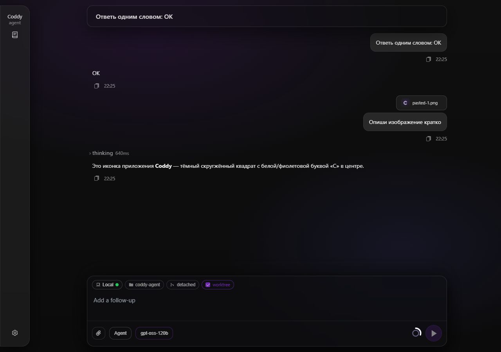

*Отправленное изображение, восстановленное миниатюрой из бандла сессии*

- Кнопка со скрепкой (скрытый `<input type="file">` **`data-testid="composer-file-input"`**, который срабатывает от видимой кнопки-значка) появляется в поле ввода, **только** если у активной модели в **`GET /v1/models`** есть **`multimodal: true`**. Флаг берётся из **`models[].multimodal`** в конфигурации YAML и передаётся по цепочке **`ModelInfo.multimodal`** → **`llmModelMultimodal`** в **`App.tsx`** → свойство **`Composer`**;
- Кроме выбора через скрепку, файлы попадают в **`attachedFiles`** ещё двумя путями, и оба работают только при **`llmModelMultimodal`**:
  - **Вставка из буфера обмена** в **`textarea#composer`** - элементы-изображения (`kind === "file"`, `image/*`) прикрепляются, а вставка по умолчанию отменяется; вставка обычного текста не затрагивается. Вставленные изображения получают детерминированные имена **`pasted-<n>.<ext>`** (браузеры называют любое изображение из буфера `image.png`);
  - **Перетаскивание** на **`.composer-card`** - брошенные файлы прикрепляются так же, как выбранные через скрепку; пока файлы тащат над карточкой, она подсвечивается как цель **`.composer-card--dragover`**;
- Если модель **не** мультимодальная, при отказе во вставке или перетаскивании вместо прикрепления появляется временное уведомление **`.composer-attach-hint`** (`role="status"`, исчезает само через ~4 с);
- Вложение `image/*` показывается **карточкой предпросмотра**, а не чипом. Картинка заполняет карточку **128×96** (**`.composer-attachment-card`** в поле ввода, **`.msg-user-file-card`** в отправленном облачке, `object-fit: cover`, радиус 12px), чтобы оператор видел, что прикреплено. При наведении карточка подсвечивается, курсор становится **`zoom-in`**, а щелчок открывает изображение в общем просмотрщике (**`ui/components/ImageLightbox.tsx`** - уровни масштаба, **+ / - / 0**, перетаскивание для сдвига, колесо и щипок для масштаба, **Esc**, портал в `document.body`). Остальные файлы и заблокированные чипы режима правки остаются чипом со значком и именем файла;
  - В поле ввода кнопка **удаления** карточки (**`composer.removeAttachment`**) стоит в её правом верхнем углу и плавно появляется при наведении; она остаётся в порядке табуляции и видна при **`:focus-visible`**, а удаление никогда не открывает просмотрщик. Просмотрщик открывает локальный object URL, то есть сам файл в полном размере;
  - **Отправленное облачко пользователя** сначала показывает в карточке оптимистичный blob **`previewUrl`**, а после сохранения заменяет его на **`files[].preview_url`** с бэкенда; в этот момент blob URL отзывается. Карточка открывает **`files[].url`**, исходные байты из бандла сессии; сообщение, отправленное до появления этого поля, открывает свой **`preview_url`**, и щелчок не пропадает. При перезагрузке диалога оба значения восстанавливаются через **`GET /coddy/sessions/{id}/messages`**;
- **Отправка одних вложений** допустима, пока выбранная модель мультимодальная. **Отправить** (кнопка или **Enter**) разблокируется при наличии вложений даже с пустым черновиком и вызывает **`onSend("", files)`**; сервер принимает пустую строку `input` вместе с `inline_files`. Если пользователь переключается на немультимодальную модель, существующие чипы остаются видны с **`.composer-attachment-chip--disabled`**, отправка одних вложений становится недоступна, а при отправке текста эти файлы не уходят, но остаются в поле;
- Обработчик HTTP независимо фильтрует **`inline_files`** по действующей модели из YAML. Так собственный или устаревший клиент не перешлёт и не сохранит файлы, когда **`multimodal`** равен false;
- Прикреплённые файлы хранятся в состоянии **`attachedFiles: File[]`** компонента **`Composer`**. Над полем ввода появляются чипы предпросмотра с именем файла и значком типа (или миниатюрой для изображений);
- При отправке **`App.tsx`** читает каждый файл как data URL через **`FileReader`** и добавляет **`inline_files: [{name, data_url}]`** в тело **`POST /v1/responses`**;
- **Ходы в режимах "Агент", "План" и "Чат"** - если действующая модель мультимодальная, сервер записывает каждый файл в **`~/.coddy/sessions/<id>/assets/`** (права **`0o444`**) и вставляет в сообщение пользователя XML-блок **`<coddy_session_assets>`**, чтобы агент мог применить к этим путям **`read`** или **`cp`**. Повторяющиеся имена файлов получают суффиксы **`_1`**, **`_2`** (см. `internal/session/assets.go` **`SavePartsToAssets`**);
- **Ходы напрямую к модели из YAML** - для мультимодальной модели каждый файл сохраняется в папке ассетов сессии, прежде чем стать частью содержимого **`image_url`**, которая уходит провайдеру прямо в запросе;
- В любом режиме для загруженных PNG/JPEG/GIF, которые удаётся декодировать, в **`assets/thumbnails/`** создаётся PNG-превью только для чтения размером не больше **160 px**. **`GET /coddy/sessions/{id}/messages`** возвращает метаданные **`files`**, **`preview_url`** и **`url`**; **`GET /coddy/sessions/{id}/assets/{name}/thumbnail`** отдаёт сгенерированное превью, а **`GET /coddy/sessions/{id}/assets/{name}`** исходные байты, но **только если по содержимому они определяются как изображение**. Имя файла здесь ничего не решает, поэтому никакое другое вложение бандл не покидает. Облачко пользователя убирает XML-аннотацию через **`stripCoddyAttachmentsForUserDisplay`** и использует **`parseSessionAssetFiles`** только как запасной вариант для старых данных;
- После сохранения в настройках через **`PUT /coddy/config`** **`App.tsx`** увеличивает **`configEpoch`** → заново запрашивает **`/v1/models`**, и кнопка вложений появляется или исчезает без перезагрузки страницы. Тот же счётчик увеличивает **`event: config_reloaded`** в **`GET /coddy/events`**, поэтому изменение, сделанное не на этой странице, действует так же (см. **Перезагрузка конфигурации на лету**).

| Случай | Ожидаемый результат | Автоматическая проверка |
|------|----------|-----------------|
| FA1 | Скрепка видна, только когда `llmModelMultimodal` равен true | `Composer.test.tsx` |
| FA2 | После отправки чипы файлов отображаются в облачке пользователя | `stripCoddyAttachments.test.ts` |
| FA3 | Чипы сохраняются после перезагрузки через `parseSessionAssetFiles` | `stripCoddyAttachments.test.ts` |
| FA4 | Вставленное изображение прикрепляется чипом `pasted-<n>.<ext>` (только для мультимодальной модели) | `Composer.test.tsx` |
| FA5 | Вставка или перетаскивание при немультимодальной модели показывает `composer-attach-hint` и ничего не прикрепляет | `Composer.test.tsx` |
| FA6 | Файлы, брошенные на `.composer-card`, прикрепляются, а `composer-card--dragover` переключается | `Composer.test.tsx` |
| FA7 | Вложения `image/*` показываются превью `composer-attachment-card`; чипы остальных файлов сохраняют значок | `Composer.test.tsx` |
| FA8 | Одно вложение разблокирует отправку кнопкой и Enter и вызывает `onSend("", files)` | `Composer.test.tsx` |
| FA9 | Отправленное облачко показывает `msg-user-file-thumb` из `previewUrl` (только для изображений); записи с одними метаданными сохраняют значок | `UserMessage.test.tsx`, `optimisticUserFiles.test.ts` |
| FA10 | После переключения на немультимодальную модель чипы остаются неактивными, а отправка текста их не включает | `Composer.test.tsx` |
| FA11 | Метаданные миниатюр с бэкенда заменяют оптимистичные blob и восстанавливаются после перезагрузки | `sessionMessageFiles.test.ts`, `transcriptServerSnapshot.test.ts`, `server_test.go` |
| FA12 | Карточка превью открывает увеличенное изображение и в поле ввода, и в отправленном облачке; отправленное облачко открывает `url`, а без него `preview_url` | `Composer.test.tsx`, `UserMessage.test.tsx` |
| FA13 | Удаление карточки превью в поле ввода убирает вложение и ничего не открывает | `Composer.test.tsx` |
| FA14 | `GET .../assets/{name}` отдаёт исходные байты изображения и отказывает во всём, что по содержимому не определяется как изображение | `coddy_session_asset_test.go` |

## Скилы по слэшу в поле ввода и каретка зеркала

Основное описание и визуальные токены находятся в **`DESIGN.md`** (список выбора по слэшу, контракт зеркала, таблица проверок). Этот раздел задаёт функциональный контракт для проверки на регрессию.

Передача и черновик

- **`textarea#composer`** содержит только **обычный текст**. Вызванные скилы выглядят как токены **`/<name>`** (после выбора в списке ставится пробел). Интерфейс **не должен** сохранять в черновике **`[/<name>](coddy-skill:<name>)`**;
- Первый ход пользователя в **`POST /v1/responses`** несёт те же простые токены со слэшем, что и значение поля ввода (клиент не вставляет Markdown для скилов в тело запроса).

Список выбора и сегментация

- Группа **Команды** перечисляет встроенные команды из **`GET /coddy/commands`** с подсказкой аргументов (**`.slash-row-hint`**). Выбор **`/model`**, **`/reasoning`** или **`/permissions`** открывает соответствующий селектор поля ввода вместо вставки текста, а выбор **`/agent`**, **`/plan`** или **`/ask`** переключает режим; команда настройки, набранная целиком со значением, уходит как текст промпта, и её применяет сервер;
- Набранная в поле ввода **`/mcp`** открывает **Настройки → MCP-серверы** без отправки хода; слова после команды игнорируются, как в консоли, а слово, которое лишь начинается с неё (`/mcpx`), считается обычным промптом. Команда стоит рядом с `/docs` в локальной группе "Команды" и работает и из поля ввода на стартовом экране, и из сессии;
- Видимость меню и **`prefix`** вычисляет **`slashMenuDraftAtCaret`** в **`external/ui/src/ui/skills/draftSlash.ts`** (перед **`/`** начало строки или пробел, необязательный суффикс, не внутри блоков кода и цитат);
- Черновик, очищенный извне (отправленный кнопкой **Отправить**, поставленный в очередь во время хода, выполненный как команда браузера), закрывает вместе с собой меню слэша, **`@`** и опций. Textarea не порождает событие изменения для значения, заданного родителем, поэтому поле ввода само следит за черновиком (**`Composer.test.tsx`**, **`features/web_ui_menus.feature`**);
- Подсветка в зеркале использует **`segmentComposerSlashSpans`** из **`external/ui/src/ui/skills/segmentComposerSlashSpans.ts`** (**`/`** посреди строки поддерживается; **`x/foo`** не считается токеном команды).

Зеркало и выравнивание каретки

- В непустом черновике текст textarea рисуется **прозрачным**, а видимую строку, включая **`.composer-skill-chip-inline`** (**`data-testid="composer-skill-chip"`**), показывает **`.composer-mirror-inner`**;
- Чипы поля ввода **не должны** использовать горизонтальные **padding**, **margin** или **border**, которые меняют ширину в строке. Для обводки используйте **`box-shadow`**. **`font-family`**, **`font-size`**, **`line-height`**, **`font-weight`**, **`letter-spacing`** у чипа и **`#composer`** должны совпадать, чтобы каретка стояла точно на месте. Таблица стилей резервирует место под полосу прокрутки и у textarea, и у зеркала (**`scrollbar-gutter: stable`**), зеркало прокручивается вместе с полем, берёт его высоту и заново выравнивается при изменении размера окна и плотности экрана (**`DESIGN.md`**, *Composer mirror and caret sync*).

Транскрипт и поле ввода

- Облачка **`user_message`** показывают только **обычный текст** (**`msg-user-body`**, **`white-space: pre-wrap`**). Markdown не обрабатывается; известные токены `/skill` и токены `@mention` рабочей папки служат компактными кнопками, которые по щелчку копируют свой исходный текст. Токены со слэшем вроде **`/path/to`** и блоки YAML остаются ровно такими, какими сохранены, с переводами строк;
- Чипы зеркала поля ввода (**`composer-skill-chip`**) действуют **только** при редактировании **`#composer`**, в транскрипте их нет;
- Сохранённые ходы пользователя могут нести развёрнутые вложения в виде XML **`coddy_attachment`** с **`path`**, **`name`** и содержимым файла в CDATA (**`internal/agent`**). **`stripCoddyAttachmentsForUserDisplay`** заменяет каждый XML-блок компактным **`@path`**, **только если** этого пути **ещё нет** в окружающем тексте в виде упоминания **`@`** (это **исключает дублирование**, потому что сохранённый ход уже повторяет **`@`** и в тексте пользователя, и в развёрнутом блоке).

Сценарии проверки

| ID | Ожидание | Основная автоматическая проверка |
| --- | --- | --- |
| UC1 | Один чип для **`asdfasf /find-skills asdfasdf`**, обычный **`textarea.value`** | **`external/ui/src/ui/chat/Composer.test.tsx`** (`composer highlights plain slash token as chip while editing`) |
| UC2 | Меню открывается посреди строки после пробела | **`draftSlash.test.ts`** (`slashMenuDraftAtCaret works after whitespace mid-line`) |
| UC3 | В **`x/foo`** нет чипа для **`/foo`** | **`segmentComposerSlashSpans.test.ts`** (`segmentComposerSlashSpans skips letter before slash`) |
| UC4 | Чип для **`/foo`** в начале строки | **`segmentComposerSlashSpans.test.ts`** (`segmentComposerSlashSpans line start slash`) |
| UC5 | **`stripCoddySkillMarkdownLinks`** при вставке в старом формате | **`segmentComposerSlashSpans.test.ts`** (`stripCoddySkillMarkdownLinks restores plain slash token`) |
| UC6 | Облачко пользователя оставляет **`hi /demo there`** обычным текстом (без **`coddy-skill-span`**) | **`UserMessage.test.tsx`** |
| UC7 | Многострочный YAML и пути сохраняют переводы строк **`\\n`** в **`user-message-body`** | **`UserMessage.test.tsx`** |
| UC7b | **`slugSlashes`** только для отображения (простой **`/`** и смесь со старым форматом) | **`segmentComposerSlashSpans.test.ts`** (`slugSlashesForUserBubbleMarkdown …`; только поле ввода и старый формат, не транскрипт) |
| UC8 | Живой **`coddy serve`** - совпадение **`fontFamily`** у чипа и **`#composer`**, каретка **`selectionStart === value.length`** в конце строки после заполнения | **Playwright MCP** **`browser_evaluate`** после **`make build TAGS="http ui"`** |
| UC9 | Облачко пользователя скрывает содержимое **`coddy_attachment`** и показывает только **`@path`** | **`UserMessage.test.tsx`**, **`stripCoddyAttachments.test.ts`** |

## Опции команд в поле ввода

Когда черновик начинается с **`/compact`**, поле ввода дополняет то, что принимает команда. Два дефиса после неё (**`/compact --`**) предлагают опции **`--model`** и **`--reasoning`** (одиночный **`-`** ничего не предлагает, потому что инструкции могут быть списком). После **`--model `** или **`--model=`** (или короткой **`-m`**) в списке стоят настроенные модели (те id, что предлагает селектор моделей поля ввода, **`props.llmModels`**), и по мере набора id список сужается поиском подстроки без учёта регистра - самым широким из правил, по которым сервер находит модель по имени (первым побеждает полный id или имя модели без провайдера, см. [Сжатие контекста](../features/compaction.md#команда-compact)). **ArrowDown** / **ArrowUp** двигают подсветку, **Enter** и **Tab** вставляют строку в черновик с пробелом после неё, **Escape** закрывает список, не трогая черновик. Выбор **`--model`** сразу открывает список моделей.

После **`--reasoning `** (или **`-r`**) в списке стоят **`default`** и уровни модели, которую называет **`--model`** в черновике. **`/goal`** принимает те же две опции - **`--model`**, которая дополняется из настроенных моделей, и **`--reasoning`**, которая дополняется из **`default`** и уровней модели, названной в **`--model`** черновика (модель находится так же, как на сервере, по точному id, а иначе по единственному id, который его содержит), или модели сессии, если черновик модель не называет (**`commandReasoningChoices`**). Уровни берутся из **`GET /v1/models`** (**`reasoning_levels`** каждой строки, **`llmReasoningLevelsByModel`**). См. [Цель сессии и супервизор](../features/session-supervisor.md#команды).

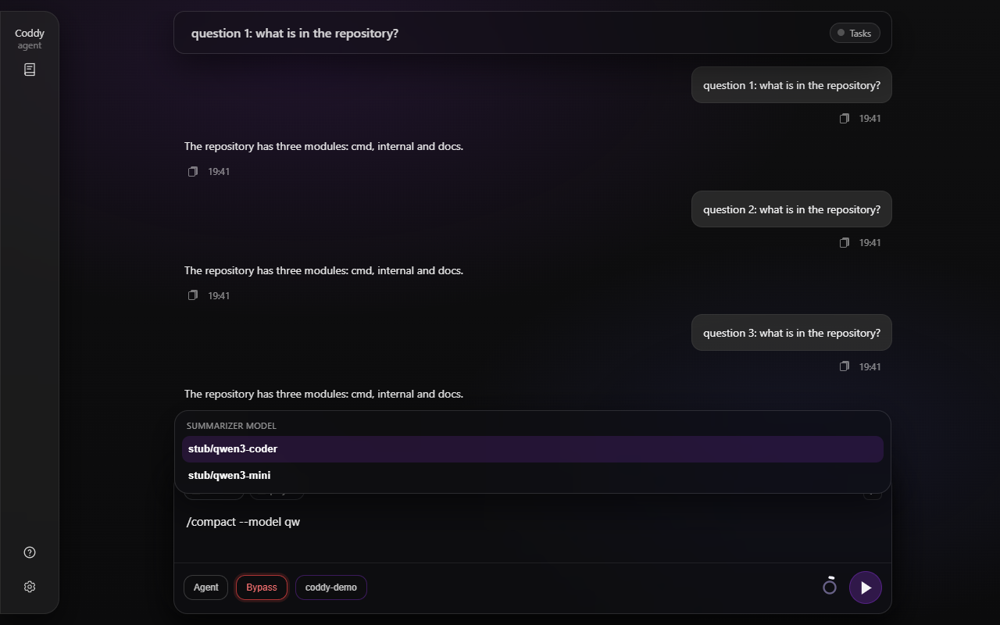

*Поле ввода дополняет значение `--model` (тёмная тема, 1280 px).*

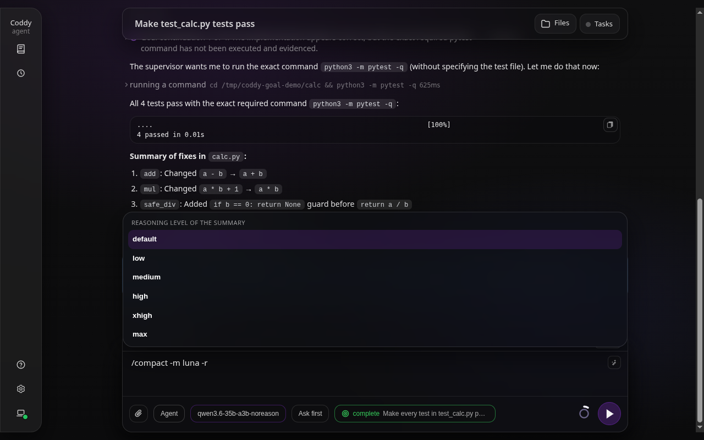

*Поле ввода дополняет `-r` уровнями модели, названной в `-m` (тёмная тема, 1280 px).*

- Список - третий вид общей оболочки списков выбора (**`.slash-menu`**, нижняя шторка в одноколоночной раскладке), **`data-testid="command-arg-menu"`**, строки **`command-arg-row-<id>`**; запросов к серверу он не делает;
- Видимость, заменяемый диапазон и набранный префикс вычисляет **`commandArgDraftAtCaret`** в **`external/ui/src/ui/skills/draftCommandArg.ts`**, которая повторяет **`parseCompactCommand`** (**`internal/agent/compact.go`**) и **`ParseGoalCommand`** (**`internal/session/goal_command.go`**). Команда открывает черновик, опции идут первыми, а с первого слова, не похожего на опцию, начинаются инструкции или цель, и там ничего не дополняется. Одна лишь **`/compact `** или **`/goal `** ничего не открывает, поэтому **Enter** по-прежнему отправляет команду;
- Тесты - **`draftCommandArg.test.ts`**, **`Composer.commandArg.test.tsx`**.

## Упоминания **`@`** в поле ввода

- **`textarea#composer`** хранит обычный **`input`** со всеми упоминаниями **`@`** как есть, и **`POST /v1/responses`** отправляет этот текст в набранном виде. Упоминания разрешает сервер при отправке сообщения (**`internal/session/mentions.go`**, грамматика в **`internal/mention`**) тем же механизмом, что используют консоль, редакторы через ACP и Telegram-бот. Поле ввода больше не выводит **`attachments`** из черновика; **`extractAtFileAttachments`** (**`external/ui/src/ui/skills/draftAt.ts`**) только пополняет недавние выборы. Что прикрепляет упоминание и какие у него ограничения, описано на странице [Упоминания](../features/mentions.md);
- Меню **`@`** запрашивает **`GET /coddy/mentions`** (**`q`** - текст после **`@`**, **`limit=50`**; первый запрос после открытия списка добавляет **`refresh=1`**, чтобы в списке оказался и только что записанный файл). Строки имеют тип **`MentionRow`** (**`external/ui/src/ui/skills/mentionRows.ts`**) с полями **`kind`** (**`file`**, **`directory`**, **`session`**, **`rule`**, **`agent`**, **`plan`**, **`doc`**, **`scheme`**), **`insert`** (текст, который заменяет **`@`** вместе с запросом), **`label`**, **`detail`** и **`continue`**. Каждая строка начинается с метки вида (**`.mention-kind`**, мета-виды выделены акцентным цветом); строка **`scheme`** - это **`@session:`**, **`@rule:`**, **`@agent:`** или **`@coddy:`**, и она сужает поиск до своего вида;
- Выбор строки заменяет **`@`** вместе с запросом на **`insert`**. Строка с **`continue`** (папка, подсказка схемы) не добавляет пробел и оставляет список открытым с новым запросом - **`@src/`** показывает содержимое **`src/`**; любая другая строка завершает упоминание пробелом, а если в пути есть пробел, берёт путь в кавычки (**`@"my notes.md"`**). Папка в кавычках (**`@"my notes/`**) закрывает кавычку перед кареткой, чтобы черновик называл папку, даже если файл так и не будет выбран, а следующий выбор в кавычках забирает эту кавычку себе (**`applyMentionRow`** в **`mentionRows.ts`**). Второй ответ для того же черновика (строки сервера после недавних выборов, повтор во время построения индекса) сохраняет строку, на которую переместили стрелки. После завершённого выбора **`Composer`** откладывает **`updatePickerMenus`** на два тика, чтобы список не открылся тут же снова из-за пробела в конце;
- **ArrowDown** / **ArrowUp** двигают подсветку (**`is-active`**, **`aria-selected`**, с прокруткой в видимую область); **Enter** и **Tab** выбирают подсвеченную строку. Список работает и во время хода, так что уточнение в очереди тоже может упоминать файл;
- Запрос, начинающийся с **`/`**, **`~`**, **`./`** или **`../`**, просматривает эту папку на сервере в любом месте диска; запрос без схемы ранжирует рабочую папку сессии (сначала имя файла, затем сегменты пути, затем буквы по порядку) и добавляет правила, субагентов и планы с подходящими именами. Если сервер нашёл больше, чем вмещает список, **`.mention-more`** (**`data-testid="mention-more"`**) пишет **`50 of 1204, type to narrow`** в строке заголовка, которая остаётся на экране, как бы далеко ни прокрутился список; пока первый индекс рабочей папки ещё строится, список повторяет запрос каждые 400 мс, не больше пяти раз;
- При пустом префиксе **`@`** (каретка сразу после **`@`**) сначала показываются недавние выборы из **`localStorage`** (**`workspaceAtRecents`**) с ключом **`sessionId`** (или **`__no_session__`** до первого назначенного id), затем ответ сервера на пустой запрос - три подсказки схем и верх рабочей папки. Недавние записи берутся из выбора файлов и папок и из **`extractAtFileAttachments`** при успешной отправке профиля (**`migrateWorkspaceAtRecents`** объединяет их, когда клиент генерирует **`X-Coddy-Session-ID`** или сервер его меняет);
- Лексер черновика (**`atMenuDraftAtCaret`**) открывает меню на **`@`** в начале строки или после пробела, открывающей скобки или кавычки; он принимает **`~`** и **`+`**, префикс в кавычках (**`@"my no`**, пробелы допустимы до закрывающей кавычки) и **`:`** сразу после **`session`**, **`rule`** или **`agent`**. В блоках кода, встроенном коде и строках цитат Markdown меню не открывается, так же как у **`draftSlash`** (**`inMarkdownFenceBeforeCaret`**, **`blockquoteLine`**);
- Оформление **`@`** в зеркале использует **`segmentComposerMirrorSpans`** (**`composer-at-chip-inline`**, **`data-testid="composer-at-chip"`**). **`listAtPathSpans`** (**`draftAt.ts`**, построен на **`parseMentions`**, двойнике **`Parse`** из **`internal/mention`**) находит токены (путь, папку, **`@session:<id>`**, **`@rule:<name>`**, **`@agent:<name>`**, путь в кавычках, веб-страницу), и токен становится чипом, только когда сервер подтвердил, что при отправке он будет прикреплён. Через 150 мс после окончания набора поле ввода отправляет черновик в **`POST /coddy/mentions/check`**, который прогоняет разрешение вхолостую (ничего не читает, не перечисляет и не скачивает) и отвечает по каждому токену, какая его часть разрешается (**`typed`**) и что она называет. Поэтому **`@google/genai`** в **`npm install @google/genai`** остаётся текстом, в **`compare @src/a.go b.go`** чипом становится только **`@src/a.go`**, а токен, на который ответа ещё нет, остаётся текстом; строка, выбранная в списке, сразу становится чипом. Упоминание у каретки сохраняет чип, пока на нём открыт список; текст после каретки, который ещё входит в черновик, остаётся частью активного токена, пока лексер **`atMenuDraftAtCaret`** не выйдет из него. **`draftAt.test.ts`** читает **`internal/mention/testdata/grammar_cases.json`** - те же случаи, на которых тестируется грамматика на Go;
- Запрос без совпадений оставляет список открытым (**`Nothing matches`**), и меню не сворачивается (**`composer-at-chip-inline`** скрывается для **`atNoMatch`** с теми же **`atIdx`** и **`prefix`**, что у устаревшего фильтра);
- В одноколоночной раскладке (**`(max-width: 1199px)`**) списки упоминаний и слэша отображаются как **`slash-menu--sheet`**, чтобы панелью было удобно пользоваться на телефоне, поверх прозрачной подложки (**`slash-sheet-backdrop--clear`**), которая закрывает список при нажатии снаружи и ничего не затемняет;
- Облачко пользователя сворачивает каждый **`<coddy_attachment>`**, с которым было отправлено сообщение (**`stripCoddyAttachmentsForUserDisplay`**, двойник **`mention.ForDisplay`**), обратно в упоминание, которое его принесло (атрибут **`mention`**, а без него **`path`**), или убирает совсем, если текст уже содержит это упоминание; тело **`/skill`** и правило, подтянутое упомянутым путём, не показываются вовсе. Разбор проходит секции CDATA, поэтому файл, содержащий **`</coddy_attachment>`**, не выпустит свой хвост в облачко.

### Диапазоны строк (**`@path:N-M`**)

- Упоминание может сузить файл до диапазона строк **с нумерацией от 1, включая обе границы** - **`@Dockerfile:21-31`** или в формах, которые пишут редакторы и хостинги кода, **`#L21-31`**, **`#L21-L31`**, **`#L21`**, **`#21-31`**. **`listAtPathSpans`** поглощает суффикс, поэтому зеркало делает весь токен одним чипом **`composer-at-chip-inline`**; диапазон должен завершать токен (**`:21-31x`** остаётся текстом), и должно выполняться **`1 <= start <= end`**. **`internal/mention/grammar.go`** содержит ту же грамматику на стороне сервера, а оба набора тестов используют общие литералы (**`internal/mention/testdata/grammar_cases.json`**);
- До модели доходят только эти строки. Диапазон передаётся в **`acp.Resource.URI`** фрагментом **`#L<start>-<end>`** (**`lineRangeURI`** / **`sliceLines`** в **`internal/session/promptfiles.go`**), а **`resourceAttachmentXML`** (**`internal/agent/mentions.go`**, поверх **`mention.Attachment`**) превращает его в **`<coddy_attachment path="..." name="..." lines="21-31">`**. Конец за последней строкой обрезается до неё. Диапазон, который файл выполнить не может (нулевой, перевёрнутый или начинающийся после последней строки), никогда не расширяется до всего файла. Явный диапазон в **`attachments[]`** или клиентский **`resource`** с таким фрагментом **`#L`** отклоняется (**`ErrLineRange`**, HTTP **400**), а к диапазону, набранному в тексте промпта, прикладывается заметка о том, сколько строк в файле. Метка **`lines`** пишется только для тела, которое действительно состоит из этого среза; тело из **`source.literal`** или по байтовому смещению (**`source.start`** / **`end`**) идёт без неё. Предпросмотр в списке - снимок, сделанный при открытии панели; строки, которые получает модель, читаются с диска в момент отправки, а при смене сессии предпросмотр сбрасывается. **`stripCoddyAttachmentsForUserDisplay`** сворачивает такой блок обратно в **`@path:N-M`**; простое упоминание никогда не перекрывает упоминание того же пути с диапазоном, и наоборот;
- Набранное после пути **`:`** само закрывает список упоминаний (вне подсказок схем **`:`** не входит в **`MENU_PATH_CHAR`**) и открывает вместо него **выбор диапазона строк** - **`atRangeDraftAtCaret`** / **`replaceAtRangeSuffix`** / **`highlightedRange`** в **`external/ui/src/ui/skills/draftAtRange.ts`**, панель **`data-testid="at-range-picker"`**, которая отображается через тот же портал и в том же оформлении **`slash-menu--sheet`**, что и меню **`@`**. Она показывает предпросмотр файла (**`GET /coddy/workspace/file`**, один запрос на путь, только файлы рабочей папки; диапазон, набранный после абсолютного пути, всё равно доходит до модели, но без предпросмотра) и подсвечивает **`at-range-line--sel`** по мере набора цифр; начало без конца подсвечивает одну эту строку;
- Единственным вводом остаётся текст поля ввода, числовых полей нет. На десктопе строки служат кнопками. **`mousedown`** закрепляет начало диапазона, перетаскивание по строкам расширяет его, и каждый шаг переписывает суффикс через **`replaceAtRangeSuffix`** (**`preventDefault`** оставляет фокус в textarea). При **`isMobileShell`** строки отображаются обычными **`div`** без обработчиков указателя - на телефоне нет мыши, чтобы тащить, поэтому диапазон набирают;
- Если путь не разрешается, панель остаётся закрытой, поэтому **`@user:1-2`** в обычном тексте никогда не открывает пустую панель; проверенный путь запоминается, и следующая цифра ничего заново не запрашивает. **`Escape`** закрывает панель и не даёт ей открыться для этого упоминания, пока черновик не уйдёт дальше; **`Enter`** не перехватывается и по-прежнему отправляет.

| Случай | Ожидаемый результат | Автоматическая проверка |
| --- | --- | --- |
| AR1 | **`@f.go:21-31`** становится одним чипом и прикрепляет только эти строки | **`draftAt.test.ts`**, **`internal/mention/mention_test.go`** (общий **`grammar_cases.json`**), **`features/at_line_range_mention.feature`** |
| AR2 | **`:21`**, **`:21-31x`**, **`:31-21`**, **`:0-5`** не считаются диапазонами | **`draftAt.test.ts`**, **`internal/mention/mention_test.go`** |
| AR3 | Двоеточие открывает выбор диапазона; цифры двигают подсветку | **`Composer.test.tsx`**, **`draftAtRange.test.ts`** |
| AR4 | Перетаскивание на десктопе записывает диапазон; на телефоне строки не кнопки | **`Composer.test.tsx`** |
| AR5 | Неразрешимый путь оставляет панель закрытой | **`Composer.test.tsx`** |
| AR6 | Облачко пользователя показывает **`@path:N-M`** вместо тела вложения | **`stripCoddyAttachments.test.ts`** |

| Случай | Ожидаемый результат | Автоматическая проверка |
| --- | --- | --- |
| AT1 | Пробелы в путях ( **`readme copy.md`**, **`@"my notes.md"`** ) работают в черновике списка и разрешаются на сервере | **`draftAt.test.ts`**, **`features/mentions.feature`** |
| AT2 | Список запрашивает **`GET /coddy/mentions`** (**`refresh=1`** при открытии), называет вид каждой строки и сообщает, сколько найдено | **`Composer.test.tsx`**, **`TestCoddyMentionsGet`** |
| AT3 | Стрелки двигают подсветку; **Enter** вставляет строку с пробелом, в том числе во время хода; папка оставляет список открытым | **`Composer.test.tsx`** |
| AT4 | **`@`** в одном лишь тексте **`session/prompt`** разрешается (без дубля, если в **`attachments`** или **`resource`** уже есть текст тела) | **`TestHydratePromptContentBlocksExpandsAtInText`**, **`features/mentions.feature`** |
| AT5 | Облачко сворачивает вложения обратно в принёсшие их упоминания с учётом CDATA | **`stripCoddyAttachments.test.ts`**, **`internal/mention/mention_test.go`** |

## Типы сообщений транскрипта

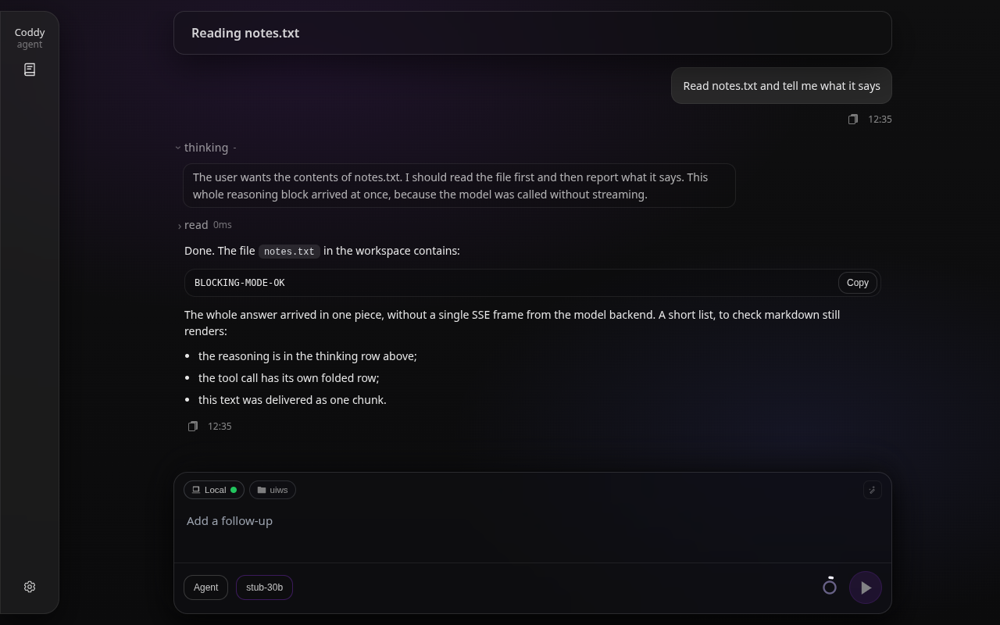

*Блок рассуждения, развёрнутый над ответом*

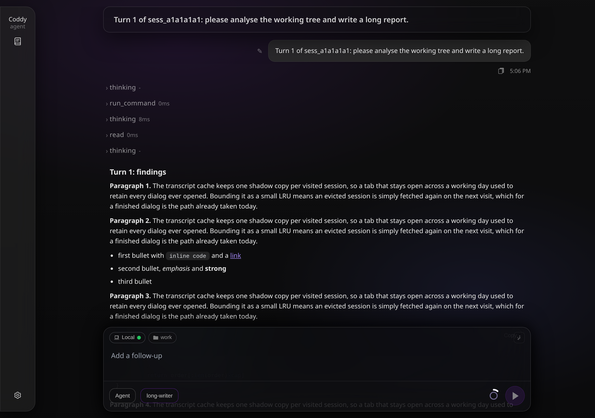

*Длинный транскрипт с карточками инструментов и ответами*

Транскрипт чата отображает плоский список блоков сообщений интерфейса. У каждого блока есть `type` и минимальный набор обязательных полей.

- `user_message`
  - Обычный текст, введённый пользователем (**без Markdown**; **`pre-wrap`** сохраняет переводы строк);
- `background_wake`
  - Первая строка хода, который никто не набирал. Фоновые задачи, запущенные моделью, завершились, и сервер разбудил агента (**`notify_on_finish`**, включено по умолчанию) ([Фоновые задачи](../features/background-tasks.md#как-выглядит-ход-после-пробуждения)). Она не отображается **никак** - ни облачком пользователя, ни заметкой. Ответ агента идёт следом за предыдущим ходом как продолжение работы, а колокольчик на карточке задачи в панели "Задачи" говорит, что его разбудило (*Разбудила агента, когда завершилась*);
  - Строится из кадра **`background_wake`** релея, пока ход передаётся потоком, и из поля **`background_wake`** сообщения после перезагрузки (**`parseBackgroundWakeTasks`** в **`chat/backgroundWake.ts`** читает обе формы). Она открывает ход так же, как сообщение пользователя. Живая строка статуса ведёт отсчёт от неё, следующая правка учитывает её так же, как сервер учитывает сообщения пользователя, а неудавшийся разбуженный ход не предлагает повтора, потому что отправлять заново нечего;
- `thinking`
  - Показывает рассуждение модели лёгкой раскрывающейся строкой;
  - Статус `in_progress` показывает метку `thinking...` и идущие часы;
  - Статус `completed` показывает метку `thinking` с измеренной длительностью (без неё, если ничего не измерено) и сохраняет текст для просмотра;
  - В одном ходе бывает несколько блоков `thinking` (рассуждение может продолжиться после вызовов инструментов);
- `tool_call`
  - Одна строка выполнения инструмента с тем же раскрывающимся оформлением, что у **thinking** / **memory** (**шеврон**, **`thinking-label`**, **`thinking-dur`** для длительности или **`-`**);
  - Метка описывает, что делает агент, а не какую функцию он вызвал. Id инструмента переводится через каталог **`tool.name.*`** (**`reading a file`** / **`читаю файл`**, **`running a command`** / **`выполняю команду`**). Инструмент, который обслуживает MCP-сервер, называется по **`tool.name.mcp`** из его id `server__tool` (**`calling browser_navigate on the MCP server playwright`** / **`запускаю browser_navigate на MCP-сервере playwright`**, написание `mcp__server__tool` читается так же), а всё остальное без записи в каталоге сохраняет исходный id. **`read`** обслуживает и файлы, и директории одним инструментом, поэтому пишет **`browsing a directory`** / **`просматриваю директорию`** только тогда, когда это доказывают аргументы (**`recursive`**, **`show_hidden`** или путь, оканчивающийся разделителем);
  - Рядом с меткой **`.tool-summary-target`** называет единственный объект вызова (путь, который он читает, команду, которую выполняет, скил, который загружает) через тот же **`toolCallTargetText`**, что использует живая строка статуса. MCP-сервер сам называет свои аргументы, поэтому его вызов, у которого нет ни **`path`** / **`filePath`** / **`file_path`** / **`url`** / **`name`**, показывает вместо них первый аргумент, похожий на метку, - непустое однострочное значение не длиннее 120 символов и никогда не тело. Инструмент Coddy по-прежнему называет тот аргумент, который принимает по документации. Метка, объект и длительность делят одну строку (**`.thinking-head`**). Уступает объект - он обрезается многоточием, а полное значение несёт в **`title`**, так что длинный путь никогда не переносит строку на вторую. **`read`** части файла добавляет после пути читаемые строки так, как их пишет упоминание - **`read.go:120-180`** для **`offset`** 120 и **`limit`** 61, **`read.go:1-40`** для одного только limit, **`read.go:240-`** для смещения, которое читает до конца; чтение всего файла показывает только путь. Многоточию уступает путь, но никогда не диапазон, а подсказка содержит и то и другое. Объект, маркер **(ошибка)** и длительность составляют одну группу. Если метка оставляет группе слишком мало места в строке (метка MCP-инструмента называет сервер и инструмент целой фразой), вся группа переходит под метку, а метка длиннее строки переносится внутри неё; строка никогда не бывает шире транскрипта;
  - Путь показывается **относительно папки, в которой идёт работа**, если так он короче (`relativeToolTarget`). Корнями служат папка сессии и worktree её рабочей папки, первым идёт самое глубокое совпадение, поэтому файл внутри worktree отсчитывается от этого worktree, а не от чекаута, к которому тот привязан. Переписываются только настоящие пути, никогда команда, шаблон, url или имя, а абсолютный путь остаётся в `title` строки и в развёрнутой карточке. Живая строка статуса вообще не называет путей - в ней только фаза шага и ничего о том, с чем он работает;
  - Пока статус **`pending`** или **`in_progress`**, метка сводки получает суффикс **`...`** (например, **`reading a file...`**). **`startedAtMs`** ведёт живую длительность до завершения инструмента;
  - Если есть и структурированный предпросмотр, и возвращённое тело, они соприкасаются и делят внешние углы как одна сплошная карточка выполнения; между ними нет зазора, двойной рамки, заголовка или разделителя. Подписи **Result** у тела нет, потому что под вызовом больше ничего нет;
  - **Неудачный** вызов сообщает об этом в строке сводки - **`.tool-failed-marker`** (**`data-testid="tool-failed-marker"`**) выводит **(failed)** / **(ошибка)** красным цветом удалений темы между объектом и длительностью, поэтому сбой виден, пока строка ещё свёрнута, а не цветной точкой в развёрнутом теле;
  - Подробности повторяют предпросмотр конкретного инструмента из карточки разрешения, но без действий одобрения. **read**, **grep**, **glob** и **print_tree** получают компактный структурированный предпросмотр аргументов; неизвестные инструменты сохраняют оформленный моноширинный запасной вариант. **run_command** / **ssh_run_command** помещают команду во врезанный блок внутри карточки после приглашения **`$`**, под заголовком, который для локального вызова называет интерпретатор самого сервера (**`shell`** из **`GET /coddy/workspace/context`**, хранится в **`chat/hostShell.ts`**; общая метка, если сервер его не сообщает, и для удалённого **ssh_run_command**), а кнопка копирования стоит на той же строке (**`data-testid="tool-preview-copy"`** в транскрипте, **`permission-prompt-copy`** на карточке разрешения), а не в заголовке карточки. У вызова **без аргументов** нечего показывать в предпросмотре ввода, поэтому вместо пустого тела **`{}`** он отображает только общую панель (**`data-testid="tool-action-preview"`**) с меткой действия, отметкой статуса, как в списке задач, и **Готово** / **Выполняется…** / **Не выполнено** / **Отменено** и выглядит как родственник карточек плана. **load_skill** вообще не показывает карточку аргументов, потому что строка сводки уже называет скил. Большие предпросмотры кода **`write`** / **`write_file`** и диффы **`apply_patch`** / **`edit`** используют общую измеряемую область просмотра. **Ещё…** появляется только при настоящем переполнении, сохраняет высоту карточки и включает внутреннюю прокрутку, а **Свернуть** снова обрезает тело и возвращает его к началу. Блок команды и любой другой предпросмотр без этого переключателя никогда не ограничивается по высоте, в том числе на телефоне, поэтому длинная команда переносится над своим выводом и не наползает на него. Обычные возвращённые тела остаются простым текстом. Завершённые вызовы **`load_skill`** отображают Markdown; поддерживаемые структурированные инструменты отображают отдельные карточки, описанные ниже. Неудачные вызовы сохраняют сырую моноширинную панель. Если результат обрезан (19 строк содержимого плюс **`...`**), применяйте ограниченную область результата (~20 строк) со скрытым **overflow-y** до нажатия **Ещё…**; **Ещё…** (**`data-testid="tool-result-more"`**) выполняет **GET `/coddy/sessions/{id}/tool-calls/{toolCallId}`**, затем включает **overflow-y auto** при той же высоте и превращается в **Свернуть** (**`data-testid="tool-result-less"`**); **Свернуть** возвращает обрезанный предпросмотр без второго GET, пока **fullResultText** остаётся в памяти. Переключатели предпросмотра и результата используют общую кнопку-вкладку **`tool-overflow-toggle`**, выровненную по левому краю.

## Живой статус рядом с точками набора

Всё время идущего хода, включая потоковый вывод текста, у точек набора стоит живая строка статуса (`TypingDotsMessage.tsx`, чистое вычисление в `chat/liveStatus.ts`, визуальный контракт в `DESIGN.md`).

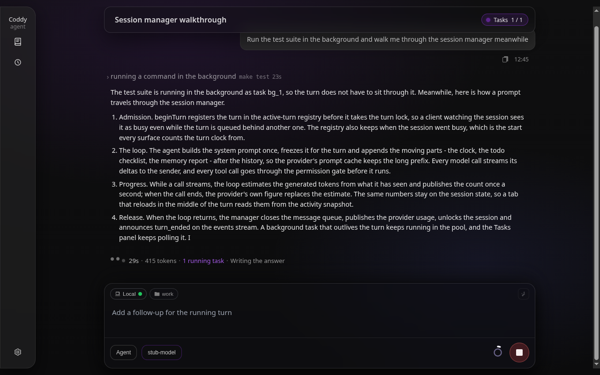

*Живая строка идущего хода - часы хода, сгенерированные токены, выполняющаяся фоновая задача и то, что делает агент*

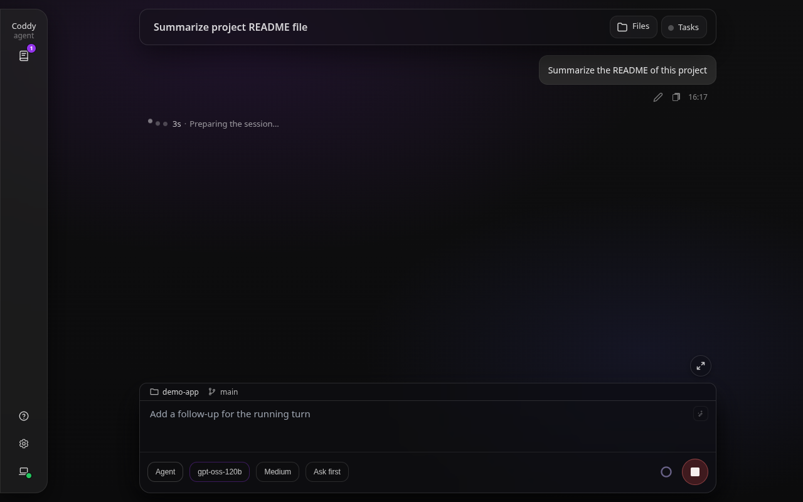

*Новый чат через три секунды после первого сообщения - сообщение на экране, у чата уже есть название, а живая строка говорит, что сессия готовится, пока запускается её MCP-сервер*

- Строку начинают числа самого хода - сколько он уже идёт, сколько токенов модель в нём сгенерировала и сколько фоновых задач выполняется прямо сейчас (`15m 08s · 13.5k tokens · 1 running task · Thinking…`). До первого токена в строке только часы и фраза (`57s · Waiting for the model`), а сегмент задач появляется, только пока что-то выполняется. Строка служит кнопкой и открывает [панель "Задачи"](../features/background-tasks.md#веб-интерфейс);
- Когда ход закончился, а запущенные им фоновые задачи ещё выполняются, точки остаются в конце транскрипта только со счётчиком (`1 running task`), без часов и токенов, потому что засекать время больше нечему. Они открывают ту же панель и исчезают, как только завершается последняя задача;
- Часы и токены берутся с сервера. Агент публикует `turn_progress` в потоке хода ([HTTP API](../reference/http-api.md)) и держит те же числа за `GET /coddy/sessions/{id}/activity`, который читает перезагруженная вкладка, поэтому часы продолжают с того же места. `chat/turnProgress.ts` сводит оба источника. Показание называет свой ход по серверному `startedAt` и датируется возрастом хода по часам сервера, поэтому побеждает более новое показание, каким бы путём оно ни пришло - ответ активности, прочитанный до последнего кадра потока и доставленный после него, отбрасывается, а ответ, который приторможенная браузером вкладка обработала на секунды позже, всё равно относится к тому же ходу. Вкладка сбрасывает числа, когда ход заканчивается, и при любом чтении активности, которое застаёт сессию в простое, поэтому следующий ход никогда не начинается с часов предыдущего. С сервером, который старше `turn_progress`, часы считают от сообщения пользователя этого хода, без токенов;
- Фраза текущего шага и счётчик шага, когда шаг выполняет что-то кроме модели, например вызов инструмента или запуск памяти (`2m 05s · 1.2k tokens · Running a command · 45s`). Ожидание, рассуждение и написание ответа покрывают часы хода. На телефоне строка занимает два ряда - фраза рядом с точками, а числа хода под ней подписью;
- **Строка несёт фазу шага и ничего о том, с чем он работает.** Ни пути, ни команды, ни шаблона, ни url - объект шага называется один раз, в строке транскрипта над строкой статуса. Поэтому каждая фраза закончена сама по себе (`Running a command`, но никогда `Running` в ожидании, что за ним последует команда), а фраза, которая читается как обрывок, не проходит проверку словаря ни в одной локали (`external/ui/src/ui/i18n/statusPhrases.test.ts`). Слишком длинная для строки фраза обрезается многоточием и не переносится;
- Приоритет - неотвеченный запрос разрешения → неотвеченный вопрос → выполняющийся вызов инструмента (вызов `in_progress` важнее объявленного позже `pending`) → идущее рассуждение (`Thinking…`) → идущий запуск памяти (`Working with memory`, по событиям `memory_run` потока; сам запуск - невидимый элемент `memory_run` хода, который ничто не отображает) → текст ответа как самая новая строка хода (`Writing the answer`) → ожидание модели. В строке всегда есть фраза, трёх голых точек не бывает;
- Два состояния с запросом **не** показывают счётчик шага, потому что, пока оператор решает, ничего не выполняется. Часы хода продолжают идти;
- Простое ожидание со временем усиливается - `Waiting for the model` → `The model is taking longer than usual` (15 с, `typing-dots-status--slow`) → `Still no response from the server` (60 с);
- До этого ход, который ничего не показал после своего сообщения, пишет `Готовлю сессию…`, пока сервер не сообщит, что ход говорит с моделью: первое событие `turn_progress` хода несёт фазу `preparing`, пока ход поднимает MCP-серверы и ждёт окно контекста модели (`withPreparingPhase` в `chat/liveStatus.ts`). Ожидание в это время не усиливается, потому что медлит не модель;
- Инструмент, который Coddy не определяет, получает общую фразу `Running a tool`. О вызове, который обслуживает MCP-сервер, она ничего не говорит, поэтому для него фраза называет сервер и инструмент (`Calling browser_navigate on the MCP server playwright`). Это идентификация шага, а не его аргументы; с чем работает вызов, видно в строке транскрипта выше, которая тоже называет сервер и инструмент;
- Вычисление просматривает строки назад до последнего `user_message`, поэтому устаревшая строка `in_progress` из завершённого хода никогда не управляет меткой. Консольный двойник таблицы фраз находится в `external/cli/status.go`.

## Карточка вызова инструмента (встроенный SPA, текущая версия)

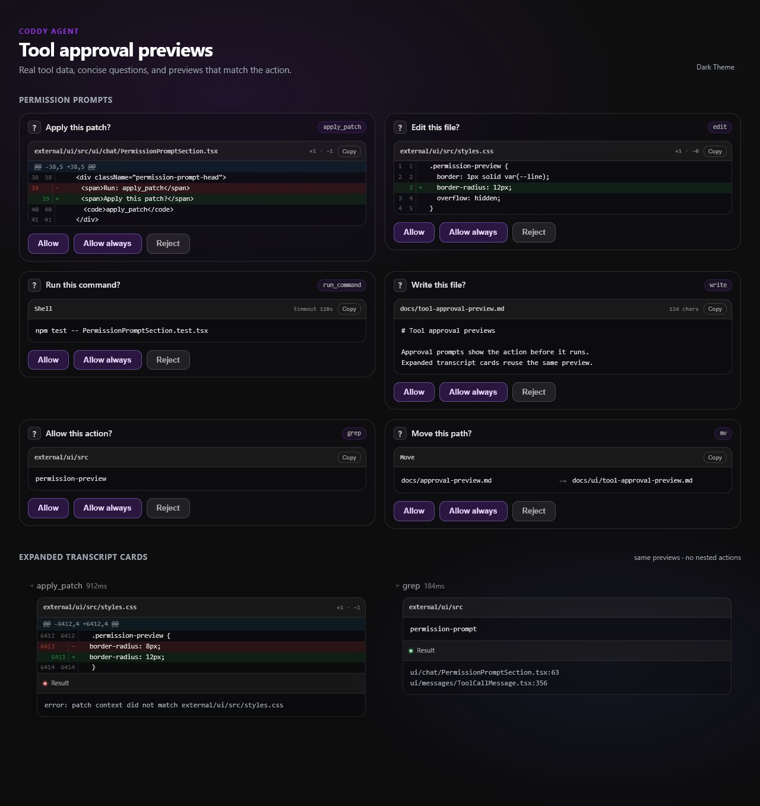

*Карточка разрешения для правки - дифф, который правка собирается применить, затем ответы и два переключателя сессии перед "Отклонить"*

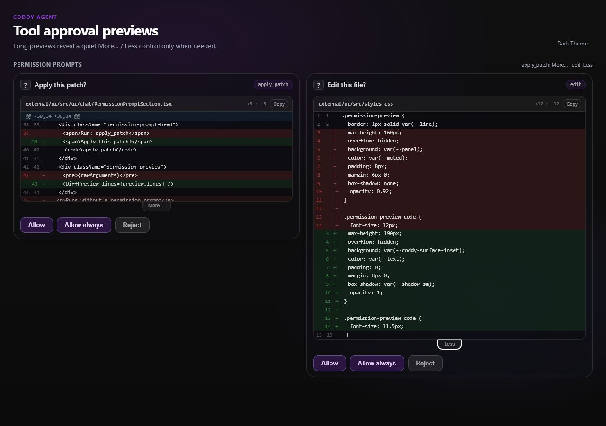

*Длинный результат инструмента, свёрнутый под "Ещё…" и развёрнутый кнопкой "Свернуть"*

У инструментов планировщика (`coddy_scheduler_*`) вместо JSON своя карточка. Шапка называет задание и то, что с ним произошло (*снято с паузы*, *запуск принят*, *не выполнялось*, *создано*, *изменено*, *удалено*), прочитанное или созданное задание показано своими полями (описание, расписание с расшифровкой человеческим языком, состояние, следующий запуск, режим, модель, папка) с инструкцией, отрисованной как Markdown, список заданий - строкой на задание, а запуски задания - строкой на запуск со статусом и длительностью.

Своя карточка есть и у любого другого встроенного инструмента, который отвечает в известной форме, и у каждого инструмента MCP-сервера (`StructuredToolCard.tsx`, разбор в `chat/structuredToolDisplay.ts`); она заменяет JSON-аргументы над текстом, который инструмент написал для модели:

- `http_request` показывает адрес, который он на самом деле запросил, вместе со строкой запроса, и всё, что меняет, куда ушёл запрос и чему он доверился, - заголовки вызова, где заголовки с учётными данными замаскированы (заголовки, которые `tools.http_request.default_headers` добавляет к каждому запросу, не входят в аргументы вызова, их перечисляет его запрос разрешения), тело (его вид, файл или поля формы и отправленный JSON или текст), прокси со скрытыми учётными данными, пропущенную проверку сертификата цветом ошибки, пройденные редиректы, таймаут, выходной файл и обоснование. Ответ (статус, замаскированные заголовки, тело моноширинным шрифтом, заметки инструмента) стоит под разделительной чертой;
- `switch_model` показывает модель, уровень рассуждения и срок действия так, как инструмент сообщил о них после переключения;
- инструменты `background_*` показывают по строке на задачу со статусом в формулировках панели задач, а `background_output` / `background_wait` - вывод моноширинным шрифтом; `preview_server` показывает свой адрес ссылкой, задачу и время остановки;
- `coddy_docs_search` даёт ссылку на каждое найденное место в читалке документации, а `coddy_docs_read` отрисовывает прочитанный раздел со ссылкой на него и диапазоном строк;
- `plan_list` / `plan_read` / `plan_write` показывают планы, имя и обзор плана над его телом и записанный план; `session_describe` - заголовок, теги и что изменилось; инструменты `config_*` - свой ответ полями, со значениями, которые сервер скрыл; инструменты `coddy_memory_*` - заметку `.md` как документ и результаты поиска строками; `keep_result` и `compact_context` - свои аргументы полями;
- вызов MCP-сервера показывает в шапке сервер и инструмент, аргументы полями, а ответ по его форме - JSON-объект полями, прочий JSON с отступами, Markdown как документ, всё остальное моноширинным текстом. Числа и JSON показываются так, как их написал сервер, и никогда не печатаются заново из разобранного значения. Идентификатор больше 2^53, например `12345678901234567891`, не округляется, повторный ключ даёт строку на каждое значение, а экранирование вроде `\u00e9` остаётся в JSON с отступами (`chat/jsonSource.ts`). То же относится к аргументам и к JSON-телу `http_request`.

Неудачный или отменённый вызов, а также вызов, аргументы которого не разбираются, сохраняет сырые панели. Усечённый ответ ограничивает тело карточки теми же кнопками **Ещё…** / **Свернуть**, поэтому шапка остаётся на виду.

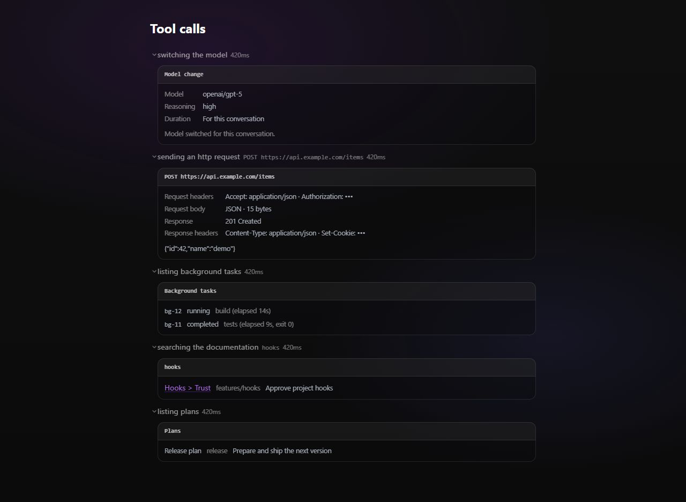

*HTTP-запрос, список фоновых задач и вывод задачи*


*Картинка, которую показали модели, в превью под строкой чтения*

`read`, который показал модели картинку ([Изображения](../features/images.md)), выводит её превью под своей строкой. Это одна карточка на картинку размером с отправленное вложение; она видна и при свёрнутой строке и открывает оригинал в том же просмотрщике изображений, что и читалка документации. Пока ход идёт, карточка берётся из `_meta.coddy.images` финального обновления вызова, после перезагрузки - из `files` строки инструмента, а байты идут через окружение, как у вложения, поэтому её показывают и удалённый сервер, и релей. Это копия, которую Coddy сохранил вместе с сессией, поэтому файл, перезаписанный позже, в превью выглядит так, как его видела модель. Карточка показывает миниатюру копии размером 160 px; картинку без миниатюры (WebP, который сервер не умеет декодировать, или изображение больше 16 мегапикселей, декодирование которого обошлось бы слишком дорого) карточка заполняет оригиналом. Неудачный `read` карточки не показывает.

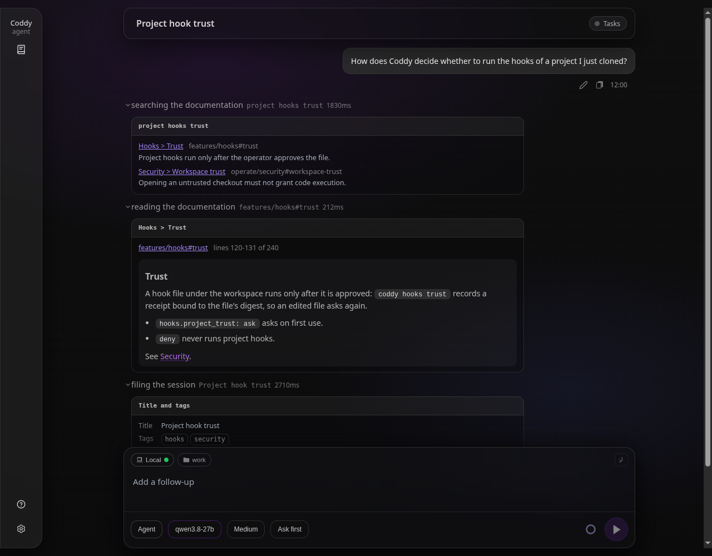

*Поиск по документации, прочитанный раздел, заголовок и теги сессии*

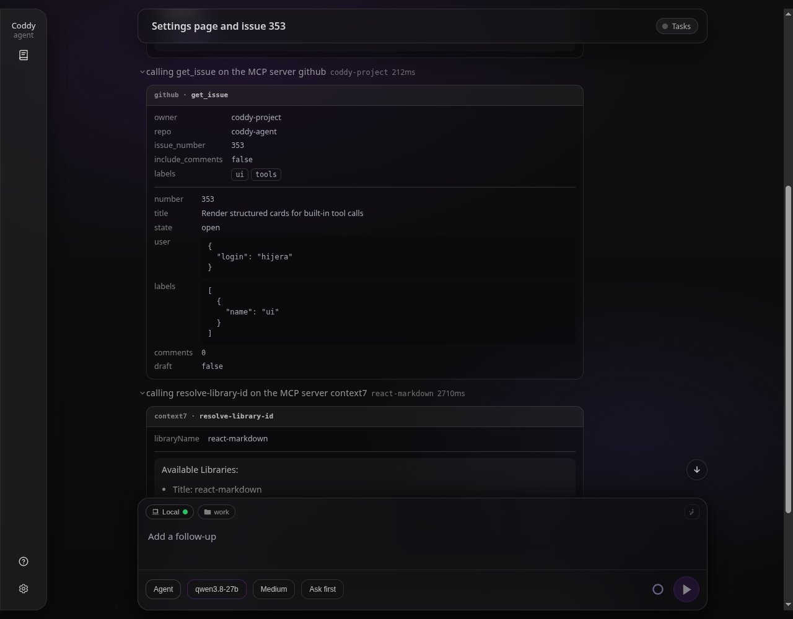

*Вызовы MCP - аргументы полями, под ними JSON-ответ, ниже Markdown-ответ*

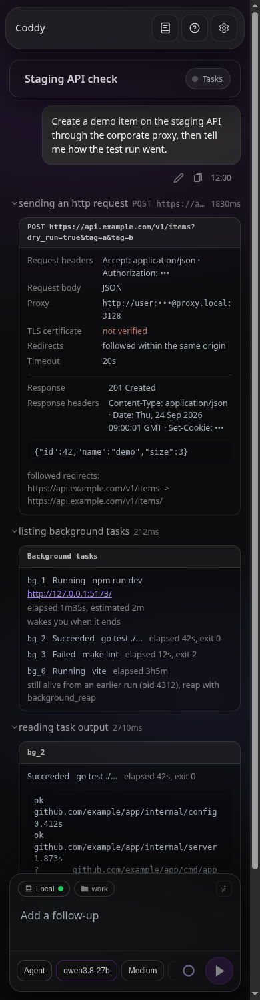

*Те же карточки на 390 px - шапка переносится на новую строку и не обрезает адрес*

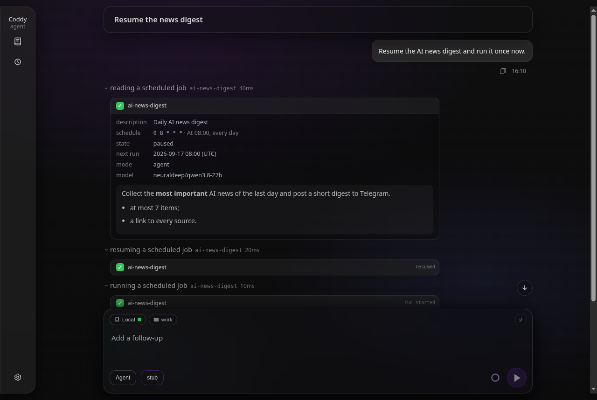

*Вызовы планировщика в транскрипте - прочитанное задание полями, снятие с паузы и запуск своим итогом*

`share_file` даёт агенту явный, защищённый разрешением способ передать оператору отчёт или другой файл рабочей папки. Успешный вызов отрисовывает под своей строкой карточку файла, который можно скачать. Браузер скачивает неизменяемую копию из бандла сессии, поэтому ссылка не следует за последующими изменениями в рабочей папке; в удалённом окружении то же действие получает файл через настроенный маршрут API с аутентификацией по bearer-токену. Отсутствующая копия остаётся на виду как недоступная и не превращается в битую картинку или ссылку.

Когда более поздний ответ ассистента ссылается на проверенные общие файлы, их карточки отрисовываются прямо в этом ответе. Соседние маркеры файлов образуют один адаптивный ряд, который переносится на узких экранах и оставляет отступ 16 px до следующего абзаца; ряд, которым заканчивается ответ, оставляет над кнопкой копирования и временем ответа только их собственный отступ 8 px. Размер карточки 134x140 px (на телефоне не больше 118x132 px, по две в ряд). Карточки изображений показывают миниатюру и открывают общий лайтбокс изображений по проверенному URL встроенного превью; у файлов других типов остаётся плитка их типа. У каждой карточки одно и то же меню действий - скачать, упомянуть, скопировать пути и показать исходный файл на сервере. Кнопка **⋮** стоит в правом верхнем углу на одном уровне с бейджем расширения в левом верхнем, появляется под указателем и всегда видна на телефоне и на любом другом экране без наведения. Меню открывается под ней (над ней у нижнего края окна), остаётся в пределах окна, следует за карточкой при прокрутке страницы и закрывается повторным нажатием **⋮**, нажатием в другом месте, **Escape**, **Tab** (фокус уходит с **⋮**) или когда карточка уходит из поля зрения - за пределы окна или под заголовок чата либо поле ввода. В окне ниже меню его пункты прокручиваются. Если сервер не смог показать файл, на карточке появляется **Не удалось показать**, а скачивание остаётся доступным. Щелчок правой кнопкой по карточке открывает то же меню.

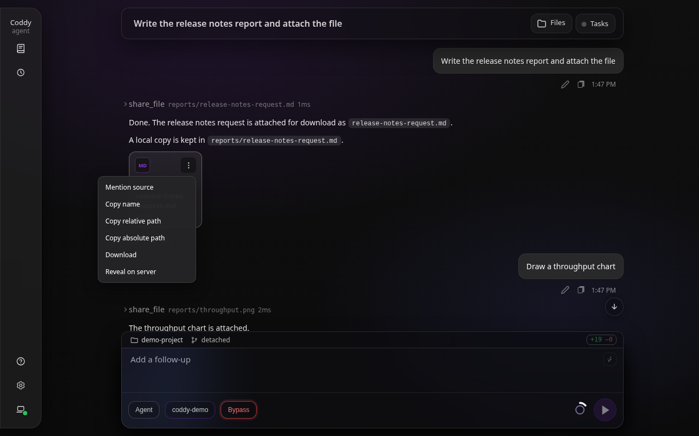

*Карточка общего файла внутри ответа, меню действий открыто под кнопкой*

У `spawn_agent` отдельная карточка аргументов - значок и имя агента, необязательное описание, бейдж таймаута с подписью и врезанная панель для многострочного промпта. Промпт сначала показан компактным превью; **Ещё…** открывает ограниченную по высоте прокручиваемую область, а **Свернуть** возвращает превью, поэтому длинная инструкция субагенту не захватывает транскрипт. Когда у запущенной задачи есть дочерняя сессия, карточка предлагает **Показать транскрипт**; то же действие есть под сохранённым выводом в открытой карточке фоновой задачи. Таймаут - переданный лимит выполнения в секундах; прошедшее время рядом с названием инструмента показывается отдельно. Раскладка переносится на узких экранах и следует активной светлой или тёмной теме. Вызовы с усечёнными в истории аргументами подгружают полные аргументы один раз на каждое неполное превью, включая выполняющиеся вызовы; при некорректных аргументах или неудачной загрузке остаётся простое превью аргументов. Подписи карточки следуют активной локали интерфейса, английской или русской.

На широкой боковой панели с подписями бейдж активных ходов стоит сразу после **История** или **Планировщик**; на боковой панели только со значками бейдж остаётся поверх значка. История считает активные ходы дочерних субагентов наравне с обычными активными чатами, но сами дочерние транскрипты в список истории по-прежнему не попадают.

Основной сценарий описан в `features/spawn_agent_card.feature`, его запускает godog-харнес `http,ui` через DOM-тест React в `SpawnAgentCard.test.tsx`. Граничные случаи покрывают некорректные аргументы, отсутствующие или некорректные таймауты, экранированный текст промпта и ошибку загрузки истории.

Эталонное поведение соответствует ленте инструментов в **`DESIGN.md`** и этому чек-листу.

| Аспект | Текущее поведение |
| --- | --- |
| Компонент | **`ToolCallMessage.tsx`** - **`thinking-row coddy-tool-call-row`**, **`details.thinking-details.coddy-tool-details`**, **`data-testid`** со значением **`tool-details-{toolCallId}`** |
| Сводка | Та же схема, что у **thinking** (**`thinking-summary`**, **`thinking-left`**, **`thinking-chevron`**), с **`thinking-label`**, **`.tool-summary-target`**, маркером ошибки **`.tool-failed-marker`** и **`thinking-dur`** внутри одного непереносимого **`.thinking-head`**; у **`run_command`**, ушедшего в фон, эта длительность - часы задачи (**`data-testid="tool-bgtask-elapsed-<id>"`**); **`aria-label="Tool summary"`** |
| Подпись | **`toolDisplayName`** (**`messages/toolDisplayName.ts`**) поверх записей словаря **`tool.name.*`**; имя вида **`server__tool`** (префикс **`mcp__`** допускается) читается через **`tool.name.mcp`** как *запускаю {tool} на MCP-сервере {server}*, а любой другой неизвестный идентификатор выводится как есть. **`background: true`** у **`run_command`** выбирает **`tool.name.run_command_background`** (*running a command in the background* / *выполняю команду в фоне*), причём только по полным аргументам |
| Аргументы | Общий **`PermissionToolPreview`** (без действий одобрения; единственная кнопка копирования - внутри блока shell-команды, **`data-testid="tool-preview-copy"`**); большие тела **write** / **write_file**, **apply_patch** и **edit** сохраняют измеряемые кнопки переполнения **Ещё…** (**`data-testid="tool-preview-more"`**) / **Свернуть** (**`data-testid="tool-preview-less"`**) |
| Результат | Обычный вывод использует **`div.tool-call-result-card`**, **`aria-label="Tool result"`**, с вложенным **`pre.tool-result-pre`** и без строки заголовка; завершённые структурированные карточки todo и **`plan_exit`** скрывают лишние шаблонные результаты; **`load_skill`** отрисовывает Markdown, а поддерживаемые инструменты и вызовы MCP используют **`StructuredToolCard`** (**`data-testid="structured-tool-card"`**) |
| Markdown | Не используется для пузырей **результата** инструмента и **пользователя**; **ассистент** по-прежнему использует Markdown, как описано ниже |
| Слияние списка | **`loadMessages`** в **`App.tsx`** вливает строки **`GET /coddy/sessions/{id}/tool-calls`** в **`resultText`**, **`resultWasTruncated`** и тайминги |
| Полный текст | Первое нажатие **Ещё…** у результата или автоматическое восстановление неполных аргументов у восстановленных карточек **`apply_patch`** / **`write`** / **`write_file`** / **`edit`** в любом статусе - **`GET /coddy/sessions/{id}/tool-calls/{toolCallId}`**, из JSON берутся **`result`** и **`args`** (тот же объект содержит **`meta`**). Сверка транскрипта никогда не заменяет полные аргументы усечённым до 200 символов **`argsPreview`** (**`pickRicherToolArgs`**), поэтому живые карточки сохраняют полные превью при ответах на запросы разрешений |
| Картинки | **`ToolImagePreviews.tsx`** под строкой, вне **`details`** - **`.tool-images`**, по одной **`button.tool-image-card`** на картинку (**`data-testid="tool-image-open"`**, миниатюра **`tool-image-thumb`**), которая открывает **`ImageLightbox`**; только у завершённого вызова, из **`images`** строки (**`_meta.coddy.images`** вживую, **`files`** строки инструмента после перезагрузки) |
| CSS | **`styles.css`** - **`.coddy-tool-call-row`**, прозрачный **`.coddy-tool-call-body`**, общие **`.permission-preview*`**, **`.tool-call-result-card`**, **`thinking-details:not([open])` со скрытым телом**, **`.tool-images`** / **`.tool-image-card`**, а также классы области результата и переключателя выше |

- `assistant_message`
  - Итоговый текст ассистента за ход, после вызовов инструментов;
  - Строку действий (**`.msg-assistant-foot`** - кнопка копирования и время) несёт только ответ, которым заканчивается ход. Ответы, которые ход оставляет между вызовами инструментов, отрисовываются одним текстом, потому что столбец одинаковых кнопок копирования и повторяющихся минут выглядит как элемент оформления и ничего не сообщает. У каждого завершённого хода своя строка, поэтому более старый ответ можно скопировать; её нет только у хода, который ещё идёт, потому что его последний ответ пока не окончательный.

## Карточка разрешения инструмента

Встроенный в транскрипт запрос одобрения реализуют **PermissionPromptSection** и **PermissionPromptPreview**.

- Отрисовывайте карточку только для ожидающего запроса разрешения. Инструменты только для чтения отрисовывают лишь свою обычную строку в ленте; информационной карточки без одобрения, галочки или поясняющей фразы нет;
- Заголовок - вопрос о действии человеческим языком и один бейдж с сырым идентификатором инструмента. Заголовок превью отведён под путь, shell или область операции, чтобы имя инструмента не повторялось;
- Действия используют подписи от сервера без изменений (**Разрешить**, **Всегда разрешать**, при необходимости **Всегда разрешать `<program>`**, **Отклонить**). Список вариантов отрисовывается из данных SSE, поэтому четвёртой кнопке не нужны изменения клиента, кроме раскладки;
- Пока сессия спрашивает разрешения, сервер добавляет перед **Отклонить** переключатели сессии - **Без вопросов до конца сессии** (**`allow_session_bypass`**, выделена красным, **`permission-prompt-btn--session-bypass`**) и для записи файла **Правки без вопросов до конца сессии** (**`allow_session_accept_edits`**, **`permission-prompt-btn--session-edits`**). Любой из них одобряет вызов и переключает сессию, а чип разрешений обновляется по событию настроек ([Настройки сессии](../features/session-settings.md#переключение-из-окна-разрешения));
- Вариант для всей программы доходит до клиента только для **run_command** с одним простым вызовом. Его подпись уже называет точное разрешение (**`curl`**, **`git status`**), поэтому карточка должна показывать её дословно и не выводить имя программы заново;
- Сопоставляйте запрос с его **tool_call** по **toolCallId** и берите в первую очередь **argsText** этой строки; если его нет, используйте содержимое **Arguments:** из данных запроса разрешения;
- Ход, который сервер разбудил сам, тоже спрашивает здесь. Его запрос приходит по релею поля ввода, за которым следит вкладка, сохраняется как ожидающий запрос сессии (поэтому перезагрузка восстанавливает его, как любой другой), и первый ответ от любого клиента (этой вкладки, другой вкладки, консоли, которая следит за ходом) его закрывает;
- **apply_patch** и **edit** отрисовывают колонки номеров старых и новых строк и строки добавления, удаления и контекста в цветах темы. Остальные инструменты, изменяющие файловую систему, и **run_command** используют компактные структурированные превью вместо JSON;
- Свёрнутое превью измеряется после раскладки. Показывайте **Ещё…** только при **scrollHeight > clientHeight**; держите область ограниченной, переключайте её на внутреннюю вертикальную прокрутку и меняйте кнопку на **Свернуть**. Возврат в свёрнутое состояние снова обрезает содержимое и заново измеряет переполнение. Общая кнопка выровнена по левому краю; на телефонах её минимальная высота **36 px**;
- Восстановленные запросы разрешения на запись включают **rm** и **rmdir** наравне с другими инструментами, изменяющими файловую систему.

Автоматические проверки:

- **external/ui/src/ui/chat/permissionToolPreview.test.ts**;
- **external/ui/src/ui/chat/PermissionPromptSection.test.tsx**;
- **external/ui/src/ui/messages/MessageList.test.tsx**.


## Редактирование сообщений и откат истории

Правка отправленного сообщения переписывает диалог на месте. История откатывается к этому сообщению, а исправленный текст отправляется в той же сессии - без параллельного диалога и без переходов между ветками.

- У каждого пузыря пользователя есть кнопка-карандаш (**`.msg-user-edit`**, **`data-testid="user-message-edit"`**, доступное имя **`Edit message`**) в **`.msg-user-foot`**, сразу слева от кнопки копирования и в том же оформлении **`.msg-copy-icon-btn`**; она всегда видна и стоит в потоке. Карандаш загружает сообщение обратно в черновик поля ввода (чипы вложений восстанавливаются из сохранённой аннотации ассетов сессии) и запоминает индекс редактируемого сообщения **пользователя**, считая с 0;
- Пока сообщение загружено для правки, поле ввода сообщает об этом. Баннер над карточкой (**`.composer-edit-banner`**, **`data-testid="composer-edit-banner"`**) называет сообщение (**Правка сообщения**, начало его текста, *При отправке разговор откатится к этому сообщению*), доступное имя кнопки отправки становится **Отправить правку**, пузырь обводится рамкой (**`.msg-user-stack--editing`**), а все строки после него бледнеют, потому что отправка удалит именно их. **Escape** в поле (если его не перехватил ни один список выбора и ни одна всплывающая панель) или крестик баннера (**`data-testid="composer-edit-cancel"`**) выходит из правки и возвращает черновик и вложения, которые заменил карандаш; второй карандаш переключает сообщение и сохраняет тот же черновик для возврата. Отправка правки тоже возвращает этот черновик, поэтому продолжение, написанное до нажатия на карандаш, не теряется;
- Отправка этого черновика вызывает **`POST /coddy/sessions/{id}/rewind`** с **`{"userMessageIndex"}`**. Черновик и состояние правки сохраняются, пока откат не завершится; неудачный запрос появляется строкой ошибки в UI-логе, и ничего не теряется;
- При **200** клиент отбрасывает теневой транскрипт и сохранённые запросы разрешений удалённого хвоста, перезагружает оставшееся начало из **`GET .../messages`** и отправляет исправленный текст следующим ходом той же сессии;
- Сервер обрезает **`messages.json`** в точке правки, переносит записи **`tool_calls/`** и строки **`ui_log`** удалённых ходов в снимок для отмены (**`rewind_undo/`**, он удаляется, когда его упраздняет более поздний промпт или другой откат) и снимает ожидающий запрос разрешения, вызов инструмента которого ушёл из транскрипта. **`session_rewound`** в **`GET /coddy/events`** говорит всем остальным вкладкам и интерфейсам, где открыта сессия, перезагрузиться так же;
- Отправленную правку можно отменить, пока **`GET .../messages`** возвращает **`rewindUndo`**. У исправленного промпта в нижней строке есть **Отменить правку** (**`.msg-user-undo-edit`**, **`data-testid="user-message-undo-edit"`**), а на месте баннера написано **Сообщение изменено** с кнопкой **Отменить** (**`data-testid="composer-undo-banner"`**; крестик скрывает баннер для этой правки, кнопка у промпта остаётся). Отмена останавливает исправленный ход, если он ещё идёт, вызывает **`POST /coddy/sessions/{id}/rewind/undo`** и перезагружает транскрипт; отказ показывается строкой ошибки. Отправка следующего промпта закрывает возможность отмены, как и на сервере. Изменения файлов, сделанные удалёнными ходами, не откатываются, и обе кнопки об этом говорят.

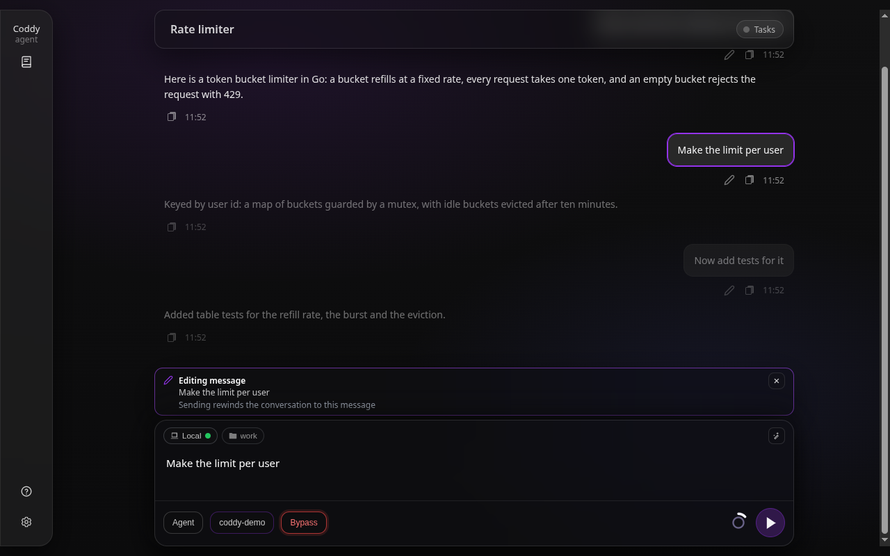

*Правка отправленного сообщения - баннер называет его, пузырь обведён рамкой, а ходы, которые удалит отправка, бледнее остальных.*

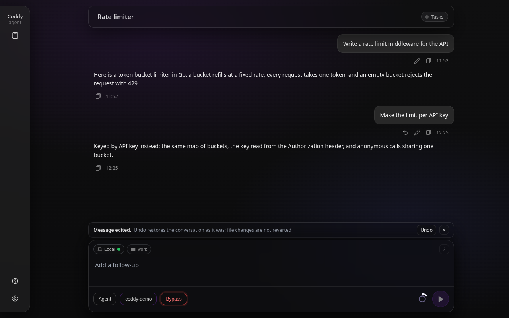

*После отправки правки кнопка "Отменить" у промпта и в баннере возвращает диалог в прежнее состояние.*

Автоматические проверки:

- **internal/session/rewind_test.go** (обрезка на месте, очистка артефактов, отказы);
- **features/session_rewind.feature** + **external/httpserver/bdd_rewind_test.go** (основной сценарий эндпоинта);
- **external/ui/src/ui/messages/userMsgIndices.test.ts** (индекс, который называет правка, пробуждение считается ходом);
- **external/ui/src/ui/messages/MessageList.test.tsx** (индекс, который называет правка, когда транскрипт содержит только конец длинной истории, см. **Длинные сессии**);
- **external/ui/src/ui/messages/UserMessage.test.tsx** (видимость кнопки правки, отметка редактирования, "Отменить правку");
- **external/ui/src/ui/chat/Composer.editBanner.test.tsx** (баннеры правки и отмены, Escape, имя кнопки отправки);
- **external/ui/src/ui/App.messageEdit.test.tsx** (выход из правки возвращает черновик, "Отменить" восстанавливает диалог);
- **internal/session/rewind_undo_test.go**, **features/session_rewind_undo.feature** и **external/httpserver/coddy_rewind_undo_test.go** (сохранённый хвост, когда заканчивается возможность отмены, остановка исправленного хода).

## Панель фоновых задач

Скриншот - `docs/assets/screenshot-fullhd-tasks.png`.

Панель закреплена **внутри сессии**, справа от транскрипта (`.bgtasks-panel`), и не выезжает из оболочки приложения, потому что задача принадлежит чату, который её запустил. При `min-width: 1200px` колонка чата уступает только ту ширину, которую панель действительно занимает, поэтому на широком окне транскрипт и поле ввода остаются на месте, когда панель открывается. Маршрут - `#/s/<sessionId>/tasks`, поэтому перезагрузка восстанавливает чат вместе с панелью; закрытие возвращает в адрес `#/s/<sessionId>`. Ссылка с задачей (`#/s/<sessionId>/tasks/<task_id>`) по-прежнему открывает её карточку, после чего идентификатор из адреса убирается. Данные берутся из `/coddy/sessions/{id}/background-tasks*` (см. `docs/features/background-tasks.md`).

- Панель **опрашивает** сервер, а не слушает SSE, потому что фоновая задача живёт дольше хода, который её запустил. Опрос идёт каждые 2,5 с, пока что-то выполняется, и каждые 15 с в остальное время. Опрос недоступного сервера даёт обычный результат с ошибкой и никогда не приводит к необработанному отклонению промиса;
- **Каждая задача - одна карточка** (`TaskCard`). В ней точка статуса, тег (`taskTag`, то есть `shell`, имя агента, `memory` или `server`), заголовок (`taskTitle`, то есть команда или описание запуска агента без префикса `agent <name>:`, который пишет пул) и строка метаданных (`taskMetaLine`, то есть прошедшее время против оценки, пока задача идёт, и `20s · 12:50` после; итог передаёт цвет точки, а словами он назван только в нижней строке открытой карточки). У запуска агента справа в строке метаданных стоят модель и токены, которые потратили его вызовы (`agentUsage` - `agent.model` по короткому имени, `agent.input_tokens` плюс `agent.output_tokens`); если места на оба значения не хватает, они целиком переносятся под статус. Полный идентификатор модели и разбивка на входные и выходные токены вынесены в `title` кнопки открытия. Под ними, отдельной строкой, карточка даёт путь внутрь задачи, и не больше одного. У запуска агента это кнопка **Показать транскрипт** (`.bgtask-card-transcript`, `data-testid="bgtask-open-transcript-<id>"`), которая открывает дочернюю сессию по `#/s/<child id>` так же, как выбор в истории; у работающего сервера превью это его адрес (`.bgtask-card-link`, `data-testid="bgtask-link-<id>"`, `target="_blank"`, `rel="noopener noreferrer"`), который открывает страницу в новой вкладке и, если он длинный, переносится целиком, а не обрезается. Раскрывать карточку ради них не нужно, и, как кнопка остановки, оба элемента лежат поверх собственной кликабельной поверхности карточки, поэтому никогда её не раскрывают. Кнопка "Показать транскрипт" неактивна, пока в строке нет `agent.session_id`, и её подсказка объясняет почему; у остановленного сервера адреса нет, потому что страницы, на которую он указывал, больше не существует. Карточки выполняющихся задач стоят сверху без собственного заголовка (всё, что выше счётчика **Завершённых: N**, выполняется) и добавляют кнопку остановки, **колокольчик** после заголовка (`.bgtask-notify`, `data-testid="bgtask-notify-<id>"`, `title` и доступное имя *Разбудит агента, когда завершится*), если у задачи есть `notify_on_finish`, и полосу прогресса, но только если модель передала `expected_seconds`. Завершённая карточка сохраняет колокольчик с подписью *Разбудила агента, когда завершилась*, если в строке есть `woke_agent` (окончание задачи запустило ход). Разбуженный ход ничего не показывает в транскрипте, поэтому именно карточка сообщает в веб-интерфейсе, что разбудило агента;
- **Карточка - один элемент управления и раскрывается на месте.** Кнопка открытия растянута на всю сводку карточки, поэтому щелчок в любом месте раскрывает карточку, а сводка подсвечивается под указателем; кнопка остановки - соседний элемент поверх этой поверхности и карточку никогда не переключает. Открытая карточка показывает команду с кнопкой копирования (у запуска агента и у сервера превью shell за ними нет, и там ничего не показывается), ошибку, если она не просто повторяет код выхода (`taskErrorText`), вывод в блоке с собственной прокруткой, а после завершения задачи - нижнюю строку с итогом и кодом выхода (`Failed · Exit code 2`; у запуска агента и сервера превью кода выхода нет, потому что пул выставляет им синтетический код). Длительность задачи и путь внутрь неё относятся к сводке и внутри карточки не повторяются. Открытых карточек может быть сколько угодно, каждая читает свой вывод через `loadOutput` панели (каждые 2,5 с, пока задача идёт, и ещё раз, когда она заканчивается); отдельной панели подробностей нет. Какие карточки открыты, хранит состояние панели, а не адрес. Маршрут - `#/s/<id>/tasks`, а ссылка, которая всё ещё называет задачу (`#/s/<id>/tasks/<task_id>`), открывает эту карточку через проп `focus` панели, после чего идентификатор из адреса убирается. Указатель привязан к своему чату и срабатывает один раз (`onFocusHonoured`). Каждая сессия нумерует задачи с `bg_1`, а панель размонтируется вместе с выдвижной областью, поэтому указатель, сохранённый оболочкой, снова открыл бы карточку при следующем открытии панели, в каком бы чате это ни случилось;
- **Завершённых: N** - это счётчик. Раскрыв его, вы видите те же карточки, не больше 40 отрисованных, с пометкой о том, что остаётся на диске. Открытая карточка показывается, где бы она ни стояла, поэтому ссылка на раннюю задачу длинной сессии не открывает карточку, которую никто не увидит, а открытая карточка, задача которой только что закончилась, раскрывает раздел вместе с собой. **Очистить** удаляет историю завершённых задач сессии;
- Порядок определяется только временем старта, новые сверху, и среди живых карточек, и внутри истории завершённых;
- Панель **открывает** кнопка **Задачи** у правого края закреплённой шапки чата (`chat-views-tasks`), а не пункт боковой панели. Кнопка отрисовывается с первого сообщения (`Tasks`), добавляет `running / total`, как только у чата появляются задачи (`Tasks 1 / 3`), работает как переключатель с `aria-pressed` и на ширине телефона сохраняет точку и числа. Пока идёт ход, живая строка статуса называет выполняющиеся задачи и открывает ту же панель. Обе считают через `countTasks` (`tasks/taskStatus.ts`), который не учитывает системные задачи вроде прогона памяти за ход. Под транскриптом ничего не отрисовывается;
- При `max-width: 1199px` панель занимает весь экран, у карточек больше внутренних отступов, кнопка остановки вырастает до 30 px, а блок вывода - до 46vh;
- Строка транскрипта с `run_command`, который запустил задачу, читается как любая другая строка команды. Подпись говорит, что это фоновый запуск (*выполняю команду в фоне*), а место длительности занимают идущие часы задачи вместо бессмысленных `0ms` вызова. Итога на строке **нет** - статус, оценку, код выхода и ошибку смотрят в карточке задачи на этой панели. Раскрытая строка сохраняет часы и не добавляет кнопок управления задачей - остановить задачу можно на её карточке. Всё это обновляется тем же опросом;
- Задачу агента можно прочитать, не открывая карточку, потому что модель, токены, прошедшее время и **Показать транскрипт** есть на свёрнутой карточке. Открытие добавляет только живой журнал прогресса дочерней сессии, который заканчивается блоком `=== subagent report ===`. Сервер превью читается так же (его адрес есть на свёрнутой карточке), а открытие добавляет только журнал запросов.

Автоматические проверки:

- **external/ui/src/ui/tasks/taskStatus.test.ts** (тайминги, прогресс, просрочка, частота опроса, порядок по времени старта, группировка, вспомогательные функции задач агента);
- **external/ui/src/ui/tasks/BackgroundTasksPanel.test.tsx** (одна форма карточки для любой задачи, тег и заголовок, карточка как один элемент управления с отдельной кнопкой остановки, раскрытие на месте с командой, копированием, выводом и нижней строкой, несколько открытых карточек одновременно, карточка, на которую указывает оболочка, повторное чтение вывода, пока задача идёт, счётчик завершённых, "Очистить", "Показать транскрипт" на свёрнутой карточке и только один раз, пустое состояние и состояние ошибки);
- **external/ui/src/ui/tasks/api.test.ts** (пути, заголовки, работа без сети);
- **external/ui/src/ui/chat/ChatHeader.test.tsx** (кнопки видов - "Файлы" и "Задачи" в таком порядке и без кнопки "Правки", "Задачи" с точкой и `running / total` без системных задач, значок, короткое имя и подсказка, `aria-pressed`), **external/ui/src/ui/changes/workingCopy.test.tsx** (одно чтение отчёта git на чат, повторное чтение по сигналу сервера, после завершённого вызова инструмента и при возврате фокуса на страницу) и **ChatScreen.test.tsx** (переключатель, счётчик на плашке только пока git сообщает об изменениях, ничего под транскриптом);
- **external/ui/src/ui/tasks/backgroundTaskCss.test.ts** (закрепление панели, тег, растянутая кликабельная поверхность с кнопкой остановки над ней, подсветка при наведении, ограниченный блок вывода, кнопка в шапке, живая строка на телефоне, уменьшенная анимация);
- **external/ui/src/ui/messages/ToolCallMessage.test.tsx** (фоновая строка - её подпись, часы задачи на месте длительности и отсутствие итога на строке).

### Определения субагентов

**Настройки > Субагенты** - гибридная вкладка, как "Навыки" (вид раздела `subagents` в `settingsSections.ts`, `SubagentsSection.tsx`). Форма раздела конфигурации `subagents`, построенная по схеме (`enable`, `dirs`, `project_trust`, `max_concurrent`, `max_depth`, `default_timeout_seconds`, `max_turns`; подписи из `settings.schema.subagents.*`), сохраняется вместе с остальным документом, а под ней группа полей **Определения** перечисляет каталог `GET /coddy/subagents` для рабочей папки чата на экране (`chatWorkspacePath` из `App.tsx` - папка сессии или папка, выбранная до первого сообщения; без неё сервер отвечает для своей рабочей папки по умолчанию). Сам путь вкладка не показывает.

- Каждая строка использует оформление списка MCP - имя, бейдж области (`built in` / `yours` / `from the project`), `hidden`, описание простым текстом и файл;
- При `project_trust: ask` у проектного определения есть щит, как на вкладке MCP (`subagent-trust-<name>`), - янтарный, пока определение не одобрено, и обычный после одобрения. Щелчок по нему одобряет файл для этой рабочей папки через `POST /coddy/subagents/{name}/trust` с `digest`, который показывала строка, поэтому файл, который чекаут с тех пор переписал, отклоняется (409), а ошибка показывается над списком; щелчок по одобренному щиту отзывает расписку. После любого из этих действий список читается заново. У определения, которое ещё ждёт расписки, есть и янтарный бейдж `needs approval`, подсказка которого называет щит и `coddy agents trust <name>`. У встроенных и пользовательских определений, а также у любого определения при `allow` или `deny` щита нет;
- **Заявленные ограничения**, свёрнутые в каждой строке (`subagentDeclaredFacts` в `settings/subagentCatalog.ts`) - модель, режим, разрешения, инструменты, запреты, таймаут, максимум ходов, отсоединённый запуск и размер инструкций; каждое незаявленное ограничение показано как унаследованное. Длинные пути и списки инструментов переносятся внутри панели (правила `.settings-subagents-section`) и не расширяют её.


Фоновый субагент, которому нужно разрешение уже после окончания хода, который его запустил, спрашивает в чате родительской сессии. Запрос ждёт в конце диалога в той же карточке, что и встроенный запрос, а субагент назван в её шапке (`SubagentPermissionCards`, `chat/SubagentPermissionCard.tsx`). Чат читает запрос из `pending_permission` в строках фоновых задач сессии, перечитывает эти строки по событию `subagent_permission` из `GET /coddy/events` (запасной вариант - опрос задач) и отвечает **дочерней** сессии через `POST /coddy/sessions/{child}/permission`. Запрос, на который сначала ответили в другом месте (в консоли, подключённой через `--remote`, в чате Telegram), исчезает из чата при следующем чтении. См. `docs/features/subagents.md` (отсоединённые запуски). Запрос, который дочерняя сессия подняла, пока родитель ещё отвечал, сначала показывается встроенной карточкой этого хода; если ход заканчивается раньше, чем на запрос ответили, релей отзывает эту копию и поднимает запрос снова в конце чата, поэтому встроенная карточка уходит вместе со своим потоком, а отвечает карточка в конце.

Несколько запросов сохраняют отступ транскрипта 10 px. Новый запрос прокручивается в поле зрения, если вы следите за концом чата; при чтении старых сообщений позиция сохраняется. Обычные обновления задач не сдвигают видимую область.

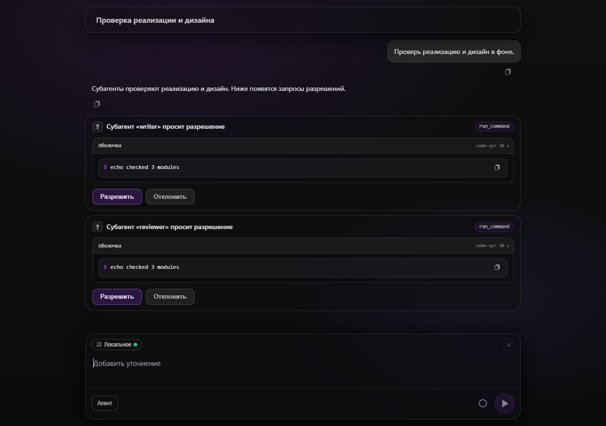

*Настоящий ChatScreen с двумя детерминированными строками ожидающих задач, тема Dark, ширина 1280 px.*


Автоматические проверки:

- **external/ui/src/ui/settings/subagentCatalog.test.ts** (унаследованные и заявленные сведения, форматирование, ключи бейджей области);
- **external/ui/src/ui/settings/subagentsApi.test.ts** (рабочая папка в запросе, нормализованный каталог, сообщения об ошибках сервера, работа без сети);
- **external/ui/src/ui/settings/SubagentsSection.test.tsx** (строки с областью, описанием и файлом, щит проектного определения при ask, который одобряет файл с показанным digest и отзывает расписку, отклонённое одобрение, отсутствие щита при allow или deny и у встроенного или пользовательского определения, бейдж needs approval, заявленные ограничения под раскрывающимся блоком, ошибка загрузки, русские тексты);
- **external/ui/src/ui/settings/subagentsCatalogCss.test.ts** (каталог не выходит за пределы панели, колонка подписей сведений, янтарный бейдж);
- **external/ui/src/ui/settings/SettingsSection.test.tsx** (вид subagents сохраняет свою форму и запрашивает рабочую папку сессии);
- **external/ui/src/ui/chat/SubagentPermissionCard.test.tsx** (ответ дочерней сессии, только ожидающие задачи и старые первыми, ничего, пока никто не ждёт, префикс заголовка, русские тексты);
- **external/ui/src/ui/chat/ChatScreen.test.tsx** (запрос ждёт в конце родительского чата, а ответ перечитывает задачи);
- **external/ui/src/ui/chat/serverEvents.test.ts** (кадр `subagent_permission` называет чат, к которому относится);
- **external/ui/src/ui/chat/relayedPermissionPrompts.test.ts** (неотвеченные запросы, которые завершённый ход переслал за своих субагентов, уходят вместе с его потоком; собственные запросы родителя остаются).

### Хуки

**Настройки > Хуки** - вкладка объекта, построенная по схеме (`settings-tab-hooks`). Это раздел конфигурации `hooks` (`enable`, `files`, `project_trust`, `default_timeout_seconds`, `stop_loop_limit`, `max_output_chars`) с локализованными подписями и описаниями (`settings.section.hooks.*`, `settings.schema.hooks.*`) и значениями по умолчанию из `SchemaExampleConfigJSON` в качестве плейсхолдеров. Сами определения хранятся в JSON-файлах (`docs/features/hooks.md`); вкладка задаёт, откуда они читаются и как проверяется доверие к файлам проекта.

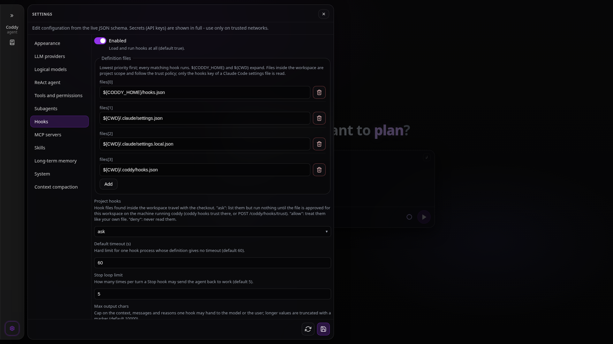

Задержанный файл хуков проекта появляется в транскрипте как **системная строка уровня notice**. `GET /coddy/sessions/{id}/messages` передаёт её в `uiLog` с `level: "notice"`, а SPA отрисовывает тем же `SystemNoticeMessage`, что и строку ошибки (элемент транскрипта `system_notice`, `level: "notice"`), но в более спокойной синей палитре, с `role="status"` вместо `role="alert"`, с кнопкой копирования и **без кнопки повтора**, даже если строка последняя. Строки любого другого уровня остаются невидимыми, чтобы не отрисоваться неправильно.

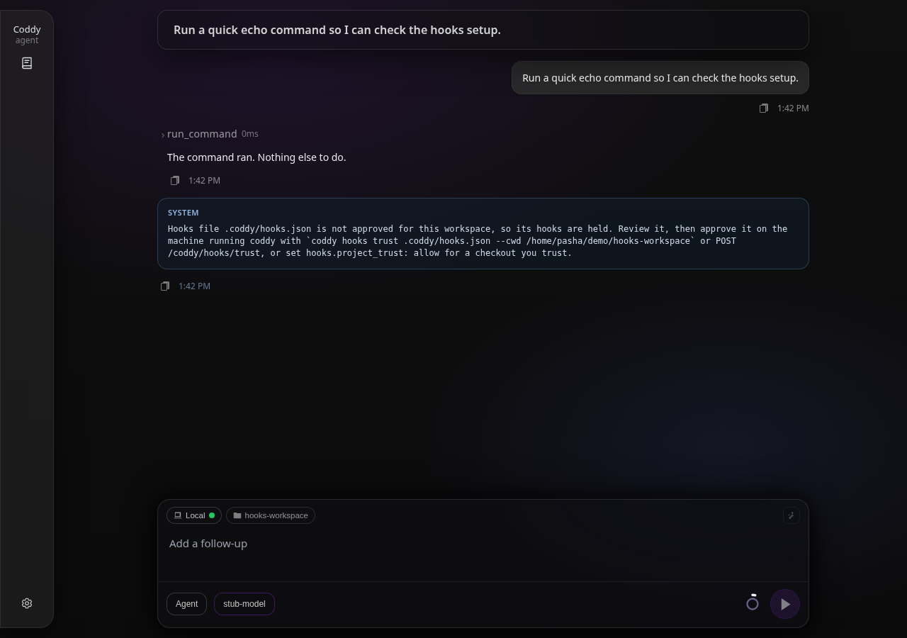

- **external/ui/src/ui/messages/SystemNoticeMessage.test.tsx** (строка notice - роль status, класс notice, без повтора);
- **external/ui/src/ui/settings/settingsSections.test.ts** (переведённые подпись и описание вкладки конфигурации `hooks`).

## Виды чата

Помимо диалога, у чата есть три вида - его **файлы**, **фоновые задачи** и **правки**.
Файлы и фоновые задачи открываются кнопками в ряд вверху чата - **Файлы** и **Задачи** у
правого края. На десктопе и планшете "Файлы" - значок с коротким названием; телефон
показывает только значок, размером с кнопки своей верхней панели. "Задачи" - тот же
элемент, что всегда был в шапке, то есть точка и, когда у чата появляются задачи, число
выполняющихся из общего числа; точка горит, пока идёт работа. У каждой кнопки полное
название в подсказке, у "Файлов" - вместе с сочетанием клавиш. Кнопка открывает свой вид,
а повторное нажатие его убирает; кнопка показанного вида становится ярче (текст, рамка и
фон), как кнопка под указателем, а акцентный цвет оставлен для выполняющихся задач.
Фоновые задачи открываются в правой панели рядом с чатом, файлы - в окне поверх чата.
У правок нет кнопки в шапке, их открывает счётчик git на [плашке над
полем ввода](#плашка-над-полем-ввода). Каждый значок рядом со словом выровнен по
середине строчных букв, а не прописных, потому что слова в основном из строчных букв, а
значок, выровненный по середине строки, кажется на пиксель выше.

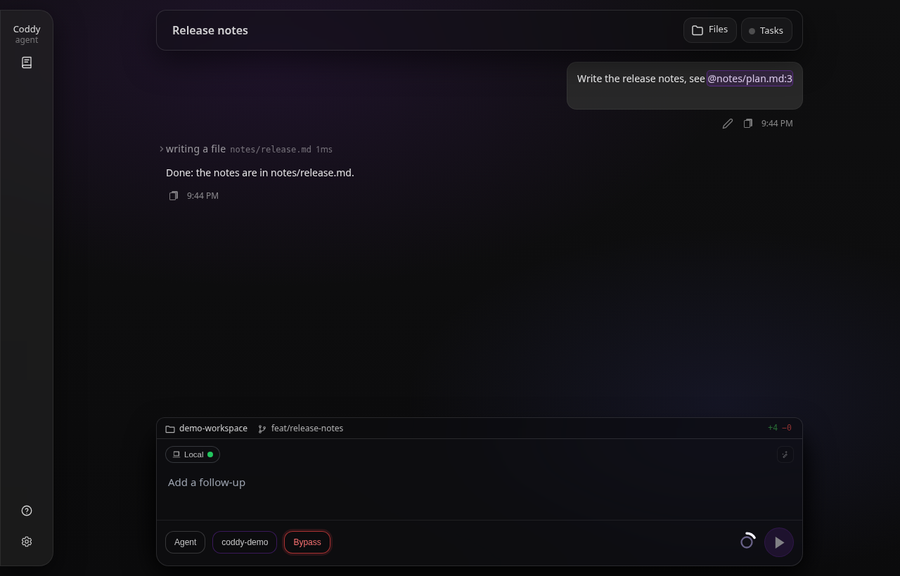

*Кнопки видов вверху чата и плашка над его полем ввода*

На телефоне - [390 px](../../assets/views-toolbar-dark-390.png). `Ctrl+Shift+F`
(`Cmd+Shift+F` на Mac) открывает и закрывает окно "Файлы" из любого места чата,
включая поле ввода.

## Файлы рабочей папки

Окно **Файлы** показывает рабочую папку сессии поверх чата так же, как читалка
документации, - дерево слева, открытые из него файлы вкладками справа. Откройте его
кнопкой **Файлы** в шапке чата, сочетанием `Ctrl+Shift+F` или щелчком по упоминанию из
рабочей папки в отправленном сообщении либо по пути файлового инструмента. Адрес окна
хранит файл и необязательную строку, `#/s/<id>/files?path=notes/readme.md&line=15`,
поэтому перезагрузка открывает его там же. Escape или кнопка закрытия возвращает к чату
и отдаёт фокус тому, что открыло окно; всё, что показывала правая панель, остаётся под
окном, в том числе на телефоне и планшете, а щелчок рядом с окном закрывает его так же.
При повторном открытии окно показывает файлы, которые были открыты, каждый на своей
строке, а адрес называет показанный.

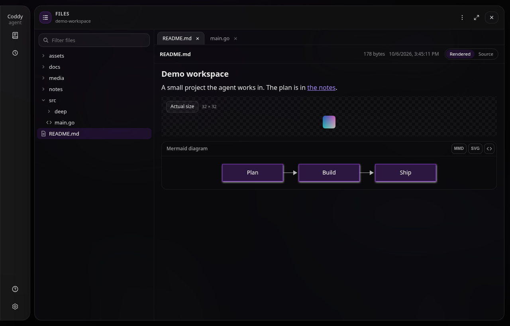

*Окно "Файлы" поверх чата - папки в дереве первыми, открытые файлы вкладками*

Дополнительные снимки - [светлая тема, 1280 px](../../assets/workspace-files-window-light-1280.png)
и [телефон, 390 px](../../assets/workspace-files-window-dark-390.png).

Дерево перечисляет сначала папки, потом файлы и загружает каждую папку при её открытии.
Фильтр над ним ищет **по имени во всей рабочей папке**, включая папки, которые никто не
открывал, по тому же индексу, что и выбор `@` в поле ввода; Escape очищает фильтр. Меню
**⋮** окна показывает скрытые файлы (dotfiles, `node_modules`, `vendor`), переносит
длинные строки, а показанный файл перечитывает, копирует его путь или скачивает его.
Переключатель скрытых файлов не ограничивает доступ, и явный путь в рабочей папке может
открыть скрытый файл и без него. Символьные ссылки и специальные файлы помечены ↗ и не
открываются. Переключатель дерева слева в шапке сворачивает дерево, а стрелки справа
разворачивают окно на весь экран. Открытые файлы остаются открытыми, пока живёт
страница, поэтому после закрытия и повторного открытия окна они на прежних местах.
Вкладки, которые не помещаются, прокручиваются вбок колесом или свайпом, а показанная
вкладка прокручивается в поле зрения.

Открытый файл - только его содержимое, без надстроек. Вкладка называет файл, поэтому
окно не показывает ни второго имени, ни размера, ни времени, ни переключателя видов.
Текстовые файлы показаны пронумерованными окнами строк с подсветкой, номер строки стоит на
одном уровне с её текстом; к строке, которую называет адрес или ссылка, окно
прокручивается, но не выделяет её, потому что пока файл можно только читать. Длинный файл
прокручивается целиком, без прежнего лимита 512 КиБ на файл. Следующие строки читаются,
когда вы подходите к концу показанных, поэтому переключать страницы не нужно. Markdown
показывается как любой другой текст, то есть исходником строка за строкой, поэтому
картинка или HTML в нём - просто строка для чтения, и ничего не загружается и не
выполняется. У растровых изображений есть кнопки "Вписать изображение" и "Исходный
размер"; изображения больше 20 МиБ по-прежнему можно скачать.

Аудио и видео используют нативные элементы управления и диапазоны байтов, в том числе на
удалённом сервере с аутентификацией и через релей роя, который передаёт узлу временный
подписанный адрес файла, не ручаясь за него ([Рой](../operate/swarm.md)). Адрес
истекает через час; **Перечитать** обновляет его. PDF и неподдерживаемые двоичные
форматы можно безопасно скачать. PDF остаётся загрузкой, потому что встроенный
просмотрщик в песочнице работал не во всех трёх поддерживаемых браузерных движках.

Возврат на страницу или завершение вызова инструмента заново проверяет открытый файл и
открытые папки. Неизменившийся файл не перечитывается, поэтому текст остаётся на месте, а
звук или видео продолжают играть; изменившийся файл показывает *Файл изменился. Превью обновлено.* и
начинается заново сверху, а не смешивает строки разных версий. Папки сохраняют строки,
добавленные кнопкой **Загрузить ещё файлы**, а исчезнувшая папка сворачивается. Фильтр
предлагает только файлы рабочей папки и никогда не предлагает пути выше неё или в других
местах диска. Выбранные удалённые окружения действуют и на превью файлов, и на миниатюры изображений сессии. На телефоне окно показывает дерево или файл, что-то одно;
файл, выбранный в дереве, занимает его место, а переключатель дерева возвращает дерево.

## Правки чата

Правки чата - то, что git сообщает о его папке, то есть каждый отслеживаемый файл,
который отличается от `HEAD`, в индексе или нет, и каждый новый файл, который git не
игнорирует. По ходам ничего не записывается, поэтому файл, записанный инструментом
`edit`, shell-командой или редактором рядом с Coddy, выглядит одинаково, а у папки вне
git-репозитория правок нет. Если бинарника `git` нет в PATH, сервер отвечает через
встроенную реализацию (go-git); она не распознаёт переименования, поэтому переименование
в индексе выглядит как удаление плюс добавление.

- Данные приходят из `GET /coddy/sessions/{id}/changes`. Одна копия на чат
  (`changes/workingCopy.ts`) обслуживает все виды, где эти данные показываются, - счётчик git на
  плашке над полем ввода и окно правок. Она читается при
  открытии чата, после каждого хода любого чата (`event: turn_ended` в
  `GET /coddy/events`, какой бы интерфейс ни выполнял ход; чаты делят папки, поэтому ход
  другого чата меняет и этот), после отмены правок (`event: session_changes`),
  вскоре после серии завершённых вызовов инструментов и когда страница снова получает фокус,
  потому что папку могли изменить в другом месте. При неудачном чтении на экране остаётся
  последний ответ, потому что перезапускающийся сервер не должен выглядеть как чистая папка,
  а окно правок, если ему ещё нечего показать, сообщает, почему чтение не удалось;
- Новые файлы читаются до 500 штук и до 2 МБ каждый; окно правок сообщает, сколько файлов
  оно пропустило. Вложенный в папку репозиторий - одна запись, как его
  перечисляет git, и в нём ничего не читается и не отменяется. Файлы, которые git игнорирует, не появляются никогда;
- Когда сессия работает в подпапке репозитория, отчёт охватывает только эту подпапку,
  с путями относительно неё.

### Плашка над полем ввода

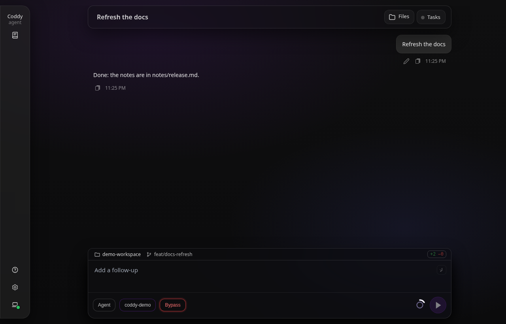

*Плашка над полем ввода чата, который работает в связанном worktree*

До первого сообщения плашка предлагает выбрать папку, ветку и worktree
([Рабочая папка сессии](#рабочая-папка-сессии-папка--ветка--worktree)); до появления
сессии счётчика git нет. Когда чат работает, место его работы - уже факт, а не выбор, и
плашка его называет (`WorkspaceBar.tsx`). Плашка выглядит как сообщение в очереди и примыкает к верхнему краю карточки поля ввода,
а верхняя граница карточки служит швом между ними. Слева плашка называет
репозиторий (в связанном worktree - имя основного чекаута, полный путь в подсказке) и
ветку; у правого края, пока в папке есть незакоммиченные изменения, - `+A −D` git для неё.
Счётчик стоит в светлой рамке, чтобы читаться как кнопка; при наведении рамка и фон
становятся ярче, а щелчок открывает окно правок. Чат, который работает в связанном
worktree, показывает тот же значок ветки, а подсказка называет папку worktree. Плашка
принадлежит git, поэтому у работающего чата в папке вне git-репозитория плашки нет, и
карточка его поля ввода сохраняет скруглённый верх. Правый край счётчика совпадает с
правым краем волшебной палочки улучшения промпта под ним, а на телефоне или сенсорном
экране счётчик сохраняет тонкий вид, и поверх него лежит невидимая область нажатия 40 px.

### Окно правок

У правок один вид - окно поверх чата (`EditsView.tsx`), в котором все диффы
незакоммиченных изменений папки собраны в один прокручиваемый документ. Рамка и шапка у
него такие же, как у [окна "Файлы"](#файлы-рабочей-папки), и стоит оно на том же месте и на
том же расстоянии от краёв окна браузера. Слева в шапке - переключатель дерева и заголовок
**Правки** над именем папки и `+A −D` от git, справа - меню **⋮**, кнопка разворота и
кнопка закрытия. В меню есть **В две колонки** (раздельный вид, его нет на телефоне и
планшете, где каждый дифф читается в одну колонку), **Свернуть все различия** /
**Развернуть все различия** и **Отменить все**. Окно открывает счётчик git на плашке
над полем ввода; Escape, кнопка закрытия или щелчок рядом с окном его убирают. Адрес
окна - `#/s/<id>/changes`, поэтому перезагрузка открывает его снова. В правой панели
своего вида у правок нет. Правая панель рядом с чатом показывает фоновые задачи и
остаётся под окном такой, какой была.

Слева дерево перечисляет изменённые файлы и только их - незакоммиченные изменения git в
тех папках, где они лежат, каждый файл с буквой git в конце строки (**A** - добавлен,
**M** - изменён, **D** - удалён). Диффы идут в том же порядке. Фильтр дерева сужает список по пути;
выбранный там файл прокручивает диффы к себе и остаётся на месте, пока диффы выше ещё
загружаются, а при прокрутке дерево отмечает файл, который оказался вверху, и само
прокручивается, чтобы эта строка оставалась видна, если список длинный. На
телефоне окно открывается на диффах, а переключатель дерева выводит список поверх них.

У раздела файла закреплённая шапка - имя, которое сворачивает дифф, затем кнопки
копирования пути и отмены правок, всегда на виду, и `+a −b` файла у правого края. Между ханками стоит
разделитель без слов вместо строки-заполнителя `N unmodified lines`. Если в папке нечего
показать, окно так и говорит - папка чистая или не входит в git-репозиторий.

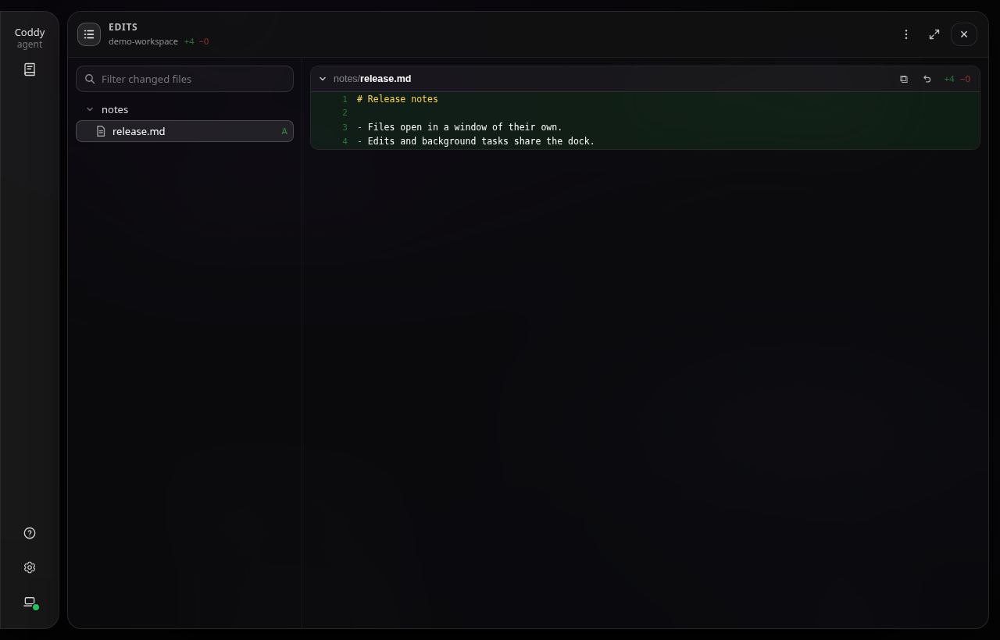

*Окно правок по незакоммиченным изменениям папки - дерево изменённых файлов рядом со всеми диффами в одном прокручиваемом документе*

**Отменить** в шапке файла возвращает этот файл к `HEAD`, а **Отменить все** в меню -
все изменения. Каждое действие сначала спрашивает в общем диалоге подтверждения, который говорит,
вернётся ли файл к последнему закоммиченному содержимому или, если он появился после этого
коммита, будет удалён; Escape в диалоге отвечает на вопрос, но не закрывает окно правок.
Затем страница отправляет `.../changes/revert` с `{"paths":[...]}` или `{"all":true}`.
Отслеживаемый файл получает обратно содержимое и запись индекса из `HEAD`, файл, которого
нет в `HEAD`, удаляется вместе с каждой папкой, которая после этого остаётся пустой, а
файлы, которые git игнорирует, не трогаются никогда. Если в этой папке идёт ход,
в этом чате или в другом, который работает там же, отмена отклоняется
(**409**); так же отклоняется файл, о котором git больше не сообщает (его закоммитили
или вернули тем временем), и тогда из запроса не применяется ничего. Коммит не предлагается,
потому что окно только читает, и отмена правок - единственное, что оно записывает.

Код раскрашивает `lowlight` (highlight.js за API дерева, тот же движок, который
`rehype-highlight` даёт рендереру markdown), поэтому действуют стили `hljs-*`, которые уже
есть в таблице стилей, а просмотрщик никогда не вставляет разметку. Грамматика
определяется по расширению файла через `diffLanguage.ts`; файл с неизвестным расширением
показывается простым текстом, без попыток угадать язык.

Маршрут подробностей читает только запрошенный файл (`gitws.WorktreeChangeFor`).
Просмотрщик загружает по одному патчу, а разрешение всего набора на каждый запрос означало
подпроцесс git на каждый изменённый файл при каждом таком запросе. Новый файл читается,
только когда git его назвал, поэтому маршрут нельзя направить на произвольный файл. Когда
отчёт git меняется, окно перечитывает только файлы, состояние которых изменилось.

Автоматические проверки:

- **external/ui/src/ui/changes/workingCopy.test.tsx** (одно чтение для всех видов чата, чтение по сигналу сервера, после вызова инструмента и при фокусе страницы, неудачное чтение, папка вне репозитория, другое окружение);
- **external/ui/src/ui/chat/WorkspaceBar.test.tsx** (репозиторий, ветка и worktree в подсказке, счётчик и его язык);
- **external/ui/src/ui/changes/sessionChangesText.test.ts** (разбиение путей) и **plurals.test.ts** (число файлов по локали);
- **external/ui/src/ui/changes/diffRows.test.ts** (построение строк в одну и две колонки, неравные серии, промежутки между ханками);
- **external/ui/src/ui/changes/fileTree.test.ts** (группировка по каталогам и сворачивание цепочек с единственным потомком);
- **external/ui/src/ui/changes/EditsView.test.tsx** (рамка и шапка окна "Файлы", меню с пунктами "В две колонки", "Свернуть все различия" и "Отменить все"; дерево только изменённых файлов, его фильтр, прокрутка к выбранному файлу и его отметка; копирование пути, баннер о пропущенных файлах, сообщение об отсутствии git, подсветка включена и выключена, повторное чтение только изменившихся файлов, отмена правок в файле и всех правок после вопроса);
- **external/ui/src/ui/changes/diffLanguage.test.ts** + **highlightLine.test.ts** (выбор грамматики и то, что подсветка точно воспроизводит строку);
- **internal/linediff** (unified diff и статистика строк; алгоритм Майерса O(ND) в линейной памяти, поэтому разрозненная правка в большом файле остаётся разрозненной правкой, а прежнюю таблицу LCS выше порога размера приходилось бросать, и такой файл показывался как переписанный целиком. Поиск ограничен `snakeBudget`, который может исчерпать только пара файлов, одновременно огромных и почти полностью разных; для такой пары используется замена целиком);
- **internal/gitws** (`changes_test.go`, `backend_test.go` - каждый сценарий с бинарником git и ещё раз со скрытым из PATH бинарником, то есть статусы рабочей копии, неотслеживаемые файлы и лимиты чтения, .gitignore, чтение blob с сохранением пробелов, вложенный репозиторий, отмена правок в файле, подпапке или везде и отказ для путей вне набора изменений до того, как что-либо затронуто; переименования только с бинарником);
- **features/session_changes.feature** (сквозной сценарий на репозитории - ход правит файл, и git о нём сообщает, правка вне агента тоже, просмотрщик читает дифф, отменяются правки сначала в одном файле, затем все).

### Транскрипты субагентов

Дочерняя сессия доступна только для чтения. `GET /coddy/sessions/{id}/messages` возвращает `subagent {parentSessionId, name, taskId}` и `readOnly: true`, а любой промпт к ней отклоняется с 409. SPA читает эти два поля (у обычной сессии их нет), отрисовывает транскрипт обычным рендерером сообщений и заменяет поле ввода уведомлением (`SubagentReadOnlyNotice`) "Только для чтения: транскрипт субагента `<name>`. Промпты отправляются в родительский чат." со ссылкой **Открыть родительский чат** на `#/s/<parentSessionId>`. Повтор, правка сообщений и кнопки **Запустить план** / **Отменить** карточки плана для такой сессии недоступны (обработчики вообще не передаются, поэтому карточка `plan_document` отрисовывается без нижней части, а её редактор markdown доступен только для чтения), а в шапке чата написано "Субагент `<name>`", потому что у дочерней сессии нет строки в истории, которая бы её называла. Дочерние сессии скрыты из истории, и по идентификатору дочернюю сессию не отличить от обычной, поэтому оболочка загружает любой идентификатор, открытый из панели задач или по URL, и даёт ответить эндпоинту сообщений.

Автоматические проверки:

- **external/ui/src/ui/chat/subagentTranscript.test.ts** (разбор маркера, `readOnly` без остальных полей);
- **external/ui/src/ui/chat/SubagentReadOnlyNotice.test.tsx** (текст с именем и без него, href ссылки на родителя, открытие в той же вкладке и щелчок с модификатором);
- **external/ui/src/ui/chat/ChatScreen.test.tsx** (уведомление заменяет поле ввода и в закреплённой раскладке, и в раскладке стартового экрана);
- **external/ui/src/ui/chat/subagentReadOnlyCss.test.ts** (уведомление и ссылка используют токены темы);
- **external/ui/src/ui/chat/PlanDocumentSection.test.tsx** (у карточки без обработчиков действий нет нижней части, редактор только для чтения и нет автосохранения);
- **external/ui/src/ui/messages/MessageList.test.tsx** (карточка плана в транскрипте только для чтения отрисовывается без "Запустить план" и "Отменить");
- **external/ui/src/ui/i18n/messagesParity.test.ts** (новые ключи есть в каждом словаре);
- **external/ui/src/ui/settings/settingsSections.test.ts** (переведённые подпись и описание вкладки конфигурации `subagents`, гибридной вкладки, которая сохраняет свой ключ схемы).

## Расход токенов в реальном времени

- Интерфейс должен показывать счётчики токенов, пока агент работает;
- Счётчики обновляются, когда приходит SSE-событие `token_usage`;
- Счётчики обновляются после каждого завершённого вызова модели на бэкенде, а не после каждого сгенерированного токена;
- После перезапуска интерфейс восстанавливает счётчики токенов через `GET /coddy/sessions/{id}/stats`.

## Расход по аккаунту провайдера

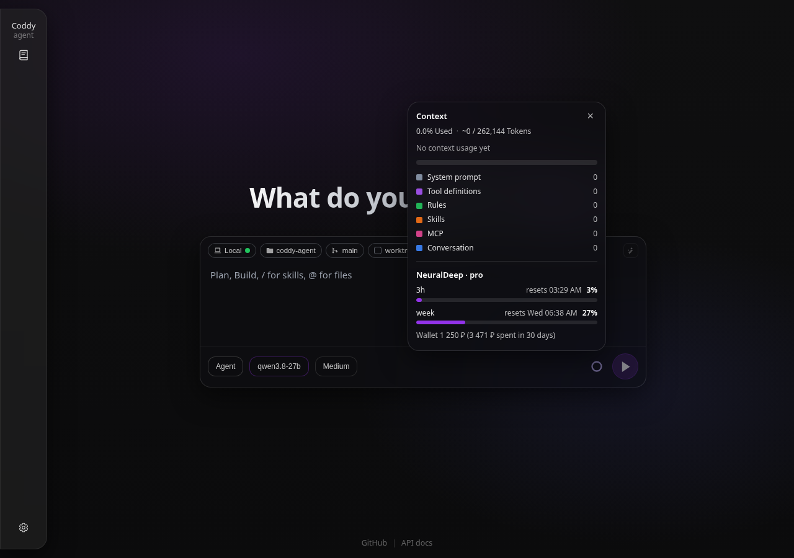

*Всплывающая панель расхода под счётчиком контекста*

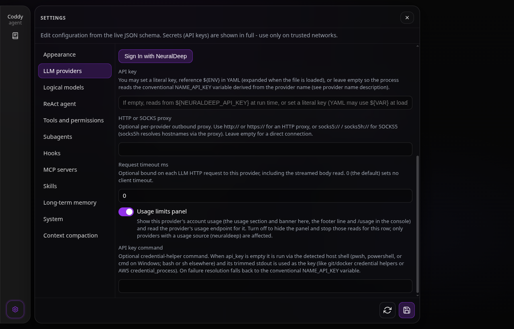

*Переключатель панели лимитов в строке провайдера*

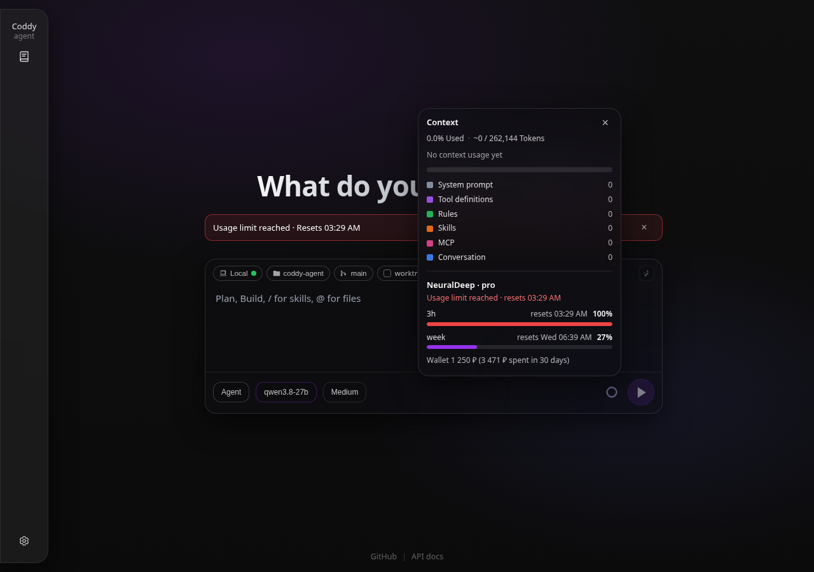

*Окно исчерпано - поле ввода сообщает время сброса*

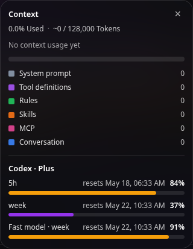

*Подписка Codex в разделе расхода - окна с подписью длительности и запись для отдельной функции*

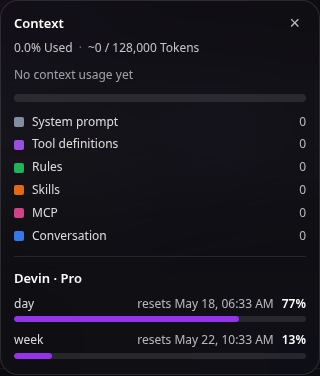

*Подписка Devin в разделе расхода - шкалы дневной и недельной квоты*

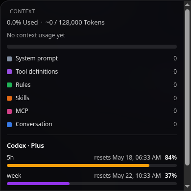

*Раздел расхода Codex в виде нижней шторки на телефоне*

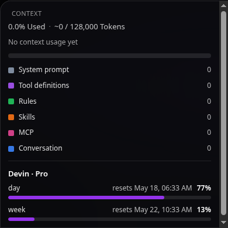

*Раздел расхода Devin в виде нижней шторки на телефоне*

- Когда провайдер выбранной модели сообщает расход по аккаунту (сейчас это
  `neuraldeep`, `codex` и `devin`), **всплывающая панель контекста** (кольцо контекста рядом
  с кнопкой "Отправить") заканчивается **разделом расхода**, так же как Claude Desktop
  перечисляет лимиты тарифа под окном контекста. В разделе есть провайдер и тариф (рядом
  с брендом стоит имя строки, **`Codex · codex-work · Plus`**, если строка не названа по
  своему типу, - так различаются несколько профилей одного типа), по одной шкале на
  каждое измеряемое окно с временем сброса по часам браузера, подписью на языке
  интерфейса и процентом использования, кошелёк в рублях и заметка, если что-то
  изменилось, - достигнутый лимит с временем сброса (или причина блокировки,
  которую не снимет никакой таймер), модель на безлимитном варианте провайдера,
  отклонённый вход, устаревшие данные, ход, ожидающий сброса. Показываются
  те окна, о которых сообщает источник, - session/week/day у NeuralDeep,
  окна Codex с подписью длительности (`5h`, `week` и записи для отдельных функций
  вроде `Fast model · week`), шкалы квот `day`/`week` у Devin
  или его шкала `ACU`; источник, которому нечего сообщить о квоте, показывает тариф с
  пометкой `quota unavailable` и никогда не выдумывает шкалу. Только NeuralDeep
  скрывает дневную шкалу на нуле и сообщает кошелёк. На 80 % шкала
  становится янтарной, а **баннер** над полем ввода сообщает `You've used
  85% of your NeuralDeep 3h limit · resets 20:59`; его можно скрыть отдельно для строки
  провайдера, окна и периода. При блокировке баннер переходит в тон ошибки.
  Блокировка по времени выглядит как `Usage limit reached · Resets 20:59`, пустой кошелёк,
  заблокированный ключ или аккаунт и лимит запросов называют свою причину, а пока
  агент ждёт сброса, баннер говорит `Usage limit reached · Auto-resuming
  at 20:59`. Баннер непрозрачен в любой теме, поэтому чат, прокручивающийся
  под полем ввода, сквозь него не просвечивает, а когда баннер появляется над
  чатом, прокрученным к самому новому сообщению, чат сдвигается вверх, чтобы это
  сообщение оставалось видно;
- Переключатель **Панель лимитов** у строки в "Настройки → Провайдеры LLM"
  (`providers[].usage_limits_panel`, по умолчанию включён) скрывает раздел и
  баннер и останавливает чтения за ними. Маршрут тогда отвечает
  `unsupported` с `disabled: true`, а хук отбрасывает снимок, который
  показывал для этой строки;
- Данные приходят из **`GET /coddy/providers/{name}/usage`** (открытие сессии,
  смена модели, после каждого завершённого хода просматриваемой сессии, одно чтение
  после сброса окна, одно чтение из кэша, когда сервер отложил обновление)
  и из **`event: provider_usage`** в **`GET /coddy/events`** между
  ходами. Других опросов нет; снимки упорядочиваются по времени чтения на сервере,
  поэтому медленный ответ никогда не возвращает старые числа. Визуальный контракт -
  **`DESIGN.md`** (**Context popover usage section and usage banner**); проектная запись -
  **`docs/plans/neuraldeep-usage.md`**.

## Отображение Markdown

- общий вывод инструментов остаётся сырым моноширинным текстом; поддерживаемые карточки документов и структурированных данных отображают Markdown или поля внутри **`ToolCallMessage`**;
- сообщения **пользователя** - простой текст с сохранёнными переносами строк (**`UserMessage`**);
- сообщения **ассистента** могут содержать Markdown;
- интерфейс отображает Markdown с блоками кода и подсветкой синтаксиса;
- расширенный реестр языков покрывает [аудит NeuralDeep на 63 языка](../contributing/syntax-highlighting-audit.md), включая Pascal/Delphi, GML, ассемблер, PowerShell, GDScript, HLSL, WGSL, COBOL и VBA. Точные названия и ограничения приведены в аудите. PL/SQL/OpenCL/CUDA получают раскраску базового языка, а UnrealScript/TADS/URQ остаются простым текстом. Записанные ответы тестируются офлайн, без учётных данных;
- блоки `vue` подсвечивают разметку компонента и обычное содержимое `<script>` / `<style>` как JavaScript / CSS. Для интерполяций Vue и `lang="ts"`, SCSS или других препроцессоров отдельного разбора с учётом Vue нет;
- блоки `postcss` используют подсветку CSS, включая селекторы, свойства, числа и комментарии. Синтаксис отдельных плагинов PostCSS может остаться без цвета;
- чтобы включить подсветку, помечайте блоки языком (например, `js`, `css`, `html`, `json`, `ts`, `python` или `go`). Блоки без метки или на неподдерживаемом языке остаются простым текстом. Подсветка работает и пока ответ ещё приходит;
- цвета кода сразу меняются вместе с любой из семи тем оформления при переключении темы. Каждая тема задаёт общую палитру `--syntax-*` в `external/ui/src/styles.css`; отдельная настройка темы синтаксиса не нужна;
- у каждого блока кода есть кнопка копирования, которая копирует только содержимое этого блока;
- блоки Mermaid и SVG рисуются как картинки, а LaTeX - как формулы, см. [Диаграммы и формулы](#диаграммы-и-формулы).

## Диаграммы и формулы

Если в ответе есть диаграмма или формула, она показывается нарисованной, а не исходным текстом. Это относится к тому, что агент пишет в ответ на просьбу "нарисовать схему" или "показать формулу", - к блоку Mermaid, блоку SVG и LaTeX между знаками доллара или в собственных разделителях LaTeX. Веб-интерфейс и Telegram Mini App их рисуют, а консоль, клиенты ACP и боты мессенджеров оставляют текст.

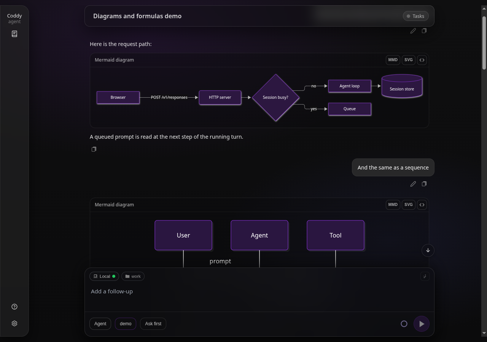
*Блок Mermaid в ответе по умолчанию нарисован, а его исходник открывается одним щелчком.*

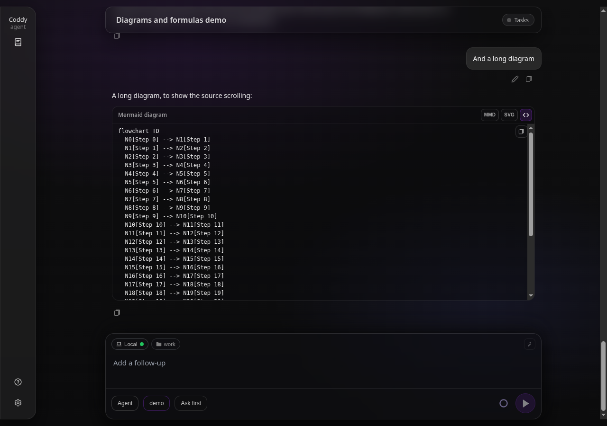
*Переключатель исходника нажат, виден текст диаграммы с кнопкой копирования.*

- **Что рисуется.** Блок с меткой **`mermaid`** (блок-схемы, диаграммы последовательности, классов, состояний, ER, Ганта, круговые, mindmap и всё остальное, что рисует Mermaid) и блок с меткой **`svg`**. Любая другая метка остаётся блоком кода - блок **`xml`**, в котором случайно оказался `<svg>`, не рисуется;
- **Блок.** Строка шапки называет вид (**Диаграмма Mermaid**, **Изображение SVG**) и несёт справа форматы, в которых его можно сохранить, и переключатель исходника. **MMD** сохраняет исходник Mermaid (**`diagram.mmd`**), а **SVG** - нарисованную картинку (**`diagram.svg`**); у блока SVG есть только **SVG**, и она сохраняет его исходник (**`image.svg`**). Переключатель исходника - значок из угловых скобок, по умолчанию он выключен, так что вы видите картинку; если его нажать, показывается исходник с кнопкой копирования в правом верхнем углу текста, а исходник длиннее примерно двадцати строк прокручивается в своей рамке. Щелчок по картинке открывает её в просмотрщике изображений с масштабированием и панорамированием;
- **Ошибки.** Диаграмма, которую Mermaid не может разобрать, показывает свой исходник с причиной под шапкой (**Не удалось нарисовать картинку: Parse error on line 3: ... Expecting ..., got ...**), а переключатель исходника остаётся нажатым и неактивным. Если отрисовщик вообще не удаётся загрузить (нет сети, страница старше бинарника), блок показывает исходник с сообщением **Не удалось загрузить отрисовщик диаграмм, перезагрузите страницу**;
- **Потоковая передача.** Блок, который ещё приходит, рисуется, как только появляется, а затем ещё раз, когда его текст не меняется 300 мс, поэтому Mermaid не запускается на каждый токен недописанной диаграммы;
- **Темы.** Диаграмма берёт все цвета из активного оформления и перерисовывается при смене темы. Узлы подкрашены акцентным цветом, рёбра нарисованы цветом текста, а секторы круговых диаграмм, серии графиков и ветки git используют акцентный и синтаксические цвета темы, каждый достаточно далёкий от фона, чтобы сектор выделялся, а его подпись читалась (4,5:1). Так во всех семи темах. SVG рисуется таким, как написан.

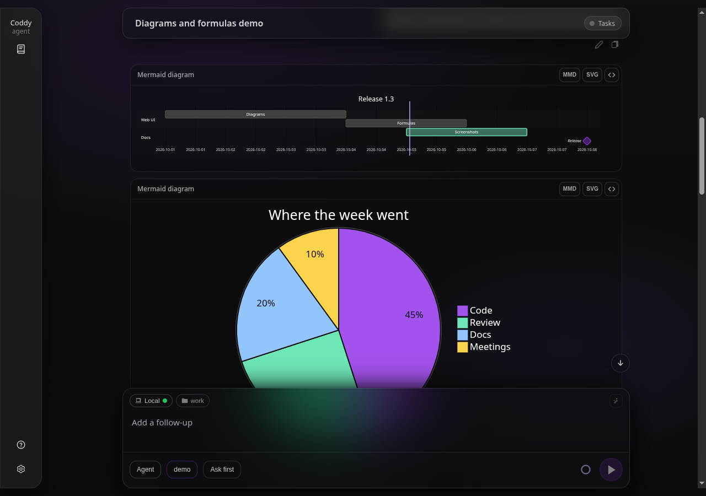
*Графики берут цвета темы - тёмной...*

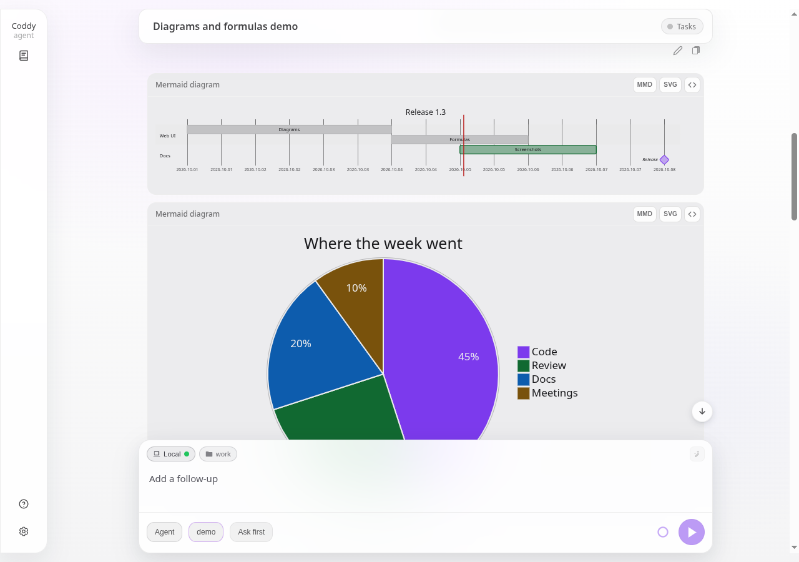
*...и светлой.*

- **Безопасность.** Картинка - это `` с SVG в виде `data:` URL. SVG, нарисованный так, не выполняет скриптов, ничего не загружает из сети и не может менять стили страницы, поэтому SVG, написанный моделью, показывается как есть. Mermaid работает с **`securityLevel: "strict"`**.

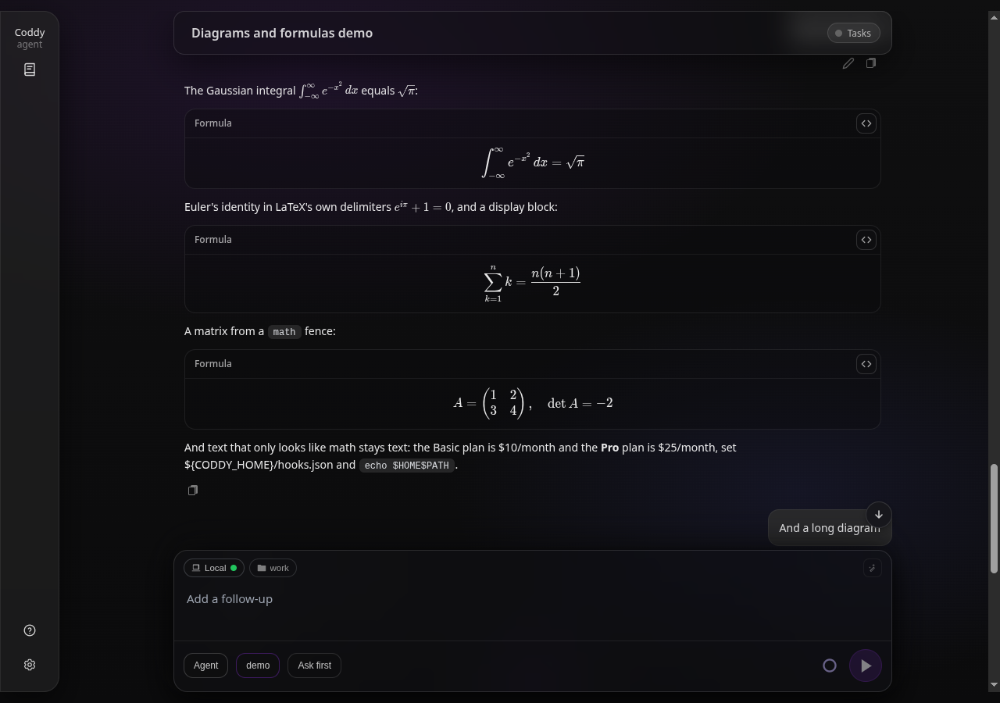
*Строчные и выносные формулы; цена в том же абзаце остаётся текстом.*

- **Формулы.** **`$...$`** и **`\(...\)`** - строчные формулы; **`$$...$$`**, **`\[...\]`** и блок **`math`** - выносные. Их набирает KaTeX (без **`\href`**, **`\url`** и **`\includegraphics`**, недоверенные команды выключены), который сам строит узлы формулы на странице (**`katex.render`**), так что никакая HTML-строка, сделанная из ответа, никогда не разбирается. У выносной формулы та же шапка, что у диаграммы, но только с переключателем исходника (кнопка копирования есть в режиме исходника), и она прокручивается вбок, если шире транскрипта. Строчная формула показывает исходник во всплывающей подсказке и по щелчку (или по Enter / Space) копирует его вместе со знаками доллара. **`\[...\]`** внутри цитаты или пункта списка остаётся на своей строке (набирается как строчная формула) и не разрывает цитату или список, а разделители LaTeX внутри блоков кода и кода с отступом остаются как есть; пара разделителей никогда не захватывает пустую строку, новый пункт списка или смену уровня цитаты. Экранированные скобки в тексте (`a\[0\]`, `\(see below\)`) остаются текстом;
- **Доллары, которые не математика.** Фрагмент в одиночных долларах считается формулой, только если после открывающего доллара и перед закрывающим нет пробела, ни буква, ни цифра не касается ни одного из долларов снаружи (правило Pandoc) и фрагмент не начинается как **`${NAME}`**. Поэтому "it costs $5 and $10", **`${CODDY_HOME}/hooks.json`**, **`$HOME$PATH`** и хеш argon2 остаются текстом. Доллары внутри фрагментов и блоков кода никогда не становятся математикой. Неверный TeX показывается собственным красным исходником KaTeX, а не ошибкой;
- **Агент знает.** Каждый ход, отправленный веб-интерфейсом, сообщает, откуда он пришёл (**`metadata.surface: "webui"`**), и сервер добавляет в системный промпт этого хода блок о том, что веб-интерфейс рисует блоки **`mermaid`** и **`svg`** и набирает LaTeX, поэтому ответом становится диаграмма, график или формула, когда они скажут больше текста, а цвета остаются за темой. Блок принадлежит ходу и никогда не сохраняется; консоль, удалённая консоль, боты мессенджеров и клиенты API его не получают и продолжают отвечать текстом. Сессия, которой пользуются попеременно из веб-интерфейса и из другого интерфейса, платит за это промахом кеша на ходе, где интерфейс сменился;
- **Где.** Везде, где веб-интерфейс отображает Markdown, - в ответах, рассуждениях, карточках инструментов, карточке плана и читалке документации;
- **Загрузка.** Mermaid и KaTeX не входят в **`app.js`**. Это отдельные файлы в **`/chunks/`** (имена с хешем содержимого, встроены в бинарник, как и весь SPA), которые скачиваются, когда страница впервые показывает диаграмму или формулу, и затем навсегда кешируются браузером. Чат без диаграмм и формул ничего лишнего не скачивает;
- **Код.** **`ui/markdown/DiagramBlock.tsx`** (блок), **`ui/markdown/pictureRender.ts`** (конфигурация Mermaid, палитра темы, размеры SVG и кеш), **`ui/markdown/MathFormula.tsx`** (KaTeX), **`ui/markdown/mathDelimiters.ts`** (разделители LaTeX и правило доллара), **`ui/markdown/renderers.ts`** (импорты по требованию). Тесты - **`ui/markdown/DiagramsAndMath.test.tsx`**, **`ui/markdown/mathDelimiters.test.ts`**, **`features/web_ui_diagrams.feature`**; проверка в браузере - **`npm run check:diagrams`** (см. [Проверка диаграмм и формул](#проверка-диаграмм-и-формул)).

## Редактор Markdown с номерами строк (общий)

Реализован как **`MarkdownLineEditor`** (`external/ui/src/ui/markdown/MarkdownLineEditor.tsx`). Используется для:

- **`body (markdown)`** задания планировщика (`SchedulerJobEditorSheet`, по умолчанию **`minRows`** **10**);
- режима markdown в карточке документа плана (`PlanDocumentSection`, **`minRows`** **4**, класс **`md-line-editor--plan`**).

Поведение (см. **`DESIGN.md`**, **Markdown line editor**):

- полная ширина родителя; высота редактора следует за содержимым (с минимумом логических строк); у внутреннего **`textarea`** **нет** полосы прокрутки;
- поле номеров показывает по одному номеру на **логическую** строку (разделённую `\n`). Перенесённые визуальные строки оставляют ячейки поля **пустыми** (номера не повторяются);
- подсветка строки с кареткой охватывает **все** визуальные строки этой логической строки; активный номер в поле номеров подкрашен;
- перенос измеряется скрытым зондом с тем же шрифтом и шириной текста, что у textarea; число визуальных строк = **`ceil(height / lineHeight)`**;
- длинные неразрывные токены переносятся (**`overflow-wrap: anywhere`**); горизонтальной прокрутки внутри редактора нет.

Автоматические проверки:

- `external/ui/src/ui/markdown/MarkdownLineEditor.test.tsx`;
- `external/ui/src/ui/markdown/markdownLineGutter.test.ts`.

## Карточка документа плана (транскрипт режима "План")

Тип транскрипта **`plan_document`** отображает **`PlanDocumentSection`** в основной колонке чата (не в правой боковой панели).

Данные и API:

- хранится в **`messages.json`**; восстанавливаемые поля - **`slug`**, **`name`**, **`overview`**, **`content`**, необязательные **`body`**, **`path`**, **`discarded`**;
- правка тела - **`PUT /coddy/sessions/{id}/plans/{slug}`** с **`{ "body": "<markdown>" }`** (отложенное автосохранение);
- отмена плана - **`DELETE /coddy/sessions/{id}/plans/{slug}`** ставит **`discarded: true`**; карточка остаётся видимой, элементы управления неактивны;
- запуск плана - клиент запускает реализацию (метаданные / промпт; см. **`docs/reference/acp-protocol.md`**).

Требования к интерфейсу:

- в свёрнутом виде - заголовок, однострочное описание, **Отменить** и **Запустить план** в подвале; всплывающая подсказка **`title`** у заголовка - абсолютный путь к файлу плана, когда он известен;
- в развёрнутом виде по умолчанию **предпросмотр** (отображённый markdown через **`Markdown`**); переключатель с глазом переключает на **`MarkdownLineEditor`**;
- панель содержимого растёт с длиной документа в **обоих** режимах, предпросмотре и markdown (у панели **нет** внутренней прокрутки с max-height);
- в развёрнутом виде на десктопе (**`min-width: 640px`**) строка заголовка и кнопки действий делят верхнюю строку, а тело занимает всю ширину ниже;
- тело в редакторе не включает YAML frontmatter (клиентский **`planEditorBody`**); предпросмотр использует тот же текст тела;
- транскрипт только для чтения (дочерняя сессия субагента) - **`MessageList`** не передаёт ни **`onPlanDocumentRun`**, ни **`onPlanDocumentDiscard`**; тогда карточка отображается без подвала (**`.plan-document-card--readonly`**), редактор markdown доступен только для чтения, и автосохранение не планируется. Каждая кнопка подвала появляется, только если есть её собственный обработчик.

Автоматические проверки:

- `external/ui/src/ui/chat/PlanDocumentSection.test.tsx`;
- `external/ui/src/ui/messages/MessageList.test.tsx` (передача обработчиков, транскрипт только для чтения).

## Чек-лист задач (карточка инструмента)

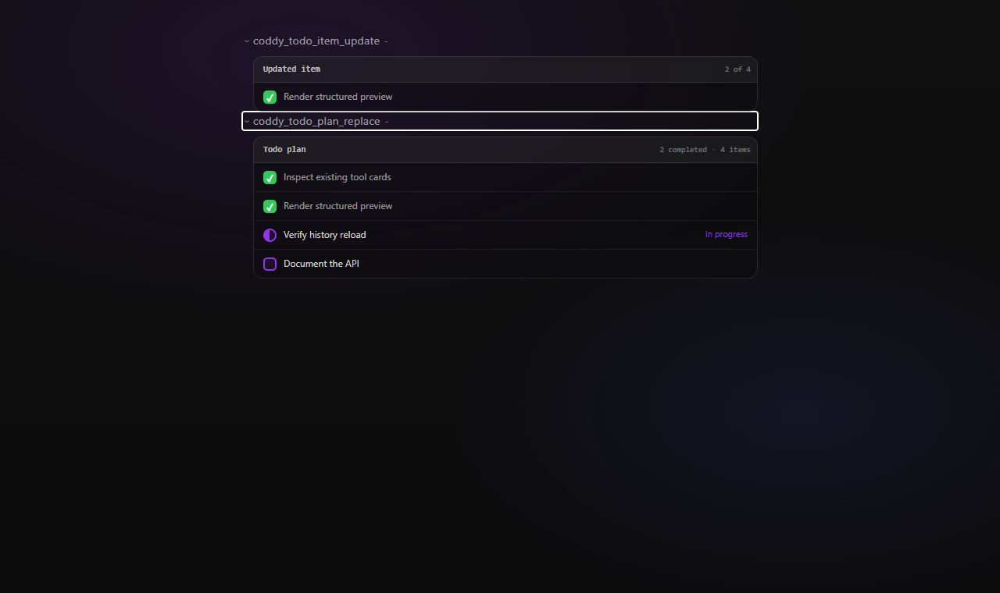

*Чек-лист инструментов задач - план заменён одним вызовом, затем один пункт отмечен как выполняемый*

- инструменты **`coddy_todo_*`** показывают свой чек-лист как превью строки транскрипта (**`chat/todoToolPreview.ts`**). Веб-интерфейс не читает **`GET /coddy/sessions/{id}/plan`** (**`PUT`**, **`POST .../plan/archive`**); эти маршруты остаются для других клиентов;
- это отдельная карточка, не та, что карточка транскрипта **`plan_document`** выше.

## Долговременная память

Корни дерева памяти

- `global`;
- `workspace`.

API дерева

- `GET /coddy/sessions/{id}/memory/tree`
  - без `root` возвращает список корней;
  - с `root` и необязательным `path` перечисляет дочерние элементы;
- перечисляются только файлы `.md` и `.txt`;
- обход пути должен отклоняться.

API файлов

- `GET /coddy/sessions/{id}/memory/file` читает;
- `PUT /coddy/sessions/{id}/memory/file` записывает.

## Серверы MCP (вкладка настроек)

Функциональный чек-лист вкладки Настройки → MCP-серверы (`MCPSection.tsx`,
вид раздела `mcp`; визуальный контракт в `DESIGN.md`). Скриншот -
`docs/assets/screenshot-fullhd-settings-mcp.png` (подключённый глобальный сервер и
проектный, который ждёт одобрения для рабочей папки):

- `GET /coddy/mcp` наполняет список - это объединённые серверы из глобального
  `~/.coddy/mcp.json` и проектного `./.coddy/mcp.json` (config.yaml серверов не
  объявляет), у каждого есть `source` (значок области `global` / `local`), `origin`
  (`home` / `project`) и `source_path` (настоящий файл, его и называет подсказка
  значка), `status` проверки и список инструментов;
- точка статуса у каждого сервера - подключён (зелёная), ошибка (красная, подсказка
  показывает ошибку проверки), выключен (серая), неизвестный тип транспорта
  (янтарная, `unsupported`), ждёт одобрения для рабочей папки (янтарная,
  `needs_approval`), отклонён политикой `mcp.project_trust: deny` (красная, `denied`);
- строка начинается с шеврона и точки статуса, без собственного значка, а развёрнутые
  инструменты и примечание о доверии начинаются там же, где имя. На телефоне элементы
  управления переносятся под имя и его командную строку, поэтому имя читается целиком,
  а не несколькими буквами рядом с четырьмя кнопками по 40px;
- во вкладке **две группы полей** - **Обнаружение MCP** (`.mcp-discovery-box`) над
  **Серверы MCP** (`.mcp-servers-box`). В "Обнаружении MCP" находятся политика
  `mcp.project_trust` (выпадающий список `mcp-project-trust`, `POST /coddy/mcp/project-trust`)
  и объяснение, почему проектные записи требуют одобрения. Отдельным разделом настроек
  она не сделана, потому что управляет ровно теми серверами, что перечислены под ней,
  и, как и вся вкладка, сохраняется при изменении, а не вместе с "Сохранить все разделы";
- доверие рабочей папки для проектных строк (`gated: true`) - кнопка-щит
  (`mcp-trust-{name}`) отправляет `POST /coddy/mcp/{name}/trust|untrust`; одобрение
  несёт `fingerprint` строки, поэтому объявление, которое checkout переписал после
  получения списка, отклоняется (`409`, показывается как ошибка вкладки), а не
  одобряется. У строки `needs_approval` есть примечание (`mcp-trust-note-{name}`) с
  `source_path`, где она объявлена, и с объявлением, которое покрывает одобрение
  (`.mcp-trust-facts`, из `declarationFacts` в `mcpServerJson.ts`) - транспорт,
  `runs` (команда + аргументы) или `contacts` (url), **имена** переменных окружения
  и заголовков, переменные процесса Coddy, которые читают его значения (`reads`, из
  `reads` строки), и рабочая папка. Значения никогда не показываются. Щит
  отображается **только при `ask`** (`showsTrustControl` в `mcpServerJson.ts`) -
  при `allow` все проектные серверы запускаются в любом случае, а при `deny` не
  запускается ни один, так что решать по каждому серверу нечего. Такая строка не
  проверяется, поэтому инструментов не показывает; командная строка остаётся
  видимой, потому что именно её одобряет оператор. У строк `global` щита нет, а при
  `denied` он неактивен;
- переключатель сервера вызывает `POST /coddy/mcp/{name}/enable|disable`; у глобальной
  записи состояние переключателя сохраняется в файл, где она определена, у проектной -
  в `<home>/mcp-overrides.json`, а checkout не трогается. Живые сессии подключают или
  закрывают только этот сервер, остальные продолжают работать;
- если сервер не может построить список (`GET /coddy/mcp` отвечает ошибкой или запрос
  вообще не доходит), об этом сообщается над списком (`mcp-load-error`) текстом
  сервера, в котором назван файл, если не удаётся разобрать `mcp-overrides.json`, и
  это не выглядит как "серверы не настроены"; неудачное обновление сохраняет строки,
  которые вкладка уже показывала;
- развёрнутая строка перечисляет инструменты с переключателем у каждого
  (`POST /coddy/mcp/{name}/tools/{tool}/enable|disable`); переключатели инструментов
  заблокированы, пока сервер выключен;
- каждую строку можно править, в обеих областях. Кнопка удаления вызывает
  `DELETE /coddy/mcp/{name}`, кнопка правки открывает карточку JSON-редактора прямо в
  списке, с областью, закреплённой за файлом-владельцем;
- в списке нет значений переменных окружения и заголовков, вместо них стоит
  `<redacted>`, поэтому редактор строки начинается с этих заглушек и под JSON объясняет,
  что они делают (`mcp-editor-values-hint`) - оставленная как есть сохраняет хранимое
  значение, новое значение заменяет его, удалённый ключ удаляется. Сохранение отправляет
  `fingerprint` строки (`PUT /coddy/mcp/{name}?scope=…&fingerprint=…`); если к этому
  моменту в файле уже другое объявление, сервер отвечает `409`, карточка остаётся
  открытой с `mcp.error.saveChanged`, список перечитывается, и запись нужно открыть
  заново, чтобы править;
- кнопка "Добавить сервер" открывает редактор, заполненный шаблоном записи в стиле
  Cursor, и выбор области "Локально" / "Глобально" (по умолчанию "Локально");
  сохранение отправляет `PUT /coddy/mcp/{name}?scope=local|global` после проверки на
  клиенте (`mcpServerJson.ts` - объект JSON, обязателен `command` или `url`, имя без
  `__`, пробелов и разделителей пути);
- кнопка обновления заново проверяет все серверы через `GET /coddy/mcp?refresh=1`;
- обновление списка никогда его не размонтирует (заглушка показывается только при
  первой загрузке), поэтому положение прокрутки панели сохраняется;
- вкладка не участвует в сохранении документа настроек кнопкой "Сохранить все разделы".

## Маркетплейсы скилов (вкладка настроек)

В **Настройки > Навыки** остаются форма (автообнаружение, `skills.dirs` и `skills.project_trust` в
отдельной группе полей **Обнаружение маркетплейсов**, которая сохраняется вместе с остальными
настройками) и установленные скилы, а между ними стоит группа полей **Маркетплейсы**
(`MarketplacesEditor.tsx`, вспомогательные функции в `settings/marketplaces.ts`). Как и вкладка MCP,
она работает через API и никогда не входит в документ настроек. То, что она перечисляет, объявлено в
`~/.coddy/marketplaces.json`, в `.coddy/marketplaces.json` проекта и в самом Coddy и читается через
`GET /coddy/skills/sources` для сессии на экране (`X-Coddy-Session-ID`), а каждое действие
применяется сразу.

- одна строка на запись, в том порядке, в каком записи вступают в силу, - ключ (имя маркетплейса,
  адрес источника), значок вида (**все плагины** для источника, **каталог** для маркетплейса, адрес
  которого стоит под именем) и значок происхождения (**встроенный**, **ваш**, **из проекта**),
  подсказка которого называет файл с объявлением;
- у встроенного `EvilFreelancer/rpa-skills` есть щит, на который нельзя нажать (доверие всегда), и
  неактивная кнопка удаления; синхронизируется он как любая строка;
- при `skills.project_trust: ask` у проектной строки есть щит MCP - янтарный, пока запись ждёт
  одобрения, и обычный после одобрения. Щелчок по нему отправляет `POST /coddy/skills/sources/trust`
  с `fingerprint` строки (запись, которую checkout переписал после этого, отклоняется с 409, и
  сообщение показывается над списком) или `untrust` для одобренной; после любого из них список
  перечитывается. Ожидающая строка приглушена, говорит, какой файл её объявляет и что она не
  синхронизируется до одобрения, а её кнопка **Синхронизировать** неактивна. При `deny` её
  примечание говорит, что политика её выключила, и щита нет; при `allow` проектные строки действуют,
  и щита у них тоже нет;
- **Синхронизировать** у строки - это `POST /coddy/skills/sync?source=<key>`, **Синхронизировать все** -
  `POST /coddy/skills/sync`; обе обновляют список установленных и на мгновение показывают галочку, а
  неудачное обновление сообщает об этом и оставляет кнопки рабочими. Кнопка синхронизации у
  задержанной строки неактивна, её подсказка просит сначала одобрить запись, а при `deny` называет
  политику. Удаление - это `DELETE /coddy/skills/sources?source=<key>&origin=<row origin>`, оно
  правит только файл этой строки, поэтому удаление вашей записи никогда не трогает закоммиченную
  копию проекта;
- поле добавления объявляет источник (он устанавливается целиком) через `POST /coddy/skills/sources` -
  в вашем файле или, с **Этот проект**, в файле проекта, что сразу одобряет его для этой рабочей
  папки. **Этот проект** доступен, когда у чата есть сессия. До первого сообщения сервер взял бы
  свою папку по умолчанию, а не ту, что на экране, поэтому выбор остаётся на вашем файле;
- у чата, который хранится как черновик в браузере, нет сессии на сервере. Тогда список и его
  действия не отправляют `X-Coddy-Session-ID` и отвечают для рабочей папки сервера по умолчанию
  (вкладка MCP делает так же). Сохранение настроек перечитывает список, поэтому строки следуют за
  изменённым `skills.project_trust`; каталог "Субагенты" делает то же для `subagents.project_trust`;
- поиск для установки (`GET /coddy/skills/available`), проверка обновлений (`GET /coddy/skills/updates`)
  и **Скачать обновление** обращаются к той же сессии, поэтому проектный маркетплейс, одобренный там,
  предлагается, а задержанный там не проверяется и обновления из него не берутся;
- на телефоне элементы управления строки переносятся под ключ, а поле добавления занимает всю ширину.


Автоматические проверки:

- **external/ui/src/ui/settings/MarketplacesEditor.test.tsx** (строки с видом, происхождением и файлом, неактивные щит и удаление у встроенной строки, задержанная проектная строка с примечанием, неактивными синхронизацией и щитом, одобрение с отпечатком и его отзыв, отклонённое одобрение, запрещённая строка, добавление с областью, удаление по ключу, синхронизация одной строки и всех, русские тексты);
- **external/httpserver/server_test.go** (`TestCoddySkillsSourcesSyncDelete`, `TestCoddySkillsNewRoutesEdgeCases` - маршруты, области, 409 на переписанную запись, 400 при синхронизации задержанной);
- **features/skills_marketplace.feature**, **features/skills_marketplace_trust.feature** (проектный маркетплейс ждёт одобрения, а затем синхронизируется в домашнюю папку Coddy).

## Экран роя

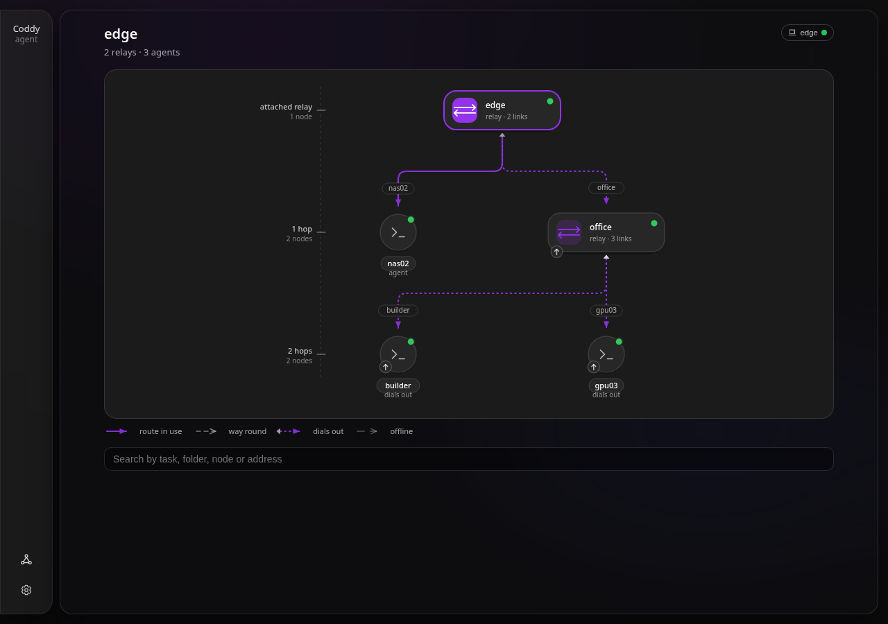

*Экран роя с релеями, узлами и кольцами*

Руководство - `docs/operate/swarm.md`. Визуальный контракт - `DESIGN.md` (**Swarm screen**).

- пункт **Рой** в боковой панели появляется только там, где отвечает `GET /swarm/info`, поэтому у
  обычного агента его нет. Он стоит внизу боковой панели, над **Документация** и **Настройки**;
- на релее карта роя **и есть** домашний экран - без поля ввода, без `ChatScreen`, без пунктов
  "История" и "Планировщик", потому что у релея нет своих сессий. Меню окружения и там остаётся внизу
  боковой панели, в том числе в пустом состоянии карты и при ошибке, поэтому недоступный релей не
  отнимает способ сменить окружение;
- **щелчок по узлу на карте переключает на него** и оставляет карту открытой поверх, теперь с этим
  узлом в кольце; что там делать, решает следующий щелчок. Под картой нет списка узлов и нет чипов
  фильтров. Когда приложение на узле, любой обычный экран (чат, история, планировщик, настройки,
  рабочая папка) работает с ним, а **Рой** в боковой панели возвращает к релею. Узел, на котором
  находится приложение, и релей на собственной карте - не кнопки;
- переключение между двумя удалёнными серверами не перезагружает страницу. Приложение начинает
  заново на новом сервере, не уходя со страницы, карта сразу рисуется по последнему снимку, а боковая
  панель остаётся как была;
- карта обводит кольцом узел, на котором находится приложение (на самом релее - карточку релея), и
  рисует маршрут к нему от подключённого релея одним связным акцентным путём; всё, что вне этого
  маршрута, отходит на задний план. У каждого релея на этом маршруте есть обводка, а у текущего -
  более сильная обводка текущего узла. Наведение на другой узел показывает, куда приведёт щелчок, а
  его подсказка называет то, что показывает рисунок, - что это за узел, подключается ли он сам наружу,
  чем занят. Слова под узлом карта пишет только при неполадках (*не в сети*, *нет маршрута*) и
  считает связи релея на его карточке; у проводов нет стрелок, а провод подписан, только если релей
  знает узел под другим именем;
- каждый узел показывает, чем занят - число сессий в простое, число выполняющихся, пока идёт ход, и
  *нужен ответ*, когда там что-то ждёт ответа на запрос разрешения. Выполняющийся узел пульсирует,
  ожидающий пульсирует иначе, а по переходам к выполняющемуся узлу бежит пунктир. Всё это берётся из
  `GET /swarm/sessions` и останавливается при `prefers-reduced-motion`;
- поиск выполняется на релее, а не в браузере, поэтому достаёт до узлов, к которым этот браузер
  подключиться не может. Найденные сессии показываются строками под картой, только пока есть запрос;
  строка открывает эту сессию на её узле. Узлы, которые не ответили, перечисляются как предупреждения
  над картой, а не отбрасываются;
- на телефоне (уже 1200 px) экран открывается под верхней панелью и над затемнённой подложкой,
  поэтому касания доходят до карты, поиска и узлов; касание собственных пунктов верхней панели
  по-прежнему уводит с него;
- **Древовидная раскладка** - раскладка холста по умолчанию. **Графовая раскладка** - детерминированный
  корневой граф сверху вниз для колец и перекрёстных связей с корнем в релее или, если он нарисован,
  в локальном компьютере, который начинает соединение. Она мягко следует глубине маршрута, без
  жёстких рядов по переходам, и использует плавные связи. Выбор между деревом и графом хранится только
  в браузере, в ключе localStorage `coddy_swarm_layout`; сохранённое старое значение `star`
  переводится в граф, а отсутствующее, заблокированное или неверное значение выбирает дерево.
  Конфигурация сервера не меняется;
- холст открывается вписанным. Его переключатель дерева и графа и кнопки **Уменьшить**, **Показать
  граф целиком** и **Увеличить** удобно нажимать в одноколоночной оболочке, цели у них по 40px.
  Колесо масштабирует к указателю, перетаскивание сдвигает по обеим осям, даже когда граф вписан,
  щипок двумя пальцами масштабирует, а жесты перетаскивания и щипка не открывают узлы. В фокусе
  **`+`** / **`=`**, **`-`** и **`0`** увеличивают, уменьшают и вписывают. Вписывание, смена релея
  или смена раскладки сбрасывают камеру; опрос вписывает заново только нетронутую камеру, а иначе
  сохраняет сдвиг и масштаб оператора в изменившихся границах;
- если релей собран с `-tags "swarm ui"`, он отдаёт этот SPA по своему адресу; без тега `ui` его
  корень объясняет, как пересобрать.

## Экран документации

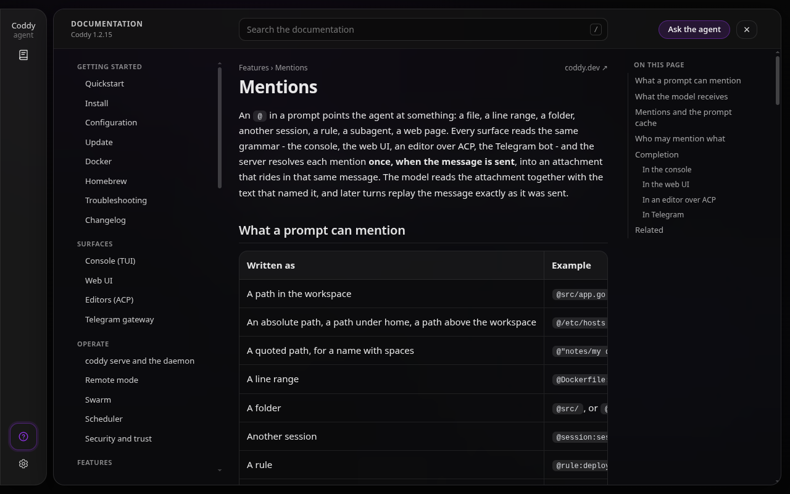

*Читалка документации - содержание, страница, разделы страницы*

Руководство - `docs/features/built-in-docs.md`. Визуальный контракт - `DESIGN.md` (**Documentation screen**).

- **Документация** в боковой панели (над "Настройками"), **F1** в любом месте приложения или адрес
  **`#/docs/<page>#<section>`** открывает читалку (**`ui/docs/DocsView.tsx`**) в той же стеклянной
  док-панели, что и экран роя, одной ширины для обоих (**`--coddy-dock-width`**). Страницы читаются
  с сервера, с которого пришла сама страница, какое бы окружение ни было активно. На удалённом
  сервере, узле или релее читалка всё равно показывает собственную документацию локального
  бинарника. У релея, который отдаёт свою страницу, документации нет, поэтому там пункта
  **Документация** в боковой панели нет. Пункт боковой панели снова открывает страницу, на которой
  читалку оставили; **`#/docs`** без продолжения переходит на первую страницу содержания через
  **`replaceState`**, поэтому "Назад" не возвращает к пустой читалке. Повторное **F1**, **Escape**
  или кнопка **×** закрывают её и возвращают туда, откуда она была открыта (чат, экран роя,
  планировщик); щелчок по подложке тоже её закрывает;
- **`/docs [words or page]`** в поле ввода - команда консоли, которая выполняется в браузере
  (**`ui/docs/docsCommand.ts`**, **`Composer`** **`onDocsCommand`**). Черновик очищается, и ничего
  не отправляется, даже пока идёт ход. Без аргумента команда снова открывает книгу; аргумент с
  **`/`**, **`#`** или схемой или точное название страницы, к которой его сводит
  **`GET /coddy/docs/page`**, открывает эту страницу на её разделе; любые другие слова открывают
  читалку с введённым поиском и раскрытыми результатами (**`searchSeed`**). Группа "Команды" в
  слэш-меню показывает **`/docs`** рядом с командами сервера;
- данные приходят из **`GET /coddy/docs`** (содержание), **`GET /coddy/docs/page`** (одна страница
  с заголовками и соседями) и **`GET /coddy/docs/search`** (**`ui/docs/api.ts`**) через прослойку
  окружения, как и для любого другого маршрута, поэтому удалённое окружение показывает документацию
  того бинарника, с которым работает;
- каждая страница, раздел, результат поиска и сосед - настоящая ссылка с **`href`**. Переход по
  ней добавляет запись в историю ("Назад" и "Вперёд" ходят между прочитанными страницами), щелчок
  средней кнопкой открывает новую вкладку, а **`#`** после заголовка раздела - адрес этого раздела.
  Ссылка **`coddy:<page>#<section>`** в любом отображённом Markdown - на странице или в ответе
  агента - становится **`#/docs/<page>#<section>`** (**`docsHrefFromCoddyLink`** в
  **`scheduler/hashRoute.ts`**, используется в **`markdown/Markdown.tsx`**). Неверная
  экранирующая последовательность во вставленном адресе остаётся как введена и не роняет
  маршрутизатор;
- заголовки получают якоря, вычисленные сервером и сопоставленные по уровню и тексту
  (**`assignHeadingIds`** в **`ui/docs/docsReader.ts`**), затем читалка прокручивает к разделу,
  который называет адрес. **На этой странице** следует за читаемым разделом при прокрутке; при ширине
  меньше 1280 px этот блок убирается, а меньше 1200 px содержание сворачивается в кнопку
  **Содержание** над страницей. Там поиск и страница растягиваются на всю панель, а **На этой
  странице** остаётся - от 900 px этот блок стоит справа от страницы, как на десктопе, а на более
  узком экране сворачивается во вторую кнопку под **Содержание**, которую снова закрывает ссылка на
  раздел. На десктопе поиск заканчивается там же, где текст, включая классическую полосу прокрутки
  страницы. В содержании страницы группы стоят справа от названия группы;
- шапка стоит над колонками страницы - название над содержанием, поле поиска над текстом,
  **Спросить агента** и кнопка закрытия над оглавлением. Шапка не прокручивается. Страница
  прокручивается в теле под ней (**`.docs-body`**), поэтому её полоса прокрутки начинается ниже поля
  поиска. Читалка не шире своих трёх колонок (1350 px) и стоит по центру, поэтому на широком окне
  оглавление держится рядом с текстом;
- поле поиска (**`/`** переводит в него фокус; читалка открывается с клавиатурным фокусом на
  странице, поэтому стрелки и клавиши страниц её прокручивают) ищет по мере ввода, через 120 мс после
  последней клавиши, и выкладывает результаты под собой, а содержание остаётся на месте - страница ›
  раздел и фрагмент с выделенными совпавшими словами. Это комбобокс. Вверх и Вниз двигают выделение
  (**`aria-activedescendant`**), Enter открывает выбранный результат и сворачивает список, Escape
  очищает поиск; в пустом поле Escape закрывает читалку;
- щелчок по изображению на странице открывает его поверх всего (**`ui/components/ImageLightbox.tsx`**,
  отрисовывается в body). Сначала оно вписано, **`+`** / **`-`** / кнопки масштабируют от 100% до
  300%, щелчок по изображению переключает между вписанным размером и 200%, **`0`** снова вписывает,
  Escape или кнопка закрытия закрывают. Увеличенное изображение **перетаскивают** мышью, пером или
  одним пальцем (курсор - открытая ладонь, сжатая, пока изображение удерживается), **колесо** над
  изображением масштабирует вокруг указателя, а не прокручивает сцену или страницу за ней (колесо
  вниз над вписанным изображением ничего не делает), а на сенсорном экране **щипок** двумя пальцами
  плавно масштабирует между вписанным размером и 300%, оставляя точку между пальцами на месте;
  нажатие со сдвигом панорамирует и не переключает масштаб, так что щелчок по-прежнему работает для
  нажатия, оставшегося на месте. Кнопки и клавиши сохраняют лесенку 100 / 150 / 200 / 300 и берут
  следующий уровень выше или ниже от того места, где щипок оставил картинку. Видео на странице
  (изображение Markdown, файл которого **`.mp4`**, **`.webm`** или **`.mov`**, - так сервер
  превращает строку вложения GitHub) воспроизводится в **`<video>`**, загружаемом с GitHub для
  релиза;
- **`@coddy:<page>#<section>`** - ссылка на читалку в отправленном сообщении
  (**`UserMessage.tsx`**) и в ответе (**`markdown/remarkDocMentions.ts`**), которая разбирается по
  грамматике упоминаний (**`ui/docs/docMentions.ts`**); код остаётся кодом;
- **Спросить агента** начинает новый чат (**`askAboutDocs`** в **`App.tsx`**), черновик которого
  упоминает страницу или читаемый раздел; если на странице выделен текст, черновик цитирует
  выделение и упоминает раздел, в котором оно находится (**`askDraftFor`**, **`sectionAnchorAt`**).
  Кнопка сохраняет выделение, потому что не забирает фокус при нажатии мыши, и неактивна, пока
  загружается следующая страница; страница на экране остаётся, приглушённая, пока та не придёт. На
  релее, где чата нет, кнопка не показывается.

## Swagger

- Swagger UI отдаётся по `/docs/`;
- спецификация OpenAPI отдаётся по `/openapi.yaml` и `/openapi.json`;
- ресурсы Swagger UI должны быть встроены, без CDN.

## Порядок разработки

- правьте исходники TypeScript в `external/ui/src/`;
- используйте `npm --prefix external/ui run dev`, чтобы вести разработку без пересборки бинарника Go;
- собирайте и синхронизируйте встраиваемые ресурсы через `npm --prefix external/ui run build:go`;
- **`make build TAGS="http ui"`** выполняет шаг сборки UI (**make ui-build**) перед компоновкой встроенного бандла.

### Воспроизведение отчёта из Safari без Mac

Playwright поставляет сборку WebKit, из которой делается Safari, и её версия следует за версией Safari (**`playwright install webkit`** скачивает WebKit **26.x** для Safari **26.x**), поэтому сообщение о проблеме вёрстки в Safari можно воспроизвести на Linux. **`external/ui/scripts/webkit-scroll-check.mjs`** управляет запущенным **`coddy serve`** в этом движке и проверяет инварианты прокрутки диалога выбора папки на невысоких окнах - ничего не выходит за предел высоты диалога, кнопки действий находятся внутри диалога, список прокручивается колесом, а прокрутка за край остаётся в диалоге.

```bash
cd external/ui && npm i --no-save playwright && npx playwright install webkit
```

```bash
CODDY_URL=http://127.0.0.1:12345 CODDY_FOLDER=/a/folder/with/many/subdirs npm --prefix external/ui run check:webkit
```

**`CODDY_ENGINE=chromium`** выполняет те же проверки в Chromium, что отделяет регрессию только в WebKit от ошибки вёрстки, общей для всех движков. Скрипт не входит в **`make test`**, потому что ему нужны скачанный браузер и живой сервер. **`npm ci`** и **`make ui-build`** удаляют несохранённую установку **`playwright`**, поэтому после пересборки снова выполните строку установки.

### Проверка шеврона сворачивания относительно подписи

Шеврон - это SVG, рисунок которого отцентрован в его viewBox (**`DESIGN.md`**, *Chevron*), потому что в виде текстового глифа он оказывался там, куда его ставил шрифт платформы, и жалобы на шеврон, приподнятый над подписью, возвращались снова и снова. Где на самом деле оказывается значок - факт вёрстки, а вёрстки у jsdom нет, поэтому набор тестов vitest на этот вопрос не ответит. **`external/ui/scripts/chevron-align-check.mjs`** измеряет это в настоящем движке. Для строки рассуждения, строки инструмента и переключателя **Завершённых: N** в панели "Задачи" он сравнивает центр рисунка шеврона с центром рисунка текста подписи (**`Range`** по текстовому узлу, поэтому ни отступы элемента, ни его собственная высота строки не скроют ошибку) и завершается с ненулевым кодом, если они расходятся больше чем на **1px**.

Он работает со **`src/chevron-align-check.html`** - стендом, который монтирует эти три элемента из настоящих компонентов с настоящей таблицей стилей, поэтому ему нужен dev-сервер **`vite`** и совсем не нужен бэкенд.

```bash
cd external/ui && npm i --no-save playwright && npx playwright install chromium
```

```bash
cd external/ui && npx vite --port 5241 &
CODDY_UI_URL=http://127.0.0.1:5241 npm --prefix external/ui run check:chevron
```

**`CODDY_ENGINE=webkit`** (или **`firefox`**) выполняет те же измерения в другом движке, а **`CODDY_CHEVRON_TOLERANCE_PX`** увеличивает допуск. Как и харнес WebKit выше, этот **не входит в `make test`**. Это ручная проверка, её запускают, когда изменение затрагивает шеврон, строки, на которых он стоит, или типографику вокруг них.

### Проверка каретки поля ввода при любом масштабе

Textarea поля ввода держит каретку и рисует свои глифы прозрачными, а зеркало под ней рисует черновик с его чипами (**`DESIGN.md`**, *Composer mirror and caret sync*). Когда они раскладывают текст по-разному (текстовое поле другой ширины переносит строку на другом слове, смещение прокрутки, привязанное к другому пикселю устройства, сдвигает строки), каретка оказывается в стороне от текста, который читает пользователь. Это проявлялось при масштабировании страницы в браузере и после перетаскивания окна на монитор с другой плотностью пикселей, и в Chrome, и в Yandex Browser. **`external/ui/scripts/composer-caret-check.mjs`** измеряет это в настоящем движке. Для каждого случая он дважды снимает поле - глифы textarea, окрашенные в красный, при скрытом зеркале, а затем глифы зеркала - и падает, если отличается хоть один пиксель. Случаи такие - новый чат и чат с полем ввода внизу на 1280 px и телефон на 390 px, коэффициенты масштаба устройства от 1 до 3, масштаб страницы от 110% до 175% (эмулируется CSS-свойством **`zoom`** корня, которое, как и масштаб страницы, оставляет полосу прокрутки в пикселях устройства), черновик, который прокручивается, и черновик, который не прокручивается, поле, прокрученное колесом частично назад, масштаб, изменённый после ввода, и, в Chromium, плотность, изменённая под открытой страницей без изменения размера окна.

Он работает со **`src/composer-caret-check.html`** - стендом, который монтирует настоящий **`Composer`** с настоящей таблицей стилей, поэтому ему нужен dev-сервер **`vite`** и совсем не нужен бэкенд.

```bash
cd external/ui && npm i --no-save playwright && npx playwright install chromium
```

```bash
cd external/ui && npx vite --port 5241 &
CODDY_UI_URL=http://127.0.0.1:5241 npm --prefix external/ui run check:caret
```

**`CODDY_ENGINE=webkit`** (или **`firefox`**) запускает его в другом движке, **`CODDY_BROWSER_PATH`** указывает на установленный Chromium (в том числе на бинарник Yandex Browser), а **`CODDY_CARET_TOLERANCE`** увеличивает число пикселей, которым разрешено отличаться. Firefox пропускает случай с масштабом, изменённым после ввода. Он хранит дробное смещение прокрутки в textarea и округляет смещение div, когда меняется только CSS-свойство **`zoom`**, а его собственный масштаб страницы, то есть смена плотности, так не делает. Как и другие харнесы здесь, это ручная проверка, её запускают, когда изменение затрагивает поле ввода, его зеркало или типографику вокруг них.

### Проверка длинных промптов и цитат

Насколько вырастает текстовое поле внутри поля ввода, где останавливается развёрнутое поле ввода, где стоит кнопка "Цитировать" и где открывается диалог - факты вёрстки, которых jsdom не видит (issue #342; **`DESIGN.md`**, *Composer field height and expand*, *Quote from the transcript*, *Transcript scroll-to-bottom button*). **`external/ui/scripts/long-prompts-check.mjs`** измеряет их на запущенном **`coddy serve`** мышью на 1280 px и пальцем на 390x844, 320x568 и 844x390: текстовое поле растёт вместе с черновиком и останавливается на своём потолке (восемь строк, 40% видимой области, но никогда не настолько высоко, чтобы нижний блок наезжал на шапку чата); кнопка разворачивания стоит над правым краем поля ввода; на телефонах и планшетах верхняя панель стоит на один шаг верхнего ритма ниже края окна, а заголовок - на один шаг ниже панели; в развёрнутом виде заголовок, кнопка и карточка стоят на расстоянии одного шага друг от друга, поле сохраняет фокус при нажатии (клавиатура телефона остаётся открытой), а выбор скилов открывается у нижнего края поля и ничего не затемняет; в свёрнутом виде поле снова по размеру текста; и с клавиатурой, которая сжимает страницу, и с клавиатурой, которая её перекрывает (имитация visual viewport), развёрнутое поле ввода заканчивается над ней; выделение в последнем ответе предлагает "Цитировать" внутри полосы между шапкой и нижним блоком, над выделением при работе мышью и под ним при работе пальцем, а нажатие добавляет цитату в черновик; другой диалог открывается на своём последнем сообщении после того, как читатель прокрутил первый до начала; кнопка разворачивания стоит на 10px выше поля ввода на одной вертикали с волшебной палочкой, а кнопка перехода к последнему сообщению - на 10px выше неё; страница никогда не прокручивается вбок.

Ему нужен сервер с двумя сессиями, каждая длиннее двух экранов и с абзацем в ответе, - первые две из **`GET /coddy/sessions`** или те, чьи идентификаторы указаны в **`CODDY_SESSIONS`**. Если стенд не может показать то, что измеряет проверка, скрипт останавливается с кодом выхода 2 и объясняет почему, а не проходит впустую.

```bash
cd external/ui && npm i --no-save playwright && npx playwright install chromium webkit
```

```bash
CODDY_URL=http://127.0.0.1:18081 npm --prefix external/ui run check:long-prompts
```

**`CODDY_ENGINE=webkit`** запускает его в WebKit, где касание "Цитировать" раньше ничего не делало (там отменённый **`pointerdown`** лишает касание щелчка). **`CODDY_BROWSER_PATH`** направляет Chromium на установленный браузер. Запускайте его, когда изменение затрагивает высоту поля ввода, кнопку разворачивания, кнопку "Цитировать" или переходы по транскрипту.

### Проверка длинного транскрипта

Открывается ли длинный диалог сразу и прокручивается ли без скачков - вопрос вёрстки и времени, на который jsdom ответить не может. **`external/ui/scripts/transcript-window-check.mjs`** отвечает на него на настоящем бинарнике. Он записывает во временную домашнюю папку сессию из 3306 сообщений (около 9 МБ, размер из issue #338) и короткую сессию, поднимает собственную OpenAI-совместимую модель по сценарию, запускает узел **`coddy serve`** с веб-интерфейсом и релей **`coddy serve --swarm`**, который его монтирует, и управляет Chromium с замедлением CPU (по умолчанию x4). Он проверяет следующее и печатает результат таблицей:

- **открытие** на 390 и 1280 px - первое чтение возвращает самую новую страницу, последнее сообщение на экране и внизу в пределах бюджета, ни одна задача не блокирует страницу дольше, DOM держит ограниченный срез, куча остаётся маленькой;
- **прокрутка вверх** по истории - приходят более старые страницы, строка под читателем сдвигается не больше чем на округление (в том числе с выключенной собственной привязкой прокрутки движка, как в WebKit), время кадров, окно остаётся ограниченным, ни один идентификатор строки не повторяется; затем кнопка прокрутки вниз возвращает к последнему сообщению, а старые страницы, которые были отпущены, читаются снова при следующей прокрутке вверх;
- **одноколоночная оболочка** на 390 px, где прокручивается документ;
- **правка** промпта на старой странице называет индекс, известный серверу (откат перехватывается);
- **неудачное чтение** страницы выше ждёт **Повторить**, а не запрашивает снова каждый кадр, и **Повторить** её читает;
- **вопрос, который задаёт модель**, остаётся смонтированным с выбранным ответом, пока читатель уходит далеко вверх по истории и обратно;
- **короткая сессия** читается целиком, и каждая строка доступна;
- **два браузера** на одной сессии - один читает далеко вверху, пока другой выполняет ход и затем откатывает его, а читатель следует за обоими без полного перечитывания;
- **релей роя** - те же чтения через монтирование релея.

```bash
make build TAGS="http ui swarm"
npm --prefix external/ui i --no-save playwright && npx --prefix external/ui playwright install chromium
CODDY_BIN=build/coddy npm --prefix external/ui run check:transcript
```

**`CODDY_CPU_THROTTLE`** задаёт замедление (**`1`** его выключает), **`CODDY_BUDGET_SCALE`** умножает бюджеты времени для медленной машины, **`CODDY_SCENARIOS`** запускает часть сценариев (**`open`**, **`scroll`**, **`phone`**, **`edit`**, **`retry`**, **`prompt`**, **`short`**, **`two-browsers`**, **`swarm`**), **`CODDY_ENGINE=webkit`** запускает их в WebKit (без замедления и без замеров длинных задач и кучи, которые есть только в Chromium), **`CODDY_BROWSER_PATH`** указывает на установленный Chromium, а **`CODDY_E2E_KEEP=1`** оставляет стенд работающим. CI запускает его на полной скорости в джобе **`http,scheduler,ui,memory,cli,swarm`** тестовой матрицы. Запускайте его, когда изменение затрагивает окно транскрипта, маршруты messages или tool-calls или то, что отображает строка транскрипта.

### Проверка очереди сообщений через релей роя

Доходит ли сообщение из очереди до модели в нужном режиме и видит ли его каждый браузер - вопрос к настоящему бинарнику с по-настоящему идущим ходом. **`external/ui/scripts/queue-modes-check.mjs`** на него отвечает. Он поднимает OpenAI-совместимую модель по сценарию, которая держит свои первые ответы открытыми, пока скрипт их не отпустит, запускает узел **`coddy serve`** без **`agent.queue_mode`** и релей **`coddy serve --swarm`**, который его монтирует, и управляет Chromium через монтирование релея, пока второй браузер смотрит ту же сессию напрямую на узле. Он проверяет:

- **вопрос при первом использовании** появляется для первого сообщения, написанного во время хода, а ответ сохраняется как **`agent.queue_mode`** в **`config.yaml`** узла через релей;
- **Tab** ставит в очередь сообщение с изображением в другом режиме, очередь называет изображение и никогда не несёт его байты, а другой браузер видит обе строки;
- **смена режима** (PATCH) и **возврат сообщения** (его текст и изображение возвращаются в черновик) работают через релей;
- **после ответа** модель читает сообщение для текущего хода, затем отложенное как отдельный промпт с его изображением, а живой транскрипт показывает отложенное сообщение над его ответом;
- **изображение загружается через релей** - его миниатюра после хода и после перезагрузки, оригинал в просмотрщике, при этом ни один ресурс не запрашивается у собственного origin релея и ни один URL не несёт токен;
- **Остановить генерацию** оставляет сообщение "после хода" ждать, не запуская его, и оно выполняется после следующего ответа;
- **Настройки → Цикл ReAct** показывает сохранённый режим.

```bash
make build TAGS="http ui swarm"
npm --prefix external/ui i --no-save playwright && npx --prefix external/ui playwright install chromium
CODDY_BIN=build/coddy npm --prefix external/ui run check:queue
```

**`CODDY_SHOTS_DIR`** дополнительно снимает скриншоты для страницы [Очередь сообщений](../features/message-queue.md) на втором узле, к которому обращается напрямую, **`CODDY_BROWSER_PATH`** указывает на установленный Chromium, **`CODDY_PORT_BASE`** сдвигает четыре его порта, а **`CODDY_E2E_KEEP=1`** оставляет стенд работающим. CI запускает его в джобе **`http,scheduler,ui,memory,cli,swarm`** тестовой матрицы после проверки транскрипта.

### Проверка видов чата через релей роя

Кнопки видов, док-панель и окно "Файлы" проверяются на настоящем бинарнике скриптом
**`external/ui/scripts/files-check.mjs`**. Он поднимает модель по сценарию, первый ответ которой
записывает файл инструментом `write`, запускает узел **`coddy serve`**, требующий bearer-токен, и
релей **`coddy serve --swarm`**, который монтирует узел со своим клиентским токеном, и управляет
браузером только через монтирование релея. Он проверяет:

- **кнопки видов** - рядом с заголовком в этом порядке стоят "Файлы" и "Задачи" и нет кнопки
  "Правки"; "Файлы" на десктопе - значок 18px с коротким названием, "Задачи" - точка; при наведении
  подсказка появляется внутри окна (у "Файлов" - с клавишей); нажата кнопка показанного вида, она
  ярче, но не в акцентном цвете, а второе нажатие убирает вид;
- **плашку над полем ввода** - она называет репозиторий и ветку, примыкает к верху карточки поля
  ввода с теми же левым и правым краями, несёт счётчик git у правого края без обводки и осветляет фон
  счётчика при наведении; у чата в чистой папке плашка есть, но без счётчика;
- **окно правок** - оно открывается со счётчика, показывает файл, который записал ход, и его адрес,
  а Escape его убирает; **док-панель** показывает фоновые задачи, и полоски вкладок нет нигде; каждый
  значок рядом со словом стоит посередине его строчных букв при любой ширине;
- **отмену правок** файла из окна правок - она сначала спрашивает подтверждение и проходит через
  релей, а когда ничего не осталось, окно говорит, что папка чистая, и счётчик уходит с плашки;
- **окно "Файлы"** - оно открывается поверх чата с фокусом в фильтре, показывает папки первыми,
  находит по имени файл на три папки вглубь, открывает файлы вкладками, ничем не закрывая файл,
  показывает README как исходник без загруженных картинок, загружает картинку из рабочей папки через
  релей, разворачивается поверх боковой панели, закрывается по Escape, открывается и закрывается по
  `Ctrl+Shift+F` с сохранением вкладок и открывает упоминание из диалога на его строке;
- **воспроизведение звука через релей** - звук играет только по своему подписанному адресу, адрес
  отвечает на запрос диапазона без заголовка, поддельный адрес узел отклоняет, а **Скачать**
  сохраняет файл под его именем;
- **телефон** - окно помещается в экран и показывает файл, открытый по адресу, без дерева, "Файлы" -
  значок 40 px рядом с заголовком, "Задачи" - точка и слово, а плашка остаётся примкнутой к карточке
  поля ввода со счётчиком у правого края;
- **другой origin** (собственный веб-интерфейс узла с релеем в качестве окружения) - окно читает
  через релей, `HEAD` с `If-None-Match` проходит preflight релея, `ETag` читается, а открытый файл
  перепроверяется;
- **каждый уровень сетки** (от 600 до 1920 px) на английском и на русском - окно помещается в
  область просмотра с деревом рядом с файлом, а кнопки видов стоят рядом с заголовком в один ряд,
  значок и короткое название целиком, на высоте верхней панели.

```bash
make build TAGS="http ui swarm"
npm --prefix external/ui i --no-save playwright && npx --prefix external/ui playwright install chromium
CODDY_BIN=build/coddy npm --prefix external/ui run check:files
```

**`CODDY_ENGINE=webkit`** запускает его в WebKit, **`CODDY_SHOTS_DIR`** дополнительно снимает
скриншоты этой страницы на третьем узле, к которому обращается напрямую, **`CODDY_BROWSER_PATH`**
указывает на установленный Chromium, **`CODDY_PORT_BASE`** сдвигает четыре его порта, а
**`CODDY_E2E_KEEP=1`** оставляет стенд работающим. CI запускает его в джобе
**`http,scheduler,ui,memory,cli,swarm`** тестовой матрицы после проверки очереди сообщений.

### Проверка Telegram Mini App

`npm run check:telegram` (`external/ui/scripts/telegram-mini-app-check.mjs`) открывает веб-интерфейс как Telegram Mini App без Telegram. Он запускает [tgfake](../contributing/tgfake.md) с его моделью по сценарию и настоящий `coddy serve`, чей бот общается со стендом, и управляет страницей чата стенда, которая открывает кнопку бота `/app` в своей рамке телефона. Он проверяет кнопку меню и `/app`; то, что Mini App запрашивает у клиента (разворачивание, отключённые свайпы, цвет шапки, ready последним); адрес без данных запуска; наполовину открытое окно, в которое входят, когда транскрипт стоит на последнем сообщении (поле ввода и это сообщение видны, ничего не шире страницы, заголовок чата по-прежнему прилипает к верху); лист режимов и лист контекста стартового экрана внутри видимой части; "Назад"; светлую тему Telegram; и примечание о входе во фрейме с другого сайта (страница стенда на `localhost`, веб-интерфейс на `127.0.0.1`).

```bash
make build TAGS="http ui gateway"
cd external/ui
npm i --no-save playwright && npx playwright install chromium   # once
CODDY_BIN=../../build/coddy npm run check:telegram
```

`CODDY_BROWSER_PATH` указывает на установленный Chromium вместо скачанного Playwright, `CODDY_SCENARIOS` запускает часть из `bot`, `open`, `half`, `sheets`, `theme` и `signin`, `CODDY_SCREENSHOTS` записывает снимки, которые показывают эта страница и страница шлюза, а `CODDY_E2E_KEEP=1` оставляет стенд работающим, чтобы на него можно было посмотреть.

### Проверка диаграмм и формул

Рисует ли Mermaid, декодирует ли браузер картинку, приходят ли шрифты KaTeX и помещается ли картинка в транскрипт - факты настоящего движка. **`external/ui/scripts/diagram-check.mjs`** открывает **`src/diagram-check.html`** - стенд, который монтирует из настоящих компонентов с настоящей таблицей стилей ответ с шестью диаграммами Mermaid (блок-схема, диаграмма последовательности, mindmap, диаграмма Ганта, круговая и диаграмма классов), SVG, сломанной диаграммой, строчными и выносными формулами и ценой, во всех семи темах на **360** и **1280px**. Скрипт падает, если картинка не нарисована или вылезает за колонку, сломанная диаграмма не называет свою ошибку, формула не набрана, шрифт KaTeX не загрузился, цена стала формулой, страница прокручивается вбок, Mermaid и KaTeX не были загружены по требованию или что-либо записано в журнал как ошибка.

```bash
cd external/ui && npx vite --port 5247 &
CODDY_UI_URL=http://127.0.0.1:5247 npm --prefix external/ui run check:diagrams
```

Для скриншотов стенд также принимает **`?theme=<id>`**, **`?lang=ru`** и **`?case=<name>`** (один ответ стенда). **`CODDY_BROWSER_PATH`** и **`CODDY_ENGINE=webkit`** работают так же, как в проверках выше. Он **не входит в `make test`**. Запускайте его, когда изменение затрагивает отрисовщики Markdown, их стили или сборку чанков.

### Проверка транскрипта на каждой ширине сетки

Строка шире транскрипта прокручивает вбок всю страницу в одноколоночной оболочке, а помещается ли строка - факт вёрстки, о котором jsdom ничего не скажет. **`external/ui/scripts/phone-overflow-check.mjs`** измеряет это в настоящем движке на проверочных ширинах сетки (**360**, **375**, **393**, **430**, **599**, **600**, **834**, **1199**, **1280px**) на обоих поставляемых языках, после загрузки шрифтов и окончания анимаций строк. Страница не должна прокручиваться вбок, ничто не должно вылезать из **`.messages-inner`**, кроме как внутри блока, который читатель может прокрутить вбок (таблица, блок кода; блок, который только обрезает, ничего не оправдывает), каждая строка инструмента держит длительность внутри строки, а цель, маркер и длительность - на одной линии, ни одна цель не уже своих первых 24px, диапазон строк **`read`** части файла показывается целиком при любой длине пути, а строки с короткой подписью остаются в одну линию на любой ширине. При нарушении любого из этих условий скрипт завершается с ненулевым кодом.

Он работает со **`src/phone-overflow-check.html`** - стендом, который монтирует из настоящих компонентов с настоящей таблицей стилей строки, раньше вылезавшие за край (строки инструментов, названных как инструменты MCP, одна из которых отвечает JSON-документом с неразрывным токеном, а упавшие идут с долгой длительностью; длинная команда; встроенный инструмент, чей вывод - одна неразрывная строка; ответ с таблицей, блоком кода, длинной ссылкой и длинным идентификатором; пользовательское сообщение из одного неразрывного слова), в колонке с отступами чата и его десктопной полосой 920px, со всеми раскрытыми строками инструментов, поэтому ему нужен dev-сервер **`vite`** и не нужен бэкенд.

```bash
cd external/ui && npx vite --port 5241 &
CODDY_UI_URL=http://127.0.0.1:5241 npm --prefix external/ui run check:overflow
```

Playwright устанавливается так же, как для проверки шеврона выше. **`CODDY_BROWSER_PATH`** направляет скрипт на установленный браузер (**`/usr/bin/chromium`**) вместо того, что скачивает Playwright, а **`CODDY_ENGINE=webkit`** запускает его в WebKit. Он **не входит в `make test`**. Запускайте его, когда изменение затрагивает строки транскрипта, стили Markdown или сетку.

### Проверка карточек переданных файлов

Карточка переданного файла обрезает то, что за неё выходит (миниатюру по своим углам), поэтому её меню действий отрисовывается в документ и позиционируется от **⋮** (**`DESIGN.md`**, *Shared file cards*); пока меню было внутри карточки, щелчок по **⋮** ничего не показывал. Видно ли меню и можно ли до него добраться, где оказывается значок - факты вёрстки, на которые jsdom не ответит. **`external/ui/scripts/artifact-card-check.mjs`** измеряет их в настоящем движке, в широком и узком окне десктопа и на эмулированных телефонах (касание, без наведения) шириной **390**, **360** и **320px** в вертикальном положении и **844** и **568px** в горизонтальном, на обоих поставляемых языках. Каждая карточка соответствует своему проектному размеру, кнопка **⋮** стоит на одном уровне со значком расширения и зеркально повторяет его положение на другой стороне карточки, её точки отцентрованы, она видна под указателем и всегда видна на сенсорном экране, щелчок или касание открывает одно меню внутри окна, каждый пункт которого откликается на указатель в своём центре и ни один не обрезан, меню забирает фокус, повторное нажатие, нажатие в другом месте и **Escape** (который возвращает фокус на **⋮**) его закрывают, правый щелчок его открывает, у нижнего края окна оно открывается вверх, следует за своей карточкой при прокрутке и закрывается, когда карточка ушла из окна или **⋮** закрыт другим слоем (как это делают прилипающий заголовок чата и поле ввода внизу), окно ниже меню держит его внутри и прокручивает пункты, кнопка копирования под ответом, который заканчивается карточками, стоит ниже них только на собственный отступ, а страница никогда не прокручивается вбок. При нарушении любого из этих условий скрипт завершается с ненулевым кодом.

Он работает со **`src/artifact-card-check.html`** - стендом, который монтирует из настоящих компонентов с настоящей таблицей стилей ряд карточек внутри ответа, карточку под строкой **`share_file`** и карточку, завершающую ответ внизу длинной страницы, поэтому ему нужен dev-сервер **`vite`** и не нужен бэкенд.

```bash
cd external/ui && npx vite --port 5243 &
CODDY_UI_URL=http://127.0.0.1:5243 npm --prefix external/ui run check:artifacts
```

Playwright устанавливается так же, как для проверки шеврона выше. **`CODDY_BROWSER_PATH`** и **`CODDY_ENGINE=webkit`** (или **`firefox`**) работают так же, как в проверках выше, а **`CODDY_ARTIFACT_TOLERANCE_PX`** увеличивает допуск в **1px**. Он **не входит в `make test`**. Запускайте его, когда изменение затрагивает карточки переданных файлов, их меню или стили.

## Сценарии тестов интерфейса

Эти сценарии рассчитаны на автоматический прогон в Playwright на dev-сервере Vite.

- На десктопе у навигации нет переключателя ширины:
  - Дано ширина области просмотра 1200-1919px;
  - Когда приложение загружается;
  - Тогда `data-testid="nav-history"` виден;
  - И `.rail-toggle-width` отсутствует;

- Escape закрывает экран, открытый с боковой панели:
  - Дано чат открыт по адресу `#/s/<sessionId>`;
  - Когда пользователь открывает с боковой панели **Документация**, **Настройки**, **История** или **Планировщик** и нажимает Escape;
  - Тогда экран закрывается, и адрес снова `#/s/<sessionId>`;
  - Когда открыта строка **Настроек** (`#/settings/models?id=<model>`) и пользователь нажимает Escape;
  - Тогда форма строки возвращается к списку, а следующий Escape закрывает **Настройки**;
  - Когда в поиске по документации есть текст и пользователь нажимает в нём Escape;
  - Тогда поиск очищается, а просмотр документации остаётся открытым; следующий Escape закрывает его;

- Сессии открываются только в выдвижной панели:
  - Дано любая десктопная область просмотра;
  - Когда приложение загружается;
  - Тогда `data-testid="sessions"` не виден;
  - Когда пользователь щёлкает `data-testid="nav-history"`;
  - Тогда `data-testid="sessions"` становится видимым;
  - Когда пользователь щёлкает `data-testid="sessions-close"`;
  - Тогда выдвижная панель сессий скрывается;

- На телефоне используются верхняя панель и бренд в одну строку:
  - Дано ширина области просмотра не больше 1199px;
  - Когда приложение загружается;
  - Тогда переключателя ширины навигации нет;
  - И высота панели навигации 78px;
  - И сессии по-прежнему открываются из **История** в верхней панели;

- Стартовый экран и чат помещаются на телефоне:
  - Дано ширина области просмотра 360, 390 или 430px;
  - Когда загружается стартовый экран, а затем то же в чате;
  - Тогда `document.documentElement.scrollWidth` равен `clientWidth`;
  - И прямоугольник `#btn-send` не пересекает ни одной видимой части `.composer-tab`;
  - И прямоугольник `.rail-brand` не пересекает ни одной иконки верхней панели;
  - И каждая иконка верхней панели лежит внутри таблетки; при ширине меньше примерно 270px панель показывает История, Настройки и Ещё, а в Ещё перечислены Документация и Планировщик;
  - И `textarea#composer` вычисляется в 16px;
  - Когда ширина области просмотра 768 или 1280px;
  - Тогда ряды поля ввода переносятся, а верхняя панель выглядит так же, как до блока для телефона;

- Enter зависит от устройства ввода:
  - Дано окно настольного браузера шириной 390px;
  - Когда пользователь набирает черновик и нажимает Enter;
  - Тогда черновик отправляется;
  - Когда пользователь нажимает Ctrl+Enter в середине черновика;
  - Тогда у курсора появляется перевод строки, и ничего не отправляется;
  - Дано устройство только с сенсорным вводом (контекст Playwright с `isMobile` и `hasTouch`);
  - Когда пользователь нажимает Return;
  - Тогда вставляется перевод строки, а отправляет кнопка "Отправить";

- Вызовы инструментов переживают перезапуск:
  - Дано в сессии выполнены вызовы инструментов;
  - Когда пользователь перезагружает страницу;
  - Тогда карточки вызовов инструментов видны в транскрипте;
  - И раскрытая карточка инструмента показывает своё превью с выводом под ним или структурированную карточку инструмента, без кнопок одобрения;
  - И если сервер пометил превью как обрезанное, **Ещё…** и затем **Свернуть** ведут себя, как в таблице выше; если превью не обрезано, строки переключения переполнения нет, и на панели результата нет **`tool-result-viewport--tall`**;

- Обрезка результата инструмента (Playwright MCP):
  - Дано сохранённая сессия, у которой вывод инструмента на диске превышает лимит строк превью;
  - Когда пользователь открывает карточку инструмента и щёлкает **Ещё…**;
  - Тогда кнопка превращается в **Свернуть**, полные строки доступны в той же прокручиваемой панели с ограниченной максимальной высотой, а у **`.tool-result-viewport--scroll`** **`scrollHeight`** больше **`clientHeight`**;
  - Когда пользователь щёлкает **Свернуть**;
  - Тогда превью показывает обрезанный текст, который заканчивается на **`...`**, у **`.tool-result-viewport--clip`** **`overflow-y`** скрыт, и снова появляется **Ещё…**;

- Расход токенов переживает перезапуск:
  - Дано у сессии ненулевой расход токенов;
  - Когда пользователь перезагружает страницу;
  - Тогда подсказка кольца контекста показывает сохранённые Ввод, Вывод и Всего;

- Запуск памяти в панели задач (Playwright MCP):
  - Дано **`memory.enable: true`** у процесса **`coddy serve`** и хотя бы один Markdown-файл в глобальной памяти или в памяти рабочей папки, чтобы поиск в памяти мог выполниться;
  - Когда пользователь отправляет в чат сообщение, которое проходит полный ход ReAct;
  - Тогда в транскрипте нет строки памяти, а пока запуск идёт, живая строка статуса показывает **Работаю с памятью**;
  - Когда пользователь открывает панель задач;
  - Тогда задача с подписью **`memory: <first line of the message>`** несёт тег **память** (**`bgtask-tag-<id>`**), её карточка ещё до раскрытия предлагает **Показать транскрипт** дочерней сессии только для чтения, а раскрытая карточка показывает журнал дочерней сессии, который заканчивается на **`=== subagent report ===`**, и строку доставки.

Чтобы прогнать Playwright MCP против живого шлюза, соберите **`make build TAGS="http ui memory"`**, затем запустите **`./build/coddy serve`** с одноразовым **`--home`**, чтобы конфигурация могла включить память; откройте **`http://127.0.0.1:<port>/`**, перейдите в сессию, отправьте промпт, откройте панель задач и проверьте метку **память** в строке запуска.

<!-- docsgen:source sha256=e609e45c422b7914 -->
