# Coddy embedded UI specification

This page captures the original UI requirements and the intended end state. It is a functional spec and a design contract, with a screenshot of each surface next to the section that specifies it. The visual tokens and component contracts are in [DESIGN.md](../../DESIGN.md).

https://github.com/user-attachments/assets/55e9e66f-8a8d-47be-af75-596b8b00fafa

*A two-and-a-half-minute recording of the web UI, from the model picker through streamed tool calls and the permission card to the History drawer and the environment switch. The file is in the repository as [web-ui.mp4](../assets/video/web-ui.mp4).*

## Constraints

- UI ships as static assets embedded into the `coddy` binary (build tag `http`).
- Runtime has no auth and no API key checks for the UI.
- UI must work over the same origin as `coddy serve`.
- UI localization is registry-driven; English is the default and **Russian (RU)** ships today, selectable from **Settings → Appearance → Language** (see below).
- Favicon matches [coddy.dev](https://coddy.dev/) (**`/coddy-favicon.svg`**, same mark as **`docs/assets/coddy-logo-mark-flat.svg`**, plus PNG/ICO fallbacks embedded with the SPA).

## Appearance (theme + language)

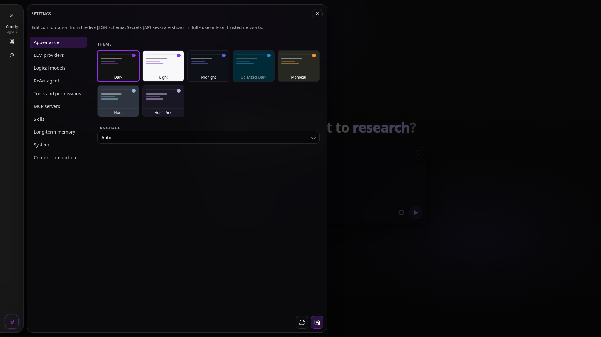

*Settings, Appearance tab: the theme swatches and the language picker*

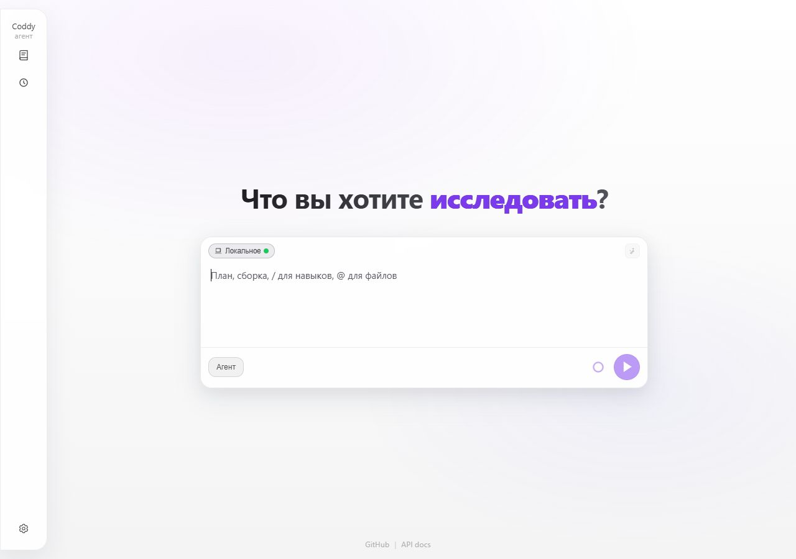

*The Russian dictionary applied to the settings and the conversation*

- **Default:** dark theme on first visit; language resolves from **`navigator.language`** (RU if Russian, else EN).
- **Theme cookie:** **`coddy_ui_theme`** with the seven theme ids (**`dark`**, **`light`**, **`midnight`**, **`solarized-dark`**, **`monokai`**, **`nord`**, **`rose-pine`**; path **`/`**, **`SameSite=Lax`**, 1-year `Max-Age`).
- **Theme picker:** **Settings** (**`#/settings`**) → **Appearance** → theme swatch grid (**`data-testid="theme-swatch-<id>"`** inside **`appearance-theme-picker`**). Selection applies immediately and is client-side only (no config save).
- **Language picker:** one native select **directly under the theme grid** (**`data-testid="appearance-language-select"`**) with **Auto** (resolves from **`navigator.language`**, stores no cookie) followed by every locale registered in **`locales.ts`**. The current registry renders **English** and **Русский**; changing the select applies the locale immediately.
- **Language cookie:** **`coddy_ui_lang`** stores a registered locale id (currently **`en`** or **`ru`**), with the same flags as the theme cookie. Choosing **Auto** clears it. Resolution order on load: **`?lang=<registered-id>`** in the URL (also persisted to the cookie) > cookie > **`navigator.language`**. Switching sets **`document.documentElement.lang`** and re-renders without a reload. Purely client-side (no config save).
- **i18n engine:** **`external/ui/src/ui/i18n/`** (**`translate`/`t`**, locale store, **`I18nProvider`** + **`useT()`**). **`locales.ts`** is the single registry for supported ids, picker labels, and dictionaries; picker generation, locale validation, bootstrap, and parity tests derive from it. **`main.tsx`** wraps the app plus shared confirmation provider in **`I18nProvider`**. **`useT()` falls back to `translate` outside a provider**, so components render in tests without wrapping; default-English values match the former hardcoded literals exactly.
- **Locale maintenance:** adding a locale requires its dictionary plus one **`locales.ts`** entry. Every registered dictionary must add or change the same key and interpolation tokens in one patch; **`messagesParity.test.ts`** enforces both.
- **Plural copy:** counted strings use **`translatePlural`** / **`tp(key, count)`** with one dictionary entry per CLDR category (**`key.one`**, **`key.few`**, **`key.many`**, **`key.other`**), so Russian declines the noun by the number instead of falling back to one form. Each locale must supply exactly the categories its own **`Intl.PluralRules`** produces; the parity test derives that set per locale.
- **Coverage:** Appearance + Settings surfaces are translated (Settings shell, sections, MCP, Skills, CodexAuth, ModelField/Picker, Combobox), schema-driven settings field labels and descriptions are translated too (see below), and the conversation surfaces are translated too: nav rail, hero title, composer (modes, model picker, attachments, slash/@ menus, environment and folder modals), message rendering (thinking, tool calls, compaction, copy controls), permission and question prompts, plan document card, History sidebar, scheduler drawer and job editor, background tasks panel, the env health banner, and the swarm screen with its topology graph. Shared destructive confirmations for drafts, chats, and scheduler jobs are translated as well.
- **Schema field localization:** settings sections rendered from the server JSON Schema (providers, models, agent, tools, subagents, hooks, memory, compaction, scheduler, logger, gateways, sessions, and the parts of the Prompts tab) localize their field labels and descriptions client-side via **`settings/schemaI18n.ts`**: the dictionary key derives deterministically from the section id and the dotted field path (**`settings.schema.<section>.<path>.label` / `.desc`**, the parts of the Prompts tab, folded in from the `prompts` and `instructions` keys, as **`settings.schema.system.<child>.<path>`**). A key no dictionary defines falls back to the schema's own English text, so unmapped or newly added server fields never leak a raw key. Array item rows inherit the domain for their nested fields but keep their own fallback for the row label, so the enclosing fieldset legend and description are not repeated per row.
- **Settings sub-panels (Appearance / Skills) are mutually exclusive** — opening one closes the other. Only one sub-panel may be expanded at a time.
- **Persistence:** switching theme writes the cookie and sets **`document.documentElement.dataset.theme`**; reload must keep the chosen theme.
- **CSS contract:** **`--text`** and **`--bg`** on **`[data-theme="light"]`** are **`#18181b`** and **`#f8f8fa`**; glass panels use **`rgba(255, 255, 255, 0.9)`** (not dark tint). Dark defaults remain on **`:root`** / **`[data-theme="dark"]`**.

## Settings: compaction model

In **Settings → Context compaction**, **Summarizer model** offers a searchable
dropdown of the logical models configured in the current settings document,
including unsaved model edits. Select a model or enter an identifier manually.
Clear the field to use the session model for summarization.

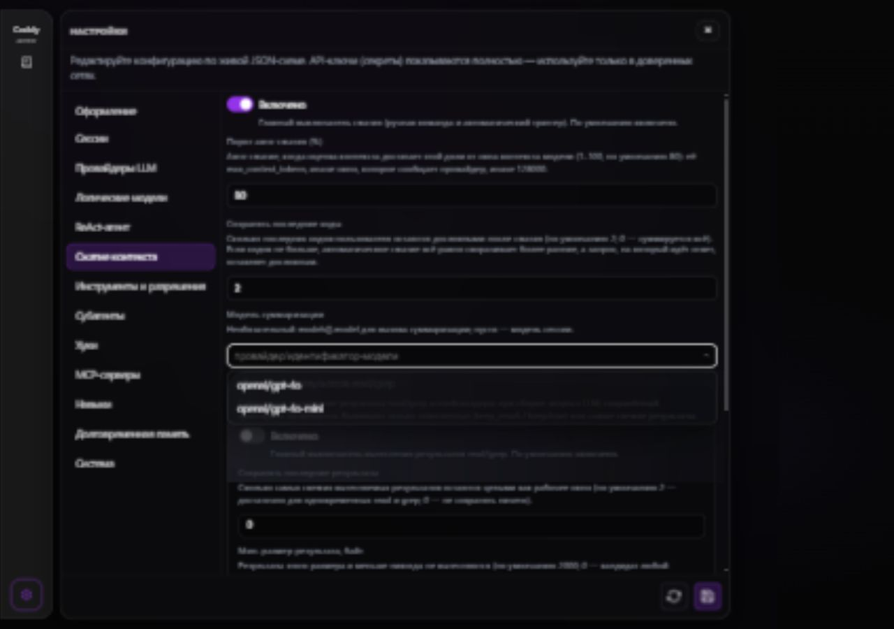

*Configured summarizer models in Settings → Context compaction (Dark, 1280 px).*

## Settings: Codex OAuth

- In **Settings → LLM Providers**, a row with **`type: codex`** hides the generic **API base URL**, **API key**, and **API key command** fields and renders **Sign In with ChatGPT**. The sign-in works before Save, on a new row and on a saved row whose type picker was just switched to codex alike; the latter keeps only its **`proxy`** for the sign-in.
- The button starts **`POST /coddy/providers/{name}/codex-auth/device`**, opens the returned official verification page, displays the one-time code, and polls **`GET .../device/{loginID}`** until completion or failure. The displayed link remains available if the browser blocks the automatic tab.
- Connected state comes from **`GET /coddy/providers/{name}/codex-auth`**. **Sign Out** deletes only the Coddy-managed credential through **`DELETE`**; a server-side Codex CLI login may still appear as a compatibility connection.
- OAuth tokens never enter the settings document or browser. They are stored by the server under **`$CODDY_HOME/providers/<name>/codex-auth.json`**.

## Settings: NeuralDeep sign-in

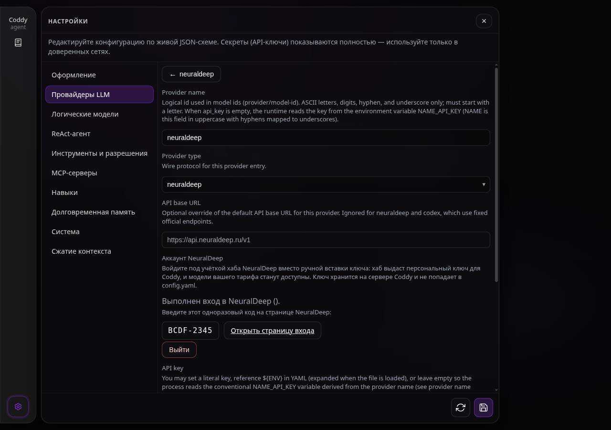

*A NeuralDeep provider row after Sign In, the hub-issued key in use*

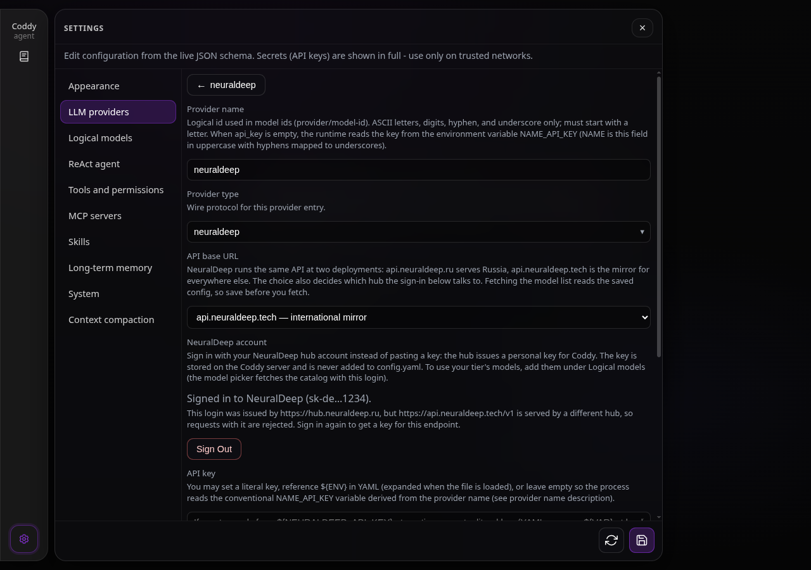

*The endpoint dropdown warning that the stored login came from the other deployment*

- In **Settings → LLM Providers**, a row with **`type: neuraldeep`** replaces the free-text **API base URL** with a dropdown of the two official deployments - **`https://api.neuraldeep.ru/v1`** (Russia) and **`https://api.neuraldeep.tech/v1`** (the international mirror) - written to **`providers[].api_base`**; the pick also decides which hub the sign-in below talks to, and the sign-in follows the dropdown as it stands in the form (the device start carries the picked endpoint), so Save is not required first. That holds for a saved row whose type picker was just switched to neuraldeep too, such as the **`openai`** row **`config.example.yaml`** ships: the sign-in is not refused for the type the row was saved with, and only that row's **`proxy`** carries over to it, since its endpoint and key belong to the other type. A stored **`api_base`** that is not one of the two is flagged under the field and ignored by the server. The row keeps the manual **API key** field and renders **Sign In with NeuralDeep** below the endpoint picker (**`NeuralDeepAuthField`**). Signing in is the no-paste alternative; an explicit key always wins and the widget says so instead of pretending the login is active (**`source`** from the status endpoint). When the key that wins is the server's **`<NAME>_API_KEY`** variable (**`OPENAI_API_KEY`** for a row named **`openai`**), the note names that variable instead of pointing at the empty **API key** field.
- The button starts **`POST /coddy/providers/{name}/neuraldeep-auth/device`** (the hub's RFC 8628 device flow for client **`coddy`** — the browser and the Coddy server may be different machines), opens the returned portal page with the pre-filled code, displays the one-time code, and polls **`GET .../device/{loginID}`** until completion or failure.
- Connected state comes from **`GET /coddy/providers/{name}/neuraldeep-auth`** (masked key only), read for the endpoint currently picked (**`?api_base=`**). When the stored login was issued by the other deployment's hub (**`hub`** differs from **`endpoint_hub`**), a note under the status says requests with it are rejected and asks to sign in again for this endpoint; the note is suppressed while an explicit key shadows the login. A login already in progress keeps polling if the endpoint is changed meanwhile (the key comes from the hub the flow started with), and the status read afterwards flags the mismatch. **Sign Out** best-effort revokes the key on the hub, then deletes the local credential through **`DELETE`**.
- The key never enters the settings document or browser; it is stored by the server under **`$CODDY_HOME/providers/<name>/neuraldeep-auth.json`**. Tier models are added under **Logical models** from the **Models** list at the end of the provider form, which fetches the provider catalog with this login before the row is saved (see [Settings: provider models](#settings-provider-models)); the CLI flow (**`coddy providers login neuraldeep`**) appends them to the config automatically.

## Settings: provider proxy

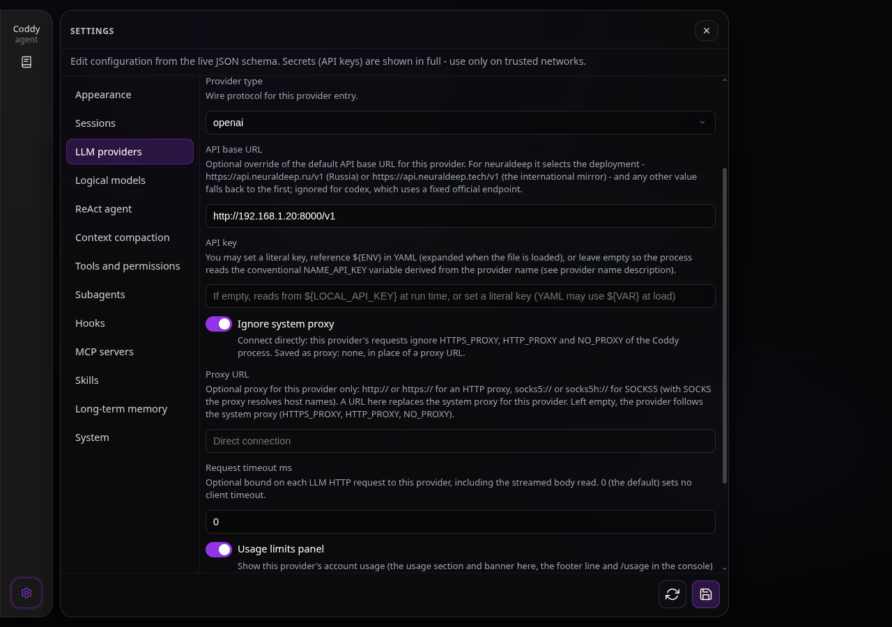

*A provider row set to connect directly, its proxy URL field disabled*

- Every row in **Settings → LLM Providers**, codex included, carries an **Ignore system proxy** switch above the **Proxy URL** field (**`ProxySettingField`**). Both edit **`providers[].proxy`**, the route of every request of the row: its completions, its model list, its account usage and its sign-in ([Provider proxy](../getting-started/configuration.md#provider-proxy)). The Telegram bot's **`gateways.telegram.proxy`** reads the same way and has the same pair in **Settings → Gateways**, in the Telegram block ([Telegram gateway](gateway.md#proxy)).
- The switch writes **`none`**: the row connects directly and ignores **`HTTPS_PROXY`**, **`HTTP_PROXY`** and **`NO_PROXY`** of the Coddy process. While it is on, the URL field is disabled and reads **Direct connection**.
- With the switch off, a URL in the field sends every request of the row through that proxy, and an empty field (or a stored **`inherit`**) reads **Follows the system proxy**, the default route.
- Turning the switch off brings back what the row held before it went on, for as long as the form is open. The document keeps one value, so after **Save** a row set to **`none`** no longer remembers the URL it replaced.
- The value travels through **`GET`** / **`PUT /coddy/config`** as written. A value that is neither a keyword nor a proxy URL is refused on **Save**, and the error names the accepted ones.

## Settings: provider models

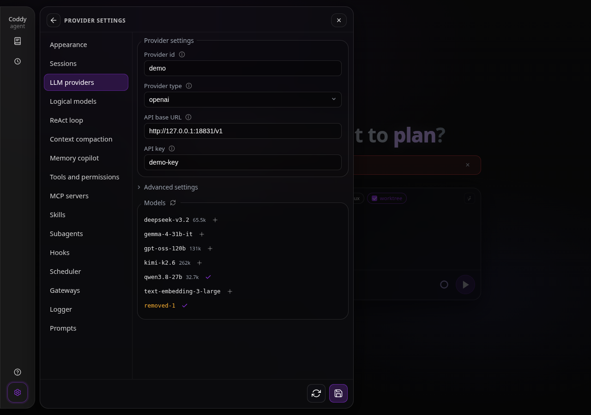

*A provider's form ends with what the provider advertises: a plus files an id under Logical models, a check marks one already there and takes it out again, an amber id is one the provider no longer advertises.*

- A provider's form (**Settings → LLM providers → row**) is three blocks: **Provider settings** (id, type, endpoint, key, sign-in, the usage switch), **Advanced settings** (the credential command, the proxy, the request timeout), folded until its chevron is clicked, and **Models**.
- **Models** lists what the provider advertises, fetched through **`POST /coddy/providers/models`** with the row exactly as the form holds it, so an unsaved row, a sign-in that exists only on disk and a provider the document does not have yet all list their models the way a saved row does (issue #335). The list is fetched when the form opens and again when the row becomes another provider, once its id or type has stopped changing; an edit to the endpoint, the key or the proxy waits for the refresh icon beside the **Models** title, which fetches at once with the row as it now stands. An automatic fetch never sends the credential command, so a command is not run half-typed: the refresh icon is the only fetch that runs it.
- Each row is the model id, the context window the provider reports right of it (**`131k`**, the exact count in its tooltip), and a toggle: a plus adds **`provider/id`** to **Logical models** in the same unsaved document, with the reported window written into its **Context window**; a check says the model is there, and clicking it takes the model out again. Nothing reaches `config.yaml` until **Save all**. An id Logical models lists under this provider that the provider no longer advertises shows in amber, checked, the reason in its tooltip. A line under the title appears only when there is nothing to list: while fetching, on an error, for an empty answer, or for a row without an id and a type. Past eight models a filter field narrows the list.
- The open row is part of the address: **`#/settings/providers?id=demo`**, **`#/settings/models?id=demo%2Fqwen3.8-27b`**. Opening a row writes it, going back removes it, renaming the row rewrites it, and editing the address opens the row it names. An address naming a row that does not exist shows the list and drops the name. While a row is open, the drawer's head reads **Provider settings** (or **Model settings**) behind a back arrow that returns to the list, on a desktop and on a phone alike.
- **Settings → Logical models → row** is three blocks: **Model** (the provider, the model id, the context window, multimodal input), **Generation** (max tokens, temperature, streamed responses) and **Reasoning** (the levels and the default). **Provider** is a combobox over the document's `providers[].name` rows (a name not listed yet can still be typed) and **Model id** a plain field; the two compose into `provider/id` on the first slash. Picking an id out of what the provider advertises happens in the provider's own form.
- **Context window (tokens)** asks the provider too. Left at 0, the model measures against the window the provider's listing reports (else 128000), so the field shows that number as its placeholder, for example **`131072, reported by demo`**, and writes nothing. The refresh icon beside it asks again and writes the number into `max_context_tokens`, which pins it; a note under the field says when the provider reports no window for the id or the request failed.

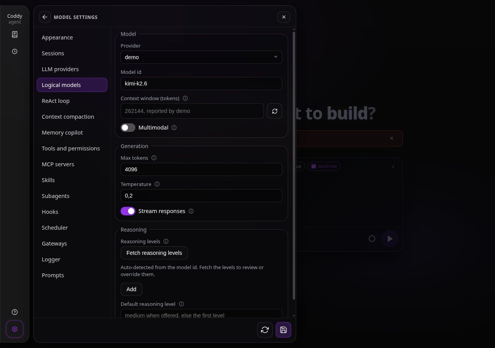

*A logical model is a provider plus the id its API expects; the context window comes from the provider.*

- The **Usage limits panel** switch (`providers[].usage_limits_panel`) renders only for provider types with a usage source (`neuraldeep`, `codex`, `devin`); for the others it would change nothing.
- The Settings drawer is 680px wide on a desktop: enough for three theme cards a row on **Appearance** and a readable measure for the forms.
- Automated checks: **`ProviderModelList.test.tsx`** (the fetch with the row as the form holds it and without the command, the refetch for a new id or type only, add and remove, the stale row, the error line, the context badge, the filter, the containment rules), **`ModelField.test.tsx`**, **`ContextWindowField.test.tsx`** (the reported window as the placeholder, the explicit fetch writing it, a late answer for a changed id dropped), **`SettingsArraySection.test.tsx`** (the address in both directions, the back link), **`SettingsSection.test.tsx`** (the three blocks of the provider form, the reported window seeded on add, the usage switch per provider type, the row form not surviving a tab switch), **`features/provider_models_web_ui.feature`** (**`external/ui/bdd_provider_models_ui_test.go`**), and on the API side **`features/provider_models_fetch.feature`** with **`external/httpserver/providers_models_http_test.go`**. Live check at **390px**: the provider form scrolls vertically only (`.settings-scroll` has `scrollWidth` equal to `clientWidth`), long ids ellipsize.

## Settings: tabs and form layout

- The tabs read in groups: **Appearance** and **Sessions**; where the models come from (**LLM providers**, **Logical models**); the loop that runs them (**ReAct loop**, **Context compaction**, **Memory copilot**); what the agent can do (**Tools and permissions**, **MCP servers**, **Skills**, **Subagents**, **Hooks**); what runs it without a person at the composer (**Scheduler**, **Gateways**); and the operation of the process (**Logger**, **Prompts**). **Prompts** holds the prompt templates and the instruction files and is always last.
- **Sessions** edits where the session bundles are stored (**Storage**, `sessions.dir`) above the table of stored sessions; the table itself acts at once, the storage path saves with **Save all**.
- A tab's own **Enabled** switch opens the form, above every block (Subagents, Hooks, Memory copilot, Context compaction, Scheduler). The other fields sit in fieldsets by meaning, for example **Model and turns**, **Retries**, **Stream timeouts**, **Loop guard** and **Usage limits** on **ReAct loop**; a list (definition directories, fallback models, component levels) is a block of its own beside them. Inside a nested block a list keeps its frame (the Telegram admins, user groups and per-chat overrides).
- A list of values is its inputs, each with a trash button, and **Add** under them: no per-row label and no rule between rows. An entry of a list of objects is a frame of its own, without a numbered title.
- Empty path fields show where the default leads (`${CODDY_HOME}/sessions`, `${CODDY_HOME}/memory`) or an example of what to write.
- Automated checks: **`SchemaForm.groups.test.tsx`** (the switch first, the catch-all group, a group placed at its first field, a later key kept, the lists), **`settingsSections.test.ts`** (the order, Prompts last, the Logger, Gateways and Scheduler tabs, the Sessions tab owning `sessions`), **`TestUISchemaRootPropertyOrder`** (`internal/config/jsondto_schema_test.go`), **`settingsDrawerRhythmCss.test.ts`** (a list row as tall as its input).

## Settings: field descriptions

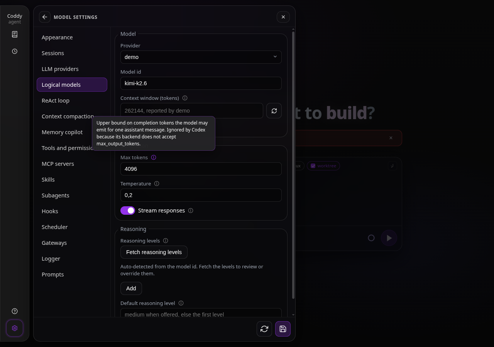

*Hovering the (i) beside a field's name shows what the field means, above it and over the page.*

- A settings form shows the names of its fields and the controls, nothing else. What a field means is behind the **(i)** right after its name: hover it (or reach it with Tab) and the description appears above it; on a touch screen tap it. Moving away, Escape, a tap elsewhere or scrolling the form closes it. Fieldsets (the provider **Models** list, **Remote skill sources**, **MCP discovery**, the Subagents **Definitions**, the object and list blocks of the generated forms) carry their description the same way, beside the legend.
- The tip is drawn over the whole page, not inside the settings panel, so it is never clipped by the panel and never adds a scrollbar to it. Text that reports a state (a fetch result, a sign-in code, a warning about a stored value) stays in the form under its control.
- Automated checks: **`FieldHint.test.tsx`**. Live check: hover an (i) at **1280px** and tap one at **390px**; the tip is a child of `<body>`, sits 8px above the (i) and centred on it, and `.settings-scroll` keeps `scrollWidth` equal to `clientWidth`.

## Settings: boolean switch fields

- Every on/off option in the settings forms renders through the shared **`SwitchField`** (**`external/ui/src/ui/settings/SwitchField.tsx`**): the **`Switch`** control and a label cell on one two-column grid (**`.settings-switch-field`**). This covers the schema-driven booleans of **`SchemaForm`** (for example **Logical models → Multimodal** and **Stream responses**, **Tools and permissions → Background tasks → Enabled**, the **Gateways → Telegram** flags) and the **Skills → Skill auto-discovery** row.
- The label sits level with the switch (vertical centres match within 1px, 8px gap), and the field's description is the (i) right after the label, as on every other field.
- The label is a real **`<label for>`**: clicking the text toggles the switch; clicking the (i) only opens the description. The switch is named by that label (**`aria-labelledby`**); when the visible text is state copy (**Enabled** / **Disabled**) the row passes an explicit **`ariaLabel`**, which takes precedence.
- Automated checks: **`SwitchField.test.tsx`** (structure and CSS rules), **`SchemaForm.switch.test.tsx`**, **`SkillsSection.autoDiscovery.test.tsx`**. Live check: open a model form at **1280px** and **390px**, and for each **`[role=switch]`** compare **`getBoundingClientRect()`** of the switch, **`.settings-switch-field-label`** and its **`.field-hint`** (centre delta ≤ 1px).

## Live configuration reloads

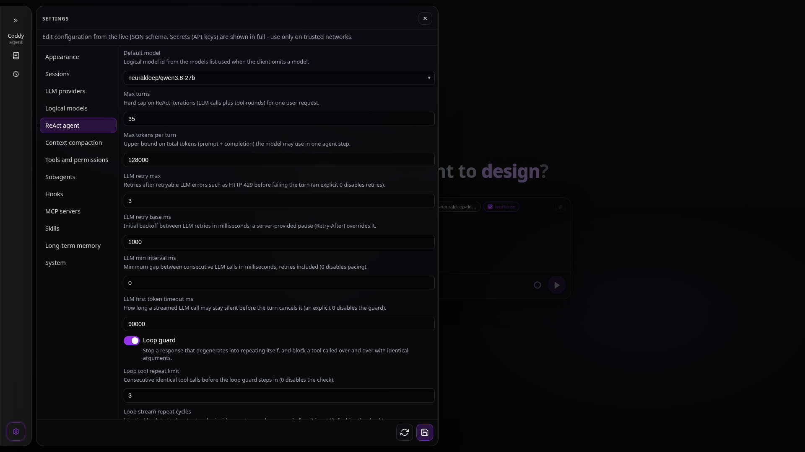

*The settings sheet with the tabbed navigation, ReAct loop tab: its fields in fieldsets by meaning*

- Coddy hot-reloads its own configuration, and not only from this page: the agent's **`config_commit`** / **`config_rollback`** tools rewrite it mid-turn, installing a skill rewrites it, another browser tab may be saving the settings form. Anything the SPA derives from the configuration - the composer **Model** picker, the **`multimodal`** attachment button, the slash-command names - was read once at boot and would otherwise stay stale until a page reload (issue **#161**).
- **`GET /coddy/events`** carries **`event: config_reloaded`** after every swap of the live configuration. **`chat/serverEvents.ts`** turns it into the optional **`onConfigReloaded`** callback, delivered over the stream the tab shares with the other tabs (see [Server events shared across tabs](#server-events-shared-across-tabs)), and **`App.tsx`** bumps **`configEpoch`**. Both config-derived fetches - **`GET /v1/models`** and **`GET /coddy/slash-commands`** - depend on that counter, so they re-read together. The Settings **Save** button bumps the same counter through **`onConfigSaved`**, which is why a local save and a remote swap behave identically.
- The event carries no model list: what changed is already behind those two endpoints, and the server publishes it only after the new configuration is live, so the re-read cannot catch the outgoing one.
- When the events stream itself is unavailable (an older server, a proxy that eats SSE), nothing else re-reads the model list: the page falls back to exactly the behaviour it had before, stale until a reload. The stream is an optimisation here, not a guarantee, and no extra poll was added for it.
- The **Settings form itself is not reloaded** by the event. It holds the operator's unsaved edits, and refetching under them would discard work; the **Reload** control in the form is the deliberate way to pick up an outside change.
- Automated checks: **`serverEvents.test.ts`** (the event reaches the callback, and is harmless without one), **`features/config_reload_broadcast.feature`** with **`external/httpserver/bdd_config_reload_test.go`** (the announcement reaches every open client, and the model list read on it already carries the new model), and **`external/httpserver/events_http_test.go`** (the frame shape, the guard against announcing a swap that did not happen, and the slash-command list being fresh at the moment of the announcement).

## Sign-in (`httpserver.login`)

Off unless the server has an account, and a server without one renders exactly as it always did.

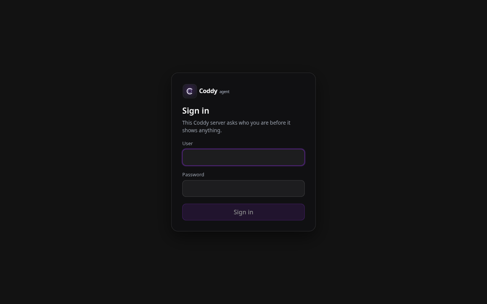

*The sign-in screen an anonymous browser gets when `httpserver.login` is configured.*

- **What decides:** **`AuthGate`** (**`external/ui/src/ui/auth/AuthGate.tsx`**, wrapping **`<App/>`** in **`main.tsx`**) calls **`GET /coddy/auth/me`** once on boot. **`login_required`** without **`authenticated`** renders **`SignInScreen`** instead of the app; anything else renders the app. While the answer is outstanding it renders a bare **`.auth-boot`** ground rather than the app, so the transcript is never shown and then yanked away.
- **A server that cannot answer** - a network error, or a **404** from a `coddy serve` built before this existed - is read as "no sign-in here", so an older server keeps working with a newer page.
- **The screen** (**`SignInScreen.tsx`**, **`.auth-screen`** / **`.auth-shell`** / **`.auth-card`**) is the whole page, not a dialog over a blurred transcript: there is nothing behind it to look at. The wordmark sits above the card, centred and outside it; the card holds the title, user, password, one error line (**`role="alert"`**), and a submit button disabled until both fields are filled, with no explanatory line under the title. Every string is a dictionary key (**`auth.signIn.*`**), and the card uses theme tokens only, so all seven themes and both languages carry it.
- **The wordmark** is the rectangular logo (**`src/assets/coddy-logo-wordmark.svg`**, and **`-light.svg`** on the light theme), inlined into the bundle rather than fetched, so the screen paints in one request. Its alt text is localized (**`auth.signIn.logoAlt`**).
- **After a successful sign-in** the page reloads: every list, stream and cached response on it was fetched by a browser with no session.
- **A session that ends while the page is open** - expired, rotated, signed out in another tab - brings the screen back: the local-origin **`fetch`** shim reports a **401** from any **`/v1/*`** or **`/coddy/*`** call (the **`/coddy/auth/*`** routes excepted) and the gate re-reads the state.
- **Signing out** is the last entry of the nav rail (**`data-testid="nav-sign-out"`**), shown only while a form is configured and this browser has passed it; its tooltip names the account. It posts **`/coddy/auth/logout`** and reloads **only when the server actually dropped the session** - the cookie is HttpOnly, so a page that cleared its own state after a refusal would be signed straight back in by the reload and the button would look broken rather than refused.
- **Remote environments are not gated here.** A remote is reached cross-origin with the bearer token from the environment selector, and a cookie of this origin would not travel with those calls; **`AuthGate`** passes straight through in remote mode.

Server behaviour, the cookie and the CSRF rule: [HTTP API](../reference/http-api.md#web-ui-sign-in-optional). Visual contract: [DESIGN.md](../../DESIGN.md).

## Environment (local / remote server)

- **Workspace-row chip:** an environment selector sits in the composer workspace-context row above the input, next to the folder / branch / worktree chips (**`EnvironmentChip.tsx`**, rendered inside **`.composer-context-row`**, styled as a **`.workspace-chip--env`**, **`data-testid="composer-env-btn"`**), Claude-Code style — **not** in Settings. The chip shows **`Local`** or the remote's name. It opens a portal menu (**`data-testid="composer-env-menu"`**, mode-menu family; bottom sheet on mobile) with an **Environment** section (**Local**) and a **Remote** section (configured remotes + **`+ Add remote…`**).
- **Select = connect:** choosing **Local** or a remote connects **immediately** (no confirm step) and reloads; there is no per-select token prompt. A **bearer token** is entered only in **`+ Add remote…`** (name / URL / token) and remembered per-remote.
- **Reachability dots:** each remote shows a status dot probed on menu open — **green** reachable+authorized (a cross-origin **`GET /v1/models`**), **red** unreachable / CORS-blocked / unauthorized, **amber** while probing. **Local** is always green.
- **Purpose:** point the UI at a remote, already-running **`coddy serve`** server, or use the local one. Offered remotes come from the local server's **`httpserver.remotes`** (**`[{name, url}]`**); **`+ Add remote…`** takes an ad-hoc name/URL/token.
- **Client-side state:** the active env lives in **`localStorage`** key **`coddy_env`**; per-remote tokens in **`coddy_env_tokens`**. Never persisted to server config; leave empty for a remote without auth. Workspace **folder recents** are namespaced per environment (**`envStorageSuffix()`**) so each remote remembers its own last paths; **models** and defaults come from the remote's **`GET /v1/models`** after the reload.
- **Mechanism:** a global **`fetch`** shim (**`external/ui/src/ui/env/remoteEnv.ts`**, installed in **`main.tsx`**) rewrites same-origin API requests (**`/v1/*`**, **`/coddy/*`**, **`/openapi*`**) to the selected remote base URL and adds **`Authorization: Bearer <token>`**. Local mode is a transparent pass-through. Selecting an entry persists the choice and reloads so all state re-fetches from the chosen backend; the SPA shell always loads from the local origin, so you can always switch back to **Local** from the chip even if the remote is down.
- **CORS:** the remote must allow the UI's origin via **`httpserver.cors`** (see [http-api.md](../reference/http-api.md)). SSE re-attach (**`GET /coddy/sessions/{id}/composer-stream`**) is fetched (not `EventSource`), so the bearer header applies; that route also accepts **`?access_token=`** for external `EventSource` clients.
- **Failure surfacing (issue #60):** a `fetch()` to a remote that is unreachable / refused / TLS-or-DNS-failed / CORS-blocked rejects with a `TypeError` (no `Response`); the send flow's final `catch` now distinguishes that from the user's own `AbortError` and emits an error `system_notice` (**`remoteSendErrorMessage`**), and a readable `401/403` gets an auth-specific message (**`remoteHttpErrorMessage`**) instead of a bare status. Pure helpers live in **`external/ui/src/ui/env/remoteErrors.ts`**.
- **Active-env health (issue #60):** a shared monitor (**`external/ui/src/ui/env/activeHealth.ts`**, started in **`main.tsx`**) probes the *selected* environment's **`GET /v1/models`** on load, on a 30 s interval, and on window focus. The composer chip dot is driven by that health (green up / red down / amber checking, **`.env-status`**), and **`EnvHealthBanner`** shows a persistent alert with a **Switch to Local** action when the active remote is down or unauthorized, so the app never silently renders empty against a dead backend.

## Layout


*The wide rail with labels at 1920 px*

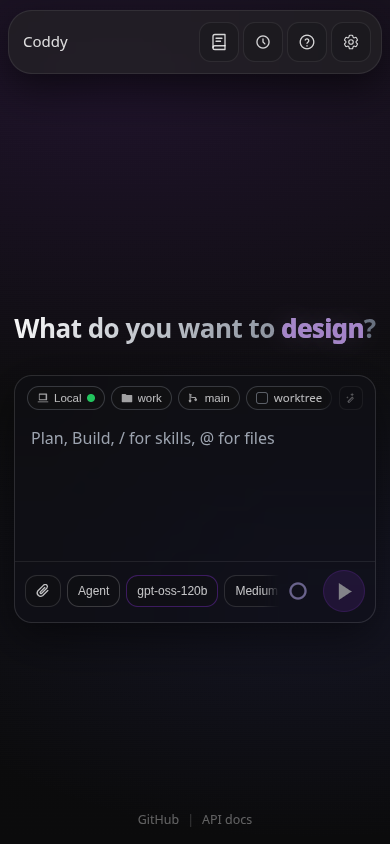

*The same shell at 390 px: the rail becomes a top bar, the start screen fits the width*

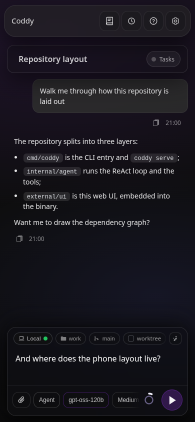

*A chat on a phone: both chip rows of the composer are one line and scroll sideways, Send stays in place*

Desktop layout

- **Brand** is **typography only** (**Coddy** and **agent**). **No** circular logo or icon before the brand text, regardless of older reference images that include a circle.
- Desktop nav is a **vertical panel** with rounding on the **right** edge (not a full-height center-pill). On **`min-width: 1920px`**, the wide rail header includes an icon with **horizontal lines** used **only** to **collapse** to narrow rail, not as a global navigation drawer.
- Left rail opens **chat history** from **History** under the brand; brand click goes to the **start screen** (**new chat**).
- **Brand**, **History**, **Scheduler** (when linked), **Settings**, and each row in the **History** list use real fragment **`href`** values (**`#/`**, **`#/history`**, **`#/scheduler`**, **`#/scheduler/new`** (new job editor), **`#/settings`**, **`#/s/<sessionId>`**) so **middle-click** or **Ctrl/Cmd-click** opens a **new browser tab** on the same origin while another tab can keep streaming.
- Sessions list is **always** a **drawer overlay** with backdrop at **all** breakpoints and rail widths (**no** inline column beside the rail that would shrink the chat area). The panel heading and related chrome use the copy **History**.
- Optional rail **narrow versus wide** (icons plus labels) only when **`min-width: 1920px`**, persisted in **`coddy_nav_rail`** cookie (**`narrow`** default)
- Main chat area with streamed assistant output
- Right rail is out of scope for the current milestone

Wide screens

- **`min-width: 1920px`** may enable the rail widen control and cookie-backed layout (**see DESIGN.md**). **History** remains a **floating drawer** next to the measured nav column (**`--rail-shell-track-width`**); do not fix **`left`** with a static pixel constant for wide rails.

Mobile layout

- On mobile the left rail becomes a top bar to preserve horizontal space; the top bar is **`position: fixed`** at the viewport top (**`shell-main`** is padded with **`--coddy-mobile-top-inset`**) while **`body`** scrolls the chat.
- On mobile the brand stays on a single line.
- On **`max-width: 1199px`** (phones and tablets alike) the **Settings** drawer keeps one inline inset, **14px**, for every band it stacks: the **SETTINGS** head, the status band under it (shown only for a load or save result), the section tiles, the opened section and the reload / save footer all start and end on the same edge. Check it by measuring `getBoundingClientRect().left` of `.settings-tile` and `.settings-body` against `.settings.drawer` - the two must agree.

Phone layout (**`max-width: 520px`**)

Tablets and desktops fit every control already; a phone does not, so the narrowest shell gets its own block at the end of **`styles.css`**, and nothing in it applies above **520px**.

- **Top bar.** The brand drops its second word and shows **Coddy** alone, the icons are **40px** with a **4px** gap and keep to the right edge. What does not fit next to the brand folds behind a **More** button (three dots): **History** and **Swarm** always stay in the bar, the others come back as room grows in the order **Settings**, **Scheduler**, **Docs**, **Sign out**, and the menu lists the folded ones as **Docs**, **Scheduler**, **Settings** and, under a separator, **Sign out**. A pick, **Escape** or a press outside closes it; the button is highlighted while a folded panel is open. With 40px icons five items fit from about 290px, so on most phones the menu only appears on a relay or a very narrow screen. The split is **`nav/navOverflow.ts`**, measured by **`NavRail`** on the stacked shell only.
- **Composer, context row.** The environment, folder, branch and worktree chips sit in their own strip, **`.composer-context-scroll`**, which is **`display: contents`** on wider shells (the row wraps as it always did) and a one-line strip scrolling sideways on a phone. The improve-prompt button stays outside the strip, at the end of the row.
- **Composer, selector chips.** The attach button of a multimodal model, then mode, model, reasoning and permission (this order on every width) form one strip that scrolls sideways under a fade at its right edge; the context ring and **Send** never shrink, so no chip is ever drawn under them. A long model name ends in an ellipsis.
- **Start screen.** The hero is one grid track that cannot grow past its container (**`grid-template-columns: minmax(0, 1fr)`**), so the page never scrolls sideways and the title stays centred.
- **Text fields** are at least **16px** on a phone and on any touch-only device (**`(any-hover: none) and (any-pointer: coarse)`**): iOS Safari zooms the page into a smaller field on focus and does not zoom back. The composer and its highlight mirror change together, since the mirror has to keep the textarea's metrics.
- The viewport meta carries **`interactive-widget=resizes-content`**, so Android browsers shrink the layout when the on-screen keyboard opens and the docked composer stays above it.

Check it live at **360**, **390** and **430px** on the start screen and in a chat, with the menus closed and with History open: **`document.documentElement.scrollWidth`** equals **`clientWidth`**, the **Send** button's rect intersects no **`.composer-tab`**, and the brand's rect intersects no icon of the top bar. At **768** and **1280px** the layout is the one before this block existed. The CSS contract is pinned by **`phoneLayoutCss.test.ts`**; the scenarios are **`features/web_ui_phone.feature`**.

Header links

- GitHub link to `https://github.com/coddy-project/coddy-agent` (**new tab**, `rel=noopener`).
- API docs link to `/docs/` (**new tab**, `rel=noopener`).
- Links live in the nav rail for this milestone.

Narrow-rail tooltips (desktop)

- When the rail has **no** wide labels, **hover tooltips** reinforce icon meaning (example **New Chat** on the brand, **History** on history). **Wide labeled rail** hides those tooltips; labels are the affordance.
- After opening **History**, the history trigger's tooltip must **not** stay visible if the pointer still hovers the rail (see **DESIGN.md**).

## Sessions

- Session id is generated client side only after the first message is sent from a new chat.
- Session id is persisted in the URL fragment.
  - Recommended format `#/s/<sessionId>`
- Unsent composer text may be kept as a client-only draft session.
  - Draft sessions use `#/draft/<draftId>` and are stored in `localStorage` under `coddy_draft_sessions_v1`.
  - History rows show a `Draft:` title prefix.
- Session id is sent in the `X-Coddy-Session-ID` header for chat transport.
- Session id validation matches `internal/session/ValidateFolderSessionID`.
- Session persisted files live under the session directory and are deleted together when the session is deleted.
  - `tool_calls/` tool call history
  - `stats.json` token usage totals

### Parallel sessions and generation cancel

- Several sessions may **stream at once**, each with its own **`POST /v1/responses`** and **`X-Coddy-Session-ID`**. The app keeps a **per-session shadow** transcript so rapid hash switches do not mis-route SSE updates; see **`pickStreamMutationBase`** in **`external/ui/src/ui/chat/streamMutationBase.ts`**.
- Shadow transcripts are **bounded**: an LRU of **3** non-pinned sessions (**`ShadowTranscriptCache`** in **`external/ui/src/ui/chat/sessionTranscriptCache.ts`**). The viewed session and any session with a live stream are never evicted; an evicted session is re-fetched on the next visit with no extra request compared to today. Message rows and **`Markdown`** are memoized (**`React.memo`**, **`useStableHandler`**), so unchanged rows skip re-rendering while a token streams (**`MessageList`** still maps the transcript; plan, permission and question rows are not memoized). Transcript rows carry no **`content-visibility`**: letting off-screen rows skip layout sized every row above the opening screen from a fallback guess, so the scrollport was short by about a sixth on a long session and scrolling up pushed the position down as the real heights arrived. See **`DESIGN.md`** (**Multi-session streaming and Stop**).
- **Server activity is separate from the local stream reader.** The UI reads **`GET /coddy/sessions/{id}/activity`** on session open and reconnect, regardless of whether the filtered or paginated **History** list includes that session. **`chat/useSessionTurnActivity`** skips both activity and queue hydration while this tab's own POST awaits admission. A running turn keeps **Stop** and queueing available even without a local reader; losing or closing the reader does not prove the turn ended. A **`turn_ended`** overlapping this tab's pending or admitted POST requires fresh REST activity confirmation before the UI declares idle.
- **Stop** calls **`POST /coddy/sessions/{id}/cancel`** and aborts this tab's streaming **`fetch`** of the turn right after sending it, not after the answer. A browser keeps six HTTP/1.1 connections per host across all of its tabs; with a few tabs of Coddy open, event and turn streams can hold every one of them, and the cancel request would wait for the connection this reader holds. The turn keeps running on the server without the reader. A failed request shows an error, keeps the running state and **Stop** available for a retry, and the tab rejoins the turn through the composer relay. Success acknowledges cooperative cancellation; the UI waits for the server's turn completion or a fresh activity snapshot reporting idle before treating the session as stopped. The server persists **partial** assistant **`content`** for that turn when tokens had already arrived. **`GET /coddy/sessions/{id}/messages`** may return an older snapshot briefly; the UI **merges** with local shadow or visible rows when the response is only a prefix (**`mergeTranscriptPreferLocalSuffix`**, **`keepLocalTranscriptIfServerEmpty`** in **`external/ui/src/ui/chat/transcriptServerSnapshot.ts`**). The transcript is cleared on fetch failure **only** when the failed load targets the **currently viewed** session so Stop does not wipe the chat.

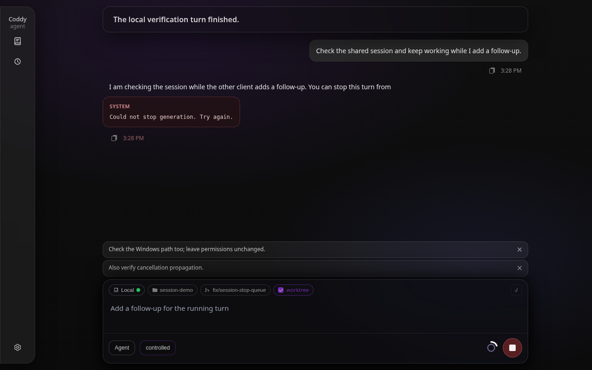

*Cancellation failed; the turn still runs and Stop remains available for another attempt.*

Session title

- UI shows the session title in the chat header.
- When the title is missing, UI shows `New chat`.
- Title is editable inline. On blur the UI saves via `PATCH /coddy/sessions/{id}`.

### Per-session model

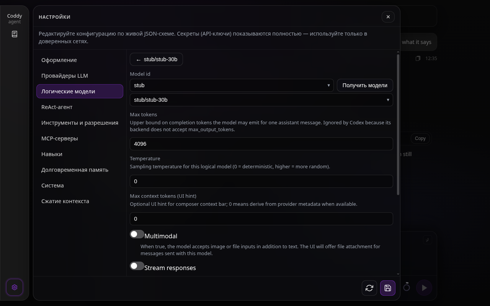

*The stream switch of a model row in Settings*

- **New chat** defaults **Model** from cookie **`coddy_llm_model`** when it names a configured backend, else the alphabetically first YAML row. A typed **`/model <id>`** in a sent message is a pick on this surface too and writes the same cookie (turn-scoped **`--once`** / **`--count`** forms do not).
- **Opening a session** restores **Model** from **`GET /coddy/sessions/{id}/messages`** field **`model`** (session override on disk) and its **`settings`** snapshot, not from the cookie.
- Changing **Model** writes the cookie (default for the next **New chat**) and **`PATCH`** **`selectedModelId`** on the active session. ReAct turns still send **`metadata.model`** on **`POST /v1/responses`**.
- **Many models / long names** — backend ids are **`vendor/model`**. When more than one vendor is configured the menu groups rows under an uppercase vendor header and each row shows only the model name (full id stays in the row tooltip). On desktop the list scrolls with a ~5-row cap. When there are **more than 5** backends a **filter input** appears at the top (auto-focused) that matches the vendor, model name, or full id (case-insensitive); **Enter** picks the first match, **Escape** closes, and an empty result shows a “No models match …” notice. Filter/group/threshold logic is in **`chat/llmModelMenu.ts`** (unit-tested in **`llmModelMenu.test.ts`**; menu wiring covered by **`ComposerModelMenu.test.tsx`**).
- **Mobile sheet** — on narrow/mobile shells (the **`max-width: 1199px`** shell-stack breakpoint) the **Mode** / **Model** / **Reasoning** menus open as a **full-width bottom sheet** over a dimmed scrim — the same pattern as the slash (**`/`**) and **`@`** pickers — instead of a cramped anchored dropdown. The filter and grouping still apply inside the sheet. Desktop keeps the anchored dropdown.

### Per-session reasoning level

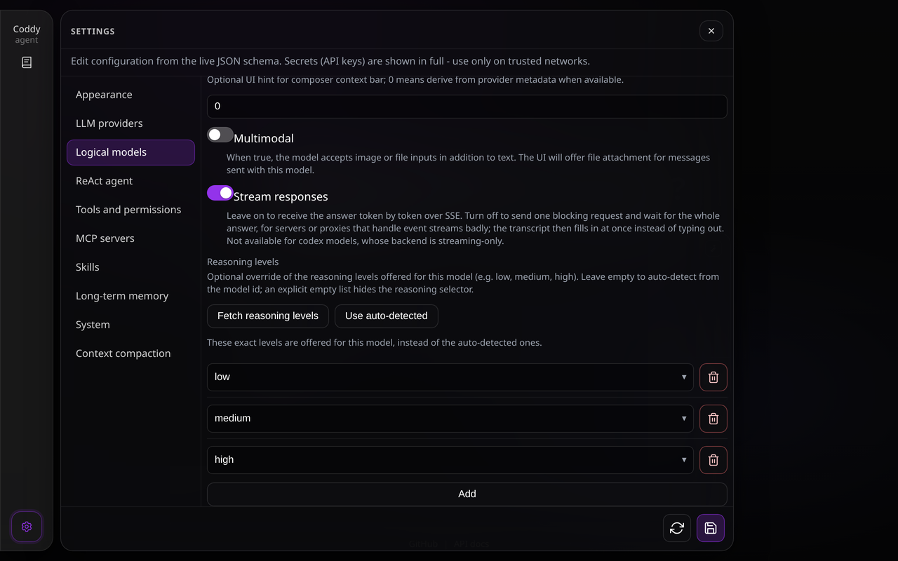

*The reasoning level dropdown in the composer, levels fetched from the provider*

- A **Reasoning** selector appears in the composer next to **Model** **only** when the active model exposes **`reasoning_levels`** from **`GET /v1/models`** (reasoning models such as gpt-5 / o-series / Claude thinking models). Levels are derived from **`models[].reasoning_levels`** (auto-detected from the model id when unset) and propagated through **`ModelInfo.reasoningLevels`** → **`llmReasoningLevels`** in **`App.tsx`** → **`Composer`**.
- **New chat** defaults the level from cookie **`coddy_llm_reasoning`**, then the model's **`reasoning_default`**, then **`medium`** (or the first offered level). **Opening a session** restores it from **`GET /coddy/sessions/{id}/messages`** field **`selectedReasoning`**. Switching to a model that does not offer the current level clamps it to a valid one (see **`pickReasoningLevel`** in **`chat/reasoningSelection.ts`**).
- Changing the level writes the cookie and **`PATCH`** **`selectedReasoning`** on the active session; ReAct turns also send **`metadata.reasoning`** on **`POST /v1/responses`** so a brand-new session applies it on the first turn.

### Session settings: permission chip, turn overrides, live mirror

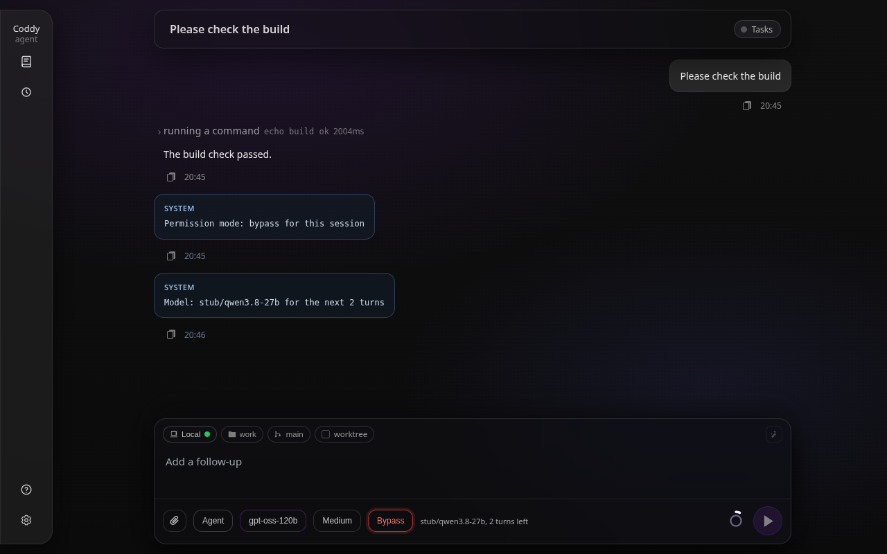

*The composer after the session was switched to bypass from a permission prompt and the model changed for two turns.*

- The composer mirrors the session's settings snapshot ([Session settings](../features/session-settings.md)): **`settings`** on **`GET /coddy/sessions/{id}/messages`** and on the **`PATCH /coddy/sessions/{id}`** answer, and **`event: session_settings`** on the turn stream and on **`GET /coddy/events`**. **`chat/sessionSettings.ts`** parses it; **`App.tsx`** keeps the highest **`version`** per session (**`isNewerSettings`**), so the same change arriving down both connections, or an answer arriving after the event of a later change, is applied once and never rolled back.
- **Mode**, **Model** and **Reasoning** follow a change made anywhere - a typed command, the permission dialog, the model's **`switch_model`**, a console or an editor on the same session. Every **`POST /v1/responses`** carries **`metadata.settingsVersion`**, the version the tab last applied; the server ignores the tab's **`model`** / **`reasoning`** / mode when a newer snapshot has been published since, so a stale tab cannot undo a change it has not seen.
- The **permission chip** (**`data-testid="composer-permission"`**) sits after **Mode**: **Ask first**, **Accept edits** or **Bypass**, the last in red with a glow, its tooltip naming the configuration's mode the session returns to after a restart. Its menu calls **`PATCH`** **`permissionMode`**. On a new chat the pick is held and sent as a **`/permissions <mode>`** line ahead of the first message.
- The **overrides line** (**`data-testid="composer-overrides"`**) lists what is changed for the next turns (**`stub/qwen3.8-demo, 2 turns left`**, **`plan this turn`**), with the full list in its tooltip; it shrinks with an ellipsis on narrow shells rather than pushing the send button off the bar.
- A prompt of settings commands only runs no turn: the stream ends with **`coddy_meta.settings_only`**, the tab drops its optimistic user and assistant rows and re-reads the transcript, where each change is one **SYSTEM** notice row.

### Settings: reasoning levels for a logical model

Functional checklist for **Settings -> Logical models -> Reasoning levels**
(**`ReasoningLevelsField.tsx`**, **`useReasoningLevels.ts`**):

- The field owns the three states of **`models[].reasoning_levels`** and names the current one in a status line: **key absent** (auto-detected from the model id), **`[]`** (the composer **Reasoning** selector is hidden for this model), and a **non-empty list** (exactly these levels are offered). The generic array editor cannot express the first state, so a model added through Settings could otherwise never go back to auto-detection.
- **Fetch reasoning levels** calls **`GET /coddy/config/reasoning-levels?model=<id>&provider_type=<type>`** with the id currently in the form - the entry does not have to be saved yet - and fills the list with what the gateway detects, under the same Codex remap the composer applies (**`minimal`** becomes **`none`**). **`provider_type`** is the type of the provider row the id points at, taken from the settings document being edited rather than from the saved config, so a provider that is not saved yet or whose type was just changed resolves the way it will after **Save**. The button is disabled until a model id is present.
- A model id with **no** reasoning family leaves the field untouched and says so. Writing **`[]`** there would read as the explicit opt-out and hide the selector, which is the opposite of what the button was asked for. A failed request reports the error inline and also leaves the field alone.
- The status line describes the list the operator is looking at before it repeats fetch feedback: once a level is present (fetched or added by hand) it reads as the override, and the "nothing detected" / error messages only apply while the key is still absent. Retyping the model id, or editing the list by hand (add, change, remove a level), clears that feedback and abandons any answer still in flight; an answer that arrives after the id changed, after a manual edit, or after the row was deleted from the list, is dropped rather than written over the operator's newer choice, and an answer that does land is written through the field's newest `onChange`, so a sibling field edited while the request was pending (for example the **Stream responses** switch) keeps its new value (**`useReasoningLevels`** tickets every request, so one that answers after the field moved on resolves to **`null`**).
- **Use auto-detected** appears whenever the key is present and removes it, so the next save omits **`reasoning_levels`** and detection resumes. Removing the last level by hand is the way to reach the **`[]`** opt-out on purpose.
- The **`[]`** opt-out and the auto-detect default survive a Settings save in both directions: **`ModelEntry.ReasoningLevels`** and **`ModelJSON.ReasoningLevels`** are **`*[]string`**, so an omitted key stays omitted in the written **`config.yaml`** instead of being serialized as **`reasoning_levels: []`**.

### Per-session workspace (folder / branch / worktree chips)

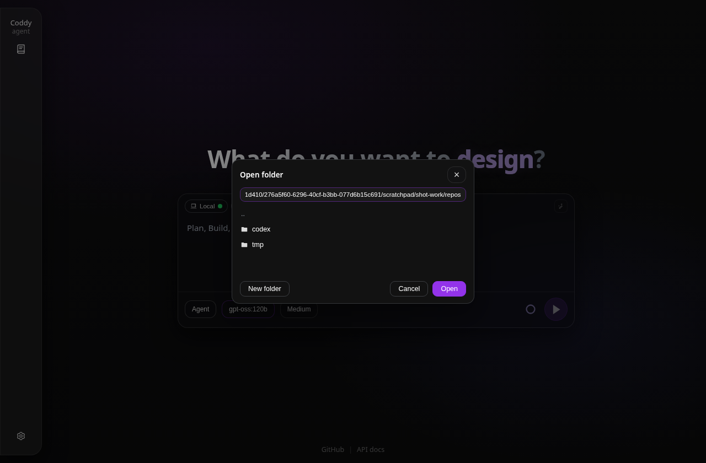

*The Open folder dialog with New folder leading the footer*

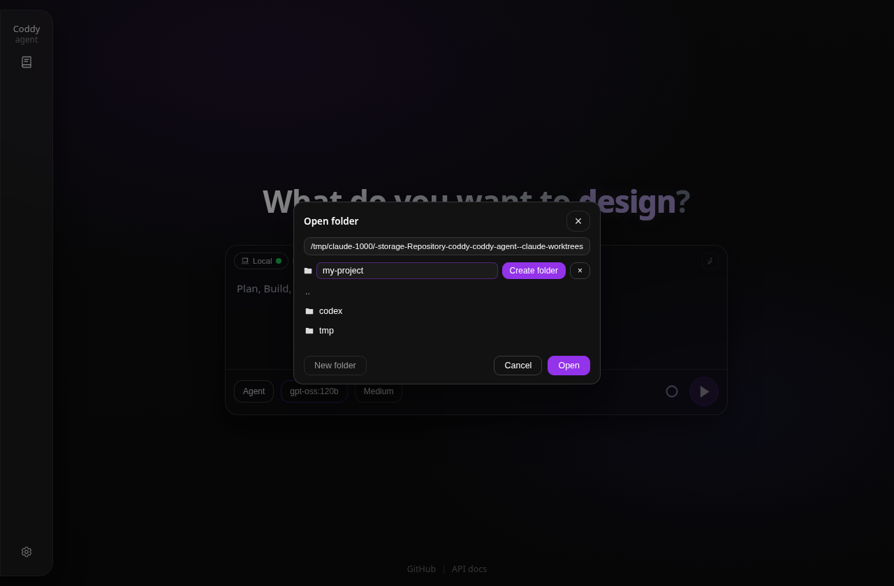

*The inline name row for a new folder*

- A chip row renders at the top of the composer card (**`WorkspaceChips.tsx`**, helpers in **`chat/workspaceContext.ts`**): **folder chip** (workspace basename, full path in tooltip), **branch chip** (current git branch; only when the workspace is a git repository), and a **worktree checkbox**.
- **Wrapping**: the chips share one **`flex-wrap`** row (**`.composer-context-row`**) with the environment chip and the improve-prompt control; **`.composer-context-chips`** is **`display: contents`** so each chip wraps on its own. On a narrow viewport only the overflow moves down (e.g. environment+folder, then branch+worktree), and the worktree checkbox stays beside the branch until the branch name is long enough to push it.
- Context loads from **`GET /coddy/workspace/context`** with **`X-Coddy-Session-ID`** whenever the viewed session changes; without a session the server default cwd is shown.
- **Chosen once**: folder + branch + worktree are set before the conversation starts. Once the transcript has messages the chips lock (**`workspaceLocked`** — controls disabled, menus closed) and the server answers **409** to **`POST .../workspace`**, and a turn already in flight answers **409** as well.
- **Folder chip** opens the **Recent** menu (Claude Desktop style): MRU folders from **`localStorage`** **`coddy_workspace_recents_v1`** (**`chat/workspaceRecents.ts`**), current workspace marked with **✓**, then **`Open folder…`** at the bottom which opens the **folder browser modal** (**`WorkspaceFolderModal.tsx`**) fed by **`GET /coddy/workspace/folders?path=`**: rows navigate into folders, **`..`** goes up, **Open** picks the currently browsed folder, **Cancel** dismisses. The folder list is the dialog's only scrollport: it is the one child allowed to shrink (**`min-height: 0`**), so **Cancel** / **Open** stay reachable on a short browser window instead of being clipped by the dialog's height cap, and a wheel gesture past the last folder stays in the list instead of scrolling the page behind it. Verified in WebKit with **`external/ui/scripts/webkit-scroll-check.mjs`** (see below).
- **New folder** (footer, left of **Cancel** / **Open**) opens an inline name row **between the path field and the list** - a sibling of the list, not a row inside it, so it never scrolls away under you and it stays whole on a short window where the list itself has shrunk to nothing. **Enter** or **Create folder** posts **`POST /coddy/workspace/folders`** **`{"path": <browsed folder>, "name"}`**; the dialog then shows the listing the server answers with, which is the **new folder**, so **Open** picks it straight away. **Escape** or the row's **×** abandons it. The button is disabled on the drive level (there is no directory to create in) and while the row is already open; **Create folder** stays disabled until a name is typed. A name that is already taken (**409**) keeps the row open with the typed text and says so, and so does any other failure - nothing is created and the browsed folder does not change.
- **Leaving the drive (Windows)** — **`..`** from a drive root opens the **drive level** (**`?path=:drives:`**, **`drives:true`** in the response): one row per volume (**`C:`**, **`D:`**, …), no **`..`** above it, and **Open** disabled because it is a place to navigate, not a workspace. The **path row is an editable field** (**`workspace-modal-path`**): typing or pasting a path and pressing **Enter** jumps there, surrounding quotes from Explorer's *Copy as path* are stripped (**`cleanPathInput`**), and while the field holds an unvisited path the primary button reads **Go** instead of **Open**, so a pasted path is never mistaken for the folder being opened. The browser starts at **`pathParent(ctx.path)`**, which keeps the current drive (it used to collapse Windows paths to **`/`**). Picking calls **`POST /coddy/sessions/{id}/workspace`** **`{"path"}`** — the session cwd switches and persists; skills, project rules, slash commands, configured MCP servers (re-dialed for the new workspace through its trust gate, the old workspace's closed) and the SessionStart hook context re-derive from the new cwd.
- **Branch chip** opens the branch list (current first, marked selected). Picking one posts **`{"branch", "worktree": <checkbox>}`**: in-place checkout by default, a dedicated worktree under **`<repo>/.coddy/worktrees/<branch>/`** when the checkbox is on, or a jump to the worktree that already has the branch checked out (including back to the main checkout).
- **Worktree checkbox** (**`composer-worktree-checkbox`**, real **`input[type=checkbox]`**) is the worktree preference; when the session already runs inside a linked worktree it shows checked and disabled.
- **Pre-session (draft/home)**: picks are stored client-side, previewed via **`GET /coddy/workspace/context?path=`**, and applied to the new session id on first send before **`POST /v1/responses`**. Switching to another session drops pending picks.
- Errors (missing folder **400**, git conflicts / locked workspace **409**) keep the current chips; the context is re-fetched to stay truthful.
- Automated checks: **`chat/workspaceContext.test.ts`**, **`chat/workspaceRecents.test.ts`** (helpers), **`chat/WorkspaceChips.test.tsx`** (chips, menus, modal, lock); backend behavior is specified executable in **`features/workspace_switching.feature`** (godog).

## Session list

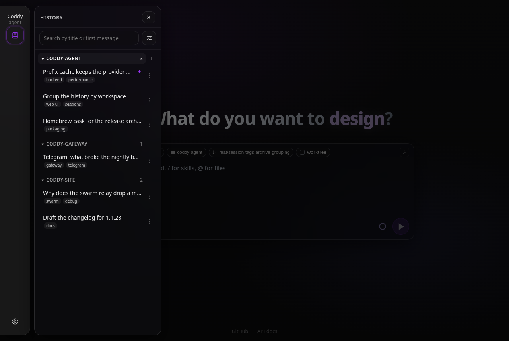

*Grouped by folder: the heading is the folder name with its row count, and hovering it offers a new chat in that workspace. The first row is pinned*

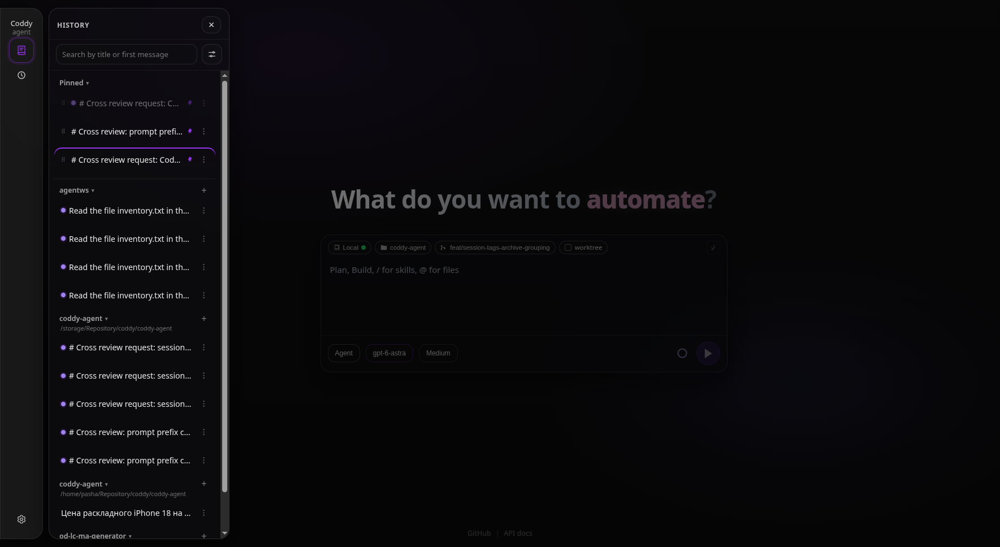

*Pinned conversations lead every mode as one group, dragged into order by the grip on the left; the row being moved fades and the one it would land on is picked out*

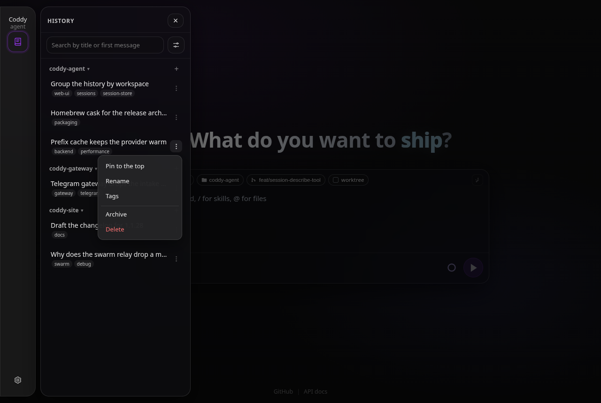

*One control per row: pin, rename and tags, then a rule and the two that take the conversation out of the list, with delete in the destructive colour*

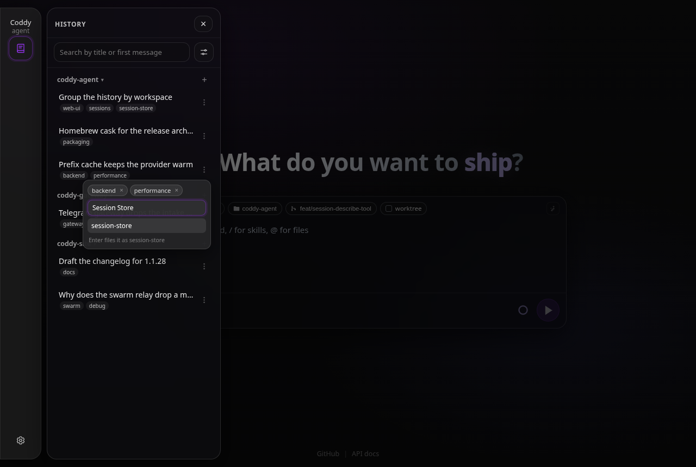

*The labels of one conversation: a cross on each chip, a box that offers the words this history already files under, and the folded spelling the typed one will be stored as*

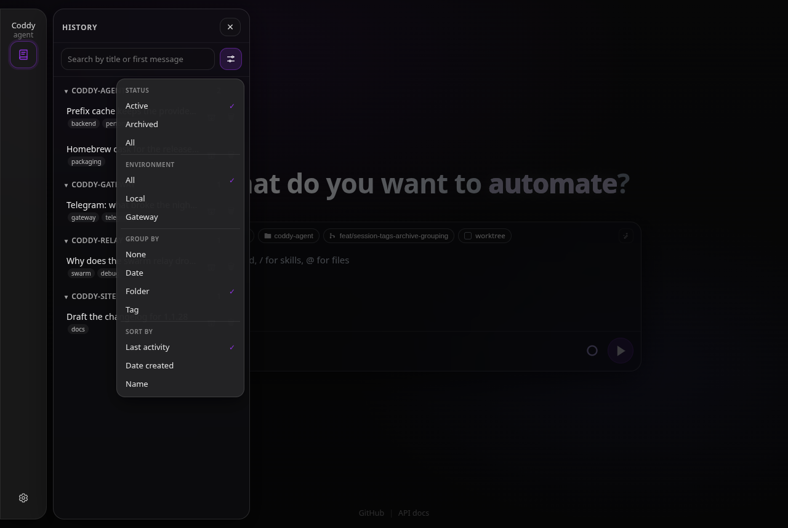

*Four rows, each naming its question and the answer in force; only a value moved off its default is coloured, and the choices open beside the row*

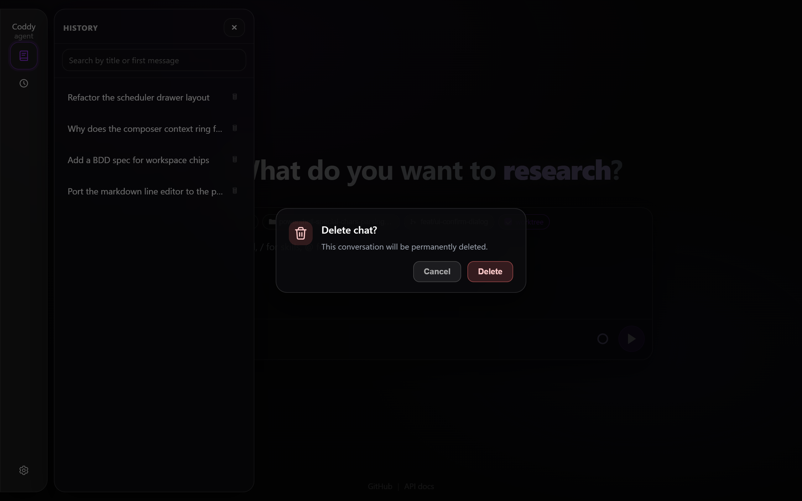

*The shared confirmation dialog before a chat is deleted*

- **History** panel lists sessions via `GET /coddy/sessions` (still a **drawer**, not a persistent second column).
- Pagination uses `limit` and `cursor`, with **infinite scroll** for older rows.
- Optional **`q`** query string (**title, workspace path, a tag, or the first **`user`** message content**, case insensitive substring; **not** full-chat search). Search input updates use client debouncing.
- **Everything that decides what the list shows is one control**: the sliders button at the right end of the search row opens a menu of four rows (**`SessionsFilterMenu.tsx`**). It sits with the search because both narrow the list below; the drawer head keeps only its close button. Each row names its question and the answer in force, and its choices open beside it - hover or click a row, and the one before it folds. The menu is rendered into the document rather than into the drawer, which clips what overflows it, so a submenu reaches past the drawer's edge (and flips to the other side near the window's).
  - **Status** - **Active** (the default), **Archived**, **All**: the **`archived`** query parameter. It leads, because it is the question asked most often.
  - **Environment** - **All**, **Local**, **Gateway**, then one row per configured remote. The first three narrow the listing of whichever server is being read (**`origin`**): every conversation, the ones opened on this host, or the chats a messenger gateway is holding. They are a **filter**, so they reload nothing. A remote row is a **switch**: it points the whole app at that server, the same one the composer's environment chip makes, and that does reload - the origin filter goes with everything else. The section is left out entirely when there is only one row to choose from.
  - **Group by** - **None**, **Date**, **Folder** (the default - a conversation is remembered by which checkout it was about far more often than by which day it happened on), **Tag**.
  - **Sort by** - **Last activity** (the default), **Date created**, **Name**: the **`sort`** parameter, each with the direction that reads naturally for its kind of value.

  A rule separates the first two rows from the last two: the first pair decides *what is listed*, the second *how it is arranged*. A row's value is drawn in the **accent** colour only when it is **not** the default - a menu where every row is coloured says nothing about what has been narrowed - and every one of the four is remembered across reloads in its own cookie (**`coddy_sessions_group`**, **`_status`**, **`_origin`**, **`_sort`**): a filter the next page load forgets is not a setting.
- **Grouping** is a client concern - the server answers a flat ordered page and the drawer decides where the headings fall - so switching costs no request and never reorders what the server sorted inside a group. A heading is the bucket's own name with a caret after it, and folding it is what clicking the name does; a bucket nothing falls into is not drawn, and a session with three tags is listed under all three.
  - **Date** buckets by local calendar day: **Today**, **Yesterday**, **Previous 7 days**, **Previous 30 days**, **Older**, and **No date** last for a bundle with no timestamp.
  Only a **Folder** heading carries the **+**; a date or a tag is not a place to put a session.

  - **Folder** keys on the full path and shows the folder name, so two checkouts called `one` stay apart - and when a name really is carried by more than one heading, each of them spells out its full path underneath, because the name alone cannot tell them apart. Sessions with no workspace go last. A folder heading also carries a **+** that starts a new chat already pointed at that workspace - the pick goes through the same pre-session path as the composer's folder chip, so the server resolves the folder's current git branch for the new conversation.
  - **Tag** puts untagged sessions last.
- **What can be done to one conversation is behind its ⋮**: **Pin to the top**, **Rename** and **Tags** - the three that change where the row sits or what it says about itself - then below a rule **Archive** and **Delete**, the two that take the conversation out of the list, with delete in the destructive colour. An icon per action cost the title a button's width each and put a delete one mis-click away; inside the menu the actions have room for their words. One menu is open at a time, **Escape** closes it, and it is portaled out of the drawer so it is not cut off at the edge (it flips above the row near the foot of the window).
- **Pinned conversations are one group at the top**, headed **Pinned** and set apart by a rule, in every grouping mode: they are a single list the operator keeps by hand, not a stripe running through every group - the same conversation at the top *and* inside its folder would raise the question of which one dragging moves. A pinned row carries a small accent mark beside its title and a **grip** on the left.
- **The pins are reordered by dragging** that grip, with a mouse or a finger: the drag is driven by **pointer events** (HTML5 drag-and-drop never starts from touch) and the list shows where the drop would land rather than a row following the pointer, which survives a scroll and costs no compositing layer. The dropped order is written with **`POST /coddy/sessions/pins/reorder`**, which takes the **whole** order, and a new pin goes **above** the ones already there. The row does not move on the client - the order is the server's answer - so the list is re-read after the change.
- **An archived conversation is dimmed in the list and cannot be written to**: its row is muted, and opening it replaces the composer with a notice saying it is archived and one button that takes it back out. Nothing is refused on the server - the archive is a shelf, not a lock - but leaving the composer there would invite a prompt that silently undoes the operator's own *not now*. The composer learns this from **`GET /coddy/sessions/{id}/messages`**, which carries **`archived`**: the session listing skips the archive, so the conversation on screen may be in no page the client holds.
- **Archiving** takes a conversation out of the working list without deleting it (**`PATCH`** with **`archived`**). The row moves only once the server has agreed: a refused request would otherwise leave the drawer showing a state that is not on disk. An archived row carries the archive **mark** beside its title - the state a conversation is in, not a label among its tags - and the same menu item puts it back. Archiving the conversation that is on screen swaps the composer for the same archived notice at once, and putting it back brings the composer back - the flag follows the **`PATCH`** answer, so it does not wait for the next transcript load. The **Status** filter remembers what it was set to, so a session put aside stays out of the way until the operator asks for it.
- **Tags** of a row render under its title as small chips (the title keeps the first line to itself). They are proposed by the title generation, edited by hand in the **Tags** editor of the row menu, and written by the model's own `session_describe` tool ([Sessions](../features/sessions.md#tags-and-the-archive)).
- **The tag editor is one component in both places that show tags** (**`SessionTagEditor.tsx`**): a cross on every chip, a box that offers the labels this history already uses (most used first, its own excluded, prefix matches leading), **Enter** to file what was typed, arrow keys and **Enter** to take a suggestion, **Backspace** on an empty box to drop the last chip, **Escape** to close. There is no Save: every change is a **`PATCH`** at once. The row takes the new set **before** the request, so a second gesture made while the first is still in flight builds on it instead of undoing it; the set the server answers with - folded to lower case, whitespace as hyphens, at most eight - then replaces it, so a chip never changes spelling one refresh later, and a refused write puts back what the row carried. The folded form of what is being typed is shown under the box only when it differs from what was typed.
- Indicators
  - A pulsing dot - the violet unread dot, a third darker - appears on every row whose turn is still running, the open conversation included. It also appears on a row with **background tasks still in flight and no turn running**, because detached work outlives the turn that started it and a row without the mark reads as finished; the dot's tooltip names which of the two it is. The count is **`backgroundRunning`** of the session listing (the model's own tasks, nothing finished, no system errand), and the listing is re-read on the turn events and on the drawer's poll, so a task that starts or ends **outside** a turn moves the dot on the next poll rather than at once. A turn waiting on a permission or a question shows that mark instead.
  - A violet dot appears only when a background session completed while it was not the active chat.
  - A question mark icon appears when a session is waiting for user permission.
- CRUD
  - Rename via `PATCH /coddy/sessions/{id}` setting `title`.
  - Delete via `DELETE /coddy/sessions/{id}`.
  - Create new chat starts on the home screen. Session id is created only on first send.

Session rename UX

- Title rename is done in the chat header, or from **Rename** in the row's **⋮** menu, which turns the row's title into a box with the name selected.
- On blur the UI saves via `PATCH /coddy/sessions/{id}`; **Enter** saves, **Escape** leaves the title alone.

Session delete UX

- Delete is a line of the row's **⋮** menu, set apart and in the destructive colour.
- Clicking delete shows one confirm dialog and then calls `DELETE /coddy/sessions/{id}`. The dialog opens with **Delete** focused here, so **Enter** finishes what the click started: the row's trash does one thing and the dialog asks about that one thing. Everywhere else the shared dialog still opens on **Cancel**, where a stray Enter must not confirm something nobody meant (**`initialFocus`** on **`confirm({...})`**).
- If the deleted session is **not** the one currently shown in the main chat, remove it from the list (and refresh from the server) and **keep the History drawer open**. Do not change the URL or clear the transcript for the session that stayed on screen.
- If the deleted session **is** the one currently shown, navigate to **new chat** (empty start screen, session hash cleared), **close** the History drawer, and clear composer-related state as for a normal home transition.
- For a short interval after the user confirms delete, **ignore** shell **backdrop** pointer-driven close so a stray event from the native confirm does not dismiss History or alter the route.
- Deleting more than one conversation at a time, and reading what each one cost, is **Settings -> Sessions** (below). History stays the place to *open* a session.

## Settings: session management

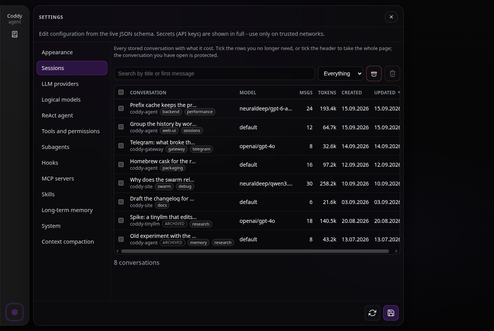

*Everything stored, the archive included: a row says where it sits and what it is filed under, the **+** after its tags opens the same editor History uses, the columns sort the whole listing, and the two icons beside the search are the only destructive controls*

**Settings -> Sessions** (**`#/settings/sessions_manager`**, **`SessionsManager.tsx`**, pure helpers in **`sessions/sessionManagerRows.ts`**) is the stored history as a table rather than a list to scroll, in a **Session management** fieldset whose (i) says what the table is for. It is a client-side tab like Appearance: the table reads and removes session bundles over **`/coddy/sessions`**, so it renders before the config schema has loaded. Its id is **`sessions_manager`** because **`sessions`** is already a config key - the storage directory, which this tab edits above the table (**Storage**) once the schema is in, saved with **Save all**.

- **Rows** come from **`GET /coddy/sessions?include_stats=true`**, 50 at a time with a **Load more** button. Each one shows the title with its **workspace** underneath, the **model** the session overrode (**`default`** when it never did, meaning whatever **`agent.model`** was at the time), the **message count**, the **total tokens** (input and output in the cell tooltip), and **created** / **updated** dates (the exact instant in the tooltip). A bundle stored before Coddy recorded a creation stamp shows **—** rather than a date invented from a later save.
- **Search** is the same **`q`** filter the History drawer uses - title, workspace, a tag or the first user message, case insensitive - debounced as you type.
- **Sorting** is the column headers: **Conversation** (title), **Msgs**, **Tokens**, **Created** and **Updated** are buttons, the sorted one carries a caret and an **`aria-sort`**. Clicking the column that is already sorted flips it; a different one starts where its kind of value reads naturally, a date or a count at its largest and a title at its first letter. The order goes to the server (**`sort`** and **`order`**) and applies to the **whole filtered listing before paging**, so **Load more** continues the sorted result rather than re-sorting a page.
- **The archive** is a select beside the search: **Working list** (the default), **Archive**, **Everything**. An archived row carries a neutral **archived** badge whose tooltip says when it was put aside. Conversations are archived from **History**, not here; this tab is where you look at what the archive holds and empty it.
- **Deleting is two scopes, never more**: a trash icon beside the search field removes the **ticked** rows (**`POST /coddy/sessions/bulk-delete`** with their ids), and an archive-box icon beside it empties the **archive** (**`scope: "archived"`**, with the open conversation named in **`except`** so the protection below holds even for a scope the server resolves), both behind the shared confirmation dialog. What each does is its **tooltip** and its accessible name, not a label on its face; the only text drawn is the **selection count** badge on the first, which a tooltip cannot show at a glance. The ticked rows are what the operator can see; the archive is a scope the server resolves, because the archive may hold more than the page does - which the confirmation says in words. There is no third button that reaches further than either.
- **Tags** render under the title as chips. Clicking one narrows the table to the conversations filed under it (**`tags`**), and a line under the toolbar says which tag is showing with a link that clears it.
- A row has **no delete of its own**: the tick and the one button are the whole per-row surface, so the scope of a destructive click is never ambiguous.
- **Emptying the page** is the header checkbox plus that one button. With more rows than a page holds, **Load more** first; the summary line under the table says how many are listed and how many are ticked.
- The **conversation you have open is protected** from every delete here, the archive scope included: its row is highlighted and marked **open**, its tick box is disabled with a tooltip saying why, the header checkbox passes over it, and emptying the archive spares it by name even when it is the one that was archived. The table cannot take the chat out from under you; close it or switch to another conversation first, then delete it from **History**.
- The **selection follows what the table shows**: the header checkbox ticks and unticks the rendered rows, and a search that hides a ticked row takes its tick with it (clearing the search brings the row back unticked). A destructive action never reaches a row that is off screen, and a tick cannot reappear later because it survived out of sight.
- A session that could not be removed - a turn of its tree was still running - is **reported** under the toolbar with its reason, and its row stays. The others are still gone: the request answers with **`deleted`** and **`failed`** separately.
- The list **re-reads after every delete**; nothing is reloaded. If the conversation on screen behind the panel was one of the deleted ones, the chat resets to a new one and Settings stays open on this tab.
- The table is the one horizontally scrollable element of the tab, so a narrow shell scrolls the columns instead of the page.

## Server events shared across tabs

Every tab needs **`GET /coddy/events`**: turn starts and ends, queue changes, account usage and configuration reloads arrive there. Over plain HTTP/1.1 a browser keeps six connections to one host for all of its tabs, so when each tab held a stream of its own, six open tabs took every connection and no request from any tab could be sent - not a prompt, not a Stop, not a history read. The tabs of one environment now share a single connection.

- **SharedWorker** - where the browser has one (desktop Chrome, Edge, Firefox and Safari 16+, on plain http as well as https), **`events-worker.js`** holds the connection. Each tab connects a port and says hello; the first hello opens the stream, the last tab leaving closes it. A remote environment passes its address and bearer token with the hello, because the page's fetch shim does not reach into a worker.
- **Web Locks and BroadcastChannel** - where there is no SharedWorker, the tabs elect one of their own through **`navigator.locks`**; the tab holding the lock holds the stream and relays it on a **`BroadcastChannel`**. When that tab closes, the next one in line takes the lock and reports the stream down until its own connection is up. Web Locks exist only in secure contexts (https, **`localhost`**, **`127.0.0.1`**).
- **A stream per tab** - with neither, or when the worker fails to load or does not answer within five seconds, a tab keeps a connection of its own, as every tab did before. This is the only case in which many open tabs can still take all six connections: plain http on a network address in a browser without SharedWorker.
- **Scope** - tabs share only within one environment: the worker, the lock and the channel are named after the local server, or after a remote's address and a fingerprint of its token (never the token itself), plus a protocol number so tabs of different builds never meet.
- **What a tab hears** is what a connection of its own would give it: the connected state, one **`turn_started`** per running turn, **`ready`**, then live events. A tab that joins a stream already up gets the running turns and **`ready`** addressed to it alone, because **`ready`** makes a tab reconcile its sessions and give up any pending Stop, and the other tabs have nothing to reconcile. A 401 the worker or the elected tab received is passed on, so every tab returns to the sign-in screen.
- **Code** - **`chat/sharedServerEvents.ts`** picks the transport, **`chat/serverEventsHub.ts`** is the owner of the connection and the receiver in each tab, **`chat/eventsWorker.ts`** with **`chat/eventsWorkerHost.ts`** is the worker, and **`chat/serverEvents.ts`** parses the stream. Vite emits the worker as **`events-worker.js`** next to **`app.js`**, and the binary embeds it with the rest of the shell. Tests: **`chat/sharedServerEvents.test.ts`**, and the three-tab scenario in **`App.stopQueue.test.tsx`**.

## Chat transport

- Primary transport is `POST /v1/responses`.
- `stream: true` uses SSE.

Mode selection

- UI lets the user select a mode from `GET /v1/models` (at minimum `agent`, `plan`, and `ask`).
- Selected mode is sent as `model` field in `POST /v1/responses`.

SSE payloads

- Default SSE lines stream OpenAI like deltas.
- Named SSE events
  - `tool_call`
  - `tool_call_update`
  - `plan`
  - `token_usage`
  - `usage_update` (`used` / `size` for the current model context; emitted again after compaction)
  - Default (no `event:`): chat completion chunk deltas, including `delta.content` and optional `delta.reasoning_content`

## Transcript scroll-to-bottom

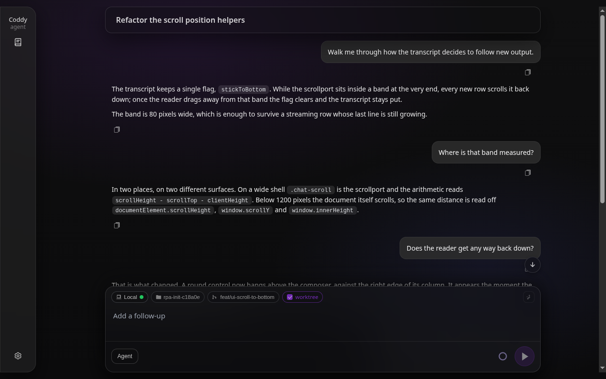

*The scroll-to-bottom button above the composer, dark theme at 1280 px*

Scrolling up in a long chat leaves the newest messages off screen, and dragging the scrollbar back is the only way down. A round control above the composer does it in one press.

- **When it is there** - the transcript follows new output while the scrollport sits within `TRANSCRIPT_BOTTOM_THRESHOLD_PX` (**80px**) of the end. The button appears exactly when that stops being true and goes away when it starts again, so seeing it means the transcript has something below the fold. It fades in and out on one mounted node (**~0.14s** in, **0.12s** out); hidden, it is `inert` and out of the tab order.
- **Where it sits** - inside the composer's own column (`.chat-bottom-inner`), against its right edge, `10px` above the docked block. That is one set of coordinates for every shell: the absolute desktop dock, the `position: fixed` composer below `1200px`, and the inset the background tasks panel reserves.
- **The jump** takes **220-460ms** by distance, on an ease-out curve: away at speed, settling into the last pixels rather than stopping dead. It is driven frame by frame (`transcriptJumpDurationMs` / `easeTranscriptJump` in `chat/transcriptScrollPosition.ts`), not handed to `scrollTo({ behavior: "smooth" })`, so the feel is the same in every engine. Arriving re-arms the follow, and the rest of the turn scrolls by itself again.
- **Streaming under a reader who scrolled away** - the position does not move and the button stays, because the distance to the end only grows. A jump started mid-turn re-reads the end on every frame, so it lands on the newest message rather than where the transcript ended when the button was pressed.
- **The reader always wins** - a wheel, a finger or a press on the scrollbar stops the travel where it is and brings the button straight back if they stopped short of the end.
- **Both scroll surfaces** - the wide shell scrolls `.chat-scroll`, the narrow one scrolls the document; the same module reads the distance and the end position for both, and one reading drives the follow flag, the button and the jump.
- **`prefers-reduced-motion: reduce`** puts the transcript at the end in one step and drops the button's fade.
- **Accessible name and tooltip** are both `chat.scrollToBottom`; the empty hero never renders it.

## Composer primary action (`#btn-send`)

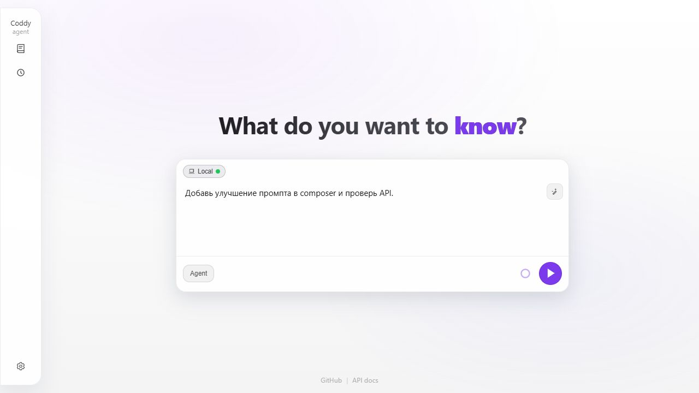

*The improve-prompt wand next to the send button*

Context ring and breakdown popover

- **Hover** on **`.composer-context-tip-host`**: compact tooltip (percent, input/output/total, max context) unchanged.
- **Click** opens **`ContextBreakdownPopover`** beside the ring on wide viewports (**`context-breakdown-menu--portal`**); on stacked shell (**`max-width: 1199px`**) it uses the same bottom sheet + scrim as slash / **`@`** pickers (**`context-breakdown-menu--sheet`**, **`slash-sheet-backdrop`**). **Escape** or **Close** dismisses; hover tooltip returns when closed.
- Legend keys map to **`contextBreakdown`** on **`GET /coddy/sessions/{id}/stats`** (`systemPrompt`, `toolDefinitions`, `rules`, `skills`, `mcp`, `conversation`). Live **`usage_update`** SSE replaces the displayed total immediately (including after `/compact` or automatic compaction), then the UI refreshes the detailed stats. Vitest: **`Composer.test.tsx`** (`click context ring opens breakdown popover`) and **`consumeComposerSse.order.test.ts`** (`usage_update replaces the displayed current context after compaction`).

Shape and glyphs

- The control sits to the **right** of the context ring (**`.composer-icon`** on **`Composer.tsx`**).
- The hit target is a **perfect circle**: equal **width** and **height**, **`border-radius: 50%`**, **`box-sizing: border-box`** (currently **42×42px** in **`styles.css`**). Do **not** ship a rounded square or squircle for this control unless the visual spec explicitly changes again.
- **Play** (**idle**, draft non-empty): Unicode triangle **`▶`**, enlarged vs body text (**`~22px`** glyph via **`composer-send-glyph`**), slight horizontal nudge for optical centering.
- **Stop** (**while the session has an active turn, draft empty**): filled square **`.composer-stop-square`** (**14x14px**, centered in the **42px** circle). Stays in **`composer-bar-actions`** on the right, next to the context ring, even when this tab has no stream reader.
- **Queue** (**while the session has an active turn, draft non-empty**): the **play** glyph returns on an accent fill (**`.composer-run-icon--queue`**, **`data-queue="true"`**), because a draft written during a turn is a follow-up rather than a Stop. Emptying the field brings **Stop** back, which is how a turn is still cancelled. See **Composer message queue** below.
- **Disabled** idle state when textarea is whitespace-only **and no files are attached** (**`:disabled`** on **`composer-send-play`**); an attachment alone unlocks Send (see **Composer file attachments (multimodal)**).

Behavior

- **Enter** submits when idle and queues the draft while the session has an active turn, on every device with a keyboard, a desktop window narrower than **1200px** included; **`Shift+Enter`** inserts a newline, and so do **`Ctrl+Enter`** and **`Alt+Enter`** (browsers insert nothing for those two, so the composer puts the newline at the caret itself). What Enter does follows the input device, not the width: on a **touch-only** device (**`(any-hover: none) and (any-pointer: coarse)`**, a phone) Return inserts a newline and the primary button sends or queues, because a phone keyboard has no Shift+Enter; **`Cmd+Enter`** still sends from an attached keyboard. The textarea's **`enterkeyhint`** says the same to the on-screen keyboard (**`send`**, or **`enter`** on a touch-only device). Enter that confirms an input-method candidate (**`isComposing`**, **`keyCode` 229**) never sends. The rule is **`chat/composerEnter.ts`**. No key the input method is composing with reaches the rest of the composer either (the check opens the textarea's **`onKeyDown`** in **`Composer.tsx`**): the slash, **`@`**, command option and line-range pickers take no row, move no highlight and do not close on it, and Ctrl+Z does not restore the draft from before Improve prompt. A keydown counts as composing when it carries **`isComposing`**, or when it is a **`keyCode` 229** keydown within 100 ms of **`compositionend`**, the key Safari sends after ending a composition. Any other 229, which Android keyboards send for ordinary keys, works the pickers as an ordinary key, while the send rule above still declines an Enter that carries it.
- **Stop** sends **`POST /coddy/sessions/{id}/cancel`** and aborts the tab's own reader at once, so the request does not wait for a connection that reader holds. Failure remains visible and retryable, and the tab rejoins the running turn; acknowledgement alone does not mark the turn idle. Partial assistant persistence and transcript merging follow [Parallel sessions and generation cancel](#parallel-sessions-and-generation-cancel).
- **A send the server never took** comes back to the composer: the text, ahead of anything typed since, and the attached files. That covers a refusal by status (**409** busy, a **4xx** or **5xx**), a request that failed on the way (a dropped upload, a refused connection) and an attachment the browser could not read (a file moved or changed on disk after it was picked, a cloud photo not on the device), in which case nothing is sent. The optimistic bubble leaves the transcript, and a red notice says why, with the browser's reason or the server's message in parentheses (`Failed to fetch`, `request body too large`), so a failure that never reached the server, and therefore left nothing in its log, can still be told apart from a stopped server. After a request that failed on the way the transcript is not read again, since that read would wipe the notice; if the server did take the turn after all, the activity refresh attaches to it and its end reloads the transcript. The rule is **`streamResponses`** in **`App.tsx`**.
- **Improve prompt**: the compact **24×24px** wand button (**`data-testid="composer-enhance-btn"`**) lives at the **right edge** of the workspace-context row, next to the Local / folder / branch / worktree controls — not in the textarea or lower composer bar. At **≤520px**, it is pinned to that row's **top-right corner** above wrapped chips. It has `title` and accessible name **`Improve prompt`**, is disabled for blank drafts and while a request or generation is active, calls **`POST /coddy/enhance-prompt`**, and replaces the draft only on success. **Ctrl+Z** / **⌘Z** restores the pre-improvement draft; a failure leaves it unchanged and displays an inline error.

Regression

- Automated UI checks (**Playwright MCP** or **`@playwright/test`**) MAY assert **`#btn-send`** **`offsetWidth`** **≈** **`offsetHeight`** and computed **`border-radius`** **≥ half** **`min(width,height)`** (within sub-pixel tolerance).

## Composer message queue

The composer stays live while the agent works: what is typed during a turn is queued for that turn to read at its next step, rather than refused by the turn lock. Full behaviour: [Message queue](../features/message-queue.md).

- **Queueing** - desktop **Enter** or the primary control (see above) calls **`POST /coddy/sessions/{id}/queue`** with **`{"text": ...}`** and clears the field. A **409** with code **`no_active_turn`** means the turn ended between the keystroke and the request: the SPA sends the same text through **`POST /v1/responses`** instead, so nothing typed is lost. Any other refusal puts the text back in the field and adds a system notice (**`composer.queueFull`** / **`composer.queueFailed`**).
- **The list** — queued rows render as **`.composer-queue-item`** (**`data-testid="composer-queue-item"`**) stacked **above** the composer card in reading order, text clamped to 3 lines, on the frosted glass of the composer card, each with the app's framed **×** in its top-right corner (**`data-testid="composer-queue-remove-<id>"`**, accessible name **`Remove from the queue`**) that calls **`DELETE /coddy/sessions/{id}/queue/{message_id}`**. When the call succeeds the message was still waiting, and its text goes back into the field, ahead of anything typed since; a **404** means the agent read it first and nothing returns. Nothing waiting renders no list.
- **Open and reconnect** - the UI reads **`GET /coddy/sessions/{id}/queue`** for the selected session alongside its activity snapshot. Existing waiting messages appear without another queue mutation, a live turn reader, or a matching row in **History**.
- **Staying in step** - clients of the same **`coddy serve`** receive **`event: message_queue`** with the whole queue and a **`version`** through the turn's stream (**`consumeComposerSse`**) and **`GET /coddy/events`** (**`serverEvents.ts`**, **`onMessageQueue`**). HTTP queue responses carry the same snapshot fields. **`App.tsx`** uses **`QueueDeliveryOrder`** (**`chat/messageQueueState.ts`**): ordinary deliveries keep the highest version per session. A fresh queue GET may recover a lower version, including **`0`**, after a restart if no queue delivery crosses the read. Recovery advances a local epoch and rejects mutation responses and own/relay stream queue frames captured in earlier epochs. A replayed **`turn_started`** does not reset that version or clear waiting messages. The server empties the queue when its turn releases, not when a browser reader closes. On the turn stream, **`event: user_message`** adds a consumed follow-up to the transcript where the agent read it.
- **Scope** - these are Stop and queue controls, not a shared session bus. Existing transcript relay and permission/question ownership stay unchanged. Separate local console or ACP processes sharing a sessions directory share the cancel marker, not their in-memory queues or answer channels.
- **Placeholder** — while generating, the field reads **`composer.placeholderQueue`** instead of the idle placeholder.
- **Attachments are not queued.** A queued follow-up is text; files attached to the composer stay there for the next prompt.
- Vitest: **`composerQueue.test.tsx`**.

Functional regression checklist:

| Scenario | Expected |
| --- | --- |
| Open a running session absent from the current History search or page | The activity and queue reads restore Stop/queue controls and waiting messages. |
| Reconnect with messages already waiting, or lose the local turn reader | The queue hydrates without a new mutation; controls follow server activity rather than reader lifetime. |
| Make `/cancel` fail, then retry | The error stays visible, the tab rejoins the running turn through the relay, and Stop remains usable. A successful retry acknowledges cancellation; server completion confirms idle. |
| Open three tabs on one running session (six HTTP/1.1 connections to the host), press Stop in any of them | The cancel request reaches the server and the turn stops in every tab, with no "Could not stop generation" error. |
| Open six idle tabs of one server over plain http, then send a prompt from any of them | The prompt is sent at once: the tabs share one events connection, and a turn started in one tab shows Stop in every tab viewing that session. |
| Deliver a queue GET response after an SSE queue delivery crossed that read | The delivered list wins; a removed or consumed message does not reappear. Replayed `turn_started` events preserve the list and version. |
| Restart the server, then recover the queue through a fresh GET | With no delivery during the read, a lower version (including `0`) replaces stale state; mutation responses and own/relay stream queue frames from earlier recovery epochs are ignored. |
| Deliver an old `turn_ended` while this tab's next POST is pending or admitted | The UI confirms activity through fresh REST rather than marking the new turn idle; activity and queue hydration wait during admission. |
| Switch sessions while an activity or queue read is pending | A late response does not change the new session's controls or queue. |

## Composer file attachments (multimodal)

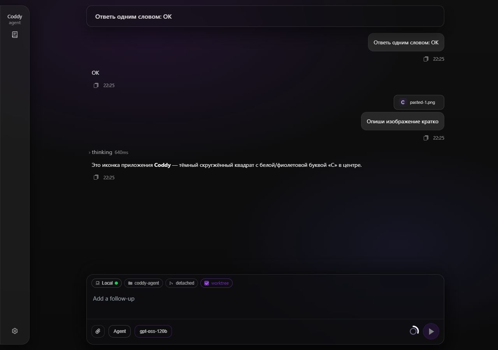

*A sent image restored as a thumbnail from the session bundle*

- The paperclip button (**`data-testid="composer-file-input"`** hidden `<input type="file">` triggered by a visible icon button) appears in the composer **only** when the active model has **`multimodal: true`** from **`GET /v1/models`**. The flag is derived from **`models[].multimodal`** in YAML config and propagated through **`ModelInfo.multimodal`** → **`llmModelMultimodal`** in **`App.tsx`** → **`Composer`** prop.
- Besides the paperclip picker, files enter **`attachedFiles`** through two more ingress paths, both gated on **`llmModelMultimodal`**:
  - **Clipboard paste** in **`textarea#composer`**: image items (`kind === "file"`, `image/*`) are attached and the default paste is cancelled; plain-text paste is untouched. Pasted images get deterministic names **`pasted-<n>.<ext>`** (browsers name every clipboard image `image.png`).
  - **Drag & drop** onto **`.composer-card`**: dropped files attach like a picker selection; while files are dragged over the card it shows the **`.composer-card--dragover`** drop-target affordance.
- When the model is **not** multimodal, paste/drop rejection shows the transient inline notice **`.composer-attach-hint`** (`role="status"`, auto-clears after ~4s) instead of attaching.
- An `image/*` attachment is a **preview card**, not a chip: the picture fills a **128×96** card (**`.composer-attachment-card`** on the composer side, **`.msg-user-file-card`** in the sent bubble, `object-fit: cover`, 12px radius) so the operator can see what was attached. Hovering highlights the card, the cursor is **`zoom-in`**, and a click opens the image in the shared viewer (**`ui/components/ImageLightbox.tsx`**: zoom levels, **+ / - / 0**, drag to pan, wheel and pinch to zoom, **Esc**, portal into `document.body`). Non-image files and locked edit-mode chips keep the icon chip with the file name.
  - In the composer the card's **remove** control (**`composer.removeAttachment`**) sits in its top-right corner and fades in on hover; it stays in the tab order and is visible on **`:focus-visible`**, and removing never opens the viewer. The picture the viewer opens is the local object URL - the file itself, at full size.
  - The **sent user bubble** first renders an optimistic **`previewUrl`** blob in the card, then replaces it with the backend **`files[].preview_url`** after persistence; the blob URL is revoked at that point. What the card opens is **`files[].url`**, the original bytes from the session bundle; a message sent before that field existed opens its **`preview_url`** instead of losing the click. Reloading the dialog restores both through **`GET /coddy/sessions/{id}/messages`**.
- **Attachment-only send** is valid while the selected model is multimodal: **Send** (button or **Enter**) unlocks with attachments even when the draft is empty and submits **`onSend("", files)`**; the server accepts an empty-string `input` alongside `inline_files`. If the user switches to a non-multimodal model, existing chips remain visible with **`.composer-attachment-chip--disabled`**, attachment-only Send becomes disabled, and a text send omits and retains those files.
- The HTTP handler independently filters **`inline_files`** against the effective YAML model. This keeps a custom or stale client from forwarding or persisting files when **`multimodal`** is false.
- Attached files are held in **`attachedFiles: File[]`** state on **`Composer`**. Preview chips appear above the composer input showing file name and type icon (or thumbnail for images).
- On send, **`App.tsx`** reads each file as a data URL via **`FileReader`** and includes **`inline_files: [{name, data_url}]`** in the **`POST /v1/responses`** body.
- **Agent / plan / ask turns**: when the effective model is multimodal, the server writes each file to **`~/.coddy/sessions/<id>/assets/`** (permissions **`0o444`**) and injects a **`<coddy_session_assets>`** XML block into the user message so the agent can **`read`** or **`cp`** those paths. Duplicate asset names get **`_1`**, **`_2`** suffixes (see `internal/session/assets.go` **`SavePartsToAssets`**).
- **Direct YAML model turns**: for a multimodal model, each file is saved under the session assets directory before it becomes an **`image_url`** content part sent inline to the provider.
- For any mode, decodable PNG/JPEG/GIF uploads get a read-only PNG preview bounded to **160 px** in **`assets/thumbnails/`**. **`GET /coddy/sessions/{id}/messages`** returns **`files`** metadata, **`preview_url`** and **`url`**; **`GET /coddy/sessions/{id}/assets/{name}/thumbnail`** serves the generated preview and **`GET /coddy/sessions/{id}/assets/{name}`** the original bytes, but **only when those bytes sniff as an image** - the file name never decides it, so no other attachment leaves the bundle. The user bubble strips the XML annotation via **`stripCoddyAttachmentsForUserDisplay`** and uses **`parseSessionAssetFiles`** only as a legacy fallback.
- After a **`PUT /coddy/config`** save in Settings, **`App.tsx`** bumps **`configEpoch`** → re-fetches **`/v1/models`** so the attachment button appears or disappears without a page reload. The same counter is bumped by **`event: config_reloaded`** on **`GET /coddy/events`**, so a change made outside this page has the same effect (see **Live configuration reloads**).

| Case | Expected | Automated check |
|------|----------|-----------------|
| FA1 | Paperclip visible only when `llmModelMultimodal` is true | `Composer.test.tsx` |
| FA2 | File chips render in user bubble after send | `stripCoddyAttachments.test.ts` |
| FA3 | Chips persist on reload via `parseSessionAssetFiles` | `stripCoddyAttachments.test.ts` |
| FA4 | Pasting an image attaches it as `pasted-<n>.<ext>` chip (multimodal only) | `Composer.test.tsx` |
| FA5 | Paste/drop with a non-multimodal model shows `composer-attach-hint` and attaches nothing | `Composer.test.tsx` |
| FA6 | Dropping files on `.composer-card` attaches them and toggles `composer-card--dragover` | `Composer.test.tsx` |
| FA7 | `image/*` attachments render a `composer-attachment-card` preview; non-image chips keep the icon | `Composer.test.tsx` |
| FA8 | Attachment alone unlocks Send/Enter and submits `onSend("", files)` | `Composer.test.tsx` |
| FA9 | Sent bubble renders `msg-user-file-thumb` from `previewUrl` (image only); metadata-only entries keep the icon | `UserMessage.test.tsx`, `optimisticUserFiles.test.ts` |
| FA10 | Switching to non-multimodal keeps chips disabled and text send omits them | `Composer.test.tsx` |
| FA11 | Backend thumbnail metadata replaces optimistic blobs and restores after reload | `sessionMessageFiles.test.ts`, `transcriptServerSnapshot.test.ts`, `server_test.go` |
| FA12 | A preview card opens the image enlarged, in the composer and in the sent bubble; the sent bubble opens `url` and falls back to `preview_url` | `Composer.test.tsx`, `UserMessage.test.tsx` |
| FA13 | Removing a composer preview card drops the attachment and opens nothing | `Composer.test.tsx` |
| FA14 | `GET .../assets/{name}` serves the original image bytes and refuses anything that does not sniff as an image | `coddy_session_asset_test.go` |

## Composer slash skills and mirror caret

Authoritative narrative and visual tokens live in **`DESIGN.md`** (slash picker, mirror contract, verification table). This section is the functional contract for regression.

Wire and draft

- **`textarea#composer`** holds **plain text** only. Invoked skills appear as **`/<name>`** tokens (space after picker selection). The UI **must not** persist **`[/<name>](coddy-skill:<name>)`** in the draft.
- First user turn on **`POST /v1/responses`** carries the same plain slash tokens as the composer value (no client-side markdown injection for skills in the request body).

Picker and segmentation

- The **Commands** group lists the built-ins from **`GET /coddy/commands`** with their argument hint (**`.slash-row-hint`**). Picking **`/model`**, **`/reasoning`** or **`/permissions`** opens that composer selector instead of inserting text, and picking **`/agent`**, **`/plan`** or **`/ask`** switches the mode; a settings command typed out with its value is sent as prompt text and applied by the server.
- Menu visibility and **`prefix`** derive from **`slashMenuDraftAtCaret`** in **`external/ui/src/ui/skills/draftSlash.ts`** (line-start or whitespace before **`/`**, optional suffix, not inside fences or blockquotes).
- Mirror highlighting uses **`segmentComposerSlashSpans`** in **`external/ui/src/ui/skills/segmentComposerSlashSpans.ts`** (mid-line **`/`** supported; **`x/foo`** is not a command token).

Mirror and caret alignment

- Non-empty drafts: textarea text is drawn **transparent**; **`.composer-mirror-inner`** shows the visible line including **`.composer-skill-chip-inline`** (**`data-testid="composer-skill-chip"`**).
- Composer chips **must not** use horizontal **padding**, **margin**, or a **border** that changes inline width. Use **`box-shadow`** for outline. **`font-family`**, **`font-size`**, **`line-height`**, **`font-weight`**, **`letter-spacing`** on chip and **`#composer`** must match so the caret lines up (**`ResizeObserver`** syncs scrollbar gutter).

Transcript vs composer

- **`user_message`** bubbles render **plain text** only (**`msg-user-body`**, **`white-space: pre-wrap`**). No Markdown pipeline, no transcript skill chips (**`coddy-skill-span`**). Slash tokens such as **`/path/to`** and YAML blocks stay exactly as persisted, with line breaks preserved.
- Composer mirror chips (**`composer-skill-chip`**) apply **only** while editing **`#composer`**, not in the transcript.
- Persisted user turns may carry hydrated attachments as **`coddy_attachment`** XML with **`path`**, **`name`**, and CDATA file bodies (**`internal/agent`**). **`stripCoddyAttachmentsForUserDisplay`** replaces each XML block with a compact **`@path`** **only when** that path is **not** already present as an **`@`** mention in the surrounding text (**avoids duplication** because the persisted turn already repeats the **`@`** in the user text plus the hydrated block).

Verification use cases

| ID | Expectation | Primary automated check |
| --- | --- | --- |
| UC1 | One chip for **`asdfasf /find-skills asdfasdf`**, plain **`textarea.value`** | **`external/ui/src/ui/chat/Composer.test.tsx`** (`composer highlights plain slash token as chip while editing`) |
| UC2 | Mid-line menu open after whitespace | **`draftSlash.test.ts`** (`slashMenuDraftAtCaret works after whitespace mid-line`) |
| UC3 | **`x/foo`** no chip for **`/foo`** | **`segmentComposerSlashSpans.test.ts`** (`segmentComposerSlashSpans skips letter before slash`) |
| UC4 | Line-leading **`/foo`** chip | **`segmentComposerSlashSpans.test.ts`** (`segmentComposerSlashSpans line start slash`) |
| UC5 | **`stripCoddySkillMarkdownLinks`** on legacy paste | **`segmentComposerSlashSpans.test.ts`** (`stripCoddySkillMarkdownLinks restores plain slash token`) |
| UC6 | User bubble keeps **`hi /demo there`** plain (no **`coddy-skill-span`**) | **`UserMessage.test.tsx`** |
| UC7 | Multiline YAML / paths keep **`\\n`** layout in **`user-message-body`** | **`UserMessage.test.tsx`** |
| UC7b | Display-only **`slugSlashes`** (plain **`/`** and legacy mix) | **`segmentComposerSlashSpans.test.ts`** (`slugSlashesForUserBubbleMarkdown …`; composer / legacy only, not transcript) |
| UC8 | Live **`coddy serve`**: **`fontFamily`** parity chip vs **`#composer`**, caret **`selectionStart === value.length`** at EOL after fill | **Playwright MCP** **`browser_evaluate`** after **`make build TAGS="http ui"`** |
| UC9 | User bubble hides **`coddy_attachment`** bodies, shows **`@path`** only | **`UserMessage.test.tsx`**, **`stripCoddyAttachments.test.ts`** |

## Composer command options

Once **`/compact`** opens the draft, the composer completes what the command takes. Two dashes after it (**`/compact --`**) offer the option **`--model`** (a lone **`-`** offers nothing, since the instructions may be a list); after **`--model `** or **`--model=`** the list holds the configured models (the ids the composer's model selector offers, **`props.llmModels`**), narrowed as the id is typed by a case-insensitive substring match, the broadest of the rules the server resolves a name by (a whole id or a model name without its provider wins first, see [Context compaction](../features/compaction.md#the-compact-command)). **ArrowDown** / **ArrowUp** move the highlight, **Enter** and **Tab** put the row into the draft with a space after it, **Escape** closes the list and leaves the draft alone. Picking **`--model`** opens the models at once.

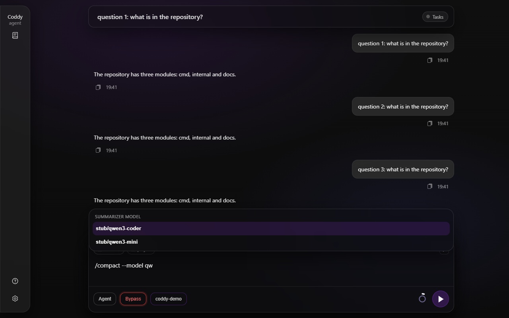

*The composer completing the value of `--model` (Dark, 1280 px).*

- The list is the third face of the picker shell (**`.slash-menu`**, the bottom sheet on the stacked shell), **`data-testid="command-arg-menu"`**, rows **`command-arg-row-<id>`**; it needs no request.
- Visibility, the replaced range and the typed prefix come from **`commandArgDraftAtCaret`** in **`external/ui/src/ui/skills/draftCommandArg.ts`**, which mirrors **`parseCompactCommand`** (**`internal/agent/compact.go`**): the command opens the draft, options come first, and the first word that is not an option starts the instructions, where nothing is completed. A bare **`/compact `** opens nothing, so **Enter** still sends the command.
- Tests: **`draftCommandArg.test.ts`**, **`Composer.commandArg.test.tsx`**.

## Composer **`@`** mentions

- **`textarea#composer`** keeps plain **`input`** including every literal **`@`** mention, and **`POST /v1/responses`** sends that text as typed: the server resolves the mentions when the message is sent (**`internal/session/mentions.go`**, the grammar in **`internal/mention`**), the same resolver the console, ACP editors and the Telegram bot use. The composer no longer derives **`attachments`** from the draft; **`extractAtFileAttachments`** (**`external/ui/src/ui/skills/draftAt.ts`**) only feeds the recent picks. What a mention attaches and its limits: [Mentions](../features/mentions.md).
- The **`@`** menu asks **`GET /coddy/mentions`** (**`q`** = the text after **`@`**, **`limit=50`**; the first query after the picker opens adds **`refresh=1`**, so a file written a moment ago is offered). Rows are **`MentionRow`**s (**`external/ui/src/ui/skills/mentionRows.ts`**): **`kind`** (**`file`**, **`directory`**, **`session`**, **`rule`**, **`agent`**, **`plan`**, **`doc`**, **`scheme`**), **`insert`** (the text that replaces **`@`** plus the query), **`label`**, **`detail`** and **`continue`**. Each row leads with a kind label (**`.mention-kind`**, the meta kinds on the accent); a **`scheme`** row is **`@session:`**, **`@rule:`**, **`@agent:`** or **`@coddy:`** and narrows the search to that kind.
- Choosing a row replaces **`@`** plus the query with **`insert`**. A **`continue`** row (a folder, a scheme hint) adds no space and keeps the picker open on its new query - **`@src/`** lists what **`src/`** holds; any other row ends the mention with a space, quoted (**`@"my notes.md"`**) when the path holds one. A quoted folder (**`@"my notes/`**) closes its quote ahead of the caret, so the draft names the folder even if no file follows, and the next quoted pick takes that quote over (**`applyMentionRow`** in **`mentionRows.ts`**). A second answer for the same draft - the server's rows after the recent picks, a retry while the index builds - keeps the row the arrows moved to. **`Composer`** defers two **`updatePickerMenus`** ticks after a finished pick so the dropdown does not immediately reopen on the trailing space.
- **ArrowDown** / **ArrowUp** move the highlight (**`is-active`**, **`aria-selected`**, scrolled into view); **Enter** and **Tab** take the highlighted row. The picker works while a turn runs, so a queued follow-up can mention a file too.
- A query starting with **`/`**, **`~`**, **`./`** or **`../`** browses that folder on the server, anywhere on disk; a scheme-less query ranks the session's workspace (file name first, then path segments, then letters in order) and merges in the rules, subagents and plans whose names match. When the server matched more than the list holds, **`.mention-more`** (**`data-testid="mention-more"`**) says **`50 of 1204, type to narrow`** on the title row, which stays on screen however far the list scrolls; while the first index of the workspace is still being built the picker asks again every 400 ms, up to five times.
- An empty **`@`** prefix (caret right after **`@`**) shows the recent picks from **`localStorage`** (**`workspaceAtRecents`**) first, keyed by **`sessionId`** (or **`__no_session__`** before the first assigned id), then the server's answer to an empty query: the three scheme hints and the top of the workspace. Recent entries come from file and folder picks and from **`extractAtFileAttachments`** on successful profile sends (**`migrateWorkspaceAtRecents`** merges when the client generates or the server rotates **`X-Coddy-Session-ID`**).
- The draft lexer (**`atMenuDraftAtCaret`**) opens the menu on an **`@`** at line start or after whitespace, an opening bracket or a quote; it accepts **`~`** and **`+`**, a quoted prefix (**`@"my no`**, spaces allowed until the quote closes) and **`:`** right after **`session`**, **`rule`** or **`agent`**. Fenced code blocks, inline code spans and Markdown blockquote lines suppress it, in parity with **`draftSlash`** (**`inMarkdownFenceBeforeCaret`**, **`blockquoteLine`**).
- Mirror **`@`** styling uses **`segmentComposerMirrorSpans`** (**`composer-at-chip-inline`**, **`data-testid="composer-at-chip"`**). **`listAtPathSpans`** (**`draftAt.ts`**, built on **`parseMentions`**, the twin of **`internal/mention`**'s **`Parse`**) finds the tokens - a path, a folder, **`@session:<id>`**, **`@rule:<name>`**, **`@agent:<name>`**, a quoted path, a web page - and a token is chipped only when the server has said sending would attach it: 150 ms after typing stops the composer posts the draft to **`POST /coddy/mentions/check`**, which runs the resolver dry (nothing read, listed or fetched) and answers per token with the part that resolves (**`typed`**) and what it names. So **`@google/genai`** in **`npm install @google/genai`** stays text, **`compare @src/a.go b.go`** chips **`@src/a.go`** alone, and a token not answered for yet stays text; a row picked in the picker is chipped at once. The draft at the caret keeps its chip while the picker is open on it; text after the caret that is still inside the draft stays on the active token until the **`atMenuDraftAtCaret`** lexer breaks out. **`draftAt.test.ts`** reads **`internal/mention/testdata/grammar_cases.json`**, the cases the Go grammar is tested against.
- A query with zero matches keeps the picker open (**`Nothing matches`**) instead of collapsing the menu (**`composer-at-chip-inline`** hides for **`atNoMatch`**, same **`atIdx`**, **`prefix`** as the stale filter).
- Stacked-shell viewports (**`(max-width: 1199px)`**) render the mention and slash pickers as a **`slash-menu--sheet`** with **`slash-sheet-backdrop`** so the panel is usable on phones.
- The user bubble collapses every **`<coddy_attachment>`** the message was sent with (**`stripCoddyAttachmentsForUserDisplay`**, the twin of **`mention.ForDisplay`**): back to the mention that brought it (the **`mention`** attribute, else **`path`**), or to nothing when the text already carries that mention; the body of a **`/skill`** and a rule a mentioned path pulled in show nothing. The scan walks CDATA sections, so a file that contains **`</coddy_attachment>`** cannot leak its tail into the bubble.

### Line ranges (**`@path:N-M`**)

- A mention may narrow a file to a **1-based inclusive** line range: **`@Dockerfile:21-31`**, or in the forms editors and code hosts write, **`#L21-31`**, **`#L21-L31`**, **`#L21`**, **`#21-31`**. **`listAtPathSpans`** absorbs the suffix, so the mirror chips the whole token as one **`composer-at-chip-inline`**; the range must end the token (**`:21-31x`** stays prose) and **`1 <= start <= end`**. **`internal/mention/grammar.go`** carries the same grammar server-side, and the two test suites share their literals (**`internal/mention/testdata/grammar_cases.json`**).
- Only those lines reach the model. The range rides **`acp.Resource.URI`** as a **`#L<start>-<end>`** fragment (**`lineRangeURI`** / **`sliceLines`** in **`internal/session/promptfiles.go`**) and **`resourceAttachmentXML`** (**`internal/agent/mentions.go`**, over **`mention.Attachment`**) turns it into **`<coddy_attachment path="..." name="..." lines="21-31">`**. An end past the last line clamps. A range the file cannot honour (zero, inverted, or starting past the last line) is never widened into the whole file: an explicit **`attachments[]`** range or a client **`resource`** with such a **`#L`** fragment is refused (**`ErrLineRange`**, HTTP **400**), and a range typed into the prompt text attaches a note naming how many lines the file has. The **`lines`** label is written only for a body that really is the slice; a **`source.literal`** or byte-offset (**`source.start`** / **`end`**) body travels without it. The picker preview is a snapshot taken when the panel opened; the lines that reach the model are read from disk at send time, and a session switch drops the preview. **`stripCoddyAttachmentsForUserDisplay`** collapses such a block back to **`@path:N-M`**; a plain mention never covers a ranged one of the same path, nor the other way round.
- Typing the **`:`** after a path closes the mention picker on its own (**`:`** is no **`MENU_PATH_CHAR`** outside the scheme hints) and opens the **line-range picker** in its place: **`atRangeDraftAtCaret`** / **`replaceAtRangeSuffix`** / **`highlightedRange`** in **`external/ui/src/ui/skills/draftAtRange.ts`**, panel **`data-testid="at-range-picker"`** rendered through the same portal / **`slash-menu--sheet`** chrome as the **`@`** menu. It previews the file (**`GET /coddy/workspace/file`**, one fetch per path, workspace files only: a range typed after an absolute path still reaches the model, without a preview) and highlights **`at-range-line--sel`** as the digits are typed; a start without an end highlights that one line.
- The composer text stays the only input - there are no number fields. On desktop the rows are buttons: **`mousedown`** anchors the range, dragging over rows extends it, and each step rewrites the suffix through **`replaceAtRangeSuffix`** (**`preventDefault`** keeps focus in the textarea). On **`isMobileShell`** the rows render as plain **`div`**s with no pointer handlers - a phone has no mouse to drag with, so the range is typed.
- A path that does not resolve leaves the panel closed, so **`@user:1-2`** in prose never opens an empty panel; the settled path is remembered so the next digit refetches nothing. **`Escape`** dismisses the panel and suppresses it for that mention until the draft moves on; **`Enter`** is left alone and still sends.

| Case | Expected | Automated check |
| --- | --- | --- |
| AR1 | **`@f.go:21-31`** chips as one token and attaches only those lines | **`draftAt.test.ts`**, **`internal/mention/mention_test.go`** (shared **`grammar_cases.json`**), **`features/at_line_range_mention.feature`** |
| AR2 | **`:21`**, **`:21-31x`**, **`:31-21`**, **`:0-5`** are not ranges | **`draftAt.test.ts`**, **`internal/mention/mention_test.go`** |
| AR3 | Colon opens the picker; digits move the highlight | **`Composer.test.tsx`**, **`draftAtRange.test.ts`** |
| AR4 | Desktop drag writes the range; mobile rows are not buttons | **`Composer.test.tsx`** |
| AR5 | Unresolvable path keeps the panel closed | **`Composer.test.tsx`** |
| AR6 | User bubble shows **`@path:N-M`** instead of the attachment body | **`stripCoddyAttachments.test.ts`** |

| Case | Expected | Automated check |
| --- | --- | --- |
| AT1 | Spaces inside paths ( **`readme copy.md`**, **`@"my notes.md"`** ) work in the picker draft and resolve server-side | **`draftAt.test.ts`**, **`features/mentions.feature`** |
| AT2 | The picker asks **`GET /coddy/mentions`** (**`refresh=1`** on open), names each kind and says how many matched | **`Composer.test.tsx`**, **`TestCoddyMentionsGet`** |
| AT3 | Arrow keys move the highlight; **Enter** inserts it with a space, also while a turn runs; a folder keeps the picker open | **`Composer.test.tsx`** |
| AT4 | **`@`** inside **`session/prompt`** text alone resolves (no duplicate when **`attachments`** or **`resource`** already has body text) | **`TestHydratePromptContentBlocksExpandsAtInText`**, **`features/mentions.feature`** |
| AT5 | The bubble collapses attachments back to the mentions that brought them, CDATA-aware | **`stripCoddyAttachments.test.ts`**, **`internal/mention/mention_test.go`** |

## Transcript message types

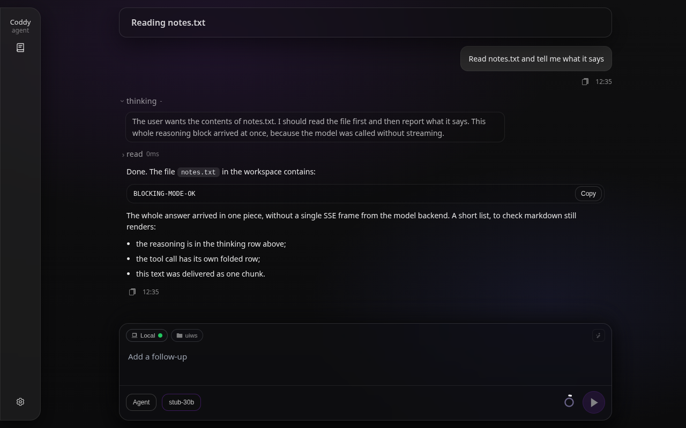

*A thinking block expanded above the answer*

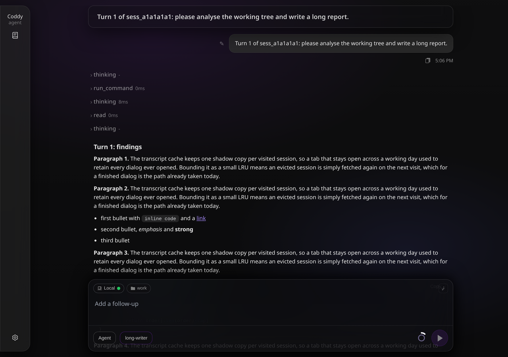

*A long transcript with tool cards and answers*

The chat transcript renders a flat list of UI message blocks. Each block has a `type` and a minimal set of required fields.

- `user_message`
  - Plain user input text (**no Markdown**; **`pre-wrap`** preserves line breaks).
- `background_wake`
  - The first row of a turn nobody typed: background tasks the model started with **`notify_on_finish`** ended and the server woke the agent ([Background tasks](../features/background-tasks.md#what-the-woken-turn-looks-like)). It renders as **nothing**, neither a user bubble nor a note: the agent's answer follows the previous turn as the work carrying on, and the bell on the task's card in the Tasks panel says what woke it (*Woke the agent when it ended*).
  - Built from the **`background_wake`** frame of the relay while the turn streams and from the **`background_wake`** field of the message after a reload (**`parseBackgroundWakeTasks`** in **`chat/backgroundWake.ts`** reads both shapes). It opens a turn like a user message: the live status line counts from it, the next edit counts it the way the server counts user messages, and a failed woken turn offers no retry - nothing typed to send again.
- `thinking`
  - Renders model reasoning as a lightweight disclosure row.
  - Status `in_progress` shows label `thinking...` and a spinner.
  - Status `completed` shows label `thinking` and preserves the text for review.
  - Multiple `thinking` blocks may appear in one turn (reasoning can resume after tool calls).
- `tool_call`
  - A single tool execution row, same disclosure chrome as **thinking** / **memory** (**chevron**, **`thinking-label`**, **`thinking-dur`** for duration or **`-`**).
  - The label is what the agent is doing, not the function it called: the tool id is translated through the **`tool.name.*`** catalogue (**`reading a file`** / **`читаю файл`**, **`running a command`** / **`выполняю команду`**). A tool an MCP server serves is named by **`tool.name.mcp`** from its `server__tool` id - **`calling browser_navigate on the MCP server playwright`** / **`запускаю browser_navigate на MCP-сервере playwright`**, the `mcp__server__tool` spelling read the same way - and anything else without an entry keeps its raw id. **`read`** serves files and directories from one tool, so it says **`browsing a directory`** / **`просматриваю директорию`** only when the arguments prove it (**`recursive`**, **`show_hidden`**, or a path ending in a separator).
  - Next to the label, **`.tool-summary-target`** names the one thing the call acts on - the path it reads, the command it runs, the skill it loads - from the same **`toolCallTargetText`** the live status line uses. An MCP server names its own arguments, so a call of its that takes none of **`path`** / **`filePath`** / **`file_path`** / **`url`** / **`name`** shows the first argument that reads as a label instead: a non-empty single-line value of at most 120 characters, never a body. A Coddy tool keeps naming the argument it is documented to take. Label, target and duration are one non-wrapping group (**`.thinking-head`**): the target is what gives way, clipped with an ellipsis and carrying the full value as its **`title`**, so a long path never wraps the row onto a second line.
  - A path is shown **relative to the directory the work is in** when that spelling is shorter (`relativeToolTarget`). The roots are the session's directory and the worktrees of its workspace, deepest match first, so a file inside a worktree reads against that worktree rather than against the checkout it hangs under. Only real paths are rewritten, never a command, a pattern, a url or a name, and the absolute path stays in the row's `title` and in the expanded card. The live status line names no path at all: it carries the phase of the step and nothing it acts on.
  - While **`pending`** or **`in_progress`**, the summary label uses a **`...`** suffix (for example **`reading a file...`**). **`startedAtMs`** drives a live duration until the tool finishes.
  - When a structured preview and a returned body are both present, they touch and share the outer corners as one continuous execution card; there is no gap, duplicate border, header or divider between them. The body carries no **Result** label: it is the only thing under the call.
  - A **failed** call says so on its summary row - **`.tool-failed-marker`** (**`data-testid="tool-failed-marker"`**) renders **(failed)** / **(ошибка)** in the theme's deletion red between the target and the duration - so the failure reads while the row is still collapsed, instead of being a coloured dot inside the expanded body.
  - Details reuse the permission card's tool-specific preview without approval actions. **read**, **grep**, **glob**, and **print_tree** receive compact structured argument previews; unknown tools keep a styled monospace fallback. **run_command** / **ssh_run_command** put the command in an inset block inside the card behind a **`$`** prompt, under a header that names the server's own interpreter for a local call (**`shell`** from **`GET /coddy/workspace/context`**, kept in **`chat/hostShell.ts`**; the generic label when the server reports none, and for the remote **ssh_run_command**), with the copy control on that same line (**`data-testid="tool-preview-copy"`** in the transcript, **`permission-prompt-copy`** on a permission card) rather than in the card header. A call that takes **no arguments** has no input to preview: instead of an empty **`{}`** body it renders the shared bar alone (**`data-testid="tool-action-preview"`**) - the action label, the todo status mark, and **Done** / **Running…** / **Failed** / **Cancelled** - so it reads as a sibling of the plan cards. **load_skill** shows no argument card at all, because the summary row already names the skill. Large **`write`** / **`write_file`** code previews and **`apply_patch`** / **`edit`** diffs use the shared measured viewport: **More…** appears only for real overflow, preserves the card height while enabling internal scrolling, and **Less** clips the body again and returns it to the top. The returned body is plain text only (rendered like **`<pre>`**, **no** Markdown pipeline). If **`resultPreviewTruncated`** is false / **`resultWasTruncated`** unset, there is no result overflow toggle or fixed-height result viewport. **load_skill** is the one exception to the plain-text rule: a **completed** call returns a skill's markdown, so it renders through the Markdown component - the instructions are the card. A **failed** one returned an error, not a skill, and keeps the raw monospace panel. If truncated (19 content lines plus **`...`**), apply the capped result viewport (~20 lines) with **overflow-y** hidden until **More…**; **More…** (**`data-testid="tool-result-more"`**) performs **GET `/coddy/sessions/{id}/tool-calls/{toolCallId}`**, then enables **overflow-y auto** at the same height and becomes **Less** (**`data-testid="tool-result-less"`**); **Less** restores the clipped preview without a second GET while **fullResultText** stays in memory. Both preview and result controls use the shared left-aligned **`tool-overflow-toggle`** tab button.

## Live status next to the typing dots

For the whole of a running turn, streaming text included, the typing dots carry a live status line (`TypingDotsMessage.tsx`, pure derivation in `chat/liveStatus.ts`, visual contract in `DESIGN.md`):

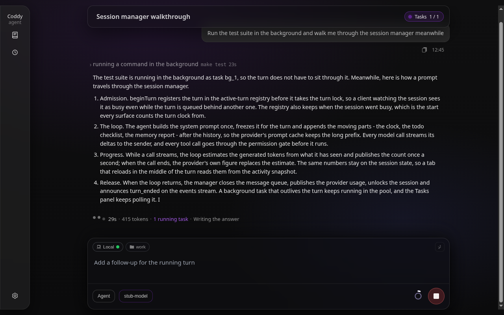

*The live line of a running turn: the turn clock, the generated tokens, the running background task and what the agent is doing*

- The turn's own numbers lead the line: how long the turn has been running, how many tokens the model has generated in it, how many background tasks are running right now (`15m 08s · 13.5k tokens · 1 running task · Thinking…`). Before the first token the line is the clock and the phrase alone (`57s · Waiting for the model`), and the tasks segment appears only while something runs. It is a button: it opens the [Tasks panel](../features/background-tasks.md#ui).
- When the turn has ended and background tasks it started are still running, the dots stay at the tail of the transcript with the count and nothing else (`1 running task`): no clock and no tokens, because there is no turn to time. It opens the same panel, and it goes as soon as the last task finishes.
- The clock and the tokens are the server's: the agent publishes `turn_progress` on the turn stream ([HTTP API](../reference/http-api.md)) and keeps the same numbers behind `GET /coddy/sessions/{id}/activity`, which a reloaded tab reads, so the clock carries on where it was. `chat/turnProgress.ts` folds the two sources: a reading names its turn by the server's `startedAt` and is dated by the turn's age on the server's clock, so the newer reading wins whichever way it came - an activity answer read before the stream's last frame and delivered after it is dropped, and an answer a throttled tab handles seconds late is still the same turn. The tab drops the numbers when the turn ends and on any activity read that finds the session idle, so the next turn never opens on the previous turn's clock. A server that predates `turn_progress` leaves the clock counting from the turn's user message, without tokens.
- The phrase of the current step, and a step counter when the step runs something other than the model - a tool call, the memory run (`2m 05s · 1.2k tokens · Running a command · 45s`). Waiting, thinking and writing are covered by the turn clock. On a phone the line takes two rows: the phrase next to the dots, the turn's numbers under it as a caption.
- **The line carries the phase and nothing the step acts on.** No path, no command, no pattern, no url: what a step acts on is named once, on the transcript row above the line. So every phrase is complete on its own - `Running a command`, never `Running` waiting for a command to follow it - and a phrase that reads as a fragment fails the dictionary check in every locale (`external/ui/src/ui/i18n/statusPhrases.test.ts`). A phrase too long for the row ellipsizes rather than wrapping it.
- Priority: unresolved permission prompt → unresolved question prompt → running tool call (an `in_progress` call beats a later announced `pending` one) → in-progress thinking (`Thinking…`) → a memory run in flight (`Working with memory`, from the `memory_run` events of the stream; the run itself is an invisible `memory_run` item of the turn, nothing renders it) → answer text as the turn's newest row (`Writing the answer`) → waiting on the model. The line always carries a phrase; it is never three bare dots.
- The two prompt states render **no** step counter: nothing is running while the operator decides. The turn clock keeps counting.
- A plain wait escalates with time: `Waiting for the model` → `The model is taking longer than usual` (15 s, `typing-dots-status--slow`) → `Still no response from the server` (60 s).
- A tool Coddy does not define takes the generic `Running a tool`, which says nothing about a call an MCP server serves, so that one phrase names the server and the tool instead - `Calling browser_navigate on the MCP server playwright`. That is the identity of the step, not its arguments; what the call acts on is read on the transcript row above, which names the server and the tool as well.
- Derivation scans back to the last `user_message`, so a stale `in_progress` row from a finished turn never drives the label. The console twin of the phrase table lives in `external/cli/status.go`.

## Tool call card (bundled SPA, current)

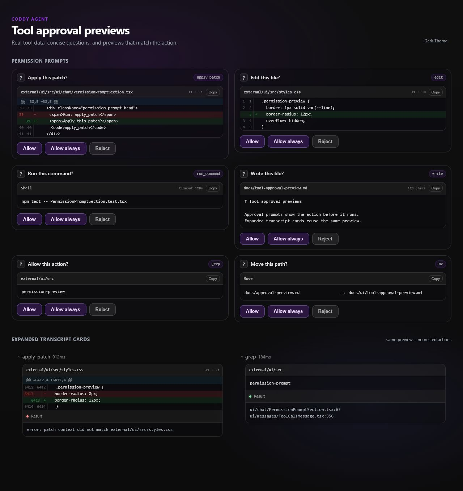

*Approval prompts and expanded tool cards*

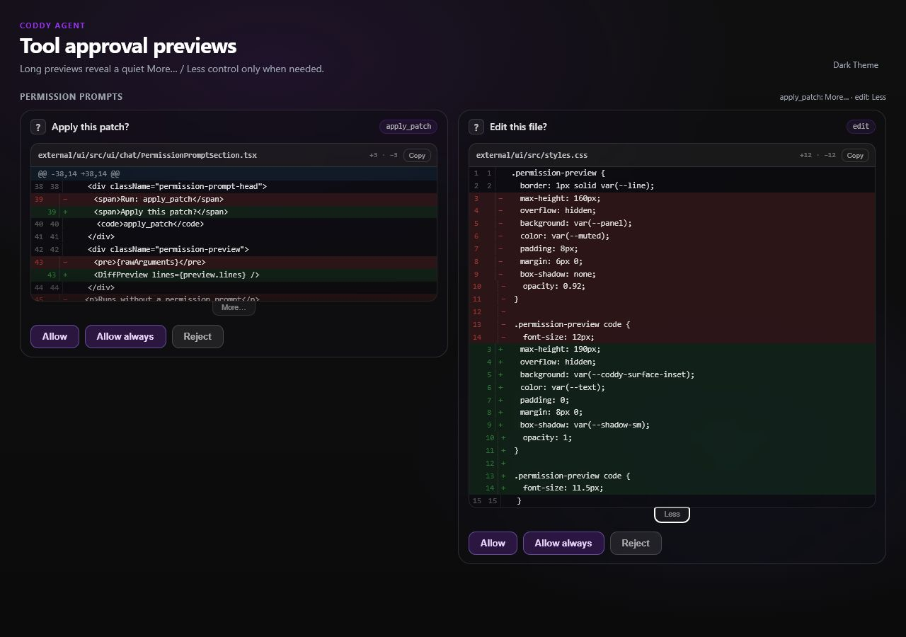

*A long tool result collapsed behind More and expanded with Less*

The scheduler tools (`coddy_scheduler_*`) have a card of their own instead of their JSON: the bar names the job and what happened to it (*resumed*, *run started*, *was not running*, *created*, *updated*, *deleted*), a job read or created is shown as its fields - description, schedule with its human reading, state, next run, mode, model, folder - with the instruction rendered as Markdown, the job list as one row per job and the runs of a job as one row per run with its status and duration.

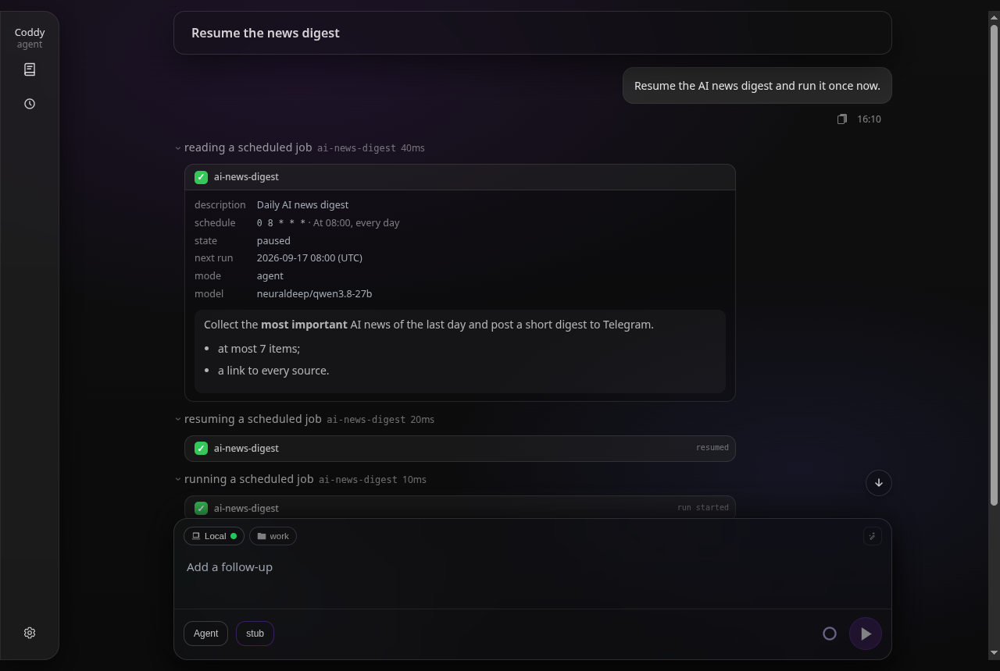

*Scheduler calls in the transcript: a job read as its fields, a resume and a run as their outcome*

`spawn_agent` has a dedicated argument card: agent icon and name, optional description, a labelled timeout badge, and an inset panel for the full multiline prompt. The timeout is the supplied execution limit in seconds, separate from the elapsed duration beside the tool title. The layout wraps on narrow screens and follows the active light/dark theme. Calls with truncated history arguments load the full arguments once per incomplete preview, including running calls; malformed arguments or failed fetches retain the plain argument preview. Result output and More / Less behave as for other tools, with the result attached below the agent card. Card labels follow the active English/Russian UI locale.

The happy path is in `features/spawn_agent_card.feature`, run by the `http,ui` godog harness through the React DOM test in `SpawnAgentCard.test.tsx`. Edge cases cover invalid arguments, absent/invalid timeouts, escaped prompt text, and history fetch failure.

Authoritative behaviour matches **`DESIGN.md`** tool timeline plus this checklist.

| Concern | Current behaviour |
| --- | --- |
| Component | **`ToolCallMessage.tsx`** - **`thinking-row coddy-tool-call-row`**, **`details.thinking-details.coddy-tool-details`**, **`data-testid`**: **`tool-details-{toolCallId}`** |
| Summary | Same pattern as **thinking** (**`thinking-summary`**, **`thinking-left`**, **`thinking-chevron`**), with **`thinking-label`**, **`.tool-summary-target`**, the failure **`.tool-failed-marker`** and **`thinking-dur`** inside one non-wrapping **`.thinking-head`**; on a backgrounded **`run_command`** that duration is the task's clock (**`data-testid="tool-bgtask-elapsed-<id>"`**); **`aria-label="Tool summary"`** |
| Label | **`toolDisplayName`** (**`messages/toolDisplayName.ts`**) over the **`tool.name.*`** dictionary entries; a **`server__tool`** name (**`mcp__`** prefix accepted) reads through **`tool.name.mcp`** as *calling {tool} on the MCP server {server}*, and any other unknown id falls through to itself. **`background: true`** on a **`run_command`** picks **`tool.name.run_command_background`** (*running a command in the background* / *выполняю команду в фоне*), read only from complete arguments |
| Args | Shared **`PermissionToolPreview`** (no approval actions; the only copy control is the one inside a shell command block, **`data-testid="tool-preview-copy"`**); large **write** / **write_file**, **apply_patch**, and **edit** bodies keep measured **More…** (**`data-testid="tool-preview-more"`**) / **Less** (**`data-testid="tool-preview-less"`**) overflow controls |
| Result | **`div.tool-call-result-card`**, **`aria-label="Tool result"`**, with inner **`pre.tool-result-pre`** and no header row; completed structured todo and **`plan_exit`** cards suppress redundant boilerplate results; a completed **`load_skill`** renders the skill's markdown instead (**`.tool-call-result-content--markdown`**) |
| Markdown | Not used for tool **result** or **user** bubbles; **assistant** still uses Markdown per below |
| List merge | **`App.tsx`** **`loadMessages`** merges **`GET /coddy/sessions/{id}/tool-calls`** rows into **`resultText`**, **`resultWasTruncated`**, timing |
| Full text | First result **More…**, or automatic incomplete-args recovery for restored **`apply_patch`** / **`write`** / **`write_file`** / **`edit`** cards in any status - **`GET /coddy/sessions/{id}/tool-calls/{toolCallId}`**, using JSON **`result`** and **`args`** (same object includes **`meta`**). Transcript reconciles never replace complete args with the truncated 200-char **`argsPreview`** (**`pickRicherToolArgs`**), so live cards keep full previews across permission answers |
| CSS | **`styles.css`**: **`.coddy-tool-call-row`**, transparent **`.coddy-tool-call-body`**, shared **`.permission-preview*`**, **`.tool-call-result-card`**, **`thinking-details:not([open])` body hidden**, plus result viewport / toggle classes above |

- `assistant_message`
  - Final assistant output text for the turn, after tool calls.
  - Only the answer that closes a turn carries the action row (**`.msg-assistant-foot`**: the copy control and the timestamp). The answers a turn leaves behind between tool calls render prose alone - a column of identical copy buttons and repeated minutes reads as chrome, not as information. Every finished turn keeps its own row, so an older answer stays copyable; only the turn still running has none, because its last answer is not yet the answer.

## Tool permission card

The inline approval gate is implemented by **PermissionPromptSection** and **PermissionPromptPreview**.

- Render the card only for a pending permission request. Read-only tools render their normal timeline row only; there is no informational no-approval card, checkmark, or explanatory sentence.
- Header: human action question plus one raw tool-id badge. The preview header is reserved for the path, shell, or operation scope so the tool name is not duplicated.
- Actions use the server-provided labels unchanged (**Allow**, **Allow always**, optional **Always allow `<program>`**, **Reject**). The options list is rendered from the SSE payload, so a fourth button needs no client change beyond layout.
- While the session asks, the server adds the session switches before **Reject**: **Bypass for this session** (**`allow_session_bypass`**, drawn in red, **`permission-prompt-btn--session-bypass`**) and, for a file write, **Allow edits for this session** (**`allow_session_accept_edits`**, **`permission-prompt-btn--session-edits`**). Either approves the call and switches the session, and the permission chip follows from the settings event ([Session settings](../features/session-settings.md#switching-from-the-permission-dialog)).
- The program-wide option only reaches the client for **run_command** on a single plain invocation. Its label already names the exact grant (**`curl`**, **`git status`**), so the card must render it verbatim rather than re-deriving a program name.
- Match the prompt to its **tool_call** by **toolCallId** and prefer that row’s **argsText**; fall back to **Arguments:** content in the permission payload.
- A turn the server woke on its own asks here too. Its prompt arrives on the composer relay the tab follows, is persisted as the session's pending prompt (so a reload restores it like any other), and the first answer from any client - this tab, another one, a console following the turn - settles it.
- **apply_patch** and **edit** render old/new line gutters and theme-aware added/deleted/context rows. Other filesystem mutation tools and **run_command** use compact structured previews rather than JSON.
- The collapsed preview is measured after layout. Show **More…** only when **scrollHeight > clientHeight**; keep the viewport bounded, switch it to internal vertical scrolling, and change the button to **Less**. Returning to the collapsed state restores clipping and re-measures overflow. The shared button is left-aligned; on phones it has a **36px** minimum height.
- Restored write permission prompts include **rm** and **rmdir** alongside the other filesystem mutation tools.

Automated checks:

- **external/ui/src/ui/chat/permissionToolPreview.test.ts**
- **external/ui/src/ui/chat/PermissionPromptSection.test.tsx**
- **external/ui/src/ui/messages/MessageList.test.tsx**


## Message editing and history rewind

Editing a sent message rewrites the conversation in place: the history is rewound to that message and the edited text is sent in the same session - no sibling conversation, nothing to navigate.

- Every user bubble carries a pencil button (**`.msg-user-edit`**, **`data-testid="user-message-edit"`**, accessible name **`Edit message`**) in **`.msg-user-foot`**, directly left of the copy control with the same **`.msg-copy-icon-btn`** chrome - always visible, in flow. It loads that message back into the composer draft (attachment chips are recovered from the persisted session-assets annotation) and records the 0-based **user** message index being edited.
- Sending that draft calls **`POST /coddy/sessions/{id}/rewind`** with **`{"userMessageIndex"}`**. The draft and the editing state stay until the rewind lands - a failed request surfaces as a UI-log error row and nothing is lost.
- On **200** the client drops the shadow transcript and the persisted permission prompts of the removed tail, reloads the kept prefix from **`GET .../messages`**, and sends the edited text as the next turn of the same session.
- The server truncates **`messages.json`** at the edit point, prunes the **`tool_calls/`** entries and **`ui_log`** rows of the removed turns, and clears a pending permission prompt whose tool call left the transcript. **`session_rewound`** on **`GET /coddy/events`** tells every other tab or surface holding the session to reload the same way.

Automated checks:

- **internal/session/rewind_test.go** (in-place truncation, artifact cleanup, refusals)
- **features/session_rewind.feature** + **external/httpserver/bdd_rewind_test.go** (the endpoint's happy path)
- **external/ui/src/ui/messages/userMsgIndices.test.ts** (the index an edit names, a wake counting as a turn)
- **external/ui/src/ui/messages/UserMessage.test.tsx** (edit control visibility)

## Background tasks panel

Screenshot: `docs/assets/screenshot-fullhd-tasks.png`.

The panel is docked **inside the session**, to the right of the transcript (`.bgtasks-panel`), not a shell drawer: a task belongs to the chat that started it. On `min-width: 1200px` the chat column yields only what the panel actually covers, so opening the panel on a wide window leaves the transcript and composer where they were. The route is `#/s/<sessionId>/tasks`, so a reload restores the chat and the panel together; closing writes `#/s/<sessionId>` back. A link that names a task (`#/s/<sessionId>/tasks/<task_id>`) still opens that card, and the address then drops the id. Backed by `/coddy/sessions/{id}/background-tasks*` (see `docs/features/background-tasks.md`).

- It **polls** rather than listening on SSE, because a background task outlives the turn that started it: every 2.5s while anything runs, every 15s otherwise. A poll against an unreachable server yields a normal error result, never an unhandled rejection.
- **Every task is one card** (`TaskCard`): status dot, a tag (`taskTag`: `shell`, the agent's name, `memory`, `server`), the title (`taskTitle`: the command, or the description of an agent run without the `agent <name>:` prefix the pool writes) and a meta line (`taskMetaLine`: elapsed against the estimate while it runs, `20s · 12:50` afterwards - the outcome is the dot's colour, and in words only in the open card's foot). An agent run carries the model and the tokens its calls spent at the right of the meta line (`agentUsage`: `agent.model` by its short name, `agent.input_tokens` plus `agent.output_tokens`), dropping under the status whole when the two do not fit; the full model id and the input / output split are the opener's `title`. Under both, on a row of its own, the card carries the way into the task, and at most one of them: an agent run carries **Show transcript** (`.bgtask-card-transcript`, `data-testid="bgtask-open-transcript-<id>"`), which opens the child session at `#/s/<child id>` the way a History pick does; a running preview server carries its address (`.bgtask-card-link`, `data-testid="bgtask-link-<id>"`, `target="_blank"`, `rel="noopener noreferrer"`), which opens the page in a new tab and wraps whole rather than truncating when it is long. The card does not have to be expanded for either, and, like Stop, both stand above the card's own click surface so they never expand it. Show transcript is disabled, with a title saying why, until the row carries `agent.session_id`; a server that has stopped carries no address, because the page it named is gone. Running cards stand at the top under no heading of their own - everything above the **Finished N** counter is running - and add Stop, a **bell** after the title (`.bgtask-notify`, `data-testid="bgtask-notify-<id>"`, `title` and accessible name *Wakes the agent when it ends*) when the task carries `notify_on_finish`, and, only when the model supplied `expected_seconds`, a progress bar. A finished card keeps the bell when the row carries `woke_agent` - its end started a turn - with *Woke the agent when it ended*: the woken turn shows nothing in the transcript, so the card is where the web UI says what woke the agent.
- **The card is one control and opens in place.** The opener button is stretched over the card's summary, so a click anywhere expands it and the summary tints under the pointer; Stop is a sibling above that surface and never toggles the card. The open card shows the command with a copy control (neither an agent run nor a preview server has a shell behind it, and nothing is shown there), the error unless it only repeats the exit code (`taskErrorText`), the output in a box with its own scroll, and once the task has finished a foot with the outcome and the exit code (`Failed · Exit code 2`; no exit code for an agent run or a preview server: the pool's code for them is synthetic). How long the task ran and the way into the task are the summary's and are not said again inside the card. Any number of cards are open at once, each reading its own output through the panel's `loadOutput` (again every 2.5 s while its task runs, once more when it ends); there is no detail pane. Which cards are open is the panel's state, not the address: the route is `#/s/<id>/tasks`, and a link that still names a task (`#/s/<id>/tasks/<task_id>`) or **Open in Tasks** on a transcript row opens that card through the panel's `focus` prop, after which the address drops the id. The pointer names its chat and is good for one use (`onFocusHonoured`): every session numbers its tasks from `bg_1` and the panel unmounts with the drawer, so a pointer the shell kept would open a card again on the next opening, in whichever chat is on screen.
- **Finished N** is a counter; expanding it shows the same cards, capped at 40 rendered with a note naming what stays on disk - a card that is open is shown wherever it stands, so **Open in Tasks** on an early row of a long session does not open a card nobody can see - and an open card whose task has just ended opens the section with it. **Clear** drops the finished history for the session.
- Ordering is purely by start time, newest first, among the live cards and inside the finished history alike.
- The **opener** is the **Tasks** control at the right edge of the sticky chat header (`chat-header-tasks`), not a nav rail entry. It is rendered from the first message (`Tasks`), adds `running / total` once the chat has tasks (`Tasks 1 / 3`), is a toggle with `aria-expanded`, and at phone width keeps the dot and the numbers. While a turn runs the live status line names the running tasks and opens the same panel. Both count through `countTasks` (`tasks/taskStatus.ts`), which leaves out system tasks such as the memory run of a turn. Nothing is rendered under the transcript.
- On `max-width: 1199px` the panel takes the screen, the cards take more padding, Stop grows to 30px and the output box to 46vh.
- A transcript `run_command` row that started a task reads like any other command row: the label says it is a background run (*running a command in the background*) and the duration slot carries the task's ticking clock instead of the call's meaningless `0ms`. The outcome is **not** on the row - status, estimate, exit code and error are read on the task's card in this panel, which **Open in Tasks** opens. Expanding the row gives **Open in Tasks** and, while running, **Stop**: tab buttons attached to the bottom edge of the card above them. Driven by the same poll.
- An agent task is read without opening its card: the model, the tokens, the elapsed time and **Show transcript** are all on the folded card. Opening it adds only the child's live progress log, which ends with the `=== subagent report ===` block. A preview server reads the same way - its address is on the folded card - and opening it adds only the request log.

Automated checks:

- **external/ui/src/ui/tasks/taskStatus.test.ts** (timing, progress, overdue, poll cadence, start-time ordering, grouping, agent task helpers)
- **external/ui/src/ui/tasks/BackgroundTasksPanel.test.tsx** (one card shape for every task, the tag and the title, the card as one control with Stop apart, expanding in place with the command, copy, output and foot, several cards open at once, a card the shell points at, output re-read while a task runs, the finished counter, Clear, Show transcript on the folded card and said once, empty and error states)
- **external/ui/src/ui/tasks/api.test.ts** (paths, headers, offline degradation)
- **external/ui/src/ui/chat/ChatHeader.test.tsx** (the header control: present in an empty chat, `running / total` without system tasks, `aria-expanded`) and **ChatScreen.test.tsx** (the toggle, nothing under the transcript)
- **external/ui/src/ui/tasks/backgroundTaskCss.test.ts** (panel docking, the tag, the stretched click surface with Stop above it, the hover tint, the bounded output box, the header control, the live line on a phone, reduced motion)
- **external/ui/src/ui/messages/ToolCallMessage.test.tsx** (the background row: its label, the task clock in the duration slot, and that no outcome leaks onto the row)

### Subagent definitions

**Settings > Subagents** is a hybrid tab like Skills (section kind `subagents` in `settingsSections.ts`, `SubagentsSection.tsx`): the schema-driven form of the `subagents` config section (`enable`, `dirs`, `project_trust`, `max_concurrent`, `max_depth`, `default_timeout_seconds`, `max_turns`; labels from `settings.schema.subagents.*`) is saved with the rest of the document, and below it a **Definitions** fieldset lists the catalog of `GET /coddy/subagents` for the workspace of the session on screen (`workspaceCtx.path` from `App.tsx`; without one the server answers for its default workspace), with that workspace printed above the list.

- The list only reads. Each row reuses the MCP list chrome: the name, a scope badge (`built in` / `yours` / `from the project`), `hidden`, the description as plain text and the file.
- A project definition still awaiting a receipt under `project_trust: ask` carries an amber `needs approval` badge and nothing to click: its tooltip names `coddy agents trust <name>`, which records the receipt on the machine running coddy (or `POST /coddy/subagents/{name}/trust`).
- **Declared bounds**, collapsed on every row (`subagentDeclaredFacts` in `settings/subagentCatalog.ts`): model, mode, permissions, tools, denies, timeout, max turns, runs detached and instructions size, with every undeclared bound shown as inherited. Long paths and tool lists wrap inside the panel (`.settings-subagents-section` rules) instead of widening it.

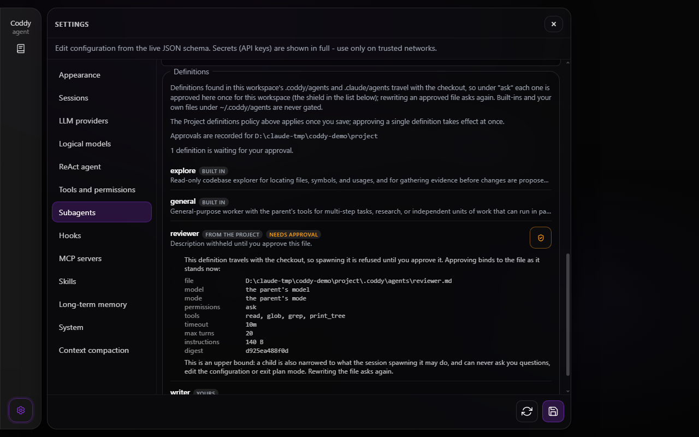

A background subagent that needs a permission after the turn that spawned it has ended asks in the chat of its parent session: the prompt waits at the end of the conversation in the same card an inline prompt uses, the subagent named in its head (`SubagentPermissionCards`, `chat/SubagentPermissionCard.tsx`). The chat reads it from `pending_permission` on the session's background task rows, re-reads those rows on the `subagent_permission` event of `GET /coddy/events` (the task poll is the fallback), and answers against the **child** session with `POST /coddy/sessions/{child}/permission`. A prompt answered elsewhere first - a console attached over `--remote`, a Telegram chat - leaves the chat on the next read. See `docs/features/subagents.md` (Detached runs). A prompt the child raised while the parent was still replying shows first as an inline card of that turn; when the turn ends before it is answered, the relay withdraws that copy and raises the prompt again at the end of the chat, so the inline card is retired with its stream and the card at the end is the one that answers.

Multiple requests keep the transcript's 10px spacing. A new request scrolls into view when you are following the end of the chat; reading older messages keeps your position. Routine task refreshes do not move the viewport.

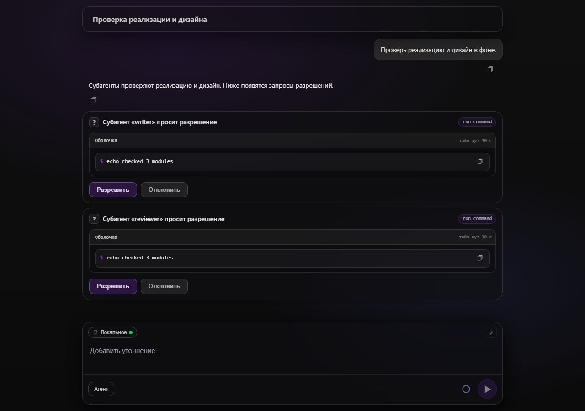

*The real ChatScreen rendered with two deterministic pending task rows, Dark theme, 1280px wide.*

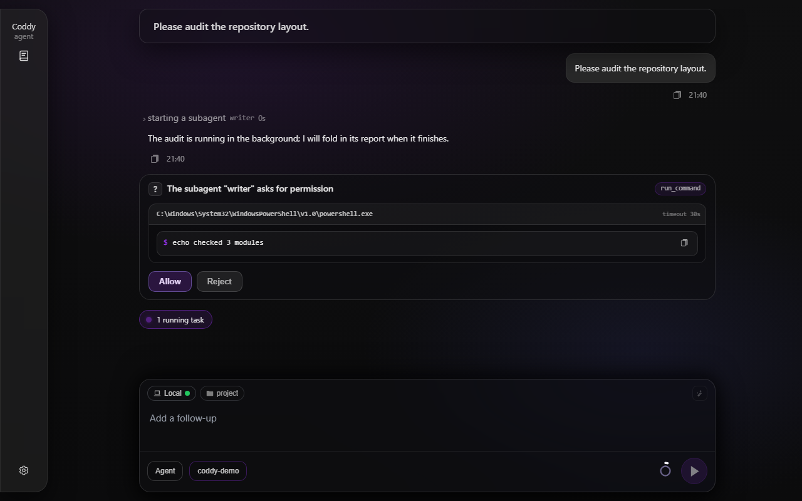

Automated checks:

- **external/ui/src/ui/settings/subagentCatalog.test.ts** (inherited and declared facts, formatting, scope badge keys)
- **external/ui/src/ui/settings/subagentsApi.test.ts** (workspace in the query, normalised catalog, server error messages, offline)
- **external/ui/src/ui/settings/SubagentsSection.test.tsx** (rows with scope, description and file, no control on any row, the passive needs-approval badge, declared bounds behind a disclosure, failed load, Russian copy)
- **external/ui/src/ui/settings/subagentsCatalogCss.test.ts** (the catalog cannot outgrow the panel, facts label column, amber badge)
- **external/ui/src/ui/settings/SettingsSection.test.tsx** (the subagents kind keeps its form and asks about the session workspace)
- **external/ui/src/ui/chat/SubagentPermissionCard.test.tsx** (answered against the child session, only waiting tasks and oldest first, nothing while none waits, title prefix, Russian copy)
- **external/ui/src/ui/chat/ChatScreen.test.tsx** (the prompt waits at the end of the parent chat and answering re-reads the tasks)
- **external/ui/src/ui/chat/serverEvents.test.ts** (a `subagent_permission` frame names the chat it belongs to)
- **external/ui/src/ui/chat/relayedPermissionPrompts.test.ts** (the unresolved prompts a finished turn relayed for its subagents are retired with its stream; the parent's own prompts stay)

### Hooks

**Settings > Hooks** is a schema-driven object tab (`settings-tab-hooks`): the `hooks` config section (`enabled`, `files`, `project_trust`, `default_timeout_seconds`, `stop_loop_limit`, `max_output_chars`) with localized labels and blurbs (`settings.section.hooks.*`, `settings.schema.hooks.*`) and the defaults of `SchemaExampleConfigJSON` as placeholders. Definitions themselves live in JSON files (`docs/features/hooks.md`); the tab edits where they are read from and how project files are trusted.

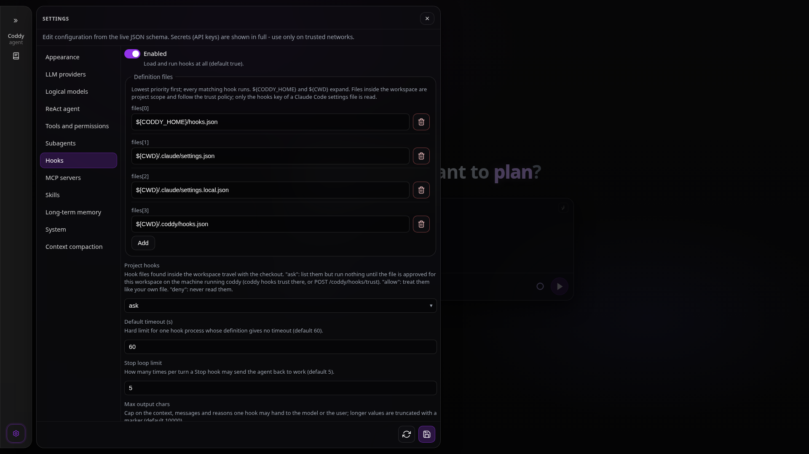

A held project hooks file surfaces in the transcript as a **notice-level system row**: `GET /coddy/sessions/{id}/messages` carries it in `uiLog` with `level: "notice"`, the SPA renders it with the same `SystemNoticeMessage` as an error row (`system_notice` transcript item, `level: "notice"`) in a calmer blue palette, `role="status"` instead of `role="alert"`, the copy control, and **no retry control** even when the row is the last item. Rows with any other level stay invisible rather than mis-rendered.


- **external/ui/src/ui/messages/SystemNoticeMessage.test.tsx** (notice row: status role, notice class, no retry)
- **external/ui/src/ui/settings/settingsSections.test.ts** (translated label and blurb for the `hooks` config tab)

### Subagent transcripts

A child session is read-only: `GET /coddy/sessions/{id}/messages` returns `subagent {parentSessionId, name, taskId}` and `readOnly: true`, and every prompt against it is refused with 409. The SPA reads those two fields (absent on an ordinary session), renders the transcript with the usual message renderer, and replaces the composer with a notice (`SubagentReadOnlyNotice`): "Read-only transcript of subagent `<name>`. Prompts go to the parent chat." with an **Open parent chat** link to `#/s/<parentSessionId>`. Retry, message editing and the plan card's **Run plan** / **Discard** are withheld for such a session (the handlers are not passed at all, so a `plan_document` card renders without its footer and its markdown editor is read-only), and the chat header reads "Subagent `<name>`" because a child has no History row to name it. Child sessions are hidden from History, and nothing about a child's id sets it apart, so the shell fetches any id opened from the Tasks panel or by URL and lets the messages endpoint answer.

Automated checks:

- **external/ui/src/ui/chat/subagentTranscript.test.ts** (marker parsing, bare `readOnly`)
- **external/ui/src/ui/chat/SubagentReadOnlyNotice.test.tsx** (copy with and without a name, parent link href, same-tab open vs modifier click)
- **external/ui/src/ui/chat/ChatScreen.test.tsx** (notice replaces the composer in the docked and the hero layout)
- **external/ui/src/ui/chat/subagentReadOnlyCss.test.ts** (notice and link use theme tokens)
- **external/ui/src/ui/chat/PlanDocumentSection.test.tsx** (a card without action handlers has no footer, a read-only editor and no autosave)
- **external/ui/src/ui/messages/MessageList.test.tsx** (plan card on a read-only transcript renders without Run plan and Discard)
- **external/ui/src/ui/i18n/messagesParity.test.ts** (new keys exist in every dictionary)
- **external/ui/src/ui/settings/settingsSections.test.ts** (translated label and blurb for the `subagents` config tab, which is a hybrid tab keeping its schema key)

## Live token usage

- UI must show token counters while the agent is working.
- Counters update when SSE event `token_usage` arrives.
- Update granularity is per completed backend model call, not per generated token.
- UI restores token counters after restart via `GET /coddy/sessions/{id}/stats`.

## Provider account usage

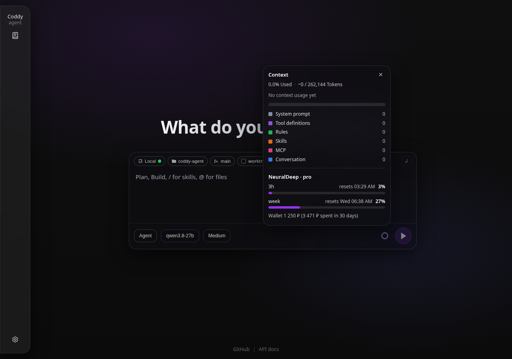

*The usage popover under the context counter*

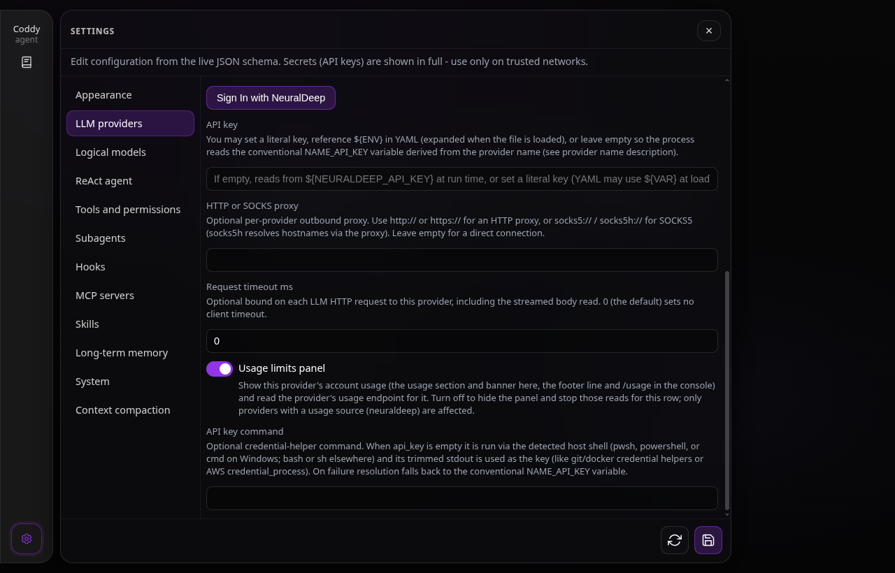

*The usage panel switch on the provider row*

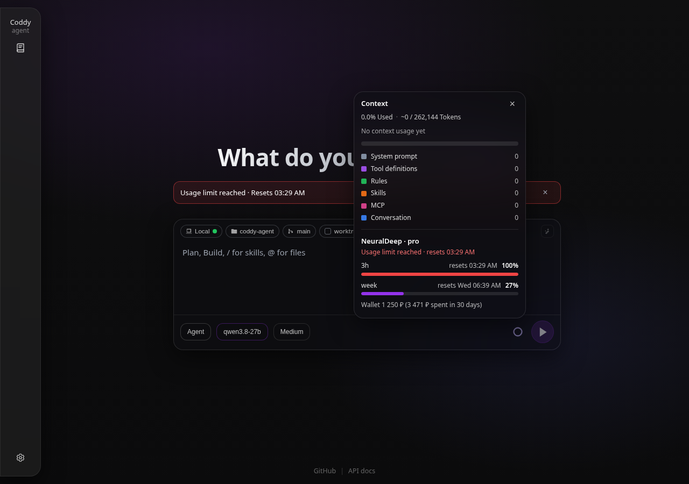

*A window exhausted: the composer reports the reset time*

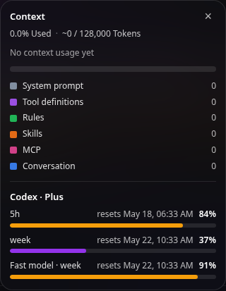

*A Codex subscription in the usage section: duration-labelled windows and a feature-scoped entry*

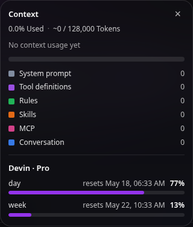

*A Devin subscription in the usage section: daily and weekly quota meters*

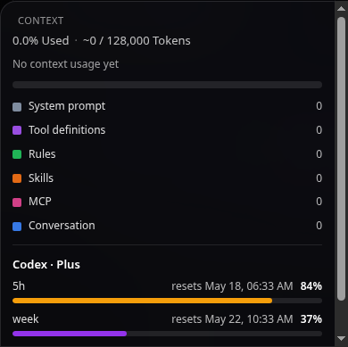

*The Codex usage section as a bottom sheet on a phone*

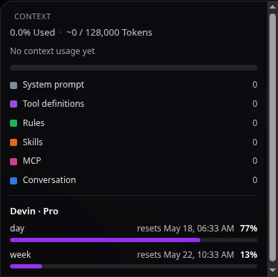

*The Devin usage section as a bottom sheet on a phone*

- When the selected model's provider reports account usage (today
  `neuraldeep`, `codex` and `devin`), the **context popover** (the context ring next to Send)
  ends with a **usage section**, the way Claude Desktop lists its plan
  limits under the context window: the provider and plan, one meter per
  metered window with its reset time in the browser's clock, the label in
  the UI language and the percent used, the wallet in rubles, and a note
  when something changed: a hit limit with its reset (or the cause of a
  block no clock lifts), a model on the provider's unlimited option, a
  rejected login, a stale read, a turn waiting for the reset. The windows
  shown are the ones the source reports: NeuralDeep's session/week/day,
  Codex's duration-labelled windows (`5h`, `week`, and feature-scoped
  entries such as `Fast model · week`), Devin's `day`/`week` quota meters
  or its `ACU` meter; a source with no quota to report shows the plan with
  a `quota unavailable` note, never an invented meter. Only NeuralDeep
  hides a day meter at zero and reports a wallet. At 80 % the
  meter turns amber and a **banner** above the composer says `You've used
  85% of your NeuralDeep 3h limit · resets 20:59`, dismissable per provider
  row, window and period; on a block the banner turns to the error tone: a
  timed block reads `Usage limit reached · Resets 20:59`, an empty wallet,
  a blocked key or account and a rate limit name their cause; while the
  agent waits for the reset it reads `Usage limit reached · Auto-resuming
  at 20:59`.
- The row's **Usage limits panel** switch in Settings → LLM Providers
  (`providers[].usage_limits_panel`, on by default) hides the section and
  the banner and stops the reads behind them: the route then answers
  `unsupported` with `disabled: true`, and the hook drops the snapshot it
  showed for that row.
- Data comes from **`GET /coddy/providers/{name}/usage`** (session open,
  model change, after each finished turn of the viewed session, one read
  after a window's reset, one cache read when the server deferred a refresh)
  and from **`event: provider_usage`** on **`GET /coddy/events`** between
  turns. Nothing polls otherwise; snapshots order by the server's read time,
  so a slow answer never brings older numbers back. Visual contract:
  **`DESIGN.md`** (**Context popover usage section and usage banner**); design record
  **`docs/plans/neuraldeep-usage.md`**.

## Markdown rendering

- Tool outputs are excluded; they stay raw monospace text (**`ToolCallMessage`**).
- **User** messages are plain text with preserved line breaks (**`UserMessage`**).
- **Assistant** messages may contain Markdown.
- UI renders Markdown with fenced code blocks and syntax highlighting.
- The extended language registry covers the [63-language NeuralDeep audit](../contributing/syntax-highlighting-audit.md), including Pascal/Delphi, GML, assembly, PowerShell, GDScript, HLSL, WGSL, COBOL, and VBA. See the audit for exact labels and limitations: PL/SQL/OpenCL/CUDA receive base-language coloring, while UnrealScript/TADS/URQ remain plain text. Captured responses are tested offline without credentials.
- `vue` fences highlight component markup and ordinary `<script>` / `<style>` contents as JavaScript / CSS. Vue interpolations and `lang="ts"`, SCSS, or other preprocessors do not have dedicated Vue-aware parsing.
- `postcss` fences use the CSS highlighter, including selectors, properties, numbers, and comments. Plugin-specific PostCSS syntax may remain uncolored.
- Label fences with the language (for example `js`, `css`, `html`, `json`, `ts`, `python`, or `go`) to enable highlighting. Unlabelled or unsupported languages stay plain text. Highlighting also works while an answer is streaming.
- Code colors follow all seven appearance themes immediately when switching themes. Each theme defines the shared `--syntax-*` palette in `external/ui/src/styles.css`; no separate syntax-theme setting is needed.
- Each code block has a copy button that copies only that block content.

## Markdown line editor (shared)

Implemented as **`MarkdownLineEditor`** (`external/ui/src/ui/markdown/MarkdownLineEditor.tsx`). Used for:

- Scheduler job **`body (markdown)`** (`SchedulerJobEditorSheet`, default **`minRows`** **10**).
- Plan document card markdown mode (`PlanDocumentSection`, **`minRows`** **4**, class **`md-line-editor--plan`**).

Behaviour (see **`DESIGN.md`**, **Markdown line editor**):

- Full parent width; editor height follows content (minimum logical rows); **no** scrollbar on the inner **`textarea`**.
- Gutter shows one number per **logical** line (`\n`-separated). Wrapped visual lines leave **blank** gutter cells (no duplicate numbers).
- Caret logical line: highlight spans **all** visual rows of that line; active gutter number tinted.
- Wrap measurement uses a hidden probe with the same font and text width as the textarea; visual rows = **`ceil(height / lineHeight)`**.
- Long unbreakable tokens wrap (**`overflow-wrap: anywhere`**); no horizontal scroll inside the editor.

Automated checks:

- `external/ui/src/ui/markdown/MarkdownLineEditor.test.tsx`
- `external/ui/src/ui/markdown/markdownLineGutter.test.ts`

## Plan document card (plan mode transcript)

Transcript type **`plan_document`** renders **`PlanDocumentSection`** in the main chat column (not a right rail).

Data and API:

- Persisted in **`messages.json`**; hydrated fields include **`slug`**, **`name`**, **`overview`**, **`content`**, optional **`body`**, **`path`**, **`discarded`**.
- Body edit: **`PUT /coddy/sessions/{id}/plans/{slug}`** with **`{ "body": "<markdown>" }`** (debounced autosave).
- Discard: **`DELETE /coddy/sessions/{id}/plans/{slug}`** sets **`discarded: true`**; card remains visible, controls disabled.
- Run plan: client triggers implementation run (metadata / prompt; see **`docs/reference/acp-protocol.md`**).

UI requirements:

- Collapsed: title, one-line description, **Discard** and **Run plan** in footer; title **`title`** tooltip = absolute plan file path when known.
- Expanded: **Preview** default (rendered markdown via **`Markdown`**); eye toggle switches to **`MarkdownLineEditor`**.
- Content pane grows with document length for **both** preview and markdown (**no** inner max-height scroll on the pane).
- Expanded desktop (**`min-width: 640px`**): title row and action buttons share the top row; body full width below.
- Editor body excludes YAML frontmatter (client **`planEditorBody`**); preview uses the same body text.
- Read-only transcript (subagent child session): **`MessageList`** passes neither **`onPlanDocumentRun`** nor **`onPlanDocumentDiscard`**; the card then renders without its footer (**`.plan-document-card--readonly`**), the markdown editor is read-only and no autosave is scheduled. Each footer button appears only when its own handler exists.

Automated checks:

- `external/ui/src/ui/chat/PlanDocumentSection.test.tsx`
- `external/ui/src/ui/messages/MessageList.test.tsx` (handler forwarding, read-only transcript)

## Plan and todo list (legacy rail)

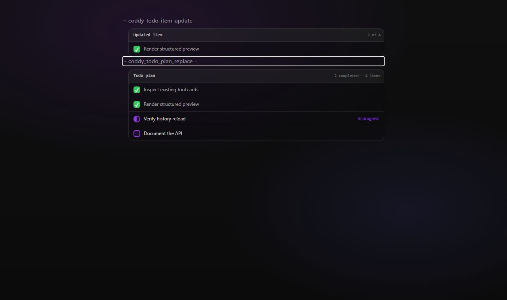

*The todo checklist rendered from a coddy_todo tool call*

- Optional right-rail plan entries (if present in a build) use **`GET /coddy/sessions/{id}/plan`**, **`PUT`**, **`POST .../plan/archive`**.
- Distinct from the **`plan_document`** transcript card above.

## Long term memory

Memory tree roots

- `global`
- `workspace`

Tree API

- `GET /coddy/sessions/{id}/memory/tree`
  - Without `root` returns the roots list.
  - With `root` and optional `path` lists children.
- Only `.md` and `.txt` files are listed.
- Path traversal must be rejected.

File API

- `GET /coddy/sessions/{id}/memory/file` reads.
- `PUT /coddy/sessions/{id}/memory/file` writes.

## MCP servers (Settings tab)

Functional checklist for the Settings -> MCP servers tab (`MCPSection.tsx`,
section kind `mcp`; visual contract in `DESIGN.md`). Screenshot:
`docs/assets/screenshot-fullhd-settings-mcp.png` (a connected global server plus
a project-local one awaiting workspace approval):

- `GET /coddy/mcp` backs the list: merged `config.yaml` + global `~/.coddy/mcp.json`
  + project `./.coddy/mcp.json` servers, each with `source` (`global` / `local`
  scope badge), `origin` (`config` / `home` / `project`) and `source_path` (the
  real file, which is what the badge tooltip names), `readonly` (config.yaml entries), probe
  `status`, and its tool inventory.
- Status dot per server: connected (green), error (red, tooltip shows the probe
  error), disabled (gray), unknown transport type (amber, `unsupported`),
  awaiting workspace approval (amber, `needs_approval`), refused by
  `mcp.project_trust: deny` (red, `denied`).
- The tab holds **two fieldsets**: **MCP discovery** (`.mcp-discovery-box`) above
  **MCP servers** (`.mcp-servers-box`). Discovery carries the `mcp.project_trust`
  policy (`mcp-project-trust` select, `POST /coddy/mcp/project-trust`) and the
  explanation of why project entries are gated; it is not a settings section of
  its own, because it governs exactly the servers listed under it, and like the
  rest of the tab it persists on change instead of joining Save all.
- Workspace trust for project-local rows (`gated: true`): a shield button
  (`mcp-trust-{name}`) posts `POST /coddy/mcp/{name}/trust|untrust`, and a
  `needs_approval` row carries a note (`mcp-trust-note-{name}`) with the
  `source_path` it was declared in plus the declaration the approval covers
  (`.mcp-trust-facts`, from `declarationFacts` in `mcpServerJson.ts`):
  transport, `runs` (command + args) or `contacts` (url), the **names** of the
  env vars and headers, and the workspace. Values are never rendered. The shield
  renders **only under `ask`** (`showsTrustControl` in `mcpServerJson.ts`):
  `allow` starts every project server anyway and `deny` starts none, so there is
  no per-server decision left to offer. Such a row is not probed, so it lists no
  tools; the command line stays visible because it is what the operator
  approves. The shield is absent for `global` rows and disabled under `denied`.
- Server switch toggles `POST /coddy/mcp/{name}/enable|disable`; the change
  persists into the file that defines the server.
- Expanding a row lists tools with per-tool switches
  (`POST /coddy/mcp/{name}/tools/{tool}/enable|disable`); tool switches are
  locked while the server is disabled.
- Edit and Delete are locked for `readonly` (config.yaml) rows; mcp.json rows
  of both scopes stay editable. Delete calls `DELETE /coddy/mcp/{name}`, Edit
  opens the JSON editor card inline with the scope pinned to the owning file.
- Add server opens the editor prefilled with a Cursor-style entry template and
  a Local/Global scope picker (default Local); Save issues
  `PUT /coddy/mcp/{name}?scope=local|global` after client-side validation
  (`mcpServerJson.ts`: JSON object, `command` or `url` required, name without
  `__`, spaces, or path separators).
- Refresh re-probes all servers via `GET /coddy/mcp?refresh=1`.
- List refreshes never unmount the list (initial-load-only placeholder), so the
  drawer scroll position is preserved.
- The tab does not participate in the settings document Save all flow.

## Swarm screen

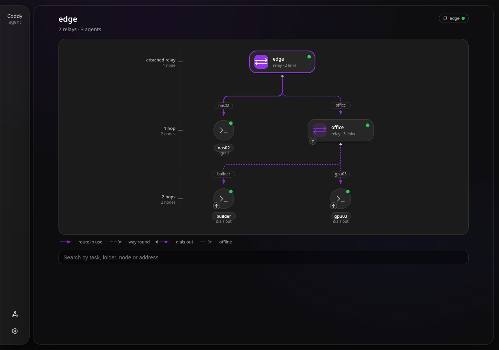

*The swarm screen with relays, nodes and rings*

Guide: `docs/operate/swarm.md`. Visual contract: `DESIGN.md` (**Swarm screen**).

- The **Swarm** rail entry appears only where `GET /swarm/info` answers, so a plain
  agent never shows it. It sits at the foot of the rail, next to Settings.
- On a relay the swarm map **is** the home screen: no composer, no `ChatScreen`,
  no History entry and no Scheduler entry, because a relay holds no sessions of
  its own. Its header carries the environment selector, which normally lives in
  the composer.
- **Clicking a node on the map connects to it.** There is no list of nodes under
  the map and no filter chips: from a node, every ordinary screen (chat,
  history, scheduler, settings, workspace) works against it, and **Swarm** in
  the rail returns to the relay.
- Clicking a node that is **asking a question** opens that session, not an empty
  chat; a node that is merely busy opens its running session; an idle one opens
  its home.
- The map marks the node the app is on as *you are here* and draws the route to
  it from the attached relay as one connected accent path; everything off that
  route recedes. Hovering another node previews where a click would take you.
- Each node says what it is doing: a session count when idle, a running count
  while a turn is in flight, and *needs an answer* when something there waits on
  a permission prompt. A running node pulses, a waiting node pulses differently,
  and the hops to a running node carry a travelling dash. All of it comes from
  `GET /swarm/sessions` and all of it stops under `prefers-reduced-motion`.
- Search runs on the relay, not in the browser, so it reaches nodes this
  browser cannot dial. Matching sessions appear as rows under the map only while
  there is a query; a row opens that session on its node. Nodes that did not
  answer are listed as warnings above the map rather than dropped.
- On a phone (below 1200 px) the screen opens under the top bar and above the
  dimmed backdrop, so taps reach the map, the search and the nodes; tapping the
  top bar's own entries still leaves it.
- Built with `-tags "swarm ui"` the relay serves this SPA at its own address;
  without the `ui` tag its root explains how to rebuild.
- The environment selector in the map header opens **downward**, because on a
  relay the chip sits at the top of the window rather than in the composer at
  the foot.

## Documentation screen

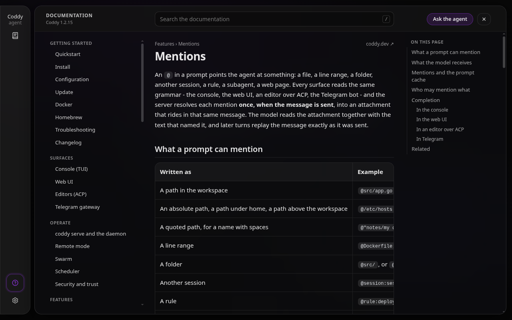

*The documentation reader: contents, the page, the sections of the page*

Guide: `docs/features/built-in-docs.md`. Visual contract: `DESIGN.md` (**Documentation screen**).

- **Docs** in the rail (above Settings), **F1** anywhere in the app, or an address
  **`#/docs/<page>#<section>`** opens the reader (**`ui/docs/DocsView.tsx`**) in the
  same glass dock the swarm screen uses. The rail entry reopens the page the
  reader was left on; **`#/docs`** alone settles on the first page of the
  contents with **`replaceState`**, so Back does not return to an empty reader.
  **F1** again or the **×** control closes it and returns to where it was opened
  from (a chat, the swarm screen, the scheduler); a click on the backdrop closes it too.
- **`/docs [words or page]`** in the composer is the console's command, run in the
  browser (**`ui/docs/docsCommand.ts`**, **`Composer`** **`onDocsCommand`**): the
  draft is cleared and nothing is sent, while a turn runs as well. Alone it
  reopens the book; an argument with a **`/`**, **`#`** or scheme, or the exact title
  of the page **`GET /coddy/docs/page`** resolves it to, opens that page at its
  section; any other words open the reader with the search typed in and its hits
  open (**`searchSeed`**). The Commands group of the slash menu lists **`/docs`**
  beside the server's commands.
- The data comes from **`GET /coddy/docs`** (contents), **`GET /coddy/docs/page`**
  (one page with its headings and neighbours) and **`GET /coddy/docs/search`**
  (**`ui/docs/api.ts`**), through the environment shim like every other route, so
  a remote environment shows the documentation of the binary it talks to.
- Every page, section, hit and neighbour is a real **`href`**: following one adds
  a history entry (Back and Forward move between pages read), a middle click opens
  a new tab, and the **`#`** after a section heading is that section's address. A
  **`coddy:<page>#<section>`** link in any rendered Markdown - a page, or an answer
  of the agent - becomes **`#/docs/<page>#<section>`** (**`docsHrefFromCoddyLink`**
  in **`scheduler/hashRoute.ts`**, used by **`markdown/Markdown.tsx`**). A malformed
  escape in a pasted address is kept as typed rather than taking the router down.
- Headings get the anchors the server computed, paired by level and text
  (**`assignHeadingIds`** in **`ui/docs/docsReader.ts`**), then the reader scrolls to
  the section the address names. **On this page** follows the section being read as
  the page scrolls; below 1280 px it is left out, below 1200 px the contents fold
  into a **Contents** button above the page.
- The header sits on the columns of the page: the title over the contents, the
  search box over the text, **Ask the agent** and the close control over the
  outline. The header does not scroll: the page scrolls in the body under it
  (**`.docs-body`**), so its scrollbar starts below the search box. The reader
  grows no wider than its three columns (1350 px) and stays centred, so the
  outline keeps to the text on a wide window.
- The search box (**`/`** focuses it; the reader opens with the keyboard on the
  page, so the arrow and page keys scroll it) searches as it is typed, 120 ms after
  the last key, and drops the hits under itself while the contents stay: page ›
  section, and the snippet with the matched words marked. It is a combobox: Up and
  Down move the selection (**`aria-activedescendant`**), Enter opens the selected
  hit and folds the list away, Escape clears.
- A click on an image of the page opens it over everything (**`ui/components/ImageLightbox.tsx`**,
  rendered into the body): fitted first, **`+`** / **`-`** / the buttons zoom from
  100% to 300%, a click on the image toggles fitted and 200%, **`0`** fits again,
  Escape or the close control closes it. A zoomed image is **dragged** with the
  mouse, a pen or one finger (the cursor is the open hand, closed while it holds),
  the **wheel** over the image zooms around the pointer rather than scrolling the
  stage or the page behind it (a wheel down over a fitted image does nothing), and
  on a touch screen a **pinch** of two fingers zooms
  continuously between the fitted size and 300%, keeping the point between them
  where it is; a press that travelled pans and does not also toggle the zoom, so
  the click still works for a press that stayed put. The buttons and the keys keep
  the 100 / 150 / 200 / 300 ladder and take the next level above or below wherever
  a pinch left the picture. A video of a page
  (a Markdown image whose file is **`.mp4`**, **`.webm`** or **`.mov`**, which is
  what the server makes of a GitHub attachment line) plays in a **`<video>`**
  fetched from GitHub at the release.
- **`@coddy:<page>#<section>`** is a link to the reader in a sent message
  (**`UserMessage.tsx`**) and in an answer (**`markdown/remarkDocMentions.ts`**),
  read with the grammar of mentions (**`ui/docs/docMentions.ts`**); code stays code.
- **Ask the agent** starts a new chat (**`askAboutDocs`** in
  **`App.tsx`**) whose draft mentions the page, or the section being read; with
  text selected on the page it quotes the selection and mentions the section the
  selection sits in (**`askDraftFor`**, **`sectionAnchorAt`**). The button keeps
  the selection by not taking focus on mouse down, and is disabled while the next
  page loads; the page on screen stays, dimmed, until it arrives. On a relay, where
  there is no chat, the button is not shown.

## Swagger

- Swagger UI is served under `/docs/`.
- OpenAPI spec is served under `/openapi.yaml` and `/openapi.json`.
- Swagger UI assets must be embedded, no CDN.

## Development workflow

- Edit TypeScript sources under `external/ui/src/`.
- Use `npm --prefix external/ui run dev` to iterate without rebuilding the Go binary.
- Build and sync embed assets with `npm --prefix external/ui run build:go`.
- **`make build TAGS="http ui"`** runs the UI build step (**make ui-build**) before linking the embedded bundle.

### Reproducing a Safari report without a Mac

Playwright ships the WebKit build Safari is cut from, and its version tracks Safari's (**`playwright install webkit`** pulls WebKit **26.x** for Safari **26.x**), so a Safari layout report is reproducible on Linux. **`external/ui/scripts/webkit-scroll-check.mjs`** drives a running **`coddy serve`** in that engine and asserts the scroll invariants of the folder browser dialog across short viewports: nothing laid out past the dialog's height cap, the action buttons inside the dialog, the list scrolling on a wheel gesture, and the overscroll staying in the dialog.

```bash
cd external/ui && npm i --no-save playwright && npx playwright install webkit
```

```bash
CODDY_URL=http://127.0.0.1:12345 CODDY_FOLDER=/a/folder/with/many/subdirs npm --prefix external/ui run check:webkit
```

**`CODDY_ENGINE=chromium`** runs the same assertions in Chromium, which separates a WebKit-only regression from a layout bug every engine shares. The script is not part of **`make test`**: it needs a browser download and a live server. **`npm ci`** and **`make ui-build`** prune the unsaved **`playwright`** install, so re-run the install line after a rebuild.

### Checking the fold chevron against its label

The chevron is an SVG whose ink is centred in its viewBox (**`DESIGN.md`**, *Chevron*), because as a text glyph its ink sat wherever the platform's font put it and the reports of a chevron riding above its label kept coming back. Where a mark actually lands is a layout fact, and jsdom has none, so the vitest suite cannot answer it. **`external/ui/scripts/chevron-align-check.mjs`** measures it in a real engine: for a thinking row, a tool row and the Tasks drawer's **Finished N** toggle it compares the ink centre of the chevron with the ink centre of the label's text (a **`Range`** over the text node, so neither the element's padding nor a line height of its own can hide the error), and exits non-zero when they differ by more than **1px**.

It drives **`src/chevron-align-check.html`**, a stand that mounts those three surfaces from the real components against the real stylesheet, so it needs a **`vite`** dev server and no backend at all.

```bash
cd external/ui && npm i --no-save playwright && npx playwright install chromium
```

```bash
cd external/ui && npx vite --port 5241 &
CODDY_UI_URL=http://127.0.0.1:5241 npm --prefix external/ui run check:chevron
```

**`CODDY_ENGINE=webkit`** (or **`firefox`**) runs the same measurements in another engine, and **`CODDY_CHEVRON_TOLERANCE_PX`** raises the allowance. Like the WebKit harness above, this one is **not part of `make test`**: it is a manual check, run when a change touches the chevron, the rows it sits on or the type around them.

## UI test scenarios

These scenarios are intended to be automated via Playwright against the Vite dev server.

- Desktop navigation has no width toggle
  - Given viewport width is at least 1024px
  - When the app loads
  - Then `data-testid="nav-menu"` is visible
  - And `data-testid="nav-toggle-width"` is not present

- Sessions are drawer only
  - Given any desktop viewport
  - When the app loads
  - Then `data-testid="sessions"` is not visible
  - When user clicks `data-testid="nav-menu"`
  - Then `data-testid="sessions"` becomes visible
  - When user clicks `data-testid="sessions-close"`
  - Then the sessions drawer is hidden

- Mobile uses top bar and single line brand
  - Given viewport width is at most 1199px
  - When the app loads
  - Then the nav width toggle is not present
  - And the nav rail height is 78px
  - And sessions can still be opened from the menu button

- A phone fits the start screen and the chat
  - Given viewport width is 360, 390 or 430px
  - When the start screen loads, and again in a chat
  - Then `document.documentElement.scrollWidth` equals `clientWidth`
  - And the `#btn-send` rect intersects no visible part of a `.composer-tab`
  - And the `.rail-brand` rect intersects no top bar icon
  - And every top bar icon lies inside the pill; below about 270px the bar shows History, Settings and More, and More lists Docs and Scheduler
  - And `textarea#composer` computes to 16px
  - When the viewport is 768 or 1280px
  - Then the composer rows wrap and the top bar looks as before the phone block

- Enter follows the input device
  - Given a desktop browser window 390px wide
  - When the user types a draft and presses Enter
  - Then the draft is sent
  - When the user presses Ctrl+Enter in the middle of a draft
  - Then a newline appears at the caret and nothing is sent
  - Given a touch-only device (Playwright context with `isMobile` and `hasTouch`)
  - When the user presses Return
  - Then a newline is inserted, and the Send button sends

- Tool calls survive restart
  - Given a session has tool calls executed
  - When the user reloads the page
  - Then tool call cards are visible in the transcript
  - And expanding a tool card shows a structured args preview and a separate raw **Result** panel, without approval buttons
  - And if the server marked the preview truncated, **More…** then **Less** behave as in the table above; if not truncated, there is no overflow-toggle row and no **`tool-result-viewport--tall`** on the result panel

- Tool result truncation (Playwright MCP)
  - Given a persisted session whose tool output on disk exceeds the preview line cap
  - When the user opens the tool card and clicks **More…**
  - Then the button becomes **Less**, full lines are available inside the same max-height scrollable panel, and **`.tool-result-viewport--scroll`** has **`scrollHeight`** greater than **`clientHeight`**
  - When the user clicks **Less**
  - Then the preview shows the capped text ending in **`...`**, **`overflow-y`** is hidden on **`.tool-result-viewport--clip`**, and **More…** appears again

- Token usage survives restart
  - Given a session has non zero token usage
  - When the user reloads the page
  - Then the token usage HUD shows the persisted totals

- Memory run in the Tasks drawer (Playwright MCP)
  - Given **`memory.enable: true`** on the **`coddy serve`** process and at least one Markdown file under global or workspace memory so recall can run
  - When the user sends a chat message that completes a full ReAct turn
  - Then the transcript shows no memory row, and while the run is in flight the live status line reads **Working with memory**
  - When the user opens the Tasks drawer
  - Then a task labelled **`memory: <first line of the message>`** carries the **memory** tag (**`bgtask-tag-<id>`**), its card offers **Show transcript** to the read-only child session without being opened, and its open card shows the child's log ending with **`=== subagent report ===`** and the delivery line

For Playwright MCP against a live gateway, start **`make build TAGS="http ui memory"`** then **`./build/coddy serve`** with a disposable **`--home`** so config can enable memory; open **`http://127.0.0.1:<port>/`**, navigate to a session, send a prompt, open the Tasks drawer and assert the **memory** badge on the run's row.
