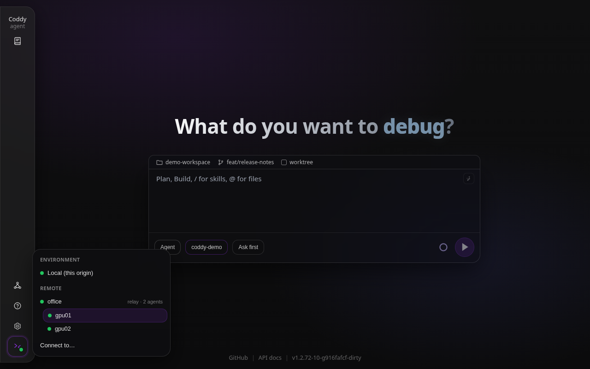

# A swarm across your machines

**Goal.** Worker nodes on several machines, one relay they all join, and your laptop driving any of them from its own web UI and its console: the relay in the laptop's environment menu with its agents listed under it, one click to a worker, the map of the whole swarm a click away. Nothing but the relay's port has to be reachable: the workers dial out to it.

**Environment.** Coddy 1.2.36 or later on every machine ([Install](../getting-started/install.md)), with the `swarm` tag the release binaries carry. A model each worker can reach, with its key on that worker: the model calls and the tools run where the worker runs. The background is in [Swarm](../operate/swarm.md) and [Remote mode](../operate/remote.md); the same shape in Docker on one machine is [A relay and its nodes in Docker](swarm-relay-and-nodes.md).

The example uses these machines; put your own names and addresses in their place:

| Role | Machine | Address the others use |
|---|---|---|
| relay | `relay` | `relay.lan`, port 12346 |
| worker | `gpu01` | none needed |
| worker | `gpu02` | none needed |
| laptop | yours | none needed |

## 1. Three tokens

A relay is guarded by tokens, not by the network ([Security](../operate/swarm.md#security)). Mint three on any machine and keep them for the steps below:

```bash
openssl rand -hex 24   # client token: what the laptop presents to use the relay
openssl rand -hex 24   # pairing token: what a worker presents to join it
openssl rand -hex 24   # one worker token per worker: its own API's bearer
```

The client token opens every node behind the relay, so it is handled like a password to the whole fleet.

## 2. The relay

On `relay`, `~/.coddy/.env` holds the tokens (`chmod 600`):

```bash
SWARM_CLIENT_TOKEN=<client token>
SWARM_PAIRING_TOKEN=<pairing token>
```

and `~/.coddy/config.yaml` runs nothing but the relay. `cors` names the address your laptop's web UI is opened at, because that page will talk to the relay from the browser:

```yaml
httpserver:
  enable: false

swarm:
  enable: true
  host: "0.0.0.0"
  port: 12346
  name: "office"
  auth_token: "${SWARM_CLIENT_TOKEN}"
  pairing_tokens: ["${SWARM_PAIRING_TOKEN}"]
  cors:
    enable: true
    allowed_origins: ["http://localhost:12345", "http://127.0.0.1:12345"]
```

```bash
coddy serve --dry-run   # the address is free, the tokens and the file are right
coddy serve install     # a systemd user service; or `coddy serve` in a terminal
curl -s http://relay.lan:12346/swarm/info
```

`/swarm/info` needs no token and says `"swarm": true` with `node_count: 0`. An origin is compared exactly, so list every address you open the laptop's page at; the relay picks up an edit of this file by itself.

## 3. The workers

On each worker, `~/.coddy/.env`:

```bash
OPENAI_API_KEY=sk-...
SWARM_PAIRING_TOKEN=<pairing token>
NODE_TOKEN=<this worker's token>
```

and `~/.coddy/config.yaml` - an ordinary `coddy serve` with a model, a bearer token on its own API and one `swarm.join` entry. There is no `advertise_url`, so the worker dials the relay and is driven back down that connection; it needs no open port:

```yaml
providers:
  - name: openai
    type: openai
    api_key: "${OPENAI_API_KEY}"

models:
  - model: "openai/gpt-5.6-terra"

agent:
  model: "openai/gpt-5.6-terra"

httpserver:
  auth_token: "${NODE_TOKEN}"

swarm:
  join:
    - url: "http://relay.lan:12346"
      name: "gpu01"                     # gpu02 on the second worker
      pairing_token: "${SWARM_PAIRING_TOKEN}"
      token: "${NODE_TOKEN}"            # the same value as httpserver.auth_token
```

```bash
coddy serve --dry-run   # the relay is reachable from here
coddy serve install
```

The relay's log gets a `swarm node registered` and a `swarm tunnel established` line per worker, and from any machine:

```bash
curl -s -H "Authorization: Bearer <client token>" http://relay.lan:12346/swarm/nodes
```

lists `gpu01` and `gpu02` with `"transport": "tunnel"` and `"online": true`.

## 4. The laptop

The laptop runs its own `coddy serve` for the web UI ([Quickstart](../getting-started/quickstart.md)), at `http://localhost:12345` by default. The relay goes into its `~/.coddy/config.yaml` as a remote, with the client token kept out of the file:

```yaml
httpserver:
  remotes:
    - name: "office"
      url: "http://relay.lan:12346"
      token: "${CODDY_RELAY_TOKEN}"
```

```bash
echo 'CODDY_RELAY_TOKEN=<client token>' >> ~/.coddy/.env
```

The `token` line is optional. With it, the environment menu and `coddy --remote office` use the token without asking, and every browser that opens this laptop's page receives it from the configuration; without it, you type the token once per browser into **Connect to…** ([The token](../operate/remote.md#the-token)). Asking the agent to add the remote works as well: it stages the same entry and commits it, and the menu shows the new remote the next time it opens.



*The relay in the laptop's environment menu: green, with its workers under it*

Open the environment menu from the foot of the rail. `office` has a green dot and says `relay · 2 agents`, with `gpu01` and `gpu02` under it. Click `gpu01`: the page reloads onto that worker - its sessions in History, its folder and its models in the composer, its configuration in Settings - through the relay. A turn you start runs on `gpu01`.

The **Swarm** entry in the rail opens the relay's map over the worker without leaving it. Your laptop sits at the top, named by its host name, the relay under it and the workers under that; the worker you are on is ringed. Click `gpu02` to move there - the map stays open, now ringing `gpu02`, and the page does not reload - the laptop to go back to Local, the relay to connect to the relay itself.


*The map over `gpu01`: the laptop the connection starts from, the relay, both workers*

On the relay itself its Settings edit the relay's own deployment - the CORS origins among them - and a save is applied at once ([The relay's own Settings](../operate/swarm.md#where-the-settings-live)).

## 5. The console

The laptop's console reaches a worker through the relay's mount. The relay's entry in `httpserver.remotes` carries the token, and a node mounted under that relay takes the same one, so no flag is needed:

```bash
coddy --dry-run --remote http://relay.lan:12346/swarm/nodes/gpu01
coddy --remote http://relay.lan:12346/swarm/nodes/gpu01
coddy -p "What is in the workspace?" --remote http://relay.lan:12346/swarm/nodes/gpu02
```

`coddy --dry-run --remote office` says `office` is a relay and prints the mounts of its agents, because a relay drives nothing itself and the console needs a node. `coddy acp` takes the same `--remote` for an editor ([Working with remote nodes](swarm-remote-nodes.md)).

## What tends to go wrong

- **The relay's dot is red and says the answer was blocked by CORS.** The relay does not list the address the laptop's page is open at. The line under the relay names that exact origin: add it to `swarm.cors.allowed_origins` on the relay, in its file or in its own Settings. `localhost` and `127.0.0.1` are two origins.
- **The dot is red and says the relay refuses the token.** The token the laptop presents is not the relay's `swarm.auth_token` (or `--swarm-auth-token`). With a `token` in the laptop's entry, fix it there; without one, **Enter token** under the relay opens the form filled in for it.
- **The dot is red and says the relay does not answer.** Nothing listens at that address from the laptop: check `curl http://relay.lan:12346/swarm/info` from the laptop, the relay's `host`, and a firewall between them.
- **The relay is green, but no worker is listed.** No worker has joined: the worker's log says whether its registration was refused. A pairing token is compared exactly.
- **A worker is listed, but a turn there fails with 401.** The `token` in the worker's `swarm.join` entry is not its own `httpserver.auth_token`; the relay presents that value when it proxies.
- **`coddy --remote office` gets nowhere.** `office` is the relay, which serves no sessions. Point `--remote` at a worker's mount; the dry run lists them.
- **A remote added to the laptop's config is not in the menu.** It is read when the menu opens, so close the menu and open it again; the laptop's server has to have loaded the file, which it does by itself within a few seconds of an edit.
- **After a save of the relay's settings the workers are gone for a moment.** A save rebuilds the relay, and the workers register and open their tunnels again within seconds; a new listen address takes a restart of the relay.
